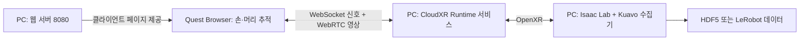

# HumanoidScene: Kuavo Isaac Lab workcell

Kuavo S200062 humanoid가 경사진 랙의 열린 박스를 빈 컨베이어 공간으로 옮기고,
모든 박스를 처리한 뒤 실제 물리 버튼을 누르는 Isaac Lab 환경이다. 편집 가능한
standalone scene과 manager-based 환경, Meta Quest 양손 teleoperation, head/wrist
camera, LeRobot Dataset v3 수집, GR00T N1.7 action 평가 코드를 함께 제공한다.
기본 모델은 내장 2-finger gripper와 양쪽 D405 형상을 가진 `s200062`이며,
`--robot-model s63`으로 기존 S63 + 외장 Robotiq 구성을 비교할 수 있다.

다른 컴퓨터에서 시작할 때는 [설치 및 첫 실행 가이드](docs/INSTALL.md)를 먼저
따르면 된다. 저장소에는 실행에 필요한 Kuavo/Rack/Box USD, URDF, mesh와 기본
layout JSON이 포함된다. Isaac Sim/Isaac Lab, CloudXR, LeRobot, policy weight는
각 라이선스와 GPU 환경에 맞게 별도로 설치한다.

```bash
git clone git@github.com:paragon7060/HumanoidScene.git
cd HumanoidScene
./install_isaaclab_stable.sh
conda activate env_isaaclab_232
export ISAACLAB_PYTHON="$(command -v python)"
./setup.sh
./run_scene.sh --prefill 2
```

두 로봇 버전을 같은 조건에서 확인하려면:

```bash
./run_scene.sh --robot-model s200062
./run_scene.sh --robot-model s63

./run_manager_env.sh --robot-model s200062 --num-envs 1 --steps 240
./run_manager_env.sh --robot-model s63 --num-envs 1 --steps 240
```

주요 문서:

- [Meta Quest 데이터 수집: 다운로드부터 첫 저장까지](#quest-collection)
- [설치, 의존성, 첫 실행](docs/INSTALL.md)
- [Isaac Sim 배치 편집·위치/회전/크기 캡처](docs/ISAACSIM_WORKCELL_GUIDE.md)
- [Meta Quest 3/3S teleoperation과 LeRobot 수집](docs/QUEST3_KUAVO_TELEOP_GUIDE.md)
- [Leju claw와 교체 가능한 gripper 설정](docs/GRIPPER_CONFIGURATION.md)
- [GR00T N1.7 evaluation](docs/GROOT_N1_7_EVAL_GUIDE.md)
- [외부 asset과 runtime 안내](THIRD_PARTY_ASSETS.md)

<a id="quest-collection"></a>

## Meta Quest 데이터 수집: 다운로드부터 첫 저장까지

처음에는 **PC에서 장면 확인 → CloudXR 파일 준비 → 런타임 서비스 준비 →
Quest 브라우저 연결 → HDF5 한 에피소드 저장** 순서로 진행한다.
LeRobot은 HDF5 수집을 확인한 다음 별도 환경에 연결한다.
이 절의 명령은 별도 안내가 없으면 **Isaac Lab이 설치된 Linux PC의 저장소
루트 `HumanoidScene/`**에서 실행한다. `/absolute/path/...`는 실제 파일 경로로
바꿔야 하는 예시이며 그대로 실행하면 안 된다.

> **현재 제공 범위:** 이 저장소는 Kuavo 장면, OpenXR 입력 어댑터, 수집기와
> 브라우저 미리보기 설치 스크립트, Linux 런타임 실행기와 정적 HTTPS 서버를 제공한다.
> NVIDIA CloudXR SDK 바이너리·Node.js·TLS 인증서는 별도 준비한다.
> `quest_doctor.sh` 통과는 파일 구성 검사 결과이며, 실제 Quest 스트리밍·손 추적
> 성공을 보장하지 않는다. 실기 연결은 아래 절차로 별도 검증해야 한다.

이미 이 PC에 패키지를 준비했다면 [준비된 환경 실행 안내](docs/QUEST_RUNTIME_SERVICE.md)에서
터미널별 명령과 Quest 설정을 바로 확인한다.

바로 이동:
[준비물](#quest-prerequisites) · [다운로드와 파일 설정](#quest-files) ·
[런타임 서비스](#quest-runtime-service) · [웹 클라이언트](#quest-web-client) ·
[Quest 연결](#quest-headset) · [첫 수집](#quest-first-recording) ·
[LeRobot](#quest-lerobot) · [문제 해결](#quest-troubleshooting)

### 1. 먼저 실행 경로를 구분하기

| 목적 | PC에서 실행할 명령 | 필요한 CloudXR 구성 | 데이터 저장 |
|---|---|---|---|
| 로봇과 카메라를 PC 창에서 확인 | `./preview_quest_local.sh` | 없음 | 없음 |
| PC Chrome/IWER 입력과 카메라 연결 확인 | `./preview_quest_browser.sh` + 웹 클라이언트 | CloudXR.js `.tgz`; 외부 런타임은 불필요 | 없음 |
| 실제 Quest 손·머리 추적으로 수집 | `./collect_quest_teleop.sh` + 웹 클라이언트 | 실행 중인 CloudXR Runtime, JSON 및 라이브러리, CloudXR.js `.tgz` | HDF5 / LeRobot |

IWER는 데스크톱 브라우저에서 가상 HMD/컨트롤러 입력을 만드는 도구다.
미리보기에서 로봇이 움직이더라도 OpenXR 수집 연결이 검증된 것은 아니다.
특히 `Local Kuavo IsaacLab (IWER/Quest)` 백엔드의 `8765` 포트와 실제 CloudXR
백엔드의 `49100` 포트를 혼동하지 않는다.



<a id="quest-prerequisites"></a>

### 2. PC와 Quest 준비물 확인

- **PC:** Linux x86_64, Ubuntu 22.04 이상, NVIDIA 그래픽 드라이버와 NVENC를
  지원하는 GPU. Isaac 환경은 이 저장소의 **Python 3.11 + Isaac Sim 5.1.0 +
  Isaac Lab v2.3.2**, conda 환경 이름은 `env_isaaclab_232`를 사용한다.
- **GPU 지원 범위:** NVIDIA의 현재 CloudXR Runtime 요구사항은 Ada/Blackwell
  계열을 명시한다. RTX 3060 같은 Ampere GPU에서 Isaac Sim이 실행되거나
  `doctor.sh`가 통과해도 CloudXR 지원이 확인된 것은 아니다. 사용 중인 SDK 버전의
  [공식 GPU·드라이버 요구사항](https://docs.nvidia.com/cloudxr-sdk/latest/requirement/runtime_req.html)을 먼저 확인한다.
- **웹 클라이언트 개발 도구:** Node.js 20.19.0 이상과 npm.
  [CloudXR.js 요구사항](https://docs.nvidia.com/cloudxr-sdk/latest/requirement/cloudxrjs_req.html)에 맞춰 설치하고
  `node --version`, `npm --version`으로 확인한다.
- **헤드셋:** Meta Quest 3/3S, Meta Quest Browser, 좌우 컨트롤러. 맨손 모드에서는 손 추적 활성화.
  현재 CloudXR.js 문서의 Quest OS 기준은 79 이상이다. 브라우저의 WebXR·손 추적
  권한 요청도 허용해야 한다.
- **네트워크:** PC와 Quest가 서로 접근 가능한 같은 LAN에 있어야 한다.
  PC는 유선, Quest는 5 GHz/6 GHz Wi-Fi를 사용한다. 게스트 Wi-Fi나 기관망의
  기기 간 통신 차단 여부는 [공식 네트워크 안내](https://docs.nvidia.com/cloudxr-sdk/latest/requirement/network_setup.html)를 참고한다.

아직 Isaac 환경이 없다면 [설치 가이드](docs/INSTALL.md)부터 진행한다.
중단된 설치를 재개할 때는 환경을 삭제하지 않고
`./install_isaaclab_stable.sh --reuse-env`를 사용한다.
이미 설치했다면 다음 점검만 실행한다. Quest 때문에 Isaac 환경을 다시 만들 필요는 없다.

```bash
conda activate env_isaaclab_232
export ISAACLAB_PYTHON="$(command -v python)"
./setup.sh --check-only
./quest_doctor.sh
```

이 단계의 `Quest compatibility: OK`는 Isaac Lab의 OpenXR experience와
Isaac Sim extension이 있다는 뜻이다. `CloudXR runtime: not configured`가 함께
나오는 것은 아직 다음 단계의 JSON 경로를 지정하지 않았기 때문이다.

헤드셋을 연결하기 전에 장면과 머리·양손목 카메라를 확인하려면 다음 명령을 실행한다.
확인 후 창을 닫고 다음 단계로 넘어간다.

```bash
./preview_quest_local.sh --robot-model s200062
```

<a id="quest-files"></a>

### 3. 무엇을 어디서 다운로드하는가

아래 두 NVIDIA 패키지는 **서로 별도 다운로드**이며 모두 PC에서 사용한다.
Quest에 `.tgz`를 복사하거나 설치하는 것이 아니다. Quest에서는 PC가 제공하는
웹페이지를 연다. 공식 배포 절차는
[Getting CloudXR](https://docs.nvidia.com/cloudxr-sdk/latest/getting_cloudxr.html)에 있다.

| 받을 것 | 공식 다운로드 | 파일의 역할 |
|---|---|---|
| CloudXR Runtime Linux SDK | [NGC: CloudXR Runtime](https://catalog.ngc.nvidia.com/orgs/nvidia/resources/cloudxr-runtime) | `CloudXR-<version>-Linux-sdk.tar.gz` 안의 런타임 라이브러리·헤더·`openxr_cloudxr.json` |
| CloudXR.js npm 패키지 | [NGC: CloudXR.js](https://catalog.ngc.nvidia.com/orgs/nvidia/resources/cloudxr-js/files) | 이 저장소의 클라이언트 예시는 `nvidia-cloudxr-6.2.0.tgz`를 사용 |

NGC에서 버전을 선택하고 **File Browser → 해당 파일 → Download**로 받는다.
로그인이 요청되면 NVIDIA 계정으로 로그인하고 해당 패키지의 라이선스를 확인한다.
Runtime과 JS의 버전 번호가 반드시 같지는 않으므로
[공식 호환표](https://docs.nvidia.com/cloudxr-sdk/latest/release_notes/release_notes.html#compatibility-matrix)를 확인한다.
이 절은 CloudXR 6.x SDK/웹 클라이언트 경로를 설명한다. Isaac Lab v2.3.2의
예전 안내에 나오는 CloudXR `5.0.1` Docker/Apple 클라이언트 설정을 그대로 섞지 않는다.

**Runtime 압축 파일은 풀고, npm `.tgz`는 풀지 않은 채 npm에 전달한다.**
다운로드한 실제 파일 경로를 지정해 다음처럼 준비한다.

```bash
export CLOUDXR_RUNTIME_ARCHIVE="/absolute/path/to/CloudXR-<version>-Linux-sdk.tar.gz"
mkdir -p .external/cloudxr-runtime
tar -xzf "$CLOUDXR_RUNTIME_ARCHIVE" -C .external/cloudxr-runtime

# 출력된 경로 중 현재 사용할 Linux 런타임의 manifest를 선택한다.
find "$PWD/.external/cloudxr-runtime" -name openxr_cloudxr.json -print
```

검색 결과를 다음 변수에 넣는다. `XR_RUNTIME_JSON`은 **JSON 파일 자체**를,
`CLOUDXR_NPM_TGZ`는 **npm 압축 파일 자체**를 가리켜야 한다.

```bash
export XR_RUNTIME_JSON="/absolute/path/to/openxr_cloudxr.json"
export CLOUDXR_NPM_TGZ="$HOME/Downloads/nvidia-cloudxr-6.2.0.tgz"

test -f "$XR_RUNTIME_JSON" && test -f "$CLOUDXR_NPM_TGZ"
./quest_doctor.sh --require-runtime
```

`openxr_cloudxr.json`은 OpenXR loader에게 어떤 런타임 라이브러리를 로드할지
알려주는 manifest다. JSON 안의 `runtime.library_path`가 실제 `.so`를 가리켜야
하므로 **JSON만 다른 폴더로 복사하거나 빈 JSON을 직접 만들면 안 된다.**
압축을 푼 디렉터리 구조를 유지한다. 위 점검은 JSON 형식과 라이브러리 파일의 존재를
검사하지만 `.so` 로딩, 서비스 기동, GPU 호환성, 헤드셋 접속은 검사하지 않는다.

환경변수는 터미널마다 따로 설정해야 한다. 반복 입력을 피하려면
[.env.example](.env.example)을 참고해 **필요한 변수만** `.env`에 저장하고 새 터미널에서
`source .env`를 실행한다. launcher가 `.env`를 자동으로 읽지는 않는다.
예시 파일의 미사용 `LEROBOT_PYTHON` placeholder까지 그대로 복사하지 않는다.

<a id="quest-runtime-service"></a>

### 4. 런타임 서비스 준비 — JSON 설정만으로 끝나지 않는다

CloudXR 6.x Runtime SDK는 Linux에서 라이브러리와 C API를 제공한다.
`XR_RUNTIME_JSON`을 지정하거나 `npm run dev-server`를 실행하는 것만으로
스트리밍 서비스가 시작되지는 않는다.
[NVIDIA 런타임 시작 안내](https://docs.nvidia.com/cloudxr-sdk/latest/usr_guide/cloudxr_runtime/getting_started.html)는
애플리케이션 내부에서 서비스를 관리하거나, SDK의 `cxrServiceAPI.h`로 별도의
서비스 실행기를 만드는 방식을 설명한다. 문서의 `NvStreamManager.exe` 방식은
Windows 전용이다.

이 저장소의 `./run_cloudxr_runtime.sh`가
[Runtime Management API](https://docs.nvidia.com/cloudxr-sdk/latest/usr_guide/cloudxr_runtime/runtime_mgmt_api.html)로
서비스를 시작·종료한다. SDK를 `.external/cloudxr-runtime`에 풀고 C++ 컴파일러를
준비한 뒤 `./run_cloudxr_runtime.sh --check`로 라이브러리를 확인한다.
클라이언트에 알릴 주소는 `--host <PC LAN IP>`로 지정한다. Runtime 6.2.1은 이
설정과 별개로 신호 포트를 모든 인터페이스에 열 수 있으므로 신뢰하는 LAN에서만 사용한다.
수집 중에는 이 프로세스를 유지한다. HTTPS/WSS 실행과 인증서 설정은
[런타임 실행 안내](docs/QUEST_RUNTIME_SERVICE.md)를 따른다.

구성을 처음 확인할 때는 NVIDIA의
[LÖVR CloudXR 샘플](https://github.com/NVIDIA/cloudxr-lovr-sample)로 서비스와 Quest
연결을 별도로 점검할 수 있다. 단, LÖVR 장면이 보이는 것은 **LÖVR 연결 검사**이며
Kuavo 수집기가 연결됐다는 뜻은 아니다. 샘플을 종료해 포트/GPU 충돌을 피하고,
Isaac Lab용 서비스 구성을 준비한 뒤 아래 수집 단계로 진행한다.

서비스의 설정·로그에서 WebRTC 연결을 받는지 확인한다. 기본 신호 포트를
사용한다면 PC에서 `ss -ltnp 'sport = :49100'`으로 listener도 확인할 수 있다.
포트가 열렸다는 사실만으로 손 추적이나 영상 전송 성공이 확인되지는 않는다.
`auto-webrtc`에서는 Quest 클라이언트를 연결해야 OpenXR 시스템 정보가 준비되므로,
실제 순서는 **서비스 → Quest 클라이언트 CONNECT → Isaac Lab 수집기**로 진행한다.

<a id="quest-web-client"></a>

### 5. PC에서 Quest용 웹 클라이언트 준비

Runtime 서비스와 웹 서버는 역할이 다르다. 아래 웹 서버는 Quest에 클라이언트
페이지를 제공하며, 실제 시뮬레이션 영상은 Runtime에서 전송한다.

```bash
# 저장소 루트에서, CLOUDXR_NPM_TGZ를 설정한 터미널
node --version
npm --version
./setup_quest_browser.sh
npm --prefix .external/cloudxr-js-samples/simple run dev-server
```

`setup_quest_browser.sh`는 NVIDIA 샘플을 고정 커밋
`29941936e90234a06847ba1c209d70f60b6b59bd`에 받아 이 저장소의 로컬 미리보기
패치를 적용하고 `.tgz`를 npm으로 설치한다. `detached HEAD` 안내는 커밋 고정에
따른 정상 메시지다. 설치 후 서버 터미널을 켜 둔다.
공식 명령은 [Simple WebGL Sample](https://docs.nvidia.com/cloudxr-sdk/latest/usr_guide/cloudxr_js/sample_webgl.html)에서도 확인할 수 있다.

PC Chrome에서는 `http://localhost:8080`으로 페이지가 열리는지 확인한다.
IWER로 로봇까지 움직여 보려면 별도 터미널에서 `./preview_quest_browser.sh`를 실행하고
페이지에서 `Local Kuavo IsaacLab (IWER/Quest)`, IP `127.0.0.1`, 포트 `8765`를 선택한다.
이 경로는 데이터 저장 없이 입력·카메라만 확인한다.
[자세한 PC 미리보기 절차](docs/QUEST3_KUAVO_TELEOP_GUIDE.md#301-pc-브라우저에서-quest-상호작용-검증)를 참고한다.
확인이 끝나면 미리보기 시뮬레이터를 종료한다. 실제 수집은 다음 단계의
**Manual Input IP:Port** 백엔드와 수집기를 사용한다.

<a id="quest-headset"></a>

### 6. Quest 브라우저와 네트워크 설정

PC에서 `hostname -I`로 LAN IP를 확인한다. 여러 주소가 나오면 Quest와 같은
네트워크에 연결된 인터페이스의 주소를 고른다. 아래 `192.168.0.10`은 예시다.
**Quest에서 `localhost`/`127.0.0.1`은 PC가 아니라 Quest 자신이다.**

두 연결 방식 중 하나를 선택한다. HTTP는 신뢰할 수 있는 개발용 LAN에서만
사용하고, 지속적인 장치 테스트나 배포에는 HTTPS/WSS를 구성한다.

| 설정 | HTTP 개발 연결 | HTTPS 연결 |
|---|---|---|
| PC 웹 서버 명령 끝부분 | `run dev-server` | `run dev-server:https` |
| Quest에서 열 페이지 | `http://192.168.0.10:8080` | `https://192.168.0.10:8080` |
| 클라이언트의 Server Backend | `Manual Input IP:Port` | `Manual Input IP:Port` |
| 클라이언트의 Server IP | PC LAN IP | TLS 프록시 IP |
| 클라이언트의 Port | `49100` | 프록시 포트, 공식 예시는 `48322` |
| 추가 준비 | 해당 HTTP origin에만 WebXR 허용 | TLS 프록시와 인증서 신뢰 설정 |

**HTTP 개발 연결:** Quest Browser에서 `chrome://flags`를 열고
`unsafely-treat-insecure-origin-as-secure`를 찾아 활성화한다. 허용 origin에는
자신의 PC 페이지 주소 하나, 예를 들어 `http://192.168.0.10:8080`을 입력하고
브라우저를 Relaunch한다. 포트까지 정확히 같아야 한다. 이는 암호화나 인증을
추가하는 설정이 아니므로 공용망에서 사용하지 않고 테스트 후 예외를 제거한다.
[NVIDIA Quest 브라우저 설정](https://docs.nvidia.com/cloudxr-sdk/latest/usr_guide/cloudxr_js/client_setup.html#meta-quest-configuration)에 상세 절차가 있다.

**HTTPS 연결:** HTTP 웹 서버를 종료하고 다음으로 바꾼다.

```bash
npm --prefix .external/cloudxr-js-samples/simple run dev-server:https
```

이것만으로는 충분하지 않다. 공식
[WebSocket Proxy Setup](https://docs.nvidia.com/cloudxr-sdk/latest/usr_guide/cloudxr_js/proxy_setup.html)에
따라 `wss://<프록시 IP>:48322`를 Runtime의 `ws://<PC IP>:49100`으로 전달하는
TLS 프록시도 준비한다. 개발용 자체 서명 인증서라면 **직접 구성한 서버인지 확인한 뒤**
Quest에서 웹 서버와 프록시 인증서를 각각 신뢰하도록 설정한다.
HTTPS 페이지에서 평문 `ws://`로 연결하면 mixed-content 정책으로 차단된다.
위 예시는 프록시 방식이며, 저장소가 인증서나 프록시를 자동 설치하지는 않는다.
별도 프록시 대신 [이 저장소 실행기의 직접 WSS 방식](docs/QUEST_RUNTIME_SERVICE.md)을
사용할 수도 있다. 이 경우 HTTPS에서도 Runtime 포트는 `49100`이며 `48322`는 사용하지 않는다.

포트는 목적별로 다르다. 방화벽을 통째로 끄거나 인터넷에 포트 포워딩하지 말고,
사용할 연결 방식에 필요한 트래픽만 신뢰하는 LAN/Quest에서 허용한다.
[공식 Web Client 포트 안내](https://docs.nvidia.com/cloudxr-sdk/latest/requirement/network_setup.html#web-client-ports)를 기준으로 설정한다.

| 포트 | 용도 |
|---|---|
| TCP `8080` | HTTP 또는 HTTPS 클라이언트 페이지 |
| TCP `49100` | CloudXR WebSocket 신호 연결 |
| UDP `47998` | CloudXR WebRTC 미디어 |
| TCP `48322` | HTTPS 방식의 WSS 프록시 예시 포트 |
| TCP `8765` | 이 저장소의 로컬 미리보기 전용; 실제 OpenXR 수집에는 불필요 |

<a id="quest-first-recording"></a>

### 7. 첫 데이터는 HDF5 한 에피소드로 확인

진행 전 확인할 상태는 **Runtime 서비스 실행 중 / 웹 서버 실행 중 / Quest 클라이언트
CONNECT 완료**다. PC의 로컬 미리보기 시뮬레이터는 종료한다.
Quest에서 `Manual Input IP:Port`, 올바른 IP·포트, VR 모드를 선택해 연결한 뒤
새 터미널에서 저장소 루트로 이동해 수집기를 실행한다. `auto-webrtc` 런타임은
헤드셋 연결 전에는 `XR_ERROR_FORM_FACTOR_UNAVAILABLE`을 반환할 수 있다.

```bash
conda activate env_isaaclab_232
export ISAACLAB_PYTHON="$(command -v python)"
export XR_RUNTIME_JSON="/absolute/path/to/openxr_cloudxr.json"
./quest_doctor.sh --require-runtime

./collect_quest_teleop.sh \
  --robot-model s200062 \
  --dataset-format hdf5 \
  --max-episodes 1 \
  --episode-seconds 60 \
  --no-auto-start
```

Quest에서 WebXR 권한을 허용하고 좌우 컨트롤러를 추적 가능한 위치에 둔다.
기본 입력은 `--input-mode controllers`이며 최초 유효 프레임은 자세 보정에 사용된다.
수집기 터미널에서 다음과 같은 로그를 확인한다.

```text
[TRACKING] left=True, right=True, head=True
[DATA] Recording hdf5=demo_00000
```

위 예시는 `--no-auto-start`로 시작하므로 먼저 보정하고 따라오기를 확인한 뒤 녹화한다.
이 옵션을 생략한 기본 `--auto-start`에서는 양쪽 입력 추적이 유효해지면 녹화를 시작한다.
머리 회전은 로봇 머리, 컨트롤러 위치·회전 변화는 양팔에 대응한다.
각 검지 트리거를 절반 이상 당기면 해당 gripper가 닫히고 놓으면 열린다.
키보드 조작은 **PC의 Isaac Sim 창에 포커스를 둔 상태**에서 한다.

| Quest 컨트롤러 | PC 키 | 동작 |
|---|---|---|
| 왼쪽 `X` | `C` | 현재 시점을 Kuavo head camera에 맞추고 자세 기준 재설정; 따라오기 중지 |
| 오른쪽 `A` | `T` | 저장 없이 따라오기 시작/멈춤; 녹화 중 누르면 녹화도 실패로 종료 |
| 오른쪽 `B` | `P` | 녹화·따라오기 시작 또는 중지; 중지는 실패로 종료 |
| 왼쪽 `Y` | `H` | 양쪽 위 손목 카메라 패널 표시/숨김 |
| — | `M` | 현재 에피소드를 작업자 판정 성공으로 종료·저장 |
| — | `R` | 현재 시도를 실패로 종료하고 장면·자세 보정 초기화 |

정면을 편하게 바라보며 `X`로 보정한 뒤 `A`로 움직임을 확인하고 `B`로 녹화한다.
보정은 녹화 중에는 차단된다. 중앙은 원래 stereo 장면이며, 작은 손목 영상 두 개가
시야 왼쪽 위·오른쪽 위를 따라다닌다. 머리 카메라는 계속 기록하지만 중앙을 덮지 않는다.
패널 하단의 `FOLLOW`/`REC`와 터미널의 `[BUTTON]`/`[TRACKING]`으로 상태를 확인한다.
**컨트롤러를 계속 들고 조작하면 된다.** 맨손을 사용하려면 `--input-mode hands`로
다시 실행한다. 이 모드만 손목·손가락 추적과 엄지·검지 pinch를 사용하며, 자동으로
컨트롤러 모드와 전환하지 않는다. 자세한 [보정·조작 절차](docs/QUEST3_KUAVO_TELEOP_GUIDE.md#4-조작-및-episode-제어)를 참고한다.

예시 명령은 60초 제한 또는 `M`/`P`/`R`로 샘플이 있는 에피소드 하나를 끝내면
종료한다. **HDF5는 실패·시간 초과·reset 시도도 샘플이 있으면 저장**하므로
성공 데이터 여부는 `success`와 `end_reason`을 확인해야 한다. `M`은 자동 성공
판정이 아니며, 실제 작업을 완료했을 때 누른다.

수집기가 정상 종료한 뒤 PC에서 저장 파일을 확인한다.
기본적으로 실행마다 `datasets/kuavo_quest_<날짜-시간>_<고유값>.hdf5`가 새로 생긴다.
아래 `SESSION_FILE.hdf5`를 수집기 `[INFO] Dataset: HDF5=...`에 출력된 실제 경로로 바꾼다.

```bash
python - "datasets/SESSION_FILE.hdf5" <<'PY'
import h5py
import sys

with h5py.File(sys.argv[1], "r") as f:
    print("episodes:", len(f["data"]))
    for name, demo in f["data"].items():
        print(name, "samples:", demo.attrs["num_samples"],
              "success:", demo.attrs["success"], "reason:", demo.attrs["end_reason"])
        print("action:", demo["samples/action"].shape)
        print("head_rgb:", demo["samples/head_rgb"].shape)
PY
```

`episodes: 0`이면 선택한 입력의 양쪽 추적과 녹화 시작 로그부터 확인한다.
HDF5는 실행별로 분리하며, `--dataset`으로 지정한 경로가 이미 있으면 오류로 종료한다.
기존 파일에 자동으로 이어 쓰거나 덮어쓰지 않는다. 한 실행에서 여러 에피소드를
모을 수 있으며, 시도별로 파일을 보관·폐기하려면 `--max-episodes 1`로 실행한다.
실패 시도도 자동 삭제하지 않으므로 `success`·`end_reason`을 보고 선별한다.
RGB·depth 영상은 용량이 크니 장시간 수집 전에 디스크 여유 공간도 확인한다.

<a id="quest-lerobot"></a>

### 8. HDF5 확인 후 LeRobot Dataset v3로 수집

HDF5에는 LeRobot 설치가 필요 없다. LeRobot을 사용할 때는 Isaac 환경의
NumPy/Torch를 바꾸지 않도록 **별도 Python 환경의 v3 writer**를 준비한다.
환경과 데이터 구조는 [LeRobot 수집 안내](docs/QUEST3_KUAVO_TELEOP_GUIDE.md#9-lerobot-dataset-v3-수집)를 참고한다.
이미 준비된 환경의 Python을 다음처럼 연결한다.

```bash
export LEROBOT_PYTHON="/absolute/path/to/lerobot-v3-environment/bin/python"
"$LEROBOT_PYTHON" -c \
  'from lerobot.datasets import CODEBASE_VERSION; assert str(CODEBASE_VERSION) == "v3.0"'

# 현재 터미널은 env_isaaclab_232이며 XR_RUNTIME_JSON도 설정되어 있어야 한다.
./collect_quest_teleop.sh \
  --robot-model s200062 \
  --dataset-format both \
  --lerobot-root datasets/quest_session_002_lerobot \
  --lerobot-repo-id local/kuavo_quest_teleop \
  --max-episodes 20 \
  --episode-seconds 60
```

LeRobot은 기본적으로 **성공 처리한 에피소드만 보존**한다. 실패 시도까지 필요하면
`--lerobot-save-failed`를 추가한다. 따라서 `both` 모드에서 두 형식의 에피소드
개수는 다를 수 있다. `--lerobot-repo-id`는 로컬 데이터의 식별자이며 이 명령이
Hugging Face Hub에 업로드하지는 않는다. 영상·메타데이터 마무리를 위해 정상
종료하고, 카메라 해상도·로봇 모델·action schema를 바꿀 때는 새 dataset 경로를 쓴다.

<a id="quest-troubleshooting"></a>

### 9. 연결이 안 될 때 확인할 곳

| 증상 | 확인할 내용 |
|---|---|
| `CloudXR runtime: not configured` | 수집기를 실행할 **같은 터미널**에서 `XR_RUNTIME_JSON`을 export했는지 확인. `.env`는 자동 로드되지 않음 |
| `manifest does not exist` / `runtime.library_path does not exist` | JSON 경로와 SDK 압축 해제 구조 확인. `.tgz`나 디렉터리를 JSON 변수에 넣지 않았는지 확인 |
| `quest_doctor.sh`는 OK인데 `XR_ERROR_RUNTIME_FAILURE` 발생 | 실제 Runtime 서비스 실행·SDK 버전·GPU 지원·런타임 로그 확인. doctor는 서비스 접속 검사가 아님 |
| `Set CLOUDXR_NPM_TGZ ...` / `npm is required` | PC에 받은 `.tgz`의 절대 경로, Node/npm 설치와 PATH 확인 |
| Quest에서 페이지가 열리지 않음 | PC LAN IP, 웹 서버, TCP 8080, Wi-Fi 기기 간 통신 차단 확인. Quest에 localhost를 넣지 않음 |
| WebXR 불가 / CONNECT 비활성화 | HTTP origin 예외 또는 HTTPS 설정, Quest OS·브라우저·권한 확인 |
| HTTPS 페이지는 열리지만 연결 실패 | WSS 프록시·포트 및 웹 서버/프록시 양쪽 인증서 확인. HTTPS에서 평문 WS 연결 금지 |
| 로컬 미리보기만 연결되거나 `8765`로 연결됨 | 실제 수집에는 `Manual Input IP:Port`와 Runtime 신호 포트 사용 |
| 영상은 나오는데 tracking이 False | `input=controllers`면 좌우 컨트롤러 연결·가시성, `input=hands`면 손 추적 활성화·권한·맨손 가시성을 확인. 영상과 입력 성공은 별도 |
| LeRobot 폴더에 에피소드가 없음 | 별도 v3 writer, 녹화 시작 로그, `M` 성공 처리, 정상 종료 확인. 실패 보존은 명시적으로 선택 |

카메라 overlay 방향, 손 이동 gain, gripper, dataset schema의 세부 설정은
[Quest 상세 가이드](docs/QUEST3_KUAVO_TELEOP_GUIDE.md)를 참고한다.
공식 링크는 2026-08-31에 확인했으며 `/latest/` 문서의 버전·요구사항은 변경될 수 있다.

## Workcell overview

Isaac Lab workcell based on the supplied factory reference image. With the
default legacy six-tote layout, the complete task is:

1. remove all six open totes from one gravity-fed, three-tier rack;
2. place them only in unoccupied/reserved conveyor space;
3. advance the stopped conveyor queue by one slot when the infeed is occupied;
4. press the green fence button after all six task totes are confirmed;
5. start the conveyor only after the valid button press.

The supported GA stack is Isaac Lab v2.3.2 (Python package 0.54.2) on Isaac
Sim 5.1.0 and Python 3.11. Isaac Lab 3.0 is not selected while NVIDIA labels
it beta. The scene uses the user-supplied rack/box USDs and NVIDIA's warehouse
and Digital Twin conveyor assets. The authoritative execution, Isaac Sim
editing, pose/rotation/scale capture, and respawn workflow is maintained in
[`docs/ISAACSIM_WORKCELL_GUIDE.md`](docs/ISAACSIM_WORKCELL_GUIDE.md).

## Complete operating guide

Use [`docs/ISAACSIM_WORKCELL_GUIDE.md`](docs/ISAACSIM_WORKCELL_GUIDE.md) for the full
workflow. In particular, it documents how to pause Isaac Sim, move the eight
standalone box root prims onto the measured rack, save the stage, capture their
Rack.usd-relative position/rotation/scale, and reproduce the arrangement in
both `scene.py` and the manager-based environment.

## Repository layout and installation

```text
HumanoidScene/
├── src/kuavo_isaaclab_scene/  # installable Python package
│   ├── assets/                # USD, URDF, meshes and textures
│   └── configs/               # immutable wheel fallback layouts
├── configs/                   # mutable deployment/captured layouts
├── scripts/                   # canonical launch/capture utilities
├── integrations/cloudxr/      # reproducible Quest browser bridge patch
├── tests/                     # simulator-independent unit tests
├── docs/                      # operating documentation
├── artifacts/                 # local previews and saved stages (ignored)
├── pyproject.toml             # setuptools package metadata
└── *.sh                       # backward-compatible launch wrappers
```

GR00T N1.7 평가 진입점은 `./eval_groot.sh`이며, 실제 모델을 로드하지 않는
짧은 wiring test는 다음과 같다:

```bash
./eval_groot.sh --mock-policy --headless --episodes 1 --max-steps 5
```

The root shell wrappers add `src` to `PYTHONPATH`, so installation is optional
for normal use. For development or deployment into an Isaac Lab environment:

```bash
export ISAACLAB_PYTHON=/absolute/path/to/isaaclab-environment/bin/python
./setup.sh
./doctor.sh
```

Build a distributable wheel with all USD/URDF/mesh assets and a synchronized
fallback copy of the active `configs/`:

```bash
./scripts/build_wheel.sh
```

The root wrappers export `KUAVO_CONFIG_DIR=<project>/configs`. An installed
wheel can use another writable deployment config directory by setting the same
environment variable; without it, the wheel uses its packaged fallback JSON.

## Implemented workcell

- fixed-base Kuavo S200062 wheel humanoid at the center of the work area. Its
  official URDF/STL source and converted USD are packaged locally, including
  the built-in two-finger grippers and physical left/right D405 assemblies;
- the previous S63 plus external Robotiq 2F-85 configuration remains available
  through `--robot-model s63` for side-by-side comparison;
- one packaged `src/kuavo_isaaclab_scene/assets/Rack.usd` steel rack bay
  (replaces the earlier official
  Nucleus `RackLongEmpty_A2`), already authored in real meters at
  105.1 cm (width) x 88.1 cm (depth) x 216.5 cm (height), spawned at
  identity scale (no per-axis unit conversion needed);
- three authored shelf tiers with a measured ~5.1-degree ramp tilt. No
  synthetic RollerDeck, roller cylinders, or front-stop colliders are added;
  the provided `Rack.usd` supplies the complete rack geometry and collision;
- eight standalone local boxes
  (`src/kuavo_isaaclab_scene/assets/{Small,Medium,Large,XLarge}Box.usd`,
  two of each), spawned as PhysX articulations. Their open-top bodies have
  four free-swinging flap lids; a shared CLI/JSON/Python dictionary chooses
  which instances start on each shelf, while unused instances remain in
  floor staging;
- black safety fence and one articulated button-station asset containing the
  yellow post, bezel, and illuminated spring-loaded green plunger;
  (mounted on the fence post opposite the original side);
- official `ConveyorBelt_A08` with a stopped PhysX surface velocity;
- nine visible conveyor slots and a yellow robot-reachable infeed;
- zero to three foreign-worker totes selected with `--prefill`;
- slot occupancy, reservation, queue-push, and full-conveyor handling;
- button gating and conveyor startup state machine;
- the robot head camera, one virtual waist policy camera, and two wrist cameras;
  S200062 sensors attach directly to its `*_d405_camera` links;
- one binary action per built-in S200062 two-finger gripper. In S63 comparison
  mode the default `robotiq_2f85` preset mounts an external claw at each wrist.

The button is not a wrist-distance proxy. The packaged `button_station.usda` contains
a fixed post link and an 18 mm prismatic plunger with a return spring. A press
is accepted after at least 6 mm of measured joint travel, and only while all
active task boxes are on the conveyor (six totes in the default layout, or the
boxes selected by a non-empty custom rack layout).

The open tote is a real hollow rigid body made from a bottom and four wall
colliders, not a solid cube:

```text
src/kuavo_isaaclab_scene/assets/open_tote.usda
```

## Run interactively

```bash
cd HumanoidScene
./run_scene.sh --prefill 2
```

`--prefill 2` places two foreign-worker boxes at the conveyor infeed. The first
Kuavo placement plan therefore requests a 0.26 m queue push before release.

## Choose rack boxes for each run

Shelf numbers are `1=bottom`, `2=middle`, and `3=top`. Box names are
case-insensitive: `small`, `medium`, `large`, and `xlarge`. For example:

```bash
./run_scene.sh --rack-boxes \
  '1:small*2,medium;2:large,xlarge;3:medium,large,xlarge'
```

The same option is accepted by the manager-based launcher:

```bash
./run_manager_env.sh --num-envs 1 --steps 100000 --rack-boxes \
  '1:small*2,medium;2:large,xlarge;3:medium,large,xlarge'
```

Each shelf supports up to four boxes. The first two entries occupy the front
row and the next two the rear row. Only two instances of each type exist, so a
type may appear at most twice across all shelves. Every unused instance stays
under `/World/envs/env_0/Workcell/StagingBoxes` instead of being nested inside
the rack prim.

For a persistent code-level dictionary, edit only
`DEFAULT_RACK_BOX_LAYOUT` in `src/kuavo_isaaclab_scene/rack_box_layout.py`:

```python
DEFAULT_RACK_BOX_LAYOUT = {
    1: {"small": 2, "medium": 1},
    2: {"large": 1, "xlarge": 1},
    3: ["medium", "large", "xlarge"],
}
```

You can also keep multiple layouts as JSON and select one per run:

```json
{
  "shelves": {
    "1": {"small": 2, "medium": 1},
    "2": ["large", "xlarge"],
    "3": ["medium", "large", "xlarge"]
  }
}
```

```bash
./run_scene.sh --rack-box-layout /absolute/path/rack_layout.json
./run_manager_env.sh --num-envs 1 --rack-box-layout /absolute/path/rack_layout.json
```

All four source box USDs currently have the same authored bounding box.
`BOX_DIMENSIONS_M` in `src/kuavo_isaaclab_scene/rack_box_layout.py` provides editable physical target
sizes for the named variants; spawn scales are computed automatically.

When a non-empty custom layout is selected, `scene.py` treats those local box
instances as the button-gated task boxes and parks the legacy six oracle totes
away from the rack. `--auto-demo` and `--verify-button` remain legacy-tote
checks, so run them without a custom layout. In the manager-based environment,
the option also changes task progress, success, and termination tracking to use
the selected standalone box instances.

## Box flap joint friction

All four flap revolute joints use Isaac Lab/PhysX joint-axis friction. Set a
fixed value in the standalone scene with:

```bash
./run_scene.sh --rack-boxes '1:small*2;2:medium,large;3:xlarge' \
  --flap-static-friction 0.40 --flap-dynamic-friction 0.25
```

Randomize every box and every flap independently once at standalone-scene
startup with:

```bash
./run_scene.sh --rack-boxes '1:small*2;2:medium,large;3:xlarge' \
  --randomize-flap-friction \
  --flap-static-friction-range 0.15 0.65 \
  --flap-dynamic-friction-range 0.08 0.45
```

The manager-based robustness environment enables this randomization by
default and samples again for every environment reset. Its ranges can be
changed with the same arguments:

```bash
./run_manager_env.sh --num-envs 8 --steps 100000 \
  --flap-static-friction-range 0.15 0.65 \
  --flap-dynamic-friction-range 0.08 0.45
```

For a deterministic manager-based run:

```bash
./run_manager_env.sh --num-envs 1 --no-randomize-flap-friction \
  --flap-static-friction 0.40 --flap-dynamic-friction 0.25
```

PhysX requires dynamic friction to be no greater than static friction. Random
samples are therefore clamped per flap to satisfy that constraint. Persistent
code defaults and ranges are in `src/kuavo_isaaclab_scene/box_flap_friction.py`.

## Task-system demonstration

```bash
./run_scene.sh --auto-demo --prefill 2 --ignore-captured-box-poses
```

The oracle demonstration validates the non-overlap and completion logic. It
script-moves a pair of rack totes at 3.0, 9.5, and 16.0 seconds, presses the
button at 20 seconds, and starts the conveyor. This corresponds to roughly
10 seconds per three totes.

For a short headless smoke test:

```bash
./run_scene.sh --headless --device cuda:0 --rendering_mode performance \
  --auto-demo --demo-speed 4 --prefill 2 --steps 720 \
  --ignore-captured-box-poses
```

Expected terminal events include:

```text
[PLAN] Push ... queued tote(s) by 0.26 m, then place ...
[TASK] All six rack totes are on the conveyor. Green button is now armed.
[BUTTON] Valid green-button press accepted ...
[SUCCESS] Task complete ... Conveyor started at 0.22 m/s.
```

Verify the physical press and spring return without opening a window:

```bash
./run_scene.sh --headless --device cuda:0 --rendering_mode performance \
  --verify-button --steps 300 --ignore-captured-box-poses
```

The check scripted-places all six totes, then passes only when a kinematic
contact probe depresses the actual plunger beyond 6 mm, completes the gated
task/starts the conveyor, and returns below 2 mm after release.

## Changing the layout

Isaac coordinates use metres in `(x, y, z)` order. For a temporary visual
adjustment, select
`/World/envs/env_0/Workcell/SafetySystem/ButtonStation` in the Stage tree and
use the Move tool. This edit lasts only for the current composed stage.

For an actual-site calibration, both runtime variants now load the same
`configs/workcell_layout.json`. Use this workflow:

1. Start `./run_scene.sh --prefill 2` and pause the timeline.
2. Position, orient, and (for the rack only) resize the root groups listed
   below with Isaac Sim's Move, Rotate, and Scale tools.
3. Use **File > Save As** and save, for example,
   `artifacts/output/measured_workcell.usda`.
4. Close Isaac Sim and capture the edited poses (and, for the rack, scale):

   ```bash
   ./capture_layout.sh artifacts/output/measured_workcell.usda
   ```

5. Relaunch either `run_scene.sh` or `run_manager_env.sh`. Both read the newly
   captured layout automatically.

| Layout anchor | Prim/group to move in Isaac Sim |
|---|---|
| Kuavo | `/World/envs/env_0/Kuavo` |
| Rack | `/World/envs/env_0/Workcell/Racks/Rack` |
| Conveyor | `/World/envs/env_0/Workcell/ConveyorSystem` |
| Fence + button | `/World/envs/env_0/Workcell/SafetySystem` |
| Fence only | `/World/envs/env_0/Workcell/SafetySystem/Fence` |
| Button post/station only | `/World/envs/env_0/Workcell/SafetySystem/ButtonStation` |

The Stage hierarchy is organized for editing:

```text
Workcell
├── Racks
│   └── Rack  (captured pose/scale anchor; identity-local Rack.usd Visual)
├── StagingBoxes  (all local box prims, including shelf-positioned instances)
├── LegacyTask  (legacy oracle Totes and Cargo, separate from the rack anchor)
├── SafetySystem  (Fence, ButtonStation, verification probe)
├── ConveyorSystem  (Visual, Surface, slots, foreign totes)
├── DynamicObstacles  (worker, AMR)
└── Cameras
```

The capture stores position and world quaternion `(w, x, y, z)` for every
anchor, and the rack anchor's world scale as well. The Rack root owns this
transform while its `Visual` child stays at an identity local transform.
Rack shelf-tier points,
rack box positions, cargo, conveyor slots/surface, belt direction, conveyor
occupancy checks, fence wires,
button press axis, and the Kuavo base are all regenerated in the captured
coordinate frames and at the captured rack scale. Floor-mounted equipment
will normally need yaw rotation only, but pitch and roll are also
propagated.

Only the rack anchor's scale is functionally consumed; resizing any other
anchor's `Visual` prim in Isaac Sim has no effect on the derived geometry.
Configured box poses are authored as measured local points in the Rack anchor and
transformed by the captured Rack anchor Xform through
`workcell_layout.local_point_to_world(...)`. The supplied rack asset is thus
the position, orientation, scale, visual, and collision reference.

To try a separate calibration without replacing the default file:

```bash
KUAVO_WORKCELL_LAYOUT=/absolute/path/layout.json ./run_scene.sh
```

For a persistent button-station pose without using the capture tool, edit its
`pos` and `rot` in `configs/workcell_layout.json`.
Both environments share this value;
duplicate edits in Python are unnecessary.

The complete post, bezel, collision geometry, and plunger move together. The
button faces `-Y`.

Other principal geometry controls are:

- rack real-world footprint: edit `"rack"."scale"` in
  `configs/workcell_layout.json`
  directly, or use the Isaac Sim Scale tool and recapture. The current local
  asset is 88.1 cm deep x 105.1 cm wide x 216.5 cm high at identity scale;
- local box target sizes: edit `BOX_DIMENSIONS_M` in
  `src/kuavo_isaaclab_scene/rack_box_layout.py`;
- rack box shelf coordinates and seating clearance: the `RACK_*_RAW`
  constants in `src/kuavo_isaaclab_scene/rack_box_layout.py`;
- conveyor slot spacing: `CONVEYOR_SLOT_PITCH`.

Anchor translation and rotation should be changed through
the packaged `configs/workcell_layout.json`; the derived physical geometry is kept aligned
automatically.

## Render a preview

```bash
./run_scene.sh --headless --device cuda:0 --rendering_mode quality --steps 1 \
  --prefill 2 --screenshot artifacts/output/gravity_rack_workcell.png
```

Please inspect the result yourself:

```text
artifacts/output/gravity_rack_workcell.png
```

Check these visual points:

- Kuavo stands between the single rack and the conveyor;
- the rack contents match `--rack-boxes` (or the legacy two totes per shelf
  when no custom layout is supplied);
- boxes sit flush on the shelf surfaces, not embedded in the frame;
- the provided Rack.usd shelf meshes/colliders are used without synthetic
  roller-deck or front-stop geometry;
- the black fence is alongside the rack, with the yellow button post on the
  opposite end of the fence from the plain far post;
- the green button faces the robot;
- two foreign boxes occupy the stopped conveyor when `--prefill 2` is used;
- green slot markers and the yellow infeed marker align with the belt.

## Save the composed stage

```bash
./run_scene.sh --headless --device cuda:0 --steps 1 --prefill 2 \
  --save-stage artifacts/output/kuavo_gravity_rack_task.usda
```

## Controller integration

The pure task logic is in `task_system.py`. It is independent of Isaac Sim and
provides:

- `ConveyorSlotManager.reserve(...)`
- `ConveyorSlotManager.commit(...)`
- `PlacementPlan` with `PLACE`, `PUSH_THEN_PLACE`, `WAIT`, and `BLOCKED`
- `RackConveyorTask.update_transferred(...)`
- button gating through `RackConveyorTask.press_button()`

A robot controller should reserve a plan, execute its IK/grasp/push/release
motion, verify the final tote pose, and then commit the reservation. Two workers
cannot reserve the infeed simultaneously.

The default S200062 USD contains both grippers and their four actuated linkage
joints per side. The S63 comparison USD has no finger joints, so that mode
attaches two independently actuated Robotiq-based articulations at runtime.
`--auto-demo` still validates task logic with scripted box motion; it does not
claim physical robot manipulation.

## Manager-based robustness environment

There are now two runtime layers:

- `scene.py`: one visual `InteractiveScene` plus the custom conveyor/task
  scheduler used by the oracle demonstration;
- `manager_env.py`: a real Isaac Lab `ManagerBasedRLEnvCfg`, registered as
  `Isaac-Kuavo-RobustWorkcell-v0`.

The manager-based environment contains:

- a 17-dimensional default manager action: 15 waist/dual-arm targets plus two
  binary gripper commands (`--gripper none` restores the previous 15-D schema);
- a dynamically sized state/policy observation including both grippers and
  physical button travel (4 joints per side for S200062, 8 for S63/Robotiq);
- head-mounted 120x160 RGB and depth observations (`robustness_camera`,
  the ``policy``-group vision term);
- chest/waist-mounted, left-wrist, and right-wrist 120x160 RGB observations
  (`waist_camera`, `left_wrist_camera`, `right_wrist_camera`);
- observation noise for robot state, object state, RGB, and depth;
- randomized tote/cargo mass, friction, restitution, robot arm mass, actuator
  gains, box-flap joint friction, gravity, lighting, rack-box poses, cargo
  poses, and conveyor prefill;
- randomized moving human and AMR paths, speeds, phases, and offsets;
- task progress, cargo retention, tote stability, obstacle clearance, action
  smoothness, and success rewards;
- timeout, cargo spill, tote drop, moving-obstacle contact, and task success
  terminations;
- a curriculum that gradually increases pose noise, mover speed, path
  variation, and cargo disturbances over 1.5 million environment steps.

### Cameras

| Camera | S200062 mount | S63 comparison mount |
|---|---|---|
| `robustness_camera` / `head_camera` | `camera` | `head_camera_base` |
| `waist_camera` | `waist_yaw_link` (virtual) | `waist_yaw_link` (virtual) |
| `left_wrist_camera` | `l_d405_camera` | `zarm_l7_end_effector` + adapted pose |
| `right_wrist_camera` | `r_d405_camera` | `zarm_r7_end_effector` + adapted pose |

S200062 wrist sensors keep the physical D405 positions authored in its URDF.
Those links are camera body frames (+X forward), not optical frames. A fixed
rotation maps the sensor's ROS optical axes (+Z forward, -Y up) into the body
frame so the view faces the finger contact region. Identity sensor rotation
on a D405 body link points sideways, away from the grasp region.
The left/right `camera_connect -> camera_base -> camera` joint poses were
checked against the [official S200062 URDF](https://gitee.com/leju-robot/kuavo-ros-opensource/blob/master/src/kuavo_assets/models/biped_s200062/urdf/biped_s200062.urdf):
the packaged translations and rotations match. Only the sensor-local
quaternion changes to `(0.5, -0.5, 0.5, -0.5)` in **wxyz** order, with no
translation offset. This is an optical-frame correction, not a robot mount
or mesh change; it does not require re-running `convert_kuavo.sh`.

S63/Robotiq uses a separate virtual rig derived from the D405 chain: both its
position and orientation are rotated by Ry(pi), since Robotiq reaches along
mount +Z whereas the S200062 two-finger gripper reaches along -Z. It is then
set back 30 mm along the viewing axis to keep both fully open pads in frame.
This rig is a simulation adaptation, not a measured S63 camera calibration. Shared poses
live in `wrist_camera_mount.py` and are selected by `robot_model.py` for both
the standalone scene and manager environment. Head/waist settings are unchanged.

`scene.py` spawns the same four cameras (as `head_camera`, `waist_camera`,
`left_wrist_camera`, `right_wrist_camera`) for visual inspection, even
though the oracle demo does not read from them. Because camera sensor prims
are now always part of both scene configs, `--enable_cameras` is forced on
internally in `scene.py`; omitting it previously left the camera-adjacent
joints without valid bodies and crashed articulation initialization.

When running with a GUI (i.e. without `--headless`), each of these cameras
also opens as its own small tiled viewport window (320x240 by default, 
stacked from the main viewport's top-left corner) via `camera_viewports.py`.
This is a pure visual convenience for interactive inspection and has no
effect on headless runs or on the `Camera` sensor observations themselves.

Run two randomized environments:

```bash
./run_manager_env.sh --headless --device cuda:0 --rendering_mode performance \
  --num-envs 2 --steps 240 --seed 17
```

Open one environment for your own visual inspection:

```bash
./run_manager_env.sh --num-envs 1 --steps 100000
```

The moving worker and AMR assets are packaged under
`src/kuavo_isaaclab_scene/assets/`.

## Loose cargo and spill safety

Each of the six task totes contains two loose rigid objects, for 12 cargo
objects total. They are not welded to the tote. The open tote uses five compound
colliders, high solver iterations, low restitution, and damped cargo dynamics.

Cargo retention is evaluated in the coordinate frame of its assigned tote. An
item outside the inner wall bounds or above the rim triggers `cargo_spill`.
Policies are rewarded for keeping totes upright and angular velocity low, so
fast but jerky transport is not treated as successful.

## Tests

```bash
"${ISAACLAB_PYTHON}" -m pytest -q
```

The tests cover direct placement, queue pushing, full conveyor blocking,
multi-worker reservation, early-button rejection, and a complete six-tote task
with pre-filled foreign boxes.

## Verified locally

- task-system unit tests: 6 passed;
- physical button contact check: 18.00 mm maximum travel, press detected,
  gated task/conveyor completion detected, and spring return detected;
- original PhysX task flow: 720 steps, six totes loaded, button accepted, belt
  started;
- manager-based initialization: action/observation/event/reward/termination and
  curriculum managers all parsed successfully;
- two parallel randomized environments: 240 manager steps, no idle cargo spill,
  no mover collision, mean cargo retention 1.0;
- all four local USD assets parsed with their expected collision/articulation
  schemas.

The remaining Kuavo warnings concern the pre-existing `head_camera_base` and
`head_radar` inertia values; the robustness workcell assets did not add new
invalid-mass warnings.
