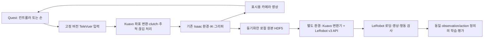

# Quest teleoperation 재사용 검토

검토일: 2026-08-31. 목표는 Kuavo 작업 환경에서 실제 Quest 조작과 안정적인 데이터 수집을 달성하고, 이후 LeRobot v3 학습·평가로 연결하는 것이다. 기존 자체 구현을 유지하는 것은 목표가 아니다.

**추천 결정**

Kuavo와 현재 PC를 유지한다면, **Isaac Sim 5.1 / Isaac Lab 2.3.2는 유지하고 Unitree의 `televuer`를 Quest 입력·영상 계층으로 먼저 검증**한다. 기존 Kuavo 장면·IK·그리퍼 설정을 연결하고, 수집 데이터는 로컬 원본으로 보존한 뒤 별도 환경의 공식 LeRobot v3 API로 변환한다. `teleimager`의 WebRTC 경로는 초기 영상 방식의 성능이 부족할 때 도입한다.

Unitree 전체 로봇 스택, Dobot 전체 환경, 최신 Arena를 한 번에 이식하는 방식은 현재 목적에서 변경 범위가 너무 크다. NVIDIA 공식 경로는 최신 CloudXR의 지원 GPU에서 다시 평가할 후보로 남긴다. 이는 소스·의존성·하드웨어를 근거로 한 통합 우선순위이며, 아직 Quest 실기에서 확인한 성공 판정은 아니다.

**확인한 현재 조건**

| 항목 | 확인 결과 | 의미 |
|---|---|---|
| GPU | `nvidia-smi`: RTX 3060, 12,288 MiB, driver 580.173.02 | 드라이버 숫자만으로 CloudXR 지원을 판정할 수 없음 |
| 프로젝트 기준 | Python 3.11, Isaac Sim 5.1.0, Isaac Lab 2.3.2 | 새 XR 라이브러리 때문에 전체 환경을 먼저 교체하지 않음 |
| 로봇·작업 | Kuavo S200062/S63, 랙→컨베이어, 물리 버튼, 머리·양손목 카메라 | 조사한 예제 로봇과 행동 정의가 다름 |
| 기존 XR | CloudXR Runtime 6.2.1, CloudXR.js 6.2.0 준비 기록 | 서비스 기동·웹 빌드와 실제 영상·입력 성공은 별개 |
| 기존 저장 | 독자 HDF5 및 별도 프로세스의 LeRobot v3 writer 구현 | 구현 존재와 실제 학습 적합성 검증은 별개 |

최신 [CloudXR Runtime 요구사항](https://docs.nvidia.com/cloudxr-sdk/latest/requirement/runtime_req.html)은 Ada/Blackwell을 명시한다. RTX 3060은 여기에 포함되지 않는다. “절대 실행 불가”라고 단정하지 않지만, 현재 하드웨어에서 가장 성공 가능성이 높은 기본 경로로 삼기에는 위험이 있다. WebXR로 바꾸어도 Isaac 렌더링에 필요한 GPU·VRAM 부담은 남는다.

검토 중 실행 소스·문서의 별도 작업 변경이 관찰됐다. 해당 변경은 건드리지 않았으며 아래 로컬 코드 지적은 검토 시점의 내용이다. 이번 작업은 설치·통합·시뮬레이터 실행·헤드셋 테스트를 수행하지 않았다.

**프로젝트별 채택 범위**

| 후보 | 가져올 수 있는 부분 | Kuavo에 그대로 쓸 수 없는 부분 | 장점 | 단점·비용 | 판단 |
|---|---|---|---|---|---|
| Unitree `xr_teleoperate` / `televuer` | Quest 브라우저 접속, 손·컨트롤러 입력, 버튼, 영상 표시, 세션 운영 참고 | G1/H1 등의 IK·URDF·DDS 명령, Unitree 좌표 보정, 로봇별 기록 스키마 | CloudXR 불필요, 손·컨트롤러 모두 지원, 입력·영상 모듈 분리 | 좌표·추적 유효성·카메라 어댑터 필요, TLS·네트워크·버전 고정 필요 | **첫 검증 후보** |
| Unitree `unitree_sim_isaaclab` / `teleimager` | Isaac 카메라를 별도 프로세스로 전달하는 방식, 공유 메모리, WebRTC 영상 | 기본 태스크·로봇·DDS·공유 메모리 이름 | 시뮬레이션 영상 전송 구현이 존재 | 기본 서버가 Unitree의 공유 메모리 도구를 import하므로 완전 독립 아님 | 영상 성능 개선 시 필요한 부분만 |
| NVIDIA `IsaacTeleop` + Arena | 런타임 자동 관리, 장치 표준화, clutch, 기록·재생, 성공 판정 기반 수집 | 최신 Arena 설치를 현재 환경에 바로 적용, G1/GR1 리타게터, 기본 변환기 스키마 | 공식 통합·문서·장기 확장성 | CloudXR GPU 위험, Arena의 Python/Sim/Lab 변경, 추가 의존성 | **현재 PC에서는 후순위** |
| Dobot `x-trainer` / `XLeVR` | 경량 WebXR 컨트롤러 전송, B/X/Y 수집 UI, 초기 보정, 원본→변환 분리 | XTrainer 홈 자세·축 변환·모터 정의·태스크, 기존 LeRobot 변환기 | 입력·버튼 흐름이 간단, CloudXR 불필요 | 손 추적용 완성 경로가 아님, 영상이 MJPEG, 구버전 변환기, 안전·운영 보완 필요 | **컨트롤러 방식의 대안·참고** |

**Unitree: 모듈 재사용은 유력하지만 전체 프로그램은 Kuavo용이 아니다**

- `televuer`는 Python >=3.10, NumPy <2, `vuer[all]==0.0.60`을 명시한다. 현재 프로젝트의 Python/NumPy 범위와 선언상 겹친다. 이것이 설치 충돌이나 실행 성공이 검증됐다는 뜻은 아니므로 별도 환경에서 고정 버전으로 먼저 확인한다. [패키지 정의](https://github.com/unitreerobotics/televuer/blob/766de45e74373ae0ea66321d942ce538385655a5/pyproject.toml)
- `TeleVuer`의 브라우저 입력과 `render_to_xr(image)` 영상 전달은 재사용 후보다. 처음부터 실물 카메라 서비스를 설치할 필요 없이 Isaac 카메라 배열을 넘기는 구성부터 검토할 수 있다. 초기에는 단안 화면 하나 또는 카메라 합성 화면을 사용한다. 이 경로는 JPEG 기반이며 성능은 측정해야 한다. [영상 구현](https://github.com/unitreerobotics/televuer/blob/766de45e74373ae0ea66321d942ce538385655a5/src/televuer/televuer.py)
- 주의: 해당 구현은 입력 이미지를 BGR→RGB로 바꾼다. 현재 Isaac 카메라 RGB를 그대로 넣으면 색상이 뒤집힐 수 있다. 표시용 어댑터에서 처리하고, 학습 원본은 RGB로 유지한다.
- `TeleVuerWrapper.get_tele_data()`의 결과를 현재 Kuavo mapper에 그대로 넣으면 안 된다. 이미 Unitree 좌표계로 바꾸며, 머리 기준→허리 기준에서 x에 0.15m, z에 0.45m를 더한다. Kuavo에서는 저수준 입력을 사용하거나 이 보정을 교체해야 한다. WebXR→Isaac 축 변환을 중복 적용하지 않는다. [좌표 변환 구현](https://github.com/unitreerobotics/televuer/blob/766de45e74373ae0ea66321d942ce538385655a5/src/televuer/tv_wrapper.py)
- `robot_arm_ik.py`와 `robot_arm.py`는 Unitree의 URDF, 관절, DDS 인터페이스를 전제로 한다. Kuavo에는 기존 Differential IK와 그리퍼 action 설정을 우선 사용한다. 조작성 검증에서 문제가 확인되면 그 부분도 교체 대상으로 삼는다. [IK 구현](https://github.com/unitreerobotics/xr_teleoperate/blob/845b25a32f7febedf220e830952a7134897adb9d/teleop/robot_control/robot_arm_ik.py)
- `teleimager`는 WebRTC와 시뮬레이션 카메라 클래스를 갖지만, `IsaacSimCamera`가 `tools.shared_memory_utils.MultiImageReader`를 가져온다. 이는 Unitree sim 저장소의 도구다. 우리 카메라를 공급하는 생산자와 규약을 연결하거나 해당 부분을 어댑터로 바꾸어야 한다. 고정 버전의 Python 범위는 >=3.8,<3.12이므로 LeRobot용 Python 3.12 환경과 분리한다. [서버 구현](https://github.com/unitreerobotics/teleimager/blob/57cf2a40572227273fa001cd17833b755331ec97/src/teleimager/image_server.py), [패키지 정의](https://github.com/unitreerobotics/teleimager/blob/57cf2a40572227273fa001cd17833b755331ec97/pyproject.toml)
- `EpisodeWriter`의 에피소드 운영과 백그라운드 저장은 참고 가능하다. 그러나 기본 출력은 Unitree JSON+이미지이고 큐가 무제한이다. 우리 HDF5를 굳이 이 형식으로 바꿀 필요는 없다. 저장이 느릴 때 큐가 계속 쌓이는 동작도 그대로 채택하지 않는다. [writer](https://github.com/unitreerobotics/xr_teleoperate/blob/845b25a32f7febedf220e830952a7134897adb9d/teleop/utils/episode_writer.py)
- `unitree_IL_lerobot`은 v3 지원을 안내한다. 다만 변환기는 Unitree JSON 및 `ROBOT_CONFIGS`를 입력으로 사용하며 FPS가 30으로 고정돼 있다. 기존 출력 디렉터리를 `shutil.rmtree`로 지우는 코드도 있으므로 현재 데이터에 그대로 실행하지 않는다. 활용 대상은 프레임 매핑 구조이며, Kuavo 원본 파서와 비파괴 출력 처리가 필요하다. [v3 안내](https://github.com/unitreerobotics/unitree_IL_lerobot/blob/41c2805742de879ddab2d8d6beaeaf215f876395/README.md), [변환기](https://github.com/unitreerobotics/unitree_IL_lerobot/blob/41c2805742de879ddab2d8d6beaeaf215f876395/unitree_lerobot/utils/convert_unitree_json_to_lerobot.py)

**NVIDIA: 공식 경로라도 환경 업그레이드와 데이터 작업이 남는다**

- 최신 공식 흐름은 CloudXR 런타임·WSS 자동 시작, Quest 웹 클라이언트, Isaac Lab 텔레옵·기록기를 연결한다. 현재 수동 서비스 관리 코드를 줄일 후보지만, 기존 Runtime 6.2.1과 최신 패키지를 임의로 섞으면 안 된다. 버전별 호환 구성을 별도 환경에서 검증해야 한다. [공식 설정 안내](https://isaac-sim.github.io/IsaacLab/develop/source/how-to/cloudxr_teleoperation.html)
- 확인한 Arena main은 Python >=3.12,<3.13, wheel 경로에서 Isaac Lab 3.0.0b2 및 Isaac Sim 6.0 계열 의존성을 사용한다. 현재 Python 3.11 / Sim 5.1 / Lab 2.3.2를 유지한 채 전체 설치할 수 있는 구성이 아니다. Docker로 분리하더라도 GPU 지원 문제가 없어지지는 않는다. [Arena 의존성](https://github.com/isaac-sim/IsaacLab-Arena/blob/bfa57c4b546e8a77abc3a65197dcbedbd708eac7/pyproject.toml)
- 다만 **IsaacTeleop 라이브러리 자체가 무조건 Python 3.12나 Lab 3.0만 요구하는 것은 아니다.** 패키지는 Python >=3.11이며, NumPy 1/2 runtime 양쪽을 고려한다. 저수준 입력이나 런타임 관리만 가져오는 방법은 별도 후보다. 이 경로의 Lab 2.3.2/3060 호환성은 이번에 실행 검증하지 않았다. [패키지 정의](https://github.com/NVIDIA/IsaacTeleop/blob/334978b0ee73ce3e9102a22bd4c889d8b77dcf82/src/core/python/pyproject.toml.in)
- SO101 clutch 구현은 재사용할 설계가 명확하다. grip을 놓으면 정지하고, 다시 잡을 때 현재 로봇 자세에 원점을 재설정한다. Kuavo에도 적용할 수 있지만 SO101 retargeter 자체는 로봇별 설정을 바꿔야 한다. [clutch 구현](https://github.com/NVIDIA/IsaacTeleop/blob/334978b0ee73ce3e9102a22bd4c889d8b77dcf82/src/python/isaacteleop/retargeters/SO101/clutch_retargeter.py)
- `examples/lerobot/record.py`는 사람 머리·손 위치를 저장하는 예제다. 로봇의 action/state/카메라가 자동으로 갖춰지는 수집기가 아니다. [예제 범위](https://github.com/NVIDIA/IsaacTeleop/blob/334978b0ee73ce3e9102a22bd4c889d8b77dcf82/examples/lerobot/README.md)
- Arena HDF5→LeRobot 변환기는 관절 순서 재매핑, 카메라·언어 지시 설정을 참고할 수 있다. 확인한 G1 설정·fixture는 에피소드별 parquet/mp4 및 `codebase_version: v2.1`을 사용한다. 이를 우리의 v3 converter로 그대로 채택하면 안 된다. [설정](https://github.com/isaac-sim/IsaacLab-Arena/blob/bfa57c4b546e8a77abc3a65197dcbedbd708eac7/isaaclab_arena_gr00t/lerobot/config/g1_locomanip_config.yaml), [fixture 형식](https://github.com/isaac-sim/IsaacLab-Arena/blob/bfa57c4b546e8a77abc3a65197dcbedbd708eac7/isaaclab_arena_gr00t/tests/test_data/test_g1_locomanip_lerobot/meta/info.json)

**Dobot: 컨트롤러 조작의 작은 참고 구현으로 적합**

- `XLeVR`의 WebXR 컨트롤러 pose·trigger·버튼 전송 및 `XTrainerVR`의 B=시작/보정, X=실패/reset, Y=성공/reset 흐름은 활용할 수 있다. 컨트롤러 기반 조작을 우선할 때 유용하다. [입력 어댑터](https://github.com/embodied-dobot/x-trainer/blob/5862c3ba4997ae0d4c41f69c73981353af3a8346/source/leisaac/leisaac/devices/lerobot/xtrainer_vr.py)
- 기본 홈 위치·회전과 모터 제한은 XTrainer 전용이다. 입력에서 headset을 건너뛰므로 Kuavo의 머리 제어도 별도 연결해야 한다. 손 skeleton 기반 입력을 제공하는 완성 대체품으로 보지 않는다.
- 영상은 별도 Flask 프로세스의 HTTPS MJPEG `/stereo_feed`를 쓴다. WebRTC 구현으로 오해하면 안 된다. 초기 확인은 단순하지만 해상도·FPS를 높였을 때 대역폭·인코딩 부하를 측정해야 한다. [영상 송신 코드](https://github.com/embodied-dobot/x-trainer/blob/5862c3ba4997ae0d4c41f69c73981353af3a8346/scripts/environments/teleoperation/teleop_se3_agent.py)
- `latest_state`를 계속 사용하는 입력 어댑터에 추적 끊김을 판정하는 명확한 freshness timeout이 없다. 조작 허용 조건·끊김 감지·재보정·재시작 시 오래된 목표 제거를 확인하고 보완해야 한다.
- 저장소에 인증서와 개인키 샘플이 들어 있다. 배포용으로 재사용하지 않는다. 우리 호스트용으로 새로 만들고 정상적인 인증서 신뢰 절차를 사용한다. 보안 검사를 전역으로 끄는 방식은 채택하지 않는다.
- 변환기는 LeRobot v0.3.3을 사용했다고 명시하고, XTrainer 16차원 필드·30FPS·세 카메라 이름을 고정한다. 짧은 에피소드를 버리고 처음 5프레임을 건너뛴다. 이런 로봇별 전처리를 Kuavo에 그대로 적용하면 안 된다. [변환 코드](https://github.com/embodied-dobot/x-trainer/blob/5862c3ba4997ae0d4c41f69c73981353af3a8346/scripts/convert/isaaclab2lerobot_xtrainer.py)

**현재 코드에서 유지할 것과 수집 전에 맞출 것**

| 로컬 부분 | 판단 | 필요한 작업 |
|---|---|---|
| Kuavo USD·작업 장면·카메라·그리퍼 설정 | 우선 유지 | 외부 XR 라이브러리에 맞춰 장면을 재작성할 이유 없음 |
| `teleop_env.py`의 양팔 Differential IK | 우선 유지·조작성 검증 | 새 입력 pose의 좌표계, 스케일, 클러치 연결 |
| `teleop_mapping.py`의 첫 프레임 보정·증분 제한 | 재사용 후보 | 원시 입력과 Unitree 보정 결과 구분, 컨트롤러 입력 지원 |
| `browser_teleop_bridge.py`의 입력 파싱·stale timeout | 참고·연결 후보 | 기존 preview와 실제 수집을 하나의 입력 계약으로 맞추기 |
| `teleop_recorder.py` HDF5 | 원본 보존에 활용 가능 | 학습 시점 정렬, 설정·로봇 메타데이터, 저장 부하 점검 |
| `teleop_lerobot_recorder.py`, `lerobot_writer_worker.py` | v3 출력 코드 재사용 후보 | 오프라인 변환 진입점, 모델명, 정렬·FPS·재개 검증 |
| CloudXR 서비스·OpenXR 입력 어댑터 | 비교·fallback 경로로 보존 | 실제 Quest 연결 성공 여부로 유지/폐기 판단 |

다음 사항은 외부 저장소 선택과 별도로 **대량 수집 전에 해결해야 한다.** 이번 검토에서는 실행 코드를 수정하지 않았다.

1. **수집과 평가의 action이 다르다.** `collect_quest_teleop.py`는 `teleop_env.py`의 양팔 EE 증분 12 + 머리 2 + 활성 그리퍼 명령을 저장한다. 기본 양손 구성은 16차원이다. `eval_groot.py`는 `KuavoRobustWorkcellEnvCfg`와 `groot_lerobot_bridge.py`를 사용하며 허리+양팔의 15개 관절 및 그리퍼 명령을 받는다. 기본 양손 manager 구성은 17차원이며 의미도 다르다. 수집·학습·평가 모두 동일한 EE action 환경을 쓰거나, 실제 관절 목표값을 수집해 관절 action 정책으로 통일해야 한다. 실측 다음 관절 상태를 명령값이라고 이름만 바꾸면 안 된다. 카메라 키와 observation.state의 관절 순서도 동일하게 맞춘다.
2. **현재 sample은 step 이후 관측과 방금 적용한 action을 묶는다.** `env.step(action)` 뒤에 관절·카메라를 읽고 같은 action을 저장한다. 그대로 behavior cloning에 넣으면 일반적인 `(obs_t, action_t)` 대신 `(obs_{t+1}, action_t)`가 될 위험이 있다. action 적용 전 관측을 저장하고 필요하면 다음 관측을 별도로 저장한다. Isaac Lab 기본 recorder의 pre-step observations/actions 분리를 참고할 수 있다. 센서 update 주기로 인한 추가 시간차도 확인한다.
3. **HDF5 확장자가 같아도 변환기 입력 형식은 다르다.** 현재 파일은 `data/demo_XXXXX/samples/...`이고 Dobot/Arena는 별도의 `actions`, `obs/...` 등을 가정한다. 기존 프레임 변환 함수를 재사용하는 Kuavo 전용 원본 파서가 필요하다.
4. **현재 writer의 robot_type이 `kuavo_s63`으로 고정돼 있다.** 기본 S200062 데이터를 구분하도록 모델·그리퍼 preset·관절/action 이름·단위·좌표계·초기 설정을 함께 기록해야 한다.
5. **FPS 숫자를 바꾸는 것과 resampling은 다르다.** 현재 `--lerobot-fps`는 프레임을 실제로 재표본화하지 않는다. 시뮬레이션 시간·제어 주기·카메라 주기·수신 시간을 기준으로 일관된 학습 시간축을 정하고 검증한다. real-time factor와 사용자 입력 지연은 별도 측정한다.
6. **별도 writer 프로세스도 무조건 실시간 부하에서 자유로운 것은 아니다.** pipe 전송은 소비가 느리면 대기할 수 있고 영상 encoding·episode 저장이 수집 흐름을 지연시킬 수 있다. 원본 수집부터 측정하고, 표시용 영상은 오래된 프레임을 버려도 기록용 데이터는 조용히 버리지 않도록 분리한다.

**LeRobot까지 연결하는 권장 구조**

처음에는 한 가지 XR 경로만 선택한다. Unitree 입력에 Dobot 웹앱을 다시 붙이는 식으로 두 연결 스택을 혼합하지 않는다. TeleVuer가 헤드셋에서 실패할 때만 XLeVR을 대안으로 시험한다. 손 추적이 필수 요구가 아니라면 물리 버튼과 trigger가 있는 컨트롤러를 첫 수집 모드로 제안한다. 이는 조작 운영을 단순화하기 위한 선택이며, 실제 손 추적보다 정확하다는 측정 결과는 아니다.

원본 데이터에는 최소한 다음을 남긴다.

- action 적용 전 state·카메라와 해당 action, episode/frame 번호, task 지시문, 성공 여부 및 종료 이유.
- 로봇 모델·그리퍼 설정·joint/action 이름과 순서, 길이/각도 단위, 좌표계, action이 상대/절대인지와 scale.
- sim timestamp, control dt, 카메라 timestamp/frame 정보, XR 수신 시간·유효성·clutch 상태. 필요 시 next state와 실제 관절 목표값.
- 장면 초기 상태·seed·randomization 설정. 정확한 재생이 필요하면 seed만으로 충분하다고 가정하지 않고 초기 시뮬레이터 상태와 설정을 보존.

변환기는 [공식 LeRobotDataset v3 API](https://huggingface.co/docs/lerobot/lerobot-dataset-v3)를 사용해 생성·프레임 추가·에피소드 저장·종료한다. parquet/mp4/meta 파일을 수작업으로 조합하는 범위를 최소화한다. LeRobot 0.6.0 등 **실제 검증할 패키지 버전을 고정**하고, Dataset v3라는 포맷 버전과 라이브러리 버전을 구분한다. 기존 dataset 경로를 자동 삭제하지 않으며 Hub 업로드도 기본으로 수행하지 않는다.

오프라인 변환의 장점은 VR 조작과 영상 인코딩/통계 계산의 부하를 분리하고, 스키마가 바뀌어도 원본을 재사용할 수 있다는 것이다. 단점은 추가 디스크·변환 시간이 필요하다는 점이다. 이후 같은 원본 계약을 유지하며 직접 v3 저장을 추가할 수 있다. 단, 오프라인 변환만으로 수집 당시 빠진 관측이나 잘못된 타이밍을 복구할 수는 없다.

**실사용 성공으로 인정할 검증 순서**

아래 수치는 구현 성능 주장이나 보장이 아니라 제안하는 합격 기준이다.

1. 시뮬레이터 없이 Quest→TeleVuer 손/컨트롤러·버튼·머리 입력을 확인하고, 연결 종료 후 오래된 입력이 남지 않는지 검사한다. 재연결 5회.
2. 현재 Kuavo 장면에 머리 화면 하나를 먼저 연결한다. 표시 FPS와 지연, GPU 메모리, CPU·네트워크 부하를 측정한다. 부족하면 해상도/카메라 수를 줄이고 그 다음 WebRTC를 평가한다.
3. 양팔 각 축·회전·그리퍼를 따로 검사한다. clutch 해제·재진입·추적 끊김에서 갑작스러운 움직임이 없어야 한다. 기록 중 리셋·성공·실패를 headset에서 구분해 조작한다.
4. 짧은 원본 에피소드 1개를 v3로 변환한다. 공식 loader로 모든 카메라를 decode하고, state/action/time·색상·관절 순서·episode 끝을 확인한다. 작은 batch 생성과 동일 action 환경에서의 재생/평가까지 검사한다.
5. 실제 작업 성공 에피소드 10개 및 연속 수집 30분을 확인한다. 관측/action/카메라 프레임 정렬 오류, 미완료 파일, 메모리 증가가 없어야 한다. 이 단계 후 대량 수집을 시작한다.

**라이선스 및 검토한 revision**

다음은 각 저장소에 표시된 라이선스 식별이다. 코드 채택 시 해당 파일의 고지·라이선스와 하위 의존성 조건을 함께 보존·확인한다. CloudXR SDK/runtime은 IsaacTeleop 소스의 Apache-2.0와 구분해 NVIDIA 배포 조건을 확인한다. 샘플 인증서·개인키는 가져오지 않는다.

| 저장소 | 확인한 revision | 표시 라이선스 |
|---|---|---|
| unitreerobotics/xr_teleoperate | `845b25a32f7febedf220e830952a7134897adb9d` | Apache-2.0 |
| unitreerobotics/televuer | `766de45e74373ae0ea66321d942ce538385655a5` | MIT |
| unitreerobotics/teleimager | `57cf2a40572227273fa001cd17833b755331ec97` | Apache-2.0 |
| unitreerobotics/unitree_sim_isaaclab | `e30c25b1dffdf92ada1d6c8c1fe9a47bdde0fecc` | Apache-2.0 |
| unitreerobotics/unitree_IL_lerobot | `41c2805742de879ddab2d8d6beaeaf215f876395` | Apache-2.0 |
| embodied-dobot/x-trainer | `5862c3ba4997ae0d4c41f69c73981353af3a8346` | Apache-2.0, 내장 XLeVR은 MIT |
| NVIDIA/IsaacTeleop | `334978b0ee73ce3e9102a22bd4c889d8b77dcf82` | Apache-2.0, 별도 의존성 조건 확인 |
| isaac-sim/IsaacLab-Arena | `bfa57c4b546e8a77abc3a65197dcbedbd708eac7` | Apache-2.0 |

TeleVuer와 TeleImager는 위 xr_teleoperate가 고정한 submodule revision을 확인했다. 다른 저장소들은 검토 시점 HEAD이다. 설치·실행한 버전이 아니라 검토한 소스 버전이다.
