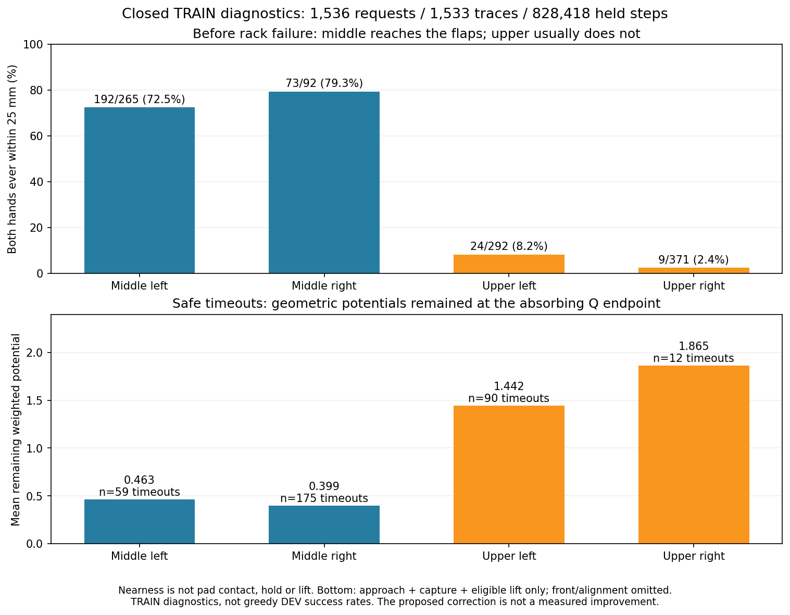

# 접근 실패 진단과 종료 보상 수정

종료된 실제 TRAIN 기록에서 **중간 선반은 접근한 뒤 실패하고, 상단 선반은
충분히 접근하기 전에 실패하는 경우가 많았다.** 또한 Q는 시간 초과를 종료로
처리하지만 접근·포획 등의 보상 점수는 종료 위치에 남는 불일치를 확인했다.
보상 가중치를 높이는 대신 종료 처리와 정렬 계산을 고치는 선택형 설정을 구현했다.
GPU3에서 별도 비교를 시작했고 실제 reward manager에 적용됨을 확인했다.
새 설정의 학습 후 전체 성능은 아직 확인되지 않았다.

대표 성능은 [간단 중간 보고](RL_V2_GRASP_INTERIM_SUMMARY_20261006.md),
동일 평가 정책의 Q 표시 영상4개와 보상 가중치는
[Q 영상·보상 설명](RL_V2_EVAL_Q_REWARD_20261006.md)에 있다.
그 영상은 기존 대표30/128 정책이며 이 새 보상으로 학습한 영상이 아니다.

## 실패가 발생한 단계

정상 종료하고 최종 Drive 검증을 마친 출력 포화 비교의 TRAIN1,536요청 중
실제 기록1,533경로·파지 단계828,418동작을 읽었다. 나머지3요청은 초기화 무효이며
제외 사유를 기록했다. DEV/FINAL은 읽지 않았고 실행 중인 HDF도 읽지 않았다.
움직이는 flap의 실제 자세를 사용해 두 손의 표면 거리를 재구성했으며 마지막
거리와 기존 privileged 측정의 최대 차이는0.0006mm 미만이었다.

| 구역 | 랙 충돌 TRAIN 경로 | 충돌 전에 양손 모두 표면2.5cm 이내였던 경로 |
| --- | ---: | ---: |
| 중간 왼쪽 | 265 | 192 · 72.5% |
| 중간 오른쪽 | 92 | 73 · 79.3% |
| 상단 왼쪽 | 292 | 24 · 8.2% |
| 상단 오른쪽 | 371 | 9 · 2.4% |

가깝다는 것은 실제 finger pad 접촉·유지·들기에 성공했다는 뜻이 아니다.
중간은 접근 이후 닫기·접촉·들기의 연속 동작을, 상단은 팔·그리퍼 몸체가
랙을 피하며 양손을 접근시키는 동작을 함께 봐야 한다. 이 수치는 탐색 중 TRAIN의
진단이며 greedy 평가 성공률이나 단일 실패 원인의 증명은 아니다.



[거리 재구성·구역별 근거](assets/rl_v2_closed_TRAIN_hand_approach_20261007.json)

## 종료 보상의 불일치

기존 접촉 보상은 `gamma * 새 접촉 점수 - 이전 점수`로 계산하고 종료 점수를0으로
처리한다. 그러나 접근·진입·포획·적격 들기에는 같은 종료 처리가 없었다.
안전한 시간 초과336경로의 마지막 관측에서도 이 점수가 남아 있음을 확인했다.

| 구역 | 안전한 시간 초과 | 마지막에 남은 가중 잠재값의 평균 하한 |
| --- | ---: | ---: |
| 중간 왼쪽 | 59 | 0.463 |
| 중간 오른쪽 | 175 | 0.399 |
| 상단 왼쪽 | 90 | 1.442 |
| 상단 오른쪽 | 12 | 1.865 |

하한은 `2 * 접근 + 0.5 * 포획 + 0.4 * 적격 들기`만 합산한 값이다.
진입·정렬은 포함하지 않았다. 기존 Q는 시간 초과 뒤를 더하지 않으므로,
실패했지만 가까운 위치로 끝난 경로에도 종료 위치에 따른 기하 보상 차이가 남는다.
이 차이가 학습 실패의 유일한 원인이라고 단정하지 않는다. 과거 보상·return을
바꾸거나 기존 replay를 소급 재라벨링하지 않았다.

기존 정렬 항목은 `0.5 * 현재 근접도 * (새 정렬도 - 이전 정렬도)`였다.
근접도가 바뀌면 접근·정렬·이탈·정렬 해제의 반복에서 양의 보상이 남을 수 있다.
이는 실제 정책이 반복 악용했다는 관측이 아니라 계산식의 문제다.

[종료 잠재값·할인 경계 진단](assets/rl_v2_closed_TRAIN_terminal_geometry_20261007.json)

## 수정한 계산

새 프로필 이름은 `absorbing_geometric_potentials_v1`이다.

| 항목 | 새 처리 |
| --- | --- |
| 접근·진입·포획·jaw gap·적격 들기 | 성공·안전 위반·시간 초과에서 다음 잠재값0 |
| 정렬 | `Phi = 평균 근접도 * 평균 정렬도`, 보상은 `0.5 * (0.999 * Phi_next - Phi_prev)` |
| 마지막 flap 배정 변경·접촉 소실 | 마지막 저장 잠재값을 사용하며 종료 자세로 재기준화하지 않음 |
| 일반 reset·진행 중 배정 변경 | 기존 가짜 진행 방지 처리 유지, 선택 env의 저장 정렬값 초기화 |
| 거리 비용·실제 관측 | 종료 시에도 측정된 거리·자세 사용 |
| 기존 실행 | 프로필을 지정하지 않으면 기존 계산 유지 |

가중치와 실제 거리 정의는 유지한다. 접근2·진입1·정렬0.5·포획0.5·접촉1·들기0.4,
한 손 파지 이벤트0.5·양손 파지2·성공8이다. 닫기 명령만의 보상은0이다.
랙10N/감점−6, 주변 로봇–장애물5N/감점−4, 파괴적 실패−12도 유지한다.
박스·base·배경·단단한 동적 flap의 기존 무작위화와 양손 실제 파지·0.25초 유지·
8mm proof lift 성공 기준을 바꾸지 않는다. Box 고정·curriculum은 추가하지 않는다.

## 코드와 확인

- [프로필·frozen actor 입력 호환성](../src/kuavo_isaaclab_scene/rl/multi_box/rewards/absorbing_geometry.py)
- [보상 계산](../src/kuavo_isaaclab_scene/rl/multi_box/rewards/model.py), [실제 reward manager](../src/kuavo_isaaclab_scene/rl/multi_box/managers/v2_grasp.py)
- [초기화 도구](../scripts/rl/prepare_absorbing_geometry_actor.py), [실행 중 reward manager 계약 확인](../scripts/rl/train_batched_staged_goal.py)

관련62개 테스트가 통과했다. 실제 production manager의 호출·부분 reset·세 종류
종료·마지막 배정/접촉 변화와 정렬 반복의 계산을 포함한다. 실제 full trainer도
새 계약으로 복원했다. 과거 TRAIN698관측에서 초기 몸체 목표와 binary jaws가
비트 단위로 같고 모델 tensor가 그대로임을 확인했다.

**보상이 바뀌므로 기존 Q·optimizer·replay·성공/n-step 보상 라벨을 가져오지 않는다.**
이전 보상으로 학습한 Q와 체크포인트는 새 full trainer/초기화 도구가 거부한다.
기존 성공15경로6,899전이의 라벨도 제거했으며 모든 보상 bank는0에서 시작한다.
이는 두 VR 시연을 다시 수집하거나 실행 중 따라 재생하는 기능이 아니다.
성공 경험과 n-step16 보강에는 앞으로 실제로 수집한 TRAIN만 사용한다.

[실제 trainer 복원 근거](assets/rl_v2_absorbing_geometry_initial_restore_20261007.json)

```bash
CUDA_VISIBLE_DEVICES='' PYTHONPATH=src:scripts/rl python scripts/rl/prepare_absorbing_geometry_actor.py \
  --initial-checkpoint /absolute/path/to/closed-fresh-servo-inputs/checkpoint_00000000.pt \
  --training-manifest /absolute/path/to/closed-fresh-servo-inputs/training_manifest.json \
  --waypoints /absolute/path/to/closed-fresh-servo-inputs/waypoints.json \
  --output-dir /absolute/path/to/unique-new-reward-inputs
```

같은 초기 동작을 보존하는 미학습 servo-Q 입력 전용이며, 학습된 Q의 일반 resume가 아니다.
새 실행은 TRAIN1,536조건과 구역별32개인 원래 DEV128요청을 반복해 비교한다.
초기화 무효도 원래 분모에 유지하고 독립 FINAL은 아직 사용하지 않는다.
10/07 07:15 KST에 GPU3의 고유 폴더에서 별도 실행을 시작했다. 입력8개는 기존
Drive 연결로 크기·MD5 검증했고 기존 비교 writer3개는 유지했다. 07:20 KST에
실제 초기화된 reward manager의 params·model과 실행 manifest가 새 프로필과
일치함을 확인했다. 초기 전체 DEV 준비 단계이며 학습 후 성공률 개선의 근거가 아니다.
체크포인트는 기존 관리자의5분 업로드·체크섬 검증·최근2개 보존을 사용하고,
writer가 끝난 뒤 닫힌 로그와 데이터를 검증한다.
[실제 초기화·GPU 격리·진행 근거](assets/rl_v2_absorbing_geometry_actual_initialized_reward_20261007.json).

이후 전체 초기 DEV는 **23/128(중간 좌12·우6, 상단 좌5·우0)**으로 끝났다.
실제 안전한 양손 파지·유지·들기23건, 랙 충돌69·시간 초과25·초기화 무효11건을
원래128개 분모에 포함했다. Actor·Q·replay·모든 보상 은행은0이다. 평가와 같은
체크포인트를 보존했고 이후 실제 TRAIN에 진입했다. 이는 옮겨온 초기 동작의
기준이며 수정된 보상으로 학습한 성능 개선이 아니다.
[전체 초기 평가](assets/rl_v2_absorbing_geometry_full_initial_DEV_20261007.json).

**08:06 KST에는 실제 새 TRAIN64,038행·Q1,258회 갱신을 확인했다.** 닫힌 Q1,024회
체크포인트를 보호하고 두 Q와 두 target의 tensor가 각각10개씩 바뀌었으며 모든
모델 값이 유한함을 확인했다. 자기 보상·servo 계약으로 모델을 엄격하게 복원했고
actor와 actor 정규화는 초기 모델과 정확히 같았다. Actor는 Q2,048회 warmup을
기다리고 있으며 이전 보상 라벨·Q·optimizer를 가져오지 않았다.

아직 첫 TRAIN wave가 닫히기 전이므로 성공·n-step 은행은 모두0이고16스텝 보조
손실도 활성화 전이었다. 현재 업데이트는 새 실제 온라인 전이의 one-step Q이다.
은행은 이후 완료된 TRAIN의 안전한 성공·실패만 등록하며 DEV는 넣지 않는다.
실제 Q 학습이 시작된 확인으로, 파지 성능 개선을 뜻하지 않는다.
[첫 실제 갱신 모델·데이터 근거](assets/rl_v2_absorbing_geometry_first_actual_Q1024_20261007.json).

이후 첫 TRAIN128조건을 마쳐 **실제 안전한 성공3건(중간 좌2·우1, 상단 양쪽0)**을
확인했다. 당시 actor0·Q1,606회이며 학습 전 탐색에서 발견한 성공이다.
같은 실행의 닫힌 체크포인트에서 성공3경로1,207행의 관측·실제 목표·보상·종료,
실제 양손 접촉·유지·들기와 현재 TRAIN128조건의 provenance를 직접 확인했다.
이전 성공 라벨이나 DEV를 넣지 않았다. 나머지는 랙 충돌100·시간 초과25건이었다.
[첫 완료 TRAIN128·신규 성공 전이](assets/rl_v2_absorbing_geometry_first_complete_TRAIN128_20261007.json).

**08:21 KST에 actor60회·Q2,286회·실제 TRAIN108,237행**으로 warmup을 통과했다.
새 성공 은행1,207행의 actor 표본64개 중 파지 직전 지정 표본32개가 연결됐고,
새 완료 TRAIN의 성공·실패62경로31,227행에서16스텝 표본64개·가중치0.1을 사용했다.
Actor·one-step Q·16스텝 Q·성공 목표·jaw 손실은 유한하며 VR·teacher BC와 평가
전이는0이다. 이는 실제 수집 경험을 정책이 학습하기 시작한 확인이다.
당시 첫 저장된 갱신 actor의 별도 tensor 검사와 학습 후 DEV128의 성능은 확인 전이었다.
[실제 actor 갱신·64/32 및16스텝 신호](assets/rl_v2_absorbing_geometry_first_actual_actor_20261007.json).

**08:32 KST에 actor256회·Q3,072회의 실제 저장 모델을 따로 확인했다.** Actor의
tensor6개, 두 Q와 두 target의 tensor가 각각10개씩 초기 모델에서 바뀌었으며
모두 유한했다. Actor 정규화는 그대로이고 실제 보상·servo 계약으로 엄격하게
복원했다. 같은 새 TRAIN 성공3경로의 과거 상태에서 다음 차이도 확인했다.

| 과거 성공 경로의 마지막64상태 | 초기 → 갱신 몸체 목표 MSE | 초기 → 갱신 정규화 제어 명령 MSE | 초기 → 갱신 jaw 불일치 |
| --- | ---: | ---: | ---: |
| 중간 오른쪽1경로 | 0.000256 → 0.001745 | 0.222 → 0.624 | 19 → 18 |
| 중간 왼쪽2경로 | 0.000344 → 0.001992 | 0.280 → 0.625 | 49 → 11 |

Jaw 불일치는 상태 수가 아니라 두 jaw 명령의 불일치 개수다. 위 표와 각 경로의
첫16상태 모두에서 몸체 목표·제어 명령 MSE가 커졌다. **모델 갱신을 성능 개선으로
보지 않는다.** 이는 기록된 stochastic 성공 동작과 같은 과거 상태에서 계산한
차이이며, 새 물리 경로·손 위치 오차·관절 속도·학습 후 성공률이 아니다.
학습 후 원래 DEV128의 파지·유지·들기 결과를 별도로 기다린다.
검사 중 optimizer·정규화·replay·원본 모델을 변경하지 않았다.
[실제 저장 actor256·Q3072와 같은 상태 진단](assets/rl_v2_absorbing_geometry_first_saved_actor_model_20261007.json).
