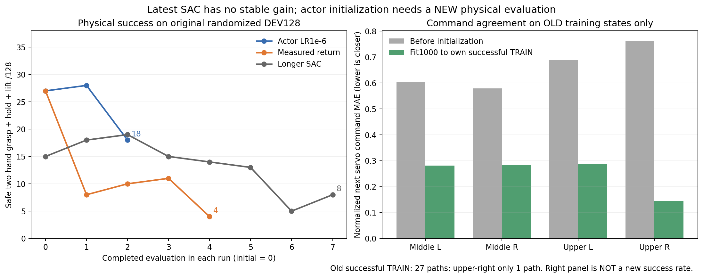

# 실제 성공 경험으로 초기 동작을 보강하는 비교

Actor 학습률을 낮춘 SAC는 전체 평가가 **27→28→18/128**로 내려갔다.
두 번째 평가의 중간 좌15·우3, 상단 양쪽0건이며 랙 충돌46건이었다.
공통 유효117조건에서도 초기27→16건이다. 작은 갱신만으로 성공 동작을
유지하지 못했다. 기존 GPU3 SAC는 계속 진행한다.
[전체 평가·같은 모델](assets/rl_v2_return33_conservative_second_full_DEV_20261007.json).

새 후보는 [검증한 자기 SAC 성공27경로](RL_V2_ACTOR_TRAIN_MEMORY_20261007.md)의
몸체·양손 그리퍼 명령으로 초기 actor를 먼저 보강한다. 두 VR 데모를 더
복제하거나 평가 데이터를 학습에 넣지 않는다. 실제 성공 TRAIN의 actor 관측·
실행 명령12,476행만 사용한다. Q·보상·next state·종료 라벨을 가져오지 않는다.

| 항목 | 설정 |
| --- | --- |
| 입력 | 안전한 자기 SAC TRAIN27경로, 상단 오른쪽은1경로뿐 |
| 초기 actor 보강 | CPU,1,000 optimizer 갱신, batch256, lr1e-4 |
| 표본 | 네 구역 균형, 경로 균등, 절반은 마지막64동작 |
| 손실 | 기존 goal MSE+servo 구간Huber 및 jaw NLL; 가중치11.111…/0.05 |
| 보존 | Q·target·normalizer·고정 몸체 anchor, 환경·제어·보상·성공·안전 기준 |
| 이후 SAC | 원래 actor1e-6·Q/entropy3e-4; optimizer4개와 Q/replay/보상 은행은 새로 시작 |

같은 과거 성공 경로의 마지막64관측에서 확인한 값은 다음과 같다. 명령 오차는
제어기의 정규화된 다음 관절 명령과 기록된 명령의 평균 절대 차이다.
양손 닫기 재현율은 실제 양손 닫기 라벨이 있던 관측에서 경로별 균등 평균이다.

| 구역 | 양손 닫기 재현율: 이전→보강 | 다음 관절 명령 오차: 이전→보강 |
| --- | --- | --- |
| 중간 오른쪽 | 98.3→98.5% | 0.579→0.284 |
| 중간 왼쪽 | 97.5→96.5% | 0.604→0.281 |
| 상단 오른쪽 | 0→100% | 0.763→0.146 |
| 상단 왼쪽 | 91.4→94.4% | 0.688→0.286 |

**위 값은 학습에 사용한 과거 상태에서의 명령 재현이며 새로운 물리 성공률이
아니다.** 상단 오른쪽은 경로1개로 일반화가 불확실하다. 초기 정책이 새 무작위
조건에서 안전하게 파지하는지 원래 네 구역32개씩 DEV128개로 평가한 뒤
SAC 개선 여부를 판단한다. 독립 FINAL은 아직 사용하지 않았다.

실제 전체 SAC trainer 복원·checkpoint/experience 재개를 확인했다. 정책 재생
복원과 실제 학습기의 과거1,259관측 출력이 정확히 같았다. SAC actor/Q 카운터,
replay·신규 성공 보상·return 은행과4개 optimizer 상태는0이며 과거 actor 기억만
12,476행이다. 초기 보강 출처는 checkpoint·experience·report에 보존하고 다른
기억 출처의 복원은 거부한다. 관련 입력 보호 검사10개와 실제 복원 검증을 통과했다.
[실제 초기 후보·복원·명령 지표](assets/rl_v2_actor_memory_offline_fit1000_preparation_20261007.json).

```bash
CUDA_VISIBLE_DEVICES='' PYTHONPATH=src python scripts/rl/fit_actor_train_memory.py \
  --initial-checkpoint /absolute/path/to/pristine_memory/checkpoint_00000000.pt \
  --actor-memory /absolute/path/to/verified/actor_only_successful_TRAIN.pt \
  --matching-memory-proof /absolute/path/to/verified_physical_audit.json \
  --training-manifest /absolute/path/to/pristine_memory/training_manifest.json \
  --waypoints /absolute/path/to/pristine_memory/waypoints.json \
  --output-dir /absolute/path/to/new_actor_initialization --steps 1000
```

이미 학습 중인 checkpoint/replay나 출처가 다른 기억을 초기 후보로 바꾸지 않는다.
초기 actor 보강은 모방 학습 성격의 준비 단계이며 SAC 갱신 수로 세지 않는다.
박스·base·배경·움직이는 flap 무작위화와 실제 양손 pad5N·hold0.25초·8mm 들기,
rack10N·주변 장애물5N·self collision OFF는 유지한다. 박스 고정이나 curriculum을
추가하지 않는다. 실제 새 평가·SAC 학습·네 구역과 다른 크기 일반화는 아직 미검증이다.

**10/08 00:13 KST에 원래 전체 DEV128개 평가를 시작했다.** GPU3만 사용한
실제 writer3910094의 소유자·고유 run·CUDA3를 확인했다. 기존 학습4개는
유지했고, 평가의 학습·actor/Q/replay 갱신은 비활성화했다. 네 구역32개씩
모두 요청하고 구역별 대표 영상4개도 저장한다. 아직 전체 평가 결과는 없다.
실행 소스는 커밋f1581d6이다. 초기 push는 GitHub Internal Server Error로
지연됐지만 재시도 후 코드·실제 학습·평가·그래프 기록을245218d까지 main에
push했다. 기존 Drive는 invalid_grant로
재인증이 필요하므로 미검증 자료는 로컬에 보존한다.
[실제 frozen 평가 실행](assets/rl_v2_actor_memory_fit1000_actual_frozen_DEV_launch_20261008.json).

실제 DEV0에 진입한 뒤 actor/Q0·학습 비활성화, 입력 checkpoint·agent·
progress 계약의 정확한 일치와 오프라인 초기화 출처의 runtime 보존을
확인했다. 아직 원래128개 평가가 모두 끝난 것은 아니다.



왼쪽은 새 환경에서 측정한 전체 물리 성공이며 오른쪽은 학습에 사용한
과거 상태의 명령 오차다. 두 성능을 혼합하지 않는다.
