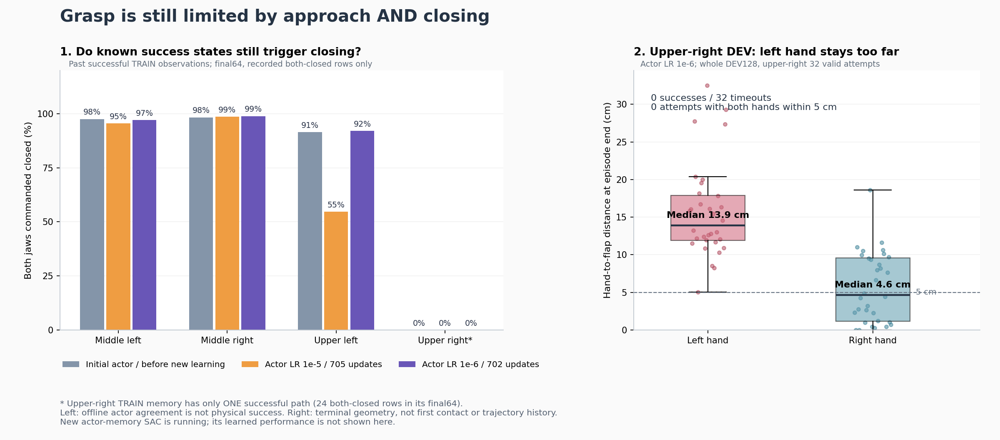

# 10/07 실제 SAC 성공 동작을 기억하는 추가 비교

현재 정책으로 TRAIN의80%를 수집한 비교의 첫 전체 평가는 **27→21/128**이었다.
중간 좌9·우12, 상단 양쪽0이며 랙64·낙하2·과도한 들기3건이었다. 초기화가
양쪽 모두 유효한116조건에서도 초기27→19건이었다. 누적 보상 보강의 기존
첫 평가8건보다는 높지만 자기 초기27건을 넘지 못했다. 같은 요청이라도 물리
reset·flap 추첨이 같다고 가정하지 않고 수집 변경의 효과로 단정하지 않는다.
[동일 actor705/Q4868의 전체 평가](assets/rl_v2_return33_greedy80_first_full_DEV_20261007.json).


그림 왼쪽은 완료된 평가만, 오른쪽은 학습 입력으로 검증한 과거 성공 경로 수다.
새 actor 기억 비교의 학습 후 성능은 아직 포함하지 않는다.

새 방법은 **이전 SAC 탐색에서 실제로 성공한 동작을 actor가 잃지 않도록 기억**한다.
VR 시연을 실행 중 재생하거나 성공 보상·Q 라벨을 가져오는 방식은 아니다.
원래 박스·base·배경·움직이는 flap 무작위화와 양손 pad5N 접촉·0.25초 유지·
8mm 들기, 랙10N·주변 장애물5N·자기 충돌OFF를 유지한다. 박스를 고정하거나
curriculum을 추가하지 않는다. 일반화 성공은 이 기억 데이터의 존재로 증명되지 않는다.

## 어떤 데이터를 쓰는가

종료된 자기 SAC writer·supervisor의 정상 종료와 최종 Drive 검증을 확인했다.
보존된 체크포인트의 성공 은행을 원본 HDF·TRAIN 요청·완료 결과와 대조했다.
**27경로·12,476관측**이며 중간 우10·좌10, 상단 우1·좌6경로다. 현재 학습에서
아직 얻지 못한 상단 오른쪽 성공 경로도 포함한다.

Actor 관측·목표 좌표·물리·제어·성공·충돌 계약과 고정 몸체 anchor를 확인했다.
이전 보상 및 critic 관측 차원은 같다고 가정하지 않는다. 원래 기록된 절대
목표를 현재 제어기로 계산한 몸체·그리퍼 명령은 원본과 정규화 명령 최대
3.58e-5 차이였다(float32 재계산 허용1e-4). 현재 목표 범위와 jaw gate도 통과했다.

초기 물리 상태와 랙 기준 상대 관측으로 전체 경로의 실제 박스 높이를 복원해
**현재의 reset 상대10cm 낙하 기준**도 검사했다. 최대 하강은0.0000974m로
모두 통과했다. 새 TRAIN 및 원래 DEV와 seed가 겹치지 않고, 원래 성공의 양손
파지·hold·proof lift·안전 증거를 유지했다. 평가 경로나 waypoint probe는 제외했다.
[원본·계약·안전·명령 검증](assets/rl_v2_verified_actor_only_TRAIN_memory_20261007.json).

## 학습에 어떻게 연결하는가

| 항목 | 설정 |
| --- | --- |
| 시작 정책 | 최고33건에서 보존한 기존 초기 동작·Gaussian 그대로 |
| actor / Q·entropy 학습률 | 기존 추가 비교와 같은1e-6 / 3e-4 |
| 수집 | 현재 정책80% / 기존 탐색20% |
| 과거 기억 파일 | actor 관측·실제로 실행한 절대 목표·성공 출처만 |
| Q·replay·success reward bank·return bank | 새로 시작; 과거 기억 데이터는 넣지 않음 |
| Actor 성공 표본 | 기존64개; 구역 균형→구역 안 경로 균등 |
| 파지 직전 강조 | 기존과 같은 절반32개는 마지막64동작에서 추출 |
| 신규 성공 | 기존 Q replay/return bank에 추가; actor 표본에서도 과거 기억과 함께 사용 |
| 손실 | 기존 절대 목표MSE·servo 구간Huber0.01·jaw NLL; 가중치 유지 |
| 몸체 / jaw 유지 가중치 | 1/0.3²=11.111… / 0.05 |

과거 기억이 critic 배치에 들어가는 행은0개다. VR/teacher BC 손실도 추가하지
않는다. 이 방법의 actor 성공 손실은 실제 성공 동작에 대한 모방 성격을 갖지만,
학습 중 수집한 자기 SAC의 성공 경험을 보존하는 별도 경로다. Q와 탐색은 계속
새 환경에서 학습한다. 원래1536개 TRAIN·네 구역32개씩 DEV128개를 유지한다.

## 검증과 실행

관련69개 검사를 통과했다. 실제 SAC 한 번의 동일 배치 업데이트에서 기억을
actor 손실에 추가해도 Q·두 target의 업데이트는 정확히 같고 actor의 경사는
달라짐을 확인했다. 평가·실패·보상 필드의 잘못된 기억 입력과 학습을 시작한
초기 입력, 다른 좌표·anchor·checkpoint/replay 기억 출처는 거부한다.

CPU에서 **전체 training=True 학습기와 checkpoint·experience 재개**를 확인했다.
초기 모델·normalizer·4개 optimizer는 그대로였고, 실제 과거 TRAIN1,259관측에서
몸체·그리퍼·Gaussian도 정확히 같았다. 기억12,476행만 연결되고 Q 관련 은행은
모두0이다. 실제 actor sampler는64행을16·16·16·16으로 뽑고, servo·jaw 손실의
유한한 경사를 확인했다. 이것은 연결 검증이며 새로운 물리 성공률이 아니다.
[전체 실제 복원·표본 연결](assets/rl_v2_actor_memory_conservative_fulltrainer_preparation_20261007.json).

```bash
python scripts/rl/prepare_actor_memory_servo.py \
  --initial-checkpoint /absolute/path/to/pristine_conservative/checkpoint_00000000.pt \
  --actor-memory /absolute/path/to/verified/actor_only_successful_TRAIN.pt \
  --matching-memory-proof /absolute/path/to/verified_physical_audit.json \
  --training-manifest /absolute/path/to/pristine_conservative/training_manifest.json \
  --waypoints /absolute/path/to/pristine_conservative/waypoints.json \
  --output-dir /absolute/path/to/unique_actor_memory_initialization
```

생성된 별도 artifact type으로 기존 배치 학습·정책 재생이 같은 클래스를 선택한다.
기억은 체크포인트·재개 파일에 명시적으로 저장하며 실제 원본 데이터와 초기
모델의 SHA256이 검증된 입력만 사용한다. 기존 실행의 은행을 바꾸지 않는다.

**10/07 21:43 KST에 GPU3의 고유 실행을 시작했다.** 실제 writer2689717·
supervisor2689686의 소유자·실행 폴더·CUDA_VISIBLE_DEVICES=3과 active 서비스를
확인했다. 기존 다섯 학습에는 신호를 보내지 않았다. 평가와 정확히 같은 첫
DEV4 모델을 보존하는 CPU 관찰자도 실제 실행을 확인했다. 시작 시점에는 장면
초기화 중이며 첫 학습 후 성능은 아직 없다.
[실제 실행·백업·관찰자 확인](assets/rl_v2_actor_memory_conservative_actual_launch_20261007.json).

이후 실제 첫 초기 평가에 진입했다. 준비 입력·agent·progress 계약이 정확히
같고 actor518/critic578, 실제 optimizer의 actor1e-6·Q3e-4를 확인했다. 과거 기억
12,476행·네 구역10/10/1/6경로가 actor에만 연결됐으며 Q/replay·신규 성공 보상·
실제 return 은행 및 actor/Q 카운터는 모두0이었다. 정책80%/탐색20% 수집 설정도
실제 manifest와 일치했다. 이는 실행 연결 확인이며 학습 후 성공률은 아니다.
[첫 실제 평가의 계약·기억 연결](assets/rl_v2_actor_memory_conservative_first_actual_DEV_20261007.json).

초기 전체 평가는 **27/128(중간 좌16·우11, 상단 양쪽0)**이었다. 유효117·초기
무효11건을 원래 분모에 포함했다. 실제 같은 모델0의 모든 모델·정규화 tensor가
준비 입력과 정확히 같고 유한함을 확인해 RAM에 따로 보존했다. 이 값은 학습 전
기준이며 새 성공 기억 학습의 성능 향상으로 세지 않는다.
[전체 초기 평가·동일 모델](assets/rl_v2_actor_memory_conservative_initial_full_DEV_20261007.json).

### 첫 GPU actor 갱신 오류와 복구

10/07 22:51에 새 기억 실행은 첫 actor 갱신 직전에 오류로 종료됐다. 과거 기억을
`map_location='cuda:0'`으로 복원한 반면 새 성공 은행은 CPU에 저장해 두 자료를
`torch.stack`할 때 장치가 달랐다. 초기 전체 평가27건과 첫 TRAIN 성공24건은
있었지만 actor 갱신은0회였다. progress의 마지막 값만으로 실행 중이라 판단하지
않고 실제 writer 종료·exit1·traceback을 확인했다. 두 모델 관찰자도 writer 종료
후 실행 경로 검사에서 실패했으며 학습과 별개로 기록했다.

과거 기억을 복원할 때 CPU에 보관하고 선택한64행만 learner 장치로 옮기도록
수정했다. GPU3 회귀 검사34개를 통과했고 실제 종료 체크포인트·replay로 전체
학습기를 복원했다. 과거50행·신규14행의 실제 actor 손실 갱신이 통과했으며 모든
손실·모델은 유한했다. 과거 기억의 Q 유입은0행이고 기존 손실 가중치를 유지했다.

재개 입력은 원래 actor0/Q2048 모델·정규화·optimizer와 실제 replay103,281행,
신규 성공 은행7,848행 및 과거 actor 기억12,476행을 보존한다. 진단에서 수행한
optimizer 갱신은 재개 파일에 넣지 않는다. 같은 원래 TRAIN·DEV 요청으로 별도
실행 폴더에서 이어가며 물리 reset의 동일성을 가정하지 않는다.
[실제 GPU 복원·첫 갱신 검증](assets/rl_v2_actor_memory_GPU_device_fix_resume_20261007.json).

**10/07 23:19 KST에 재개했다.** Writer3445610·supervisor3445498의 실제 소유자·
실행 경로·CUDA_VISIBLE_DEVICES=3과 active 서비스를 확인했다. 첫 성공 기억 갱신과
첫 DEV4 모델을 보존하는 별도 CPU 관찰자 두 개도 실제 실행을 확인했다. 원래
다섯 학습과 종료 실험의 백업 관리자에는 신호를 보내지 않았다. 새 초기 평가 및
학습 후 전체 성공률은 아직 확인 전이다.
[실제 재개·관찰자 확인](assets/rl_v2_actor_memory_device_fix_actual_launch_20261007.json).

재개 실행은 실제 TRAIN에서 actor 갱신을 시작했다. 10/08 00:06 KST에
actor201/Q2852를 확인했고, 최신 actor 배치64개는 과거 성공50행·새 성공14행이었다.
과거 기억의 Q 입력은0행이고 손실은 유한했다. 첫 학습 후 전체 DEV 평가는
아직 끝나지 않았으므로 새 성공률 개선을 주장하지 않는다.
[실제 actor 학습 보고](assets/rl_v2_actor_memory_device_fix_first_actual_actor_report_20261007.json).
별도로 같은 성공 TRAIN 명령으로 초기 actor만 보강해 새 무작위 환경에서
평가하는 [초기화 비교](RL_V2_ACTOR_MEMORY_INITIALIZATION_20261007.md)를 준비했다.

10/08 00:09 KST에 실제 **actor256/Q3072** 체크포인트를 SHA256·계약·
카운터로 확인해 보호했다. Actor 표본64개는 과거43행·신규21행이었고 과거
기억의 Q 입력은0이었다. 같은 과거 성공 상태에서 상단 오른쪽의 양손
닫기 재현율은0→70.8%로 늘었다. 다만 다음 관절 명령 오차는0.763→0.765로
줄지 않았다. 다른 구역의 명령 오차와 닫기 재현은 조금 개선됐다.
이는 **같은 과거 TRAIN 관측의 비교이며 새 물리 성공률이 아니다.**
첫 학습 후 DEV128개 완료를 기다린다.
[실제 학습 모델](assets/rl_v2_actor_memory_device_fix_first_actual_learning_20261007.json),
[같은 성공 관측의 실제 actor256 명령](assets/rl_v2_actor_memory_actor256_same_old_TRAIN_commands_20261008.json).

기존 Drive 연결은 이번 확인에서 `invalid_grant`였다. 인증을 새로 만들지 않고
로컬 파일과 기존300초 업로드 재시도를 보존한다. 재인증 전 추가 원격 검증을
완료했다고 주장하거나 미검증 파일을 정리하지 않는다.

## 상단 실패와 성공 동작 보존을 따로 확인하기

완료한 학습률 축소 DEV4의 상단 오른쪽32조건은 모두 시간 초과였다. 종료 시
왼손과 flap 거리의 중앙값은 **13.9cm**, 오른손은 **4.6cm**였다. 양손이 모두
5cm 안에 들어온 조건은0개였고 실제 양손 파지도0개였다. 상단 왼쪽도 왼손
중앙값9.2cm로 오른손3.2cm보다 멀었다. 이는 종료 순간 집계이며 접촉 시작이나
전체 경로 이력이라고 해석하지 않는다.
[완료 평가의 손 거리](assets/rl_v2_conservative_first_DEV_terminal_hand_geometry_20261007.json).

검증한 과거 TRAIN27경로의 동일12,476관측에 초기 모델·학습률1e-5의705회
모델·1e-6의702회 모델을 넣고 실제 servo decoder와 jaw gate로 비교했다. 과거
상단 왼쪽 성공의 마지막64관측 중 양손 닫기 라벨이 있었던 관측에서, 양손을
함께 닫는 비율은 경로 균등 평균 **91.4→54.7→92.0%**였다. 학습률을 낮춘
모델이 닫기를 더 잘 보존했지만 실제 새로운 성공률을 뜻하는 수치는 아니다.

상단 오른쪽은 과거 성공1경로뿐이다. 마지막64관측의 실제 양손 닫기24관측에
세 모델 모두 양손을 동시에 닫지 않았다. 초기 모델의 필요한 닫기 확률은 왼손
17.4%·오른손34.6%였고,705회 모델에서는1.9%·10.7%였다. 접근 실패에 더해
성공했던 상태에서의 닫기 동작도 부족함을 확인했다. 현재 기억 학습 후 같은
명령 지표와 새 전체 평가를 함께 비교한다.
[동일 TRAIN 관측의 실제 명령 비교](assets/rl_v2_successful_TRAIN_actor_retention_same_states_20261007.json).



실제 production 손실을 CPU에서 따로 미분했다. 세 모델의 기억 손실은 이 과거
상단 오른쪽 닫기 관측에서 양손의 닫기 확률을 높이는 경사 방향을 보였다. 모델·
normalizer·원본 파일과 optimizer는 바꾸지 않았다. 이것은 기억 손실만의 국소
진단이며 Q·entropy·정규화 항과 Adam을 합친 실제 SAC 갱신이나 물리 성공의
예측으로 해석하지 않는다. 추가 가중치 변경을 하기 전에 현재 실행의 실제
기억 표본 사용과 전체 DEV 개선을 확인한다.
[손실 방향 확인](assets/rl_v2_actor_memory_retention_gradient_probes_20261007.json).

재현 가능한 CPU 비교 도구는 다음과 같다. 입력 proof에는 보존한 모델의 경로·
SHA256·actor/Q 갱신 수가 있어야 한다. Actor 관측·명령만 검증한 기억 파일을
사용하며 Q·보상·평가 데이터를 넣거나 optimizer를 실행하지 않는다.

```bash
CUDA_VISIBLE_DEVICES='' PYTHONPATH=src python scripts/rl/compare_actor_train_memory.py \
  --actor-memory /absolute/path/to/verified/actor_only_successful_TRAIN.pt \
  --matching-memory-proof /absolute/path/to/verified_physical_audit.json \
  --checkpoint-proof /absolute/path/to/immutable_model0_proof.json \
  --checkpoint-proof /absolute/path/to/immutable_learned_model_proof.json \
  --output /absolute/path/to/new_unique_comparison.json
```

기존 Drive 연결로 초기 체크포인트·계약7개의 크기·MD5를 검증했다.
학습 중300초 업로드·최신2개 보존,
종료 후 닫힌 로그 검증을 사용한다. Raw HDF/replay는 RAM에 남으며 체크포인트·
로그 전용 백업에서 정리하지 않는다. 네 구역·다른 크기·독립 FINAL의 안정적인
성공은 아직 입증되지 않았다.

## 10/08 첫 실제 학습 후 전체 평가

GPU3 device 수정 후 진행한 SAC의 첫 학습 평가는 **27→25/128회**였다.
중간 왼쪽13·오른쪽11, 상단 왼쪽1·오른쪽0건이다. 실제 양손 파지·hold·
proof lift를 확인하고 원래 네 구역32개씩을 분모에 남겼다. 평가 시점과 같은
actor1,222/Q6,936의 보호된 모델·계약·SHA256을 대조했다. 초기보다 낮고
상단 오른쪽은 여전히0건이므로 전체 개선이나 네 구역 일반화로 보지 않는다.
과거 상태의 그리퍼 재현 개선과 새 물리 평가 성능은 구분한다.
기존 GPU3 SAC는 다음 TRAIN에 진입했으며, 상단 보강과 중간 성공 보존을
분리한 별도 구역별 actor의 원래 DEV128개 평가도 진행한다.
[첫 학습 후 전체 평가·같은 모델·공통 유효 조건](assets/rl_v2_actor_memory_first_learned_full_DEV_20261008.json).
[구역별 actor 비교·실제 복원·사용법](RL_V2_REGIONAL_ACTOR_SAC_20261008.md).

공통 유효116조건에서는 초기27→23건이었다. 초기화 무효1건, 랙 충돌43·
박스 낙하1·시간 초과58건을 원래128개 분모에 유지했다. 이는 실제 학습된
기억 SAC의 결과이며 actor 초기 보강 후보13/128과 다른 정책이다.
