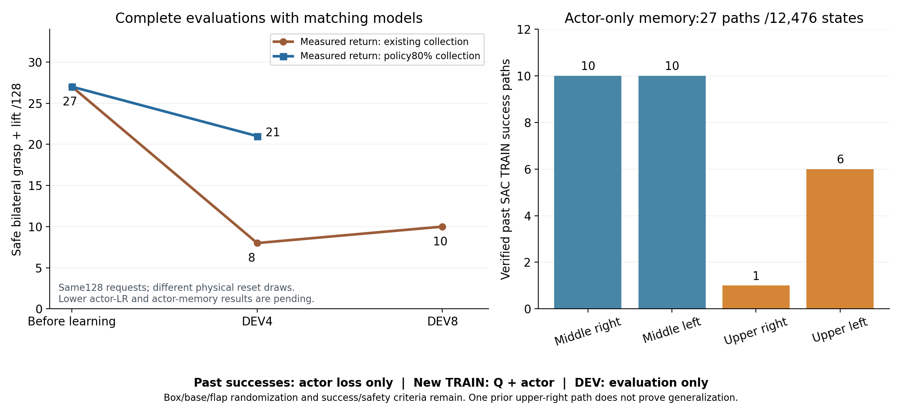

# 10/07 실제 SAC 성공 동작을 기억하는 추가 비교

현재 정책으로 TRAIN의80%를 수집한 비교의 첫 전체 평가는 **27→21/128**이었다.
중간 좌9·우12, 상단 양쪽0이며 랙64·낙하2·과도한 들기3건이었다. 초기화가
양쪽 모두 유효한116조건에서도 초기27→19건이었다. 누적 보상 보강의 기존
첫 평가8건보다는 높지만 자기 초기27건을 넘지 못했다. 같은 요청이라도 물리
reset·flap 추첨이 같다고 가정하지 않고 수집 변경의 효과로 단정하지 않는다.
[동일 actor705/Q4868의 전체 평가](assets/rl_v2_return33_greedy80_first_full_DEV_20261007.json).



그림 왼쪽은 완료된 평가만, 오른쪽은 학습 입력으로 검증한 과거 성공 경로 수다.
새 actor 기억 비교의 학습 후 성능은 아직 포함하지 않는다.

새 방법은 **이전 SAC 탐색에서 실제로 성공한 동작을 actor가 잃지 않도록 기억**한다.
VR 시연을 실행 중 재생하거나 성공 보상·Q 라벨을 가져오는 방식은 아니다.
원래 박스·base·배경·움직이는 flap 무작위화와 양손 pad5N 접촉·0.25초 유지·
8mm 들기, 랙10N·주변 장애물5N·자기 충돌OFF를 유지한다. 박스를 고정하거나
curriculum을 추가하지 않는다. 일반화 성공은 이 기억 데이터의 존재로 증명되지 않는다.

## 어떤 데이터를 쓰는가

종료된 자기 SAC writer·supervisor의 정상 종료와 최종 Drive 검증을 확인했다.
보존된 체크포인트의 성공 은행을 원본 HDF·TRAIN 요청·완료 결과와 대조했다.
**27경로·12,476관측**이며 중간 우10·좌10, 상단 우1·좌6경로다. 현재 학습에서
아직 얻지 못한 상단 오른쪽 성공 경로도 포함한다.

Actor 관측·목표 좌표·물리·제어·성공·충돌 계약과 고정 몸체 anchor를 확인했다.
이전 보상 및 critic 관측 차원은 같다고 가정하지 않는다. 원래 기록된 절대
목표를 현재 제어기로 계산한 몸체·그리퍼 명령은 원본과 정규화 명령 최대
3.58e-5 차이였다(float32 재계산 허용1e-4). 현재 목표 범위와 jaw gate도 통과했다.

초기 물리 상태와 랙 기준 상대 관측으로 전체 경로의 실제 박스 높이를 복원해
**현재의 reset 상대10cm 낙하 기준**도 검사했다. 최대 하강은0.0000974m로
모두 통과했다. 새 TRAIN 및 원래 DEV와 seed가 겹치지 않고, 원래 성공의 양손
파지·hold·proof lift·안전 증거를 유지했다. 평가 경로나 waypoint probe는 제외했다.
[원본·계약·안전·명령 검증](assets/rl_v2_verified_actor_only_TRAIN_memory_20261007.json).

## 학습에 어떻게 연결하는가

| 항목 | 설정 |
| --- | --- |
| 시작 정책 | 최고33건에서 보존한 기존 초기 동작·Gaussian 그대로 |
| actor / Q·entropy 학습률 | 기존 추가 비교와 같은1e-6 / 3e-4 |
| 수집 | 현재 정책80% / 기존 탐색20% |
| 과거 기억 파일 | actor 관측·실제로 실행한 절대 목표·성공 출처만 |
| Q·replay·success reward bank·return bank | 새로 시작; 과거 기억 데이터는 넣지 않음 |
| Actor 성공 표본 | 기존64개; 구역 균형→구역 안 경로 균등 |
| 파지 직전 강조 | 기존과 같은 절반32개는 마지막64동작에서 추출 |
| 신규 성공 | 기존 Q replay/return bank에 추가; actor 표본에서도 과거 기억과 함께 사용 |
| 손실 | 기존 절대 목표MSE·servo 구간Huber0.01·jaw NLL; 가중치 유지 |
| 몸체 / jaw 유지 가중치 | 1/0.3²=11.111… / 0.05 |

과거 기억이 critic 배치에 들어가는 행은0개다. VR/teacher BC 손실도 추가하지
않는다. 이 방법의 actor 성공 손실은 실제 성공 동작에 대한 모방 성격을 갖지만,
학습 중 수집한 자기 SAC의 성공 경험을 보존하는 별도 경로다. Q와 탐색은 계속
새 환경에서 학습한다. 원래1536개 TRAIN·네 구역32개씩 DEV128개를 유지한다.

## 검증과 실행

관련69개 검사를 통과했다. 실제 SAC 한 번의 동일 배치 업데이트에서 기억을
actor 손실에 추가해도 Q·두 target의 업데이트는 정확히 같고 actor의 경사는
달라짐을 확인했다. 평가·실패·보상 필드의 잘못된 기억 입력과 학습을 시작한
초기 입력, 다른 좌표·anchor·checkpoint/replay 기억 출처는 거부한다.

CPU에서 **전체 training=True 학습기와 checkpoint·experience 재개**를 확인했다.
초기 모델·normalizer·4개 optimizer는 그대로였고, 실제 과거 TRAIN1,259관측에서
몸체·그리퍼·Gaussian도 정확히 같았다. 기억12,476행만 연결되고 Q 관련 은행은
모두0이다. 실제 actor sampler는64행을16·16·16·16으로 뽑고, servo·jaw 손실의
유한한 경사를 확인했다. 이것은 연결 검증이며 새로운 물리 성공률이 아니다.
[전체 실제 복원·표본 연결](assets/rl_v2_actor_memory_conservative_fulltrainer_preparation_20261007.json).

```bash
python scripts/rl/prepare_actor_memory_servo.py \
  --initial-checkpoint /absolute/path/to/pristine_conservative/checkpoint_00000000.pt \
  --actor-memory /absolute/path/to/verified/actor_only_successful_TRAIN.pt \
  --matching-memory-proof /absolute/path/to/verified_physical_audit.json \
  --training-manifest /absolute/path/to/pristine_conservative/training_manifest.json \
  --waypoints /absolute/path/to/pristine_conservative/waypoints.json \
  --output-dir /absolute/path/to/unique_actor_memory_initialization
```

생성된 별도 artifact type으로 기존 배치 학습·정책 재생이 같은 클래스를 선택한다.
기억은 체크포인트·재개 파일에 명시적으로 저장하며 실제 원본 데이터와 초기
모델의 SHA256이 검증된 입력만 사용한다. 기존 실행의 은행을 바꾸지 않는다.

**10/07 21:43 KST에 GPU3의 고유 실행을 시작했다.** 실제 writer2689717·
supervisor2689686의 소유자·실행 폴더·CUDA_VISIBLE_DEVICES=3과 active 서비스를
확인했다. 기존 다섯 학습에는 신호를 보내지 않았다. 평가와 정확히 같은 첫
DEV4 모델을 보존하는 CPU 관찰자도 실제 실행을 확인했다. 시작 시점에는 장면
초기화 중이며 첫 학습 후 성능은 아직 없다.
[실제 실행·백업·관찰자 확인](assets/rl_v2_actor_memory_conservative_actual_launch_20261007.json).

이후 실제 첫 초기 평가에 진입했다. 준비 입력·agent·progress 계약이 정확히
같고 actor518/critic578, 실제 optimizer의 actor1e-6·Q3e-4를 확인했다. 과거 기억
12,476행·네 구역10/10/1/6경로가 actor에만 연결됐으며 Q/replay·신규 성공 보상·
실제 return 은행 및 actor/Q 카운터는 모두0이었다. 정책80%/탐색20% 수집 설정도
실제 manifest와 일치했다. 이는 실행 연결 확인이며 학습 후 성공률은 아니다.
[첫 실제 평가의 계약·기억 연결](assets/rl_v2_actor_memory_conservative_first_actual_DEV_20261007.json).

기존 Drive 연결로 초기 체크포인트·계약7개의 크기·MD5를 검증했다.
학습 중300초 업로드·최신2개 보존,
종료 후 닫힌 로그 검증을 사용한다. Raw HDF/replay는 RAM에 남으며 체크포인트·
로그 전용 백업에서 정리하지 않는다. 네 구역·다른 크기·독립 FINAL의 안정적인
성공은 아직 입증되지 않았다.
