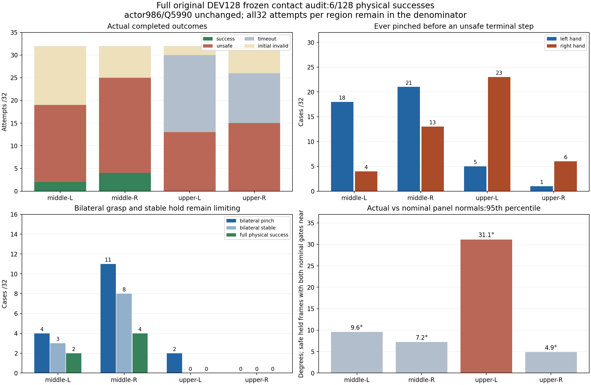
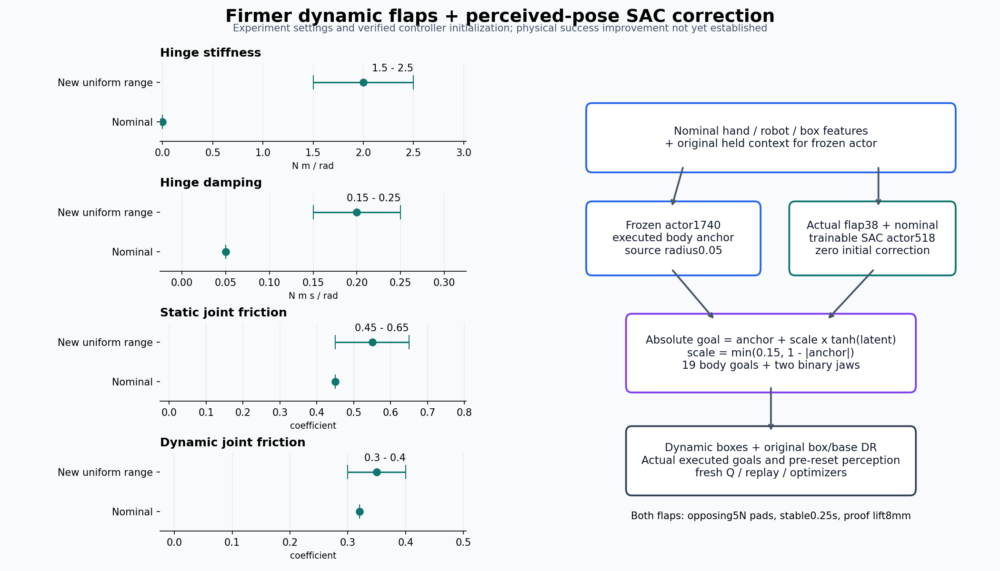
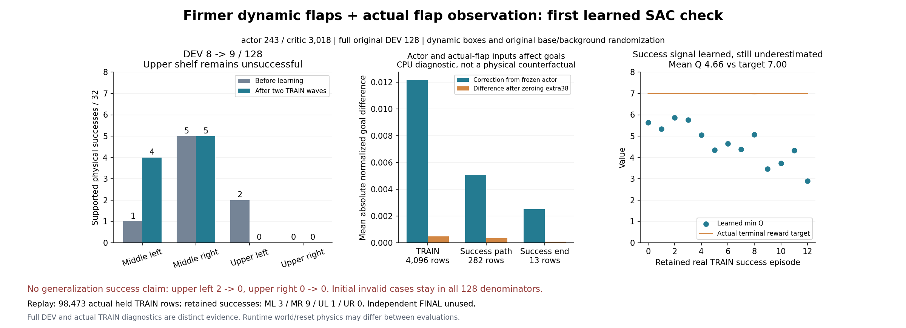
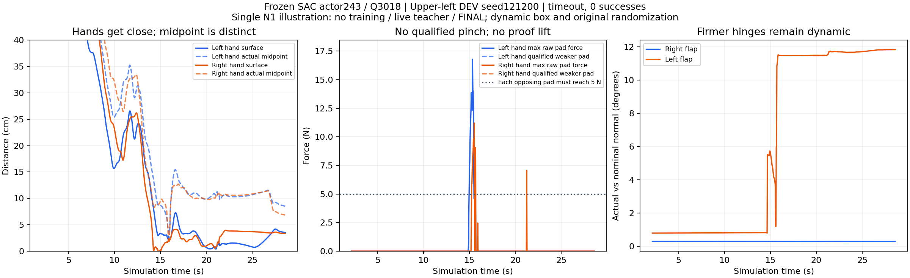

# 실제 flap 관측과 더 단단한 동적 flap의 SAC

2026-10-05. 위 선반에서 부족한 손의 파지를 교정하도록 별도 SAC 정책을
구현했다. 사용자의 추가 요청에 따라 flap 힌지도 조금 더 단단한 범위에서
무작위화한다. 박스와 base 위치, 주변 박스 배치의 기존 무작위화는 유지한다.
실행 시작과 초기 제어 동작 대조는 성공률 개선의 증거가 아니다.

## 변경 이유와 현재 증거

[기존 전체128개 접촉 진단](RL_V2_CONTACT_REWARD_SAC.md)에서 frozen 정책은
6/128 성공했다. 위 선반 왼쪽의 한 번 이상 손 파지는 왼손5/32, 오른손23/32이며,
안정적인 양손 파지는0/32였다. 안전하게 손이 가까워진 프레임에서 실제/nominal
flap 방향 차이의95백분위는 약31°였다. 기존 GPU0 학습의 DEV9는8/128이며
위 선반 왼쪽0/32, 오른쪽1/32였다. flap 변형만이 실패 원인이라고 확정하지 않는다.



보상은 이미 실제 flap 접촉과 자세를 사용한다. 새 수정은 actor가 실제 flap 자세도
볼 수 있게 하는 관측 변경이며, 같은 보상에 연결되지 않은 관측 차이를 보완한다.

## 더 단단한 flap의 무작위화

[`scene/flap_dynamics.py`](../src/kuavo_isaaclab_scene/rl/multi_box/scene/flap_dynamics.py)의
`firm_flap_dynamics_contract()`에서 실험 범위를 관리한다. 일반 v2 기본값은 변경하지 않는다.

| 항목 | 기존 v2 | 새 선택적 실험 |
|---|---:|---:|
| 관절 강성 | 0 | 1.5~2.5 N·m/rad |
| 관절 감쇠 | 0.05 | 0.15~0.25 N·m·s/rad |
| 관절 정마찰 | 0.45 | 0.45~0.65 |
| 관절 동마찰 | 0.32 | 0.30~0.40 |
| 초기 힌지 각도 | 0° | −1~+1°; 기존 물리 관절 한계 안으로 제한 |
| 스프링 기준 각도 | 0 | 0 rad |
| torque/velocity 한도 | 5 N·m / 10 rad/s | 동일 |

네 flap의 값을 환경·관절·reset마다 독립적으로 균등 추출한다. 기존 box/reset의
위치와 joint 한계, 질량, 접촉 재질은 유지한다. flap은 계속 동적인 관절이며,
episode 중 자세나 속도를 덮어써서 붙잡지 않는다. 작은 초기 각도 범위는 이후
움직임의 hard limit가 아니다. 접촉 힘이 크면 여전히 움직일 수 있다.

Reset은 Isaac API로 값을 쓰고 PhysX stiffness/damping/friction을 다시 읽어
확인한다. `flap_dynamics_wave_*.json`의 `env_ids`와 각 asset별 실제 적용 값을
확인한다. 자동 reset 때문에 마지막 기록이 일부 환경만 포함할 수 있으므로
기록된 ID를 전체128개로 오인하지 않는다. 변경된 물리 계약의 Q/replay를
기존 nominal 실행에 섞지 않는다.



[설정·초기 제어 대조·실제 실행 출처](assets/rl_v2_actual_flap_firm_configuration_20261005.json).
이 그림의 범위는 실험 설정이며 성공률 측정값이 아니다.

## 관측·동작·학습 계약

원래 `policy:464`, `critic:66` 그룹과 frozen actor가 받는 nominal 관측은
유지한다. 별도 `actual_flap_relations:38` 그룹은 실제 인지된 panel 중점에 대한
각 손의 상대 위치3D·회전6D를 두 flap 모두에 제공하고, 서로 다른 flap 배정2D를
제공한다. 현 시뮬레이터는 기존 panel link pose와 알려진 local 중점을 읽는다.
새 contact sensor, physics step, force/success actor 입력은 추가하지 않는다.

추가38차원은 변환된 nominal 입력과 마지막6개 held 문맥 사이에 들어간다.
최종 actor는518차원, critic은577차원이다. 현재 관측과 종료 직전의 다음 관측을
같은 ID로 저장한다. `TerminalObservationMixin`으로 autoreset 전에 캡처하며,
HDF에는 `actor_supplemental`과 `next_actor_supplemental`을 별도38차원으로 남긴다.

몸 제어는 source actor1740의 **실제 projected 목표**를 frozen 기준으로 쓴다.
19차원의 새 SAC 출력은 이 기준에 대한 교정이며, 초기 평균은0이다.

```text
anchor = frozen source actor's executed absolute19D goal
scale = min(0.15, 1 - abs(anchor))
physical_goal = anchor + scale * tanh(new_actor_latent)
```

Joint goal 경계에서는 대칭 교정 범위가 줄어든다. 경계의 고정 좌표는 continuous
entropy에서 제외하고, 나머지는 실제 scale의 log Jacobian을 반영한다. 샘플을
물리 목표로 변환하는 작업은 deterministic/상관 탐색/Q target 각각에서 정확히
한 번이다. Q와 replay, 성공 TRAIN의 MSE label은 계속 **실제로 실행한 절대 목표**다.

기존 source radius0.05 문맥과 원래 confident jaw reference를 보존한다.
새 radius0.15에 맞게 trainable actor의 normalization 문맥 평균을 옮긴다.
Production nominal 접근 gate는 유지하여 초기 그리퍼 명령까지 보존한다.
Actual flap 자세를 보는 새 trainable jaw/body policy가 이후 이를 교정한다.
기존 VR prior MSE는 재활성화하지 않는다. 새 성공 TRAIN replay는20%에서5%로
줄이고, DEV/독립 FINAL은 Q나 성공 bank에 넣지 않는다.

| 새 SAC 설정 | 값 |
|---|---:|
| latent std 초기 / 최소 / 최대 | 0.08 / 0.03 / 0.12 |
| 내부 goal의 초기 std | 최대 약0.012; 경계에서는 감소 |
| TRAIN 탐색 AR1 | 0.99; 환경마다 독립 |
| actor LR | 1e−5 |
| replay capacity | 500,000 실제 held TRAIN 전이 |
| critic 초기 warmup | 2,048 업데이트 |
| actor 수집 warmup | 32,768 실제 held TRAIN 전이 |
| critic / actor 업데이트 비율 | 4 / 1 |

γ0.999, 새 contact progress 보상, 10N robot–rack/5N robot–obstacle, self collision OFF,
양손의 서로 다른 flap·각 pad5N·안정 hold0.25s·proof lift8mm 조건은 유지한다.
Base 접근/정지 stage는 기존 fallback이며, 새 SAC가 base 이동을 학습했다고
표현하지 않는다.

## 첫 전체 평가와 실제 학습 시작

새 설정의 학습 전 DEV0는 **8/128**이었다. 중간왼쪽1/32, 중간오른쪽5/32,
위왼쪽2/32, 위오른쪽0/32다. 초기 무효29개도 분모에 포함한다. 유효99개는
성공8·안전 위반66·timeout25였다. 안전 원인은 rack42, box speed23,
lift limit7, drop2, workspace2이며 중복될 수 있다.
[실제 전체128개 요약](assets/rl_v2_actual_flap_firm_first_DEV_20261005.json).

이때 actor/Q 업데이트는0이었다. Frozen source의 기존DEV9는8/128(2/5/0/1)이므로
새 조건에서 큰 성공률 상승이 확인된 것은 아니다. 실제 초기 물리 상태도 달라
flap만의 순수 효과라고 단정하지 않는다. 이후 첫 TRAIN의 live progress에서
Q718 업데이트·실제 held TRAIN28,910개와 유한 Q loss를 확인했다.
Actor는 critic2,048업데이트와 held32,768개를 모두 확보한 다음 갱신한다.

23:22의 live TRAIN2에서 warmup이 끝나 **actor33/Q2180**, 실제 held TRAIN76,687개를
확인했다. Q loss0.01248, actor loss0.26161이며 유한하다. 첫 완료 TRAIN128개는
성공6개(모두 중간오른쪽), 초기 무효44개였다. TRAIN 결과는 평가 성공률로
표현하지 않으며, 학습 후 첫 전체 DEV는 아직 완료되지 않았다.

기존 GPU0 첫 블록은 exit0으로 끝났지만 최종DEV12가5/128(0/3/2/0)으로
하락했다. Source actor2476/Q11952와 실제 TRAIN393,021개를 그대로 이어
더 오래 학습하는 대조 실행을 별도 시작했다. 고유 부모는
`contact_reward_matching_long_control_sac_pgs128_gpu0_20261005_230535`이며,
새 GPU3 물리/관측과 데이터를 섞지 않는다. 원래 box/base/background DR와
네 영역별32개 기준을 두 실행에서 계속 유지한다. 이 결과만으로 목표를
완료하지 않는다. 학습 후의 전체 DEV와 영역별 유지가 다음 판단 근거다.
새 GPU0 writer PID1487816의 소유권·run 경로·CUDA0 및 실제 전체 DEV rollout도
확인했다. Source replay393,021개를 읽어 같은 계약의 학습을 이어간다.

## 첫 학습 후 전체 DEV — 일반화 개선은 아직 없음

Actor243/Q3018 뒤 DEV3는 **9/128**이다. 원래 네 영역 각32개와 초기 무효29개를
분모에서 빼지 않았다. 중간왼쪽은1→4, 중간오른쪽5→5, 위왼쪽2→0,
위오른쪽0→0이다. 유효99개 중 성공9·unsafe63·timeout27이며 rack45,
box speed16, lift limit5, drop3, workspace1은 겹칠 수 있는 안전 원인이다.
한 영역의 개선만으로 네 영역 일반화 성공을 선언하지 않는다. 이번 실제 reset의
물리 상태/힌지 난수는 이전 평가와 같다고 가정하지 않는다.



[전체 결과 snapshot](assets/rl_v2_actual_flap_firm_first_post_DEV_20261005.json).
두 완료 TRAIN에는 실제 성공14개가 있었고, checkpoint 성공 bank에는13episode가
남아 있다(중간 좌3/우9, 위 좌1/우0). Replay는 실제 held TRAIN98,473행이며 DEV/FINAL
행은0이다. 학습은 계속 진행하며 다음 전체 DEV에서 지역별 유지 여부를 다시 본다.

10/06 00:12의 실제 PID·CUDA3·서비스 대조에서 새 학습 writer1292348은 유지됐고,
actor687/Q4796, 실제 held TRAIN replay153,307행이었다. 손실은 유한하다.
Wave5 TRAIN이 진행 중이며 전체13-wave 중5개가 닫혔다. 최신 전체 DEV는 여전히
9/128이므로 이 업데이트 수를 새로운 성공률로 해석하지 않는다.

### 읽기 전용 CPU 대조

[실제 checkpoint와 TRAIN 입력의 진단](assets/rl_v2_actual_flap_firm_actor_Q_audit_20261005.json)은
GPU나 optimizer를 사용하지 않는다. 모델 tensor는 모두 유한하고 실제4096 TRAIN
입력의 몸 목표는 frozen 기준에서 평균0.01213 normalized goal만큼 변했다.
성공 경로282행에서는0.00503이다. 실제 추가38개 특징의 첫 layer weight는0에서
변했고, 이 특징을0으로 만들면 몸 명령이 평균0.000468만큼 달라지며 gripper 결정은
14개 변했다. 이는 CPU feature ablation이며 실제 물리 반사실 성공률이 아니다.
표본에서 Q→몸 교정 latent의 gradient가0인 좌표는0%였다.

보존한 성공13개의 실제 terminal target 평균은6.996, learned minQ는4.655다.
성공의 양의 신호를 배우고 있지만 아직 평균2.341 낮게 평가한다. 연결과 유한 손실은
일반화 성공의 증거가 아니다. 현재 독립 FINAL은 사용하지 않는다.

### 실제 flap 정책의 동결 영상 재생

`replay_v2_grasp_reference.py --staged-goal-sac --no-staged-goal-training`도 이제
manifest의 optional 실제 flap38D 그룹과 firmer hinge profile을 생성한다.
정책 클래스와 추가 관측 계약을 대조하고, 현재와 autoreset 전 다음 추가 관측을
SAC/기록기에 전달한다. HDF의 supplementary38D와 PhysX hinge readback을 남긴다.
구 nominal 정책은 추가 그룹 없이 그대로 재생한다. 추가 관측의 TRAIN goal 수집은
matching batched runner를 사용한다.

관련 CPU19개 통과와 실제 GPU3의 동결 checkpoint 로드·세 관측 그룹 및121step의
base 정지 후 실제 SAC 제어를 확인했다. 원본 DEV 위왼쪽 seed121200을
actor243/Q3018로 시각화하는 고유 실행은
`actual_flap_firm_frozen_visual_gpu3_20261005_234823 / actual_replay_20261005_234823_cf3034`다.
새 SAC 학습 writer는 유지했다. 재생 입력5개는 기존 Drive에서 크기·MD5를 확인했다.
단일 cold N1의 영상은 전체 N128 성능이나 독립 FINAL이 아니다. 학습/replay 갱신을
금지하고, 닫힌 영상은 browser H264로 변환한 뒤 기존 Drive와 Notion에 보관한다.

별도 CPU 영상 준비 helper가 episode 인덱스를 layout 내부에서 읽으려다 실패한
부분은 원래 wave row에서 읽도록 수정했다. GPU writer를 시작하기 전의 준비 오류였고,
진행 중인 SAC 학습에는 영향을 주지 않았다. 이미 검증된 입력을 재검증해 재사용했다.

### 10/06 닫힌 동결 영상: 접근했지만 대향 파지는 부족

위왼쪽 원본 DEV seed121200의 actor243/Q3018 동결 영상은 안전 위반0,
파지0, timeout1로 종료했다. Writer exit0은 재생 정상 종료이며 파지 성공이 아니다.
단일 cold N1 장면은 전체 N128 성공률이나 새로운 FINAL이 아니다.



[읽기 전용 측정](assets/rl_v2_actual_flap_frozen_visual_audit_20261006.json):
종료 시 최근접 표면 거리는 좌3.49cm/우3.38cm이며 실제 flap 중점 거리는
좌8.50cm/우6.83cm다. Raw pad 접촉 최대16.78N/11.20N은 있었지만 영역·대향 조건을
통과한 약한 pad의 힘은 양손 모두0N이고 파지·proof lift는0frame이었다.
단일 pad 접촉이나 거리만으로 대향 파지 성공을 기록하지 않는다. 마지막 flap 법선의
actual/nominal 차이는 오른0.28°/왼11.82°였다. 초기±1°는 hard 회전 한계가 아니며
한 장면의 차이를 강성만의 인과 효과로 해석하지 않는다.

Actor/Q 카운터243/3018은 전후 같고 optimizer 업데이트·평가 replay import·실시간
VR/IK teacher는0이다. 현재/다음 HDF 추가 관측은 각각858×38이며 모두 유한하다.
Writer가 종료한 뒤 영상은H264/avc1/yuv420p/faststart와 전체 decode를 확인했다.
원래 관리자의 닫힌 영상·로그·HDF Drive 검증을 마쳤으며 native 영상과 그림을
[Notion 진행 페이지](https://app.notion.com/p/3ec63918d42a81389724c8cc53084726)에 추가했다.
로컬 영상은 위 고유 재생 run의 `policy.mp4`다.

GPU3 새 학습 writer는 유지한다. 10/06 00:26 실제 대조에서 actor1002/Q6054,
held TRAIN replay192,912행, 유한 손실·백업 정상이며 wave5 TRAIN이 진행 중이었다.
당시 최신 전체 DEV는9/128이었고 다음 전체 DEV6/9/12에서 네 영역을 다시 판단한다.

### 10/06 00:40 두 번째 후속 전체 DEV6:6/128

Actor1002/Q6054의 전체 원본 DEV128은6/128이다. 중간 왼쪽3/32,
중간 오른쪽3/32, 위왼쪽0/32, 위오른쪽0/32로8→9→6/128이며 개선이 없다.
초기 유효98/무효30개이고 무효도 분모128에 남긴다. 나머지는 성공6·unsafe63·
timeout29다. 겹칠 수 있는 원인은 rack50, speed17, lift limit8, drop3,
workspace2, obstacle1이다. 같은 requested layout ID라도 reset된 실제 물리 상태가
같다고 가정하지 않는다. 통계 회귀 stop rule 미발동은 성능 개선을 뜻하지 않는다.

[전체 원본 결과와 고정 기준 비교](assets/rl_v2_actual_flap_firm_second_post_DEV6_20261006.json)를
남겼다. Flap 강성·감쇠 및 실제 관측 추가가 양손 파지 일반화를 해결했다고
표현하지 않는다. 이른 동결 영상의 대향 pad 접촉 부족과 위 선반 실패를 다음
TRAIN/DEV9/12에서도 판단한다. 현재 GPU3 학습은 이어가며 DEV/FINAL 데이터를
학습으로 가져오지 않고 독립 FINAL은 사용하지 않는다.

### 10/06 유한한 base 전도 때문에 전체 배치가 종료된 문제와 재개

첫 firmer-flap 실행은00:48경 `Base-plane projection is singular or near vertical`
예외로 종료했다. OOM이 아니다. 유한한 quaternion이라도 base가 거의 수직으로
기울면 기존 절대 goal 제어기의 rack 평면 좌표 변환을 역산할 수 없다. 한 환경의
예외가128개 전체 writer를 중단시켰다. 직전 저장은actor1204/Q6864와 실제 TRAIN
replay224,625행이다. 이 종료는 파지 성공이나 정상 학습 완료가 아니다.

Projected-base 제어기를 사용하는 실행에 한해 측정된 평면 변환 determinant의
절댓값이0.1001 미만이면 기존 workspace 안전 실패와 penalty로 처리한다.
Decoder의 기존0.1 기준에 float32 회전 계산 여유0.0001을 둔다. 실패 전의 유한한
terminal 관측을 보존하고 해당 환경만 reset하며, 실제 실패 transition은 Q에 남긴다.
자세를 upright로 덮어쓰거나 NaN quarantine으로 숨기지 않는다. 이 수정은
base가 기울어지는 물리 원인 전체를 해결했다는 의미는 아니다.

실제2-env read-cache fault injection에서 env0만 실패/reset되고 env1은 계속
진행했으며 기존 workspace penalty와 terminal 관측 보존을 확인했다. 잘못된
자세를 PhysX에 쓰지 않았고 optimizer/Q 갱신이나 파지 성능 평가도 하지 않았다.
CPU 회귀 테스트77개와 후속 replay 필터·float32 여유 테스트를 통과했다.

원본 모델·Q·optimizer·탐색 일정과 성공 TRAIN bank6,346행을 유지한다. 재개 입력은
현재 또는 다음 상태가 기존 decoder의 지원 범위를 벗어난 과거4행만 제외해
224,621행이며 나머지 실제 action/reward/terminated label은 변경하지 않았다.
원본 checkpoint와 replay는 보존한다. [원인·2-env 결과·재개 내역](assets/rl_v2_firm_flap_projected_base_resume_20261006.json)을
기록했다. 독립 FINAL과 DEV 데이터를 학습에 가져오지 않는다.

재개 block은 원래 DEV0과 TRAIN/DEV7–18의13개 wave다. 환경128개,
각 wave마다 네 영역32개, TRAIN8/DEV5개이며 실패한 부분 TRAIN7은 추가 실제
rollout으로 다시 실행한다. 기존 부분 TRAIN7 replay는 보존했다. Flap profile,
박스/base/background randomization 및 파지 성공 기준은 유지한다. 새 고유
GPU3 관리자는300초 Drive 백업·체크섬 검증 후 최근2개 checkpoint 보호와
writer 종료 후 로그 검증을 기존 연결로 수행한다. 이전 writer의 닫힌 대용량
백업은 CPU에서 별도로 유지하며, 전송 중인 rclone을 중단하지 않는다.

```bash
PYTHONPATH=src:scripts/rl CUDA_VISIBLE_DEVICES='' python scripts/rl/prepare_projected_base_guard_resume.py \
  --checkpoint /absolute/path/to/closed-run/checkpoint_00006864.pt \
  --output-dir /absolute/path/to/unique-guarded-resume-input
```

생성된 동일 checkpoint와 필터된 replay를 matching training manifest 및 원래
TRAIN/DEV waves와 함께 `batched_staged_goal_with_drive.py --gpu 3 --training`에
전달한다. 실행 중인 writer의 입력을 수정하거나 checkpoint를 새 정책으로
해석하지 않는다.

## 검증 및 실행

실제 source TRAIN 관측405개에서 새 초기 몸 명령 오차0, 그리퍼 변경0,
jaw logit 오차0을 확인했다. 임의의 추가 관측도 초기 zero correction을 바꾸지 않는다.
이 관측들은 CPU 대조에만 사용하며 새로운 reward/Q/replay로 가져오지 않는다.
모든 critic/target/critic normalization/entropy/optimizer와 성공 bank는 새 상태다.

관련 CPU 테스트56개가 통과했다. 관측 pre-reset 캡처, HDF 정렬, 실제 action label,
한 번의 교정 변환, 경계 entropy, 원래 제어 보존, 새 replay 재개·구 replay 거부,
선택된 환경만 hinge randomization 적용을 확인한다. 물리 성공은 별도로 측정한다.

GPU3 실행은 `CUDA_VISIBLE_DEVICES=3`, renderer GPU3, PGS,128개 환경이다.
부모 폴더는 `artifacts/rl/drive_runs/actual_flap_firm_correction_sac_pgs128_gpu3_20261005_224437`,
실제 run은 `batch_sac_20261005_224437_2f9ae7`이다. 최초 DEV128 뒤8 TRAIN/5 DEV의
원래13-wave block을 사용한다. 독립 FINAL은 사용하지 않는다.
Writer의 소유권·run 경로·CUDA 격리·실제 세 관측 그룹과 첫 rollout을 확인했다.
첫 wave의 requested128 중 초기 유효99, 무효29이며 무효도 분모에 유지한다.
현재 실행 여부는 폴더 존재가 아니라 PID, 서비스, 최근 metrics/console로 다시 확인한다.

초기 checkpoint/입력7개와 검증 receipt를 기존 Drive 연결로 업로드·MD5 검증했다.
학습 관리자는300초마다 업로드하고 검증한 오래된 checkpoint만 정리하며 최근2개를
보호한다. Writer 종료 후 닫힌 로그/HDF/replay도 검증한다. 현재 관리자가 메모리에
불러온 uploader는 새로운 flap wave 파일 glob 이전 버전이므로, 종료 후 현재
`archive_pilot`으로 해당 immutable JSON까지 추가 확인한다. 재인증이나 다른
사용자의 파일·프로세스 변경은 없다.

대용량 종료 백업 두 개는 기존1MiB/s 예산보다 느리게 진행해 반복 시간초과했다.
`Rclone.upload`만0.25MiB/s+300초(최소600초)로 연장하고 접속15초/진행 없는 I/O60초,
immutable/size/MD5 검사와 최근 두 checkpoint 보존은 유지했다. 관련 CPU 테스트17개가
통과했다. 현재 복사 중인 원래 rclone은 유지하고, 종료된 writer의 CPU 관리자만
전송 자식이 없는 오류 후 대기 시점에 현재 코드로 이어받도록 별도 CPU 대기를
등록했다. 이는 백업 작업이며 GPU 학습·평가 결과와 무관하다. 최종 검증을 마치기
전에는 해당 대용량 파일을 지우지 않는다. 자세한 제한은
[Drive 운영 안내](RL_GOOGLE_DRIVE.md)를 참고한다.

```bash
PYTHONPATH=src:scripts/rl CUDA_VISIBLE_DEVICES='' python scripts/rl/prepare_actual_flap_residual_sac.py \
  --checkpoint /absolute/path/to/nominal-hybrid-checkpoint.pt \
  --training-manifest /absolute/path/to/contact-training-manifest.json \
  --waypoints docs/assets/rl_v2_staged_base_hold_candidates_20261004.json \
  --native-seed /absolute/path/to/lower-native-transitions.hdf5 \
  --native-seed /absolute/path/to/upper-native-transitions.hdf5 \
  --firm-flaps --output-dir /absolute/path/to/unique-initialization-directory
```

새 초기 checkpoint와 생성된 training manifest를 기존
`batched_staged_goal_with_drive.py --gpu 3 --training`에 전달한다. 고유 실행 폴더와
원래 전체 TRAIN/DEV waves를 명시한다. 기존 물리/관측 계약 checkpoint를
이 정책의 continuation으로 전달하면 거부한다.
