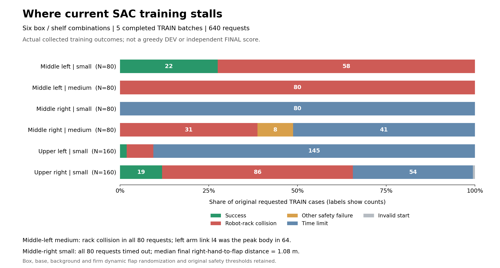

# 여섯 조합 SAC의 실제 학습 실패 분포

2026-10-08 11:59 KST에 GPU3의 여섯 조합 SAC가 완료한 TRAIN 배치
1·2·3·5·6의640요청을 집계했다. 실행 소스는 격리 commit
`8b061dbee5e2c8fbb2a9a09def81f99fc0133a27`이며 실제 writer3987840의
소유자·고유 경로를 확인했다. 활성 HDF나 replay는 읽지 않고 완료된 JSON 결과만
사용했다. 아래 수치는 수집 행동의 결과이며 greedy DEV 또는 독립FINAL 점수가 아니다.

## 어디에서 실패하는가

| 선반·방향 | 크기 | 요청 | 성공 | 로봇–랙 충돌 | 다른 안전 위반 | 시간 초과 | 초기 무효 |
| --- | --- | ---: | ---: | ---: | ---: | ---: | ---: |
| 중간 왼쪽 | small | 80 | 22 | 58 | 0 | 0 | 0 |
| 중간 왼쪽 | medium | 80 | 0 | 80 | 0 | 0 | 0 |
| 중간 오른쪽 | small | 80 | 0 | 0 | 0 | 80 | 0 |
| 중간 오른쪽 | medium | 80 | 0 | 31 | 8 | 41 | 0 |
| 상단 왼쪽 | small | 160 | 3 | 12 | 0 | 145 | 0 |
| 상단 오른쪽 | small | 160 | 19 | 86 | 0 | 54 | 1 |

중형은 좌우160요청에서 성공0이다. 중형 왼쪽80요청은 모두 로봇–랙 충돌로
끝났고 peak body는 `zarm_l4_link`64·`l_twofinger_base`15·
`r_twofinger_base`1회였다. 종료 시 손–배정flap 표면 거리 중앙값은 좌3.35cm·
우5.49cm다. 가까운 손 위치만으로 안전한 실제 파지를 달성했다고 판단하지 않는다.

중간 오른쪽small은80요청 모두 시간 초과했고 종료 거리 중앙값은
좌22.54cm·우107.93cm다. 이 값도 배정flap 표면까지의 거리다. **종료 거리만으로 전체 경로에서 전혀 접근하지 않았다고
단정하지 않는다.** 상단 왼쪽small은160요청 중145회 시간 초과했다.
중형 오른쪽의 다른 안전 위반8회는 lift 상한7·박스 낙하1회다.
[집계·충돌 부위·실제 종료 거리 원자료](assets/rl_v2_all6_completed_TRAIN_failure_modes_20261008.json).

## 다음 판단을 위한 실제 보정 진단

기존 학습은 유지하며 GPU0의 별도 고정 정책 진단에서 실제 flap 중간점을
추종한다. 11:56 KST의 같은 writer1476893은 control step361·41,154행까지
진행했고26환경에서 보정928행을 실행했다. 그 중714행은 팔 목표가 기존 affine
허용 범위에 걸렸다. 아직 닫기 제안과 실제 opposing pinch 후 들기 전환은0이다.
이 중간 카운터만으로 범위 부족이 모든 실패의 원인이거나 보정이 효과적이라고
판단하지 않는다. [실제 실행 카운터·원래447소스 보존](assets/rl_v2_cartesian_probe_guidance_runtime_20261008.json).

원래128요청·동적 박스와flap·base/배경 무작위화·보상·제어기·성공·충돌 기준을
그대로 유지한다. 보정 진단은 유지·들기 판단에 실제 pinch 정보를 쓰므로
standalone SAC와 구분한다. Actor/Q/온라인 replay0이고 이 결과를 Q 또는
원래 waypoint 준비에 넣지 않는다.
[보정 방법·원인 분해·검사·실제 시작](RL_V2_CARTESIAN_FLAP_DIAGNOSIS_20261008.md).

후속 전체 진단은 정상 종료했으며 성공0/128이다. 114개의 유효한 실제 명령을
재구성했고, 기존 성공의 접촉점이 중간점과 다르다는 추가 근거를 확인했다.
아래의 관찰기 시작·11:56 카운터는 당시 기록으로 보존한다.
[전체 종료·실제 명령·접촉 영역으로 변경한 방법](RL_V2_CARTESIAN_FLAP_DIAGNOSIS_20261008.md).

CPU 전용 결과 관찰기1681809도 실제 PID·소유자·빈CUDA_VISIBLE_DEVICES를
확인했다. 같은 writer가 정상 exit0으로 끝나고 run이complete일 때만 전체128개,
모델·normalizer198개 고정, 소스447개 SHA256, 같은checkpoint·waypoint 및
기존 물리·보상·안전 조건을 확인한다. 실행 중 결과를 종료 결과로 표시하거나
관찰 timeout으로 학습을 재시작하지 않는다. [관찰기의 실제 실행·범위](assets/rl_v2_cartesian_closed_result_observer_20261008.json).

전체 진단 종료 후에는 실제 명령·정렬·접촉과 보정 범위를 함께 확인한다.
새 방법의 물리적 효과가 확인되면 별도 실제TRAIN 수집으로 새 경험을 만들고,
보정 없는 learned SAC의 전체128개 평가로 판단한다. 현재 진단 행을 재사용해
학습 성공으로 바꾸지 않는다. 여섯 조합의 최신 전체 DEV는11→10/128이고
중형 성공0·독립FINAL 미사용으로 목표는 아직 달성되지 않았다.

## 보관 상태

11:56 KST의 기존 Drive 연결 접속은 다시`invalid_grant`였다. 새 인증은 만들지
않았고 검증되지 않은 파일은 정리하지 않았다. 당시 root 여유162.17GiB·
shared memory 여유218.60GiB를 확인했다. 실제 학습과 원래300초 백업 검사·
checksum 검증·최신 두checkpoint 보호는 유지한다. 인증 오류를 업로드 완료나
학습 중단으로 해석하지 않는다.
