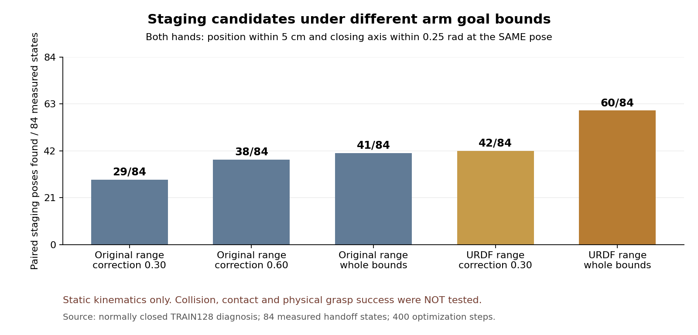

# 팔 목표 범위가 접근과 정렬을 막는지 확인

목표는 원래 박스·base·배경·움직이는 firm flap 무작위화에서 학습된 SAC의
양손 파지다. 여섯 조합의 실제 개발 평가11→10→7/128회와 중형 성공0은 아직
개선되지 않았다. 아래 정적 계산과 고정 교사 진단을 SAC 성공으로 표시하지 않는다.

## 새로 확인한 범위 문제

정상 종료한 이전 전체128진단의 유효114경로를 사용했다. 실제 첫 base 정착
상태114개와 두 손22cm 진입 상태84개, 총198개 입력을 조사했다. 각 입력에서
flap 영역 안의 점을 선택하고 랙 앞 진입 위치5cm·닫힘 축0.25rad를 **같은 자세에서
두 손이 모두** 만족하는지400회 관절 최적화를 수행했다. 원래 calibrated S63
TCP 계산은 측정값과30μm 이내로 일치했다. 입력별 waist·torso·base는 고정했다.

| 팔 목표 허용 범위 | 처음 base 정착 상태에서 자세 발견 | 실제22cm 진입 상태에서 자세 발견 |
| --- | ---: | ---: |
| 기존 affine 보정0.30 | 0/114 | 29/84 |
| 기존 정규화 범위에서 보정0.60 | 0/114 | 38/84 |
| 기존 정규화 목표 전체 | 0/114 | 41/84 |
| URDF 관절 범위로 정규화한 보정0.30 | 0/114 | 42/84 |
| URDF 관절 범위 전체,0.01rad 여유 | 104/114 | 60/84 |

위 분모는 서로 다른 시점의 상태다. 두 열을 성공률 개선 또는 같은 정책의
학습 전후로 비교하지 않는다. 성공한 물리 경로를 탐색한 수가 아니라 정적
손 위치·닫힘 축을 만족하는 자세를 발견한 수다. 충돌·접촉·동역학은 검사하지
않았다. **발견은 기하적으로 가능한 자세의 증거지만 실패한 탐색은 불가능의
증명이 아니다.** 가장 가까운 region 점은 각 질의에서 선택했으며 이후 실제
움직이는 flap 경로를 재생한 계산도 아니다.

기존 목표 정규화 자체가 데모의 관절 범위를 바탕으로 한다. 예를 들어 왼팔의
두 번째 관절 scale은0.36265rad라 보정0.30의 최대 추가 목표가0.10879rad,
약6.2°다. URDF의0.01rad 여유를 둔 범위로 같은0.30을 표현하면 최대0.57296rad,
약32.8°다. 실제 affine 여유는 anchor 위치에 따라 더 작다. 정규화 반경만
늘리는 방법과 관절 목표 전체 범위를 바꾸는 방법을 구분할 필요가 있다.
[원래114경로·각 상태·동시 위치/정렬·모델과 HDF 보존](assets/rl_v2_closed_arm_target_envelopes_20261008.json).

## 다음 별도 진단

`scripts/rl/frozen_cartesian_urdf_probe.py`는 v2의 실제 flap 영역 추종·원래
neural 닫기 보존·실제 pinch 후 방향 유지 방법을 그대로 사용한다. 두 손이
22cm에 들어온 이후 팔 목표를 원래 affine envelope 대신 알려진 S63 URDF의
관절 제한 안에서 제안한다. 관절 제안은control당0.02rad, URDF 여유0.01rad이며
실제 physical decoder의24채널 제한·제어기·비팔 명령은 그대로다. 원래 전체
TRAIN128·접근 후보8개·checkpoint와 무작위화·성공·안전 기준을 재사용한다.

별도 manifest tag는`frozen_actual_flap_URDF_contact_diagnostic_v3`다. 팔 목표
범위를 바꾸었다는 사실과 **저장 goal이 원래 affine 좌표의[-1,1]을 넘을 수
있다는 사실을 명시한다.** 이 goal은 실제 decoder 명령을 설명하는 교사 진단
좌표이며 bounded SAC actor action 또는 Q 행이 아니다. 모델·normalizer198개는
고정하고 actor/Q/replay0으로만 실행한다. 기존 waypoint/Q 준비 경로는 이 tag의
결과를 계속 거부한다. 성공해도 학습된 SAC나 독립 일반화 성공으로 집계하지 않는다.

관련25개 검사와 원래114경로의198개 실제 입력에서 정확한 decoder, 비팔 명령,
URDF 관절 범위·physical command 제한, 원래 허용된 neural 닫기를 확인했다.
그중84개에서 보정 제안을 만들었고2개는 원래 정규화 범위를 넘었다. 모델198개·
checkpoint·HDF SHA256을 보존했다. 새 접촉을 실행하거나 새 Q 경험으로 가져온
검사가 아니다. [실제 입력의 명령 검사](assets/rl_v2_cartesian_URDF_closed_state_rehearsal_20261008.json).

이 방법은 실행 중인 v2의 main source448개를 보호하기 위해 별도 checkout에서
준비했다. 활성GPU3 학습 소스와 사용자 수정은 보존한다. 실제 시작·전체 정상
종료·당시 모델/소스 고정·원래128결과가 확인될 때 실행 근거를 추가한다.
후속 SAC에 적용하려면 새로운 goal 정규화·실제 실행 action label·fresh Q/replay
계약을 따로 구현하고 보정 없는 같은 전체 개발 평가와 독립FINAL로 검증해야 한다.

## 실제 시작

13:30 KST에 별도 GPU0 writer2569616을 시작했다. 고유 폴더는
`GPU0_actual_flap_URDF_contact_frozen_TRAIN128_20261008_133020/`
`batch_sac_20261008_133022_9770d9`다. 실제 소유자·고유 경로·CUDA_VISIBLE_DEVICES=0,
격리 소스448개·원래 전체128·8후보·물리/보상/DR/안전 기준을 확인했다.
새 manifest에는 변경한 팔 범위와 교사 goal의 의미를 명시했다. 모델198개 고정과
전체 물리 결과는 정상 종료 뒤 확인한다. CPU 전용 확인기2591312가 같은 writer를
추적하며 다른 프로세스에 신호를 보내지 않는다.
[실제 시작·manifest·소스·검증 범위](assets/rl_v2_cartesian_URDF_actual_startup_20261008.json).

시작할 때 v2 writer2332935와 GPU3 SAC writer3987840을 유지했다. 비교 영상의
차이를 피하려고 기존 checkout의 사용자 영상 수정35c7e5d도 그대로 복사해
실행하되 이 파일을 커밋하지 않았다. 인증은 기존 checkout의 Drive wrapper를
사용하고300초 검사·최근2개 보호·미검증 원본 보존을 유지한다. 새 인증이나
다른 사용자의 파일·프로세스 변경은 없다.

V2는13:39 KST에 성공0/128로 정상 종료했다. 종료 당시 source448개와 모델198개,
원래 물리 조건을 확인한 뒤 이 진단 코드를main에 통합했다. 실제 실행은 계속
격리 source를 사용하므로 main 통합으로 활성URDF 또는GPU3 코드를 바꾸지 않는다.
[V2 전체 종료 근거](assets/rl_v2_cartesian_region_full128_closed_20261008.json),
[Notion 정적 그림·기존61개 media와5개 표 확인](assets/rl_v2_arm_range_Notion_verification_20261008.json).

## 탐색이 실제 명령에 전달되는지 추가 확인

별도 정상 종료 small TRAIN1,531경로의 성공·충돌·시간 초과를 모두 분석했다.
현재 최종 정책을 과거 상태에 적용했을 때 팔 미분 차단은 일부 있지만, Gaussian과
기존 arm bias도 실제 명령을 바꾼다. 제어기 clipping을 없애거나 탐색 크기를
더 키워야 한다고 단정하지 않는다. 이 단일 상태 분석은 실제 rollout이나 과거
정책 복원이 아니다. URDF 진단의 원래 전체 물리 결과를 계속 확인한다.
[실패 포함 분석과 재현](RL_V2_FAILED_TRAIN_SERVO_DIAGNOSIS_20261008.md).

## 전체 물리 종료와 들기 구간의 추가 병목

14:12 KST에 URDF 진단의 정상 종료·원래 전체128요청·소스448개·모델198개
고정을 확인했다. 성공0·안전 위반15·시간 초과99·초기 무효14회다. 앞선 영역
보정의 안전 위반40회보다 적지만 새 SAC 성능이나 안정적인 인과 효과로 표시하지
않는다. 같은 요청이며 flap 추첨·접촉 이력까지 동일한 비교는 아니다.
[전체 종료 근거](assets/rl_v2_cartesian_URDF_full128_closed_20261008.json).

유효114경로의 실제24채널 명령을 전부 다시 계산했다. 최대 오차4.2e-5이며
held80,136행·guide34,123행·닫기4,382행 등 전체 카운터가 실행 기록과 일치했다.
실제 opposing 양손 pinch가 생긴 경로는5개,8tick 유지 후 들기로 전환한 경로는
3개다. 전환3회는 고유 경로3개임을 따로 확인했다. 접촉만으로 성공으로 세지 않는다.
[전체 명령과 단계 재구성](assets/rl_v2_closed_cartesian_URDF_actions_audit_20261008.json).

중간 오른쪽small env74는 실제 양손 opposing 접촉을55tick, 약1.83초 유지했다.
시작 당시 각 pad 힘은8.39~10.49N으로 기존5N 기준을 만족했다. 그러나 들기
전환 후48tick에서 왼손 상승은0.89mm, 오른손은0.60mm에 불과했고 박스 clearance는
최대0.075mm였다.8mm proof lift가 생기지 않아 안정성 타이머도 시작하지 않았다.
기록된 실패는 정상적으로 실패로 유지한다.
[실제 접촉 유지·손 상승·정규화된 clearance 필드 검증](assets/rl_v2_closed_URDF_contact_lift_20261008.json).

새 선택형 `frozen_cartesian_pending_lift_probe.py`는 **실제 양손 opposing pinch가
유지되는 들기 구간에서만** 기존 pending PD 목표에 DLS 증분을 누적한다. 측정
관절 대비 목표 lead는0.08rad로 제한하고 URDF·기존 physical command 제한을
유지한다. 접촉 전 접근·삽입과 비팔 제어·2.5cm 들기 목표·성공·안전·무작위화는
그대로다. 현재 측정 위치 가까이 목표를 매번 다시 잡아 PD 오차가 수mrad에
머무는 문제가 하중 이동을 막는지 분리하는 진단이다. 아직 원인이 확정되거나
새 물리 성공을 확인한 것은 아니다.

기존 v3는 기본값으로 그대로 보존한다. 새 v4 tag는
`frozen_actual_flap_URDF_pending_lift_diagnostic_v4`이며 교사·actor/Q/replay0·
Q import 금지를 유지한다. 관련22개 검사와 실제 입력256개(처음 정착114·
진입86·실제 들기56개) 제안을 확인했다.200개 접촉 전 입력의 명령은 기존
v3와 bitwise 같았다. 정확한 decoder·비팔 보존·원래 모델과 HDF 보존을 확인했으며
이 재구성을 새 접촉이나 학습 경험으로 표시하지 않는다.
[새 명령 제안 검사](assets/rl_v2_pending_lift_closed_state_rehearsal_20261008.json).
