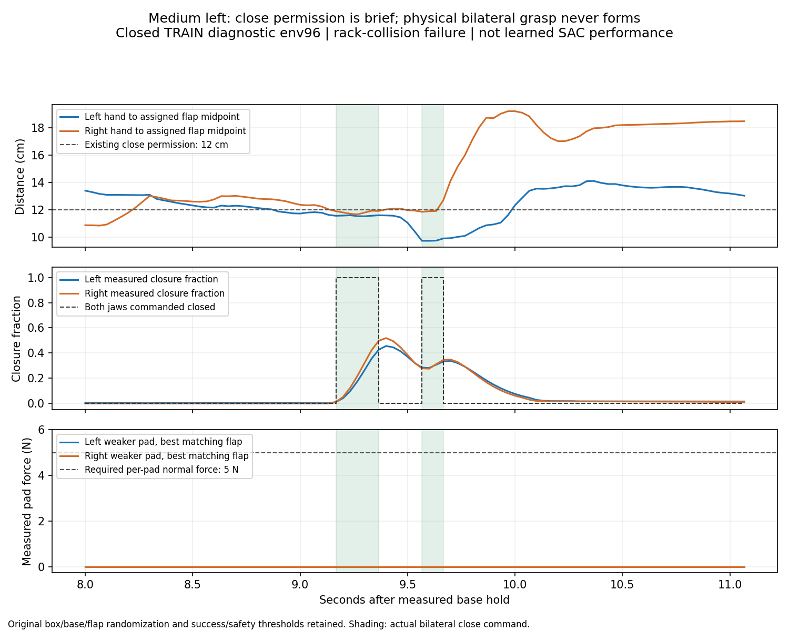

# 중형 진입과 양손 닫기 선택의 분리 진단

목표는 박스·base·배경·움직이는 firm flap의 무작위화를 유지한 SAC 양손 파지다.
GPU3의 여섯 조합 학습은 유지한다. 아래는 닫기 선택을 분리하는 고정 정책
진단이며, 이 결과를 SAC 개선이나 독립 일반화 점수로 집계하지 않는다.

## 전체 종료 결과: 0/128, 닫기 명령만으로 해결되지 않음

10/08 10:24 KST에 writer437496의 정상 exit0·실제 종료·run complete를
확인했다. 동일한 원래128요청·checkpoint·waypoint와233개 소스 SHA256,
모델·normalizer198개 및 actor/Q/replay0을 검증했다. **성공0·안전 위반34·
시간 초과80·초기 무효14회**다. 중형 왼쪽과 오른쪽 모두 성공0이다.

| 구역·크기 | 요청 | 성공 | 안전 위반 | 시간 초과 | 초기 무효 |
| --- | ---: | ---: | ---: | ---: | ---: |
| 중간 왼쪽 small | 16 | 0 | 10 | 4 | 2 |
| 중간 오른쪽 small | 16 | 0 | 4 | 12 | 0 |
| 중간 왼쪽 medium | 16 | 0 | 10 | 4 | 2 |
| 중간 오른쪽 medium | 16 | 0 | 2 | 12 | 2 |
| 상단 왼쪽 small | 32 | 0 | 1 | 29 | 2 |
| 상단 오른쪽 small | 32 | 0 | 7 | 19 | 6 |
| 전체 | 128 | 0 | 34 | 80 | 14 |

원래 비교와 공통 유효114조건의 성공은3→0회지만 실제 flap 추첨·접촉 이력은
동일하지 않으므로 차이를 닫기 개입의 확정적인 인과 효과로 해석하지 않는다.
원래 요청과 실패·초기 무효를 분모에 유지한다. 새 SAC나 독립 일반화 점수가 아니다.
[전체128 결과·frozen198·소스233·원래 요청 대조](assets/rl_v2_bilateral_close_full128_closed_20261008.json).

유효한 닫힌 HDF114개에서 원래 actor를 같은 실제 입력에 다시 적용했다.
Body 명령을 유지하고 허용된 jaw만 바꿨음을 실제 명령까지 확인했다.
총73,899 held 행 중 양손 gate 허용2,807행·실제 jaw 변경430행이다.
중형 왼쪽은 유효14회 중2회, 합계13행에서 닫기를 적용했고 오른쪽14회에는
허용 상태가0회였다. 양쪽 중형28회 모두 opposing bilateral pinch가 없었다.
[114개 실제 명령 재구성](assets/rl_v2_closed_bilateral_close_actions_audit_20261008.json),
[114회 terminal·실제 접촉 대조](assets/rl_v2_bilateral_close_contact_truth_20261008.json).

닫기를 적용한 왼쪽 env32의 연속 구간은0.133초, env96은0.2초와0.1초였다.
명령 중 실제 닫힘 비율의 최대는 각각 좌/우18%/22%,36%/43%이며 양손의
약한 pad 힘은 모두0N이었다. 명령이 끝난 뒤에도 env96의 최대 닫힘은46%/52%에
그쳤다. 닫기 요청을 실제 완전 닫힘·접촉·0.25초 안정 파지와 혼동하지 않는다.
[실제 닫기 구간·측정 closure·pad 힘](assets/rl_v2_closed_bilateral_medium_close_duration_20261008.json).



실제 손과 flap의 이동도 랙 좌표에서 분리했다. env96의 첫 닫기부터0.667초
동안 오른쪽 flap midpoint는12.5cm, 오른손은3.6cm 움직였다. 양손에서 독립적으로
복원한 같은 flap의 좌표가 일치했고 이 구간에서 손–flap 배정 변경은0회였다.
따라서 거리 증가를 목표 배정이 뒤집힌 오류로 설명하지 않는다. 이 수치만으로
박스 전체 이동·flap 관절 움직임·접촉 원인이나 제어 시계의 문제를 확정하지 않는다.
[실제 손·flap 이동과 배정 대조](assets/rl_v2_closed_medium_distance_motion_20261008.json).

강제 닫기를 본 학습에 적용하지 않는다. 기존12cm gate 안에 잠깐 들어오는
것보다 안전하게 더 정밀한 파지 위치에 진입하고 그 위치를 유지하는 동작이
우선이다. 중형 오른쪽의 진입 실패와 왼쪽의 짧은 닫기 구간을 따로 개선한다.
GPU3의 여섯 조합 SAC는 원래 범위로 계속 학습한다. 첫 학습 후 전체 DEV는
초기11→10/128로 개선되지 않았다. [현재 SAC 결과](RL_V2_SUPPORTED_SIZE_SAC_PROGRESS_20261008.md).

## 실행 시작 기록

2026-10-08 09:47 KST에 별도GPU0 실행을 시작했고 10:03 KST에 실제
writer437496의 소유자·고유 실행 경로·`CUDA_VISIBLE_DEVICES=0`을 확인했다.
고유 폴더는`GPU0_bilateral_near_close_frozen_TRAIN128_20261008_094705`다.
Manifest와 실제 learner report에 진단 tag가 있고 원래233개 소스 SHA256은
유지됐다. 전체128요청 진행 중이며 actor/Q/온라인/replay는0이다.
당시 물리 결과와 종료 후 tensor 검증을 기다렸으며 위에 완료 결과를 기록했다.

기존 Drive wrapper·300초 검사·최근2개 보존을 재사용한다. 백업 범위는
checkpoint·계약 metadata·종료 로그이며 raw HDF/replay/영상은 로컬에 남는다.
인증 실패로 검증되지 않은 원본을 삭제하거나 새 인증을 만들지 않는다.
기존 실행과 다른 사용자의 프로세스·파일을 건드리지 않았다.

## 정상 종료한 실제 기록에서 확인한 점

원래 중간 좌우 small/medium·상단 좌우 small의 TRAIN16조건×접근 후보8개,
총128요청을 완료했다. 초기 무효13회를 분모에 유지하고 닫힌 유효 HDF115개를
읽었다. 모델·정규화198개, actor/Q/replay0 고정과 실제 terminal 일치를 확인했다.

| 중형 구역 | 유효 시도 | 양손 모두12cm 이내에 들어온 시도 | 그 상태 관측 행 | 양손 닫힘 행 |
| --- | ---: | ---: | ---: | ---: |
| 중간 왼쪽 | 14 | 2 | 35 | 0 |
| 중간 오른쪽 | 14 | 0 | 0 | 0 |

이 두 구역에서 실제 midpoint로는 양손이 가깝지만 nominal gate가 막은 행은0이었다.
따라서 gate 계산 오류나 jaw 설정 하나가 모든 중형 실패를 설명하지 않는다.
오른쪽은 먼저 안전한 진입 경로가 필요하다. 왼쪽 원래 후보 env96은31관측,
약1초 동안 양손 닫기가 허용됐지만 양손 닫힘은 없었고 왼팔 link4의 랙 충돌로
끝났다. 종료의 최대 힘 링크를 최초 접촉 링크로 해석하지 않는다.
[정확한 gate·관측·첫 threshold·명령 근거](assets/rl_v2_closed_medium_gate_entry_20261008.json).

## 팔의 이동 범위가 막은 것인가

같은 정상 종료 기록의 중형28회(좌14·우14) 전체 held 구간을 재구성했다.
실제 checkpoint·관측·base 상태로 계산한 명령이 저장된 물리 명령과 일치했고
모델·HDF는 그대로였다. 사용한 body correction radius는0.30이다.

| 중형 구역 | 팔 | correction 경계95% 초과 비율 | 한 step servo clipping 비율 |
| --- | --- | ---: | ---: |
| 왼쪽 | 왼팔 | 1.00% | 7.23% |
| 왼쪽 | 오른팔 | 2.52% | 12.47% |
| 오른쪽 | 왼팔 | 1.30% | 6.07% |
| 오른쪽 | 오른팔 | 2.87% | 14.35% |

각 수치는 해당 구역의 모든 유효 held 행과 사용 가능한 관절 좌표를 합한 비율이다.
허용된 goal 경계에 계속 붙어서 실패한다는 근거는 약하며, 이것만으로 허용
범위를 더 넓히지 않는다. 반대로 이 비율이 낮다고 모든 자세에서 목표에 닿을 수
있다고 증명한 것도 아니다. 진입 경로·충돌·닫기 선택은 별도로 확인한다.
[28회 실제 명령 재구성·경계·거리 근거](assets/rl_v2_closed_medium_body_reach_audit_20261008.json).

## 실행하는 진단

`scripts/rl/frozen_bilateral_close_probe.py`는 기존 학습 runner를 재사용한다.
동일한 요청128개·checkpoint·waypoint·원래 제어기에서 **양손의 기존 production
12cm gate가 모두 허용할 때만 두 jaw를 닫는다.** 같은 입력에서 body 목표·명령은
그대로이고, 실행 jaw와 기록한21차원 goal jaw를 함께 바꾼다. 이후 접촉 때문에
관측과 다음 body 동작이 달라질 수 있으므로 전체 궤적이 같다고 주장하지 않는다.

진입 거리만 actor의 관측으로 읽으며 privileged pinch로 닫기나 lift를 결정하지
않는다. 성공·0.25초 유지·8mm clearance·랙10N·장애물5N·낙하10cm, self OFF와
원래 무작위화·물리는 유지한다. 고정된 박스나 성공 상태 reset을 쓰지 않는다.

진단 전용 process-local hook은 종료 시 복구하고 learning·DEV/FINAL·축소된
크기 범위·다른 controller/solver 실험을 거부한다. Manifest·실제 learner report에
`frozen_bilateral_close_probe`와 실제 변경 행 수를 기록한다. 해당 tag가 있는
결과는 원래 waypoint/Q 준비 경로에서 거부해 다른 정책의 성공으로 섞이지 않는다.

직접 실행 시 일반 frozen TRAIN runner 대신 이 스크립트에 원래 입력을 전달한다.
관리자가 실행한 정확한 인자는 고유 실행 폴더의`launch.json.command`에 있다.
직접 실행과 별도 Drive uploader를 연결할 때는[기존 백업 문서](RL_GOOGLE_DRIVE.md)를
따르며 새 인증이나 credential 복사를 하지 않는다. 다음 frozen 옵션을 유지한다.

```bash
--no-training --cpu-workplace-probe --base-waypoint-probe \
--unmeasured-size-workplace-probe --steps 900 --device cpu --learner-device cpu
```

관련18개 검사에서 jaw만 변경, 실행·기록 goal 일치, 원본 입력 보존, 학습·축소
범위 거부, hook 복구와 기존 manifest 경로를 확인했다. 물리 결과는 전체 종료와
원래198개 tensor 검증 후 판단한다. 이 검사가 파지 성공을 증명하지는 않는다.
추가 검사에서 이 진단의 manifest를 원래 waypoint/Q 준비가 실제로 거부하는지도
확인했다(추가1개 통과). Controller·reward·관측에 추가 변경은 없다.

전체 종료 결과에서 중형 파지는 생기지 않았다. 다음 개선은 현재 손–flap
관측에 따라 안전한 파지 위치로 들어가고 그 위치를 유지하는 실제 TRAIN 동작을
찾는 것이다. 오른쪽은 진입 자체, 왼쪽은 진입 뒤 정렬·거리 유지와 실제 닫힘을
따로 확인한다. 짧은 gate 진입을 성공으로 보상하거나 진단 데이터를 Q에 넣지 않는다.
