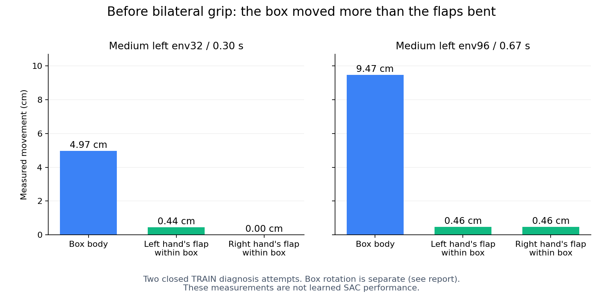

# 박스 밀림을 줄이기 위한 실제 flap 추종 진단

목표는 기존 박스·base·배경·움직이는 firm flap 무작위화를 유지한 SAC 양손
파지다. GPU3의 여섯 조합 학습은 계속한다. 아래 보정은 학습된 SAC와 구분한
별도 고정 정책 진단이며 아직 물리적 성공 결과가 없다.

## 확인한 원인

정상 종료한 이전 진단의 두 중형 사례에서 손–flap 거리 증가를 분해했다.
손에서 독립적으로 복원한 flap 좌표가 일치했고 배정 변경은 없었다.

| 사례 | 구간 | 박스 이동 크기 | 박스 회전의 flap 이동 기여 | 박스 기준 flap 이동 기여 |
| --- | ---: | ---: | --- | --- |
| 중형 왼쪽 env32 | 0.300초 | 4.97cm | 좌0.65cm / 우1.39cm | 좌0.44cm / 우약0cm |
| 중형 왼쪽 env96 | 0.667초 | 9.47cm | 좌6.62cm / 우3.06cm | 좌0.46cm / 우0.46cm |

좌/우는 각각 왼손·오른손에 배정된 flap이다. 각 기여는 벡터 합으로 전체 flap 이동을 재구성한다. 표의 크기는 방향이 달라
단순 합산하지 않는다. 이 두 사례에서는 flap 자체의 큰 변형보다 박스의 이동·
회전이 컸다. 어느 손의 접촉이 처음 박스를 밀었는지나 모든 실패의 원인까지
증명하지 않는다. [원본 유지·좌표·벡터 분해](assets/rl_v2_closed_medium_box_flap_motion_decomposition_20261008.json).

S63/leju-twofinger의 실제 관절각으로 계산한 calibrated closed TCP도 종료된
55시도의 6,134개 손 자세와 비교했다. 최대 위치 오차0.0161mm·회전 오차
0.00000132rad였다. 실시간 simulator Jacobian이나 새 보정 동작의 성공을
증명한 검사는 아니다. [실제 관절·TCP 좌표 대조](assets/rl_v2_closed_S63_measured_TCP_fk_audit_20261008.json).

## 이번에 확인할 보정

기존 neural 접근을 유지하다 두 손이 실제 배정 flap 중간점22cm 이내에 들어오면
팔만 보정한다. 랙 앞 진입 위치에서 닫힘 축을 panel 법선에 맞춘 뒤 실제 중간점을
추종한다. 팔의 제안 step은 최대0.02rad이고 기존0.30 affine body goal 범위와
기존 physical decoder를 유지한다. Base·몸통·머리·waist yaw는 원래 neural 명령이다.
기존 production12cm gate를 유지하며 실제 위치·축 정렬 후 닫기를 요청한다.

실제 opposing 양손 pinch를8tick 확인하면 측정한 잡은 위치에서 랙Z로2.5cm
들기를 제안한다. **이 진단의 유지·들기 판단에는 privileged 실제 pinch를 사용한다.**
따라서 성공하더라도 standalone SAC 또는 독립 일반화 성공으로 보고하지 않는다.
접촉 없이 닫힘 비율만 커진 경우나 같은 flap을 두 손으로 잡은 경우는 들기를
시작하지 않는다. 접촉을 잃으면 다시 파지 단계로 돌아간다.

원래 전체 TRAIN128 요청·접근 후보8개·기존 checkpoint를 사용한다. 중간 좌우
small/medium 각16개·상단 좌우small 각32개를 포함한다. 박스 고정·범위 축소·
성공 reset·controller gain 변경·safety 완화는 없다. 기존 실제 양손5N·0.25초 유지·
8mm clearance·랙10N·장애물5N·낙하10cm 및 self OFF를 그대로 판단한다.
Actor/Q/replay는0이고 모델·normalizer198개 고정 검사를 재사용한다.

`scripts/rl/frozen_cartesian_flap_probe.py`는 원래 전체 진단 guard와 runner를
재사용하고 process-local hook을 복구한다. Manifest·실제 report에
`frozen_cartesian_flap_probe`를 남기며, 기존 waypoint/Q 준비 경로는 이 변경된
결과를 거부한다. 진단의 실제 물리 명령과 저장 goal은 같은 decoder에서 생성한다.
오프라인 제안이나 평가·진단의 결과를 새로운 Q 경험으로 바꾸지 않는다.

기존 Google Drive wrapper·300초 검사·최근2개 보호를 재사용한다. 인증 오류가
계속되면 미검증 checkpoint를 유지한다. 다른 사용자의 파일·프로세스와 기존
학습 소스 worktree는 건드리지 않는다. 아래 실제 시작 기록에 고유 폴더와 PID를 기록했다.

## 실행 전 확인

관련17개 검사에서 TCP Jacobian의 위치·각도 변화, 비팔 명령 보존·정확한 goal
디코딩, 빈 닫힘·같은 flap의 들기 차단과 실제 opposing8tick 확인, 학습 거부·
hook 복구·기존 waypoint/Q 준비 거부를 확인했다. 추가로 정상 종료한 네 사례의
실제 입력411행에서 보정 제안을 계산했다. 모델·HDF는 그대로였고 원래 decoder와
비팔 명령이 일치했다. 제안을 물리적으로 실행한 데이터나 학습 성공으로 표시하지
않는다. [실제 입력의 오프라인 제안 확인](assets/rl_v2_cartesian_probe_closed_state_rehearsal_20261008.json).

## 실제 시작 확인

10/08 11:34 KST에 별도GPU0 실행을 시작했다. 실제 writer1476893의 소유자·고유
경로·CUDA_VISIBLE_DEVICES=0을 확인했다. 폴더는
`GPU0_actual_flap_cartesian_contact_frozen_TRAIN128_20261008_113429/`
`batch_sac_20261008_113431_535efb`다. Manifest의 진단 tag·원래128요청 일치와
원래447개 Python source SHA256을 확인했다. 전체 물리 결과·종료 후198개
모델 고정 검증은 대기 중이다. GPU3의 여섯 조합 SAC와 Q 보강 SAC는 유지했다.
[실제 PID·장치·원래 요청·검증 범위](assets/rl_v2_cartesian_probe_actual_startup_20261008.json).

11:46 KST에는 같은 writer가 실제 control step121·13,794행까지 진행했고
유효한114환경 모두 base 정착 이후 단계에 들어갔다. Actor/Q/온라인 replay는
모두0이다. 측정 관절로 계산한 TCP의 실시간 최대 위치 차이는0.0163mm다.
이 시점에는 두 손22cm 진입 조건을 만족한 환경과 보정 명령 행이 아직0이므로
물리 rollout 시작과 보정 성공을 구분한다. 전체128 종료 결과는 아직 없다.
