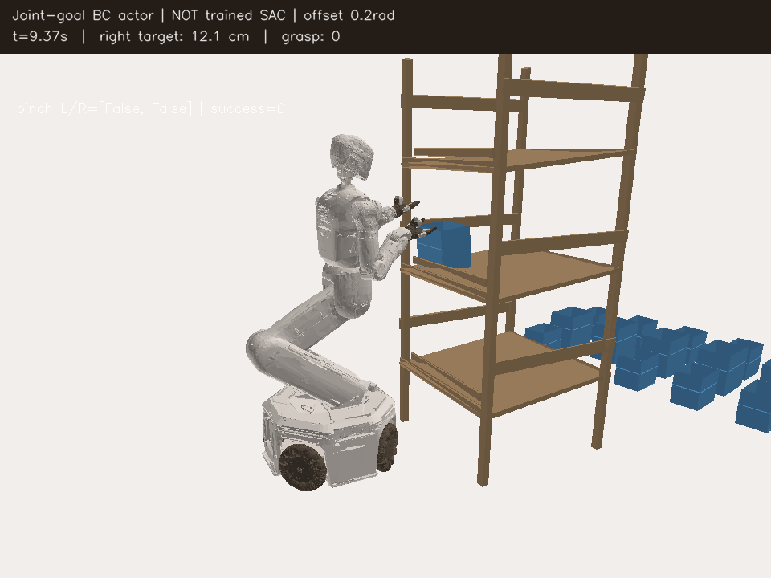
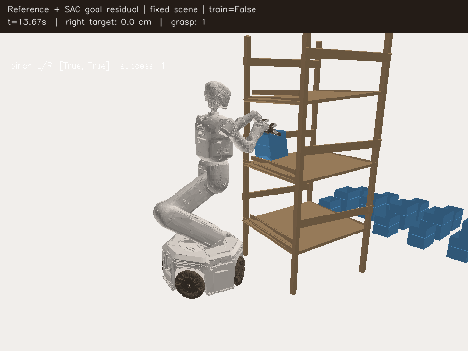
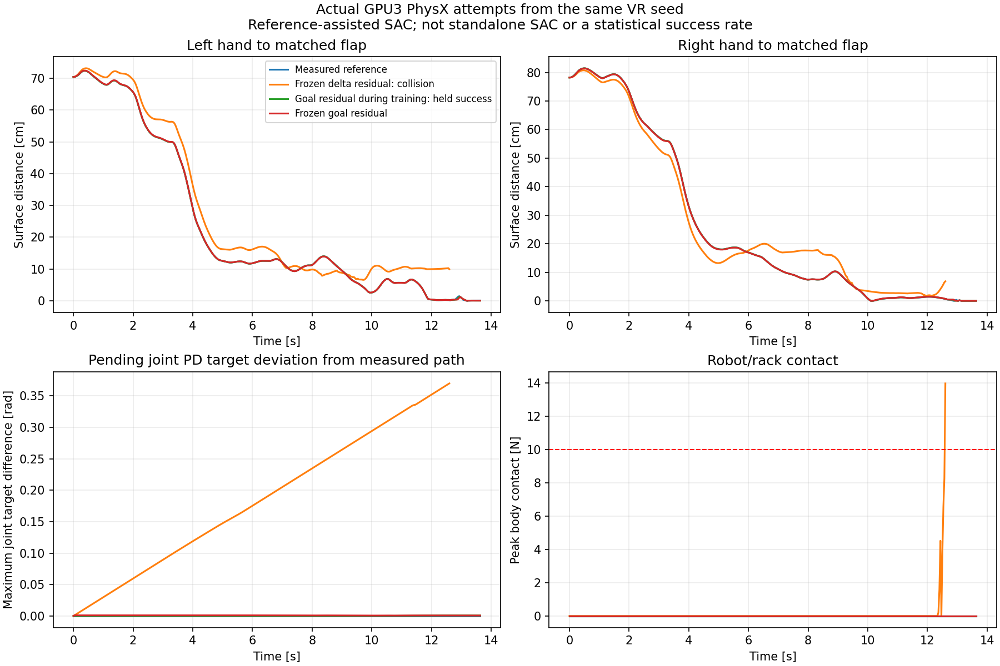

# V2 grasp: measured success, closed-loop imitation failures, residual SAC pilot

October2 follow-up: the three additional training/frozen-evaluation pairs all
finished successfully at actor update3,470, with Drive verification complete.
They still repeat the fixed scene. Varied-layout work and independent held-out
evaluation are recorded in [the generalization report](RL_V2_LAYOUT_GENERALIZATION_20261002.md).

Status at 2026-10-01 20:17 KST: **standalone learned SAC held grasp remains zero**.
The goal-reference residual controller now has actual held success during two
training episodes and a separate frozen-checkpoint replay of the first episode.
These are the same lower-box scene, not three independent random-reset tests.
The first actor reached694 updates; continuation reached1,388. All completed
goal-pilot writers stopped before final Drive checksum verification.
The completed 128-environment run finished 80 iterations, 318,947 valid
transitions and 7,907 actor updates with no numerical failures. Its final
checkpoints and closed logs were Drive checksum-verified. More optimization
alone has not demonstrated a solution.

## What the physical comparisons established

All rows below are individual GPU3 PhysX attempts from the same lower-box
inferred VR scene. They are not statistical success rates or upper-shelf tests.
The CPU mesh videos render measured GPU body poses; physics remains on GPU.

| Controller | Control ticks | Held grasp | Termination |
| --- | ---: | ---: | --- |
| VR reference with live contact-confirmed IK | 410 | 1 | success |
| Replay of its measured physical commands | 410 | 1 | success; initial 464-D observation error zero |
| Baseline BC actor, zero SAC actor updates | 420 | 0 | left gripper/rack 61.75 N |
| Body action bounds containing every successful source command | 208 | 0 | box drop |
| Extra exact action refit, label MSE 0.000089 | 203 | 0 | right gripper/rack 11,479.66 N |
| Pending-PD-error label augmentation | 119 | 0 | left arm/rack 656.42 N |
| Actor excluding previous action | 900 | 0 | timeout; hands retreat |
| Same actor plus head-state augmentation | 294 | 0 | left arm/rack 173.84 N |
| 95% VR teacher + 5% actor, teacher gripper commands | 411 | 1 | success; **assisted controller** |
| Pure actor distilled from actual path + correction labels | 256 | 0 | robot/rack collision |
| Joint-PD-goal-coordinate BC actor | 281 | 0 | robot/rack collision |
| Online delta-residual SAC, 694 actor updates during rollout | 410 | 1 | success; reference-assisted |
| Frozen delta-residual SAC checkpoint694 | 379 | 0 | left arm/rack 13.97 N |
| Online goal-residual SAC,694 actor updates | 410 | 1 | success; rack0 N |
| Frozen goal-residual SAC checkpoint694 | 410 | 1 | success; rack0 N, both hands pinching |
| Goal-residual continuation,1,388 actor updates | 410 | 1 | success; rack0 N |

The reference succeeds, and its executed commands reproduce success exactly.
Tiny supervised action error does not establish a stable closed-loop policy.
Removing previous-action inputs, adding head noise, and analytically decoding
PD goals were tested separately and did not solve grasp. These options are
experimental; ordinary SAC defaults and the environment/reward are unchanged.

The actor's frozen-state Jacobian with respect to its own previous commands
had spectral radii above one at several source states. This identifies a
possible feedback shortcut, **not a proof of whole-robot instability or the
sole failure cause**. The no-history actor also failed physically.

[](assets/rl_v2_assisted_actor_success_20261001.mp4)

[Assisted success video](assets/rl_v2_assisted_actor_success_20261001.mp4) ·
[Measured outcome](assets/rl_v2_assisted_actor_success_20261001.json).

[](assets/rl_v2_joint_goal_failure_20261001.mp4)

[Failed actor video](assets/rl_v2_joint_goal_failure_20261001.mp4) ·
[Measured collision and terminal causes](assets/rl_v2_joint_goal_failure_20261001.json).

## Executed experience versus proposed correction labels

Two actual successful paths contain **821 current-reward physical transitions**:
410 VR/live-IK rows and 411 assisted-controller rows. They include native
464-D actor/530-D critic observations, 24 executed physical commands and the
pre-reset terminal observation. Their independent episode boundaries are kept.

The assisted rollout separately exports 411 teacher corrections at the states
actually visited. Those commands were proposals, not the mixed commands that
were executed. Their archive has `actor_labels_only: true` and no model, Q,
reward or next state. It is eligible only for actor supervision.

```bash
# Use the project Isaac conda Python; this packer itself uses no Isaac/GPU.
PYTHONPATH="$PWD/src" python -m \
  kuavo_isaaclab_scene.rl.multi_box.experiments.executed_replay \
  --dataset /absolute/path/to/current-success-1.hdf5 \
  --dataset /absolute/path/to/current-success-2.hdf5 \
  --training-manifest /absolute/path/to/current-run/manifest.json \
  --output-dir /absolute/path/to/new-experience-directory
```

Native GPU provenance, current physical/reward contracts, full initial state,
30 Hz timing, transition continuity, finite values and terminal bilateral held
success are checked independently per input. Failed/partial paths and legacy
VR rewards are rejected. This archive contains data only; use
`--experience-checkpoint`, not full-policy `--checkpoint`.

`--actor-feature-mode grasp_target_no_history` removes the last 24 previous
actions from the actor encoder (174 encoded features), while keeping measured
joint motion and pending controller targets. Raw environment observations and
the critic remain unchanged. The existing `grasp_target` default keeps 198
encoded features. Inference-only refit artifacts cannot resume training.

## Bounded residual SAC pilot

The pilot addresses sequence exploration by retaining a measured successful
410-command reference and learning small corrections with SAC. This is an
explicit alternative controller, **not standalone 24-action SAC**:

- Physical environment, rewards, collision thresholds and termination stay the
  same; the scene is the fixed lower-box inferred VR seed, without curriculum.
- The SAC actor and critic receive the next reference command and normalized
  reference index as context. Their dimensions are 199 and 555 respectively.
- SAC controls 22 continuous residual coordinates. The two grippers follow the
  measured reference. Physical commands are `clip(reference + 0.05 * residual)`;
  zero residual restores the exact measured commands. After the reference ends,
  continuous reference commands are zero, holding accumulated PD targets.
- Q learns in the **issued residual coordinates**, not physical delta coordinates.
  Entropy is measured in that residual action space. Physical HDF5 records still
  contain the actual 24 commands. These two datasets must not be confused.
- The 410 measured successful transitions can seed this contextual MDP exactly
  as zero-residual transitions. Current executed rewards are retained. No
  hypothetical teacher proposal enters Q.
- A fresh twin critic gets 500 initial updates; the actor starts at zero mean.
  Online updates begin after 64 actual steps, with two SAC updates per step.
  Initial zero-residual actor supervision fades to zero over 512 updates.
- Checkpoints explicitly record the reference file SHA256, residual scale,
  dimensions and gripper dependency. Ordinary SAC rejects these checkpoints.
  Deployment still needs the same reference; this does not establish
  generalization to random resets or upper boxes.

First attempt `reference_residual_train_gpu3_20261001_1908` stopped at the first
online update because replay's outer `no_grad` disabled backpropagation.
The update function now explicitly enables gradients; a regression test runs
an actual optimizer update inside `no_grad`. Retry
`reference_residual_train_gpu3_20261001_1911` achieved one held success at410
steps, after694 actor and1,194 total critic updates. Its separate frozen-actor
evaluation failed at379 ticks with13.97 N left-arm/rack contact, no pinch.
Changing the actor during rollout versus applying its final weights from the
start changes the physical trajectory. This success does **not** establish a
stable learned policy or improvement over the already-successful reference.

### Goal-offset correction instead of accumulated deltas

The new opt-in `--residual-controller goal` anchors each continuous integrator
to the measured reference's controller state. Before issuing physical commands,
it subtracts the current offset in pending joint targets, torso X/Z targets,
and base pose relative to the observed rack. Residuals become bounded offsets
around the reference position goals. For example, residual1 moves an arm PD
goal by0.001 rad at scale0.05; it does not add0.001 rad on every subsequent tick.
Base pose error is obtained from deployable rack-relative poses, not hidden
world coordinates. Grippers still follow the reference.

All410 source physical commands were checked for exact identity at zero
residual. Runtime rejects changed joint/base/torso rates. The controller contract
is distinct from delta-residual v1, and cross-mode checkpoints are rejected.
Elapsed reference index remains observable after the measured path ends.
The first supervised comparison1932 rejected a generic base-rate assumption
before issuing any replay action: V2 uses0.15/0.15 m/s and0.5 rad/s, not the
generic0.25/0.25/0.7 defaults. Its failure logs were finalized and Drive-verified.
The1935 retry then exposed Isaac's scalar representation for a uniform head
scale; validation now supports scalar and per-joint tensor forms, with a
regression test. Its failure logs were also finalized and Drive-verified.
The corrected supervised GPU3 comparison
`reference_goal_sac_gpu3_20261001_1939` achieved held success after410 steps and
694 online actor updates. Its frozen actor replay
`reference_goal_eval_gpu3_20261001_1946` also succeeded at410 steps without any
updates, rack contact or safety termination. Final per-hand flap surface
distances were0.000675 m and0 m, with both measured pinch flags true.
Continuation `reference_goal_sac_continue_gpu3_20261001_1955` reached1,388 actor
updates and another training-time held success. These three runs ended normally
and their checkpoints/closed logs/videos/HDF5 were Drive checksum-verified.

[](assets/rl_v2_goal_residual_frozen_success_20261001.mp4)

[Frozen-policy success video](assets/rl_v2_goal_residual_frozen_success_20261001.mp4) ·
[Audited actor/outcome metadata](assets/rl_v2_goal_residual_frozen_success_20261001.json).



The maximum difference in17 controlled joint PD targets from the same measured
reference grew to0.369784 rad in frozen delta-residual replay (left-arm maximum;
right arm0.364660 rad). It was0.000999 rad in frozen goal-residual replay and
0.000817 rad during goal-residual training. This comparison supports accumulated
controller-goal drift as a failure mechanism; it does not establish that every
earlier SAC failure has this single cause. The successful reference already
succeeds, so these runs do not prove SAC improves reference performance.
[Comparison values](assets/rl_v2_reference_residual_integrators_20261001.json).

```bash
CUDA_VISIBLE_DEVICES=3 PYTHONPATH="$PWD/src:$PWD/scripts/rl" python \
  scripts/rl/replay_v2_grasp_reference.py \
  --demo-dataset examples/demos/v2_grasp_quest_success.hdf5 --episode-index 0 \
  --training-manifest /absolute/path/to/current-run/manifest.json \
  --executed-actions /absolute/path/to/measured-success/executed_transitions.hdf5 \
  --residual-sac --residual-scale 0.05 \
  --output-dir /absolute/path/to/new-residual-run \
  --steps 900 --capture-every 60 --device cuda:0 --headless

# Separate deterministic evaluation; do not update the actor during evaluation.
# Add --residual-checkpoint /absolute/path/to/learned/checkpoint.pt
# and --no-residual-training, using a new --output-dir.
```

For new pilots, `scripts/rl/reference_residual_with_drive.py` reuses the shared
CPU supervisor and existing authenticated rclone wrapper. It sets
`CUDA_VISIBLE_DEVICES`, creates a unique child run, checks backups every300s,
preserves the newest two plus newest two verified checkpoints, and finalizes
logs, videos, HDF5 and actual residual experience after the child exits. There
is no training-side checkpoint deletion or other-process eviction. The early
1911/1917 direct comparisons are finalized separately after their writers stop;
they did not have a running periodic uploader. This gap is fixed in the new
1939 supervised entrypoint. Checkpoints are saved every512 actor updates and
at the final step. Actual online residual transitions are retained for the next
residual run separately from ordinary24-action experience and teacher labels.

```bash
python3 scripts/rl/reference_residual_with_drive.py \
  --experiment-dir /absolute/path/to/new-supervised-experiment --gpu 3 \
  --demo-dataset examples/demos/v2_grasp_quest_success.hdf5 --episode-index 0 \
  --training-manifest /absolute/path/to/current-run/manifest.json \
  --executed-actions /absolute/path/to/measured-success/executed_transitions.hdf5 \
  --residual-sac --residual-controller goal --residual-scale 0.05 \
  --steps 900 --capture-every 30
```

To continue a bounded series, add `--episodes 3` and an existing compatible
`--residual-checkpoint`. Each episode gets its own training and frozen-policy
evaluation run. The next episode starts only after both complete a held grasp
without unsafe/invalid/timeout outcomes and their final uploads are verified.
A zero process exit with a failed grasp stops the series as
`performance_gate_failed`; errors stop it as`failed`. Parent `status.json`
records the active trial and number of verified episode pairs. Checkpoints and
actual residual experience continue between training episodes; evaluator
transitions are not used as hypothetical actor labels.
The active GPU3 series is`reference_goal_series_gpu3_20261001_2017`, starting
fromcheckpoint1,388. It keeps the same scene and reference, with no curriculum.

Set `RL_DRIVE_REMOTE_ROOT` privately, or the wrapper discovers an unambiguous
existing remote with `gdrive.sh listremotes`; it never starts authentication.
Do not run an additional uploader against the same run. The manager records
current process/run state and final verification in the experiment's
`status.json`. Final upload verification is separate from grasp performance.
See [Drive lifecycle and limitations](RL_GOOGLE_DRIVE.md).

Completed comparison bundle `closed_loop_comparison_20261001_1816` contains
51 checksum-verified files. Other new completed attempts and the 821-row
experience archive are backed up separately under their unique run names.
No other users' processes, files, credentials or Drive sharing are changed.

Focused tests cover command identity/bounds, real updates inside `no_grad`,
actor-feature gradients, independent episode boundaries, measured versus
hypothetical labels, checkpoint segregation and diagnostic PD decoding.
Series lifecycle tests additionally ensure a checksum-verified failed frozen
actor cannot proceed to the next training episode.

Related primary methods: [Residual Reinforcement Learning for Robot Control](https://arxiv.org/abs/1812.03201)
studies combining a conventional controller with an RL correction;
[SAC Algorithms and Applications](https://arxiv.org/abs/1812.05905) describes
the off-policy stochastic actor/twin-Q/temperature approach. This pilot uses
the repository's asymmetric SAC implementation and its low-entropy configuration,
not a reproduction of either paper's complete experimental setup.

[Continuing recovery evidence](RL_V2_RECOVERY_20260930.md) ·
[Notion with native videos and images](https://app.notion.com/p/3eb63918d42a81f694a9e060aeffe7cc)
