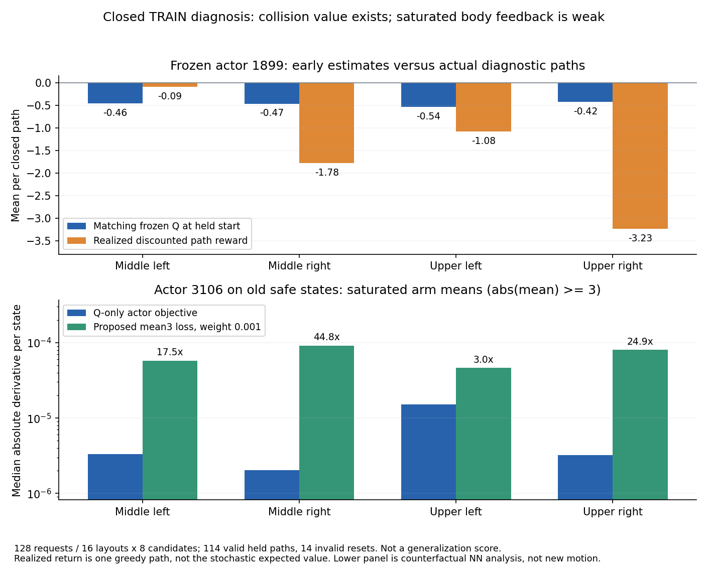

# 종료된 TRAIN 진단의 Q와 팔 출력 경사

추가 학습 후 랙 충돌이 늘어나는 원인을 조사했다. 충돌 감점 자체가
빠진 것은 아니라는 근거와, 포화된 팔 출력을 바꾸는 신호가 약해지는
근거를 얻었다. 이미 시작한 출력 포화 완화 SAC 비교의 진단이며
새로운 파지 성공이나 보조 손실의 효과를 입증한 결과는 아니다.

## 실제 종료 경로와 Q

Actor1899/Q9644를 동결한 TRAIN 진입 위치 진단만 읽었다.
네 구역의 새 시작 조건16개에 진입 위치·방향8후보씩 적용한128요청이다.
초기화 실패14건은 원래128개 분모에 남으며, 실제 held 기록114개를
Q 분석에 사용했다. 기존 진단 성공11건·안전 위반65건·시간 초과38건이며
이 숫자는 새 정책의 성공률이 아니다.

Actor·Q·normalizer 모델 tensor를 일치하는 checkpoint에서 복원했다.
매 동작의 목표를 당시 정책으로 복원하고 실제 실행 명령과 오차2e−4
이내인지 전체114경로에서 검사한 다음 같은 관측·목표의 Q를 계산했다.
다른 정책의 Q를 해당 실제 움직임의 Q처럼 표시하지 않았다.

| 구역 | 유효 held 경로 | 파지 시작 Q 평균 | 실제 이후 할인 보상 평균 |
| --- | ---: | ---: | ---: |
| 중간 왼쪽 | 30 | −0.458 | −0.093 |
| 중간 오른쪽 | 23 | −0.466 | −1.779 |
| 상단 왼쪽 | 31 | −0.540 | −1.081 |
| 상단 오른쪽 | 30 | −0.424 | −3.235 |

상단 오른쪽30경로는27건 랙 충돌·3건 시간 초과였다. 마지막 Q 평균은
**−5.422**, 실제 마지막 보상 평균은**−5.413**이었다. 충돌 직전까지의
16동작 Q 평균도−5.166으로 내려갔다. 따라서 당시 critic이 위험 감점을
전혀 배우지 않았거나 충돌 보상이 누락됐다고 설명하기 어렵다.
앞 구간에서는 Q와 실제 이후 결과가 달랐다. 긴 진입 동작을 개선할
충분한 신호가 있는지는 다음 실제 경로와 전체 개발 평가로 확인해야 한다.

Q는 stochastic 정책의 예상 보상이고 실제 할인 보상은 하나의 greedy
경로 결과다. 두 값의 차이만으로 Q가 틀렸다고 판정하지 않는다.
여기서는 물리 backend가 같지만 진입 후보가 달라 훈련 분포 밖일 수 있다.
16시작 조건의 반복 후보와 연속 관측은 독립 실험이 아니며, critic 보정
성능이나 일반화 평가의 benchmark로 쓰지 않는다.

## 같은 과거 관측에서 후속 정책의 출력 경사

Actor3106/Q14472는 변경 없는 보호된 checkpoint를 사용했다.
각 종료 경로에서 안전한 관측을 균등 간격으로 최대8개 선택한912관측에
새 정책을 입력했다. 이는 새로운 물리 경로가 아닌 신경망 진단이다.
Q가 네 그리퍼 조합을 평가하는 정확한 확률 합과 구역별 Q normalization을
사용해 body 평균에 대한 경사를 계산했다. body noise는0으로 고정했다.
실제 SAC의 stochastic 업데이트, entropy·성공 TRAIN 유지 손실·jaw 보조
손실 및 공유 network parameter의 경사 간섭을 모두 재현한 분석은 아니다.

상단 오른쪽 표본의 가용 팔 좌표3,360개 중**959개**가
`abs(pre_tanh_mean)>=3`이었다. 이 좌표의 tanh 도함수 중앙값은0.002147,
Q 목적함수 경사 절댓값 중앙값은**3.24e−6**이었다.
3좌표에서는 float32 tanh 도함수가 정확히0이었다.
나머지 가용 팔 좌표의 Q 경사 중앙값은9.80e−5였다.

같은 관측에 **가상으로** `mean3-soft`, weight0.001을 계산하면 포화된
팔 좌표의 직접 경사 중앙값은**8.05e−5**로 Q-only 경사의 약24.9배였다.
범위 안의 좌표에는 추가 경사가0이었다. 이 손실을 기존 actor3106에
적용하거나 optimizer를 업데이트하지 않았다. 기존 출력의 gradient 문제를
진단했으며, 새 비교가 학습 후 실제 성공을 높이는지는 아직 알 수 없다.

## 진행 중인 비교와 다음 판단

GPU3에서 기존 세 SAC를 유지하며 정밀 접근 보상·20% 팔 에피소드 탐색에
`mean3-soft`만 추가한 비교를 시작했다. 훈련 에피소드 탐색은 관절 목표의
허용 범위를 바꾸지 않는다. 보조 손실도 hard clipping이 아니며 목표 범위,
보상·무작위화·양손 성공·충돌 기준은 유지한다.
[실제 시작과 옵션 검증](RL_V2_BODY_SATURATION_RECOVERY_20261006.md)을 참고한다.

추가 탐색만 있는 실행은 실제 Q 초기2,048회 학습을 지나 actor 업데이트를
시작했고, 새 훈련256에피소드 중49개에 추가 탐색이 적용됐다.
이 작동 확인을 학습 성능 개선으로 세지 않는다.
출력 경사와 실제 목표의 변화를 함께 보되, 최종 판단은 새 TRAIN384사례
학습 뒤 원래 전체 DEV128요청의 양손 파지·랙 충돌·구역별 결과로 한다.
상단 오른쪽 파지가 없거나 중간 선반이 퇴보하면 해결됐다고 판단하지 않는다.

종료된 HDF·checkpoint는 보존했고 optimizer·replay·reward는 변경하지 않았다.
Isaac runtime·GPU·진행 중 HDF/replay·DEV/독립 FINAL을 사용하지 않았다.
[전체 원자료와 진단 조건](assets/rl_v2_closed_TRAIN_Q_mean_gradient_20261006.json).
