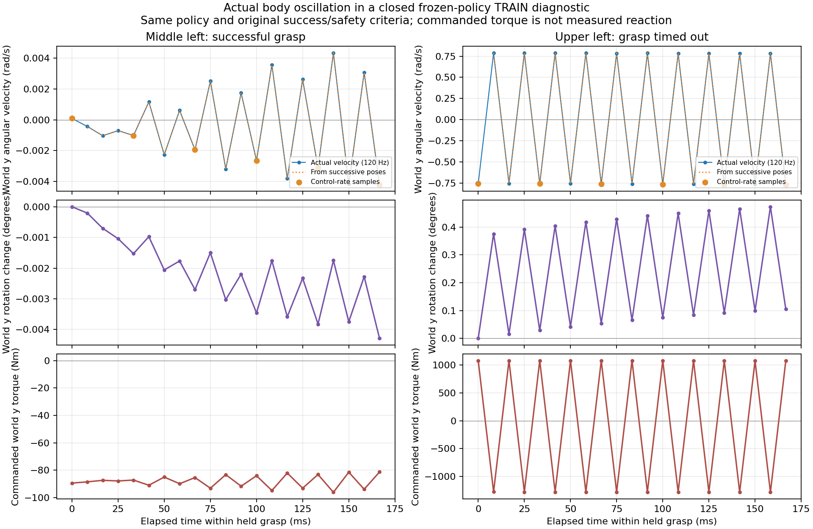

# 가까운 손이 실제 양손 파지로 이어지지 않는 원인 진단

08:01 KST의 전체 개발 평가 성공 흐름은35→19→23→30/128이다. 직전보다
7건 늘고 상단 성공은1→10건으로 회복했지만 학습 전35건보다 낮다.
[최신 전체 평가와 동일 모델](assets/rl_v2_regional_actor_third_learned_full_DEV30_20261008.json).
아래 접촉 진단은 이 live 학습 데이터가 아니라 **정상 종료한
고정 정책의 크기별 TRAIN 접근 진단**을 읽은 결과다. 평가 경험이나 합성
성공을 학습에 넣지 않는다.

## 랙 충돌은 파지 단계에서 발생했다

수정 후 동일 TRAIN16조건×접근 후보8개의128요청 중 초기 무효10개를 제외한
닫힌 HDF118개를 읽었다. 모델·normalizer198개와 actor·Q·replay0 고정을
확인했고, 각 HDF의 reset 전 마지막 pinching·stable·success·unsafe가 실제
terminal 기록과 모두 일치했다. 원본 HDF의 inode·크기·mtime도 변하지 않았다.

안전 위반77개는 모두 robot–rack 충돌이었고 접근을 끝낸 held-grasp 단계였다.
종료 시 최대 힘을 기록한 링크는 오른쪽 그리퍼 몸체45개, 왼팔 link4 9개,
왼쪽 그리퍼 몸체4개, 오른팔 link7 13개, 오른팔 link4 6개다. **이 링크는 실패
시점의 최대 힘이며 최초 접촉이나 충돌을 일으킨 첫 관절을 뜻하지 않는다.**
특히 상단 오른쪽의26개 충돌 중24개는 오른쪽 그리퍼 몸체였다. 팔과 그리퍼의
진입 위치를 함께 확인해야 하며 안전 threshold를 완화해 해결하지 않는다.

## 근접·닫힘·포획 점수와 실제 접촉은 다르다

상단 왼쪽의 원래 접근 후보 env16은 손–flap 표면 거리 약5.93mm/0mm,
접근 잠재값0.980·정렬0.966·포획0.894였다. 마지막 동작은 양손 닫힘이었고
실제 그리퍼 닫힘 비율도1.000/0.999였다. 그러나 배정된 flap의 pad 힘은 다음과
같았다.

| 손 | pad 1 | pad 2 | 마지막 실제 파지 |
| --- | ---: | ---: | --- |
| 왼손 | 0N | 1.63N | 성립하지 않음 |
| 오른손 | 34.10N | 35.81N | 성립 |

양손 opposing flap 파지는 중간에3개 관측에서만 성립했고 연속 최대는
0.033초였다. 요구한0.25초 유지와8mm clearance는 충족하지 못했고 시간
초과였다. **가까워진 점수나 닫힘 명령은 성공이 아니다.** 현재 보상은 이미
약한 pad·약한 손의 실제 접촉 진행과 파지 이벤트를 반영하며, 닫힘 명령
자체에는 보상이 없다. 이 사례만으로 해당 보상 계산이 틀렸다고 단정하지
않는다. 손가락 위치·지속 접촉·진입 안전성과 Q의 행동 선택을 함께 진단한다.

전체 유효118회 중109회는 opposing 양손 파지가 한 번도 성립하지 않았다.
그중 medium 유효24회는 모두 한 번도 성립하지 않았다. 9회에서 잠깐이라도
성립한 것과 실제 성공4회를 구분한다. 원래 요청128개 분모의 실패를 삭제하지
않았으며 포획 잠재값 하나를 성공으로 재라벨링하지 않았다.

## 상단 동작의 base 안정성은 추가 원인 후보

관측에 기록된 held 단계의 base 각속도 norm 중앙값은 중간 구역 각 그룹에서
약0.006rad/s, 상단 왼쪽0.733·오른쪽0.679rad/s였다. 같은 관측의 랙 상대
orientation으로 계산한 handoff 대비 최대 기울기의 그룹 중앙값은 상단
왼쪽3.70°·오른쪽3.57°였다. 이는 **30Hz로 표본화한 상태의 요약**이다.

일정 방향으로 큰 각속도가 기록되더라도 표본 자세는 수 도 이내이므로,
물리 substep의 진동·표본화 효과인지 제어기 문제인지 확인하기 전에는
중력보상 실패나 torso 붕괴라고 확정하지 않는다. 각속도를 단순 적분해
보이지 않은 움직임을 추정하지 않는다. 실제 하위 스텝의 자세·속도·wrench와
그리퍼 상대 오차를 함께 측정하는 것이 다음 진단이다. 이번 작업에서는
센서·물리·제어기·정책·보상을 변경하지 않았다.

## 매 물리 스텝의 원래 제어를 관찰하기

`--base-substep-trace-env-indices`는 원래 floating-base drive가 계산한 명령을
그대로 실행한 뒤, 다음 물리 스텝 전에 root 자세·세계 속도·실제 PhysX view의
자세/속도·명령 force/torque·target·관성 추정값을 기록한다. Quaternion은wxyz이고
세계 힘/torque와 body 힘/torque를 각각 표시한다. **명령 torque는 측정된 반력이나
PhysX가 실제 달성한 torque가 아니다.** 캐시와 raw view의 차이, 물리 스텝 간
자세 변화와 속도, 제어 입력의 부호를 확인하기 위한 read-only 도구다.

실행은 완전한 고정 TRAIN 접근 진단128요청에서 선택한 최대8개 환경만 허용한다.
학습 모드·축소된 환경·일반 DEV/FINAL 경로에서는 거부한다. 원래 양손 파지·
유지·clearance·안전 기준과 무작위 배치는 그대로 유지한다. 실제 제어기의
`apply`를 같은 입력으로 정확히 한 번 호출하고 반환값을 보존하며, 종료 시 원래
메서드를 복구한다. 로봇 상태를 쓰거나 접촉 센서를 추가하지 않는다. 유효하지
않은 상태는 로그에 표시하고 물리 상태를 유효한 값으로 교체하지 않는다.

원래 frozen TRAIN 실행 명령에 다음 옵션을 추가한다. 대표 영상 선택은 선택형이다.

```bash
--base-substep-trace-env-indices 0 16 24 32 40 64 \
--eval-video-env-indices 0 16 24 32 40 64
```

실행 폴더의`base_substep_trace.log`는 JSONL이다. 원래 접근 후 제어 스텝의
각 physics apply 호출을 기록하며 원래 배치가 무효이거나 종료한 환경의 기록은
추가하지 않는다. 마지막`closed`행을 확인한 뒤 분석한다. 기존 최소 백업은
writer 종료 후 이 로그도 업로드·체크섬 검증 대상으로 포함한다. 영상과 raw
HDF/replay는 이 checkpoint/log 백업 옵션으로 전송하지 않으므로 별도로 보존한다.

관련36개 검사에서 명령·반환값·로봇 상태 보존, raw/cached 상태 구분,
world/body torque 표현, inactive 환경 제외, 비유한 값의 원본 보존, 일반 학습·
축소 scope 거부와 종료 로그 백업을 확인했다. **이는 도구 검사이며 base 진동의
원인이나 파지 성공 개선을 증명하지 않는다.** 실제 고정 정책의 원래128요청을
다시 실행해 물리 스텝별 측정과 전체 종료 결과를 함께 확인한다.

### 실제 실행과 종료 후 분석

10/08 06:51 KST에 source`826a0acb8f33b220a555be7163c5eacb03343d4d`로
GPU0의 고유 실행`CPU_regional_mixed_size_same_TRAIN_base_substeps_gpu0_20261008_065143`
을 시작했다. Writer2896233의 소유자·실행 경로·CUDA0을 확인했다. 원래
checkpoint와 같은 TRAIN16조건×후보8개를 사용하고 env0·16·24·32·40·64의
하위 스텝과 대표 영상을 기록한다. 07:18 KST에는 실제 control step571까지
진행했고 actor·Q·replay 갱신은0이었다. **아직 writer가 실행 중이므로 닫힌 HDF
분석·198 tensor 고정 검사·새 전체 종료 결과와 제어 원인 판정은 미완료다.**
이 반복 측정은 겹치지 않는 새 시작 조건의 재확인이나 SAC 학습 개선이 아니다.

정상 종료한 뒤 다음 도구가 원래 trace의 footer·각 제어 스텝의4개 물리 기록·
reset 없는 시간 연속성과 실제 actor 관측의 각속도를 검사한다. Quaternion의
부호가 바뀌어도 동일한 자세로 처리하고, 연속 자세로 구한 세계 각속도를
구간 시작·끝의 기록된 속도 모두와 비교한다. 적분 방식의 시간 정렬 차이를
제어 오류로 오해하지 않기 위해서다. Held 구간이 없는 사례는 추론 불가로
남긴다. 명령 torque를 접촉 반력으로 해석하거나 물리 상태를 수정하지 않는다.

```bash
CUDA_VISIBLE_DEVICES='' PYTHONPATH=src:scripts/rl python scripts/rl/summarize_closed_base_substeps.py \
  --experiment-dir /absolute/path/owned_normally_closed_frozen_TRAIN_probe \
  --output-json /absolute/path/new_closed_base_report.json
```

세계 좌표 각속도·quaternion 부호·회전한 시작 자세·낮은 주파수의 표본화
효과·비유한 입력 거부 검사7개가 통과했다. **이 역시 분석 도구의 검사이며
실제 실행에서 base 문제를 확인했거나 해결했다는 뜻이 아니다.**

## 실제 하위 스텝에서 확인한 빠른 몸체 진동

07:25 KST 확인에서 측정은 정상 종료했다. 전체128요청은 성공4·안전 위반77·
시간 초과37·초기 무효10이며 원래 고정 정책 진단과 같았다.198개 모델 tensor와
actor·Q·replay0 고정을 확인했고, 선택한 유효5사례의 매 스텝 각속도는 실제
actor 관측과 정확히 같았다. Raw PhysX와 cached pose/velocity도 같았고 원본
trace·HDF는 변경되지 않았다. 선택한env40은 원래 초기 무효라 동작 영상이나
물리 운동의 근거로 사용하지 않는다.

상단 왼쪽env16은 held 단계 실제 각속도 norm 중앙값0.735rad/s,
오른쪽env24는0.602rad/s였다. 세계y 각속도가 양 끝에서 모두0.1rad/s보다 큰
인접 스텝 각각2,845·1,235개는 **매번 부호가 반전됐다**. 물리 스텝120Hz에서
교대로 방향을 바꾸는 약60Hz 진동이며 한 방향으로 계속 넘어지는 운동이
아니다. 연속 quaternion으로 구한 각속도는 구간 끝의 실제 속도와RMS
0.000086·0.000074rad/s 차이로 일치했다. 관측 캐시 오류로 설명되지 않는다.
중간 선반의 성공env64는 중앙값0.00503rad/s이고 해당 고속 구간이 없었다.



상단 두 사례의 세계y 명령 torque 최대 절대값은약1,358·1,254Nm였다.
명령 torque는 달성된 torque나 접촉 반력이 아니다. 제어기는 전체 몸체 위치로
추정한 관성에 기울기 PD 가속도를 곱한다. 이 추정과 실제 articulated root의
반응 차이로 피드백이 너무 공격적일 가능성을 점검한다. **이번 결과가 모든
파지 실패의 원인을 증명하거나 중력보상 자체의 누락을 뜻하지는 않는다.**

[원래 전체 결과·198 tensor 고정·실제 actor 일치·진동 수치·영상 checksum](assets/rl_v2_closed_base_substeps_20261008.json).
[상단 왼쪽 시간 초과 영상](assets/rl_v2_base_trace_upper_left_timeout_20261008.mp4).
[중간 왼쪽 실제 성공 영상](assets/rl_v2_base_trace_middle_left_success_20261008.mp4).
이 영상은 고정 정책의 TRAIN 원인 진단이며 새 SAC 학습 개선 영상이 아니다.

### 기울기 제어만 낮추는 고정 정책 비교

선택형`--base-attitude-gain-probe soft15_2`를 추가했다. 완전한 고정 TRAIN128
진단에서만 stiffness120→15·damping22→2로 바꾸고 가속도 cap10은 유지한다.
같은 동적 unfixed root에 원래 wrench 제어를 사용하며 root/joint를 teleport
하지 않는다. 높이·평면 이동·yaw·중력보상, 물리 timestep·solver·geometry·질량,
무작위 배치·움직이는 flap·정책·보상·성공·안전 기준은 유지한다. 실제 실행된
drive의 값을 확인한 뒤 별도 manifest에 기록한다. 일반 학습·DEV/FINAL이나
축소된 진단에서 옵션을 사용할 수 없다.

이 비교의 정책 tensor는 고정하지만 제어 계수는 바뀐다. 따라서 원래 Q/waypoint
준비 도구는 결과를 거부하며, 명시적으로 닫힌 root 분석에서만 읽는다. 효과를
확인한 뒤에도 다른 제어 조건의 Q/replay를 그대로 이어 학습하지 않는다.
관련65개 검사항목에서 범위·기본 동작 보존·실제 runtime gain 확인·기존 계약으로
데이터가 들어가지 않는 경계를 확인했다. **도구 검사나 비교 준비는 실제 진동
감소·파지 성공 개선을 의미하지 않는다.** 전체 물리 측정과 새 시작점 재확인이
필요하며 독립FINAL은 보존한다.

07:39 KST에 source`402aa2b1959ea01cc6fdc91d53326c5b3eae3425`로
`CPU_regional_mixed_size_same_TRAIN_soft15_2_base_substeps_gpu0_20261008_073952`
를 실제 시작했다. Writer3377345의 소유자·고유 실행 경로·CUDA0을 확인했다.
07:43 KST에는 초기화를 마쳤고 실제 drive의 stiffness15·damping2·cap10,
동적 unfixed root와 원래128요청·여섯 구역/크기를 확인했다. 같은 원래 checkpoint·
TRAIN16조건·후보8개를 사용하고 대표 하위 스텝·영상도 기록한다. **아직 전체
종료 결과·198 tensor 고정·진동 감소나 파지 개선은 미확인이다.**
[실제 runtime 제어 계수·원래 범위·writer 확인](assets/rl_v2_soft15_2_actual_runtime_gain_20261008.json).

Notion 중간 보고에도 실제 진동 그래프와 대표 성공·실패 영상을 추가했다.
영상은H.264·yuv420p의 전체 디코딩과 원본 checksum을 확인한 뒤`video/mp4`
형식으로 원본 첨부했다. 실제 native video block2개를 확인했고 기존47개
자료의 상대 순서·내용과 native table5개를 보존했다. 총 native 자료는50개다.
이 영상은 원인 진단이며 새 학습 성능이나 전체 목표 성공으로 표시하지 않았다.

## 도구와 근거

`summarize_closed_contact_attempts.py`는 우리 소유의 정상 종료한 고정 정책
TRAIN 접근 진단만 읽는다. Live HDF/replay나 다른 사용자의 파일은 읽지 않으며
명령 형식464D actor·66D privileged·24D 실행 command와 모든 실제 terminal을
검사한다. 출력에는 각 시도의 pad 힘·접촉 영역·파지 지속·rack 최대 힘 링크·
표본 base 운동을 남긴다. 힘은 기존 critic feature의200N 상한을 명시한다.

```bash
CUDA_VISIBLE_DEVICES='' PYTHONPATH=src:scripts/rl python scripts/rl/summarize_closed_contact_attempts.py \
  --experiment-dir /absolute/path/owned_normally_closed_frozen_TRAIN_probe \
  --output-json /absolute/path/new_contact_report.json
```

[원래118개 실제 접촉·terminal 일치·샘플 상태](assets/rl_v2_corrected_closed_contact_attempts_20261008.json).
[새 시작 조건의 크기별 재확인](RL_V2_SUPPORTED_SIZE_WORKPLACE_20261008.md).
[같은 전체 DEV의 실제 학습 추이](RL_V2_REGIONAL_INITIAL_DEV35_20261008.md).

박스·base·배경·움직이는 flap의 무작위화, rack10N·장애물5N·self-off와 원래
양손 접촉·유지·lift 기준을 유지했다. 모든 여섯 구역·크기의 안정적인 성공과
손대지 않은 독립FINAL은 미확인이며 목표는 완료되지 않았다.
