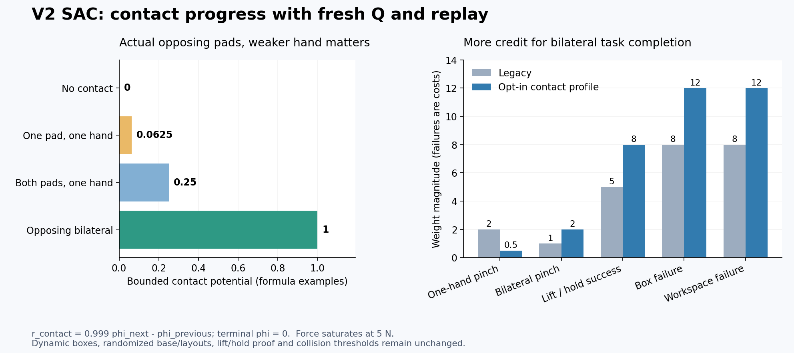

# V2 grasp: 실제 접촉 진행을 보강하는 SAC

2026-10-05, frozen 파지 구간 진단을 바탕으로 선택적 보상 프로필
`opposing_pad_contact_progress_v1`을 추가했다. 기본 v2 보상은 그대로다.
변경된 보상으로 기존 Q/replay를 재개하지 않고, 기존 actor의 실제 동작만
보존한 새 SAC를 GPU0에서 시작했다. 기존 GPU3 실행은 유지한다.



그림 왼쪽은 수식의 예시이며 측정 성공률이 아니다. 오른쪽은 설정한 가중치다.
[입력·초기 동작 대조·실행 증거](assets/rl_v2_contact_reward_sac_20261005.json).

## 진단에서 확인한 문제

[전체 파지 구간 진단](RL_V2_PHYSICAL_BODY_SAC.md)은
기존 DEV 사례 중 성공했던9개와 가까이 접근한 실패7개를 고른 cold N16 실행이다.
16개 중14개는 양손이 flap 표면3cm 이내로 접근했지만, 양손 실제 pinch는5개,
lift/hold 성공은3개였다. 위쪽 왼쪽4개는 모두 가까워졌지만 양손 pinch가 없었다.
대부분의 실패에서는 실제 pad 접촉이 없거나 한쪽 pad의 힘이5N에 미달했다.
선택한 사례의 점수를 전체 일반화 성공률로 해석하지 않는다.

Actor/reward 목표 ID와 hand–flap relation은 일치했다. 전체 close-gate 판정 중
nominal/actual flap 차이가 결정을 바꾼 비율은0.22%였다. 이 증거에서는 목표 입력
오배정보다 접근 이후 양쪽 pad의 접촉 형성과 유지가 다음 수정의 우선순위다.

GPU3의 동일 DEV128 재개 결과는9→8→11 성공이다. 최신 영역별 성공은
중간왼쪽4/32, 중간오른쪽6/32, 위왼쪽1/32, 위오른쪽0/32였다.
아직 안정적인 네 영역 성공 또는 통계적으로 확인한 개선이 아니다.

## 접촉 보상 계산

기존 filtered finger–flap force, pad 접촉영역, jaw 대향 판정을 재사용한다.
새 sensor나 physics substep은 추가하지 않는다. 각 pad의 값은
`p = clamp(force_N / 5, 0, 1)`이며 실제 flap 접촉영역 밖이면0이다.
각 손의 같은 flap 양쪽 pad 품질은 다음과 같다.

```text
hand_quality = 0.25 * (p_front + p_back) + 0.5 * min(p_front, p_back)
```

Jaw가 대향하지 않으면 해당 hand/flap 값은0이다. 서로 다른 flap에 양손을
배정하는 두 조합 각각에 대해 다음 값을 계산하고 큰 값을 선택한다.

```text
phi = max_over_two_opposing_assignments(
    0.25 * (q_left + q_right) + 0.5 * min(q_left, q_right)
)
contact_quality_progress = 1.0 * (0.999 * phi_next - phi_previous)
```

한 손의 pad 하나만5N이면 phi=0.0625, 한 손의 양 pad만5N이면0.25,
양손이 서로 다른 flap의 양 pad를 모두5N으로 집으면1이다. 두 손이 같은 flap을
집으면1이 되지 않는다. 5N보다 강하게 누른다고 값이 커지지 않는다.
비유한 힘, 사용할 수 없는 센서, 같은 손의 flap 판정이 모호한 경우는0이다.
거리나 닫기 명령만으로 접촉 값을 만들지 않는다.

보상은 접촉 품질 자체를 매 step 더하는 방식이 아니라 potential 차이다.
잡았다 놓으면 감소분이 돌아오고, 같은 접촉을 유지하면 작은 discount 비용이
남는다. 성공·안전 실패·timeout은 absorbing potential0으로 처리해 반복 접촉이나
timeout 직전 접촉으로 보상을 쌓는 것을 막는다. Reset/settling 후 첫 유효 관측은
기준만 설정하며 초기 접촉 보너스를 주지 않는다. 실제 최종 성공 보상은 별도다.

환경의 원래 `terminated`/`truncated` 기록은 유지한다. 이 프로필에서는 timeout을
Q의 absorbing 상태로 취급해 `Q_done = terminated | truncated`를 사용한다.
따라서 timeout potential0과 bootstrap 규칙이 일치한다. 기존 보상의 SAC는
원래 timeout bootstrap을 유지한다. 새 의미는 보상 계약에 명시되며 변경 전
Q/replay를 이어 쓰지 않는다. 이 연결 수정 전에 첫 GPU0 DEV 실행을 정상 종료했고
actor/Q 업데이트는 모두0이었다. 수정한 계약으로 별도 초기 폴더와 실행을 만든다.

## 변경한 가중치

| 항목 | 기존 | 접촉 프로필 |
|---|---:|---:|
| 접촉 품질 진행 | 없음 | 1.0 |
| 한손 pinch event | 2.0 | 0.5 |
| 양손 pinch event | 1.0 | 2.0 |
| 실제 lift/hold 성공 event | 5.0 | 8.0 |
| box drop·비정상 box 실패 비용 | 8.0 | 12.0 |
| workspace limit 비용 | 8.0 | 12.0 |

한손만 잡는 event가 양손 event보다 컸던 비율을 바꿨다. 성공8은 기존 양의
기하 potential 가중치 합4.4와 새 접촉1보다 크다. 파괴적 종료 비용12는 성공8보다
크게 유지한다. 프로필의 high-level failure도8→12로 맞추지만 현재 grasp runner가
high-level task 보상을 추가 지급하는 것은 아니다.

접근2, front staging1, 정렬0.5, capture0.5, proof lift0.4, jaw gap0과 기존
거리/action 비용은 유지한다. 성공 조건·rack10N·robot-only obstacle5N·self-collision
OFF·floor/target box 제외·finger–rack 검출을 유지한다. 박스는 동적이며 base XY/yaw,
박스와 주변 박스 randomization, 중간/위 좌우 네 영역을 유지한다.

## 새 보상에 맞는 학습 상태

`scripts/rl/prepare_contact_reward_sac.py`는 matching nominal hybrid held-goal
checkpoint에서 actor와 actor normalizer를 복사한다. 새로운 보상임을 명시적으로
기록하고 Q/target-Q/critic normalizer/entropy/모든 optimizer/학습 counter/replay 및
TRAIN 성공 저장소는 새로 시작한다. 이전 보상의 성공 전이를 다시 라벨링하지 않는다.
관측·action·waypoint·물리·종료 계약은 그대로 비교한다. 알려진 보상 변경을 무시하는
계약 변환은 frozen 기반 actor를 읽을 때만 사용하며 Q/replay 호환 검사를 우회하지 않는다.

준비 중 실제 초기화 문제를 발견했다. Categorical jaw logit은 원래 frozen network와
현재 actor의 차이를 사용한다. Actor tensor만 복사하고 이 기준 network를 learned
actor로 바꾸면 실행되는 열기/닫기가 달라진다. 첫 준비본에서는 실제 TRAIN 입력498개
중22개 손 명령이 달랐고 GPU 학습을 시작하지 않았다. 원래 jaw 기준 network와
normalizer도 보존한 수정본은498개 입력의 body/jaw 목표가 정확히 일치했다.
이것은 이번 준비 과정의 오류이며 이전 학습 전체의 원인이라고 주장하지 않는다.

Source actor8516의 prior fade 진행7170회를 보존해, Q counter를0으로 초기화해도
이미 끝난 기존 BC-prior loss를 다시 켜지 않는다. TRAIN 성공 유지 항은 새 보상으로
실제로 모은 성공에서 다시 시작한다. 기존 탐색 설정(std0.001, 범위0.001..0.005,
AR(1)0.98, goal 반경0.05, jaw confidence0.8/residual gain20), replay50만행,
critic warmup2048회, actor 최소 수집32768행을 유지한다.

```bash
conda activate env_isaaclab_232
CUDA_VISIBLE_DEVICES='' PYTHONPATH=src:scripts/rl \
  python scripts/rl/prepare_contact_reward_sac.py \
  --checkpoint /absolute/path/to/matching-legacy-held-hybrid-checkpoint.pt \
  --training-manifest /absolute/path/to/matching-legacy-training-manifest.json \
  --waypoints /absolute/path/to/HumanoidScene/docs/assets/rl_v2_staged_base_hold_candidates_20261004.json \
  --native-seed /absolute/path/to/current-middle-calibration.hdf5 \
  --native-seed /absolute/path/to/current-upper-calibration.hdf5 \
  --output-dir /absolute/path/to/unique-contact-initial
```

기존 native 입력2개는 frozen 기반 actor의 물리 계약 대조용이다. 새 Q seed가 아니다.
Source에 실제 TRAIN actor 입력이 없으면 초기 동작 검증을 통과시키지 않는다.

## 실행·평가·보관

새 초기 폴더의 `training_manifest.json`와 `checkpoint_00000000.pt`를 함께 사용한다.
관측 contract나 물리 설정을 임의로 수정한 manifest로 재개하지 않는다.

```bash
CUDA_VISIBLE_DEVICES=0 python scripts/rl/batched_staged_goal_with_drive.py \
  --gpu 0 --training \
  --experiment-dir /absolute/path/to/unique-contact-training-run \
  --checkpoint /absolute/path/to/unique-contact-initial/checkpoint_00000000.pt \
  --training-manifest /absolute/path/to/unique-contact-initial/training_manifest.json \
  --waypoints /absolute/path/to/HumanoidScene/docs/assets/rl_v2_staged_base_hold_candidates_20261004.json \
  --demo-dataset /absolute/path/to/HumanoidScene/examples/demos/v2_grasp_quest_success.hdf5 \
  --native-seed /absolute/path/to/current-middle-calibration.hdf5 \
  --native-seed /absolute/path/to/current-upper-calibration.hdf5 \
  --waves-json /absolute/path/to/balanced-TRAIN-DEV-waves.json \
  --stop-on-validation-regression --minimum-validation-region-success-rate 0 \
  --validation-regression-significance 0.05
```

이번 실행은 기존 N128 wave 목록의 첫13개(8TRAIN/5DEV)만 사용한다. 최종 wave도
DEV이며 독립FINAL은 포함하지 않는다. 배치와 randomization 범위를 줄인 curriculum이
아니라 저장공간·성과를 검토할 첫 학습 블록이다. 이후에는 같은 새 보상 checkpoint와
동일 실행의 replay로 이어간다. 처음13 wave 종료를 전체 목표 달성으로 취급하지 않는다.

`metrics.json`의 outcome에는 실제 reset 직전 `contact_quality`를 기록한다.
값1만으로 lift/hold 성공을 선언하지 않으며 기존 success/pinch/unsafe/hold/lift 필드를
함께 본다. 실제 reward와 breakdown 합 일치 검사는 학습 중 계속 실행한다.
같은 matching manifest로 `--no-training` DEV wave를 실행하면 모델/replay를 고정한다.
단일 영상 `replay_v2_grasp_reference.py --staged-goal-sac`도 이 프로필을 명시적으로
읽고 같은 보상 manager를 설정한다. 이번 변경에서 단일 영상의 GPU 재생 검증은 별도다.

기존 [Drive 저장 안내](RL_GOOGLE_DRIVE.md)에 따라 같은 인증과 dedicated folder를
재사용한다. 초기 model/replay/manifest/검증 자료의 크기·MD5를 확인하고 시작했다.
관리자는 checkpoint를300초마다 검증 업로드하고 최신 두 개를 보호한다.
열린 HDF/log는 종료 후 닫힌 상태에서 최종 업로드한다. Replay 원자 저장의 임시
복사본과 열린 HDF는 여전히 로컬 공간이 필요하므로 Drive를 mounted disk로 취급하지 않는다.

접촉 점수·모호한 sensor·힘 포화·접촉/timeout 보상 순환·partial reset·엄격한 계약·
fresh Q migration·categorical jaw 기준 network 보존 등 관련 CPU34개 검사가 통과했다.
새 reward의 실제 학습 효과는 이후 같은 DEV128에서 검토해야 하며, 초기화 통과나
첫 Q 업데이트 자체가 파지 성공을 뜻하지 않는다.
