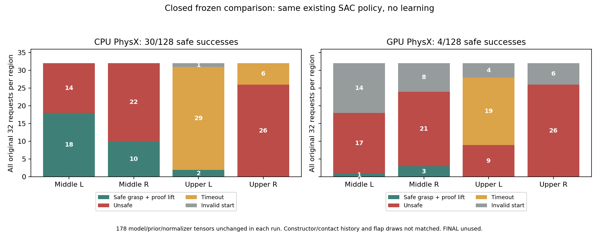
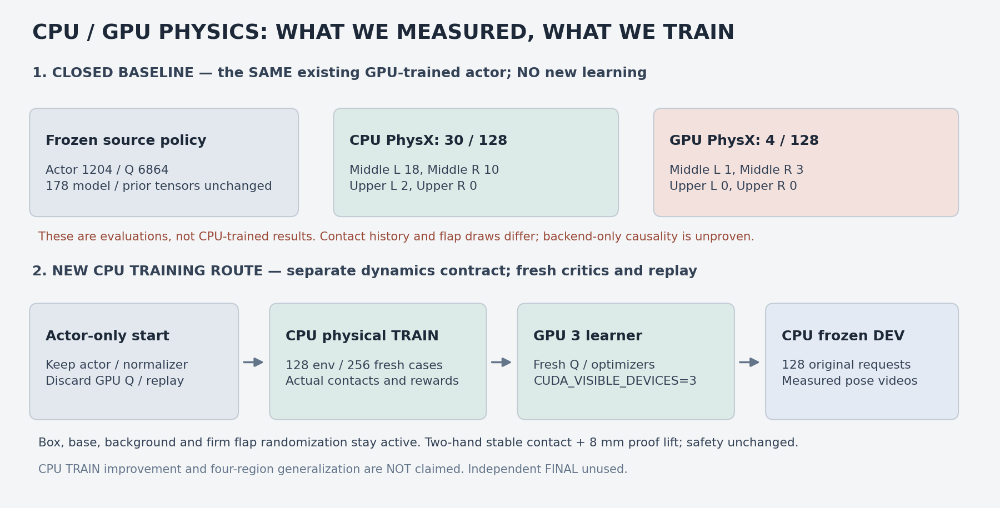
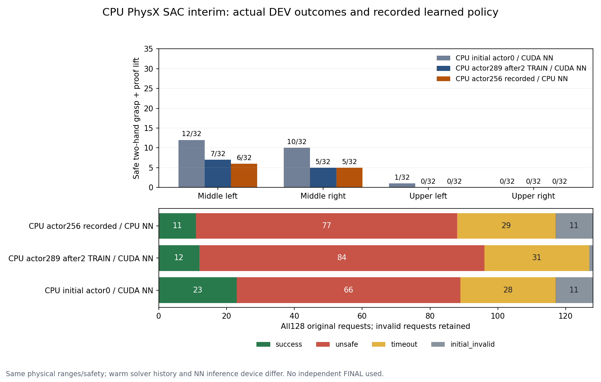

# 단단한 flap · CPU/GPU 물리와 SAC 중간 보고

CPU 추가 학습은 현재 개선되지 않았다. 같은 실행에서 학습 전23/128에서
fresh TRAIN256개 후 actor289/Q3204는12/128로 감소했다. 별도 cold CPU 영상
평가의 actor256/Q3072도11/128이었다. 아래의 기존 정책 CPU30/GPU4 대조와
구분한다. 상단 좌우의 추가 학습 후 파지는 모두0/32다.

같은 기존 GPU 학습 actor1204의 전체 원래 DEV128 재생에서 안전 양손 파지와
proof lift는 CPU30/128·GPU4/128이었다. **CPU에서 새로 학습한 정책의 성과가
아니다.** 상단오른쪽은 두 실행 모두0/32이며 독립 FINAL도 사용하지 않았다.



## CPU/GPU 물리가 다른 이유

PhysX는 GPU에서 broad phase·contact generation·constraint solver를 별도로
구현한다. [NVIDIA GPU rigid bodies 문서](https://nvidia-omniverse.github.io/PhysX/physx/5.3.0/docs/GPURigidBodies.html).
같은 backend에서도 actor 삽입 순서·scene 구성 등이 재현성에 영향을 주며 다른
platform 간 bitwise 동일성을 보장하지 않는다.
[NVIDIA determinism 문서](https://nvidia-omniverse.github.io/PhysX/physx/5.3.0/docs/RigidBodyDynamics.html#enhanced-determinism).

이번 실행에서 확인한 사항과 아직 구분되지 않은 요인은 다음과 같다.

| 항목 | 확인 결과 | 해석 |
| --- | --- | --- |
| 정책 | 각 실행의 network/normalizer178개 tensor 불변 | 학습 업데이트가 차이를 만든 것은 아님 |
| 초기 rack/support | Actual root 위치10µm 이하·roller q/v 동일 | 요청값뿐 아니라 실제 상태를 확인 |
| 기록한 Asset 속성190개 | 154개 동일,18개 pool의 stiffness/damping36개 다름 | env0 물성 및 전체 질량 범위 대조. Flap 범위는 같지만 추첨 값은 다름 |
| GPU 접촉 버퍼 경고 | 검사한 닫힌 로그에 overflow 관련 일치0 | 버퍼 부족이 원인이라는 증거 없음 |
| Constructor/contact 이력 | Bitwise 일치시키지 않음 | Backend만의 인과 효과 또는 엔진 결함 미확정 |
| 정책 추론 장치 | CPU 평가의 NN은 CPU, GPU 평가의 NN은 CUDA | Weight 불변만으로 추론의 bitwise 일치까지 보장하지 않음 |
| Clone collision filtering | IsaacLab2.3.2가 CPU에는 별도 filtering 호출, GPU에는 env ID 사용 | 초기화 처리 경로도 같지 않음 |

[실제 속성·로그 검사 JSON](assets/rl_v2_CPU_GPU_physics_property_audit_20261006.json).
닫힌 HDF의 행동 전 초기 상태도 추가로 대조했다. CPU127개·GPU96개의 초기
유효 snapshot 중 공통96개에서18 pool ×4 hinge의 각 물성6912개 값이 전부
달랐다. Stiffness·damping·static/dynamic friction 네 항목 모두 같은 범위의
다른 추첨이었다. 초기 무효 요청은 전체 성공률 분모128에서 제외하지 않았다.
현재 `randomize_flap_dynamics`는 `torch.empty(..., device=env.device).uniform_()`로
물리 장치의 전역 RNG를 사용한다. 같은 seed만으로 CPU/CUDA 난수를 일치시키지
못한다. [PyTorch 재현성](https://docs.pytorch.org/docs/2.9/notes/randomness.html),
[실제 per-layout flap 대조 JSON](assets/rl_v2_CPU_GPU_pre_action_flap_audit_20261006.json).
Backend만의 효과를 분리하려면 동일 per-layout 물성 tensor·동일 NN 추론 장치·
동일 scene 생성 순서를 사용하는 별도 frozen 비교가 필요하다. 현재 학습의
randomization 범위나 성공·안전 기준은 이 분석 때문에 변경하지 않았다.

GPU 버퍼는 CPU처럼 모두 동적으로 증가하지 않으며 부족하면 접촉이 누락될 수
있지만, 그 일반적 가능성을 이번 원인으로 판정하지 않는다.
[IsaacLab2.3.2 PhysX 설명](https://isaac-sim.github.io/IsaacLab/v2.3.2/source/api/lab/isaaclab.sim.html#isaaclab.sim.PhysxCfg).

## 바꾼 설정과 학습 방법



Flap stiffness1.5–2.5Nm/rad·damping0.15–0.25Nm·s/rad·static friction0.45–0.65·
dynamic friction0.30–0.40·시작 각도±1°를 사용한다.
이 마찰은 flap hinge joint 계수이고 그리퍼·랙의 접촉 재질은 변경하지 않는다.
Episode 중 고정하지 않으며 box/base/background randomization은 유지한다.
양손 서로 다른 flap의 실제
접촉/안정 유지와8mm roller-clearance proof lift가 성공 조건이다.
Rack10N·robot-only obstacle5N·self-collision OFF는 유지한다.

새 CPU_PhysX_v1 계약으로 CPU 물리·GPU3 SAC 학습을 분리했다. 기존 actor의
actor/normalizer9개 tensor만 그대로 옮기고 새 Q/replay·성공 bank·critic
normalizer·네 optimizer를 만들었다. 초기 actor/Q update0·replay0을 확인했다.
기존 GPU Q/replay와 CPU DEV 성공30건을 새 학습에 넣지 않는다.
[구현·초기화·검증 기록](RL_V2_FIRM_FLAP_INITIAL_GUARD_20261006.md).

새 실행은128env,새 TRAIN256개,초기/학습 후 같은 DEV128이다. Box/base/background
분포와 네 구역32개 분모를 유지하며 DEV world snapshot은 가져오지 않는다.
새 CPU 학습 성과는 앞으로 닫힌 실제 TRAIN/DEV 결과로 구분한다.

## 영상 수집과 보관

`--eval-video-env-indices 0 5 42 3 2 4`로 전체128개 평가를 유지하면서 중간 좌우·
위쪽 좌우·성공/충돌/timeout 후보6개를 녹화한다. 후보의 과거 성공 여부를 이번
성공으로 가정하지 않으며 새 실제 outcome을 함께 저장한다. 초기 baseline과
CPU 학습 후 정책은 source checkpoint·update 수·물리 장치로 명확히 구분한다.

영상은 종료/reset 직전 실제 body/link pose를 CPU mesh renderer로 그린다.
Actor 관측으로 flap 움직임을 추정하거나 물리를 다시 재생하지 않는다.
닫힌 개별 video writer만 H.264/avc1·yuv420p·faststart MP4로 변환하고 전체
decode를 검사한다. 기존 Drive 인증과300초 checkpoint 검증/최근2개 보호·
종료 후 로그/HDF/replay 백업을 재사용하며 영상·실제 판정 JSON도 보관한다.
Notion에는 외부 Drive 공유 링크 대신 native video/image로 첨부한다.

[Humanoid 하위 중간 보고 페이지](https://app.notion.com/p/3f163918d42a817aa98cec7e2114034e)에
전체 결과 그래프·영역별 표·물리 차이·수정 방법과 native MP46개를 기록했다.
현재 페이지에는 아래 CPU 추가 학습 정책7개까지 합쳐 native 영상13개·그림8개가
있다. 기존 actor의 CPU 재생과 CPU TRAIN에서 업데이트한 actor를 구분한다.
원래128개 요청을 유지한 별도6-case CPU baseline 녹화는 정상 종료했다.
전체 결과30/128뿐 아니라128개 outcome·terminal dictionary가 이전 CPU baseline과
모두 일치했고 network/normalizer178개 tensor와 업데이트 수는 불변이었다.
원래 supervisor의 종료 후 Drive 업로드·체크섬 검증도 완료했다. 이 녹화는
기존 GPU 학습 actor1204/Q6864의 CPU 평가이며 새 CPU 학습 성과로 표시하지 않는다.
[실제 영상·전체 재현 확인 JSON](assets/rl_v2_CPU_baseline_video_evidence_20261006.json).

| 영상 | 실제 종료 | 판정과 원인 |
| --- | --- | --- |
| Env0·중간 왼쪽 | 16.90s | 양손 안정0.267s·proof lift clearance3.05cm 성공 |
| Env5·중간 오른쪽 | 16.87s | 양손 안정0.267s·clearance3.21cm 성공 |
| Env42·위쪽 왼쪽 | 21.60s | 양손 안정0.267s·clearance5.09cm 성공 |
| Env3·위쪽 오른쪽 | 14.80s | 오른쪽 gripper base–rack17.25N으로 실패 |
| Env4·다른 중간 왼쪽 시작점 | 18.93s | 오른쪽 gripper base–rack38.15N으로 실패 |
| Env2·위쪽 왼쪽 | 28.57s | 손 거리4.75cm/0.334cm이나 실제 양손 pinch 없이 timeout |

Notion 영상은 H.264/avc1·yuv420p·faststart 및 전체 decode 검사를 통과하고,
baseline 기록 당시 fetch에서 native `notion-file-block` video6개와 이미지4개를 확인했다. 사용자
브라우저에서의 재생을 직접 검사한 것은 아니다. CPU 물리·GPU3 learner의 별도
실행은12:43 KST 시작,128env·fresh TRAIN256개로 정상 종료했다.
학습 후 정책 영상과 닫힌 DEV 결과는 초기 baseline과 별도로 아래 기록한다.

13:11 KST에 새 실행의 학습 전 원래 DEV128을 확인했다. 안전 파지는23/128로
중간왼쪽12·중간오른쪽10·상단왼쪽1·상단오른쪽0이었다. Unsafe66·timeout28·
원래 초기 무효11도 분모에 유지했다. CPU native constructor world를 사용했고
GPU DEV 초기 월드를 가져오지 않았다. 앞선 matched-world30과 직접적인 개선
비교로 쓰지 않는다. 저장된 모델의 원래 storage tag는 실제 `cuda:0`이며 writer의
`CUDA_VISIBLE_DEVICES=3`도 확인했다. 학습 전 actor/normalizer9개 tensor는 초기화
후와 동일하고 actor/Q update는0이었다. 이후 fresh TRAIN256개를 수집했다.
[실제 초기 평가·GPU learner 장치 확인 JSON](assets/rl_v2_CPU_initial_DEV_GPU_learner_20261006.json).

13:54 KST에 CPU TRAIN에서 actor256회/Q3072회 추가 학습한 체크포인트의
별도 전체 DEV128 영상 평가를 시작했다. CPU 초기 actor0과 비교해 actor의
파라미터6개 묶음이 모두 바뀌었고 현재 SAC agent의 저장 모델54개 tensor는
모두 유한했다. Frozen 평가 전체 네트워크/normalizer178개와는 검사 범위가
다르다. 저장된
모델의 원래 storage tag는cuda:0이며 실제 학습은GPU3에서 이루어졌다.
[실제 CPU 추가 학습 모델 검증](assets/rl_v2_actual_CPU_learned_checkpoint_20261006.json).
처음부터 CPU에서 학습한 모델이 아니라 기존 GPU actor를 초기값으로 두고
CPU 물리의 fresh TRAIN에서 추가 학습한 모델이다. 기존 GPU Q/replay는 가져오지
않았다. 영상 평가는CPU 물리·CPU NN이며 학습 시CUDA NN과 bitwise 추론까지
일치시킨 것은 아니다. 원래DEV128 요청·영역별32개 분모를 유지하고 GPU DEV
초기 월드도 가져오지 않는다. 아래의 종료된 전체 영상 평가11/128과
같은 CPU 학습 실행의 초기23/128·학습 후12/128을 구분한다.

현재 base 접근은 측정된 template로 수행한 뒤 hold하는 제어기다. 실제 양손
파지/proof lift를 평가하지만 base 접근 자체를 SAC가 학습했다는 뜻은 아니다.
기존 baseline 영상·이미지·정확한 소스/증거61개와 별도 receipt, 새 CPU 추가
학습 체크포인트·평가 입력5개와 receipt는 기존 Drive 연결로 크기/MD5 검증했다.

## 실제 CPU 추가 학습 결과와 영상



| 원래 DEV128 | 중간 왼쪽 /32 | 중간 오른쪽 /32 | 상단 왼쪽 /32 | 상단 오른쪽 /32 | 전체 성공 |
| --- | --- | --- | --- | --- | --- |
| CPU 초기 actor0·CUDA NN | 12 | 10 | 1 | 0 | 23/128 |
| CPU TRAIN256개 후 actor289·CUDA NN | 7 | 5 | 0 | 0 | 12/128 |
| CPU actor256·CPU NN·cold 영상 평가 | 6 | 5 | 0 | 0 | 11/128 |

학습 후 warm CPU 평가의 rack 실패84·timeout31·초기 무효1도 분모128에
유지했다. 초기 무효는11→1로 줄었지만 실제 파지도 감소했다. 학습 후에는
TRAIN을 거친 solver/reset 이력과 flap 추첨이 달라진다. 별도 cold 영상 평가의
공통 유효117개에서는 항목별8424개 hinge 강성·감쇠·두 마찰 값 차이0, 기록된
base/rack pose·pool 배정·원래 초기 무효11개 flag도 동일했다. NN 추론 장치는
CUDA→CPU이며 constructor contact cache·전체 link/q/v까지 bitwise로 대조한
것은 아니다. [시작 상태 대조](assets/rl_v2_CPU_initial_vs_learned_video_start_audit_20261006.json),
[실제 전체 결과와 영상 판정](assets/rl_v2_CPU_actual_learning_and_video_20261006.json).

Actor256의 normalizer mean/var/count3개는 초기와 동일하고 actor weight/bias6개만
변했다. 이 모델에서는 normalizer drift가 확인되지 않았다. CPU 물리 전환만으로
SAC가 개선된 것은 아니며 fresh Q 신뢰도·actor 변화·보상/제어의 영향을 구분해야
한다. 상단 오른쪽은 rack 충돌, 상단 왼쪽은 실제 양손 pinch 실패가 계속된다.

Notion에 실제 CPU 추가 학습 actor256의 MP47개와 비교 그래프·실제 종료 자세를
추가했다. 전체 frozen network/normalizer178개 tensor와 update/replay 수가 불변임을
확인했다. 처음 선택한6개 중 Env2는 원래 초기 무효라 동작 영상은5개이며, 다른
후보로 바꾸지 않고128개 실패 분모에 유지했다. 영상5개는 모두 실패지만 전체
평가에서는11개가 성공했다. H.264/avc1·yuv420p·faststart·전체 decode를 검증했다.

| 실제 CPU 추가 학습 영상 | 종료 | 판정 |
| --- | --- | --- |
| Env0·중간 왼쪽 | 20.63s | 오른쪽 gripper base–rack153.84N, 실패 |
| Env4·다른 중간 왼쪽 시작점 | 19.87s | 오른쪽 gripper base–rack25.66N, 실패 |
| Env5·중간 오른쪽 | 17.53s | zarm_r4_link–rack11.23N, 실패 |
| Env3·상단 오른쪽 | 14.93s | 오른쪽 gripper base–rack107.36N, 실패 |
| Env42·상단 왼쪽 | 25.47s | 손 거리3.65cm/3.06cm, 양손 pinch 없이 timeout |
| Env16·중간 왼쪽 | 16.63s | 양손 pinch·안정0.267s·proof lift·clearance2.96cm, 성공 |
| Env25·중간 오른쪽 | 16.97s | 양손 pinch·안정0.267s·proof lift·clearance3.09cm, 성공 |

추가 성공 예시도 같은 actor256/checkpoint·전체 원래DEV128을 다시 평가해
녹화했다. 재평가는 exit0으로 끝났고 **128개 outcome·terminal dictionary가
첫 cold CPU 영상 평가와 모두 동일**했다. 성공은 두 번 모두11/128이며,
녹화 subset을 더해 성공률을 늘리거나 Q/성공 bank에 넣지 않는다.
두 영상의 양손 pinch·stable hands·서로 다른 flap·proof lift는 모두 참이고,
종료 시 rack force0N·모든 unsafe cause 거짓이다. Clearance는 roller 기준
지표이며 world-Z 상승량과 동일하다는 뜻은 아니다.
[추가 성공 영상·전체 재현 확인](assets/rl_v2_CPU_learned_success_video_evidence_20261006.json).

Base 시작 offset은 Env16 lateral12.53cm/outward3.40cm/yaw11.68°, Env25
lateral−14.67cm/outward19.69cm/yaw3.00°로 달랐다. 접근 후 base 유지 방식이며
전체 초기 위치에 대한 자율 이동/파지 일반화를 달성한 것은 아니다.
현재 native 영상13개·이미지8개의 첨부와 이전 native 자료의 보존을 fetch로
확인했다. 실제 사용자 브라우저에서의 재생까지 검사한 것은 아니다.

CPU 학습 본 실행과 두 영상 실행은 exit0이다. 첫 영상 실행의 최종 Drive
검증과 CPU 추가 학습 영상5개·판정·그래프·보고37개 및 receipt 검증은 완료했다.
15:33 KST 실제 상태 확인에서 CPU 본 실행의 replay1.45GiB·HDF1.16GiB와
추가 성공 영상 실행의 종료 자료도 원래 supervisor의 최종 업로드·크기/MD5
검증을 완료했다. 두 실행의 `training_exit_code: 0` 및
`final_upload_verified: true`를 확인했다. 이는 백업 완료이며 학습 성공의 뜻은 아니다.

닫힌 CPU 학습 checkpoint를 평가하려면 아래처럼 별도 고유 실행 폴더와
원래 DEV128 wave를 사용한다. TRAIN wave나 축소된 성공 사례 wave는 이 옵션에서
거부한다. 실제 CPU TRAIN actor update가0인 초기화 모델을 CPU 학습 후 모델로
표시하지 않는다.

```bash
conda activate env_isaaclab_232
CUDA_VISIBLE_DEVICES=0 python scripts/rl/batched_staged_goal_with_drive.py \
  --gpu 0 --physics-device cpu \
  --experiment-dir /absolute/path/to/unique-cpu-eval \
  --checkpoint /absolute/path/to/CPU-learned-checkpoint.pt \
  --training-manifest /absolute/path/to/CPU-training_manifest.json \
  --waves-json /absolute/path/to/original-DEV128.json \
  --waypoints /absolute/path/to/staged-waypoints.json \
  --demo-dataset /absolute/path/to/quest-success.hdf5 \
  --native-seed /absolute/path/to/closed-middle-TRAIN-transitions.hdf5 \
  --native-seed /absolute/path/to/closed-upper-TRAIN-transitions.hdf5 \
  --no-training --frozen-physics-backend-eval --steps 900 \
  --eval-video-env-indices 0 5 42 3 2 4
```

GPU0은 Kit renderer 격리를 위한 번호이고 이 평가의 물리/NN 추론은 CPU다.
실제 CPU 물리 학습에서는 `--gpu 3 --physics-device cpu --learner-device cuda:0
--cpu-physics-training --training`을 사용하며 CPU 계약으로 새 Q/replay를
초기화한 checkpoint와 fresh TRAIN/DEV wave가 필요하다. GPU 학습의 Q/replay는
CPU 학습에 이어 붙이지 않는다.
