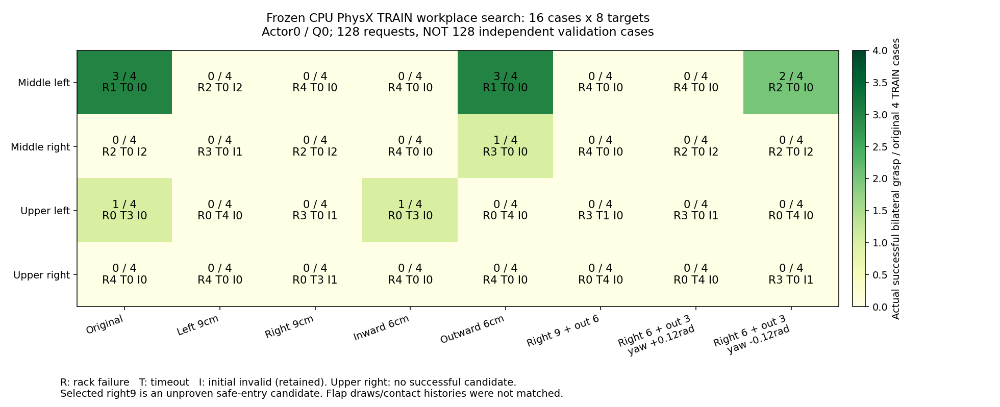

# CPU 물리 · fresh TRAIN에서 base 접근 위치 찾기

CPU 물리의 기존 actor 재생은 성공 사례가 있지만, fresh TRAIN256개로 추가
학습한 후에는 같은 실행의 DEV128 성적이23→12로 떨어졌다. 상단 오른쪽은
랙 충돌, 상단 왼쪽은 실제 양손 pinch 실패가 계속된다. 기본 upper 접근 위치는
왼쪽 TRAIN 성공 측정에서 가져온 후보이며 오른쪽에서도 적절하다는 증거가 없다.

다음 진단은 학습 후 악화된 actor를 승격하지 않고 CPU 학습 전 초기 actor를
고정한 채 접근 위치를 찾는다. 이전 GPU 물리의 XY/yaw 진단과 달리 이번에는
CPU PhysX의 fresh TRAIN 분포에서 네 영역을 함께 측정한다.

## 비교 방법과 범위

- 원래 sampler의 box/base/background randomization을 유지한 새 TRAIN16개:
  중간/상단·좌우 각4개. 매 사례에 동일한8개 접근 위치 후보를 적용해128 env.
- 기존 위치, 좌우9cm, 앞뒤6cm, 옆+바깥 조합, 옆+바깥+yaw±약7°를 비교한다.
  로봇의 초기 상태를 성공 자세로 바꾸지 않고, 실제 base 접근 제어의 목표만 변경한다.
- Flap은 강성1.5–2.5Nm/rad·감쇠0.15–0.25Nm·s/rad·hinge 마찰 범위에서 동적으로
  움직인다. Box를 고정하거나 episode 중 pose를 덮어쓰지 않는다.
- 후보끼리 요청된 초기 box/base/background layout은 동일하다. Flap의 물성
  추첨·contact/constructor 이력까지 bitwise로 맞춘 비교는 아니므로 작은 차이를
  base 위치만의 효과로 단정하지 않는다. 후속 fresh TRAIN에서 재확인한다.
- 성공은 양손 서로 다른 flap의 실제 pinch·안정 유지·8mm roller-clearance
  proof lift이며 rack10N·robot-only obstacle5N·self-collision OFF를 유지한다.

`--cpu-workplace-probe --base-waypoint-probe --no-training`은 CPU 물리·CPU NN의
명시적 read-only 진단이다. DEV/FINAL로 데이터를 재표기하지 않고 원래 TRAIN
seed를 유지한다. 학습 update·replay·성공 bank·measured credit bank를 추가하지
않으며 전체 network/normalizer tensor와 counter 불변을 종료 시 검사한다.
변경된 제어기에서 나온 진단 transition은 SAC의 matching Q/replay로 가져오지 않는다.

이128개는 **16사례×8후보의 탐색**이지 독립128개 일반화 평가가 아니다.
초기 무효와 충돌/timeout도 그대로 남긴다. 적절한 후보를 얻으면 새 제어 계약과
fresh Q/replay에서 SAC 학습을 하고 원래 전체 DEV128, 이후 독립 FINAL로 평가한다.
Base 접근은 측정된 목표로 이동한 뒤 유지하는 방식이며 학습된 자율 주행이 아니다.
상단 좌우 및 다양한 base/box 초기 상태의 성공은 아직 달성하지 않았다.

## 실행

```bash
conda activate env_isaaclab_232
CUDA_VISIBLE_DEVICES=0 python scripts/rl/batched_staged_goal_with_drive.py \
  --gpu 0 --physics-device cpu \
  --experiment-dir /absolute/path/to/unique-workplace-run \
  --checkpoint /absolute/path/to/CPU-initial-actor-checkpoint.pt \
  --training-manifest /absolute/path/to/CPU-training_manifest.json \
  --waves-json /absolute/path/to/fresh-TRAIN16-times8-candidates.json \
  --waypoints docs/assets/rl_v2_staged_base_hold_candidates_20261004.json \
  --demo-dataset examples/demos/v2_grasp_quest_success.hdf5 \
  --native-seed /absolute/path/to/closed-middle-TRAIN-transitions.hdf5 \
  --native-seed /absolute/path/to/closed-upper-TRAIN-transitions.hdf5 \
  --no-training --cpu-workplace-probe --base-waypoint-probe --steps 900 \
  --eval-video-env-indices 0 32 64 96 97 101
```

GPU0은 Kit renderer 격리용이다. CPU 물리와 CPU 정책 추론을 사용하며 다른
GPU의 기존 사용자 프로세스는 유지한다. 출력은 소유자 전용 RAM 폴더에 두고
기존 Drive 연결로 닫힌 checkpoint/input 및 종료 후 로그·HDF·영상을 크기/MD5
검증한다. 인증이나 공유 권한을 변경하지 않는다.

실제 writer가 정상 종료한 뒤 전체128개 원래 요청을 집계한다. 진행 JSON의
일부 성공이나 선택 영상만으로 후보를 고르지 않는다.

```bash
PYTHONPATH=src:scripts/rl python scripts/rl/summarize_cpu_workplace_probe.py \
  --experiment-dir /absolute/path/to/closed-owned-workplace-run \
  --output-json /absolute/path/to/workplace-results.json
```

집계기는 원래16개 seed와128개 후보 요청, actual terminal·초기 무효·충돌 원인·
timeout·수치 오류를 유지한다. 전체178개 network/normalizer 불변과 actor/Q/replay
추가0을 확인하며, 실제 양손 접촉·유지·유한한 proof lift 없이 성공을 인정하지
않는다. 한 영역에서 모든 후보의 성공이0이면 추천도 비워 둔다. 성공 후보가
있어도 fresh TRAIN 재확인 대상이며 일반화 점수나 matching SAC replay가 아니다.

### 진단 영상의 TRAIN 표시

이 새 진단을 기존 DEV 녹화기에 연결하면서 최초 실행 영상의 상단 제목과
일부 metadata role이 `DEV`로 표시되는 문제가 발견됐다. 원래 요청·wave·
manifest는 TRAIN이고 정책/Q/replay 업데이트는0이다. 이 영상을 DEV 점수나
CPU 추가 학습 정책의 동작으로 해석하지 않는다.

이후 writer는 outer wave의 split과 명시적 frozen workplace flag를 녹화기에
전달해 `TRAIN workplace probe`로 표시한다. 기존 DEV128의 개별 layout은
역사적으로 `split=holdout`을 유지하므로 outer `validation` wave와 구분한다.
독립 FINAL 영상이나 학습 중 TRAIN 영상을 이 경로에 섞지 않는다.

이미 실행 중인 writer를 수정하거나 원본 MP4/JSON을 덮어쓰지 않는다. 정상
종료와 전체128개/frozen178 검사 후 별도 폴더로 정확한 제목을 붙인 복사본을
만든다. 물리를 다시 실행하거나 초기 무효 요청을 다른 사례로 바꾸지 않는다.

```bash
PYTHONPATH=src:scripts/rl python scripts/rl/export_cpu_workplace_videos.py \
  --experiment-dir /absolute/path/to/closed-owned-workplace-run \
  --output-dir /absolute/path/to/unique-TRAIN-workplace-media
```

기존 상단 제목 bar만 바꾸며 실제 body 자세·종료 frame·status line·frame 수·
시간은 유지한다. 원본/복사본 SHA256과 전체 H.264 decode를 검증하고 원본은
보존한다. 영상 scope와 실제 frame/timing/원본 보존을 포함한11개 검사를 통과했다.

관련 범위 검사52개 통과, 기존 CUDA integration1개는 이 CPU 진단 검사에서
skip했다. 실제 물리 성공은 테스트 통과만으로 판단하지 않고 종료 측정으로 판정한다.

[이전 실제 CPU/GPU 평가·학습 결과·영상](RL_V2_CPU_GPU_INTERIM_REPORT_20261006.md).

## 실행 중 확인한 근거

GPU3의 기존 장기 SAC는 새 TRAIN1536개와 전체 DEV5회를 모두 수행하고 exit0으로
종료했다. DEV 성공은9→4→3→2→4/128이었고 마지막 중간왼쪽1·중간오른쪽3·
상단0/0, unsafe84·timeout12·초기 무효28이었다. Actor5715/Q24906까지의 학습은
일반화 개선으로 이어지지 않았다. 종료 백업은 원래 supervisor가 처리한다.

별도로 종료된 CPU 학습의 실제 성공 TRAIN bank22개 경로에서 학습 전/후
actor를 동일한 관측에 적용했다. 마지막16개 상태의 양손 닫힘은 중간좌우 모두
144→144, 상단왼쪽61→64였다. 이 성공 상태들에서는 그리퍼가 파지를 잊거나
actor normalizer가 변했다는 증거가 없었다. 평균 body goal 변화는 normalized
좌표에서 중간좌0.00338·중간우0.00378·상단좌0.00611이었다. 이 수치는 meter나
radian이 아니며 작은 출력 차이도 폐루프 동작/충돌을 바꿀 수 있다.

학습된 Q는 같은 실제 TRAIN 상태에서 대체로 학습 후 actor의 행동을 더 높게
평가했다. Q 선호는 실제 성공 또는 그 원인의 증명이 아니다. 상단오른쪽 성공
TRAIN 경로가 bank에 없어 이 영역의 성공 동작 보존을 대조할 수 없었다.
[실제 CPU TRAIN actor/Q 진단](assets/rl_v2_CPU_TRAIN_actor_regression_audit_20261006.json).

새16사례×8접근위치의 CPU 진단은 정상 종료했고, 원래 supervisor의 최종
Drive 업로드와 크기/MD5 검증도 완료했다. 전체128개는 성공11·랙 충돌72·
timeout30·초기 무효15이며, network/normalizer178개와 actor/Q/replay counter가
변하지 않았다. 이 결과는 TRAIN 후보 탐색이며 DEV 점수나 새 CPU 학습의 성과가 아니다.

## 닫힌 결과와 다음 SAC 실험

| 영역 | 다음 진입 후보 | 원래 TRAIN4개 결과 | 해석 |
|---|---|---|---|
| 중간 왼쪽 | 기존 위치 | 성공3·랙 충돌1 | 성공 후보, 일반화 미검증 |
| 중간 오른쪽 | 바깥6cm | 성공1·랙 충돌3 | 성공 후보, 충돌 위험 남음 |
| 상단 왼쪽 | 기존 위치 | 성공1·timeout3 | 성공 후보, 실제 pinch 부족 |
| 상단 오른쪽 | 오른쪽9cm | 성공0·timeout3·초기 무효1 | 안전 진입 탐색 후보, 파지 미검증 |

상단 오른쪽은 모든 후보의 성공이0이다. 결과 JSON의 성공 추천도 `null`로
유지한다. 오른쪽9cm는 유효3개에서 랙 충돌이 없고 손 접근이 상대적으로
가까웠기 때문에 **실패한 안전 진입 후보**로 다음 SAC에 연결한다.
양손 닫힘 명령은 상단 오른쪽의 전체 유효30개 경로에서0회였고 실제 opposing
pad pinch도0이다. 다만 선택한 후보에도 손 중점 거리·닫힘 축 정렬·한쪽 pad
접촉 문제가 남아 있어 닫힘만이 유일한 원인이라고 단정하지 않는다.

[원래128개 결과](assets/rl_v2_CPU_TRAIN_workplace_search_results_20261006.json)와
[닫힌 HDF 접촉/닫힘 분석](assets/rl_v2_CPU_TRAIN_workplace_contact_analysis_20261006.json)을
보존했다. 중점 거리는 기존 terminal의 최근접 표면 거리와 다른 측정이다.



지역별 제어 계약 `TRAIN_measured_region_workplace_candidates_v2`는 네 영역의
측정·실패·초기 무효 분모를 보존한다. 성공0인 상단 오른쪽은
`measured_success=false`와 `unproven_grasp_candidate=true`로 강제 표시한다.
예전 two-shelf actor/normalizer9개는 명시적 actor-only 초기화에서만 가져오고,
변경된 목표에 맞는 Q/replay·성공 bank·critic normalizer·네 optimizer를 새로
만든다. 이전 제어 계약의 Q checkpoint를 새 계약에 resume하면 거부한다.

```bash
PYTHONPATH=src:scripts/rl python scripts/rl/prepare_region_workplace_actor.py \
  --checkpoint /absolute/path/to/initial-CPU-actor.pt \
  --training-manifest /absolute/path/to/CPU-training_manifest.json \
  --source-waypoints docs/assets/rl_v2_staged_base_hold_candidates_20261004.json \
  --workplace-results docs/assets/rl_v2_CPU_TRAIN_workplace_search_results_20261006.json \
  --native-seed /absolute/path/to/closed-middle-TRAIN-transitions.hdf5 \
  --native-seed /absolute/path/to/closed-upper-TRAIN-transitions.hdf5 \
  --selection shelf_2_left=baseline --selection shelf_2_right=outward6 \
  --selection shelf_3_left=baseline --selection shelf_3_right=right9 \
  --output-dir /absolute/path/to/unique-regional-initialization
```

다음 학습은 CPU PhysX/PGS·GPU3 learner·128env, 새 TRAIN12 wave×128사례를
사용한다. TRAIN3 wave마다 동일한 원래 DEV128을 학습 없이 평가하고 독립 FINAL은
미사용으로 유지한다. Joint jaw exploration은 TRAIN에서만 epsilon30%,
measured-nstep16과 soft logit saturation penalty를 사용한다. DEV/FINAL은
Q/replay·성공 bank에 넣지 않는다. Box/base/background와 동적 flap randomization,
원래 성공/안전 조건을 유지한다. Base 접근과 hold는 기존 측정 제어이며 자율 이동 학습이 아니다.

실제 checkpoint 초기화에서 actor/normalizer9개 tensor의 완전 일치, fresh Q/replay/
success bank/네 optimizer/critic normalizer를 확인했다. 관련 검사는
54 passed·GPU integration1 skipped다. 실제 GPU 학습 시작과 성공률은 별도로 확인한다.

### 16:17 KST 실제 시작 확인

Main8f3390b에서 GPU3 실행을 시작했다. 새 입력7개와 별도 receipt는 기존 Drive
크기/MD5 검증을 마쳤다. 실제 writer3438616의 소유자·run·CUDA_VISIBLE_DEVICES=3과
manifest의 sim_device=cpu / learner_device=cuda:0 / fresh TRAIN1536 계약을 확인했다.
현재 원래 DEV128의 학습 전 평가를 준비 중이며 actor 개선을 주장하지 않는다.

학습 checkpoint는300초 간격 검증 후 최신2개를 보호하고 종료 후 닫힌 로그/
HDF/replay도 동일 supervisor가 검증한다. 이전 GPU 장기 학습의 원래 대용량
업로더와 다른 사용자·GPU0 프로세스는 유지했다. 실제 상태는 별도
[시작 근거](assets/rl_v2_CPU_region_workplace_SAC_start_20261006.json)에 기록한다.

[Notion 중간 보고](https://app.notion.com/p/3f163918d42a817aa98cec7e2114034e)는
CPU 추가학습 정책7개·기존 actor CPU baseline6개·이번 TRAIN 진단6개를 구분한
native 영상19개와 그림/사진10개를 첨부했다. 기존 native block을 보존하고
추가한 영상이 escaped text가 아니라 실제 video block인지 재조회해 확인했다.

16:21 KST에 실제 원래 DEV128의 학습 전 평가61steps·유효117개·held3개까지
진행했다. Actor/Q update0·replay0이며 네 영역의 stage template와 선택 목표가
일치하고 상단 오른쪽 `measured_success=false`도 실제 진행 JSON에서 확인했다.
정정된 TRAIN 영상6개·그림·보고·Notion 검증 등 닫힌26개 파일과 별도 receipt는
고유 폴더에 Drive 크기/MD5 검증을 마쳤다.
[보고 자료 보관 확인](assets/rl_v2_CPU_region_workplace_report_storage_20261006.json).

### 좌우 ID 매핑 수정 · 첫 실행 중단

위16:21 시작 기록의 진입 제어에는 좌우 매핑 오류가 있었다. 내부 stage template와
선택 목표끼리의 일치는 원래 요청 영역과의 일치를 보장하지 못했다. 실제 관측
region ID는 [중간오른쪽, 중간왼쪽, 상단오른쪽, 상단왼쪽]이며, 보고서 나열
순서 [중간왼쪽, 중간오른쪽, 상단왼쪽, 상단오른쪽]와 다르다. 새 제어에서
보고서 순서를 ID로 사용해 유효117개 모두 반대쪽 진입 후보를 선택했다.

TRAIN 수집 전 actor/Q update0·replay0을 확인하고 소유한 writer3438616만
SIGTERM으로 중단했다. Run status는 interrupted·completed_waves0이며 관리자의
exit1은 이 수동 중단으로 기록됐다. 원래 supervisor는 종료 백업을 계속한다.
이 불완전한 DEV 결과는 새 제어의 기준 성능으로 사용할 수 없다.
이전 two-shelf CPU/GPU 평가와 원래16×8 TRAIN 후보 비교는 영향을 받지 않는다.
[원래 요청/실제 적용117개 대조와 중단 근거](assets/rl_v2_CPU_region_v1_mapping_bug_stop_20261006.json).

v2 계약은 실제 spec의 DEFAULT_RACK_REGIONS 순서를 perceived_region_names_by_id로
명시하고 검증한다. 네 영역을 production ID로 해석하는 검사와 좌우가 바뀐
요청을 거부하는 검사를 추가했다. 실제 collector도 매 wave 물리 rollout/Q 수집
전에 원래 layout.target_region과 관측에서 고른 stage region의 일치를 검사한다.
v1 Q/제어를 resume하지 않고 원래 CPU 초기 actor9개만 다시 보존해 fresh Q/replay를
만든다. Box/base/background/flap randomization과 성공/안전 조건은 유지한다.

### v2 재시작 확인

Source main c5f1173에서 writer3630370을 GPU3에 시작했다. 실제 소유자·고유 run·
CUDA_VISIBLE_DEVICES=3을 확인했다. V2 초기 입력7개와 별도 receipt의 Drive
크기/MD5 검증은 완료했다. 원래 v1 supervisor의 종료 백업도 완료했으며 exit1과
중단 사유는 보존한다. [실제 v2 시작 근거](assets/rl_v2_CPU_region_v2_SAC_start_20261006.json).

Production layout_reset_observation을 사용해 계획된17wave×128=2176요청의
region ID→stage 선택을 대조했다. 네 영역 각각544요청, TRAIN1536·DEV640이며
모두 원래 요청과 일치했다. DEV640은 동일128개를5회 반복하는 계획이며 독립
640개가 아니다. 이 CPU-only preflight는 물리 성공 검증이 아니고 checkpoint/
입력/Q/replay를 변경하지 않았다. [전체 계획 입력 대조](assets/rl_v2_CPU_region_v2_layout_preflight_20261006.json).
실제 collector에서도 PhysX 후 관측과 요청을 매 wave 다시 검사한다.

수정 검사64 passed·CUDA unit integration1 skipped. 실제 GPU3 writer 격리는
별도로 확인했다. 현재 환경 초기화 단계이며 새 actor의 학습 성공은 미확인이다.

16:42 KST에 v2의 첫 PhysX 평가가 시작됐다. 실제 유효117개 관측의 요청 영역과
stage 영역이 모두 일치하고 불일치0임을 확인했다. 초기 무효11개는 원래128개
분모에 유지한다. 첫 step의 actor/Q update0·replay0은 학습 전 평가이므로
정상이며 개선 점수가 아니다. [실제 PhysX117개 대조](assets/rl_v2_CPU_region_v2_actual_PhysX_region_match_20261006.json).
V2 수정·재시작·Notion 검증의 닫힌12개 보고 파일과 별도 receipt도 기존 Drive
크기/MD5 검증을 마쳤다. 활성 학습 HDF/replay는 이 보고 복사에 포함하지 않는다.

### v2 기준 평가 종료와 실제 TRAIN 시작

원래 DEV128의 학습 전 기준 평가는 성공15·랙 충돌46·timeout56·초기 무효11로
완료했다. 네 영역의 성공은 중간왼쪽10/32·중간오른쪽4/32·상단왼쪽1/32·상단오른쪽0/32다.
15개 모두 실제 양손 pinch·stable hands·서로 다른 flap·hold≥0.25s·8mm proof lift와
안전 위반 없음으로 지지하며 unsupported success는0이다. 상단오른쪽은 rack1·
timeout28·초기 무효3으로, 안전 진입 후보에서도 파지 부족은 해결되지 않았다.

기준 평가 후 저장한 checkpoint0의 primary model54개는 초기와 bitwise 동일하고
모두 유한했다. Actor/normalizer9개도 같으며 actor/Q update0이었다. 이는 새 SAC
학습의 개선이 아니다. 이전 two-shelf CPU23/128과도 제어 목표와 reset/contact
이력이 달라 actor 학습 전후 비교로 쓰지 않는다.

같은 writer가 fresh TRAIN으로 전환했고17:11 KST의 wave1/391step에서 실제 held
TRAIN39735행·Q658회·actor0을 확인했다. Q loss0.000615는 유한했다. Actor는
Q2048회 warmup와 최소32768행을 모두 만족한 뒤 업데이트한다. 최소 행 조건은
이미 충족했고 Q warmup은1390회 남았다. TRAIN39735행에 DEV는 포함하지 않는다.
Gripper epsilon30 탐색은 중간 양쪽에서 실제 닫힘을 만들고 있으며, 이 step의
상단 손은 아직 접근 중(최근접 표면 거리 약20–24cm)이므로 그리퍼 파지 구간의
탐색은 이후 확인한다. 현재 TRAIN 중간 통계를 성공률로 해석하지 않는다.
[완료된 기준 평가·모델 불변·실제 Q 학습 근거](assets/rl_v2_CPU_region_v2_initial_DEV_and_TRAIN_20261006.json).

### 실제 모델 업데이트와 첫 두 TRAIN 묶음

완료된 새 TRAIN128 두 묶음은 각각16/128·10/128 성공이었다. 첫 묶음의
중간왼쪽/중간오른쪽/상단왼쪽/상단오른쪽은8/6/2/0, 둘째는8/0/2/0이다.
둘째 중간오른쪽32개는 모두 rack 충돌이다. 두 묶음의 seed와 초기 조건이 달라
이를 actor 개선·퇴보의 인과 비교로 사용하지 않는다. 모든26개 성공의 실제
양손 pinch·stable·서로 다른 flap·0.25초 hold·8mm proof lift·안전 조건을 확인했고
unsupported success는0이다. 초기 무효도128개 분모에 유지했다.

새로 저장된 checkpoint3072의 actor256/Q3072를 CPU로 읽어 primary model54개가
유한하고 actor weight/bias6개 묶음이 실제로 바뀐 것을 확인했다. Normalizer와
body anchor·jaw reference·warm start는 bitwise 동일했다. 읽기 전후 SHA가 같았으며
활성 HDF/replay는 열지 않았다. 저장된 초기 checkpoint2048의 actor0은 예정된
Q warmup까지의 상태였고, 후속 실제 actor 학습과 구분한다.

Checkpoint3186의 actor285를 같은 실제 TRAIN 성공 상태19개 경로에서 초기 actor와
대조했다. Bank 보존 한도로26개 전체 성공 중19개 경로가 남아 있으며, 이19개를
전체 훈련 분모로 사용하지 않는다. 마지막16행의 양손 닫힘은 중간왼쪽144/144,
중간오른쪽96/96으로 학습 전후 모두 유지됐다. 상단왼쪽은60/64에서64/64로 늘었다.
이 상태들에서는 단순한 마지막 그리퍼 닫기 망각이 확인되지 않았지만, 실제
새 rollout의 경로·접촉 또는 상단오른쪽까지 설명하는 증거는 아니다. Body goal의
평균 변화는 정규화 좌표로0.00249–0.00558이며 미터 단위 거리가 아니다. Q가 새
명령을 조금 더 선호하는 결과도 실제 성공률이나 참 return의 증명으로 쓰지 않는다.

같은 writer가 세 번째 TRAIN을 수행 중이다. 새 정책의 전체 고정 DEV 결과는 아직
없고, 학습 전15/128과 같은 원래128개 평가로 비교할 때까지 개선을 주장하지 않는다.
[실제 모델 변경·성공 상태 대조·완료 TRAIN 판정](assets/rl_v2_region_sac_first_model_learning_20261006.json).

## 첫384 TRAIN 이후의 전체 DEV

Actor689/Q4802에서 세 TRAIN 묶음16/128·10/128·18/128을 마치고
전체 고정 요청128개를 다시 평가했다. 실제 양손 접촉·서로 다른 flap·안전한 들기
0.25초 유지·랙 간격8mm 조건을 모두 확인한 성공은 **15/128→29/128**이었다.
중간왼쪽10→13, 중간오른쪽4→9, 상단왼쪽1→7, 상단오른쪽0→0(각32회)이다.
초기화 실패도 분모에 유지한다. flap 성질이 reset마다 다시 샘플링되므로
정책만 바뀐 동일 물리 상태 비교는 아니다. 양쪽 모두 초기화가 유효한117개
요청에서 성공은15→26이고, 나머지 새 유효 요청에서3개가 성공했다.
이 진단 분모를 주128개 평가 성공률로 대체하지 않는다.

상단오른쪽32개는 모두 base 접근을 마쳤지만24개가 랙 충돌,8개가 시간 초과다.
충돌 body는 오른쪽 그리퍼13,왼쪽 그리퍼7,오른팔4이며 아직 성공 경로가 없다.
현재 학습은 계속하고, 학습된 actor689를 동결해 새로운 TRAIN16×8 접근 후보를
별도 비교한다. 후보 비교는 평가 성공률·Q replay로 사용하지 않는다.
학습된 checkpoint의 실제 actor/Q counter를 보존하면서 동결 전후 tensor와
counter가 일치하는지 확인하도록 기록·요약 검증을 확장했다. replay/online
초기 counter가0이 아닌 경우와 진단 중 update counter 변경은 거부한다.
[전체 DEV·동일 요청 진단 근거](assets/rl_v2_region_sac_first_DEV_after384_20261006.json).
