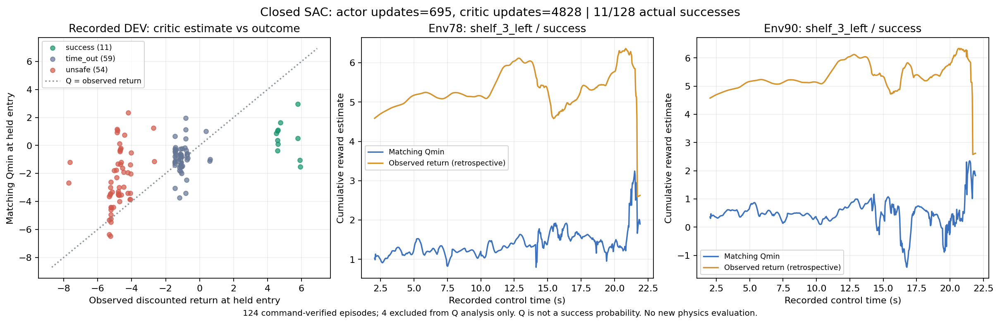
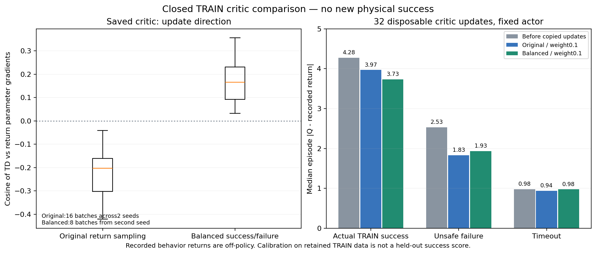

# 실제 성공 경로의 SAC 가치 추정 확인

학습된 정책의 일부 성공은 확인했지만 원래 여섯 배치의 일반화는 아직
부족하다. 안쪽 파지점 v6의 TRAIN384 뒤 전체 평가128회는 성공11·안전
위반54·시간 초과63회였고 중형 성공은0회였다. 전체 점수를 바꾸거나 평가
자료를 학습에 넣지 않고, 종료된 기록과 해당 평가의 실제 모델을 대조했다.

## 실제 누적 보상과 Q

Actor695/Q갱신4,828의 같은 모델로 기록된 관측에서 실행 명령을 재현했다.
124경로는 기존 오차 기준을 통과했다. 중간 오른쪽small의 시간 초과4경로
(Env1·25·41·105)는 최대 오차0.00027–0.00028로 통과하지 못해 Q 분석에서
제외했다. 오차 기준은 완화하지 않았고 전체 평가 분모128도 유지했다.

| 실제 종료 | Q 분석 경로 | held 시작 Q 중앙값 | 실제 할인 return 중앙값 |
|---|---:|---:|---:|
| 양손 파지·유지·들기 성공 | 11 | 0.523 | 4.614 |
| 안전 위반 | 54 | -2.819 | -4.789 |
| 시간 초과 | 59 | -0.908 | -1.116 |

이 평가에서는 실패한 채 버티는 경로의 실제 보상이 성공보다 높지 않았다.
반면 Q는 성공 경로의 실제 return보다 낮았다. Q는 누적 보상의 추정값이며
성공 확률이 아니다. 실제 한 번의 return과 추정값 차이만으로 Bellman 계산
오류나 학습 실패 원인을 확정하지 않는다.



할인은0.999, reward scale은1, entropy backup은꺼짐이다. 그림의 파란선은
당시 모델의 min(Q1,Q2), 주황선은 실제 종료까지의 보상을 사후 계산한 값이다.
새 물리 평가·애니메이션·영상은 아니며 원래 성공률도 그대로다.

## 성공 경험은 critic에 연결되어 있음

같은 종료 체크포인트의 **실제 TRAIN 성공21경로/10,549행**도 검사했다.
완료된 성공만 들어가는 별도 bank가 있고, 당시 critic batch256행 중46행,
약17.9%를 이 bank에서 가져오는 코드가 연결되어 있었다. 따라서 성공 경험이
critic에서 빠졌다고 판단하지 않는다. 실제 TRAIN의 전체 할인 return을 쓰는
추가 critic 목적함수도 batch64·가중치0.1로 연결되어 있었다.

TRAIN 성공 경로 자체에서도 시작 Q 중앙값0.790과 실제 return4.791의 차이가
있었다. 기록된 경로의 return은 과거 행동의 결과이며 현재 정책의 정확한
기대 return과 같다고 가정할 수 없다. 더 긴 학습에서 이 차이와 실제 전체
성공률이 함께 줄어드는지 확인하고, 다음 비교의 후보는 실제 TRAIN return
목적함수의 가중치와 구역별 성공/실패 비중이다. 현재 실행의 가중치는 바꾸지 않았다.

같은 TRAIN 성공 경로의 종료 전16상태씩, 연속 action32표본을 추가 질의했다.
현재 greedy Q와 연속 확률 action·네 그리퍼 branch 기대 Q 차이의 경로별
중앙값은약-0.0054였다. 이 자료에서는 action 무작위성만으로 약4의 return
차이가 설명되지 않았다. 실제 물리 rollout이나 target network 변경은 없었다.

[실제 TRAIN 성공 bank·critic 연결·수치](assets/rl_v2_interior_contact_repaired_closed_TRAIN_success_critic_diagnostic_20261009.json) ·
[같은 상태의 정책 기대값 진단](assets/rl_v2_interior_contact_repaired_closed_TRAIN_policy_expectation_diagnostic_20261009.json).

## TD와 실제 TRAIN return 갱신 방향 비교

종료된 같은 v6의 replay234,396행과 검증된 실제 TRAIN bank만 CPU에서 읽었다.
모델과 Adam moment를 복제하여 actor·정규화를 고정하고 critic만32번씩
갱신했다. 두 CPU 표본 seed로 비교했으며 원래 물리 학습에는 반영하지 않았다.

기존 return 목적함수는 가중치0.1에서도 TD gradient norm의약1.49–4.20배였다.
원래 sampling의16개 진단 batch에서 TD와 return gradient의 cosine은 모두
음수였다. 따라서 낮은 Q를 보고 return 가중치부터 높이는 판단은 보류한다.
가중치0.3·1.0은 과거 return 오차를 일부 줄였지만 마지막 TD 손실도 커졌고,
성공 경로에 대한 개선은 두 표본 seed에서 일관되지 않았다.

새 `measured-episode-return-balanced50`은 각 구역에서 **실제 안전 성공과
실패를 절반씩** 뽑고, 같은 class 안에서 episode와 row를 균등하게 뽑는다.
실제 성공이 없는 구역은 실패만 사용한다. 성공은 양손 opposing pinch·
hold≥0.25초·proof lift·안전 증거까지 검증하며 DEV/FINAL을 넣지 않는다.
batch64·가중치0.1·온라인 TD·실제 보상·종료·구역 균형은 유지한다.

| 기존 모델에서 복제 critic32회 갱신 | 성공21경로의 Q-return 절대 차이 중앙값, 표본seed1 / seed2 |
|---|---:|
| 갱신 전 | 4.276 / 4.276 |
| 기존 sampling·weight0.1 | 4.032 / 3.903 |
| 기존 sampling·weight0.3 | 3.956 / 4.155 |
| 기존 sampling·weight1.0 | 3.699 / 3.882 |
| 성공/실패 비중 조절·weight0.1 | 3.774 / 3.693 |

두 번째 표본의 균형 sampling8batch에서는 gradient cosine이 모두 양수였다.
이는 실제 TRAIN에서의 학습 후보 근거이며 **실제 성공률 개선이나 일반화
검증이 아니다.** 균형 sampling의 unsafe return 오차는 기존 방식보다 한
표본에서 컸다. 같은 학습 데이터의 calibration이고, 과거 behavior return은
현재 정책의 편향 없는 target이 아니므로 원래 안전 기준과 전체128평가로
다음 물리 비교를 판단해야 한다.



옵션은 training entrypoint와 fresh URDF initializer에서 선택할 수 있다.
기본값과 이미 실행 중인 source는 유지했다. checkpoint와 replay에 sampling
설정을 함께 저장하고, 재개 시 서로 다른 설정을 섞으면 거부한다.
관련 CPU test39개와 실제 새 초기 모델의 저장·TRAIN 재개·Q exporter 복원을
확인했다. 균형 sampling의 물리 writer는 아직 시작하지 않았다.

```bash
# Fresh initialization and its subsequent matching training both use this option.
--measured-train-credit measured-episode-return-balanced50
```

[두 CPU 표본의 loss·gradient·bank 범위·실제 수치](assets/rl_v2_closed_TRAIN_critic_balance_20261009.json).
재현 도구는 `scripts/rl/audit_closed_train_critic_gradients.py`다. 종료된 원본의
Drive 검증·writer 종료·model checksum·bank provenance를 확인하고, 원본 파일과
현재 학습을 변경하지 않은 CPU 복제 갱신만 수행한다.

## 초기 무효 조건과 상단 왼쪽 성공의 해석

v5·v6·v7의 첫 배치 guard 파일은 SHA256까지 같았다. 원래 요청128개 중
유효115·무효13개가 공통이다. 무효8개는 원래 background 박스가 안정적으로
선반 위에 있지만 지정 영역 밖에 있었고,5개는 초기 정착 중 실패하여
배치가 교체되었다. 교체 후 주차된 박스 자세는 원래 실패의 움직임이 아니다.
실패 이전 trace는 수집되지 않아 그5개가 왜 처음 실패했는지는 확정할 수 없다.

학습 후 상단 왼쪽small의 실제 성공은 Env78·90의2회다. Env78은 초기 무효,
Env90은 초기 유효 시간 초과였다. 두 사례 모두 실제 양손 opposing 파지·
0.267초 유지·proof lift·안전을 통과했지만, 초기의 유효 실패2개를 같은 물리
상태에서 개선한 것으로 해석하지 않는다. 공통 유효115조건 전체는14→10회였다.
무효 요청도 원래 분모에 남기며 교체 장면의 전이는 학습에 넣지 않는다.

[세 실행의 초기 guard와 실제 측정 근거](assets/rl_v2_predictive_initial_guard_comparison_20261009.json).

## 재현

종료 실행의 `status.json`·`verification.json`·관리자의 최종 Drive 검증,
원래 writer/supervisor 종료, 같은 평가의 보존 모델·checksum·계약·전체128조건을
모두 확인해야 한다. 현재 쓰는 HDF/replay나 다른 사용자의 실행은 읽지 않는다.

```bash
CUDA_VISIBLE_DEVICES='' python scripts/rl/audit_closed_dev_critics.py \
  --run-dir /absolute/path/to/closed-run \
  --checkpoint /absolute/path/to/matching-protected-checkpoint.pt \
  --matching-model-proof /absolute/path/to/matching-model-proof.json \
  --whole-eval-proof /absolute/path/to/completed-whole-DEV-proof.json \
  --wave 4 --output-dir /absolute/path/to/unique-analysis-directory \
  --plot-envs 78 90
```

출력은 Q·return·실제 종료의 진단이다. 원시 관측/action payload를 출력하지
않고 물리 재실행·optimizer 갱신·replay 입력·새 인증을 사용하지 않는다.
[전체 평가의 같은 모델·Q 분석 범위](assets/rl_v2_interior_contact_repaired_closed_DEV4_critic_diagnostic_20261009.json).

## 닫기 전에 막히는 실제 TRAIN 단계 확인

Q 비중뿐 아니라 실제 접근을 완료하는지도 확인한다. 종료된 원본을 직접
읽는 선택형 `--closed-run`을 추가해2.29GiB replay의 새 디스크 복사를 피했다.
두 writer 종료·정상 완료·최종 checkpoint/log Drive 검증·소유자·원본 SHA256과
검사 전후 파일 identity를 확인한다. 기존 `--snapshot-proof`도 유지한다.
원래 무효1조건은384요청에 남고, 전이가 없는 교체 조건은 진단이나 학습에 넣지 않는다.

실제234,396행에서 각 전이의 wave·원래 global ID·held clock·base 목표·jaw
명령·종료의 pinch/stability/success를 대조했다. 단계와 모든 집계는 같았지만
연속 팔 목표는 최대0.03504 오차로 재현 검증하지 않았다. `--upright-phase-only`는
그 한계를 명시하며 기존 연속 목표 허용 오차0.00003은 바꾸지 않는다.

```bash
CUDA_VISIBLE_DEVICES='' python scripts/rl/analyze_completed_contact_replay.py \
  --closed-run /absolute/path/to/complete-owned-run \
  --upright-phase-only \
  --output-json /absolute/path/to/unique-local-diagnostic.json \
  --summary-json /absolute/path/to/scalar-summary.json

CUDA_VISIBLE_DEVICES='' python scripts/rl/audit_closed_train_hand_approach.py \
  --run-dir /absolute/path/to/complete-owned-run \
  --wave 1 --plot --output-dir /absolute/path/to/unique-approach-diagnostic
```

상세 phase 출력은 raw joint/action 정보가 포함될 수 있어 로컬에 보관한다.
공개 자료에는 scalar 집계와 거리 그림만 넣는다. 손 midpoint 거리의 조건
통과는 탐색 활성화나 물리 파지 증거가 아니므로 실제 단계 재현과 구분한다.
새 physics/optimizer 갱신·평가 데이터 입력·현재 replay 읽기는 수행하지 않는다.
[실제 단계 집계·검증 범위](assets/rl_v2_interior_contact_repaired_closed_TRAIN_contact_phases_20261009.json) ·
[양손 접근 거리의 실제 집계](assets/rl_v2_interior_contact_repaired_closed_TRAIN_hand_approach_20261009.json).

## 실제 actor의 Q gradient 연결과 servo clipping

종료v7의 원래 TRAIN replay238,980행만 사용해 각 구역256행, 총1,024행을
질의했다. 실제 actor695/Q4,828과 원래 네 jaw branch의 확률 기대값을
엄격히 복원했다. 학습·정규화·물리·replay 입력이나 원래 제한은 바꾸지 않았다.

실제 명령이 포화되어 팔14좌표의 goal-to-Q gradient가0인 비율은
중간 왼쪽56.2%, 중간 오른쪽24.6%, 상단 왼쪽26.3%, 상단 오른쪽33.1%였다.
모든 팔14좌표의 Q gradient가0인 상태는62/1,024회였으므로
팔 Q가 전부 빠진 연결 오류라고 판단하지 않는다. Zero gradient는 원래
servo clipping의 결과다. Clip을 무시하는 기울기나 controller 제한 해제는
적용하지 않았고, 별도 servo feature 질의를 actor gradient로 사용하지 않았다.
Goal과 servo의 gradient 단위도 다르므로 norm 크기를 직접 비교하지 않는다.

이 진단만으로 학습 실패 원인을 확정하지 않는다. 다음 실제 성공/실패 비중
조절과 보조 없는 전체 평가에서 성공 가치 추정과 실제 파지 성능을 확인한다.
[같은 실제 모델·TRAIN 범위·기울기 수치](assets/rl_v2_closed_TRAIN_servo_Q_gradient_20261009.json).
