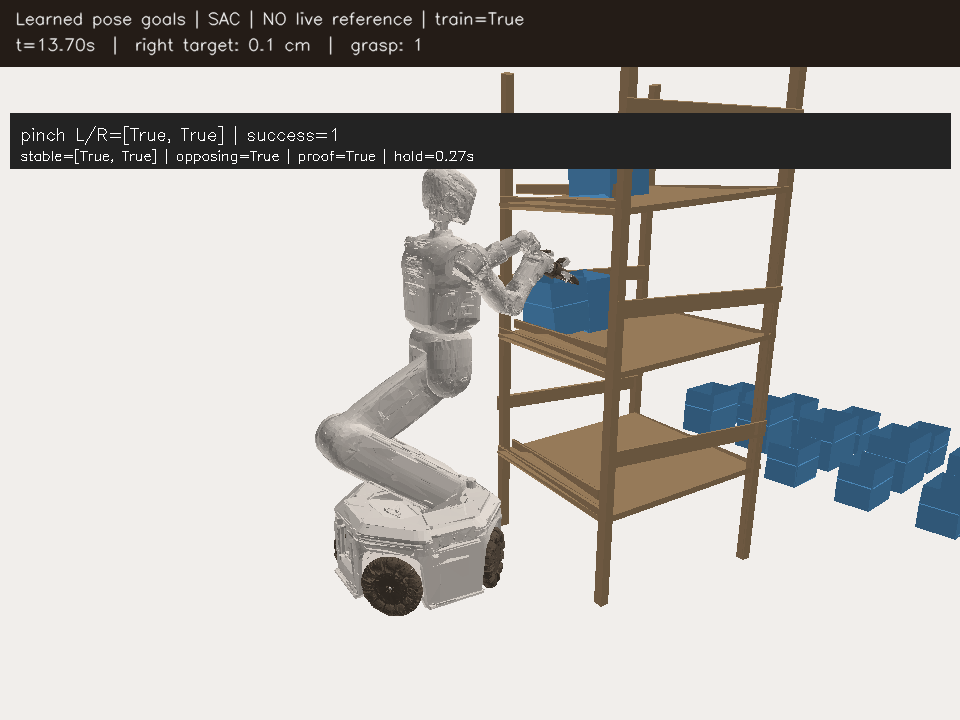
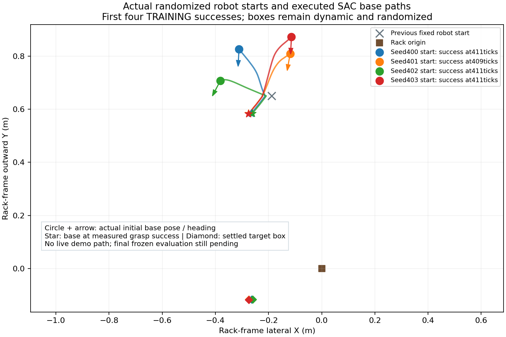
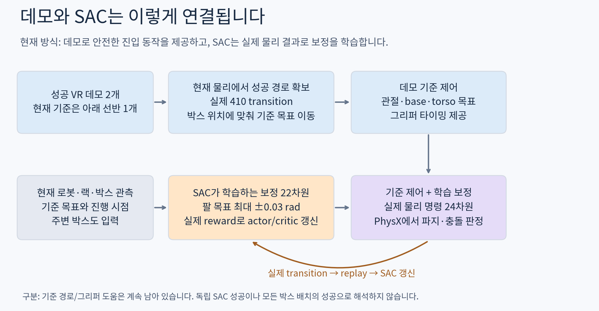
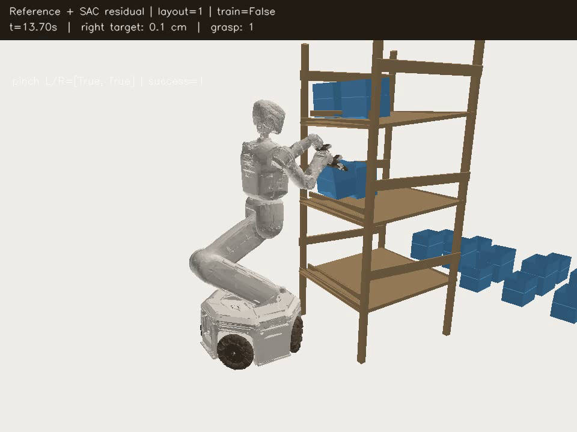
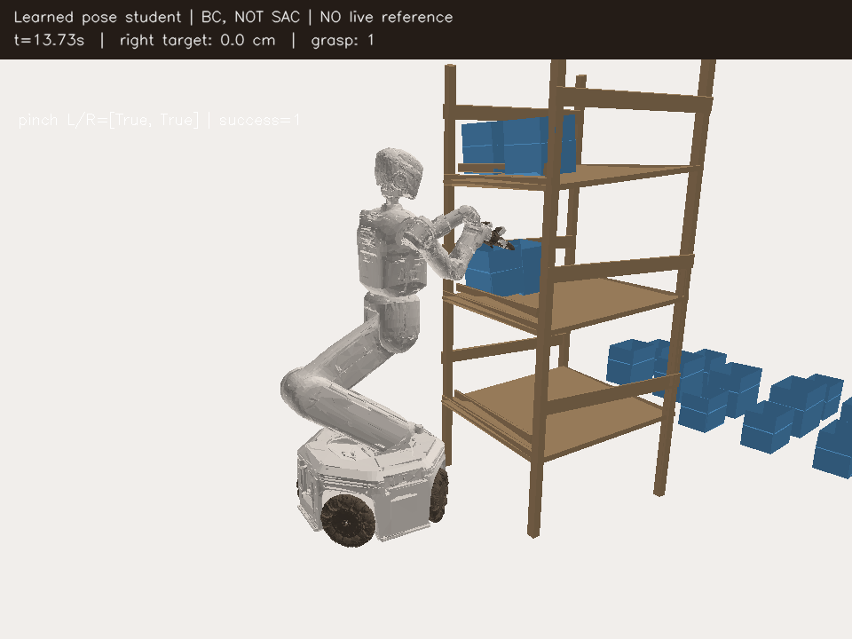
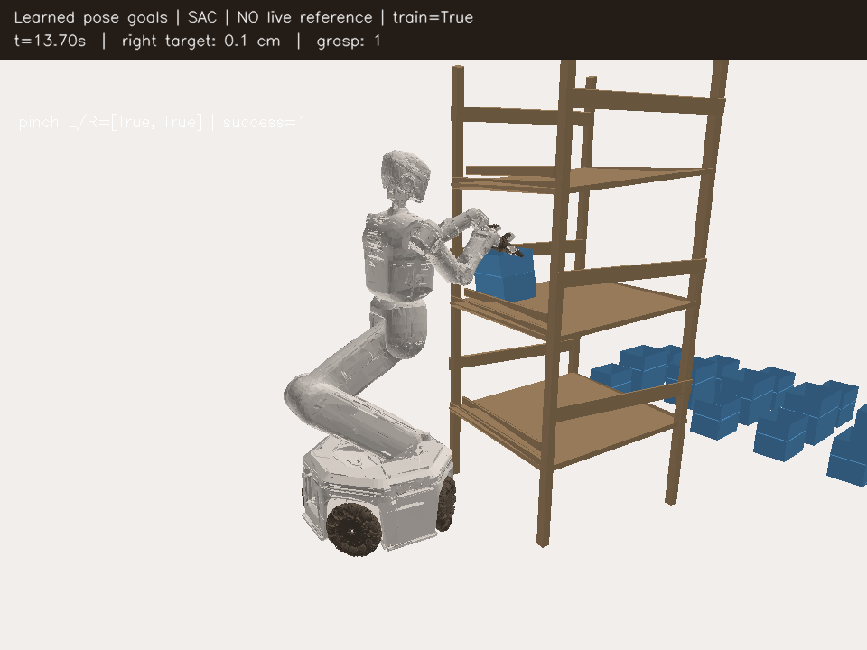

# V2 grasp: 데모 연결과 학습 진행 요약

2026-10-02 22:45 KST: **박스 randomization과 초기 base XY/yaw를 함께 바꾸는
SAC 학습**을 GPU3에서 시작했다. 첫 훈련은411tick(13.7초)에 양손 flap 파지
유지 성공, unsafe/invalid/timeout0이었다. GPU0의 같은 heldout 분포 BC 비교도
첫 실행412tick에 성공했다. 각각 한 번의 결과로 일반화나 SAC의 우월함을 주장하지 않는다.

앞선 탐색 안정화 실행은 종료됐다. 훈련 **10/12 성공·시간 초과2**, 이후 같은
최종 actor12,494/critic12,994를 고정한 별도 평가 **12/12 성공**(408–411tick)이었다.
평가 optimizer·normalizer update0, 전체 안전 위반·invalid0이며24개 실행 모두
checkpoint·영상·로그의 최종 Drive 크기/MD5 검증을 마쳤다. 이 결과는 **동일한
로봇 시작 자세**에서 얻었으므로 초기 base 위치 일반화의 증거가 아니었다.

추가 배치로 학습을 확대한 첫 실행은 **0/3 성공: 시간 초과1, 랙 충돌2**였다.
그 첫 실패 배치를 기존 고정 모델로 재실행하자405tick에 성공했다. 학습과 탐색을
동시에 끈 비교이므로 각각의 원인을 완전히 분리하지는 못했지만, 배치 자체의
성공 가능성과 온라인 정책 악화를 확인했다. 탐색 폭·actor 학습률을 줄이고
데모 보조를 천천히 줄인 GPU3 재학습은 첫 세 배치408/411/404tick 성공 후
위의 훈련10/12·고정 평가12/12로 종료됐다.

기존의 데모 기준 제어+SAC 보정은 평가8/8 성공했지만, 보정0도3/3 성공했다.
현재 모델은 신경망이 목표를 직접 출력한다. BC 대비 SAC의 추가 성능 향상이나
모든 선반·박스 크기·임의 초기 자세 일반화를 입증한 결과는 아직 아니다.

## 박스와 시작 base를 함께 randomize하는 새 실행

- 박스: 아래 선반 small target 안쪽2–4cm, sampled yaw±1°, 주변 박스0–3개.
  박스를 물리에 고정하지 않는다. Spawn 값과 정착 후 실제 pose를 각각 기록한다.
  랙을 따라 정착하며 일부 yaw/depth 변화가 사라질 수 있으므로 이를 일반화로 과장하지 않는다.
- 로봇 시작점: rack-frame 좌우±20cm, 랙 밖으로3–25cm, yaw±15°.
  기존 팔/torso 초기 관절은 유지하지만 **실제 robot root pose를 이동·회전**한다.
  Box/rack world pose가 그 base 이동을 따라 움직이지 않도록 관측을 재표현한다.
- 학습24배치를2번 반복한48회, 최종 고정 모델 평가12회. Train/heldout RNG를
  분리한다. Curriculum·안전 기준·양손 opposing flap 성공 조건은 유지한다.
- GPU3 `base_box_sac_gpu3_20261002_2230`: 실제 replay·optimizer를 이어받은 SAC.
  GPU0 `base_box_bc_gpu0_20261002_2230`: 같은12 heldout의 BC 고정 비교.
  `initial_base_pose_world`와 `reward_term_sums`로 실제 배치와 보상 기여를 감사한다.
- 두 실행 모두 종료 후 Drive 업로드·검증을 하고 다음 배치로 넘어간다.
  현재는 sequential one-env 실험이며80GB VRAM을 채우는 vectorized 실행은 아니다.

[](assets/rl_v2_random_base_box_sac_first_success_20261002_h264.mp4)

[H.264 실제 영상](assets/rl_v2_random_base_box_sac_first_success_20261002_h264.mp4) ·
[배치·초기 world pose·보상·학습 횟수 기록](assets/rl_v2_random_base_box_sac_first_success_20261002.json).
이는 **학습 중 첫 성공**이며 최종 고정 평가가 아니다. 영상은 실제 PhysX 자세의 CPU mesh 표시다.



첫4개 훈련이411/409/411/411tick에 성공했다. 이4회와 BC 비교4회 모두 종료·Drive
검증 완료(23:00 KST 확인). 원본 물리 seed와 실제 초기 pose를 대조하면 요청한
rack-frame XY와 최대0.011mm 차이였고 yaw 오차는0.00002° 이하였다. Rack world
pose는 유지됐다. 그림의 선은 계획 경로가 아니라 매 step 측정한 base 경로다.
[초기 위치 감사 및 실제 종료 기록](assets/rl_v2_random_base_actual_paths_20261002.json).

### 보상 검토: 실험용 SAC 할인율 불일치

접근2·front-stage1의 진행 보상은 potential discount0.999를 사용하지만,
목표 자세 BC 초기화의 SACConfig 기본값0.99가 Q 학습으로 이어지고 있었다.
약410step 뒤의 성공 보상 할인 계수는0.99에서0.016,0.999에서0.664다.
이는 오래 걸리는 진입 동작 학습을 방해할 수 있는 **원인 후보**이며 단독 인과 검증 결과는 아니다.

새 BC→SAC 초기화는 물리 reward contract의 discount를 명시적으로 사용한다.
기존 checkpoint는 조용히 변경하지 않는다. `fork_pose_goal_sac.py`의
`--align-discount-with <same-physical-manifest> --preserve-exploration`으로 별도
실행을 만든다. Actor·탐색·normalizer·실제 replay/reward를 보존하고 critic optimizer만
초기화한 뒤 actor 고정 critic warmup2,000회를 수행한다. 재개할 때 반복 warmup하지 않는다.

GPU0 `base_box_gamma_aligned_gpu0_20261002_2245`는 BC 비교 종료·최종 백업 검증을
기다린 뒤 같은48훈련·12고정 평가를 수행하도록 등록했다. 현재 GPU3 실행은0.99
비교 기준으로 유지한다. 보상 크기나 성공·충돌 조건을 완화하지 않았다.
첫 SAC 성공의 접근 보상 합계1.540, front0.267, one-hand2, bilateral1, success5,
base penalty−0.0061이다. Base 이동 벌점이 접근 이득을 압도하는 상태는 아니었다.

초기 base 관측 변환, 고정 BC 비교, 할인율 migration의 actor/replay 보존·한 번만
critic warmup 수행과 긴 demo clock을 포함한 이번 관련 검사 **37 passed**.
SAC·replay·Drive·배치·영상의 기존 회귀까지 포함한 검사 **126 passed**.
위 선반은 `upper_vr_current_rest_gpu0_20261002_2250`에서 별도 진단을 수행했다.
옛 reference 자세로 끌어당기는 IK rest 항 대신 실제 현재 관절을 rest로 쓰고,
closing-axis·torso 앞쪽4cm·원본 gripper timing을 함께 확인한다. 기존 제어 기본값은
유지하며 이 IK/VR 진단을 SAC 성능으로 기록하지 않는다.
실제 source replay7,192개를 사용하는 할인율 수정판의 CPU preflight도 완료했다.
Critic만2,000 updates 추가한 뒤 actor 모든 tensor가 같고 파라미터가 유한함을
확인했다. 이 preflight는 물리 성공률 평가가 아니다.

위 선반 current-rest 진단은 이후900tick 시간 초과(unsafe/invalid0)로 종료했고
Drive 검증을 마쳤다. 왼손 IK의 도달 범위 projection이 약2.4–3.9cm 남았으므로
rest 항 수정만으로 해결되지 않았다. `upper_vr_base_reach_gpu0_20261002_2310`에서
접촉 handoff 후 실제 base 시작점 기준6cm 전진을 추가한 별도 진단을 시작했다.
첫 pinch가 검출되면 그 위치에서 base 목표를 고정한다. 기존 속도·가속도 제한과
랙10N/장애물5N 종료는 유지한다. `--vr-contact-base-forward-m` 기본값은0이고,
VR/IK 진단에만 사용할 수 있다. 성공 결과를 기다리는 상태이며 SAC 성공으로 기록하지 않는다.

또한 목표 정책의 clock이410step 이후 모두 같은 값이 되는 가정을 제거했다.
`fit_v2_pose_student.py --clock-horizon <actual-success-control-steps>`로 긴
위 선반 동작도 구별할 수 있다. 새 BC와 SAC가 같은 clock horizon을 checkpoint
계약으로 공유한다. 기존 모델은410 기본값과 원래 입력·계약을 그대로 유지한다.
새 BC→SAC의 기본 탐색도 검증된 std0.001/범위0.0001–0.003, actor LR1e-6,
demo fade20,000으로 맞췄다. 기존 SAC checkpoint의 저장된 설정은 바꾸지 않는다.

## 현재 데모 연결: BC 초기화 → 실제 SAC → 고정 평가


1. 두 VR 데모 중 아래 선반 동작을 현재 물리에서 재현한 **실제 성공 전이410개**를 사용한다.
   위 선반 데모는 현재 제어에서 아직 실패하므로 성공 Q 데이터로 넣지 않는다.
2. 그 명령으로 BC20,000 updates를 수행해 초기 목표 정책을 만든다.
3. 정책은 로봇·랙·박스 관측, 경과 시간, 초기 박스 anchor로24개 목표를 출력한다.
   실행 중 데모 경로·명령 배열을 조회하지 않는다. 초기 장면 복원에는 데모를 사용한다.
4. 실제 실행 결과를 SAC replay에 넣는다. 초기 데모 비율20%와 모방 보조항은
   actor updates에 따라 줄인다. 현재 재학습은20,000 updates 동안 줄이는 설정이다.
5. 최종 모델을 고정하고 학습하지 않은 배치에서 평가한다. 고정 평가 데이터는 학습에 넣지 않는다.

[](assets/rl_v2_pose_goal_sac_frozen_success_20261002_h264.mp4)

Actor2,068을 고정한 첫 holdout에서405tick에 성공했다. 실제 PhysX 자세를 CPU
mesh로 표시한 H.264 영상이다. [배치·모델·종료 기록](assets/rl_v2_pose_goal_sac_frozen_success_20261002.json).

## 이전 데모 기준 제어 + SAC 보정의 연결



1. VR 성공 데모2개 중 아래 선반 데모를 현재 S63·Leju·upright torso 제어로
   재현해 실제 성공 transition410개를 확보했다. 위 선반 데모는 현재 제어에서
   아직 성공하지 못했다.
2. 기준 경로의 관절·base·torso 목표를 인식된 박스 위치에 맞춰 변환한다.
   경로와 그리퍼 타이밍은 실행 중에도 제공된다.
3. SAC는 현재 로봇·랙·모든 박스 관측과 기준 목표를 보고22차원 보정을 낸다.
   팔 목표의 최대 보정은±0.03rad이다. 기준 제어와 합쳐 실제24차원 명령을 낸다.
4. 실제 물리 실행의 관측·보상·종료 결과만 replay에 넣어 actor/critic을
   학습한다. 데모의 제안 동작을 가짜 성공 전이로 사용하지 않는다.

데모에서 확보한 실제410개 전이는 zero-residual 초기 데이터다. Actor의
zero-residual 초기화 prior는512 updates 동안 사라지지만 기준 제어는 남는다.
모방 초기화가 끝났다는 것과 데모 경로 의존성이 없다는 것은 다르다.

## 측정 결과

| 실험 | 결과 | 해석 |
| --- | --- | --- |
| 이전 일반24-action SAC actor350 | 파지0, 시간 초과 | 독립 정책은 아직 실패 |
| 데모 기준 경로 재현 | 아래 선반 성공 / 위 선반 실패 | 학습 없이 가능한 기준 동작 점검 |
| 다양한 배치 SAC 훈련8회 | 8/8 성공, actor7,662 updates | 실제 보정 학습 중 결과 |
| 같은 모델의 새 배치 평가8회 | 8/8 성공, 추가 optimizer/normalizer update0 | 해당 제한 분포에서의 고정 모델 성능 |
| 같은 배치에서 SAC 보정0 | 3/3 성공, 각410tick, Drive 검증 완료 | 기준 제어만으로도 해결됨; SAC의 개선 효과 미확인 |
| 상태 기반 절대 목표 BC 첫 모델 | 872tick 시간 초과 | Offline fit과 물리 성공은 다름 |
| 경과 시간 + 초기 박스 상대 목표 BC | 새 배치1/1 성공,412tick, SAC update0 | 실행 중 데모 경로 없는 학습 모델의 물리 성공 |
| BC에서 목표 자세 SAC 연결 | 훈련3/3·고정 평가3/3 성공, actor2,068/critic2,568 | 경로 공급 없는 목표 정책; BC 대비 개선 미확인 |
| 목표 SAC 확대 학습 첫 시도 | 0/3 성공, 시간 초과1·랙 충돌2 | 양손 접촉 유지 실패 후 평균 정책도 악화 |
| 첫 실패 배치의 기존 고정 모델 비교 | 1/1 성공,405tick | 배치 자체는 가능; 탐색·온라인 갱신 영향 |
| 탐색·학습 속도 수정 후 GPU3 재학습 | 훈련10/12·고정 평가12/12 | 동일한 로봇 시작 자세, 최종 actor12,494; 종료·Drive 검증 완료 |
| 초기 base+박스 randomization SAC | 첫 훈련1회 성공,411tick | 48훈련·12고정 평가 진행 중; 일반화 판정 전 |

성공 범위는 작은 박스·아래 선반 같은 구역·안쪽2–4cm 위치 변화·주변 활성
박스0–3개다. 시작 yaw는±1°지만 롤러에서0에 가까워지므로 큰 yaw 일반화로
해석하지 않는다. 보정0에서도 성공한 세 배치 때문에8/8을 SAC의 개선 효과로
해석할 근거는 아직 부족하다. 기준 제어의 성공과 학습의 기여를 별도로 측정한다.

실험: `artifacts/rl/drive_runs/layout_suite_gpu3_20261002_0440/results.json`.
훈련/평가16회에서 관측된 actor updates와 종료 결과, 각 run의 최종 Drive 검증이
기록되어 있다. 임의의 전체 배치에 대한 통계적 보장은 아니다.

## 실제 새 배치 성공 영상

평가 배치1: 안쪽2.86cm 이동, 주변 활성 박스3개. 고정 모델이411tick(13.7초)에
양손 파지 유지에 성공했다. 실제 GPU3 PhysX 자세를 CPU mesh로 표시한다.
우측 대기 영역의 비활성 박스는 학습의 활성 주변 박스와 구분해야 한다.

[](assets/rl_v2_layout_heldout_success_20261002_h264.mp4)

[H.264 영상](assets/rl_v2_layout_heldout_success_20261002_h264.mp4) ·
[실제 배치·종료·고정 모델 기록](assets/rl_v2_layout_heldout_success_20261002.json).

## 진행 중인 확대와 남은 문제

- GPU0: 보정0 비교3/3, BC 새 배치1/1, 목표 자세 SAC 훈련3/3·고정 평가3/3을
  종료하고 Drive 검증을 마쳤다. 확대 학습의 실패 배치300도 기존 actor2,068로
  고정 실행해405tick에 성공했다. 현재 이 진단은 종료했다.
- GPU3: 앞뒤±1cm 확대는4개 성공 후5번째 초기화 footprint 이탈로 중단됐다.
  depth+5.08mm도 정착 후0.0002mm가 돼 앞뒤 일반화의 증거가 아니다.
  안정 분포의 데모 보조 학습은5/6 성공·1회 시간 초과 후 종료·백업 검증했다.
  경로 공급 없는 목표 SAC의 확대 학습은0/3 실패 후 종료·검증했다. 성공 모델
  actor2,068에서 실제 replay1,223개를 그대로 이어 받은 완화 탐색 설정으로
  `pose_goal_low_noise_gpu3_20261002_0830`에서 훈련10/12·고정 평가12/12로 종료했다.
  현재는 상단의 초기 base+박스 randomization 실행으로 이어간다.
  고정 분포는 **안쪽2–3.5cm, 추가 yaw/depth0, 주변 박스0–3개**다.
  원본 데모 초기 자세로24개 배치의2mm footprint margin을 검사했다.
- 위 선반: full-wrist/closing-axis IK, torso 앞쪽4cm, 양손 동시 닫기,
  원본 gripper timing을실제로 점검했다. 각각과 일부 조합이 모두900tick 시간 초과였다.
  초기 flap 상태 등 구 데모에서 복원할 수 없는 상태도 있어 완전한 원본 재생은
  아니다. 좌표계·접촉·관절 제한·시점을 계속 분리해서 확인해야 한다.
- 기준 경로 의존성을 줄이는 독립 정책은 별도로 확인해야 한다. 위 선반도
  실제 성공 데이터를 확보한 후 학습에 연결하며, 실패를 해결되었다고 보지 않는다.

현재 reward, 양손 flap 성공 조건, 랙10N/주변 장애물5N, self-collision 제외와
upright torso는 유지한다. Curriculum을 추가하지 않았다. 이전 데모 보조 실행은
`layout_stable_gpu3_20261002_0720`, 보정0 비교는
`layout_zero_baseline_gpu0_20261002_0617`이다.

## 경로 공급 없는 BC 목표 정책과 SAC 연결

첫 상태 기반 BC 모델은 실제 훈련 성공3,292개 명령을 모방했지만 새 배치에서
시간 초과였다. 낮은 offline loss만으로 물리 성공을 판단하지 않았다. 다음 모델은
관측 입력 가중치를 초기 BC 동안0으로 두고 경과 시간에 따른 목표를 학습했다.
Base 목표 XY는 **초기 인식 박스 위치에 대한 상대값**으로 표현해 새 박스
위치로 이동하도록 했다. 나머지는17개 관절, torso X/Z, base yaw, 양 그리퍼다.
초기 박스 anchor와 현재 로봇 상태를 사용하는 servo는 기존 물리 제어기다.
실행 중 경로 배열·목표 배열·원본 명령을 제공하지 않는다.

현재 물리에서 재현한 아래 선반 성공410개 명령으로 BC20,000 updates를 수행한
모델이 fit에 사용하지 않은 배치에서 **412tick(13.73초)에 양손 held grasp**에
성공했다. Unsafe/invalid/timeout0이며 마지막 실제 pinch는[true,true]였다.
시작 장면 복원에는 데모 초기 자세를 사용한다. 이 성공은 BC이며 SAC update0이다.
시간 기반의 제한된 정책으로, 임의 시작 자세·속도·박스 크기 일반화는 미확인이다.

[](assets/rl_v2_bc_no_live_reference_success_20261002_h264.mp4)

[실제 BC 성공 기록](assets/rl_v2_bc_no_live_reference_success_20261002.json).

SAC 연결은 별도 `pose_goal_sac.py`가 관리한다. Actor441/critic533은 현재 관측,
모든 박스, 경과 시간과 초기 박스 anchor를 포함한다. Action24개는 정규화된
목표 자세 좌표다. 원래 delta-action24개나 residual22개와 Q/replay를 섞지 않는다.
실제410개 전이의 action을 정확한 역변환으로 목표로 바꾸고, decode와 닫힘
gate를 적용해 **실제로 실행했던 명령과1e-5 이내로 일치**해야 Q seed로 허용한다.
현재 reward/terminal 관측과 성공 계약은 기존 검사를 그대로 통과해야 한다.

Critic500회 warmup 후 첫64개 실제 전이를 모으고 SAC actor/critic을 step당2회
갱신한다. 최초 실험은 actor LR2e-6, std cap0.02였다. Entropy backup 제외, Q 정규화와 critic
LayerNorm을 사용한다. 초기 데모 전이20%와 frozen BC 신경망의 actor-only prior는
4,000 actor updates 동안0으로 줄인다. 이 prior는 실행 중 경로를 조회하지 않고
Q의 가짜 전이도 만들지 않는다. 초기 BC에서0이던 관측 가중치도 SAC는 학습한다.

실행 `pose_goal_sac_gpu0_20261002_0735`의 훈련3개는411/407/405tick에
성공했다. Actor는696→1,384→2,068, critic은 최종2,568까지 갱신됐다.
같은 최종 모델과 normalizer를 고정한 별도 평가3개도405/405/404tick에 모두
성공했다. 여섯 실행 모두 unsafe/invalid/timeout0, 최종 Drive 검증 완료다.
실행 중 데모 경로 없이 학습한 정책의 실제 결과지만 BC 대비 우월함을 증명하지 않는다.

### 확대 학습의 실패와 재학습 설정

기존 std cap0.02는 정규화된 절대 목표에 적용된다. 관절별 목표 scale이
약0.3–1.15rad이므로 이전의 작은 delta 명령과 같은0.02가 같은 물리 탐색 폭을
뜻하지 않는다. 첫 실패는 양손 pinch468tick에도 상대 자세 안정 판정이 드물었다.
세 번째는 첫64개 결정적 명령 구간에서38tick에 랙 충돌해 **평균 정책도 악화**됐다.
기존 고정 actor2,068은 첫 실패 배치에서405tick에 성공했다. 큰 탐색과 빠른
온라인 정책 변화가 원인 후보이며, 각각을 분리한 인과 검증은 아직 없다.

| 항목 | 첫 확대 실행 | 현재 GPU3 재학습 |
| --- | ---: | ---: |
| 정책 Gaussian std 하한 | exp(-5) ≈0.00674 | 0.0001 |
| 새 초기 std | 이전 모델 분산 유지 | 0.001 |
| std 상한 | 0.02 | 0.003 |
| Actor 학습률 | 2e-6 | 1e-6 |
| 초기 데모20%·모방 prior fade | 4,000 updates | 20,000 updates |
| 시작점 | actor2,068 | 같은 평균/Q/normalizer, 실제 replay1,223개 보존 |

`fork_pose_goal_sac.py`는 분산 출력만 다시 초기화하고 actor optimizer moments를
비운다. 평균 출력·Q 모델·정규화·목표 decode/좌표·실제 state/action/reward 텐서는
보존한다. 수집 당시 계약도 provenance로 남긴다. 일반 delta SAC checkpoint는
거부한다. 기본 SAC의 기존 std 하한은 그대로이며, 새 하한은 명시한 실행만 적용된다.
첫 세 수정 배치는408/411/404tick 성공·unsafe/invalid/timeout0, actor4,136까지 이어졌다.
수정 전 실패한 같은 세 배치가 모두 성공한 비교 결과다. 전체 고정 평가는 아직 진행 전이다.

```bash
PYTHONPATH=src:scripts/rl python scripts/rl/fork_pose_goal_sac.py \
  --checkpoint /absolute/path/to/proven-goal-sac/checkpoint_00002068.pt \
  --output-dir /absolute/path/to/unique-low-noise-initializer \
  --min-std 0.0001 --initial-std 0.001 --max-std 0.003 \
  --actor-lr 1e-6 --demo-fade-updates 20000
```

뒤의 목표 SAC supervisor 명령에 새 initializer checkpoint를 지정하면 이
저장된 탐색·fade 설정으로 재개한다. 보상·성공·충돌 임계값은 바꾸지 않는다.
새 영상은 양손 pinch와 실제 held-grasp success를 따로 표시하고 상대 자세 안정,
서로 다른 flap, proof lift, hold time 판정을 기록한다. 접촉만 성공으로 표시하지 않는다.

[](assets/rl_v2_pose_goal_sac_training_success_20261002_h264.mp4)

[실제 SAC 성공 기록·학습 횟수](assets/rl_v2_pose_goal_sac_training_success_20261002.json).

Checkpoint512 actor updates 간격과 종료 시 저장, 기존5분 Drive 업로드·검증
후 보존 규칙을 그대로 사용한다. 모든 Isaac 자식에 CUDA_VISIBLE_DEVICES를 지정한다.
첫 goal trial은 업로더가 요구하는 env/agent 메타파일이 없어 종료 후 업로드만
수행했다. 메타파일 저장을 보강했고, 이미 실행 중이던 두 번째 trial에도 실제
계약을 기록해 주기 업로드를 활성화했다. 종료한 첫 trial의 backup은 검증됐다.

```bash
PYTHONPATH=src:scripts/rl python scripts/rl/fit_v2_pose_student.py \
  --native-dataset /absolute/path/to/current_success/executed_transitions.hdf5 \
  --initial-box-relative --clock-only-fit --steps 20000 \
  --output-dir /absolute/path/to/unique-bc-fit

PYTHONPATH=src:scripts/rl CUDA_VISIBLE_DEVICES=0 python scripts/rl/layout_residual_with_drive.py \
  --policy-mode pose-goal --gpu 0 --train-count 3 --eval-count 3 \
  --experiment-dir /absolute/path/to/unique-goal-sac-run \
  --layout-dir /absolute/path/to/preflight-checked-layouts \
  --checkpoint /absolute/path/to/unique-bc-fit/student.pt \
  --demo-dataset examples/demos/v2_grasp_quest_success.hdf5 --episode-index 0 \
  --training-manifest /absolute/path/to/current-v2-run/manifest.json \
  --pose-student-native-seed /absolute/path/to/current_success/executed_transitions.hdf5 \
  --steps 900 --capture-every 30
```

GPU 번호를 변경할 때 CUDA_VISIBLE_DEVICES와 --gpu를 같이 변경한다. 이 경로는
일반 SAC runner에서 불러올 수 없는 별도 action 계약이다. 이전 residual 모드의
기본 실행은 유지된다. Optional `--time-harmonics 16`은 시간이 입력인 모델의
표현력 실험이며 현재 성공 모델은 harmonics0을 사용한다.

## 영상 형식과 보관

새로 올린7개 영상은 mp4v 코덱이었고 그중2개는 application/mp4 타입으로
일반 파일에 등록되어 있었다. H.264(avc1, yuv420p, faststart)·video/mp4로 변환한
복구본을 기존 Notion 기록에 추가했다. 원본 frame 수·FPS·해상도와 전체 decode를
확인했다. 기존 Drive 원본은 유지한다. 이전 첨부의 직접 교체가 거부되어 새 복구
영상과 아래 요약 페이지를 사용한다. 브라우저 재생 자체를 직접 확인한 것은 아니다.

새 물리 재생의 저장은 writer 종료 → H.264 변환 → 전체 decode 검사 → 원자적
파일 교체 → 완료 상태 기록 순서다. 변환 실패 시 원본을 남기고 실험을 실패로
기록한다. CPU만 사용한다. `scripts/rl/browser_video.py`의 CLI로 이미 종료된
영상도 다른 경로에 변환할 수 있다. 닫힌 원격 원본을 덮어쓰지 않는다.

이번 탐색 하한·재개 변경을 포함한 관련 CPU 검사 **103 passed**:
목표↔실제 명령 역변환, 닫힘 gate와 entropy mask 일치, anchor 추가 시 BC
가중치·normalizer 보존, 탐색 fork의 평균/Q/실제 전이 보존, 일반 SAC 계약 거부 및 기존 SAC/replay/Drive/배치/영상 검사다. 영상 코덱·timing 보존·변환 실패 시 원본
보존과 배치 depth/footprint 검사를 포함한다. 실제 성공률은 PhysX 결과로 판단한다.
Drive는 기존 인증으로5분마다 검증 업로드하며 최근2개 checkpoint 및 보호된
검증본을 유지한다. 다른 사용자의 파일·프로세스는 변경하지 않는다.

[읽기 쉬운 Notion 하위 페이지](https://app.notion.com/p/3ec63918d42a81389724c8cc53084726) ·
[자세한 일반화 보고서](RL_V2_LAYOUT_GENERALIZATION_20261002.md) ·
[Drive 보관 규칙](RL_GOOGLE_DRIVE.md).
