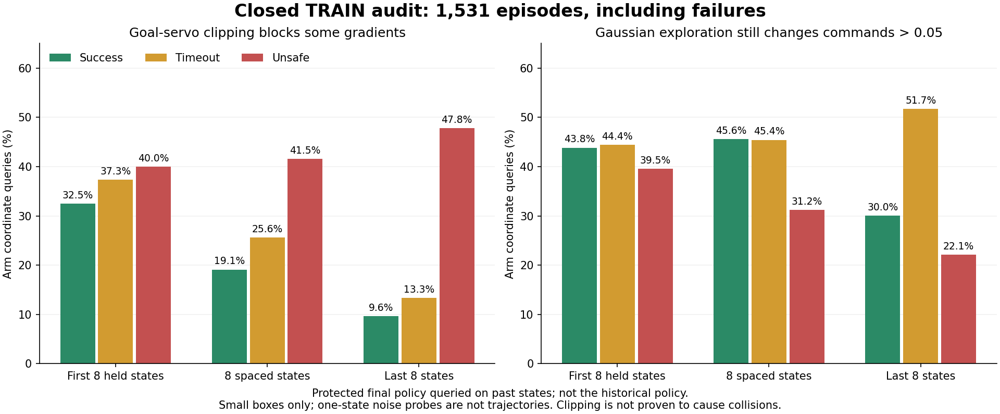

# 실패 궤적에서도 탐색이 실제 명령을 바꾸는가

목표는 박스·base·배경·움직이는 firm flap 무작위화를 유지한 SAC 양손 파지다.
전체 여섯 조합의 완료 개발 평가11→10→7/128회와 중형 성공0은 아직 개선되지
않았다. 이번 분석은 그 목표의 원인 진단이며 새로운 파지 성공 점수가 아니다.

## 확인한 결과

정상 종료한 small 전용 Q 보강 실행의 TRAIN1,536요청을 조사했다. 초기 무효5회를
제외한 **성공215·안전 위반868·시간 초과448, 총1,531개 실제 학습 궤적**을 모두
포함했다. 평가 궤적은 사용하지 않았다. 각 경로의 base 정착 후 첫8행·균등8행·
마지막8행에서 총36,744개 질의를 만들었다. 짧은 경로에서는 창들이 겹칠 수 있어
이 수를 서로 다른 전이 수로 표시하지 않는다.

최종 평가와 정확히 일치하는 보호 모델(actor4,317·Q19,316)의 정책을 과거 측정
상태에 적용했다. 제어기의 clipping으로 현재 정책의 팔 latent→실제 명령 미분이
0인 좌표 비율은 다음과 같다. 표는 팔14개 중 여유가 있는 좌표를 분모로 한다.

| 기록된 경로의 종료 | 첫8행 | 균등8행 | 마지막8행 |
| --- | ---: | ---: | ---: |
| 성공 | 32.5% | 19.1% | 9.6% |
| 시간 초과 | 37.3% | 25.6% | 13.3% |
| 안전 위반 | 40.0% | 41.5% | 47.8% |

실제 autograd와 독립적으로 계산한 goal→servo Jacobian이 일치했다. 그러나
**안전 위반 경로에서 더 많이 잘린다는 사실만으로 clipping이 충돌을 유발했다고
단정할 수 없다.** 충돌이나 기존 정책 이탈의 결과로 목표 오차가 커질 수도 있다.
대부분의 질의에서 모든 팔 좌표의 미분이 동시에 막힌 것은 아니었다.



현재 Gaussian 탐색도 명령을 바꾼다. 마지막 구간에서 명령 변화가 normalized
servo0.05를 넘은 팔 좌표 비율은 성공30.0%·시간 초과51.7%·안전 위반22.1%였다.
20% 탐색 경로에 사용하는 arm bias의 완전한 ramp 크기를 단일 상태에서 질의하면
각각93.3%·90.0%·61.3%가 바뀐다. 이것은 실제 AR1 시퀀스나 전체 수집 행동을
재현한 결과가 아니다. 단순히 무작위성 크기를 더 키워야 한다는 근거로 사용하지 않는다.

## 다음 수정의 판단

“탐색이 전혀 실제 행동에 전달되지 않는다”는 가설은 이 자료와 맞지 않는다.
제어기 clipping을 없애거나 예전에 실패한 physical-action 정책을 같은 이유로
재도입하지 않는다. 실제 속도·토크 제한과 성공·안전 기준을 유지한다.

현재 더 직접적인 증거는 [팔 목표 범위 진단](RL_V2_ARM_TARGET_RANGE_DIAGNOSIS_20261008.md)이다.
기존 데모 범위와 작은 affine 보정은 일부 접근 자세를 제한한다. GPU0에서 원래
전체128요청을 유지한 URDF 범위 진단을 실제 실행하고 있으며, 전체 정상 종료·
접촉·명령·충돌 결과를 확인한 뒤 그 방법을 후속 학습에 사용할지 판단한다.
현재 교사 보정 결과는 SAC 학습이나 Q 입력으로 취급하지 않는다. GPU3의 기존
여섯 조합 학습도 유지하고 다음 전체128평가를 정확한 보존 모델과 비교한다.

## 재현 및 검증 범위

```bash
CUDA_VISIBLE_DEVICES='' OMP_NUM_THREADS=1 PYTHONPATH="$PWD/src" \
  /path/to/conda/env/bin/python scripts/rl/audit_closed_train_servo.py \
  --checkpoint-pointer /absolute/path/to/protected-final-pointer.json \
  --completed-evaluation /absolute/path/to/matching-whole-DEV-proof.json \
  --output /absolute/path/to/diagnostic.json
```

정상 종료한 우리 writer의 closed HDF와 정확한 최종 모델이 있어야 실행한다.
보호 모델 checksum은`18800f50bb1fc79b55915b7a70160344c37b88832a1b32355d3c311531739ead`다.
원본HDF·checkpoint·모델·normalizer 보존과 TRAIN만의 범위를 확인했다.
과거 각 시점의 정책을 복원한 것은 아니며, 과거 실행 명령과 현재 예측의 차이를
역사적 actor drift나 물리 성공의 원인으로 단정하지 않는다.
[전체 구역·종료·창별 질의와 검사](assets/rl_v2_closed_failed_TRAIN_servo_audit_20261008.json).

작은 박스 전용 진단이므로 중형의 feasibility 증거나 전체 여섯 조합의 성능을
대표하지 않는다. 실행 중인 HDF/replay를 읽거나 optimizer를 갱신하지 않았으며
독립FINAL은 아직 미사용이다.
