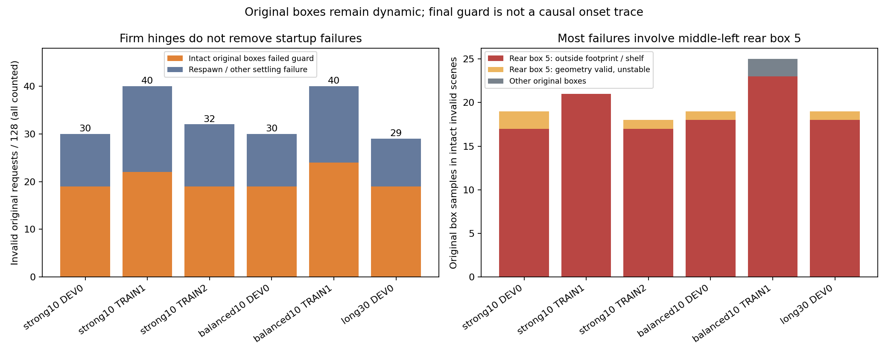
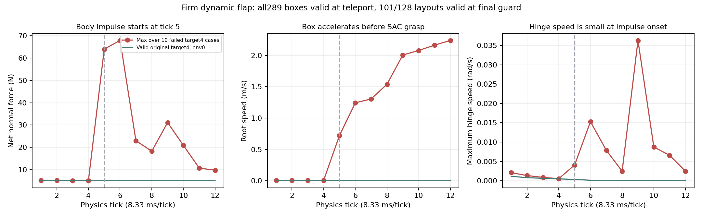
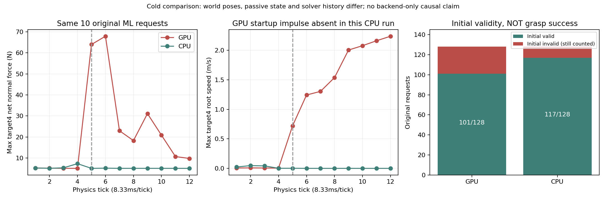
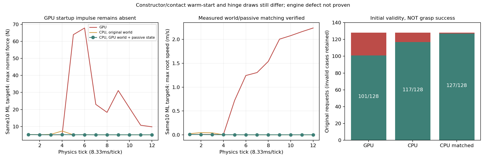
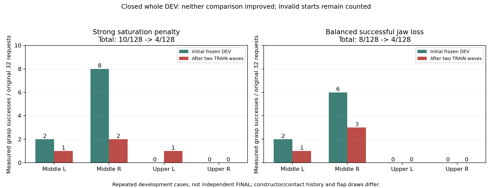
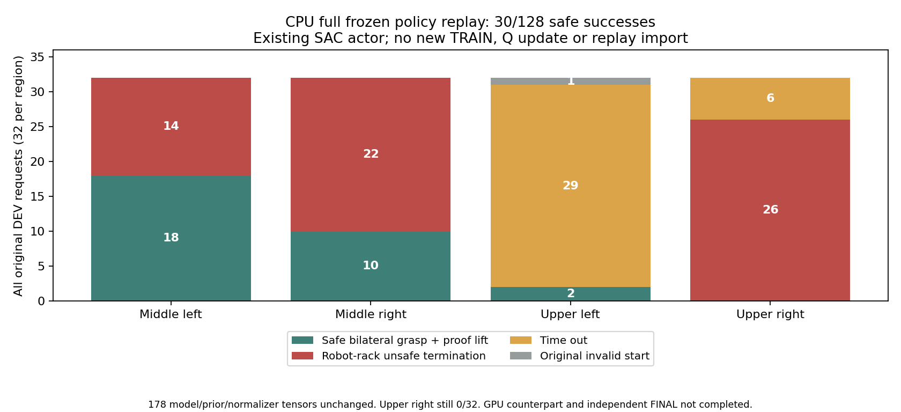

# 단단한 flap 설정과 초기 배치 실패 분리

2026-10-06의 새 actual-flap SAC 실행에는 `firm_dynamic_flap_randomization_v1`을
적용했다. Flap을 고정한 것이 아니라, 리셋마다 각 hinge에 다음 범위를 독립적으로
샘플링한다. 박스/base/주변 박스의 위치 randomization은 유지한다.

| 설정 | 범위 |
|---|---|
| 강성 | 1.5–2.5 N·m/rad |
| 감쇠 | 0.15–0.25 N·m·s/rad |
| 정마찰 계수 | 0.45–0.65 |
| 동마찰 계수 | 0.30–0.40 |
| 초기 hinge 각도 | −1°–+1° |

학습 중 flap 위치를 덮어쓰거나 잠그지 않는다. 현재 GPU3 실행의 실제 PhysX
readback으로 검증된 물성 cache는 [30% joint 탐색 실행 기록](RL_V2_LONGER_JOINT_EXPLORATION_20261006.md)에
있다. Cache의 replacement 값은 원래 실패 박스의 값으로 해석하지 않는다.

## 완료된 여섯 wave에서 확인한 문제

아래 자료는 strong10/balanced10/long30 실행의 **완료된 wave JSON만** 읽었다.
열린 HDF/replay, GPU 상태, 정책/optimizer는 변경하지 않았다. 각 wave는 원래
요청 128개, 네 구역 각32개이며 초기 무효도 성공률 분모에 유지한다.



| 실행과 wave | 초기 무효 / 128 | 재생성되지 않은 무효 환경 | 그 환경의 원래 박스 실패 sample |
|---|---:|---:|---:|
| strong10 DEV0 | 30 | 19 | 19 |
| strong10 TRAIN1 | 40 | 22 | 21 |
| strong10 TRAIN2 | 32 | 19 | 18 |
| balanced10 DEV0 | 30 | 19 | 19 |
| balanced10 TRAIN1 | 40 | 24 | 25 |
| long30 DEV0 | 29 | 19 | 19 |

Sample 수는 환경 수와 다르다. 한 환경에 여러 실패 박스가 있을 수 있고,
최종 한 tick의 sample로 앞선 8-tick 연속 안정화 실패를 모두 설명할 수 없다.
후속 wave는 아직 진행 중이며 표에 포함하지 않았다.

재생성되지 않은 환경은 `invalid_count` 증가0, settling failure 없음, 원래 active
집합 유지, rack relation 오차25mm 이하인 사례로 제한했다. 그 환경에서도 원래
박스의 footprint/assigned-shelf 이탈이나 불안정이 남는다. 121개 sample 중
119개는 **중간왼쪽 맨 뒤 logical5**다. Balanced TRAIN1의 나머지는 logical1/4다.
작은 속도 기준 차이만의 문제는 아니며, 선반 밖/아래로 이동한 박스와 매우 큰
유한 속도도 측정됐다. 모든 sample을 logical5라고 쓰거나 모든 속도 실패가
물리 발산이라고 쓰지 않는다.

[환경 identity·실제 원래 박스·원인 cohort·속도 범위 JSON](assets/rl_v2_firm_flap_initial_guard_audit_20261006.json).
동일 DEV를 반복한 자료이고 여러 박스 sample도 상관되어 있으므로 독립적인
성공률 추정이나 엔진 결함의 인과 증명이 아니다. Parking된 inactive asset의
최종 pose는 원래 실패 궤적으로 사용하지 않았다. 누적 footprint counter도
현재 wave의 증가량으로 사용하지 않았다.

## 다음 물리 확인

10:45 KST에 여유 GPU0에 같은 원래 DEV128, 같은 PGS/동적 firm-flap 물리,
같은 target/base/모든 주변 박스를 유지한 frozen 리셋 진단을 시작했다.
`--reset-failure-diagnostics --no-training --steps 1`로 neutral hold 전/후 및
physics tick별 root/link/contact를 읽고 최초 selected failure를 respawn 전에
보존한다. Actor/Q 업데이트와 TRAIN replay import는 하지 않는다. 파지 성능
평가나 독립 FINAL도 아니다.

실험 이름은 `firm_flap_original_DEV_reset_pgs128_gpu0_20261006_104552`다.
`CUDA_VISIBLE_DEVICES=0` 및 실제 writer UID/명령의 격리를 확인했고 기존 GPU3
세 학습과 다른 사용자 프로세스는 유지했다. 고유 출력은 소유한 private tmpfs에
두어 부족한 SSD 공간에 대용량 replay를 복사하지 않는다. Tmpfs는 재부팅 시
사라지므로 기존 Drive 관리자에 300초 검증 업로드/최근2개 유지/닫힌 로그와
진단 JSON의 최종 검증을 연결했다. 시작 설정만으로 업로드 완료를 주장하지 않는다.

과거 nominal-flap 진단의 [롤러/접촉/배치 순서 대조](RL_V2_PHYSICAL_BODY_SAC.md)는
초기 불안정의 원인을 아직 확정하지 못했다. 이번 firm-flap의 실제 pre-respawn
결과를 비교하기 전에는 롤러 감쇠, 높이, 박스 제거, 안정화 기준 완화를 기본
학습에 적용하지 않는다. Firm flap 자체로 이 초기 실패가 해결됐거나 네 구역
양손 파지가 일반화됐다고 판단하지 않는다.

## 완료된 firm-flap 원래 DEV128 리셋 진단

위 GPU0 진단은 정상 exit0으로 종료했다. Writer 종료·supervisor MainPID0·닫힌
로그/HDF/diagnostic JSON의 기존 Drive 최종 크기/MD5 검증을 확인했다.
원래 요청128개 중101개 초기 유효·27개 무효이며 무효도 분모에 남긴다.
**파지 성공률을 측정한 결과가 아니다.**

Teleport 직후289개 원래 active 박스 모두 footprint/assigned-shelf 검사에
통과했고 root velocity는0, 실제 hinge 각도 최대0.999474°였다. 60physics tick
(0.5초)의 중립 유지 후에는 target logical4의9개와 주변 logical5의19개가
assigned geometry를 벗어났다. 최초 selected failure10개를 respawn 전에
기록했으며 모두 중간왼쪽 geometry 이탈이다. Timeout/invalid quaternion은
첫 실패 원인이 아니었다.



실패10개 target4의 최대 body normal force는 tick4의5.11N에서 tick5의63.96N으로,
root speed는0.00426m/s에서0.720m/s로 증가했다. 같은 tick5의 최대 flap joint
speed는0.00408rad/s다. 따라서 큰 flap 움직임이 처음 측정된 실패 원인이었다고
해석하지 않는다. 이 값들은 여러 환경의 각 지표별 최대이고 동일 한 박스의
모든 최대값이라고 주장하지 않는다. Sensor는 net normal force이며 상대 collider/
tangential friction은 이번 진단에서 측정하지 않았다.

[닫힌 실제 trace·respawn 전 원래 실패·검증 경계](assets/rl_v2_firm_flap_reset_onset_20261006.json).
과거 nominal 진단과 최초 실패 ML 환경 row10개가 같고 초기 충격 시작도 tick5다.
그러나 world pose/constructor/contact solver 이력은 일치시키지 않은 cold 비교다.
초기 유효100→101/128을 성능 향상으로 주장하지 않는다. 단단한 hinge가 초기
angle 범위를 지킨 것은 확인했으나 기존 startup impulse는 해소하지 못했다.

## CPU PhysX를 분리하는 다음 진단 옵션

관리자에 `--physics-device cpu`를 추가했다. 기본 학습은 기존 `cuda:0`를 유지한다.
CPU 선택은 명시적인 `--no-training --reset-failure-diagnostics --steps 1` 및
DEV wave에서만 허용한다. TRAIN·독립 FINAL·일반900-step 평가·암묵적인 frozen
호출은 폴더 생성 전에 거부한다. Kit renderer와 `CUDA_VISIBLE_DEVICES`는 기존
`--gpu` 격리를 유지한다. CPU 데이터를 matching TRAIN/Q로 사용하지 않는다.

```bash
python scripts/rl/batched_staged_goal_with_drive.py \
  --experiment-dir /absolute/path/to/new-unique-cpu-reset-run \
  --gpu 0 --physics-device cpu \
  --checkpoint /absolute/path/to/verified-actual-flap-checkpoint.pt \
  --training-manifest /absolute/path/to/matching-training_manifest.json \
  --waves-json /absolute/path/to/original-DEV-waves.json \
  --waypoints /absolute/path/to/staged-waypoints.json \
  --demo-dataset /absolute/path/to/quest-success.hdf5 \
  --native-seed /absolute/path/to/closed-middle-TRAIN-transitions.hdf5 \
  --native-seed /absolute/path/to/closed-upper-TRAIN-transitions.hdf5 \
  --no-training --reset-failure-diagnostics --steps 1
```

같은 요청 배치의 다른 solver backend를 확인하는 원인 분리용이다. Constructor/
contact history를 bitwise로 맞춘 대조가 아니며, CPU에서 안정해져도 GPU 엔진
결함이나 특정 contact 경로를 곧바로 확정하지 않는다. 결과 전 기본 GPU3 학습
물리·randomization·안전/성공 기준은 변경하지 않는다.

## CPU 원래 DEV128 완료, 월드/롤러 상태를 맞춘 비교 시작

CPU PhysX 진단도 정상 exit0·writer 종료·supervisor MainPID0·닫힌 로그/HDF/
diagnostic JSON의 기존 Drive 최종 크기/MD5 검증을 완료했다. 원래128개 중
초기 유효117·무효11이다. 파지 동작/학습은 없고 초기 유효를 성공률로 사용하지 않는다.



GPU에서 처음 실패한 같은 ML10개 요청을 CPU trace에서 읽으면 tick5 최대
Body normal force는5.105N/root speed0.00247m/s였다. GPU의63.96N/0.720m/s
충격이 이번 CPU 실행에서는 재현되지 않았다. CPU의 첫 selected failure는4개로
중간오른쪽2개·상단오른쪽2개의 shelf geometry 이탈이며, neutral hold 후 원래
박스의 최대 root speed는0.445m/s였다. 남은 무효도 원래 분모에 유지한다.

그러나 실제 초기 rack world 위치는 두 실행에서 최대21.18cm, support root는
22.41cm, 회전은29.73° 달랐다. Passive q/v와 flap 추첨값, constructor/contact
history도 맞추지 않았다. 같은 rack-relative box/base 요청을 사용했어도 **backend
한 요소만 바꾼 대조가 아니다.** Engine 결함이나 CPU 학습의 우월성을 확정하지 않는다.
[좌표·passive 상태 차이·원래 실패·tick trace·저장 검증 JSON](assets/rl_v2_firm_flap_CPU_GPU_reset_comparison_20261006.json).

11:20 KST에 `firm_flap_CPU_matched_GPU_world_reset128_renderer_gpu0_20261006_112005`를
새 고유 폴더로 시작했다. 같은 원래128개 배치에서 **GPU 진단의 초기** origin,
rack/세 support root pose, 실제182-DOF support q/v를 명시적으로 요청한다.
최종 respawn 이후 pose를 초기 reference로 쓰지 않았다. 기존
`--reset-world-frame-probe`의 strict seed/joint-order/실제 backend readback 검사를
사용하며 적용이 확인되지 않으면 비교를 거부한다. Constructor/contact history와
flap 추첨까지 bitwise로 맞추는 것은 아니다. 아래에서 완료 결과를 구분한다.

## 월드 좌표·롤러 상태를 맞춘 CPU128 완료

위 matched CPU 진단은 정상 exit0으로 종료했고 writer 종료·supervisor MainPID0·
닫힌 로그/HDF/diagnostic JSON의 기존 Drive 최종 크기/MD5 검증을 완료했다.
원래 요청128개 중 **초기 유효127·무효1**이다. 289개 원래 active 박스는 모두
중립 유지 직전 geometry 검사에 통과하고 root velocity가0이었다. Neutral hold
후 geometry 이탈은 logical9 한 개이며 최대 root speed는0.270m/s였다.
파지 동작이나 TRAIN/Q 업데이트는 없으므로 **127/128은 파지 성공률이 아니다.**



요청값뿐 아니라 **전체 wave 복원 후 실제 backend readback**을 원래 GPU의
중립 유지 전 snapshot과 별도로 비교했다. Rack root 위치 차이는 최대3.82µm,
세 support root 위치 차이는0이고 정규화 quaternion은 반올림 오차 내에서
일치했다. 모든 support의 joint position/velocity도 정확히 일치했다.
같은 GPU 실패 ML10개 요청의 CPU tick5 최대 normal force는5.137N,
root speed는0.00116m/s로, GPU의63.96N/0.720m/s 충격이 재현되지 않았다.

Constructor/contact warm-start와 flap 추첨은 bitwise로 맞추지 않았다.
따라서 GPU 엔진 결함을 확정하지 않는다. 초기 좌표·롤러 q/v 차이만으로
앞선 CPU 결과를 설명할 수 없다는 단서이며 물리 처리/초기화 경로를 더
좁히기 위한 자료다. 남은 UL 원래 env34/logical9 실패도 분모에 유지한다.
[실제 root·passive readback·원래 실패·접촉 trace·최종 백업 검증](assets/rl_v2_firm_flap_matched_CPU_reset_20261006.json).

이 CPU 옵션은 frozen DEV 리셋 진단 전용이며 기존 GPU3 학습의 물리 backend를
바꾸지 않는다. 전체 정책 평가나 CPU 물리 기반 학습을 추가한다면 명시적인
데이터/물리 계약과 독립적인 TRAIN 배치를 사용해야 한다. GPU의 기존 Q/replay를
CPU 학습에 그대로 가져오거나 이 DEV의 월드 상태를 TRAIN으로 사용하지 않는다.

## 전체 파지 동작을 비교하는 frozen backend 평가

초기 유효127/128이 실제 파지에 도움이 되는지는 별도 동작 평가가 필요하다.
`--frozen-physics-backend-eval`을 추가해 CPU/GPU에서 같은 정책을 최대900 control
step 재생할 수 있게 했다. 명시적인 `--no-training`, **한 원래 DEV128 wave·각
구역32개·중복 없는 seed·원래 주변 배치**만 허용한다. TRAIN·독립 FINAL·부분
배치·다른 solver/drive/background/waypoint 진단과의 혼합은 시작 전에 거부한다.
기존 기본 GPU 학습과 CPU 리셋-only 경로는 유지한다.

```bash
python scripts/rl/batched_staged_goal_with_drive.py \
  --experiment-dir /absolute/path/to/new-unique-frozen-backend-eval \
  --gpu 0 --physics-device cpu \
  --checkpoint /absolute/path/to/verified-actual-flap-checkpoint.pt \
  --training-manifest /absolute/path/to/matching-training_manifest.json \
  --waves-json /absolute/path/to/original-DEV128-waves.json \
  --waypoints /absolute/path/to/staged-waypoints.json \
  --demo-dataset /absolute/path/to/quest-success.hdf5 \
  --native-seed /absolute/path/to/closed-middle-TRAIN-transitions.hdf5 \
  --native-seed /absolute/path/to/closed-upper-TRAIN-transitions.hdf5 \
  --no-training --steps 900 --frozen-physics-backend-eval \
  --reset-failure-diagnostics \
  --reset-world-frame-probe /absolute/path/to/measured-GPU-initial-world-and-passive-state.json
```

World-frame override는 이 명시적인 frozen 평가에서만 추가로 허용하고 원래
seed 순서·root·joint 순서·backend readback 검사를 유지한다. Flap/box/base/주변
randomization, 동일 양손 contact/stable/proof-lift 성공과10N rack/5N obstacle
안전 기준은 유지한다. 물리 backend와 constructor/contact 이력은 동일하지 않다.
GPU 엔진 결함을 확정하는 실험이나 독립 FINAL 성능 증명으로 해석하지 않는다.

HDF collection source는 `frozen_physics_backend_policy_eval_NOT_matching_Q_replay`로
표시한다. Matching TRAIN seed importer는 이를 거부한다. 평가 전후 actor/Q
update 수·replay 크기뿐 아니라 learned network, normalizer 및 frozen BC/goal/
body-anchor actor의 실제 tensor가 bit-identical인지 확인한다. 초기 무효도 원래
128개 분모에 유지하고 성공·unsafe 원인·거리·pad 품질은 닫힌 metrics에 기록한다.
이 옵션으로 CPU 학습이나 GPU Q/replay의 CPU 재개를 허용하지 않는다.

## 동일 정책 CPU/GPU 파지 비교 실행 및 balanced 학습 종료

11:54 KST에 CPU·11:56 KST에 GPU frozen 평가를 각각 고유 private RAM 폴더로
시작했다. 원래 DEV128·각 구역32·source actor1204/Q6864 checkpoint·요청된
GPU 초기 world/support q/v가 같다. 두 실제 writer는 `CUDA_VISIBLE_DEVICES=0`,
Kit renderer GPU0이며 학습과 replay 추가는 꺼져 있다. CPU는 실제 초기
유효127/128로 control step61까지 재생했고 actor/Q1204/6864·replay0·새 온라인
TRAIN0을 확인했다. **전체 파지 결과는 아직 미확인**이다. GPU도 실제 writer가
실행 중이다. Constructor/contact 이력과 flap 추첨은 bitwise로 맞추지 않았다.

GPU3의 balanced jaw 비교는 예정된4wave를 정상 종료했다. 같은 전체 원래
DEV의 성공은8→4/128이며 영역별 ML2→1, MR6→3, UL0→0, UR0→0이다.
최종 unsafe84 중 robot–rack68건이며 peak body는 오른손 gripper base37·
왼손14·오른쪽 forearm8건 등이다. 초기 무효30→32개도 분모에 유지했다.
균형화가 파지 일반화를 개선했다고 판단하지 않는다.



[Balanced 전체 배치·영역·안전 원인 JSON](assets/rl_v2_balanced_jaw_recovery_final_DEV_20261006.json).
Balanced의 원래 supervisor는 닫힌 대용량 자료를 최종 업로드 중이며 검증 완료로
표시하지 않는다. 앞선 strong 실행은 최종 Drive 검증과 supervisor MainPID0을
추가로 확인했다. GPU3의30% joint 탐색 장기 실행은 실제 TRAIN을 계속한다.
새 CPU/GPU 두 실행은 학습 작업으로 세지 않으며 독립 FINAL도 사용하지 않았다.

두 새 실행의 **전체 wave 복원 후 중립 유지 전 실제 readback**도 대조했다.
원래 GPU reference와 rack/세 support root의 위치 오차10µm 이하·unit quaternion
dot1−1e−5 이상, 모든 support joint position/velocity 오차0을 확인했다.
같은 원래289개 active 박스는 처음 모두 geometry 유효·root speed0이었으나,
settling 뒤 초기 유효는 CPU127/128·GPU96/128이었다. Source actor/Q1204/6864,
replay0·새 온라인 TRAIN0 및 실제 두 writer의 소유/명령/CUDA0 격리를 확인했다.
초기 유효를 파지 성공으로 해석하지 않는다. Constructor/contact 이력과 flap
추첨은 여전히 일치시키지 않았으며 GPU 엔진 결함을 확정하지 않는다.
[이번 전체 평가의 실제 초기 상태 적용 검증](assets/rl_v2_frozen_backend_pair_initial_readback_20261006.json).

## CPU 전체 동결 정책 평가 완료: 실제 안전 파지30/128

같은 기존 SAC actor를 CPU PhysX에서 끝까지 재생한 원래 DEV128이 정상 exit0으로
종료했다. 초기 무효1개도 분모에 유지했으며128개 모두 종료 결과가 있다.
실제 양손 서로 다른 flap 파지·접촉/안정 유지·proof lift 성공은30개(23.4%)다.

| 영역 | 원래 요청 | 안전 파지 성공 | Robot–rack 종료 | Timeout | 초기 무효 |
| --- | ---: | ---: | ---: | ---: | ---: |
| 중간 왼쪽 | 32 | 18 | 14 | 0 | 0 |
| 중간 오른쪽 | 32 | 10 | 22 | 0 | 0 |
| 위쪽 왼쪽 | 32 | 2 | 0 | 29 | 1 |
| 위쪽 오른쪽 | 32 | 0 | 26 | 6 | 0 |
| 합계 | 128 | 30 | 62 | 35 | 1 |



[닫힌 전체 결과·성공별 실제 판정·시작 상태 범위](assets/rl_v2_CPU_frozen_full_DEV_grasp_20261006.json).
성공한 원래 base 시작 위치는 lateral−19.9~+20.0cm, outward3.3~24.5cm,
yaw−14.9~+14.6°에 걸친다. 각 시작점에서 staged controller로 후보 위치에
이동한 뒤 base를 유지했다. SAC가 base 이동 자체를 학습했다는 결과는 아니다.

Actor1204/Q6864·새 온라인 TRAIN0·replay0을 유지했고, learned/prior network와
normalizer의178개 tensor가 평가 전후 bit-identical이었다. 이는 새 CPU 학습
성과가 아니라 **기존 정책의 물리 실행 결과**다. 같은 GPU 전체 counterpart는
아직 재생 중이다. Constructor/contact 이력과 flap 추첨은 bitwise로 일치시키지
않았으므로 엔진 결함이나 backend만의 인과 효과를 확정하지 않는다.

위쪽 왼쪽은29건 timeout, 위쪽 오른쪽은26건 rack 충돌이다. 전체 rack62건의
peak body는 오른손 gripper base35·오른쪽 forearm23·왼쪽 forearm4건이다.
네 영역의 일반화와 독립 FINAL 검증은 아직 달성하지 않았다. 이 DEV 자료를
TRAIN으로 재사용하지 않으며, CPU 학습을 새로 시작한다면 바뀐 물리 조건에
맞는 새 Q/replay가 필요하다. 원래 CPU supervisor의 닫힌 자료 최종 Drive
크기/MD5 검증과 종료(MainPID0)를 추가로 확인했다. GPU3 장기 SAC는 계속한다.

## CPU/GPU 전체 비교 종료 및 새 CPU 물리 학습 연결

GPU counterpart도 정상 exit0으로 종료했다. 동일한 기존 actor의 전체 원래
DEV128 성공은 **CPU30/128·GPU4/128**이다. GPU 영역별 성공은ML1·MR3·UL0·UR0,
초기 무효32·unsafe73·timeout19·numerical0이다. 각 실행에서178개 network/
normalizer tensor는 bit-identical이었다. 두 실행의 actual 초기 rack/support
root·roller q/v는 검증했지만 constructor/contact 이력과 flap 추첨은 동일하지
않으므로 backend만의 인과 효과를 확정하지 않는다. 독립 FINAL도 사용하지 않았다.


[전체 비교 JSON](assets/rl_v2_frozen_backend_whole_pair_20261006.json).
CPU 최종 Drive 검증은 완료됐고 GPU 원래 supervisor는 닫힌 자료를 업로드 중이다.

새 학습 경로는 `CPU_PhysX_v1`을 strict physics contract에 기록한다.
`--cpu-physics-training --training --physics-device cpu --learner-device cuda:0`을
명시해야 하며 원래128개·각 구역32·900steps·fresh TRAIN/동일 DEV만 허용한다.
다른 physics/배치 probe·DEV world snapshot 재사용·독립 FINAL은 거부한다.
기존 GPU Q/replay를 CPU 계약으로 resume하는 것도 거부한다.

`scripts/rl/prepare_cpu_staged_actor.py`는 실제 flap actor와 frozen controller만
초기화하고 Q·critic normalizer·replay·성공 bank·네 optimizer를 새로 만든다.
실제 준비에서 source actor/normalizer9개 tensor의 bit-identity·actor/Q update0·
replay0·success bank0·critic normalizer count0·optimizer state0을 확인했다.
[초기화 검증](assets/rl_v2_CPU_PhysX_fresh_actor_20261006.json).
기존 GPU native 경로는 frozen actor prior를 복원하는 용도로만 쓰며 새 CPU Q
학습 데이터가 아니다. CPU DEV30건도 TRAIN으로 가져오지 않는다.

CPU 환경의 관측·현재 held waypoint/anchor를 GPU learner로 옮기고 명령을 CPU로
돌려 실제 실행한다. 다음 관측은 numerical quarantine 이후 같은 env ID·clocks·
waypoint에 맞춰 옮긴다. Q의 action은 실제 projected goal이며 scene 기록은 실제
executed command를 그대로 저장한다. 기존 동일 장치 경로도 유지한다.
CPU 단위 검증과 `CUDA_VISIBLE_DEVICES=3`에서 CPU↔GPU 두 전송 검증을 통과했다.
실제 새 물리 학습 성과는 별도 실행의 완료된 TRAIN/DEV로 판단한다.

## Strong SAC의 학습 후 전체 DEV는 개선되지 않음

Strong saturation penalty 비교는 예정된4wave를 정상 exit0으로 마쳤다.
Actor1964/Q9902/새 온라인 TRAIN92,243행이며, 같은 원래128개 DEV의 성공은
초기10→학습 후4였다. 영역별로 ML2→1, MR8→2, UL0→1, UR0→0이다.
상단왼쪽 한 건의 실제 성공은 있었지만 전체 성능 개선은 아니다.

학습 후 unsafe81개 중 robot–rack66건이다. Rack peak body는 오른손 gripper
base29·왼손12·좌우 forearm 각10건 등이며 원인 mask는 서로 겹칠 수 있다.
[전체 원래 분모·지역·안전 원인·학습 카운터](assets/rl_v2_strong_jaw_recovery_final_DEV_20261006.json).
원래 supervisor가 종료된 대용량 데이터의 최종 Drive 업로드를 계속하며,
이 기록 시점에는 아직 최종 검증 완료로 표시하지 않았다. Balanced 및30% joint
탐색 장기 GPU3 학습은 유지하고 초기화 진단과 정책 개선 판정을 구분한다.
