# V2 grasp SAC: 중간·위 선반의 좌우 네 구역 (2026-10-04)

양손이 서로 다른 flap을 파지하는 기존 성공 조건과 동적 박스를 유지한다.
Rack10N/주변 장애물5N, self-collision off, S63/Leju twofinger,
upright torso XZ와 중력보상 설정은 그대로다. Curriculum을 추가하지 않는다.
실제 초기 base XY/yaw가 다른 배치에서 성공을 반복 확인하는 것이 목표다.

> **16:15 판정 정정:** 이전 성공 수치는 당시 bare shelf 기준의 simulator flag다.
> 롤러 지지 높이10mm를 제외하지 않아 일부 lift를 과대 판정했다.
> 아래 과거 기록을 새 성공률로 재해석하지 않는다. 맨 아래 정정/새 실행을 참고한다.

## 완료된 기존 방식 비교

아래 수치는 각 실행의 마지막 **학습 없는 고정 정책 평가**다. 개발 평가로
회귀한 actor를 복구한 실행도 포함하므로, 모두 마지막 업데이트 정책의 개선이라고
해석하지 않는다. 기존 두 물리 성공 seed와 아래 모든 목표는 **왼쪽**이었다.

| 실행 | 실제 SAC 훈련 성공 | 독립 final 성공 | Final 안전 위반 | 한계 |
|---|---:|---:|---:|---|
| GPU3 중간 왼쪽 guarded |48/48|10/12|0|0.40m torso/legacy goal 좌표, 다른 분기와 Q 혼용 금지 |
| GPU2 중간·위 왼쪽 mixed guarded |5/16|7/8|0|Actor 복구2회; 중간4/4·위3/4 |
| GPU1 BC 제약 없는 지연 actor |2/4|1/2|0|위 선반 시간초과; actor 복구1회 |
| GPU0 기존 BC guard 유지 대조 |1/4|1/2|0|Actor 복구1회 |
| GPU0 imitation 해제·radius 유지 |0/4|1/2|0|Actor 복구1회 |
| GPU0 imitation·radius 모두 해제 |0/4|1/2|1|훈련 안전 위반4/4; actor 복구1회 |

각 실행은 종료 후 로그·체크포인트의 Drive 업로드 검증을 마쳤다.


그림의 [실측 결과와 각 final 배치](assets/rl_v2_final_sac_comparisons_20261004.json)를
별도로 보관한다. .40m legacy와 .46m mixed의 서로 다른 계약도 표시했다.
기존 혼합 정책의7/8은 오른쪽 일반화나 BC 없이 안정적인 SAC 개선의 증거가 아니다.
BC 제약 없는 SAC는 초기 개발2/2에서도 훈련 후 성능을 유지하지 못했다.
기존 혼합 정책의 성공을 먼저 네 구역으로 확장하고, 전체 base 제어로 개선이
유지되지 않으면 [구역별 base 정렬·정지/유지 후 파지](RL_V2_SAC_RECOVERY_20261003.md)로 전환한다.

## 실제 오른쪽 배치를 만드는 reset 옵션

`GraspLayout`에 다음 JSON 옵션을 추가했다. 기존 JSON은 기존 변환과 직렬화를 유지한다.

```json
{
  "seed": 12100,
  "split": "train",
  "lateral_m": -0.025,
  "distractors": [5, 9],
  "target_region": "shelf_2_right",
  "align_initial_base_to_region": true,
  "base_lateral_m": 0.12,
  "base_outward_m": 0.16,
  "base_yaw_rad": 0.10
}
```

- `target_region`: `shelf_2_left/right` 또는 `shelf_3_left/right`.
  같은 선반의 반대편으로만 바꾸며 박스 종류·크기·깊이 셀·높이·자세를 유지한다.
  실제 Rack USD의 비대칭 중심 X를 기준으로 박스 위치를 옮긴다.
  Source target4→right target1, upper target9→right target6으로 logical ID,
  region token, selected one-hot, active mask와 물리 asset pool을 일치시킨다.
- Regional recipe의 `lateral_m=-0.02..-0.04`는 두 구역 모두 중앙 방향2..4cm로
  적용한다. 기존 recipe는 원래 signed rack-X 변위 그대로다.
- `align_initial_base_to_region=true`: source의 **초기** 로봇을 구역 변경과 같은
  거리만큼 평행 이동한 초기 template을 쓰고, 그 위에 실제 XY/yaw randomization을
  적용한다. 성공 순간의 팔·그리퍼·접촉 상태를 가져오지 않는다. 이 옵션은
  base가 멀리서 구역까지 이동한 성공을 뜻하지 않으며, 그 범위는 별도 평가가 필요하다.
- `false`이면 구역 변경만으로 base가 이동하지 않는다. 명시한 random offset만 적용한다.
- Active box footprint는 settling 전에도 모두 검사하고 이후 PhysX shelf/region guard를
  그대로 실행한다. Target과 같은 distractor ID나 선반을 바꾸는 remap은 거부한다.

이 기능은 새 **초기 상태 설명**이다. 과거 데모·reward·action·transition을 반사하거나
새 성공 데이터로 취급하지 않는다. 실제 rollout에서 관측한 transition만 SAC replay에 넣는다.

## 배치 생성과 학습

환경은 `env_isaaclab_232`다. 이 helper는 GPU나 Isaac runtime을 쓰지 않는다.
이미 존재하는 폴더는 덮어쓰지 않으므로 실험마다 고유 경로를 지정한다.

```bash
CUDA_VISIBLE_DEVICES='' PYTHONPATH=src:scripts/rl \
  python scripts/rl/prepare_region_grasp_layouts.py \
  --output-dir /absolute/path/to/unique-region-layouts \
  --seed-origin 12000 --train-per-region 4 \
  --development-per-region 1 --eval-per-region 4
```

네 구역이 순서대로 균형 있게 배치된다. Train/development/final seed namespace는
서로 겹치지 않으며, reset source episode는 `reference_episode_map.json`에 기록한다.
중간: base X±20cm, outward3..25cm, yaw±15°.
위: base X±8cm, outward3..10cm, yaw±5°, box depth±6mm.
박스 inward2..4cm/yaw±1°와 주변 박스 샘플링은 유지한다.
현재 작은 박스 검증이며 중간 선반 medium 박스 일반화는 아직 확인하지 않았다.

`layout_residual_with_drive.py --policy-mode pose-goal --gpu 3`에 생성 폴더와
`--reference-episode-map`을 전달한다. Frozen SAC 평가에도
`--pose-student-native-seed`로 **matching physical contract의 실제 성공 seed**를
명시해야 한다. 해당 audit 인자가 없으면 이제 Isaac 실행 전에 거부한다.

개발 성능은 reset episode(선반)뿐 아니라 `target_region`별로 검사한다.
오른쪽 성공 증가가 왼쪽 실패 증가를 가리는 경우도 actor 복구 대상으로 처리한다.
복구는 최신 실제 TRAIN replay/Q/업데이트 횟수를 유지하며 actor만 되돌린다.
Final holdout에는 optimizer update가 없고 해당 데이터를 다음 학습 seed로 쓰지 않는다.

기존 Drive 연결로5분마다 업로드하고 체크섬 검증된 오래된 체크포인트만 정리한다.
최근2개와 최근 검증된2개를 보호하고, writers가 끝난 뒤 로그도 업로드·검증한다.
[Drive 저장·인증·보존 조건](RL_GOOGLE_DRIVE.md)을 따른다.

## 현재 실행과 결과 해석

10/04 06:28부터 GPU3에서 기존 혼합 guarded 정책의 네 구역 frozen 비교를 진행한다.
부모 실행 폴더는
`artifacts/rl/drive_runs/four_region_frozen_sac_gpu3_20261004_062812`다.
초기 시도는 필수 native seed audit 인자 누락으로 정책 실행 전에 종료했고
실패 로그의 최종 업로드를 검증한 뒤 새 고유 폴더로 재실행했다.
이전 실패를 파지 실패나 optimizer update로 집계하지 않는다.

이어질 SAC 준비 모델은 mixed final checkpoint16910의 네트워크·Q·normalizer·실제
TRAIN replay·탐색 분포를 유지하고 actor LR1e−7·critic4회당 actor1회로 분기한다.
BC neural anchor weight10/radius0.05를 유지하므로 BC 제약 없는 실행은 아니다.
Demo replay fade는 critic 진행량에 연결해 actor 지연 때문에 사용 기간이 늘어나지 않는다.
등록 당시 오른쪽 파지 성공이나 네 구역 최종 성공률은 확인 전이었다.
이후의 실제 결과는 아래 시각별 기록을 따른다.

준비 모델·실제 replay의 Drive 체크섬 검증 후 새 관리 서비스도 시작했다.
부모는 `artifacts/rl/drive_runs/four_region_guarded_sac_gpu3_20261004_063608`이며,
등록 당시 frozen 평가와 최종 백업이 종료될 때까지 GPU 자식을 만들지 않았다.
이후 같은 GPU3에서 train16배치×3pass=48회, 개발4회×13block=52회,
새 independent final16회, 총116회를 순서대로 수행한다.
개발 배치와 final 배치는 서로 분리했다. 종료 시간을 성공 보장으로 표현하지 않는다.
코드 검사35개와 요청한36개 배치의 초기 footprint 검사만 통과한 상태에서 등록했다.

### 첫 실제 오른쪽 파지 확인 (06:43)

Frozen baseline의 중간 왼쪽 seed17000과 오른쪽 seed17100은 각각409tick 성공,
안전 위반0·invalid reset0이었다. 이 두 배치에는 optimizer update가 없으며
학습 seed로 쓰지 않는다. 위 좌우는 아직 평가 중이고 네 구역 전체 성공률은 미확정이다.

오른쪽의 실제 마지막 판정은 서로 다른 flap[0,1], 양손 pinch/stable=True,
proof lift=True, rack clearance0.0312m, hold0.267s였다.
[배치·실제 초기 상태·성공 판정·모델·물리 계약](assets/rl_v2_middle_right_frozen_success_20261004.json)을
기록했고, 실행 종료·영상·로그의 Drive 검증을 마쳤다.


[중간 오른쪽 성공 영상(H264 MP4)](assets/rl_v2_middle_right_frozen_success_20261004.mp4).
H264/avc1·yuv420p·faststart와 전체 decode 검증을 통과한 원본을 복사했다.
Notion 요약 하위페이지에도 외부 링크가 아닌 native video/image로 업로드했다.
이 결과는 기존 mixed 정책의 첫 오른쪽 배치 성공이며 새로운 오른쪽 SAC 업데이트가
성능을 높였다는 증거나 네 구역 일반화의 완료로 표현하지 않는다.

### 네 구역 frozen baseline 종료와 실제 SAC 업데이트 (07:43)

Baseline4/4와 종료 로그·영상·데이터의 Drive 검증을 마쳤다.

| 새 baseline 구역 | 실제 종료 step | 성공 | 실패 |
|---|---:|---:|---|
| 중간 왼쪽 |409|1|없음 |
| 중간 오른쪽 |409|1|없음 |
| 위 왼쪽 |893|0|시간초과 |
| 위 오른쪽 |900|0|시간초과 |

전체2/4·안전 위반0·invalid reset0이다. 상단은 일반화가 아직 부족하다.
위 왼쪽의 전체 경로에는 어느 손도 opposing pinch가 성립한 step이 없다.
왼손은 한 jaw에 최대24.66N, 오른손은 한 jaw에7.66N이 측정됐지만
각 반대 jaw는 전 경로에서0N이었다. 마지막에는 모든 jaw 힘이0N이었고
손–flap 표면 거리는5.33cm/1.80cm였다. 이 거리만으로 파지라고 판단하지 않는다.
Robot–rack 힘은 경로 전체0N으로, 이 실패는 충돌 종료가 아니다.


[상단 실패 영상(H264 MP4)](assets/rl_v2_upper_left_frozen_timeout_20261004.mp4)과
[전체 jaw별 peak·실제 마지막 상태·원본 경로](assets/rl_v2_upper_left_frozen_timeout_20261004.json)를 보관한다.
접근 중 한쪽 jaw가 눌린 뒤 박스 자세가 변했는데 양쪽에서 끼워 잡지 못하는
문제가 관측됐다. 시간 기반 prior를 따라가는 팔 목표가 이런 동적 상태 변화에
충분히 적응하지 못할 가능성이 있다. 이 해석을 중력보상 결함이나 입증된
단일 원인으로 단정하지 않는다. Root drive에도 현재 whole-body gravity
force/couple 보상과 attitude PD가 존재하는 것을 코드에서 확인했다.

GPU3 본 실행은 baseline 검증 후 현재 네 구역의 초기 개발 평가를 시작했다.
별도로 GPU0의 여유를 확인해 실제 SAC 업데이트 진단6회를 시작했다.
부모는 `artifacts/rl/drive_runs/four_region_actual_sac_diagnostic_gpu0_20261004_070118`이다.
이 진단은 TRAIN 중간 오른쪽12103·위 왼쪽12201을 쓰고 새 final27000..27300을
분리한다. 본 학습의 final14000..14303과 겹치지 않고 모델도 자동으로 교체하지 않는다.
첫 TRAIN 오른쪽은409tick 성공·unsafe0이며 **actor173회·critic692회**를 실제로
갱신했다(actor16910→17083, critic17410→18102). 실제 새 online409행을 기록했다.
이어질 상단 훈련과 훈련 후 frozen 평가로 성공 유지·개선을 판단한다.

07:57 현재 GPU0 진단의 두 TRAIN은1/2(중간 오른쪽 성공, 위 왼쪽 시간초과)이다.
Actor16910→17498로588회, critic은2,352회 추가 업데이트했다.
훈련 후 새 frozen4배치는 중간 왼쪽603tick robot–rack22.60N 충돌 실패,
중간 오른쪽409tick 성공, 위 왼쪽900tick 시간초과, 위 오른쪽589tick 성공으로
2/4·안전 위반1이며 실행 종료와 Drive 검증을 마쳤다.
이 비교는 baseline과 seed가 다르므로 바로 업데이트 회귀라고 단정하지 않는다.
진단 종료·백업 후 같은 seed27000을 업데이트 전 checkpoint16910으로 평가하도록
별도 GPU0 서비스를 등록했고07:52 실제 평가를 시작했다.
본 학습의 final 배치를 학습에 쓰지 않는다.
GPU3은 초기 개발 네 구역2/4·unsafe0를 마치고 실제48회 TRAIN 단계에 진입했다.
첫 중간 왼쪽12000·오른쪽12100 TRAIN 모두409tick 성공으로2/2·unsafe0이며
actor16910→17256으로346회 업데이트했다. 상단 TRAIN과 업데이트 후 개발 평가는
아직 남았으므로 이 첫 성공으로 SAC 일반화 개선을 선언하지 않는다.
본 실행의 개발 회귀 검사·actor 복구·Drive 백업은 그대로 유지한다.

Notion 요약 페이지에도 상단 실패 영상/사진을 native 업로드로 첨부하고
위 baseline과 실제 SAC 진단을 분리해 기록했다. 서버 실험 서비스는 실행 중이다.
채팅 native 목표 상태는 아직 `blocked`이고 제공된 도구에는 재개 기능이 없다.
자동 채팅 후속 점검이 복구됐다고 주장하지 않으며, 목표를 완료로 처리하지 않는다.

### 같은 초기 상태에서 SAC 회귀를 분리하고 base 분리 대안을 시험 (08:17)

새 final seed27000을 actor16910과17498로 각각 optimizer 없이 실행했다.
로봇·랙·모든 박스·drive/action controller의 초기 기록과 첫 actor/critic 관측 차이는
모두0이다. 업데이트 전에는409tick 성공·rack0N, 후에는603tick에
왼팔 `zarm_l4_link`–rack22.60N 충돌로 실패했다. 탐색 없이도 평균 동작이
회귀한 사례다. 안전 위반의 나머지 원인은 모두False였다.


[업데이트 전 성공 영상](assets/rl_v2_four_region_matched_before_20261004.mp4),
[업데이트 후 실패 영상](assets/rl_v2_four_region_matched_after_20261004.mp4),
[초기 일치·성공·충돌·영상 인코딩 원자료](assets/rl_v2_four_region_matched_regression_20261004.json).
H264/avc1·yuv420p·faststart·전체 decode 검증 영상이며 실제 PhysX pose의 CPU mesh 재생이다.

같은 실제 성공 경로409행에 대한 **모델 출력 진단**에서는 목표 차이가
관절 최대0.0344rad·torso0.86mm·base XY1.60mm였다. 업데이트 후 Q는
이 경로의93.9% 상태에서 실패한 새 정책의 행동을 더 높게 예측했지만
평균 예측 차이는0.00422에 불과했다. 이를 실제 정책 return이나 개선으로
간주하지 않는다. 관절 목표 오차17차원의 국소 피드백 진단에서도 projected
최대 singular gain0.642·spectral radius0.125여서 명확한 자기증폭을 찾지 못했다.
이는 일부 TRAIN 관측의 국소 검사이며 전체 폐루프 안정성 증명이 아니다.
가상 transition이나 새 reward/Q row를 만들지 않았다.

위 오른쪽 seed27300은 업데이트 전592tick·후589tick으로 **모두 성공**했다.
따라서 훈련 후 상단 오른쪽 성공 자체로 새 일반화 능력을 획득했다고 주장하지 않는다.
GPU3 첫 네 TRAIN은 중간 좌우 성공·위 좌우 시간초과로2/4·unsafe0이다.
다음 개발 평가가 진행 중이며 구역별 회귀 검사·actor 복구를 유지한다.

대안은 `--staged-base-waypoints /absolute/path/to/templates.json`로 켜는
**frozen 물리 진단**으로 구현했다. 기본 기존 제어는 그대로다.

1. 성공 TRAIN에서 측정한 base–초기 box XY 차이와 rack 상대 yaw를 작업 위치
   **후보**로 사용한다. 좌우는 실제 선택 박스의 위치를 사용하며 로봇 자세를 반사하지 않는다.
2. 서로 다른 실제 초기 base XY/yaw에서 중립 팔·torso를 유지하고 열린 gripper로
   작업 위치까지 움직인다. 초기 성공 팔 자세를 넣거나 box를 고정하지 않는다.
3. XY오차8mm/yaw오차0.02rad, 실제 선속도0.01m/s·각속도0.025rad/s 미만이
   15 control step 연속 유지되면 frozen 파지 정책의 clock을0부터 시작한다.
4. 파지 중 base XY/yaw 목표를 계속 유지한다. 이동 중 충돌·정지 실패·전체30초
   시간초과도 동일한 task 실패다. 성공/충돌/보상/중력보상 조건은 변경하지 않는다.

이 옵션은 optimizer training과 같이 사용할 수 없다. Manifest/영상에
`frozen_neural_grasp_with_analytic_base_staging_NOT_new_staged_SAC`를 기록하고
새 collection source를 기존 goal replay importer에서 거부한다. 새 staged SAC는
phase/held waypoint/실행 목표가 포함된 계약과 그 제어에서 수집한 실제 경험으로
구현해야 하며, 지금 진단을 새 SAC 학습 성공으로 표현하지 않는다.
기존 upper/middle seed와 같은 small box만 허용하며 미측정 크기는 거부한다.

GPU0 새 진단 부모:
`artifacts/rl/drive_runs/staged_base_four_region_frozen_gpu0_20261004_081335`.
새 네 구역37000/37100/37200/37300으로 수행하며, 같은 checkpoint와 같은 배치에서
기존 whole-body 제어를 비교하는 부모
`artifacts/rl/drive_runs/whole_body_matched_staging_control_gpu0_20261004_081505`도
진단/백업 종료 후 이어 실행하도록 등록했다. 본 GPU3 학습은 유지한다.
첫 중간 왼쪽은88step에 실제 정지 확인 후 파지 단계에 진입했다.
아직 진단의 파지 결과는 없다. 관련22개 CPU 검사와 parser 문법 검사만 통과했다.

직접 사용할 때는 기존 frozen `replay_v2_grasp_reference.py`의 demo/manifest,
matching checkpoint/native seed/layout 인자에 아래를 추가한다. 공개 후보 JSON은
물리 travel `.06m` 및 small box에만 대응한다.

```bash
--staged-base-waypoints /absolute/path/to/HumanoidScene/docs/assets/rl_v2_staged_base_hold_candidates_20261004.json
```

Drive 관리자 `layout_residual_with_drive.py`에서도 `--evaluation-only`로 같은
인자를 전달할 수 있다. 기본 `CUDA_VISIBLE_DEVICES=<physical GPU>`를 지정하고
`--gpu`도 같은 번호로 맞춘다. 예전 whole-body replay/model을 staged SAC로
재개할 수 있다는 의미는 아니다.

### Base 분리 진단의 첫 실제 성공 (08:25)

첫 새 중간 왼쪽 seed37000은 **497tick 성공·rack0N·unsafe0**으로 종료됐고
영상·실제 데이터·로그의 Drive 검증까지 마쳤다.88step에 중립 팔 접근과15step
정지 조건을 통과한 뒤 파지 clock을0부터 실행했다. 마지막에는 서로 다른
flap[0,1], 양손 pinch/stable, proof lift, clearance3.91cm·hold0.267s였다.
초기 base offset은 X−6.69cm/out14.03cm/yaw−4.23°이며 박스 inward3.47cm/
yaw−0.53°·주변 박스를 유지했다. Base는 실제 초기 상태에서 움직였고
파지 중 위치 오차는 마지막0.044mm였다. 성공 팔 상태로 시작한 것이 아니다.


[실제 base 접근·정지·파지 영상](assets/rl_v2_staged_base_first_success_20261004.mp4),
[초기 상태·구역·후보·정지 조건·성공 판정](assets/rl_v2_staged_base_first_success_20261004.json).
Actor16910에 추가 optimizer update가 없었으므로 **base 제어 분리 + frozen
파지 정책의 물리 성공**이다. 새 staged SAC가 학습해 성공한 결과도 전체 네 구역
일반화도 아니다. 오른쪽·상단과 같은 배치의 기존 제어 비교는 계속 진행 중이다.

### Base 분리 완료 결과와 상단 안전 진입 진단 (09:00)

네 구역 base 분리 frozen 진단은 종료됐고 모든 실제 데이터/영상/로그의
Drive 검증을 마쳤다. **2/4 성공·안전 위반0**이며 상단은 아직 해결되지 않았다.

| 새 독립 배치 | 실제 결과 | 종료 control step |
|---|---|---:|
| 중간 왼쪽37000 | 양손 opposing flap 파지·proof lift 성공 | 497 |
| 중간 오른쪽37100 | 양손 opposing flap 파지·proof lift 성공 | 496 |
| 상단 왼쪽37200 | 시간초과 | 853 |
| 상단 오른쪽37300 | 시간초과 | 854 |

GPU0의 같은 배치/같은 actor16910 기존 whole-body 비교는08:50부터 이어
실행 중이다. 이 결과가 나오기 전 base 분리가 기존보다 좋다고 판단하지 않는다.
GPU3 본 SAC는 첫 TRAIN4개2/4·unsafe0, 같은 개발 네 구역 재평가2/4·unsafe0이며
초기 개발 결과와 같았다. 두 번째 TRAIN block을 진행 중이다.

상단을 위해 `StagedContactIKDiagnostic`과
`scripts/rl/staged_contact_with_drive.py`를 추가했다. 이 코드는 **물리 진단용
teacher이며 SAC actor 학습이나 standalone policy 성공으로 취급하지 않는다.**
성공한 현재 물리 TRAIN의 손–flap offset/회전만 보정 목표의 근거로 사용한다.
검증되지 않은 이전 VR reward나 가상 correction label을 Q에 넣지 않는다.

- 기본 `near-contact`: 기존 frozen 팔 접근에서 양손 목표 오차가 모두10cm
  미만이면 접촉 IK로 넘긴다. 이 조건에 도달하지 않으면 보정이 실행되지 않는다.
- `after-base-hold`: 실제 base 정지 확인 직후 열린 손으로 랙 앞 진입 위치를
  먼저 맞추고 접근·접촉을 수행한다. 먼 손을 바로 flap에 삽입하지 않는다.
- 공통: 실제 URDF/USD FK·TCP/Jacobian/관절 한계 일치를 확인한 bounded
  IK servo를 사용한다. 접촉 중 중립 rest로 당기지 않도록 실제 관절 자세를
  rest로 유지하고 base waypoint는 기존 staged 제어가 계속 유지한다.
- 양손 위치 오차15mm와 닫힘 축 오차0.15rad를 모두 만족해야 coordinated
  close를 제안한다. 이미 실제 pinch가 성립한 손은 닫힘을 유지한다.
  서로 다른 flap의 실제 opposing pinch3tick 확인 뒤 실제 TCP 기준25mm lift를
  제안한다. 이 마지막 확인은 privileged teacher 정보이며 actor 관측에 추가하지 않는다.
- Reward/성공/종료/접촉 센서는 변경하지 않는다. 실패도 그대로 실패로 기록한다.
  해당 collection source는 기존 goal-SAC replay에서 거부한다.

분리한 새 TRAIN45200 배치에서 기본 보정은08:46 시작했고, 안전 진입부터
보정하는 비교는08:58 시작했다. 기존 네 구역 final37000..37300을 보정 데이터로
사용하지 않는다. 결과는 아직 나오지 않았다.
실제 native 성공 데이터의 URDF FK 검사에서 상단 bilateral pinch 자세의
shoulder–TCP 길이는 팔 길이의 왼손94.48%/오른손93.62%였다.
현재 gross reach bound95%에 가깝지만 이 진단만으로 reach 제한이 실패의
원인이라고 단정하거나 한계를 변경하지 않았다. 중력보상이나 TCP offset이
없다는 가정도 사용하지 않는다. 두 기능은 기존 제어에 이미 연결되어 있다.

```bash
CUDA_VISIBLE_DEVICES=0 python scripts/rl/staged_contact_with_drive.py \
  --gpu 0 --experiment-dir /absolute/path/to/unique-contact-diagnostic \
  --checkpoint /absolute/path/to/matching-frozen-goal-checkpoint.pt \
  --layout-json /absolute/path/to/separate-train-layout.json \
  --waypoints /absolute/path/to/HumanoidScene/docs/assets/rl_v2_staged_base_hold_candidates_20261004.json \
  --demo-dataset /absolute/path/to/native-reset-demo.hdf5 \
  --training-manifest /absolute/path/to/matching-physical-manifest.json \
  --native-seed /absolute/path/to/measured-middle-train-success.hdf5 \
  --native-seed /absolute/path/to/measured-upper-train-success.hdf5 \
  --episode-index 1 --contact-mode after-base-hold
```

Conda `env_isaaclab_232`의 Python/Isaac 환경을 사용한다. 별도 인증을 만들지 않고
기존 remote를 발견해 공용 Drive 감독자/5분 checksum 검증과 최근2개 보존을
재사용한다. 종료 후 쓰기가 멈춘 실제 HDF5·영상·로그도 업로드/검증한다.
접촉/정지 handoff 및 기존 replay 거부를 포함한 관련 CPU 검사25개를 통과했다.
이 검사는 학습 일반화 성공률을 뜻하지 않는다. 새 staged SAC에는 다른
phase/waypoint/action 계약과 그 제어로 실행한 실제 TRAIN 경험이 필요하다.

### 별도 21-goal SAC를 연결하고 첫 실제 새 Q 학습 확인 (10:05)

같은 배치/actor16910 whole-body 비교도 종료·Drive 검증을 마쳤다.
결과는3/4 성공·unsafe0으로, 중간 좌우409step 성공/위 왼쪽853step 시간초과/
위 오른쪽590step 성공이었다. Base 분리 frozen의2/4보다 이 작은 대조에서
좋았다. **Base 분리만으로 개선됐다는 주장은 하지 않는다.** 새 staged SAC는
그 제어에서 남은 목표를 실제로 다시 학습하는 비교이며 최종 우세는 확인 전이다.

이제 [새 staged SAC의 계약과 실행법](RL_V2_STAGED_GOAL_SAC.md)을 구현했다.
Base XY/yaw 3개 목표를 제거한 21개 목표, actor480/critic539, 실제 held-phase
관측/행동/보상만 사용하는 새 replay와 critic이다. 기존 24-action Q/replay를
가져오지 않고 frozen neural actor로 초기 팔·torso·gripper 평균만 초기화했다.
기존 base 분리 frozen 진단과 live contact IK teacher는 새 SAC 성공으로 집계하지 않는다.

GPU0 pipeline 첫 실제 TRAIN55000(중간 왼쪽)은 **486step 성공·unsafe0**이다.
실제 base 접근/정지77step 뒤 파지409step을 기록했다. 새 critic은692회
갱신됐고, actor는 initial critic warmup2,048회 중이라 **0회**다.
저장된 actual held replay409행·유한 Q loss0.00393·checkpoint692와 닫힌
HDF5/영상/로그의 Drive 검증을 확인했다. 따라서 파이프라인의 실제 학습과
초기 제어 성공을 확인했지만, 새 actor 업데이트의 개선 결과는 아직 아니다.
이 GPU0 비교는 TRAIN4개 + 본 실험과 겹치지 않는 frozen final4개를 수행한다.

GPU3에서는 두 독립 staged SAC 비교를 등록/실행했다.

| 비교 | Gripper prior 제한 | 초반 gripper logit | TRAIN/개발/final |
|---|---|---|---|
| 기본 21-goal | 팔·torso와 함께 normalized radius 안 | 기존 그대로 |32/36/8 |
| Free-jaw 21-goal | gripper만 radius 해제; 먼 손 닫기 차단은 유지 | 기존 logit×0.005 |32/36/8 |

TRAIN과 개발 배치는 같은 조건으로 비교하며 각 실행의 final namespace는 분리했다.
Free-jaw 초기 정책은 현재 물리 native TRAIN1,004행에서 팔·torso19개 평균
차이0, 양손 열림/닫힘 부호 결정 차이0을 확인했다. Jaw 출력 크기는 바뀌며
binary controller의 닫힘 힘을 낮춘 것이 아니다. 새 Q loss/gradient와 실제 결과는
각 실행의 `staged_goal_sac`에 기록한다. Old frozen actor16910은 새 학습량이 아니다.
기본 GPU3 초기 개발 중간 왼쪽56000은509step 성공·unsafe0이고 나머지는 진행 중이다.

부모 실행 폴더:

- GPU0 pipeline: `artifacts/rl/drive_runs/staged_goal21_pipeline_sac_gpu0_20261004_093220`.
- GPU3 기본: `artifacts/rl/drive_runs/staged_goal21_four_region_sac_gpu3_20261004_092413`.
- GPU3 free-jaw: `artifacts/rl/drive_runs/staged_goal21_free_jaws_sac_gpu3_20261004_094614`.

각 관리자 서비스는 5분 Drive 체크섬 검증/최근2개 보존과 종료 후 actual experience,
HDF5/영상/로그 검증을 사용한다. 첫 GPU0 pipeline 초기 시도는 final namespace 중복을
발견해 실제 rollout 전에 **우리 main supervisor만** 종료 신호로 정리했다.
그때 0-frame 영상 인코딩이 실패한 로그도 검증/보존했으며, writer 종료 후 frame0이면
인코딩을 건너뛰도록 고쳤다. 해당 시도는 learner 성능 실패로 집계하지 않는다.
새 관측/제어 계약·실제 replay 저장/재개·actor 지연·jaw 독립 탐색·개발 복구를
포함한 CPU 검사79개가 통과했다. 이후 위치/속도 teacher bound 검사1개도 통과했다.

### 상단 IK 실패를 운동학과 실제 제어로 분리 (10:05)

별도 TRAIN45200에서 near-contact 보정은704step에 robot–rack28.28N 충돌했다.
양손10cm handoff 조건을 충족하지 못해 IK가 실제 활성화되지 않았다.
After-base-hold full-wrist 보정은68step 실제 base 정지 직후 활성화했지만
850step 시간초과·rack0N·양손 qualified pinch0으로 끝났다. 실제 front-stage
목표 오차는 마지막33.94/34.87cm, full-wrist 오차3.119/3.130rad였다.


[실제 상단 진입 실패 영상(H264 MP4)](assets/rl_v2_staged_front_IK_diagnostic_20261004.mp4),
[실제 종료 결과·FK 일치·별도 CPU 운동학 가설](assets/rl_v2_staged_front_IK_diagnostic_20261004.json).
영상은 실제 PhysX pose의 CPU mesh 재생이며 RTX 화면 캡처가 아니다.
H264/avc1·yuv420p·faststart·전체 decode를 검증했다.

동일한 실패 frame의 관절 자세/목표에 대해 URDF FK와 실제 TCP가0.7/0.94µm
이내로 일치했다. CPU static bounded IK에서 full-wrist는11.5/11.9cm 오차를
남겼고 **closing-axis만 맞추면 두 손 위치 오차가 수치상0까지 수렴**했다.
이는 운동학 가설이고 물리 성공이나 새 SAC 데이터가 아니다. 실제 gross target
projection은0으로, 이 배치의 진입 정체를95% reach bound로 단정하지 않는다.
Torso actual X/Z는 native 성공과 수 cm 이내였고 중력보상·TCP offset은 이미 있다.

Closing-axis 물리 비교도850step 시간초과·unsafe0으로 끝났고 진입 phase0에
머물렀다. 마지막 front-stage 오차35.02/33.12cm, gross projection0이었다.
제어 코드에서 VR IK는 position/velocity target을 함께 쓰지만 diagnostic IK를
기존 joint-delta action으로 바꿀 때 **position target만 전달**한 차이를 확인했다.
이 차이의 영향을 시험하도록 `--contact-velocity-feedforward` 옵션과 실제
관절 속도/IK 속도/encoded target tracking error를 기록하는 진단을 추가했다.
실행한 position step과 같은 방향·같거나 낮은 속도로 제한하며 기존 goal-SAC
제어에는 적용하지 않는다. 이전 진단의 종료/Drive 검증을 기다리는 GPU0
후속 서비스를10:02 등록했다. 아직 이 변경의 성공 결과는 없다.
이 teacher는 privileged pinch로 lift를 확인하며 standalone SAC 또는 새 Q seed가 아니다.

### Frozen 네 개발 배치 성공과 실제 SAC 회귀 (10:59)

새 staged21 초기 actor는 개발56000/56100/56200/56300에서 각각
509/489/645/657step에 **4/4 양손 opposing flap 파지·실제 proof lift 성공**했다.
네 배치는 동적 box,
주변 box, 실제 초기 base XY/yaw 차이를 유지하며 live VR/IK 없이 실행했다.
이는 새 staged actor update0인 **초기 frozen 개발 성능**이다. 독립 최종 성능이나
SAC 추가 학습의 개선으로 확대하지 않는다.

[상단 왼쪽56200 실제 frozen 성공 영상](assets/rl_v2_staged_upper_left_frozen_success_20261004.mp4).
PhysX pose를 CPU mesh로 재생한 H264/avc1/yuv420p/faststart 영상이며 전체 decode를 검증했다.

GPU0 별도 pipeline은 TRAIN4개 중 중간 좌우2개 성공·상단 좌우2개 시간초과,
unsafe0이었다. Actor699회/critic4,844회 실제 업데이트 이후 첫 독립 final9502000은
robot–rack 충돌로 실패했다. 추가 학습이 안정적으로 개선됐다고 볼 수 없으며,
개발 구역별 정책 회귀 검사와 실제 Q/replay 보존 복구가 필요하다.

### 실제 IK 제어와 손/flap identity 비교

동일 TRAIN45200에서 position-only closing-axis teacher는850step 시간초과였다.
Paired position/velocity teacher는 진입 거리를 실제로 줄였지만202step에
`l_twofinger_base`–rack35.91N으로 실패했다. 진입 중 assignment가[1,0]에서[0,1]로
바뀌어 두 손이 교차하는 진단도 관측했다. Teacher만 hand/flap identity를 handoff에
유지하도록 고친 뒤626step까지 진행했으나 `zarm_l7_link`–rack29.35N으로 실패했다.
Actor 관측/환경 reward assignment는 변경하지 않았고 새 Q seed로 가져오지 않는다.


[실측과 영상 출처 JSON](assets/rl_v2_staged_contact_comparison_20261004.json).
Identity 유지 실행은 실제 IK projection이61.0/54.6mm였고 projected target 위치
오차는 약1mm였다. Front-stage projection0과 final grasp-goal projection은 다른 값이다.
도달 범위 밖 목표·팔 진입/손목 자세가 남아 있다. 실제 flap midpoint와 nominal
midpoint 차이는 이 세 진단에서 최대0.040mm였으므로 이 실패를 nominal 관측 오차로
단정하지 않는다. 다른 contact/성공 배치에서는 flap 휨이 cm 단위여서 그 경우는 별도다.

### 균형 잡힌 실제 수집을 병렬로 연결

단일 환경을 매 episode 재초기화하는 비교는 데이터 수집량이 적고 초기화 비용도 크다.
[`batched_staged_goal_with_drive.py`](../scripts/rl/batched_staged_goal_with_drive.py)와
새 runner는 환경별 neutral reset/실제 base hold/elapsed clock/waypoint를 분리하고
held-phase actual transition만 공유21-goal replay에 넣도록 연결했다.
첫4-env 시도에서 vector scale 검사 shape 오류를 고쳤고, 다음 시도는 초기 배치
guard에 걸려 실패 전이를 학습에 넣지 않았다. GPU0에서 guard 진단을 진행한다.
물리 실행 결과 확인 전 대규모 학습 성공/속도 개선으로 기록하지 않는다.
GPU3의 기존 세 학습 비교는 별도 namespace와 Drive 수명주기로 계속 진행한다.

11:08 원인을 확인했다. Target/logical box와 footprint/invalid-reset은 그대로였고
rack–base 상대 높이만 약3cm 달랐다. 원래 단일 runner와 달리 최초 env reset의
물리 settling을 생략한 차이였다. 동일 순서를 복구한 다음4-env 실행은 모든 scene
guard를 통과했으며 rack pose 차이는 약43..58µm, 실제 base Z는 약0m였다.
61step에4개 환경 중1개가 실제 base hold를 확인했고 아직 파지 결과 전이다.
관련 CPU 검사61개 통과. Native seed inverse 감사도 동일한 episode별 measured
anchor/clock을 유지한 벡터 연산으로 바꿔 반복 GPU 동기화를 줄였다.

## 11:35 · 병렬 상단 접촉의 물리 발산과 균형 수집의 시작 조건

같은 development56000/56100/56200/56300을4개 환경에서 동시에 재생한 결과는
중간 좌509step·중간 우489step 성공, 상단 좌622step·상단 우479step 실패였다.
Actor/critic 업데이트는0이다. 실패는 rack 충돌이 아니라 box lift/speed guard였다.
실제 pre-terminal HDF에서 상단 target의 robot-relative 위치 변화가 마지막 한 step에
95.94m/50.42m, critic의 measured box 선속도가3809.50m/s/2054.44m/s로 기록됐다.
Quat/관측은 유한했지만 정상적인 파지 동역학으로 보기 어려운 큰 값이다.
단일 재생4/4와 중간 두 환경의 동일 성공 step만으로 병렬 물리 동등성을 주장하지 않는다.


[원본 실행·측정 단위·구역별 수치](assets/rl_v2_batched_physics_failure_20261004.json).
원본4-env 실행의 HDF/로그/결과는 writer 종료 후 Drive checksum 검증을 마쳤다.

GPU0에서는 같은4개 배치와 초기 actor로 control dt·성공·충돌 기준을 유지한
frozen solver 비교를 시작했다. Box solver32/8→64/16, physics dt1/120→1/240,
body velocity/depenetration 제한을 명시한다. 새 Q에 넣지 않는 별도 진단이며
물리 발산 해결 여부와 파지 결과가 나오기 전에는 개선으로 기록하지 않는다.

GPU3의 새16-env 실행은 별도 seed60000대 TRAIN32개,61000대 development16개,
62000대 final16개를 분리했다. 각 구역의 실제 initial base XY/yaw와 dynamic box
randomization을 유지한다. Replay100,000행/새 Q·optimizer로 준비했으며,
한 vector step의 critic2회는16개의 실제 held 전이에 공유하므로 단일-env처럼
첫 두 성공 episode만으로 actor를 업데이트하기 쉬운 데이터 편중을 줄인다.
초기 개발16개를 먼저 재생해 **각 구역 최소2/4 성공**일 때만 TRAIN으로 간다.
이어 같은 개발 배치의 구역별 성공 수가 감소하면 실제 Q/replay를 저장하고 중단한다.
최종16개는 optimizer 없이 실행하며 train/recovery 선택에는 쓰지 않는다.
이 실행은 시작한 상태이고 성공률 개선/일반화 완료를 의미하지 않는다.

개선이 없던 이전24-goal whole-body 실험만 종료했다. 종료 요청 뒤 다음 layout을
시작하던 manager의 stop 전파 문제도 수정했다. 마지막 닫힌 실행의 실제
checkpoint19393, replay/HDF/log를 기존 Drive 연결로 검증했고 다른 사용자의
프로세스는 변경하지 않았다. Bound21/free-jaw21 비교 실행은 별도로 진행 중이다.

11:42 업데이트: 첫16-env 실행은 actor/Q 업데이트 이전에 development61002
중간 왼쪽의 footprint invalid1회와 다른 target으로의 재생성을 검출했다.
나머지15개 rack/error/active 검사에는 문제가 없었지만 전체 wave를 중단했다.
닫힌 실패 로그/manifest는 Drive 검증 완료다. 이 사례를 성공률 분모의 실패로
남기고 replaced observation/transition은 제외하면서 정상15개 수집을 계속하도록
runner를 수정했다. 똑같은16개 requested layout을 새 폴더에서 다시 실행한다.
Seed를 유리한 것으로 바꾸거나 spawn/success guard를 완화한 것이 아니다.

## 12:25 · 16개 실제 배치 결과와 actor 회귀 수정

첫 균형16개 개발 배치는 **5/16 성공**으로 종료됐다. 중간 왼쪽1/4,
중간 오른쪽4/4, 상단 왼쪽0/4·오른쪽0/4다. 초기 target 재생성1개도 실패로
집계했다. 나머지 실패의 primary 분류는 box speed/lift7개, robot–rack3개다.
Actor/critic 업데이트0인 frozen baseline이며 단일4개 개발 성공4/4보다 넓은
실제 배치에서의 실패를 드러낸 결과다. 각 구역50% baseline gate 때문에 TRAIN
전이를 수집하기 전에 종료됐다. 닫힌 HDF/로그/모델은 Drive checksum 검증 완료다.


[실측·실행·분모 출처](assets/rl_v2_frozen16_development_20261004.json).

더 촘촘한 solver 비교4개는 중간 왼쪽·상단 오른쪽2개 성공, 중간 오른쪽
box drop/speed 실패·상단 왼쪽rack 충돌 실패였다. 선속도 cap이 있어도 중간
오른쪽은 마지막 measured pose가약27m 이동했다. 기존2/4보다 좋아지지 않아
이 설정은 실제 학습에 채택하지 않았다. 종료 로그/HDF는 Drive 검증 완료다.

별도 single-env SAC pipeline은 실제 TRAIN2/4 성공 뒤 actor699회/critic4,844회
업데이트했고, 독립 final4개는 **0/4**였다(랙 충돌2·시간초과2).
실제 TRAIN2,485행의 projected mean 목표를 초기 정책과 비교했을 때 평균 관절
차이0.01978rad, 최대0.17565rad(약10°), torso XZ 최대10.62mm였다.
Latest actor의 prior MSE0.0012548×weight1.7208≈0.00216은 Q mean0.66263에
비해 작았다. Gaussian std0.00519이므로 이 결과를 std 폭증으로 설명하지 않는다.

수정은 실제 수집량 gate16,384행과 허용 radius²로 나눈 prior 손실이다.
초기 effective weight800, prior fade/radius 진행은 actor5,000회에 연결해
Q-only 수집 중에는 완화되지 않게 했다. 기존 물리/관측/보상/성공은 그대로다.
Latest Q/target/optimizer·실제2,485행·진행 횟수를 보존한 새로운 recovery를
준비했고, 성공했던 초기 actor/radius0.05의 projected 출력은 동일 TRAIN 관측에서
최대 차이0이었다. 준비·검증은 optimizer를 학습하거나 물리 성공을 만들어낸 것이 아니다.

기존 손실의 목표 BC와 validated 초기 actor도 서로 달랐다: 실제 TRAIN 관측의
unprojected 목표 MSE0.00035595, 관절 최대0.10825rad/torso 최대4.03mm였다.
그래서 **validated actor 자체를 고정 snapshot으로 쓰는 옵션**도 분리했다.
이 옵션의 초기 imitation loss는0이며 snapshot에는 Q/transition이 없다.
CPU 관련 검사84개 통과. 두 recovery의 모델/실제 replay도 Drive 검증 완료다.

GPU0의 prior-BC 정규화 비교는16-env/100,000행 buffer/위 수집량 gate로 실행 중이다.
각 구역 baseline50% gate는0으로 설정해 초기 성능이 낮은 구역도 TRAIN할 수 있게
하되, 동일 development 구역별 성공 수의 감소 감지는 유지한다. Final16개는
9702000대 별도 namespace이며 optimizer/recovery 선택에 쓰지 않는다.
GPU3의 별도 frozen16-env는 scene·robot·box TGS velocity iteration만0으로 비교한다.
Physics/control dt·position iteration·성공·안전 기준을 유지한다. NVIDIA의
[TGS/D6/loop-closure 제한](https://docs.omniverse.nvidia.com/kit/docs/omni_physics/107.3/dev_guide/guides/current_limitations.html)은
가설의 출처이며 원인이 확정된 것은 아니다. 아직 새 SAC 개선/목표 완료로 기록하지 않는다.

## 12:56 · Solver 비교 종료와 반복 reset 제어 이력 수정

TGS velocity iteration0의 같은16개 frozen 개발 결과는 **4/16**이었다.
중간 왼쪽1/4·오른쪽3/4, 위 좌우0/4다. 원래5/16보다 좋아지지 않아
실제 학습에 적용하지 않았다. Writer 종료 후 HDF/로그/결과의 Drive 검증 완료다.
그 종료·검증을 기다리던 GPU3 validated-actor snapshot SAC는12:43에 실제
시작했다. Snapshot initial MSE0, matching Q/실제2,485행·진행 횟수 보존,
buffer100,000행·actor 실제 수집량 gate16,384행 설정이다.

기존 bound/free-jaw single-env 비교의 마지막 writer들도12:33에 종료됐고
Q/replay/HDF/영상/로그를 Drive에서 검증했다. 다른 사용자 프로세스는 변경하지 않았다.

GPU0 normalized-prior 비교의 첫 개발4/16·TRAIN5/16·같은 개발 재평가5/16은
actor 업데이트699회에서 **추가 actor 업데이트0**인 상태다. Actual held replay는
8,352행으로 수집량 gate 미만이었다. 반면 같은 개발의 requested initial layout
불량은1개→6개로 늘었다. 따라서 이 차이를 actor 학습 회귀나 개선으로 해석하지 않는다.

Reset 경로에서 manager만 reset하고 asset의 permanent wrench를 정리하지
않은 채 최초60 physics substep에 base controller 적용도 생략했던 차이를 발견했다.
Floating base의 이전 body-frame support/COM torque가 다른 root/팔 teleport 뒤에도
재사용될 수 있다. Scene/asset/contact sensor reset, effort/velocity target 정리,
robot까지 포함한 coherent FK, 매 substep zero-action 정상 제어를 연결했다.
성공/충돌/보상/physics dt·dynamic box randomization은 바꾸지 않았다.
Force/torque의 실제 정리 전후 audit와 새 reset 계약을 기록한다.

관련 CPU 회귀 검사50개가 통과했다. GPU0의 별도16-env frozen 반복3회를 시작해
같은 actor·requested 개발 배치를 재생한다. Q/replay/optimizer 업데이트는 없고
독립 final 배치는 사용하지 않는다. 결과가 나오기 전에는 reset 또는 flight 문제가
해결됐다고 기록하지 않는다. 기존 실행에 코드를 동적으로 주입하지 않는다.

## 13:49 · Jaw 탐색의 구조적 제한과128환경 hybrid SAC 준비

실제 held TRAIN2,485행에서 초기 actor의 body goal이 prior clip 밖에 있던
비율은 전체19개 body 차원의1.27%, 최소 한 차원이라도 clip된 행은11.23%였다.
따라서 body의 Q gradient가 전부 막혔다고 설명하지 않는다. 반면 jaw prior의
최소 절댓값은0.99047/0.99071이고 radius는0.05..0.06397였다. Bound jaw는
이 전이들에서 열림/닫힘 부호를 바꿀 수 없었다.

독립 jaw와 AR(1) goal 탐색의 초기 모델을 먼저 만들고 실제 과거 TRAIN 관측에서
기존 body 목표와 최대 차이0, jaw 결정4,970개 부호 차이0임을 확인했다.
이어 실제 binary gripper에 맞는 **hybrid SAC**를 별도 fresh Q로 연결했다.
19개 연속 목표와 양손 Bernoulli 정책을 쓰며, 같은 실제 state의 네 jaw 조합에
대한 Q 기대값으로 discrete 정책을 학습한다. 가짜 transition이나 old Q를 만들지 않는다.
Replay에는 실제 실행한−1/+1 jaw를 저장하고,12cm 접근 전 닫힘 차단은 유지한다.

두 entropy optimizer·resume·binary Q gradient·far-jaw mask와 기존 경로의
관련 CPU 검사120개가 통과했다. Hybrid 초기 checkpoint를 실제 matching contract로
restore했고 actor/critic0회·actual replay0행·4개 빈 optimizer·finite 모델을 확인했다.
Requested TRAIN/development/final 초기 footprint512개도 검사했다. 이들은 모델·
spawn 정적 검사이며 학습 또는 PhysX 파지 성공이 아니다.

새 배치는128환경, TRAIN256개를8pass(2,048attempt), 동일 development128개를
9회, 독립 final128개다. Seed120000대 TRAIN·121000대 개발·122000대 final을
분리했고 기존 final 결과를 선택에 사용하지 않는다. Small box·주변 dynamic box,
초기 base XY/yaw 범위, 보상/성공/충돌/physics dt는 기존 네 구역 recipe와 같다.
Buffer500,000행(약3.84GiB), actual held32,768행과 critic2,048회 이전에는
actor를 업데이트하지 않는다. TRAIN behavior correlation0.98, deterministic
개발/final, 연속 목표의 초기 std0.005를 쓴다.

이전GPU0 비교는 actual replay12,859행·critic8,038회, GPU3 비교는9,998행·
critic6,424회에서 종료됐다. 둘 다 actor699회에서 추가 actor 업데이트0이었다.
GPU3의 같은 개발은 중간 좌2→1·우3→4로 전체5/16을 유지했지만 regional guard에
걸렸다. 이를 SAC actor 회귀로 해석하지 않는다. GPU0의 중도 stop 개발은 완료
평가가 아니므로0/16 성능으로 집계하지 않는다. 이런 경우 guard를 채점하지 않고,
동일 actor의 성능 손실은 물리 재현성 문제로 구분하도록 수정했다.
두 종료 실행의 실제 Q/replay/HDF/로그는 Drive 검증 완료다.

Reset 반복의 첫 두 frozen 결과는4/16·5/16, requested initial 불량2개·1개였다.
실제 cached support 약2,152N/torque약35.7Nm가0으로 정리되고 새 support가
재계산되는 것은 확인했지만, 상단 flight/rack 실패는 남았다. Reset 수정만으로
물리 발산 또는 파지 학습을 해결했다고 주장하지 않는다.
상세 제어/새 실행 옵션은 [hybrid SAC 안내](RL_V2_STAGED_GOAL_SAC.md#binary-gripper를-직접-학습하는-hybrid-sac)를 따른다.

## 14:07 · 실제128환경 초기화 오류와 replay 저장 수정

13:59 GPU3 hybrid SAC는 actor/critic 업데이트 전에 `Batched surrounding boxes did not settle`로
종료됐다. 전체128환경의 모든 박스가 동시에8tick 정지해야 한다는 batch-wide 조건이
정상 환경까지 막았다. 실패 실행의 writer 종료와 최종 Drive 검증을 확인한 뒤,
14:07 고유 실행 `staged_hybrid_goal21_partial128_gpu3_20261004_140717`에서 재시작했다.

Requested original layout의 invalid/termination/numerical failure를 환경별로 누적한다.
Respawn된 대체 장면을 기다리거나 replay에 넣지 않는다. 정상 환경은 주변 박스 모두의
선속도<0.01m/s·각속도<0.05rad/s가8tick 이어져야 통과하며, 기존90step 제한 후
불안정한 환경은 실패 attempt로 남긴다. 성공률 분모에서 제외하지 않는다.
충돌·보상·파지·lift 조건, box randomization과 physics/control dt는 유지한다.

초기0행 replay 파일도 빈 tensor view의 원본 storage를 직렬화해 각각4.12GB가 됐었다.
실제 최근 행만 소유하는 tensor를 저장하도록 고쳤다. 모델 SHA와 goal 계약 및0행
데이터를 유지한 별도 compact 초기 replay는 Gaussian10,772B·hybrid11,156B다.
기존 원격 검증 파일을 다른 내용으로 덮어쓰지 않는다. 새 실행은 compact hybrid를 읽는다.
Empty storage, 최근 capacity 행만 저장, binary SAC·환경별 settling·Drive 종료 신호 등
관련 CPU 검사 **122개 통과**. 이는 물리 성공률 또는 학습 개선의 증거가 아니다.

Frozen reset 반복3회의 실제 결과는4/16·5/16·5/16이다. 중간 선반의 성공은 있으나
상단 좌우는 모두0/4였다. Box speed limit은 각6·5·6건이며 reset 수정만으로 flight를
해결했다고 주장하지 않는다. 새로운 실제 SAC actor 업데이트와 독립 평가를 계속 확인한다.

## 14:23 · 실제 rollout 진행과 별도 접촉 순서 진단

GPU3의 첫128개 development에서 original layout99개가 통과했다. 초기 실패29개도
분모에 남기고 replay에서 제외했다. 721step 시점에 정확한 양손 파지·lift 성공15개를
확인했지만 중간 선반에만 있었고 상단 성공은0이다. 이 wave는 frozen baseline이며
actor/critic/replay0이므로 SAC 학습 개선이라고 기록하지 않는다.

GPU0에서 첫16개 development case·같은 초기 hybrid actor로 PhysX
`solve_articulation_contact_last=True`만 바꾸는 frozen 진단을 시작했다.
실제 USD flagTrue를 확인했다. NVIDIA의
[articulation 안정성 안내](https://docs.omniverse.nvidia.com/kit/docs/omni_physics/107.3/dev_guide/guides/articulation_stability_guide.html)가
gripping 접촉 순서 옵션을 제시하지만 원인이 확정된 것은 아니다.
128개 원래 결과와16개 결과는 환경 수/원점 차이도 있으므로 단일 원인 비교라고
주장하지 않는다. 적용 검토에는 같은16개 원래 설정의 별도 비교가 필요하다.
진단은 Q/actor/replay를 업데이트하지 않고 현재 GPU3 학습 설정에도 적용하지 않았다.

빈-view storage의 두 기존 파일과 compact 사본 모두를 Drive에서 크기·MD5로
재검증하고, 모델 SHA·goal 계약·실제0행 동일성을 확인했다. 사용하지 않는 기존
0행 replay storage만 로컬에서 제거해 **8,241,022,824bytes**를 회수했다.
실제 학습 데이터·모든 checkpoint·Drive 과거 파일은 보존했고 별도 cleanup receipt를 남겼다.

## 14:33 · 첫128개 평가 완료와 실제 TRAIN 수집 시작

Development baseline은 **15/128 (11.72%)**로 종료했다. 중간 좌4/32·우11/32,
상단 좌우0/32다. 초기 불량29개·안전 종료59개·시간초과25개도 분모에 포함한다.
전체 rollout58,875행은 frozen evaluation이므로 replay/Q/actor에 쓰지 않았다.
그다음 첫 TRAIN wave가 시작됐으며61step에 original87개가 살아 있고8개가 실제
base hold를 확인했다. 실제 held replay30행, actor/critic0회인 초기 수집 시점이다.
상단 실패와 물리 발산이 남아 있어 목표 완료 또는 학습 개선으로 기록하지 않는다.

Completed episode를 한 행씩11필드 resize/write하던 HDF 경로도 bulk write로 개선했다.
종료·Drive 검증된 frozen 실행의 실제1,480행을 두 방식으로 기록해 모든 전이 필드의
값/dtype/순서가 같음을 확인했다. 같은 CPU에서4.026s·12,762,848B가
0.120s·5,416,493B로 줄었다. 이는 저장 IO 비교이며 시뮬레이터·정책 학습 성능이 아니다.
관련 recorder/teleop/batched 검사36개 통과. 기존 Quest streaming API를 유지하고
새 batched 실행부터 적용한다. 현재 GPU3 실행 중 코드에 동적 교체는 하지 않았다.

GPU0 접촉 순서 진단의 실제 종료·Drive 검증 뒤 같은16개 case를 원래 설정으로
실행하도록 CPU 대기 서비스를 등록했다. 외부 작업을 종료하지 않고, dependency가
실패하면 자동으로 비교를 시작하지 않는다. 이 서비스는 실제 서버 실행 대기이며
채팅/LLM의 자동 점검 예약은 아니다.

## 14:57 · 물리 발산의 실제 전이와 hybrid 복구 경로

종료·Drive 검증된 frozen reset 반복의 box-speed 실패17개를 actual HDF로 조사했다.
4개는 마지막5tick 양손이 모두 열려 있었고, failure 직전 양손 pinch는1개뿐이었다.
최대 사례는 제어1tick 동안0.07688m/s에서 **1.7272e10m/s**로 튀었으며, 기록된
pose/rotation feature는 유한했다. 이 frozen evaluation에는 actor/Q/replay 학습이
없었다. 따라서 SAC의 stochastic jaw 닫힘만으로 모든 발산을 설명할 수 없다.
Mass ratio·closed linkage·접촉 solver 불안정은 조사 가설이며 원인 확정은 아니다.


GPU0 contact-last 비교는 **1/16**, rack 실패10·speed 실패1·initial 불량1로 끝났다.
이 실행의 writer 종료 및 최종 HDF/로그 Drive 검증을 확인했다. 같은16개·같은
initial actor·같은 parallel origins의 원래 TGS 비교가14:40에 시작됐으며, 그 종료와
Drive 검증 후 **PGS만 변경**하는 frozen 비교를 순차 실행하도록 CPU 서비스를 등록했다.
PGS의 실제 USD solverType도 확인하고 physics/control dt·iteration·안전/성공 조건을
유지한다. 이 진단의 replay는 현재 TGS Q에 import하지 않는다. NVIDIA의
[closed-loop 사례](https://forums.developer.nvidia.com/t/closed-articulation-simulation-problem/258431?page=2)는
비교 가설의 근거이며 현재 Leju/box 문제의 해결을 보장하지 않는다.

GPU3 첫 TRAIN wave는3/128 success·initial 불량41·안전66·timeout18로 끝났다.
이는 stochastic TRAIN 결과이며 deterministic 개발 성공률 개선으로 해석하지 않는다.
Actual held replay43,158행·critic1,474회·actor0회였고 두 번째 TRAIN으로 이어졌다.
개발128개 baseline15/128·상단0이라는 한계를 계속 유지해 기록한다.

`recover_pose_goal_actor.py`는 hybrid 계약도 엄격히 확인한다. 회귀 후 **종료된**
동일 hybrid 계약에서 검증된 actor만 복구하고, 최신 binary Q/target·critic Adam·
continuous/discrete alpha와 두 optimizer·실제 replay·update 횟수는 보존한다.
Actor Adam moment만 초기화하고 새 고유 폴더에 저장한다. 다른 solver/관측 계약의
Q를 이전하거나 DEV transition을 학습 데이터로 쓰지 않는다. 관련 CPU42검사 통과.
현재 GPU3 actor를 되돌리거나 live process 코드를 교체한 것은 아니다.

## 15:04 · 실제 actor 학습 시작과 중단 조건 보완

GPU3에서 실제 held replay72,423행·critic2,160회·actor28회를 확인했다.
Binary Q와 두 entropy loss는 유한했고 TRAIN/demo BC loss는0이었다.
Warm start의 frozen actor prior는 body regularization으로만 연결되며 current
DEV/final 관측이나 실제 전이를 optimizer에 넣지 않는다. 이후 동일 development
평가를 기다린다. 아직 SAC 평가 개선·상단 성공·목표 완료로 기록하지 않는다.

GPU0 원래TGS의 동일16case는 **5/16**, contact-last는1/16이었다. 두 실행의
writer 종료 및 최종 Drive 검증을 확인한 뒤14:55에 PGS frozen 비교가 실제
시작했다. USD solverType=PGS도 확인했다. 현재GPU3 TGS는 변경하지 않았다.

새 코드에는 수치 corruption 환경만 quarantine하는 measured-wave mask를
추가했다. Respawn된 state와 action을 원래 과제 transition으로 만들지 않고
다른 정상 환경은 계속한다. Finite speed/lift failure는 실제 reward/terminal
그대로 Q에 남긴다. 현재 실행에는 동적으로 적용하지 않고 후속 실행부터 쓴다.

Raw regional count 하락만으로 중단하던 guard에는 고정 initial baseline의
paired exact 비교 옵션0.05를 추가했다. 반복/구역에 significance budget을
배분하고 best noisy repeat를 통계 baseline으로 선택하지 않는다. 실제 종료된
4/16→5/16→5/16 frozen 기록에서 마지막 raw regional1개 손실은 noisy best 대비 수량 변화지만 고정
initial baseline과는 동일해 paired p=1.0, 회귀 stop이 아니었다. 독립 final은 이 분석에 쓰지 않았다. 현재 live128 실행은
기존 strict guard이며 첫 learned development 결과를 확인한 뒤 후속에 적용한다.


## 15:30 · 첫 learned development와 PGS 상단의 당시 성공 판정 (16:15 정정)

GPU3 actor238회·critic2,998회·실제 held replay87,939행 후 동일128개
development는 **11/128**, 중간 좌2/32·우8/32·상단 좌1/32·우0/32였다.
초기15/128보다 전체 성공은 감소했으므로 SAC 개선으로 기록하지 않는다.
초기불량30개, speed48·rack16·lift12·drop10·workspace6의 원인별 실제 종료를
기록했다(원인들은 중복 가능). 기존 strict regional guard가 policy_regression으로
종료했다. Writer 종료·최종 Drive 검증 후 같은 TGS actor/Q/optimizer/replay를
보존해 통계 guard0.05로 이어간다. 재개 baseline과 원래15/128은 구분한다.

동일16개 initial actor/parallel origins의 originalTGS는5/16(중간 좌1·우4),
PGS 첫 실행은5/16(중간 좌1·우3·상단 좌1), 새 PGS 실행의 첫 반복은4/16
(중간 좌1·우2·상단 좌1)이다. 상단 왼쪽 seed121201가 첫 실행과 첫 반복에서
당시 판정으로 성공했다. 첫 실행은16:15 geometry audit에서 실제 롤러
clearance0.57mm로 확인돼 proof lift 성공 주장을 철회한다. 새 실행 첫 반복은
마지막 실제 간격36.76mm였지만 새 판정의 연속 hold를 다시 평가해야 한다.
총 성공 개선이나 독립 final 일반화의 근거는 아니다.


첫 PGS 실제 HDF episode_000006의642step/21.4초 기록에서 bilateral pinch,
stable, opposing flaps, proof lift, grasp success가 모두true였다. 마지막
rack clearance10.5696mm·hold0.266667s다. Frozen 물리 진단은 Q/actor를
업데이트하지 않으며 TGS replay에 넣지 않는다.

초기화된 PhysX의 get_masses/get_inertias와 실제 joint gains/armature를
읽어 manifest/HDF에 기록한다. Box body0.4kg·flap각0.03kg, 가상 EEF
0.0005236kg·일부 helper/sensor frame1kg이다. Authored USD에 mass가
없다고 실제 PhysX mass가0이라는 뜻은 아니다. 큰 mass ratio와 closed linkage,
강한 drive의 결합은 발산 가설이며 원인으로 확정하지 않았다. 자산 mass를
임의 변경하지 않았다.

별도 PGS 학습은 `--physics-solver PGS`의 명시된 solver/dt 계약으로 fresh Q를
준비한다. Actor prior만 이전하며 다른 TGS Q/replay는 strict 계약 비교에서
거부한다. 동일 dt/control dt/iteration/성공·안전 기준은 유지한다. 관련 CPU25검사 통과.


## 15:37 · 실제 Q/replay 재개와 별도 PGS 학습

GPU3 기존 실행은15:26에 최종 Drive 검증을 끝냈고 실제 writer/service 종료를
확인했다.15:29에 새 고유 실행에서 같은 actor238·Q2998·actual replay87,939행과
네 optimizer를 재개했다. 같은 remaining TRAIN14wave와 development8회, 독립
final128개를 구성한다. 새 paired guard0.05 baseline은 현재 actor의 첫 반복이며
원래15/128과 구분한다. 종료된 기존DEV0→3의 exact paired 실제 손실/획득은
중간좌3/1(p0.3125), 우6/3(p0.25390625)다. significance 기준0.00625를
넘으므로 유의한 회귀 stop은 아니지만, 실제 raw 성능 감소를 숨기지 않는다.

PGS frozen 추가 반복은4/16(중간좌1·우3·상단0), speed2·rack3·drop2였다.
당시 상단 성공 flag는 세 번 중 두 번이다. 첫 실행은16:15에 잘못된 proof lift로
정정했으므로 새 성공률은 아니며 연속 hold 재평가가 필요하다. PGS가 전반적인
해결이라고 결론내리지 않는다.15:36에 비어 있는GPU0에서 fresh-Q128 실험을
시작했다. 동일 초기 actor/normalizer를 tensor별 동일성으로 확인하고 새 Q,
빈 실제 replay, 빈4optimizer, counter0을 확인했다. 초기모델/빈replay도 기존
Drive에 업로드·체크섬 검증했다. TGS 전이를 PGS Q에 섞지 않는다.

새 실행의 초기 guard에는 logical box별 실제 rack-local 위치·속도·선반 clearance·
footprint/shelf/stability 실패를 기록한다. Respawn/park된 원래 asset은 그 사실을
명시하며 원래 물리 failure trajectory라고 주장하지 않는다. 이 계측은 spawn,
reset 제한, 마찰, 성공 기준을 변경하지 않는다. 관련 batched14검사 통과.


## 15:48 · 초기 박스 이탈과 원점 비교 진단

새 PGS128 첫 guard는97/128 유효, 원래 asset이 아직 활성인 background
logical5 실패19개 중 footprint 밖19·shelf 밖13·unstable9였다. 일부는
선반 아래로 떨어진 뒤 정지했다. 단순히 settling이 늦다는 설명으로는 부족하다.
같은16case PGS는 initial불량1개였으므로 원점/초기 접촉 영향을 별도 비교한다.
Respawn된 asset은 원래 실패 trajectory로 해석하지 않는다.

15:46 GPU2의 preexisting 작업을 유지하고 남은29GB를 확인한 뒤, frozen
PGS128 shared-origin 진단을 시작했다. GPU 환경 collision ID 필터를 유지하고
semantic layout/base randomization/solver/dt/성공·안전 조건을 유지한다.
일반≥5m spacing 기본값은 변경하지 않으며 현재 TGS/PGS 학습에도 적용하지 않는다.
이 진단의 Q/actor/replay는 업데이트하지 않는다.

기존 TGS의 상단우 rack 실패는 주로 zarm_r4_link가430step 전후 접촉했다.
Base 접근 후 팔 경로도 원인 검토 대상이다. Box 발산 terminal distance의 큰
유한 이상치가 전체 평균을 오염시키므로 접근 성능 지표로 그 평균을 쓰지 않는다.


## 16:15 · Randomization 분석, 롤러 proof lift 판정 정정과 새 학습

현재 목표 box는 inward2–4cm, yaw±1°의 동적 배치를 유지하며 상단 depth±6mm다.
초기 base는 중간 lateral±20cm/outward3–25cm/yaw±15°, 상단±8cm/3–10cm/±5°다.
기존 development0/3을 합친 서술적 집계에서 중간 오른쪽의 유효 성공은 lateral
0–5cm:5/8,5–10cm:9/20,10–20cm:5/22다. 상단 오른쪽은0–5cm35개,
5–10cm18개 유효 시도에서 모두0이다. 서로 다른 두 actor와 반복 case를 합친
관측이므로 range의 인과 효과나 독립 성공률로 해석하지 않는다. 좁은 범위로도
상단 오른쪽이 해결되지 않았으며 zarm_r4_link rack 충돌과 box 발산을 함께 봐야 한다.

Frozen PGS shared-origin 비교는6/128(중간좌2·우3·상단좌1)로 종료·Drive
검증했다. 초기불량28개로 기존 PGS128의31개와 큰 차이가 없고 background
박스의 footprint/shelf 이탈이 남았다. World origin만으로 해결되지 않았다.

Proof lift는 원래도 settled initial height 증가와 bare shelf 아래꼭짓점 gap의
min이었다. 초기 롤러 높이만으로 즉시 성공한 것은 아니지만, 기울어진 box가
롤러와 거의 접촉해도 bare shelf gap으로 lift를 과대 판정할 수 있었다.
현재는 **min(root Z − settled initial Z, bare shelf gap − active support offset)**을
사용한다. 기본 rollers offset10mm, plain shelf0mm며8mm/0.25s 조건을 유지한다.

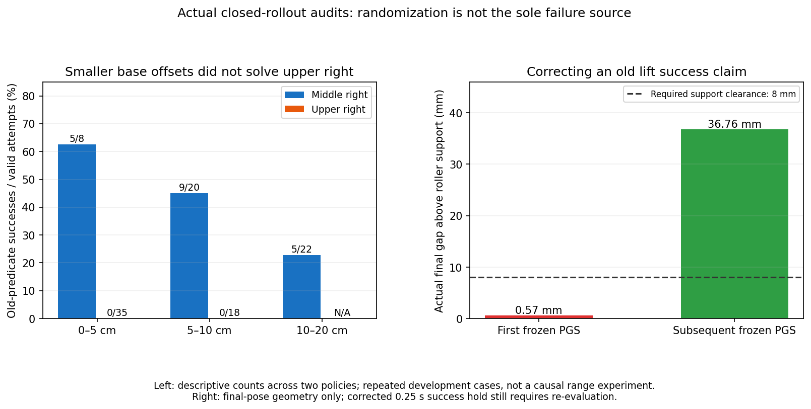

첫 frozen PGS 상단왼쪽은 당시 reported10.5696mm였지만 실제 롤러 간격
0.5696mm로 잘못된 proof lift였다. 후속 같은 seed의 마지막 간격36.7576mm는
충분하지만 새 판정에서 연속 hold 재평가 전까지 확정 성공으로 올리지 않는다.
기존 hybrid128의 전체 old-flag 성공31개 중 TRAIN1개도 마지막 실제 간격3.53mm였다.
이는 **마지막 실제 pose audit**이지 전체 old replay의 보상을 사후 정정한 결과가 아니다.

우리 GPU3/GPU0 writer만 정상 종료하고 두 실행의 최종 checkpoint/replay/log
Drive 검증 및 실제 process 종료를 확인했다. 새 terminal reference와 실제 support
offset를 manifest/checkpoint/replay 계약에 넣어 old Q/replay resume를 거부한다.
Frozen warm actor 복원을 위한 compatibility는 이 두 field만 제거하며 안전·좌표·
보상 나머지는 엄격히 비교한다. Old seed/Q는 new Q의 학습 데이터가 아니다.

16:14:58 첫 시작은 prepared manifest의 torso +6cm 설정을 다시 적용하려다
초기화 오류로 종료됐다. 두 실패 로그도 Drive 검증 후, 같은 reviewed profile을
중복 확장 없이 재적용하도록 수정했다.40검사 통과 후16:19:35 GPU3 TGS /
GPU0 PGS, 각128환경에서 새 고유 실행을 시작했고 실제 writer/service active를 확인했다.
Development를 거친 actor238과 actor normalizer만 동일하게 이전하고 Q/target Q,
critic normalizer, entropy,4 optimizer, actual replay/counter는 모두 새로 시작했다.
새 actor anchoring도 이전 actor로 맞췄다. Initial 모델/빈 replay는 Drive 체크섬
검증했다. 현재 writer가 실제로 진행되는지는 각 parent status/console로 확인한다.

- GPU3: `artifacts/rl/drive_runs/staged_hybrid_active_support_tgs128_gpu3_20261004_161935`
- GPU0: `artifacts/rl/drive_runs/staged_hybrid_active_support_pgs128_gpu0_20261004_161935`
- Replay500k, actor collection32,768행, Q warmup2,048 update, 기존 TRAIN/DEV/FINAL 분리.
- Base/box randomization·rack10N/주변5N·selfcollisionOFF·마찰·joint gains·dt 유지.
- CUDA_VISIBLE_DEVICES와 Kit 물리 GPU를 일치시키며 다른 사용자 process는 그대로다.
- 300초 Drive 업로드, 체크섬 검증된 오래된 checkpoint만 정리, 최신2개 유지.
- 판정/old replay 차단/actor-only 새 Q 초기화/기존 batched·hybrid 관련 CPU40검사 통과.

Randomization 범위는 부분 요인이지만 단독 원인으로 확정하지 않는다. 현재는
범위를 줄이거나 box를 고정하지 않고 corrected success 아래 실제 데이터를 다시 수집한다.
상단 오른쪽의 안전한 팔 경로와 구역별 held base 후보, 초기 배치의 실제 box 이탈을
계속 진단해야 하며 다양한 시작점에서의 독립 final 성공 목표는 아직 달성하지 못했다.


## 16:25 · 보정된 rollout 시작과 background 배치 단서

GPU3 TGS wave0 development61step/6,039행, GPU0 PGS91step/8,827행을
확인했다. Frozen baseline이므로 actor/Q/replay counter는0이다. Runtime manifest의
lift reference와 support offset10mm도 확인했다. 첫 자동 Drive 검증은 각각
16:24:00/16:23:45, backup error 없음이다. 현재 Q/actor 학습 개선은 아직 측정하지 않았다.

기존 동일128개 development의 background logical5 포함64개에서 initial불량은
wave0:24개, wave3:25개다. 미포함64개에서는 두 번 모두5개다. 다른 box/region/
base 값이 함께 달라지는 관측이므로 단독 인과 비교는 아니다. Background 원래
asset의 실제 선반/footprint 이탈 계측과 일치하는 단서이며, randomization 범위를
통째로 좁히기 전에 배치 생성과 물리적 안착을 점검해야 한다.

Quest RL 수집 manifest에도 현재 proof lift reference/지원면 offset를 기록한다.
Actor/action/관측 형식과 기존 VR 수집 옵션은 유지한다. 과거 demonstration의
보상·success label을 현재 label로 사후 덮어쓰지 않는다.

최종 관련 CPU suite80검사가 통과했다(새 lift/표준 PPO·SAC resume 차단,
staged/hybrid/batched, upright torso, pose student). `py_compile`과 diff check도 통과했다.
Background rear-cell 기본 깊이와 빈 depth slot 때문에 roller 이동 거리가 커지는
가설도 확인 대상이다. 아직 물리 진단으로 확정하거나 현재 randomization을 변경하지 않았다.


## 20:45 — 실제 SAC 회귀 원인과 재개 수정

Corrected roller-support lift 판정의 TGS/PGS128 실행은 모두 종료했다.
TGS는 paired development regression guard, PGS는 다음 wave의 background box
geometry 측정에서 유효하지 않은 quaternion으로 종료했다. 두 실행 모두 writer가
멈춘 뒤 checkpoint, 실제 replay/HDF, 로그의 Drive 검증을 마쳤다.

| Solver | 실제 actor/Q updates | 실제 TRAIN replay rows | 고정 DEV 성공 추이 /128 |
|---|---:|---:|---|
| TGS |960 /5888|177155|12 →9 →0|
| PGS |2100 /10448|362310|7 →2 →0 →0|

TGS의 실제 TRAIN 성공은 두 번째 훈련 묶음에서1회, PGS도 한 묶음에서1회였다.
Initial invalid layout은 denominator에서 실패로 유지하고 Q replay에는 넣지 않는다.
위쪽 오른쪽은 두 실행 모두 DEV 성공0회다. 학습이 성공했다고 결론내리지 않는다.

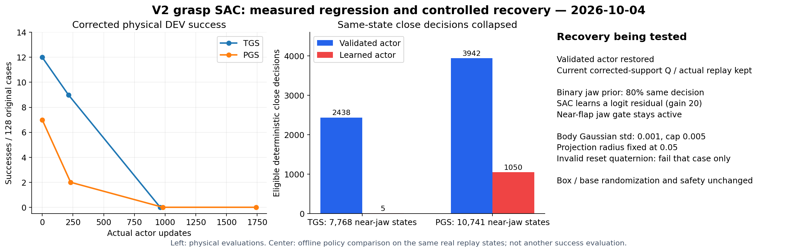

### 실패 원인을 같은 관측에서 분리

Closed actual TRAIN replay를 표본 추출하여 검증된 초기 actor와 마지막 actor를
**같은 물리 관측**에서 비교했다. 이것은 offline policy 진단이며 추가 물리 평가가 아니다.

- TGS near-jaw 관측7768개: 초기 deterministic close2438 →학습 후5.
  PGS near-jaw10741개:3942 →1050. 약한 jaw logit의 부호 변화로 닫힘이 쉽게 사라졌다.
- TGS raw 팔 목표 변화 RMS0.00125보다, actor를 바꾸지 않고 projection radius만
  0.05→0.0692로 바꿀 때 실제 projected 목표 변화 RMS0.00157이 더 컸다.
  PGS radius0.092에서는 반경 변화만으로 최대 normalized goal0.042가 바뀌었다.
  학습 반경의 자동 확대가 actor 평균 변화 외에 제어 목표를 바꾸는 경로였다.
- Initial background geometry 검사는 전체 tensor의 quaternion을 먼저 정규화했다.
  NaN/zero/finite overflow quaternion이 한 환경에 있으면 다른 healthy reset도 함께
  예외로 종료했다. 이것은 파지 성공률 저하와 구분되는 실행 중단 원인이다.

### 적용한 수정

1. **Invalid reset geometry 격리:** 측정용 pose만 유효한 대체값으로 계산하고 original
   invalid mask를 실패로 유지한다. Simulator pose를 고쳐 성공시킨 것으로 보지 않는다.
   Invalid rack/box quaternion은 그 case만 실패이며 다른 original reset은 계속 검사한다.
2. **Actor만 복구:** 같은 corrected-support solver의 마지막 Q/target/critic normalizer,
   양쪽 entropy optimizer와 actual replay를 유지하고, 검증된 초기 actor로 복구한다.
   Actor optimizer moments만 비운다. 과거 잘못된 lift 기준의 Q를 가져오지 않는다.
3. **Binary jaw 탐색:** 검증된 frozen21-goal actor의 선택에 처음80% 확률을 부여한다.
   `logit = sign(prior)*logit(0.8) +20*(current_raw_logit-prior_raw_logit)`.
   학습 residual로 열림/닫힘을 뒤집을 수 있다. 실제 binary actions, exact4-branch SAC,
   near-flap gate와 categorical entropy 학습은 유지한다. 닫힘을 강제로 고정하지 않는다.
4. **팔/torso 탐색:** correlated Gaussian initial std0.001, 최소0.001, cap0.005.
   AR1 rho0.98은 유지한다. Projection radius는0.05로 고정한다. Replay에 저장된 과거
   policy-radius context가 있어도 현재 projection bound는 고정값을 사용한다.
5. **정확한 resume:** 저장된 SACConfig를 복원한다. 바뀐 std cap/confident binary policy/
   fixed radius를 model 및 replay contract에 명시하고, 다른 contract는 strict하게 거부한다.

Base/box randomization, dynamic boxes, torso/gravity compensation, nominal observation,
Rack10N/robot-only obstacle5N/self-collision off,8mm active-support lift와0.25s hold 조건은
유지한다. Scene curriculum을 추가하지 않았다. VR transition을 Q에 넣거나 새로운
성공으로 합성하지 않는다. Frozen actor prior는 기존 학습 행동을 유지하는 제약이다.

98개 CPU 검사와 실제177155/362310행 checkpoint의 frozen resume 검사를 통과했다.
새 물리 rollout의 성공률 유지/개선은 별도 DEV에서 확인해야 한다.

### 사용자가 직접 해야 하는 일

필수 코드 수정은 없다. 위 문제의 코드·탐색·저장 수정은 이 checkout에서 처리한다.
추가 VR 수집은 선택 사항이며, 도움이 가장 큰 구역은 아직 실제 성공이 없는
**위쪽 오른쪽**이다. 현재 S63/Leju twofinger/rack rollers/upright torso+6cm 세팅에서
안전 진입→서로 다른 양쪽 flap 파지→실제 roller support 위 lift를 수행하고,
서로 다른 초기 base XY/yaw 몇 가지로 수집하면 된다. 현재 두 데모는 왼쪽 구역에
편중되어 있다. 데모 replay/새 observation 연결은 코드에서 처리한다.
추가 데모가 없어도 현재 실제 SAC 훈련과 실패 분석을 계속한다.


### 새 실행 —20:57 시작 확인

- GPU3 TGS128: `staged_hybrid_confident_jaws_tgs128_gpu3_20261004_204706` /
  `batch_sac_20261004_204706_fe8504`. Initial replay177155행을 복원했다.
  첫 DEV의 original128개 중99개가 guard를 통과하고 base hold에 진입했다.
  이 DEV는 학습 없는 평가이며, 이 단계의 rollout을 새 TRAIN replay로 세지 않는다.
- GPU0 PGS128 비교: `staged_hybrid_confident_jaws_pgs128_gpu0_20261004_205139` /
  `batch_sac_20261004_205139_f88c52`. Initial replay362310행을 복원했다.
  첫 DEV original128개 중98개가 guard를 통과했다. 두 복구 폴더 모두 모델과
  replay의 Drive checksum 검증을 **재개 전에** 마쳤다.
- GPU0 별도 frozen64 reset probe:
  `staged_background_packing_reset64_gpu0_20261004_205705`.
  같은64개 original cases로 original→packed background→original을 비교한다.
  한 tick만 실행해 initial geometry/stability를 보고 파지 성공 평가로 해석하지 않는다.
  Target ID/type/전체 pose, 초기 base randomization/pose, active background ID/type,
  safety를 유지하며 sparse rear background depth의 빈 slot만 앞에서 채운다.
  현재 학습 reset은 변경하지 않았다. Probe metadata는 Q import를 거부한다.
  결과가 나오기 전에는 rear gap이 초기화 실패 원인이라고 단정하지 않는다.

Main의 학습 수정은 `93238ff`에 push했다.25개 layout CPU 검사로 원래 target/base와
데이터를 보존하고 새 background footprint가 유효한 것을 확인했다.


### 21:17 — 초기 평가 완료와 실제 업데이트 / packing 진단 결론

GPU3의 수정 후 첫 frozen DEV는 **10/128**이다: 중간왼쪽4/32,
중간오른쪽6/32, 상단왼쪽0/32, 상단오른쪽0/32. Guard를 통과한 원래 배치는99/128이며
29개 initial failure도 denominator에 포함했다. 기존12/128보다 개선된 결과가 아니며,
복구된 actor가 실제 파지 동작을 다시 수행하는 것까지 확인했다.

이어지는 TRAIN wave에서 새 native transition과 실제 actor/Q updates를 확인했다.
진행 시점의 수치·run paths·완료된 wave는
[실측 상태 snapshot](assets/rl_v2_confident_sac_live_and_reset_probe_20261004.json)에 기록했다.
Baseline frozen 평가의10회 성공을 새 학습으로 얻은 개선으로 계산하지 않는다.
상단 오른쪽의 forearm–rack 충돌과 실제 flap capture/lift를 계속 해결해야 한다.

별도 PGS frozen64 **초기화만** 보는 original→packed→original 비교는
유효51/64 →52/64 →51/64였다. Background5가 보고된 failure에도11 →10 →10으로
큰 차이가 없었다. 일부 보고 값은 respawn 이후라 원래 box의 발산 원인을 대신하지
못한다. Sparse depth를 채우는 것만으로 초기화 실패가 해소된다는 증거는 없으며,
main의 기존 randomization/reset 분포는 그대로 유지한다. 이 진단의 파지 성공률은
평가하지 않았고 Q/훈련 replay에도 넣지 않는다.

모델·replay 복구 파일의 기존 Drive 검증과 periodic300초 업로더가 활성화되어 있다.
Frozen 진단의 writer가 종료한 뒤 manager가 로그/HDF를 최종 업로드하고 검증한다.


### 21:24 — 첫 TRAIN 묶음 종료 / 추가 수집 옵션

GPU3의 첫 새 TRAIN wave는 **1/128** 실제 grasp/lift 성공이었다. Initial valid82/128이며
새 measured held-phase transition40342행을 수집했다. Actor1322/Q7334는 재개 이전
960/5888 대비 실제 **+362/+1446 updates**다. 첫 frozen DEV10/128 뒤 실제 학습이
진행되고 있다. 학습 개선 결론은 다음 동일 DEV 결과를 확인한 뒤 내린다.

Frozen background packing 진단은 종료했고 manager의 `final_upload_verified=true`를
확인했다. Original→packed→original 유효51→52→51/64는 큰 개선을 뒷받침하지 않아
학습 reset을 바꾸지 않는다.

추가 VR 데모 수집을 도울 `--rl-demo-torso-extra-height-m 0.06` 옵션을 Quest에 연결했다.
기본0은 기존 수집 그대로이며,
0.06은 현재 upright software travel0.46m와 같은 shared configurator를 사용하고
action contract를 HDF manifest에 기록한다. S63/RL dataset에서만 허용하고 hard
joint limits/pitch/safety는 유지한다. [수집 예시](RL_QUEST_REWARD_DEBUG.md#현재-held-base-sac의-상단-데모-6cm-upright-travel)를 참고한다.
Quest headset의 새 수집까지 실행한 것은 아니다. Syntax와 shared torso CPU 검사로
연결을 확인했으며 사용자께서는 파일을 수정할 필요가 없다. 추가 수집은 선택 사항이다.

### 21:35 — 수치 복구 이후의 batch identity 오류 수정

21:30 GPU3 writer가 두 번째 TRAIN 중 종료했다. Env125의 root-state nonfinite를
quarantine하여 healthy next rows가75→74로 줄었지만, `pilot.anchor`와 held waypoint
context는 act 시점75개를 유지했다. `PoseGoalSACPilot.observations`의 anchor expand가
74/75 mismatch로 예외를 냈다. 이 중단은 OOM/다른 사용자의 GPU 작업 때문이 아니다.

`observe_measured_held_rows`가 **같은 kept IDs**로 previous rows, next policy/critic,
reward, terminal, clocks와 anchor/held waypoint를 함께 선택하도록 수정했다.
Corrupt row는 계속 실패로 기록하고 Q/HDF에 넣지 않는다. Healthy terminal row는
bootstrap 없는 실제 전이로 유지한다. Unit regression은 실제 warm observation의
anchor expansion과 각 환경의 waypoint/clock identity를 함께 확인한다.

Future runner 예외에서는 finite learner일 때만 이전에 측정한 replay와 checkpoint를
종료 전에 저장한다. 이번 이미 종료된 GPU3에는 이 개선을 소급 적용할 수 없다.
최신 saved Q checkpoint8192와 마지막 완료 wave의 replay217497행으로 재개하며,
현재 wave의 미저장 메모리 전이를 복구했다고 주장하지 않는다. CUDA 장치, same-MDP
replay/waypoints/물리/보상/성공 기준은 유지한다. 파일을 user가 직접 고칠 필요는 없다.

GPU0에도 같은 구 코드가 로드돼 있어 **우리 supervisor만** 정상 종료하도록 했다.
그 run의 최신 learner와 실제 replay를 저장하고 종료/Drive 검증 후 새 폴더로 재개한다.
다른 프로세스에는 신호를 보내지 않았다.27개 staged/hybrid/batch 검사를 통과했다.

### 21:49 — checksum 검증 후 identity 수정 버전 재개

이전 TGS/PGS의 writer가 종료한 뒤 checkpoint, logs, HDF와 저장된 실제 replay의
Drive 크기/MD5 검증을 마쳤다. 양쪽 manager의 `final_upload_verified=true`를 확인했다.
TGS는 runtime exception, PGS는 수정 코드를 다시 로드하기 위한 요청 종료이며,
`training_exit_code=1`을 학습 성공/정상 완료로 해석하지 않는다.

| 새 실행 | 장치 / env | 복원 source |
|---|---|---|
| `staged_hybrid_aligned_resume_tgs128_gpu3_20261004_214722` | GPU3 /128 | TGS checkpoint8192 + 완료 wave replay217497행 |
| `staged_hybrid_aligned_resume_pgs128_gpu0_20261004_214747` | GPU0 /128 | PGS checkpoint12588 + 요청 종료 때 저장된 실제 replay |

이번 재개에서는 actor를 rollback하지 않고 저장된 actor/Q/optimizer와 실제 replay를
복원한다. TGS의 오류 당시 미저장 wave 전이는 사용할 수 없으며, 이미 저장된
same-MDP replay만 사용한다. Source 첫 TRAIN 성공은 TGS1/128, PGS2/128이었다.
128-case baseline DEV10/128·5/128은 복구 actor의 평가이며 새 학습 개선으로 세지 않는다.
상단의 반복 성공과 독립 초기 base/box 일반화는 아직 달성하지 못했다.

실제 두 새 writer PID, CUDA_VISIBLE_DEVICES=3/0과 해당 물리 GPU의 단독 사용을
확인했다. 다른 사용자의 GPU1/2 프로세스는 그대로 두었다. 시작 당시 디스크 여유는
약42GB였다. 기존 Drive remote/300초 검사/검증한 오래된 checkpoint만 정리/최근2개
보존/종료 후 로그 검증을 같은 manager로 유지한다. 26-wave 원래 TRAIN/DEV/FINAL
schedule과 base/box randomization, collision/success 기준도 유지한다.

`8b6e09f`의 kept-ID regression 검사27개를 통과했다. 새 실행의 초기화와 실제
rollout/학습은 현재 상태/PID/log로 확인하며, 재개 자체를 성능 개선으로 보지 않는다.

### 22:00 — 실제 같은 관측에서 confident jaw 선택 유지 확인

새 resume의 source checkpoint를 각 solver의 **이미 저장된 실제 replay16,000개 관측**에서
frozen validated actor와 비교했다. 별도 simulator rollout, 합성 reward/transition은 없다.

| Source 학습 이후 | 동일 near-jaw 관측에서 prior close | Learned close | 선택 유지 |
|---|---:|---:|---:|
| TGS actor960→1536 |991|846|85.4%|
| PGS actor2100→2635 |1736|1736|100%|

TGS는 eligible 결정145개가 닫힘→열림으로 바뀌었고 PGS는0개였다. Prior close였던
관측의 평균 learned close probability는 각각0.634/0.735였다. 비교한 replay 표본은
이전 collapse 감사의 표본과 다르므로 absolute close counts를 앞 결과와 직접 비교하지
않는다. 이번 비교 자체에서는 각 solver가 같은 관측으로 before/after를 평가한다.
Frozen prior를 따른 결정이 유지된 것은 **그리퍼 선택 회귀의 완화 신호**이며,
물리 파지 성공률 개선이나 상단 일반화 성공을 의미하지 않는다.

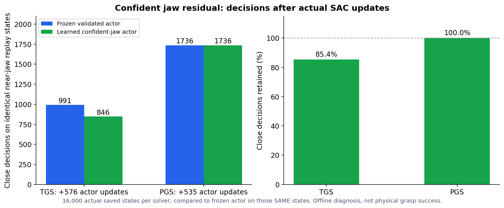

[실제 비교 수치](assets/rl_v2_confident_jaws_after_learning_20261004.json)에 checkpoint counters,
sampled states, eligible 결정/flip counts와 body drift를 기록했다. 같은 시점 GPU3/GPU0
새 실행은 frozen128-case DEV rollout을 수행하고 있다. 이 평가에서는 optimizer/replay가
변하지 않았으며 새 actor update는 뒤의 TRAIN wave에서 확인한다.

### 22:13 — 재개 DEV는 개선 없음 / GPU3 workplace 비교로 전환

재개 checkpoint의 완성된 frozen DEV는 **TGS0/128, PGS2/128**였다. Original initial
valid는 각각98/128,101/128이다. 최초 confident actor의10/128·5/128보다 개선되지
않았다. TGS의 robot–rack 종료에는 `zarm_r4_link`27개, `zarm_l4_link`10개가 포함됐다.
닫힘 선택을 유지해도 실제 경로/접촉의 실패가 남아 있다.

TGS source actor가 이미 업데이트된 채 재개됐고 이번 guard의 새 baseline이0이므로,
현재 guard만으로 과거10→0 회귀를 검출했다고 주장하지 않는다. 직접 원래 DEV와
비교해 **자체 GPU3 supervisor만** 종료 요청했다. Finite 새 learner와 실제 측정 replay를
저장하고 manager가 최종 Drive 검증을 수행한다. 원래 학습 writer의 종료를 확인했고,
CPU 백업은 계속 둔다. GPU0 PGS의 실제 TRAIN actor/Q updates는 계속 진행한다.

GPU3 새 frozen 진단은 `staged_upper_waypoint_probe128_gpu3_20261004_221213`이다.
검증 완료된 PGS confident validated actor snapshot을 고정해 **같은32개 개발 배치×4개
workplace 후보=128개 물리 attempt**를 동시에 비교한다. 각 구역8개 original cases이며
독립 FINAL cases는 사용하지 않는다. 반복 후보를128개 독립 초기 조건으로 세지 않는다.

| 후보 | 상단 base 목표만 변경 |
|---|---|
| baseline | 원래 offset−4.55cm 유지 |
| right_mirror | 오른쪽만 lateral+9.10cm; offset−4.55→+4.55cm |
| toward_center | 왼쪽−5cm /오른쪽+5cm |
| farther_front | 양쪽 랙에서+5cm 더 떨어진 목표 |

중간 구역은 모든 후보에서 원래 workplace를 유지해 반복 물리 변동의 대조군으로 쓴다.
초기 robot/base pose, target/background box pose와 dynamic physics, randomization,
성공/충돌/종료 기준은 바꾸지 않는다. 실제 base controller가 후보 위치로 이동한 뒤
15 stable ticks를 만족해야 frozen 파지를 시작한다. 손 goal은 neural actor가 낸다.
후보가 성공하는지나 충돌 원인인지 아직 결론내리지 않는다.

`--base-waypoint-probe --no-training`과 각 wave row의 `waypoint_probe` metadata를
명시해야 한다. TRAIN 사용/flag 누락/잘못된 offset/중복 case-candidate는 거부한다.
별도 collection source와 `Q_import_eligible=false`로 Q import를 막고, 접근 명령의
vector cache와 held context를 같은 후보 좌표로 갱신한다.19개 CPU 검사는 실제
approach/held controller 목표의 일치와 초기 관측/원래 templates 보존을 확인했다.

사용자가 직접 고칠 코드/인증은 없다. 가장 도움이 되는 추가 자료는 현재 torso+6cm,
양손 flap/8mm roller support lift 조건의 **상단 오른쪽 VR 성공 데모**다. 선택 사항이며,
위 진단과 실제 SAC 수집은 추가 자료 없이 진행한다.

### 22:19 — 최신 실행·백업 실측 상태

종료한 TGS resume의 `final_upload_verified=true`를 확인했다. 새 waypoint 진단에서는
84/128 original attempts가 초기 guard/실제 base 이동과 안정 대기를 통과하여 frozen
manipulation에 진입했다. Actor2100/Q10448/replay0은 유지되며, 진단을 새 학습/Q data로
세지 않는다. 후보별 성공·충돌 결과는 rollout을 마친 뒤 비교한다.
GPU0의 첫 새 TRAIN은0/128, actor3008/Q14080, 실제 replay487399행이었다.
학습 개선은 아직 달성하지 못했다. [상태 snapshot](assets/rl_v2_confident_sac_live_and_reset_probe_20261004.json)에
종료/Drive 검증을 마친 실행과 진행 중인 실행을 구분하여 기록했다.

### 10/05 00:34 — randomized SAC 실제 성공과 회귀 / 상단 오른쪽 미세 진입 진단

사용자가 native goal을 `randomization을 유지한 SAC 양손 파지 성공`으로 수정했다.
실제 goal은 `active`다. 자동 재개 과정에서 objective가 `resume`으로 바뀌었던 오류를
해소했으며, 학습 성공으로 완료 처리하지 않는다.

GPU0 PGS SAC는 중단 없이 진행 중이다. 이 시점까지 완성된11개 wave에서 actor5249 /
Q23042 updates, 이번 실행의 실제 held-phase 학습 transition363774개를 확인했다.
평가를 포함한 실제 scene transition은667861개지만, DEV 자료를 Q 학습량에 포함하지
않는다. 평가 wave에서는 optimizer counters와 replay가 변하지 않는다.

| 동일128-case DEV | 중간 왼쪽 | 중간 오른쪽 | 상단 왼쪽 | 상단 오른쪽 | 합계 |
|---|---:|---:|---:|---:|---:|
| wave0 / actor2635 | 1 | 1 | 0 | 0 | 2/128 |
| wave3 / actor3389 | 1 | 2 | 1 | 1 | 5/128 |
| wave6 / actor4128 | 1 | 4 | 0 | 0 | 5/128 |
| wave9 / actor4878 | 0 | 2 | 0 | 0 | 2/128 |

상단 오른쪽은 TRAIN wave2의 seed120352와 DEV wave3의 seed121324에서 각각1회
**실제 opposing 양손 pinch, 양손 stable, corrected proof lift,0.2667초 hold**를 통과했다.
이때 unsafe cause는 모두false다. 따라서 상단 오른쪽을 물리적으로 불가능하거나
전체 학습에서 성공0회라고 해석하면 잘못이다. 아래의 frozen 이전 actor workplace
진단에서 성공0회였던 결과와 구분한다. 박스는 dynamic이고 각 성공의 initial base
XY/yaw 및 box randomization 값은 연결된 JSON에 남겼다.

그러나 개선은 유지되지 않았다. 같은 DEV seed121324는 wave6에서 왼손 pinch를 잃고
wave9에서 양손 pinch를 잃었다. 마지막 손–flap 거리는 wave3의0.27/1.57cm에서
wave9의4.95/3.55cm로 늘었다. 두 실패 모두 rack 충돌/그 밖의 unsafe cause가false다.
TRAIN seed120352도 이후 같은 배치에서 한 손 또는 양손 접촉을 잃었다. 이것은
**접촉 경로/파지 동작의 회귀가 충돌 없이도 생김**을 보여준다. 초기 물리 상태의 반복
변동과 actor 변화가 함께 있으므로, 이 수치만으로 prior fade 등 하나의 원인으로
단정하지 않는다. 낮은 초기 성공 수 때문에 현재 paired regression guard가 이런
소수 성공의 손실을 반드시 검출하는 것도 아니다. 독립 FINAL은 아직 평가하지 않았다.

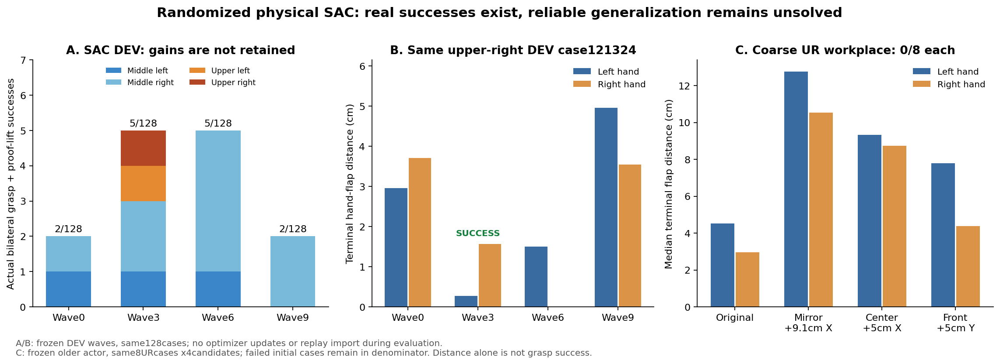

[실측 snapshot과 성공 layout](assets/rl_v2_randomized_sac_progress_20261005.json)에 TRAIN /
DEV, 별도 frozen 진단, 초기 무효 실패 분모, checkpoint source와 제한을 구분했다.
그림의 terminal distance는 마지막 step 거리이며 궤적의 최소 거리나 성공 판정이 아니다.
현재 코드의 `rack_clearance_m`은 이미 **min(root Z 증가, bare shelf gap − roller
support offset)**으로 보정된 proof-lift 판정량이다. 여기서 roller10mm를 다시 빼면
잘못이다. Raw root lift나 bare shelf gap 하나와도 구분한다. 위 성공은 이 값8mm 이상과
양손 접촉/hold를 함께 만족하며, 상단 오른쪽 TRAIN/DEV의 보정 값은12.43/33.99mm다.

이전 GPU3 coarse workplace 진단은 정상 종료/최종 Drive checksum 검증을 마쳤다.
Actor2100/Q10448/replay0을 유지한32개 initial DEV cases×4후보=128 attempts다.
상단 왼쪽2회 성공은 **같은 seed121206의 두 후보**에서 발생했으며,2개 독립 초기
배치의 일반화 성공으로 세지 않는다. 상단 오른쪽은 후보마다0/8이었다. lateral+9.1cm /
+5cm 후보는 terminal 거리를 늘렸고, front+5cm 후보에는 box speed/lift limit 실패가
있었다. 충돌 감소만으로 좋은 파지 진입 위치를 선택할 수 없다.

GPU3 새 실행은 `staged_upper_right_fine_probe128_gpu3_20261005_002932`이며,
학습 writer PID623449 / supervisor623372다. GPU0 writer3499249는 계속 실행한다.
네 구역 모두 성공했던 **checkpoint15602 / actor3389**를 기존 Drive에서 내려받아
크기18374269 bytes / MD5`a072d139f6461c32377dfd42473e7157`을 검증한 뒤 고정했다.

새 비교는 상단 오른쪽8개 DEV initial cases×16개 XY workplace 후보=128 attempts다.
각 축의 offset은−2,−1,0,+1cm이며 yaw는 변경하지 않는다. 이전 성공 seed121324와
접촉 근접 seed121306을 포함한 **DEV tuning**이므로 선택 편향을 명시하며, 일반화
평가나 학습 transition으로 세지 않는다. 초기 base/box pose, box dynamic physics,
randomization, 안전·성공 기준은 유지한다. 실제 base approach/15 stable ticks 뒤
SAC actor가 파지하며 live VR/IK는 없다. `Q_replay_import_eligible=false`이고 새
waypoint 자료는 matching SAC replay에 넣지 않는다. 초기 실제 rollout에서
actor3389/Q15602/replay0 유지와 GPU3 단독 CUDA 사용을 확인했다.

기존 CPU Drive 관리자가300초 업로드/검증, 최근2개 checkpoint 보호, writer 종료 후
로그/HDF 검증을 맡는다. 새 인증은 만들지 않았고 GPU1/2의 다른 사용자 PID1779102는
변경하지 않았다. 기록 시점 로컬 여유는약33GB였다. 성공을 과장하지 않고 실제 접촉
동작의 유지와 더 넓은 초기 상태에서의 성공을 계속 확인한다.

### 10/05 01:47 — 미세 위치 진단 결과와 실제 TRAIN 성공을 유지하는 SAC

Goal은 `randomization을 유지한 SAC 양손 파지 성공`, 상태는active다. 안정적인
randomized 일반화나 독립 FINAL 성공을 달성한 것은 아니다. GPU0 원래 학습의 같은
128-case DEV 결과는 **2→5→5→2→1→5/128**이었다. Wave15에서5회로 돌아왔지만
계속 증가하는 추세나 네 구역의 성공 유지로 해석하지 않는다.

GPU3 frozen 미세 위치 진단은 정상 종료했고 최종 로그/HDF의 Drive 크기·MD5 검증을
마쳤다. 같은상단 오른쪽8개 DEV 배치×16후보에서3회 성공했다. 모두 actor3389 /
Q15602로 고정했고, Q/replay 업데이트나 새 TRAIN 자료는 없다.

| DEV seed | Workplace XY offset | 보정 proof-lift clearance |
|---|---|---:|
| 121324 | −2cm /0cm | 35.60mm |
| 121300 | −1cm /−2cm | 51.03mm |
| 121306 | +1cm /−1cm | 85.46mm |

이3개는 서로 다른 초기 배치지만 DEV tuning으로 선택한 성공이다. 이후32개 초기
배치로 넓힌 비교에서는 다음 결과였다. 모든 분모에 초기 무효 배치를 포함했다.

| Frozen 후보 | 초기 유효 | 성공 | Robot–rack 실패 |
|---|---:|---:|---:|
| 원래 workplace | 25/32 | 0/32 | 2 |
| X−2cm | 24/32 | 1/32 | 14 |
| X−1cm/Y−2cm | 23/32 | 0/32 | 6 |
| X+1cm/Y−1cm | 24/32 | 0/32 | 0 |

X−2cm의 성공 seed121319는33.10mm proof lift를 통과했지만 충돌도14회였다. 따라서
이 후보로 기본 진입 waypoint를 바꾸지 않았다. 반복 물리 상태가 조금씩 달라지는
점과 초기 무효 reset 비중도 남아 있으며, 위치 변경만으로 학습 문제를 해결했다고
결론내릴 수 없다. 이 probe도 정상 종료·최종 Drive 검증을 마쳤다.

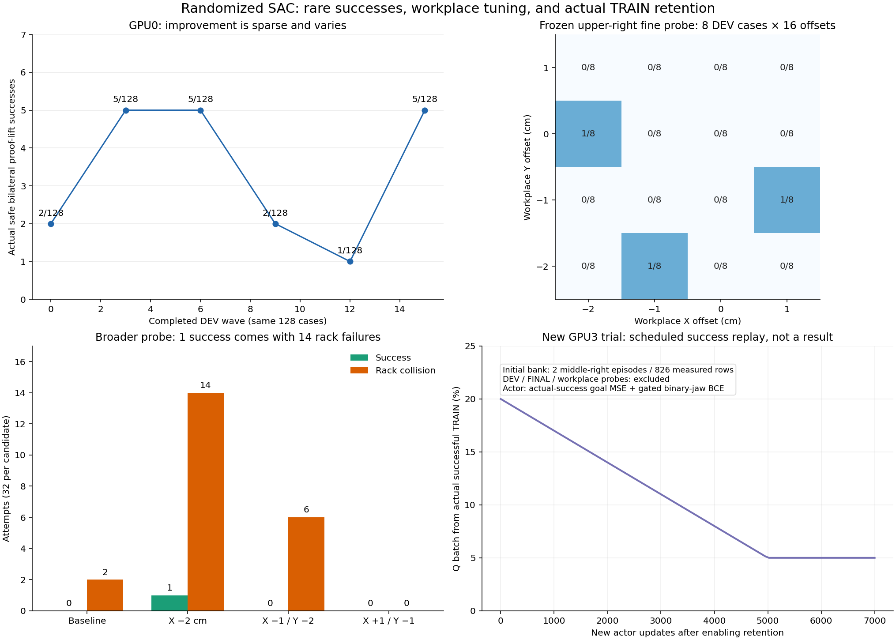

[실측 snapshot](assets/rl_v2_success_retention_20261005.json)은 frozen DEV/probe와 새
TRAIN 업데이트를 구분한다. 오른쪽 아래 그래프는 **설정된 replay 일정**이며 성공률
예측이나 실제 개선 곡선이 아니다.

#### 이번 SAC 변경

드물게 성공한 실제 TRAIN 경로가 이후 업데이트에서 사라지는 문제를 다루기 위해
성공 episode의 정확한21-D held goals/관측/보상/next state를 별도 bank에 보관한다.
초기 자료는 종료·최종 백업된 matching PGS 실행의 중간 오른쪽 TRAIN2개,
seed120100/120129의 **826개 실제 전이**다. Native HDF와 원래 Q rows를 정확히
연결했고, saturated physical delta에서 goal을 역산하지 않았다.

Q batch는 초기20% 성공 자료를 사용하고5000 actor updates 동안5%로 줄인다.
Actor에는 실제 성공 경로의 연속 goal MSE(weight400 at radius0.05)와 접근 gate가
허용한 jaw BCE(weight0.05)를 추가했다. 성공을 새로 발견하면 TRAIN wave 종료 후
bank에 추가한다. 구역당4096행까지 whole episodes를 보관하고, 자료가 있는 구역을
균등하게 샘플링한다. 초기 bank는 중간 오른쪽뿐이므로 다른 구역에 편향될 위험이
있다. DEV/FINAL/probe 자료는 bank/Q 학습에 들어가지 않는다. 기존 VR frozen prior,
SAC Q objective와 환경·보상·관측·waypoint·randomization·안전/성공 기준은 유지한다.
[사용법과 저장 계약](RL_V2_STAGED_GOAL_SAC.md#실제-train-성공-경험-유지)을 참고한다.

시작 actor는 DEV에서 네 구역 성공이 있었던checkpoint15602/actor3389를 복구했다.
Q/replay는 다른 **종료된 matching checkpoint12588** branch의 실제438808행을
유지했다. 시작 runtime counters는actor2635/Q12588이며 복구 actor의source3389와
구분한다. 초기826개 실제 TRAIN states의 greedy21-goal 출력이 선택한 actor와
정확히 같고 모든 모델 tensor가 유한함을 확인했다. 다른 solver/MDP의 old Q를
가져오거나 초기화 자체를 새 학습량으로 세지 않았다.

#### GPU3 실제 실행 확인

실행 부모는`staged_success_retention_pgs128_gpu3_20261005_012745`, 실제 child는
`batch_sac_20261005_012745_ad5861`이다. Host writer1115417와 supervisor1115203,
CUDA_VISIBLE_DEVICES=3 / renderer GPU3 / multiGPU off,128env를 확인했다.
GPU 사용량은 약18.4GiB였다. 다른 사용자 PID1779102의 GPU1/2 작업은 변경하지 않았다.

초기 frozen DEV는 **4/128**(중간 왼쪽1/오른쪽3,상단0/0), 초기 유효100/128이다.
이는 새 학습 전 결과이며 retention의 개선으로 세지 않는다. 이후 TRAIN wave1에서
actor2684/Q12784, 즉 **새 actor49/Q196 updates**, 실제 TRAIN6058행을 확인했다.
Q256행 중 실제 성공51행이 들어갔고 goal/jaw 보조 손실이 유한했다. 초기 성공 bank826행,
evaluation_rows=0도 유지됐다. 새 학습의 성공률 개선은 다음 DEV와 독립 FINAL에서
확인해야 한다. 관련 자료 분리·gradient·저장/재개·runner 검사44개와 Drive 검사10개가
통과했다. CPU 검사는 물리 성공률의 증거가 아니다.

#### 저장과 실행 중단 처리

기존 연결로 초기23.6MB checkpoint의 크기·MD5를 검증했다. 초기3.62GB replay는
기존600초 전체 전송 제한시간으로 실패했고, source 파일을 보존한 채 파일 크기에
맞춘 제한시간으로 재업로드 중이다. 인증 실패로 판정하거나 재인증하지 않았다.
기록 당시 초기 전체 replay 백업은 **검증 대기**이며, 원래 종료된 source의 전체
백업은 검증되어 있다. 로컬 여유는 약28GiB다.

기존300초 업로더·검증된 과거 checkpoint만 정리/최근2개 유지 규칙을 재사용한다.
이미 실행 중인 관리자는 이전 timeout 코드를 유지하므로 별도CPU 보조 unit
`humanoid-rl-large-final-backups-20261005-0147.service`를 실제 시작·확인했다.
이 worker는 두 학습 writer 종료와 supervisor의닫힌 로그 증거를 기다린 후 같은
파일 잠금을 사용해 최종 replay/HDF/로그를 검증한다. GPU나 실행 중인 로그를
사용하지 않고, 다른 업로더가 잠금을 보유하면 기다린다.

GPU0 종료 시도는 자동 승인 검토에서 진행 중인 학습을 중단할 명시적 승인이
없다는 이유로 거부되어 **종료 신호를 보내지 않았다**. GPU0는 그대로 유지하고,
새 GPU3 학습은 닫히고 검증된 별도 source에서 시작했다. Goal은 완료 처리하지 않는다.

### 10/05 02:21 — 새 TRAIN8개 성공·bank 추가·그리퍼 구동 비교 시작

성공 경험을 유지하는 GPU3 SAC에서 처음 두 TRAIN waves를 실제 완료했다.

| TRAIN wave | 전체 시도 /초기 유효 | 중간 왼쪽 | 중간 오른쪽 | 상단 왼쪽 /오른쪽 |
|---|---:|---:|---:|---:|
| 1 | 128 /82 | 0 | 2 | 0 /0 |
| 2 | 128 /95 | 2 | 4 | 0 /0 |

**새로 수집한 성공8개는 서로 다른 TRAIN seeds**다. 초기 bank의120100/120129와도
다르다. 모든 성공이 opposing 양손 pinch·양손 stable·0.2667초 hold·corrected
proof lift13.34–47.36mm·unsafe=false를 통과했다. Box는 dynamic이며 원래 초기
base lateral/outward/yaw randomization을 유지했다. 예를 들어120115의 시작
base는lateral−15.70cm/outward3.26cm/yaw+4.37°,120036은−12.75cm/20.70cm/+0.92°다.
이는 TRAIN에서의 실제 성공이며 independent FINAL 일반화나 deterministic 성공률
개선으로 해석하지 않는다. 전체 성공은8/256으로 낮고 상단 자료는 아직0개다.

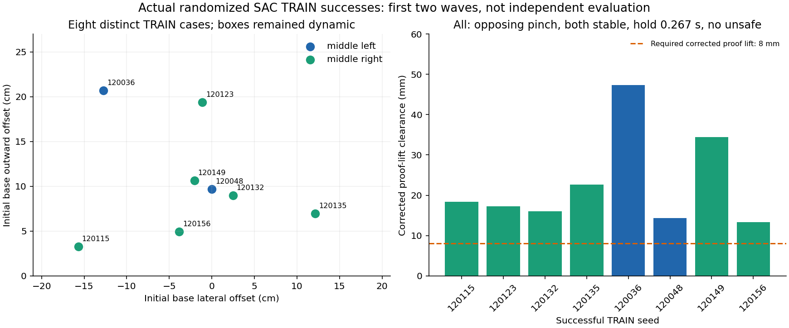

[실측 snapshot·모든8개 성공 layout·접촉/hold/lift 증거](assets/rl_v2_success_retention_first_train_20261005.json)를
기록했다. Bank는826→1653→**4127행**으로 늘었고 중간 왼쪽2episode/827행,
중간 오른쪽8episode/3300행이다. 여기에는 초기source2episode도 포함되므로
10개 새 성공으로 세지 않는다. 실제 새 TRAIN101012행,새 actor757/Q3026 updates를
확인했고 wave3의 같은 DEV 평가가 시작됐다. DEV에서는 optimizer/replay/bank를
추가하지 않으며 평가 완료 뒤 초기4/128과 비교한다.

#### 물리 발산을 그리퍼 구동에서 분리해 확인

현재 초기 frozen DEV에도 박스가 한 제어 tick 동안 수백/수십억m/s로 튀는 finite
물리 발산이 있었다. 정상적인 접근 거리 평균에 이런 terminal 값을 섞어 학습 신호를
해석하지 않는다. 초기무효28/128과 상단의 collision-free 미접촉 실패도 남아 있다.
그리퍼의 실제 초기화된 motor drive는 stiffness4000N·m/rad,
damping400N·m·s/rad,effort limit100Nm이었다. `bar_1` 링크는약4.05g다.
Authoritative 설정은`assets/leju_claw_two_finger/config.json`이며 generic
`configs/grippers.json`의20/2와 실제 값이 다르다. Close force feedforward는50N이다.

강한 drive와 가벼운 링크/closed linkage/contact의 결합은 **원인 후보**다.
[NVIDIA 안정성 안내](https://docs.omniverse.nvidia.com/kit/docs/omni_physics/107.3/dev_guide/guides/articulation_stability_guide.html)는
이 조합의 stiffness/force/속도/질량비를 검토하도록 안내한다. 이전 timestep·solver·
contact-last 비교만으로 발산이 해결되지 않았으므로 같은 frozen actor에서 motor drive를
따로 비교한다. 원인 확정이나 성능 개선으로 기록하지 않는다.

새 GPU3 진단 부모는`staged_gripper_drive_probe16_gpu3_20261005_021337`이며,
writer1519368 / supervisor1519335를 host에서 확인했다. 기존 TRAIN writer1115417와
GPU0 writer3499249는 종료하지 않았다. GPU3 새 진단은약4GiB이며 기존TRAIN과
합계약22.5GiB다. 다른 사용자 GPU1/2 작업은 변경하지 않았다.

각 구역 원래DEV의 첫4개씩16개 cases를 success에 따른 선택 없이 사용하여,
**original→soft_2nm→original의48개 시도**를 수행한다. Checkpoint15602/actor3389가
고정이며 초기 실제 rollout에서actor3389/Q15602/replay0을 확인했다. Soft 후보는
네 `bar_1` motor의100/5/2Nm이고 arm/body/passive drive는 그대로다. 설정과 actuator
model tensors를 함께 바꾸고 실제 PhysX 값을 다시 읽어 확인한다. Geometry/마찰/
50N feedforward/solver/시간 간격/waypoint/초기 randomization/성공·안전 조건은
유지하며 이 전이는 Q 학습에 쓸 수 없다. 아직 비교 결과는 대기 중이다.
[사용법](RL_V2_STAGED_GOAL_SAC.md#그리퍼-motor-drive만-비교하는-frozen-진단).
구동 대상·원래 값 복원·PhysX 불일치 거부·frozen gate 및 기존 runner/waypoint
검사24개가 통과했다. 기존 학습의 구동은 변경하지 않았다.

#### 초기 replay 전체 백업 완료

수정한 대용량 전송 제한시간으로 초기`staged_goal_experience.pt`3.62GB의 업로드,
크기·MD5 검증을 완료했다. Manifest/checkpoint/status/retention audit/initialization
verification도 검증됐으며 기존 인증을 재사용했다. 이번 초기 전체 백업 검증 receipt는
새 TRAIN 부모의`initial_full_replay_backup_verification.json`에 있다. 이전01:47 기록의
검증 대기는 해소됐고 미검증 자료를 삭제한 것은 아니다. Goal은active로 유지한다.

### 10/05 02:52 — 첫 learned DEV는 개선 없음 / 그리퍼 비교 판독 연결

GPU3 success-retention SAC의 같은128-case DEV wave3가 완료됐다. 새 TRAIN에서
성공8개를 발견한 사실과 deterministic 평가 개선을 구분한다.

| DEV wave | 초기 유효 /전체 | 중간 왼쪽 | 중간 오른쪽 | 상단 왼쪽 /오른쪽 |
|---|---:|---:|---:|---:|
| 새 학습 전0 | 100 /128 | 1 | 3 | 0 /0 |
| 새 actor757/Q3026 updates 후3 | 95 /128 | 1 | 2 | 0 /0 |

총 성공은 **4→3/128**이며, 지금까지 성공률 개선은 확인되지 않았다. 중간 오른쪽은
초기 성공2개를 잃고 다른1개를 얻었다(paired exact p=0.5). 이 표본에서 통계적으로
확정된 회귀라고 주장하지 않으며, 초기 유효성/물리 반복 편차도 남아 있다. 새 평가
성공은seed121000/121112/121131의18.59/19.36/20.90mm corrected proof lift,
양손 stable opposing pinch,0.2667초 hold,unsafe=false다. DEV는 bank에 넣지 않았다.
Bank는4127행이고 평가 후 기존128env TRAIN wave4가 이어지고 있다.

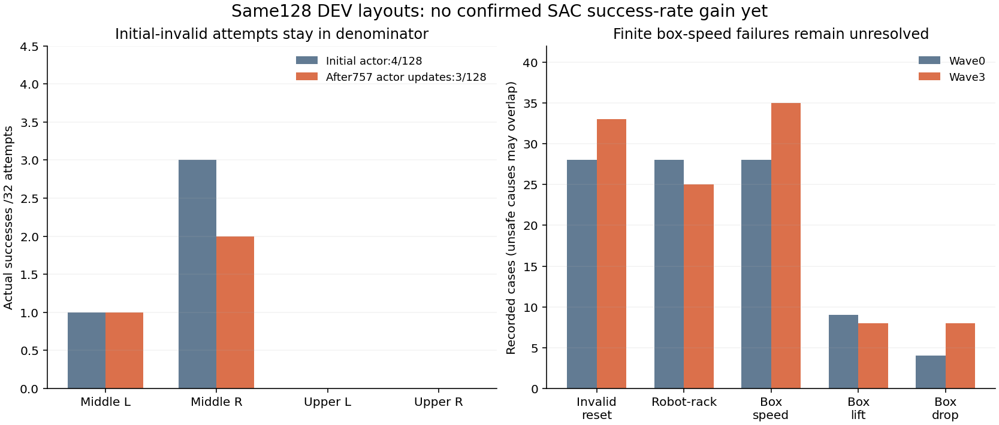

[완료 wave의 실측 snapshot](assets/rl_v2_success_retention_first_dev_20261005.json)에
전체 초기 layout과 성공 proof를 기록했다. Box-speed 안전 종료는28→35회,
robot–rack은28→25회였으며 원인 수는 중복될 수 있다. 평균 거리나 total reward만
보고 개선됐다고 해석하지 않는다. 상단의 실제 새 TRAIN 성공 자료와 독립 FINAL
일반화 증거는 여전히 부족하다. 목표를 완료 처리하지 않았다.

별도 frozen16-case 그리퍼 비교의 첫 original wave는 초기 유효14/16,성공0/16,
robot–rack6회,box-speed4회였다. 초기 무효2회도 분모에 포함했다. 이16개는 각
구역의 미리 정한 첫4개이며 성공 seed를 선택한 배치가 아니다. 이후 soft_2nm를
적용했고 실제 PhysX에서stiffness100/damping5/drive limit2Nm를 확인했다.
비교 policy는actor3389/Q15602/replay0으로 고정되어 있다. Soft 결과와 마지막
original 반복이 끝나기 전에는 구동 개선/원인 확정으로 해석하지 않는다.

새`analyze_gripper_drive_probe.py`는 whole-layout identity와 initialized-drive audit를
검사하고 전체 분모/초기 유효 쌍/안전한 terminal 거리/반복 편차를 함께 보고한다.
누락된 실패 분모,다른 layout,TRAIN/Q replay,미검증 drive,불완전 wave를 완전한
비교로 인정하지 않는 판독·구동 검사16개가 통과했다. Neutral 초기 자세의 source
episode가 달라진 비교도 거부한다.
[사용법](RL_V2_STAGED_GOAL_SAC.md#그리퍼-motor-drive만-비교하는-frozen-진단).
기존 학습을 중단하거나 기본 물리값을 변경하지 않았고 다른 스레드의 영상 코드
변경은 별도로 보존했다.

### 10/05 03:46 — 구동 비교 완료 / 연속 팔 탐색 SAC 분기 시작

그리퍼 drive만 바꾼 frozen 비교48회가 모두 끝났다. 같은16개 DEV initial layouts를
original→soft_2nm→original로 반복했으며 각 wave의 초기 유효 배치는14/16으로
같았다. 마지막 반복에서 원래 stiffness4000/damping400/drive limit100Nm가 실제
PhysX에 복원됐음을 확인했고, Q/actor 업데이트0·replay0을 유지했다. 종료 exit0과
최종 HDF/구동 audit/로그의 Drive 검증도 완료했다.

| 기록 | Original | Soft2Nm | Original 재시험 |
|---|---:|---:|---:|
| 성공 / 전체16배치 | 0 | 0 | 1 |
| Robot-rack 종료 | 6 | 8 | 6 |
| Box-speed 종료 | 4 | 1 | 2 |
| Box-lift-limit 종료 | 2 | 0 | 0 |
| Box-drop 종료 | 1 | 0 | 0 |

원인은 중복될 수 있다. 성공은 중간 오른쪽 seed121101의 opposing 양손 파지,
안전한 실제 proof lift이며 상단 성공은 없다. Soft에서 box-speed는 줄었지만
robot-rack이 늘었고 성공도0이었다. **원래 구동값 자체의 재시험에서도 결과가
달라졌다.** 작은 비교만으로 구동이 단독 원인이라고 결론내리거나 기본 학습
구동을 바꾸지 않는다. 비교용 전이는 matching Q/replay에 넣지 않았다.

동시에 닫힌 실제 TRAIN 관측2만개에서 selected actor3389/Q15602를 분석했다.
Gaussian latent 표준편차는 평균0.0011002, 절대 관절 목표의 국소 표준편차는
평균0.000572rad(약0.033°), torsoXZ는 평균0.051mm였다. 이는 tanh의 국소
미분과 goal scale로 추정한 **projector 이전** 값이며 실제 손끝 탐색 거리의
측정값이 아니다. 기존 ±0.05 projector에서 mean이 잘리는 차원은2.15%,
어느 한 차원이라도 잘리는 관측은20.41%였다. 탐색이 좁다는 근거는 있지만
projection을 실패의 단독 원인으로 입증한 것은 아니다.

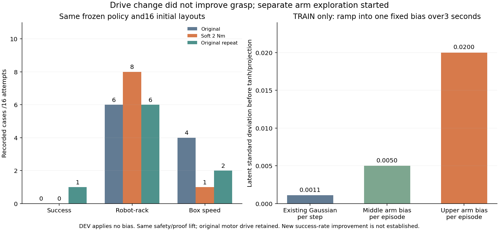

새 GPU3 분기 `staged_episode_arm_bias_pgs128_gpu3_20261005_034139`를 시작했다.
실제 child는 `batch_sac_20261005_034139_08913c`,128env,
`CUDA_VISIBLE_DEVICES=3`/내부cuda:0/renderer physical3/multiGPU off다.
기존 GPU0/GPU3 학습과 다른 사용자 프로세스는 유지했다. 최초128-case DEV의
실제 step 진행과 actor2635/Q12588/replay438808, 평가 bias 없음도 확인했다.
이 DEV를 끝낸 뒤 TRAIN으로 진행하므로 시작 자체를 성능 개선으로 세지 않는다.

- 팔14개에만 에피소드별 작은 latent 편차를 뽑아3초 동안 천천히 진입하고 유지한다.
  중간σ0.005/상단σ0.02/표준정규 표본±2이며, 실제 명령은 기존 tanh와 ±0.05
  projector를 거친21개 목표다. Waist/head/torso/jaw의 sampler는 유지한다.
- TRAIN 수집만 바꾸며 actor/target 분포·Q action 좌표·entropy 목표는 유지한다.
  DEV/FINAL에서는 편차를 샘플링하지 않는다. 박스/base randomization,
  실제 구동·reward·안전·양손 파지/proof 성공 기준·waypoint를 유지한다.
- 완전한 Drive 백업이 검증된 닫힌 초기 입력에서 Q/actor/정규화/optimizer/counter와
  실제438808 TRAIN replay, 성공 bank826개 row를 그대로 복제했다. 새 replay의
  tensor 동일성과 원본 파일 SHA256 불변을 확인했다. 실제1024개 TRAIN 관측에서
  greedy policy가 정확히 같았고, 새 optimizer 업데이트는0이다. 선택 actor weights의
  source counter3389와 matching Q 분기의 actor counter2635/Q12588를 구분한다.
- 모델·manifest·초기화 audit의 Drive 크기/MD5 검증 뒤 시작했다.3.62GB 초기 replay
  전체 업로드는 시작 시 진행 중으로 표시했으며 미검증 입력을 정리하지 않는다.
  관리자는300초마다 기존 연결로 체크포인트를 검증하고 최근2개를 보관하며 종료
  로그까지 업로드한다. 현재 검증 상태는 입력 receipt와 실행 부모 status로 확인한다.

관련 CPU 테스트41개가 통과했다. Warmup/학습/평가 분리, 실제 binary jaw와
projected replay label, resume, held-phase/region/환경ID 검사 및 평가 RNG 보존을
확인했다. 이는 물리 성능 검증이 아니다. 기존 성공 유지 분기의 bank는4947row,
wave4 완료 당시 중간TRAIN12개 보관 사례였다. Bank는 구역당4096row 상한을
넘으면 오래된 whole episode를 제거하므로 보관 episode 수는 누적 성공 수와 다르다. 첫 학습 후
DEV는 앞서 기록한3/128 대 초기4/128로 개선되지 않았다. 새 편차 분기의 이후
같은 DEV를 확인하기 전에는 성공률 개선을 주장하지 않는다.

[설정·초기화 사용법](RL_V2_STAGED_GOAL_SAC.md#에피소드-동안-유지하는-팔-탐색-편차),
[전체 비교·탐색 수치](assets/rl_v2_episode_arm_exploration_20261005.json)를 참고한다.

**03:51 추가 확인:** 기존 GPU3 성공 유지 분기의 TRAIN wave5는7/128 성공
(중간오른쪽5/중간왼쪽1/상단왼쪽1), 초기유효93/128이었다. 이 분기의 새 TRAIN
누적 성공은18회이며 bank는5957row/14개 보관 episode로 갱신됐다. **첫 상단
왼쪽 성공은 seed120241/env38**이다. 양손 pinch/stable/opposing/proof 모두true,
unsafe false,hold0.2667초,corrected rack clearance0.028316m를 확인했다.
초기 base lateral+0.07085m/outward+0.04687m/yaw+0.03968rad와 박스
lateral−0.03707m/yaw+0.01007rad/depth+0.000355m의 randomization을 유지했다.
실제 base 접근·정지 후 파지한 성공이며, 이는 새 팔 편차 실행의 결과가 아니다.
같은 DEV에서 재현되는지 다음 frozen 평가를 기다린다. 상단오른쪽 및 안정적인
전체 일반화는 여전히 미해결이고 independent FINAL은 사용하지 않았다.

### 10/05 04:20 — 상단 TRAIN 성공 경로 분석 / 기존 GPU0 자연 종료

Goal은 `randomization을 유지한 SAC 양손 파지 성공`으로 active다. GPU3의 성공
유지 분기와 새 팔 탐색 분기는 계속 실행 중이며, 목표를 완료 처리하지 않았다.
새 팔 탐색 초기 입력의 3.62GB 실제 replay까지 Drive 크기·MD5 검증을 완료했다.
모델·정규화·optimizer·replay는 같은 초기 분기에서 복원했고 새 인증은 만들지 않았다.

#### 첫 상단 성공이 최종 정책에도 남았는지 확인

닫힌 checkpoint18560의 실제 TRAIN bank에서 상단왼쪽 seed120241의598개
held-grasp 전이를 읽었다. 원본 checkpoint의 SHA256은 분석 전후 동일하며
분석 중 optimizer 업데이트와 평가 데이터 import는0이다. 성공은 양손 opposing
pinch/stable,hold0.2667초,corrected proof lift28.316mm,모든 unsafe flag false다.
양쪽 hand의 실제 두 pad 중 작은 힘은 terminal에서31.82N/13.55N으로5N 조건을
넘었다. Base/박스 randomization은 앞서 기록한 값을 유지했다.

| 실제 성공 경로의 시점 | 왼손 | 오른손 |
|---|---:|---:|
| Nominal assigned flap center 12cm 이내 | 14.37초 | 14.07초 |
| 실제 TRAIN jaw 첫 닫힘 | 20.87초 | 14.93초 |
| 실제 pinch 첫 확인 | 21.33초 | 15.43초 |
| 최종 greedy 정책을 같은 기록 관측에 적용한 첫 닫힘 | 20.87초 | 20.83초 |

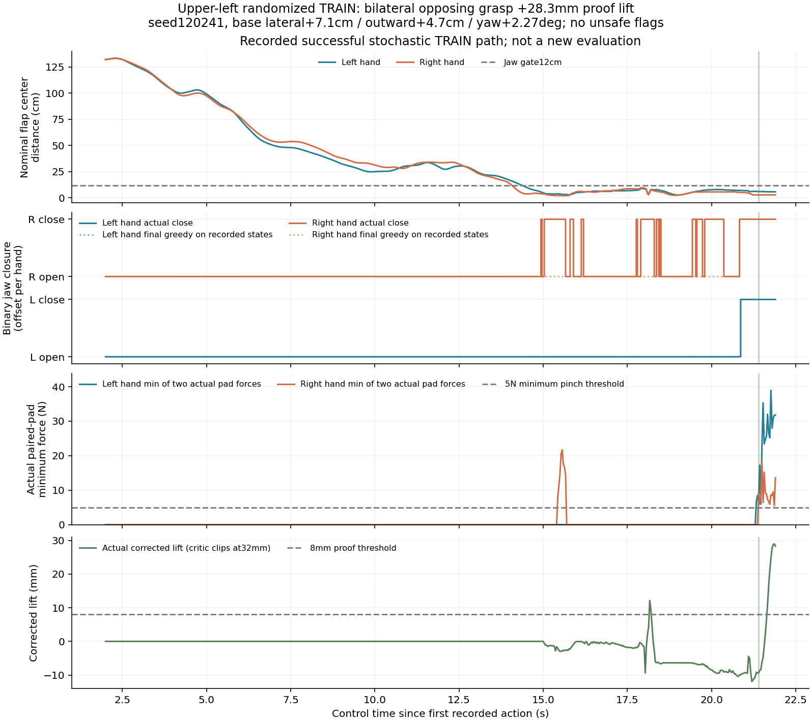

오른손 실제 명령과 최종 greedy 명령은598개 전이 중66개에서 달랐다. Body 목표의
평균 절대 차이는 normalized goal 좌표에서0.000703이다. **이는 기록된 성공
관측에 대한 offline 비교이며 새 물리 평가가 아니다.** 탐색으로 찾은 조기 오른손
닫힘이 평가 정책에 충분히 남지 않았을 가능성을 제시하지만 인과관계를 확정하지
않는다. 그래프의 거리는 nominal flap midpoint이고 실제 변형된 패널 표면 거리가
아니다. 접촉력/lift는 privileged critic 측정값이며 actor 입력으로 새로 넣지 않았다.
양손 pinch 이전의 일시적인8mm lift만으로 성공을 선언하지 않는다.

상단 성공 bank는 wave5 종료 때 추가됐다. 이어지는 wave6은 frozen DEV라
학습하지 않으며, 성공 유지 auxiliary 학습에 이 상단 bank가 쓰이는 첫 다음 wave는
TRAIN wave7이다. 아직 그 학습을 거치지 않은 상태만 보고 retention weight를
다시 바꾸지 않는다. [실제 성공 전이와 시점 증거](assets/rl_v2_first_upper_train_trace_20261005.json).

#### 오래 학습한 기존 GPU0은 성공 정책을 유지하지 못함

기존 `staged_hybrid_aligned_resume_pgs128_gpu0_20261004_214747`는26개 wave를
자연 종료했고 exit0,writer 종료,GPU0에 compute process 없음이 확인됐다.
Actor8547/Q36234 updates,새 실제 TRAIN835560행을 모았지만 같은128-case DEV
성공은2→5→5→2→1→5→5→0→0이었다. 마지막 독립 FINAL도0/128,초기 유효93/128,
robot-rack35/box-speed9/box-lift3/box-drop1/workspace1회였다(원인 중복 가능).
Frozen prior의 가중치가0이 된 오래된 분기이며 actual success bank가 없다.
단순한 추가 학습만으로 개선되지 않았다는 근거이지 모든 SAC가 불가능하다는
결론은 아니다. 이 기존 분기의 FINAL은 이미 사용했으며 학습 데이터로 재사용하지
않는다. GPU3 두 분기의 독립 FINAL은 아직 사용하지 않았다.
[종료 wave·구역별 성공·안전 원인](assets/rl_v2_original_aligned_final_20261005.json).
닫힌 로그/대용량 replay의 최종 업로드가 끝날 때까지 기존 CPU 관리자를 유지한다.

GPU0의 비어 있는 자원에서 source TRAIN seed120241을 actor4128/Q18560의
**frozen SAC 정책으로 재현**하는 단일 환경 진단을04:16에 시작했다. 부모는
`staged_upper_TRAIN_frozen_reproduction_gpu0_20261005_041656`다. CUDA isolation,
PGS/+6cm upright torso/원래 그리퍼 drive/reward/안전/waypoint를 그대로 사용한다.
Snapshot·manifest·정확한 TRAIN layout의 Drive 검증 후 시작했으며 VR/live IK나
기록 명령의 open-loop 재생은 쓰지 않는다. 성공했던 TRAIN case를 재현하는
진단이므로 독립 일반화 평가로 세지 않는다. 실제 H.264 video와 접촉/실패 원인을
종료 후 보관하고 Drive 체크섬을 검증한다. 다른 실행에는 종료 신호를 보내지 않았다.

**04:21 추가 확인:** 새 팔 탐색 분기의 학습 전 frozen DEV wave0는3/128,
초기 유효100/128이었다. 중간왼쪽1/오른쪽1/상단왼쪽1이며 상단오른쪽은0이다.
상단왼쪽 seed121231은 양손 pinch/stable/opposing/proof,hold0.2667초,
corrected lift25.684mm,unsafe false로 성공했다. 이는 actor2635/Q12588에서
**새 탐색 학습 전에 얻은 기준선**이며 팔 탐색 변경의 개선으로 세지 않는다.
기존 selected actor weights의 source counter3389와 복원된 matching 분기 counter를
구분한다. DEV 전이는 성공 bank/Q/replay에 넣지 않았다.

새 분기의 TRAIN wave1 step61에서 실제29행,actor2639/Q12604로 증가했고
팔 편차의 held-env8개 초기화와 nonzero bias를 확인했다. Staging 동안에는 편차가
없으며 held clock을 따라 점진적으로 커진다. 기존 성공 유지 분기의 DEV wave6은
3/128(상단0)이어서 그 분기의 DEV 추세는4→3→3/128이다. 아직 평가 개선은
확인되지 않았다. Wave7 이후 상단 TRAIN bank가 actor auxiliary에도 쓰이는지를
확인하고 다음 같은 DEV를 비교한다. Bank sampler는 보관 행 수 비율로 뽑지 않고
성공이 있는 구역 사이를 균등 배분한다.
[양쪽 완료 DEV의 전체 초기 배치·성공/실패 증거와 실제 TRAIN 시작 snapshot](assets/rl_v2_episode_arm_first_dev_20261005.json).

### 10/05 04:36 — 상단왼쪽 frozen SAC 실제 재현 성공

앞서 시작한 GPU0 단일 환경에서 source TRAIN seed120241을 actor4128/Q18560의
frozen SAC로 다시 실행해 **성공했다.** 실제650 control steps(21.667초),양손
opposing pinch/stable,hold0.2667초,corrected proof lift29.307mm이며 unsafe/invalid
reset/time-out은0이다. 원래 box/base randomization과 physical contract를 유지했다.
실행 중 actor/Q 업데이트0,replay0,VR/live IK/기록 action 실행 없음이 확인됐다.

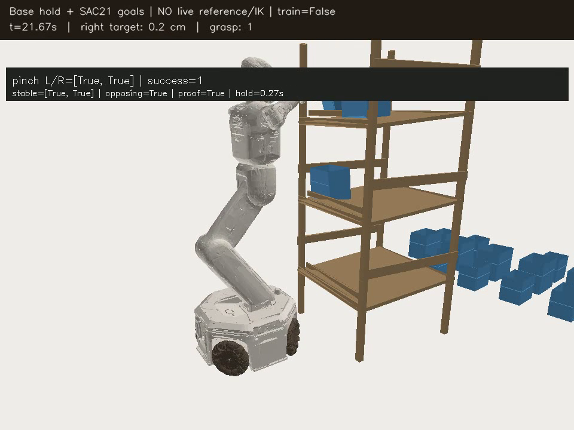

실제 오른손 첫 pinch는21.20초,왼손/양손 첫 pinch는21.43초였다. 원래 TRAIN
성공의 오른손15.43초 첫 pinch보다 늦어도 이번 재현은 성공했다. 따라서 조기
오른손 닫힘의 차이만으로 이 배치의 실패를 설명할 수 없으며,앞선 offline 차이는
성공 실패의 확정 원인이 아니다. Policy가 이 **seen TRAIN case**를 재현했다는
증거다. 반복 성공률,상단오른쪽,전체 새로운 초기 상태의 일반화는 여전히 미해결이다.

영상은1.69MB/110frames의H.264(avc1)/yuv420p/faststart MP4로,전체 디코딩을
확인했다. 실행 exit0와 writer 종료 후 HDF/MP4/manifest/metrics/console 로그의
Drive 크기·MD5 검증이 끝났고,추가 terminal PNG도 같은 방식으로 검증했다.
Notion에는 native video와 image로 보관한다. 실행 child의`policy.mp4`를 로컬에서
재생할 수 있다. [접촉·hold·lift·실행/보관 증거](assets/rl_v2_upper_frozen_reproduction_20261005.json).

GPU3 성공 유지 분기는 TRAIN wave7로 진행했고 실제 actor4237/Q18996/new TRAIN
215834행을 확인했다. 상단 bank가 포함된 균등 구역 샘플을 쓰는 auxiliary 학습도
시작했다. 새 팔 탐색 분기는 TRAIN wave1 step421,actor2819/Q13324/new TRAIN
28894행이며 실제 편차 RMS0.01421/max0.04를 확인했다(projector 이전 latent 단위).
두 분기를 유지하며 다음 DEV를 확인한다. 현재 Goal은active다.

다음 GPU0 진단은 상단오른쪽의 완전·유효·안전한 TRAIN 실패 중 가장 작은
environment ID의 seed120332를 선택했다. Distance/reward 기준으로 우수 배치를
고르거나 DEV/FINAL 데이터를 학습에 넣지 않았다. 원래 시도는810steps time-out,
양손 pinch false,실제 flap 거리4.20/6.58cm,unsafe false였다. 새 부모는
`staged_upper_RIGHT_TRAIN_frozen_diagnostic_gpu0_20261005_043940`이며
checkpoint18560 snapshot/layout/manifest를 Drive 검증한 후04:39에 시작했다.
GPU0 단독 frozen SAC/영상·접촉 진단이고 기존 GPU3 TRAIN은 계속 유지한다.

### 10/05 05:16 — 상단오른쪽 안전한 실패의 접촉 분석과 TRAIN 데이터 보존

상단오른쪽 TRAIN seed120332의 frozen 진단은858 control steps 후 time-out이었다.
Unsafe/invalid reset은0이며 양손 모두 qualified pinch가 한 번도 없었다.
Actor4128/Q18560은 실행 중 변하지 않았다. 이는 진단이며 학습 데이터로 가져오지 않는다.

| 확인한 항목 | 실제 결과 | 의미 |
|---|---|---|
| 왼손 패드별 최대 힘 | 2.384N / 0N | 양쪽5N 조건에 도달하지 못함 |
| 오른손 패드별 최대 힘 | 0N / 45.376N | 한쪽 접촉만 강하며 flap pinch가 아님 |
| Terminal hand→assigned 실제 midpoint 거리 | 12.446 / 9.413cm | 양손 접촉/정렬을 확보하지 못함 |
| 왼쪽 flap actual−nominal midpoint 차이 | 27.978mm | 박스 root 기준 nominal 목표와 실제 패널이 다름 |
| 왼쪽 flap normal 차이 | 32.496도 | 실제 패널이 회전한 상태 |

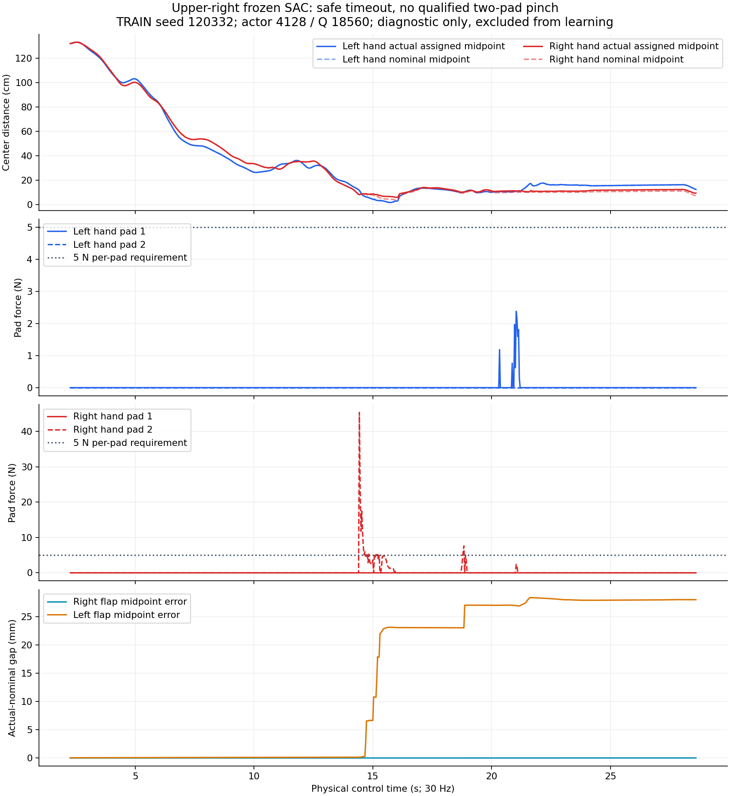

오른손의 단일 패드 접촉 이후 flap midpoint 차이가 커졌다. 이 사례는 안전 종료나
proof-lift 기준 이전의 **접촉 포획 실패**다. 그러나 flap 변형만이 모든 상단오른쪽
실패의 원인이라고 확정하지 않는다. 작은 nearest-surface 거리나 단일 패드 힘으로
성공을 선언하지 않으며 실제 양쪽 패드와 opposing/stable/hold/lift 기준을 유지한다.
H.264(avc1)/yuv420p/faststart MP4144frames 전체 디코딩,실행 exit0,writer 종료,
HDF/영상/로그의 최종 Drive 검증이 완료됐다.
[실제 접촉·기하·파일 크기/MD5 증거](assets/rl_v2_upper_right_frozen_failure_20261005.json).

#### 과거 상단오른쪽 성공 데이터의 유실을 구분

기존 aligned 분기는 TRAIN wave2 seed120352에서 상단오른쪽을 실제로 성공했으며,
corrected lift12.43mm였다. 상단오른쪽이 한 번도 성공하지 않은 것은 아니다.
그 성공의 native HDF는 남아 있지만 최신 bounded500k Q replay에는 해당 경로의
요청 goal21 전이가 남아 있지 않았다. HDF의 physical action24는 projector/속도
포화 뒤의 명령이므로 이를 역산해 성공 goal label을 만들지 않는다.

`--collect-train-goals`를 추가해 실행 전에 선언한 TRAIN 배치의 frozen SAC 요청
goal21과 실제 pre/next actor480·critic539,reward,termination을 따로 보존한다.
Optimizer 업데이트0,binary jaw/held phase/Q 연속성/원래 TRAIN identity를 검사한다.
성공 bank는 실제 안전한 양손 파지·stable hold·corrected lift 조건을 모두 만족한
완료 성공만 받는다. DEV/FINAL/live teacher/기록 action 실행은 거부한다.
관련 provenance/연속성 테스트와 기존 bank 테스트21개가 통과했고 기존 기본 동작은 유지했다.
[수집 사용법과 백업](RL_V2_STAGED_GOAL_SAC.md#frozen-sac의-train-목표-전이-수집).

원래 TRAIN seed120352를 selected actor3389/Q15602로 다시 수집하는 GPU0 실행을
05:16에 시작했다. 부모는`staged_upper_RIGHT_TRAIN_goal_collection_gpu0_20261005_051636`이다.
Source checkpoint의 Drive 크기·MD5와 physical contract 일치를 확인하고
immutable snapshot/layout/manifest를 먼저 업로드·검증했다. Dynamic box와 원래
base/box randomization,PGS/구동/보상/안전/waypoint를 유지한다. Step301까지 실제
held 전이를 모으며 actor/Q counter 불변을 확인했다. 아직 성공 결과가 아니며
독립 일반화 평가로 세지 않는다. 생성만으로 기존 GPU3 학습에 자동 투입되지 않는다.

GPU3 성공 유지 분기는 TRAIN wave7에서6/128(중간오른쪽4/중간왼쪽1/상단왼쪽1)을
성공했다. 현재 bank6975행에는 중간오른쪽9/중간왼쪽5/상단왼쪽2개 episode,
상단오른쪽0개가 있다. DEV 추세4→3→3/128이므로 일반화 개선은 아직 확인되지 않았다.
새 팔 탐색 분기 TRAIN wave1은2/128(중간왼쪽1/오른쪽1)이었으며,
학습 전 DEV3/128 이후의 같은 DEV를 기다린다. 두 GPU3 TRAIN은 계속 진행한다.

**05:37 후속:** seed120352의 greedy TRAIN 수집은 안전한 time-out으로 끝났다.
정확한 held 목표 전이784행과 actor3389/Q15602 불변,optimizer0,binary jaw,
연속 pre/next 문맥을 확인했다. 성공 bank는0행이며 기존 학습에 넣지 않았다.
닫힌 goal artifact/HDF/영상/manifest/metrics/console의 Drive 크기·MD5를 다시
직접 대조했다. [수집·실패·파일별 검증 증거](assets/rl_v2_upper_right_train_goal_collection_20261005.json).
과거 탐색 TRAIN 성공을 greedy 정책이 재현했다고 주장하지 않는다.

새 선택 옵션은 frozen **가중치**를 유지하며 checkpoint의 기존 TRAIN 탐색을
샘플링한다. 일반 TRAIN warmup과 DEV/FINAL greedy/RNG는 유지하고 명시적
TRAIN 수집에서만 빈 replay warmup을 우회한다. Gaussian/AR1/binary jaw/기존
episode arm 설정은 그대로이며 탐색 크기를 바꾸지 않는다. Sampling mode/seed를
출처에 기록한다. Frozen 수집에서 실제 행동 변화·binary jaw·RNG 사용·가중치/
normalizer/Q/replay/counter 불변과 기본 평가 보존을 검사했고 관련35개 테스트가 통과했다.

동일 TRAIN seed120352를 behavior seed120352로 수집하는 새 부모
`staged_upper_RIGHT_TRAIN_exploration_collection_gpu0_20261005_053744`를05:37에 시작했다.
이전 writer/백업 종료와 GPU0 여유를 확인하고 새 immutable input snapshot을
Drive 검증한 뒤 실행했다. Optimizer0인 TRAIN 데이터 수집이며 성공 결과나
독립 평가로 세지 않는다. GPU3 두 분기는 각각 다음 frozen DEV wave9/wave3를
진행 중이다. 기존 성공 유지 TRAIN wave8은3/128(중간오른쪽3),새 팔 탐색 TRAIN
wave2는2/128(중간왼쪽1/오른쪽1)이었다.


### 10/05 06:37 · DEV7/128와 실제 물리명령 SAC 비교

성공 유지 GPU3 분기의 같은 DEV는4→3→3→7/128로 상승했다.
마지막7개는 중간오른쪽5/중간왼쪽1/상단왼쪽1이며 상단오른쪽0이다.
직전DEV의 중간오른쪽 성공3개를 모두 유지하고4개를 더 성공했다.
작은 반복DEV 비교이며 네 영역의 독립 일반화 성공이나 통계적으로 확정된
개선으로 해석하지 않는다. Episode arm bias 분기의DEV3→1/128은 개선되지 않았다.
두 GPU3 실행은 계속 유지한다.

상단오른쪽 TRAINseed120352를 frozen checkpoint 탐색으로 재수집한 GPU0 실행도
안전한time-out으로 끝났다. 정확한 held784행/optimizer0/성공 bank0이며
양손 성공 기준을 완화하거나 실패 데이터를 성공으로 넣지 않았다.

기존 bounded goal replay에서 사라진 원본TRAIN 성공13episode의 literal
physical24 명령과 전체pre/next/reward/종료/초기state를 별도27MB HDF로
보존하고 Drive 크기·MD5를 검증했다. 실제 body21로 구성한 held5737행은
중간오른쪽9episode/3716행,중간왼쪽2/820,상단오른쪽1/603,상단왼쪽1/598이다.
잘린 physical명령의 inverse goal21 label은 만들지 않는다.

선택한 성공 유지 actor4865의 NN만 frozen physical command prior로 쓰고
Q/critic normalization/optimizer를 새로 초기화하는 별도SAC 분기를 추가했다.
Actual command21를 Q 입력으로 사용하여 원본TRAIN 성공을 직접 활용한다.
Init greedy 명령이 frozen prior와 같음을 실제5737행에서 확인했고,
heldout/probe/unsafe/변경된base feedback/실제terminal evidence/중복 경로/
재개·frozen 평가·projected physical loss 관련51개 테스트가 통과했다.
이 초기화는 새 물리 성공이 아니다.

GPU0/CUDA_VISIBLE_DEVICES=0/128env 새 부모는
`physical_body_SAC_pgs128_gpu0_20261005_063724`,child는
`batch_sac_20261005_063739_dc72fe`다. 초기NN/checkpoint/full literal replay와
wave입력은 먼저 Drive검증했다. 기존TRAIN/DEV는 같고FINAL은 사전 선언한
새seed namespace2026100500을 사용한다. Dynamic box/base·box randomization,
PGS/구동/중력보상/보상/양손pinch+hold+corrected8mm/안전은 같다.

종료된 원본aligned 실행의6GB fullHDF만 Drivesize·MD5와writer/service 종료를
다시 확인하고 로컬에서 정리해 여유를 약15GiB로 늘렸다. 성공13개의literal
corpus,checkpoint/replay/logs와 다른 사용자·실행중 파일/프로세스는 보존했다.
[설계·사용법·보관](RL_V2_PHYSICAL_BODY_SAC.md),
[DEV·TRAIN·초기화·checksum·source digest 증거](assets/rl_v2_physical_body_sac_initial_20261005.json).


### 10/05 07:20 · 종료된 pose의 Q bootstrap 오류 수정과 재개

GPU0physical분기의첫DEV는4/128(중간오른쪽3·상단왼쪽1),actor/Q0이었다.
원본actor4865의7/128을그대로재현하지못했으므로학습개선으로해석하지않는다.
동일CPU관측5737행에서기존goal controller와newprior의body/jaw명령이bitwise
같고base차이<1e-5임은독립적으로대조했다. 물리재현민감성은별도문제로남는다.

첫TRAIN은Q925/실제43202행에서종료됐다. 원인은Q다음상태행에포함된
singular pose1행이다. 해당행은이미terminated였고currentpose가singular인
행은0이었다. 종료행bootstrap을0으로건너뛰고body명령계산에서사용하지않는
base solver를분리했다. Livefullbase의singularity guard는보존한다.
실제실패replay를포함하는CPU Q/actor업데이트가유한했고회귀테스트55개가통과했다.
실패NN/replay/HDF/닫힌로그Drive검증후sourcewriter/manager종료를확인하고
`physical_body_SAC_terminal_fixed_resume_pgs128_gpu0_20261005_071955`에서
physicalQ925·optimizer·실제데이터를재개했다. CPU진단NN은실행에가져오지않는다.

별도gain2비교도GPU0/128env로시작했다. 원본중간왼쪽성공의body명령원소21.1%가
gain0.5에서표현범위밖이었고gain2는네영역5737행의모든명령을표현할수있다.
상단오른쪽범위밖은원래0%이므로이문제를상단오른쪽원인으로단정하지않는다.
Latentstd/LR을gain역수로,prior0MSE계수를gain제곱으로조정해작은physical
탐색규모를유지한다. Full-range부모는
`physical_body_SAC_fullrange_pgs128_gpu0_20261005_072246`이며입력전체를먼저
Drive검증했고독립FINALnamespace2026104500을미리선언했다. 기존두GPU3분기를
유지하며다른사용자의프로세스는건드리지않았다.

종료된원본alignedgoalreplay4.12GB도Drive를다시대조해로컬정리했다.
원본latest2checkpoint/logs와actual13성공corpus/현재physicalreplay는보존한다.
[실제오류·범위·재개증거](assets/rl_v2_physical_body_terminal_fix_and_support_20261005.json),
[설계·두옵션·사용법](RL_V2_PHYSICAL_BODY_SAC.md).
