# V2 grasp SAC: 중간·위 선반의 좌우 네 구역 (2026-10-04)

양손이 서로 다른 flap을 파지하는 기존 성공 조건과 동적 박스를 유지한다.
Rack10N/주변 장애물5N, self-collision off, S63/Leju twofinger,
upright torso XZ와 중력보상 설정은 그대로다. Curriculum을 추가하지 않는다.
실제 초기 base XY/yaw가 다른 배치에서 성공을 반복 확인하는 것이 목표다.

## 완료된 기존 방식 비교

아래 수치는 각 실행의 마지막 **학습 없는 고정 정책 평가**다. 개발 평가로
회귀한 actor를 복구한 실행도 포함하므로, 모두 마지막 업데이트 정책의 개선이라고
해석하지 않는다. 기존 두 물리 성공 seed와 아래 모든 목표는 **왼쪽**이었다.

| 실행 | 실제 SAC 훈련 성공 | 독립 final 성공 | Final 안전 위반 | 한계 |
|---|---:|---:|---:|---|
| GPU3 중간 왼쪽 guarded |48/48|10/12|0|0.40m torso/legacy goal 좌표, 다른 분기와 Q 혼용 금지 |
| GPU2 중간·위 왼쪽 mixed guarded |5/16|7/8|0|Actor 복구2회; 중간4/4·위3/4 |
| GPU1 BC 제약 없는 지연 actor |2/4|1/2|0|위 선반 시간초과; actor 복구1회 |
| GPU0 기존 BC guard 유지 대조 |1/4|1/2|0|Actor 복구1회 |
| GPU0 imitation 해제·radius 유지 |0/4|1/2|0|Actor 복구1회 |
| GPU0 imitation·radius 모두 해제 |0/4|1/2|1|훈련 안전 위반4/4; actor 복구1회 |

각 실행은 종료 후 로그·체크포인트의 Drive 업로드 검증을 마쳤다.
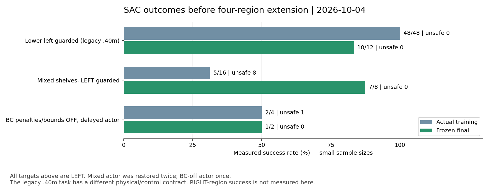

그림의 [실측 결과와 각 final 배치](assets/rl_v2_final_sac_comparisons_20261004.json)를
별도로 보관한다. .40m legacy와 .46m mixed의 서로 다른 계약도 표시했다.
기존 혼합 정책의7/8은 오른쪽 일반화나 BC 없이 안정적인 SAC 개선의 증거가 아니다.
BC 제약 없는 SAC는 초기 개발2/2에서도 훈련 후 성능을 유지하지 못했다.
기존 혼합 정책의 성공을 먼저 네 구역으로 확장하고, 전체 base 제어로 개선이
유지되지 않으면 [구역별 base 정렬·정지/유지 후 파지](RL_V2_SAC_RECOVERY_20261003.md)로 전환한다.

## 실제 오른쪽 배치를 만드는 reset 옵션

`GraspLayout`에 다음 JSON 옵션을 추가했다. 기존 JSON은 기존 변환과 직렬화를 유지한다.

```json
{
  "seed": 12100,
  "split": "train",
  "lateral_m": -0.025,
  "distractors": [5, 9],
  "target_region": "shelf_2_right",
  "align_initial_base_to_region": true,
  "base_lateral_m": 0.12,
  "base_outward_m": 0.16,
  "base_yaw_rad": 0.10
}
```

- `target_region`: `shelf_2_left/right` 또는 `shelf_3_left/right`.
  같은 선반의 반대편으로만 바꾸며 박스 종류·크기·깊이 셀·높이·자세를 유지한다.
  실제 Rack USD의 비대칭 중심 X를 기준으로 박스 위치를 옮긴다.
  Source target4→right target1, upper target9→right target6으로 logical ID,
  region token, selected one-hot, active mask와 물리 asset pool을 일치시킨다.
- Regional recipe의 `lateral_m=-0.02..-0.04`는 두 구역 모두 중앙 방향2..4cm로
  적용한다. 기존 recipe는 원래 signed rack-X 변위 그대로다.
- `align_initial_base_to_region=true`: source의 **초기** 로봇을 구역 변경과 같은
  거리만큼 평행 이동한 초기 template을 쓰고, 그 위에 실제 XY/yaw randomization을
  적용한다. 성공 순간의 팔·그리퍼·접촉 상태를 가져오지 않는다. 이 옵션은
  base가 멀리서 구역까지 이동한 성공을 뜻하지 않으며, 그 범위는 별도 평가가 필요하다.
- `false`이면 구역 변경만으로 base가 이동하지 않는다. 명시한 random offset만 적용한다.
- Active box footprint는 settling 전에도 모두 검사하고 이후 PhysX shelf/region guard를
  그대로 실행한다. Target과 같은 distractor ID나 선반을 바꾸는 remap은 거부한다.

이 기능은 새 **초기 상태 설명**이다. 과거 데모·reward·action·transition을 반사하거나
새 성공 데이터로 취급하지 않는다. 실제 rollout에서 관측한 transition만 SAC replay에 넣는다.

## 배치 생성과 학습

환경은 `env_isaaclab_232`다. 이 helper는 GPU나 Isaac runtime을 쓰지 않는다.
이미 존재하는 폴더는 덮어쓰지 않으므로 실험마다 고유 경로를 지정한다.

```bash
CUDA_VISIBLE_DEVICES='' PYTHONPATH=src:scripts/rl \
  python scripts/rl/prepare_region_grasp_layouts.py \
  --output-dir /absolute/path/to/unique-region-layouts \
  --seed-origin 12000 --train-per-region 4 \
  --development-per-region 1 --eval-per-region 4
```

네 구역이 순서대로 균형 있게 배치된다. Train/development/final seed namespace는
서로 겹치지 않으며, reset source episode는 `reference_episode_map.json`에 기록한다.
중간: base X±20cm, outward3..25cm, yaw±15°.
위: base X±8cm, outward3..10cm, yaw±5°, box depth±6mm.
박스 inward2..4cm/yaw±1°와 주변 박스 샘플링은 유지한다.
현재 작은 박스 검증이며 중간 선반 medium 박스 일반화는 아직 확인하지 않았다.

`layout_residual_with_drive.py --policy-mode pose-goal --gpu 3`에 생성 폴더와
`--reference-episode-map`을 전달한다. Frozen SAC 평가에도
`--pose-student-native-seed`로 **matching physical contract의 실제 성공 seed**를
명시해야 한다. 해당 audit 인자가 없으면 이제 Isaac 실행 전에 거부한다.

개발 성능은 reset episode(선반)뿐 아니라 `target_region`별로 검사한다.
오른쪽 성공 증가가 왼쪽 실패 증가를 가리는 경우도 actor 복구 대상으로 처리한다.
복구는 최신 실제 TRAIN replay/Q/업데이트 횟수를 유지하며 actor만 되돌린다.
Final holdout에는 optimizer update가 없고 해당 데이터를 다음 학습 seed로 쓰지 않는다.

기존 Drive 연결로5분마다 업로드하고 체크섬 검증된 오래된 체크포인트만 정리한다.
최근2개와 최근 검증된2개를 보호하고, writers가 끝난 뒤 로그도 업로드·검증한다.
[Drive 저장·인증·보존 조건](RL_GOOGLE_DRIVE.md)을 따른다.

## 현재 실행과 결과 해석

10/04 06:28부터 GPU3에서 기존 혼합 guarded 정책의 네 구역 frozen 비교를 진행한다.
부모 실행 폴더는
`artifacts/rl/drive_runs/four_region_frozen_sac_gpu3_20261004_062812`다.
초기 시도는 필수 native seed audit 인자 누락으로 정책 실행 전에 종료했고
실패 로그의 최종 업로드를 검증한 뒤 새 고유 폴더로 재실행했다.
이전 실패를 파지 실패나 optimizer update로 집계하지 않는다.

이어질 SAC 준비 모델은 mixed final checkpoint16910의 네트워크·Q·normalizer·실제
TRAIN replay·탐색 분포를 유지하고 actor LR1e−7·critic4회당 actor1회로 분기한다.
BC neural anchor weight10/radius0.05를 유지하므로 BC 제약 없는 실행은 아니다.
Demo replay fade는 critic 진행량에 연결해 actor 지연 때문에 사용 기간이 늘어나지 않는다.
등록 당시 오른쪽 파지 성공이나 네 구역 최종 성공률은 확인 전이었다.
이후의 실제 결과는 아래 시각별 기록을 따른다.

준비 모델·실제 replay의 Drive 체크섬 검증 후 새 관리 서비스도 시작했다.
부모는 `artifacts/rl/drive_runs/four_region_guarded_sac_gpu3_20261004_063608`이며,
등록 당시 frozen 평가와 최종 백업이 종료될 때까지 GPU 자식을 만들지 않았다.
이후 같은 GPU3에서 train16배치×3pass=48회, 개발4회×13block=52회,
새 independent final16회, 총116회를 순서대로 수행한다.
개발 배치와 final 배치는 서로 분리했다. 종료 시간을 성공 보장으로 표현하지 않는다.
코드 검사35개와 요청한36개 배치의 초기 footprint 검사만 통과한 상태에서 등록했다.

### 첫 실제 오른쪽 파지 확인 (06:43)

Frozen baseline의 중간 왼쪽 seed17000과 오른쪽 seed17100은 각각409tick 성공,
안전 위반0·invalid reset0이었다. 이 두 배치에는 optimizer update가 없으며
학습 seed로 쓰지 않는다. 위 좌우는 아직 평가 중이고 네 구역 전체 성공률은 미확정이다.

오른쪽의 실제 마지막 판정은 서로 다른 flap[0,1], 양손 pinch/stable=True,
proof lift=True, rack clearance0.0312m, hold0.267s였다.
[배치·실제 초기 상태·성공 판정·모델·물리 계약](assets/rl_v2_middle_right_frozen_success_20261004.json)을
기록했고, 실행 종료·영상·로그의 Drive 검증을 마쳤다.

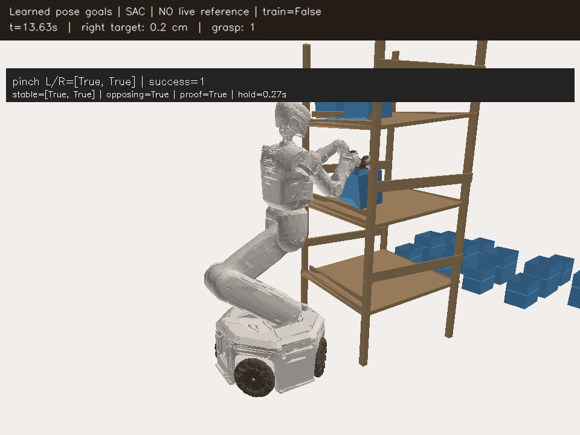

[중간 오른쪽 성공 영상(H264 MP4)](assets/rl_v2_middle_right_frozen_success_20261004.mp4).
H264/avc1·yuv420p·faststart와 전체 decode 검증을 통과한 원본을 복사했다.
Notion 요약 하위페이지에도 외부 링크가 아닌 native video/image로 업로드했다.
이 결과는 기존 mixed 정책의 첫 오른쪽 배치 성공이며 새로운 오른쪽 SAC 업데이트가
성능을 높였다는 증거나 네 구역 일반화의 완료로 표현하지 않는다.

### 네 구역 frozen baseline 종료와 실제 SAC 업데이트 (07:43)

Baseline4/4와 종료 로그·영상·데이터의 Drive 검증을 마쳤다.

| 새 baseline 구역 | 실제 종료 step | 성공 | 실패 |
|---|---:|---:|---|
| 중간 왼쪽 |409|1|없음 |
| 중간 오른쪽 |409|1|없음 |
| 위 왼쪽 |893|0|시간초과 |
| 위 오른쪽 |900|0|시간초과 |

전체2/4·안전 위반0·invalid reset0이다. 상단은 일반화가 아직 부족하다.
위 왼쪽의 전체 경로에는 어느 손도 opposing pinch가 성립한 step이 없다.
왼손은 한 jaw에 최대24.66N, 오른손은 한 jaw에7.66N이 측정됐지만
각 반대 jaw는 전 경로에서0N이었다. 마지막에는 모든 jaw 힘이0N이었고
손–flap 표면 거리는5.33cm/1.80cm였다. 이 거리만으로 파지라고 판단하지 않는다.
Robot–rack 힘은 경로 전체0N으로, 이 실패는 충돌 종료가 아니다.

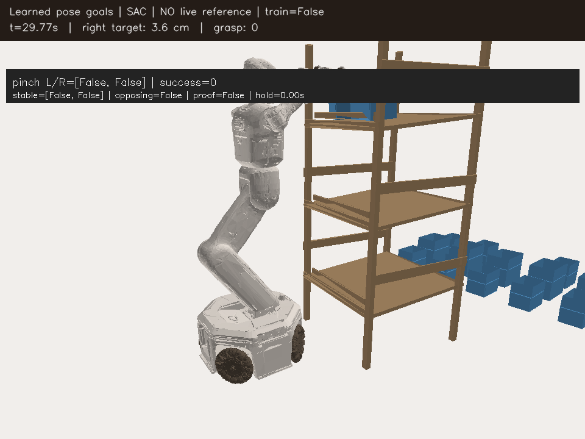

[상단 실패 영상(H264 MP4)](assets/rl_v2_upper_left_frozen_timeout_20261004.mp4)과
[전체 jaw별 peak·실제 마지막 상태·원본 경로](assets/rl_v2_upper_left_frozen_timeout_20261004.json)를 보관한다.
접근 중 한쪽 jaw가 눌린 뒤 박스 자세가 변했는데 양쪽에서 끼워 잡지 못하는
문제가 관측됐다. 시간 기반 prior를 따라가는 팔 목표가 이런 동적 상태 변화에
충분히 적응하지 못할 가능성이 있다. 이 해석을 중력보상 결함이나 입증된
단일 원인으로 단정하지 않는다. Root drive에도 현재 whole-body gravity
force/couple 보상과 attitude PD가 존재하는 것을 코드에서 확인했다.

GPU3 본 실행은 baseline 검증 후 현재 네 구역의 초기 개발 평가를 시작했다.
별도로 GPU0의 여유를 확인해 실제 SAC 업데이트 진단6회를 시작했다.
부모는 `artifacts/rl/drive_runs/four_region_actual_sac_diagnostic_gpu0_20261004_070118`이다.
이 진단은 TRAIN 중간 오른쪽12103·위 왼쪽12201을 쓰고 새 final27000..27300을
분리한다. 본 학습의 final14000..14303과 겹치지 않고 모델도 자동으로 교체하지 않는다.
첫 TRAIN 오른쪽은409tick 성공·unsafe0이며 **actor173회·critic692회**를 실제로
갱신했다(actor16910→17083, critic17410→18102). 실제 새 online409행을 기록했다.
이어질 상단 훈련과 훈련 후 frozen 평가로 성공 유지·개선을 판단한다.

07:57 현재 GPU0 진단의 두 TRAIN은1/2(중간 오른쪽 성공, 위 왼쪽 시간초과)이다.
Actor16910→17498로588회, critic은2,352회 추가 업데이트했다.
훈련 후 새 frozen4배치는 중간 왼쪽603tick robot–rack22.60N 충돌 실패,
중간 오른쪽409tick 성공, 위 왼쪽900tick 시간초과, 위 오른쪽589tick 성공으로
2/4·안전 위반1이며 실행 종료와 Drive 검증을 마쳤다.
이 비교는 baseline과 seed가 다르므로 바로 업데이트 회귀라고 단정하지 않는다.
진단 종료·백업 후 같은 seed27000을 업데이트 전 checkpoint16910으로 평가하도록
별도 GPU0 서비스를 등록했고07:52 실제 평가를 시작했다.
본 학습의 final 배치를 학습에 쓰지 않는다.
GPU3은 초기 개발 네 구역2/4·unsafe0를 마치고 실제48회 TRAIN 단계에 진입했다.
첫 중간 왼쪽12000·오른쪽12100 TRAIN 모두409tick 성공으로2/2·unsafe0이며
actor16910→17256으로346회 업데이트했다. 상단 TRAIN과 업데이트 후 개발 평가는
아직 남았으므로 이 첫 성공으로 SAC 일반화 개선을 선언하지 않는다.
본 실행의 개발 회귀 검사·actor 복구·Drive 백업은 그대로 유지한다.

Notion 요약 페이지에도 상단 실패 영상/사진을 native 업로드로 첨부하고
위 baseline과 실제 SAC 진단을 분리해 기록했다. 서버 실험 서비스는 실행 중이다.
채팅 native 목표 상태는 아직 `blocked`이고 제공된 도구에는 재개 기능이 없다.
자동 채팅 후속 점검이 복구됐다고 주장하지 않으며, 목표를 완료로 처리하지 않는다.

### 같은 초기 상태에서 SAC 회귀를 분리하고 base 분리 대안을 시험 (08:17)

새 final seed27000을 actor16910과17498로 각각 optimizer 없이 실행했다.
로봇·랙·모든 박스·drive/action controller의 초기 기록과 첫 actor/critic 관측 차이는
모두0이다. 업데이트 전에는409tick 성공·rack0N, 후에는603tick에
왼팔 `zarm_l4_link`–rack22.60N 충돌로 실패했다. 탐색 없이도 평균 동작이
회귀한 사례다. 안전 위반의 나머지 원인은 모두False였다.

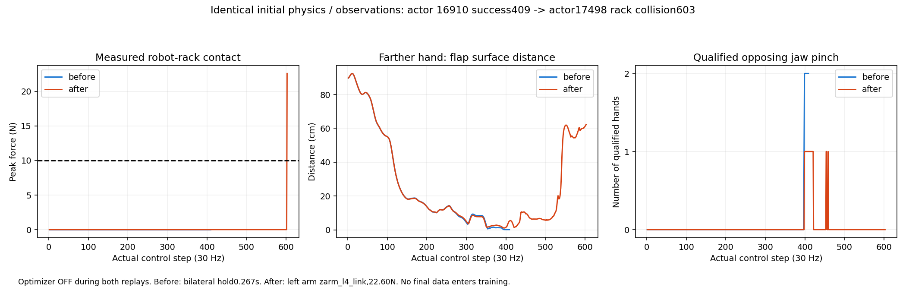

[업데이트 전 성공 영상](assets/rl_v2_four_region_matched_before_20261004.mp4),
[업데이트 후 실패 영상](assets/rl_v2_four_region_matched_after_20261004.mp4),
[초기 일치·성공·충돌·영상 인코딩 원자료](assets/rl_v2_four_region_matched_regression_20261004.json).
H264/avc1·yuv420p·faststart·전체 decode 검증 영상이며 실제 PhysX pose의 CPU mesh 재생이다.

같은 실제 성공 경로409행에 대한 **모델 출력 진단**에서는 목표 차이가
관절 최대0.0344rad·torso0.86mm·base XY1.60mm였다. 업데이트 후 Q는
이 경로의93.9% 상태에서 실패한 새 정책의 행동을 더 높게 예측했지만
평균 예측 차이는0.00422에 불과했다. 이를 실제 정책 return이나 개선으로
간주하지 않는다. 관절 목표 오차17차원의 국소 피드백 진단에서도 projected
최대 singular gain0.642·spectral radius0.125여서 명확한 자기증폭을 찾지 못했다.
이는 일부 TRAIN 관측의 국소 검사이며 전체 폐루프 안정성 증명이 아니다.
가상 transition이나 새 reward/Q row를 만들지 않았다.

위 오른쪽 seed27300은 업데이트 전592tick·후589tick으로 **모두 성공**했다.
따라서 훈련 후 상단 오른쪽 성공 자체로 새 일반화 능력을 획득했다고 주장하지 않는다.
GPU3 첫 네 TRAIN은 중간 좌우 성공·위 좌우 시간초과로2/4·unsafe0이다.
다음 개발 평가가 진행 중이며 구역별 회귀 검사·actor 복구를 유지한다.

대안은 `--staged-base-waypoints /absolute/path/to/templates.json`로 켜는
**frozen 물리 진단**으로 구현했다. 기본 기존 제어는 그대로다.

1. 성공 TRAIN에서 측정한 base–초기 box XY 차이와 rack 상대 yaw를 작업 위치
   **후보**로 사용한다. 좌우는 실제 선택 박스의 위치를 사용하며 로봇 자세를 반사하지 않는다.
2. 서로 다른 실제 초기 base XY/yaw에서 중립 팔·torso를 유지하고 열린 gripper로
   작업 위치까지 움직인다. 초기 성공 팔 자세를 넣거나 box를 고정하지 않는다.
3. XY오차8mm/yaw오차0.02rad, 실제 선속도0.01m/s·각속도0.025rad/s 미만이
   15 control step 연속 유지되면 frozen 파지 정책의 clock을0부터 시작한다.
4. 파지 중 base XY/yaw 목표를 계속 유지한다. 이동 중 충돌·정지 실패·전체30초
   시간초과도 동일한 task 실패다. 성공/충돌/보상/중력보상 조건은 변경하지 않는다.

이 옵션은 optimizer training과 같이 사용할 수 없다. Manifest/영상에
`frozen_neural_grasp_with_analytic_base_staging_NOT_new_staged_SAC`를 기록하고
새 collection source를 기존 goal replay importer에서 거부한다. 새 staged SAC는
phase/held waypoint/실행 목표가 포함된 계약과 그 제어에서 수집한 실제 경험으로
구현해야 하며, 지금 진단을 새 SAC 학습 성공으로 표현하지 않는다.
기존 upper/middle seed와 같은 small box만 허용하며 미측정 크기는 거부한다.

GPU0 새 진단 부모:
`artifacts/rl/drive_runs/staged_base_four_region_frozen_gpu0_20261004_081335`.
새 네 구역37000/37100/37200/37300으로 수행하며, 같은 checkpoint와 같은 배치에서
기존 whole-body 제어를 비교하는 부모
`artifacts/rl/drive_runs/whole_body_matched_staging_control_gpu0_20261004_081505`도
진단/백업 종료 후 이어 실행하도록 등록했다. 본 GPU3 학습은 유지한다.
첫 중간 왼쪽은88step에 실제 정지 확인 후 파지 단계에 진입했다.
아직 진단의 파지 결과는 없다. 관련22개 CPU 검사와 parser 문법 검사만 통과했다.

직접 사용할 때는 기존 frozen `replay_v2_grasp_reference.py`의 demo/manifest,
matching checkpoint/native seed/layout 인자에 아래를 추가한다. 공개 후보 JSON은
물리 travel `.06m` 및 small box에만 대응한다.

```bash
--staged-base-waypoints /absolute/path/to/HumanoidScene/docs/assets/rl_v2_staged_base_hold_candidates_20261004.json
```

Drive 관리자 `layout_residual_with_drive.py`에서도 `--evaluation-only`로 같은
인자를 전달할 수 있다. 기본 `CUDA_VISIBLE_DEVICES=<physical GPU>`를 지정하고
`--gpu`도 같은 번호로 맞춘다. 예전 whole-body replay/model을 staged SAC로
재개할 수 있다는 의미는 아니다.

### Base 분리 진단의 첫 실제 성공 (08:25)

첫 새 중간 왼쪽 seed37000은 **497tick 성공·rack0N·unsafe0**으로 종료됐고
영상·실제 데이터·로그의 Drive 검증까지 마쳤다.88step에 중립 팔 접근과15step
정지 조건을 통과한 뒤 파지 clock을0부터 실행했다. 마지막에는 서로 다른
flap[0,1], 양손 pinch/stable, proof lift, clearance3.91cm·hold0.267s였다.
초기 base offset은 X−6.69cm/out14.03cm/yaw−4.23°이며 박스 inward3.47cm/
yaw−0.53°·주변 박스를 유지했다. Base는 실제 초기 상태에서 움직였고
파지 중 위치 오차는 마지막0.044mm였다. 성공 팔 상태로 시작한 것이 아니다.

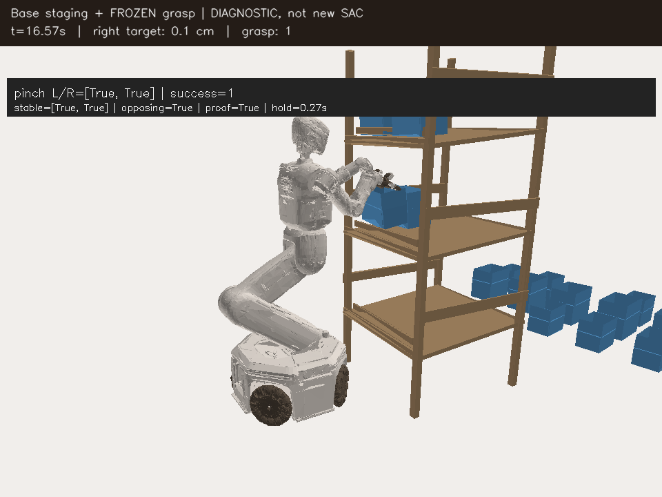

[실제 base 접근·정지·파지 영상](assets/rl_v2_staged_base_first_success_20261004.mp4),
[초기 상태·구역·후보·정지 조건·성공 판정](assets/rl_v2_staged_base_first_success_20261004.json).
Actor16910에 추가 optimizer update가 없었으므로 **base 제어 분리 + frozen
파지 정책의 물리 성공**이다. 새 staged SAC가 학습해 성공한 결과도 전체 네 구역
일반화도 아니다. 오른쪽·상단과 같은 배치의 기존 제어 비교는 계속 진행 중이다.

### Base 분리 완료 결과와 상단 안전 진입 진단 (09:00)

네 구역 base 분리 frozen 진단은 종료됐고 모든 실제 데이터/영상/로그의
Drive 검증을 마쳤다. **2/4 성공·안전 위반0**이며 상단은 아직 해결되지 않았다.

| 새 독립 배치 | 실제 결과 | 종료 control step |
|---|---|---:|
| 중간 왼쪽37000 | 양손 opposing flap 파지·proof lift 성공 | 497 |
| 중간 오른쪽37100 | 양손 opposing flap 파지·proof lift 성공 | 496 |
| 상단 왼쪽37200 | 시간초과 | 853 |
| 상단 오른쪽37300 | 시간초과 | 854 |

GPU0의 같은 배치/같은 actor16910 기존 whole-body 비교는08:50부터 이어
실행 중이다. 이 결과가 나오기 전 base 분리가 기존보다 좋다고 판단하지 않는다.
GPU3 본 SAC는 첫 TRAIN4개2/4·unsafe0, 같은 개발 네 구역 재평가2/4·unsafe0이며
초기 개발 결과와 같았다. 두 번째 TRAIN block을 진행 중이다.

상단을 위해 `StagedContactIKDiagnostic`과
`scripts/rl/staged_contact_with_drive.py`를 추가했다. 이 코드는 **물리 진단용
teacher이며 SAC actor 학습이나 standalone policy 성공으로 취급하지 않는다.**
성공한 현재 물리 TRAIN의 손–flap offset/회전만 보정 목표의 근거로 사용한다.
검증되지 않은 이전 VR reward나 가상 correction label을 Q에 넣지 않는다.

- 기본 `near-contact`: 기존 frozen 팔 접근에서 양손 목표 오차가 모두10cm
  미만이면 접촉 IK로 넘긴다. 이 조건에 도달하지 않으면 보정이 실행되지 않는다.
- `after-base-hold`: 실제 base 정지 확인 직후 열린 손으로 랙 앞 진입 위치를
  먼저 맞추고 접근·접촉을 수행한다. 먼 손을 바로 flap에 삽입하지 않는다.
- 공통: 실제 URDF/USD FK·TCP/Jacobian/관절 한계 일치를 확인한 bounded
  IK servo를 사용한다. 접촉 중 중립 rest로 당기지 않도록 실제 관절 자세를
  rest로 유지하고 base waypoint는 기존 staged 제어가 계속 유지한다.
- 양손 위치 오차15mm와 닫힘 축 오차0.15rad를 모두 만족해야 coordinated
  close를 제안한다. 이미 실제 pinch가 성립한 손은 닫힘을 유지한다.
  서로 다른 flap의 실제 opposing pinch3tick 확인 뒤 실제 TCP 기준25mm lift를
  제안한다. 이 마지막 확인은 privileged teacher 정보이며 actor 관측에 추가하지 않는다.
- Reward/성공/종료/접촉 센서는 변경하지 않는다. 실패도 그대로 실패로 기록한다.
  해당 collection source는 기존 goal-SAC replay에서 거부한다.

분리한 새 TRAIN45200 배치에서 기본 보정은08:46 시작했고, 안전 진입부터
보정하는 비교는08:58 시작했다. 기존 네 구역 final37000..37300을 보정 데이터로
사용하지 않는다. 결과는 아직 나오지 않았다.
실제 native 성공 데이터의 URDF FK 검사에서 상단 bilateral pinch 자세의
shoulder–TCP 길이는 팔 길이의 왼손94.48%/오른손93.62%였다.
현재 gross reach bound95%에 가깝지만 이 진단만으로 reach 제한이 실패의
원인이라고 단정하거나 한계를 변경하지 않았다. 중력보상이나 TCP offset이
없다는 가정도 사용하지 않는다. 두 기능은 기존 제어에 이미 연결되어 있다.

```bash
CUDA_VISIBLE_DEVICES=0 python scripts/rl/staged_contact_with_drive.py \
  --gpu 0 --experiment-dir /absolute/path/to/unique-contact-diagnostic \
  --checkpoint /absolute/path/to/matching-frozen-goal-checkpoint.pt \
  --layout-json /absolute/path/to/separate-train-layout.json \
  --waypoints /absolute/path/to/HumanoidScene/docs/assets/rl_v2_staged_base_hold_candidates_20261004.json \
  --demo-dataset /absolute/path/to/native-reset-demo.hdf5 \
  --training-manifest /absolute/path/to/matching-physical-manifest.json \
  --native-seed /absolute/path/to/measured-middle-train-success.hdf5 \
  --native-seed /absolute/path/to/measured-upper-train-success.hdf5 \
  --episode-index 1 --contact-mode after-base-hold
```

Conda `env_isaaclab_232`의 Python/Isaac 환경을 사용한다. 별도 인증을 만들지 않고
기존 remote를 발견해 공용 Drive 감독자/5분 checksum 검증과 최근2개 보존을
재사용한다. 종료 후 쓰기가 멈춘 실제 HDF5·영상·로그도 업로드/검증한다.
접촉/정지 handoff 및 기존 replay 거부를 포함한 관련 CPU 검사25개를 통과했다.
이 검사는 학습 일반화 성공률을 뜻하지 않는다. 새 staged SAC에는 다른
phase/waypoint/action 계약과 그 제어로 실행한 실제 TRAIN 경험이 필요하다.

### 별도 21-goal SAC를 연결하고 첫 실제 새 Q 학습 확인 (10:05)

같은 배치/actor16910 whole-body 비교도 종료·Drive 검증을 마쳤다.
결과는3/4 성공·unsafe0으로, 중간 좌우409step 성공/위 왼쪽853step 시간초과/
위 오른쪽590step 성공이었다. Base 분리 frozen의2/4보다 이 작은 대조에서
좋았다. **Base 분리만으로 개선됐다는 주장은 하지 않는다.** 새 staged SAC는
그 제어에서 남은 목표를 실제로 다시 학습하는 비교이며 최종 우세는 확인 전이다.

이제 [새 staged SAC의 계약과 실행법](RL_V2_STAGED_GOAL_SAC.md)을 구현했다.
Base XY/yaw 3개 목표를 제거한 21개 목표, actor480/critic539, 실제 held-phase
관측/행동/보상만 사용하는 새 replay와 critic이다. 기존 24-action Q/replay를
가져오지 않고 frozen neural actor로 초기 팔·torso·gripper 평균만 초기화했다.
기존 base 분리 frozen 진단과 live contact IK teacher는 새 SAC 성공으로 집계하지 않는다.

GPU0 pipeline 첫 실제 TRAIN55000(중간 왼쪽)은 **486step 성공·unsafe0**이다.
실제 base 접근/정지77step 뒤 파지409step을 기록했다. 새 critic은692회
갱신됐고, actor는 initial critic warmup2,048회 중이라 **0회**다.
저장된 actual held replay409행·유한 Q loss0.00393·checkpoint692와 닫힌
HDF5/영상/로그의 Drive 검증을 확인했다. 따라서 파이프라인의 실제 학습과
초기 제어 성공을 확인했지만, 새 actor 업데이트의 개선 결과는 아직 아니다.
이 GPU0 비교는 TRAIN4개 + 본 실험과 겹치지 않는 frozen final4개를 수행한다.

GPU3에서는 두 독립 staged SAC 비교를 등록/실행했다.

| 비교 | Gripper prior 제한 | 초반 gripper logit | TRAIN/개발/final |
|---|---|---|---|
| 기본 21-goal | 팔·torso와 함께 normalized radius 안 | 기존 그대로 |32/36/8 |
| Free-jaw 21-goal | gripper만 radius 해제; 먼 손 닫기 차단은 유지 | 기존 logit×0.005 |32/36/8 |

TRAIN과 개발 배치는 같은 조건으로 비교하며 각 실행의 final namespace는 분리했다.
Free-jaw 초기 정책은 현재 물리 native TRAIN1,004행에서 팔·torso19개 평균
차이0, 양손 열림/닫힘 부호 결정 차이0을 확인했다. Jaw 출력 크기는 바뀌며
binary controller의 닫힘 힘을 낮춘 것이 아니다. 새 Q loss/gradient와 실제 결과는
각 실행의 `staged_goal_sac`에 기록한다. Old frozen actor16910은 새 학습량이 아니다.
기본 GPU3 초기 개발 중간 왼쪽56000은509step 성공·unsafe0이고 나머지는 진행 중이다.

부모 실행 폴더:

- GPU0 pipeline: `artifacts/rl/drive_runs/staged_goal21_pipeline_sac_gpu0_20261004_093220`.
- GPU3 기본: `artifacts/rl/drive_runs/staged_goal21_four_region_sac_gpu3_20261004_092413`.
- GPU3 free-jaw: `artifacts/rl/drive_runs/staged_goal21_free_jaws_sac_gpu3_20261004_094614`.

각 관리자 서비스는 5분 Drive 체크섬 검증/최근2개 보존과 종료 후 actual experience,
HDF5/영상/로그 검증을 사용한다. 첫 GPU0 pipeline 초기 시도는 final namespace 중복을
발견해 실제 rollout 전에 **우리 main supervisor만** 종료 신호로 정리했다.
그때 0-frame 영상 인코딩이 실패한 로그도 검증/보존했으며, writer 종료 후 frame0이면
인코딩을 건너뛰도록 고쳤다. 해당 시도는 learner 성능 실패로 집계하지 않는다.
새 관측/제어 계약·실제 replay 저장/재개·actor 지연·jaw 독립 탐색·개발 복구를
포함한 CPU 검사79개가 통과했다. 이후 위치/속도 teacher bound 검사1개도 통과했다.

### 상단 IK 실패를 운동학과 실제 제어로 분리 (10:05)

별도 TRAIN45200에서 near-contact 보정은704step에 robot–rack28.28N 충돌했다.
양손10cm handoff 조건을 충족하지 못해 IK가 실제 활성화되지 않았다.
After-base-hold full-wrist 보정은68step 실제 base 정지 직후 활성화했지만
850step 시간초과·rack0N·양손 qualified pinch0으로 끝났다. 실제 front-stage
목표 오차는 마지막33.94/34.87cm, full-wrist 오차3.119/3.130rad였다.

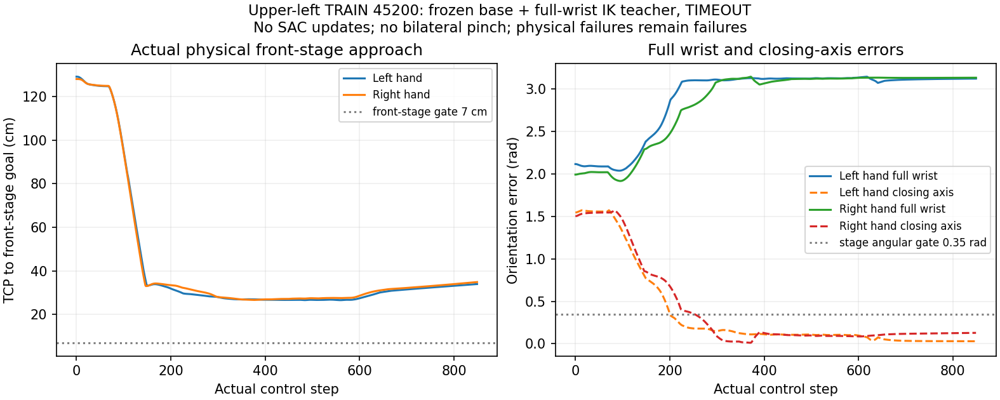

[실제 상단 진입 실패 영상(H264 MP4)](assets/rl_v2_staged_front_IK_diagnostic_20261004.mp4),
[실제 종료 결과·FK 일치·별도 CPU 운동학 가설](assets/rl_v2_staged_front_IK_diagnostic_20261004.json).
영상은 실제 PhysX pose의 CPU mesh 재생이며 RTX 화면 캡처가 아니다.
H264/avc1·yuv420p·faststart·전체 decode를 검증했다.

동일한 실패 frame의 관절 자세/목표에 대해 URDF FK와 실제 TCP가0.7/0.94µm
이내로 일치했다. CPU static bounded IK에서 full-wrist는11.5/11.9cm 오차를
남겼고 **closing-axis만 맞추면 두 손 위치 오차가 수치상0까지 수렴**했다.
이는 운동학 가설이고 물리 성공이나 새 SAC 데이터가 아니다. 실제 gross target
projection은0으로, 이 배치의 진입 정체를95% reach bound로 단정하지 않는다.
Torso actual X/Z는 native 성공과 수 cm 이내였고 중력보상·TCP offset은 이미 있다.

Closing-axis 물리 비교도850step 시간초과·unsafe0으로 끝났고 진입 phase0에
머물렀다. 마지막 front-stage 오차35.02/33.12cm, gross projection0이었다.
제어 코드에서 VR IK는 position/velocity target을 함께 쓰지만 diagnostic IK를
기존 joint-delta action으로 바꿀 때 **position target만 전달**한 차이를 확인했다.
이 차이의 영향을 시험하도록 `--contact-velocity-feedforward` 옵션과 실제
관절 속도/IK 속도/encoded target tracking error를 기록하는 진단을 추가했다.
실행한 position step과 같은 방향·같거나 낮은 속도로 제한하며 기존 goal-SAC
제어에는 적용하지 않는다. 이전 진단의 종료/Drive 검증을 기다리는 GPU0
후속 서비스를10:02 등록했다. 아직 이 변경의 성공 결과는 없다.
이 teacher는 privileged pinch로 lift를 확인하며 standalone SAC 또는 새 Q seed가 아니다.

### Frozen 네 개발 배치 성공과 실제 SAC 회귀 (10:59)

새 staged21 초기 actor는 개발56000/56100/56200/56300에서 각각
509/489/645/657step에 **4/4 양손 opposing flap 파지·실제 proof lift 성공**했다.
네 배치는 동적 box,
주변 box, 실제 초기 base XY/yaw 차이를 유지하며 live VR/IK 없이 실행했다.
이는 새 staged actor update0인 **초기 frozen 개발 성능**이다. 독립 최종 성능이나
SAC 추가 학습의 개선으로 확대하지 않는다.

[상단 왼쪽56200 실제 frozen 성공 영상](assets/rl_v2_staged_upper_left_frozen_success_20261004.mp4).
PhysX pose를 CPU mesh로 재생한 H264/avc1/yuv420p/faststart 영상이며 전체 decode를 검증했다.

GPU0 별도 pipeline은 TRAIN4개 중 중간 좌우2개 성공·상단 좌우2개 시간초과,
unsafe0이었다. Actor699회/critic4,844회 실제 업데이트 이후 첫 독립 final9502000은
robot–rack 충돌로 실패했다. 추가 학습이 안정적으로 개선됐다고 볼 수 없으며,
개발 구역별 정책 회귀 검사와 실제 Q/replay 보존 복구가 필요하다.

### 실제 IK 제어와 손/flap identity 비교

동일 TRAIN45200에서 position-only closing-axis teacher는850step 시간초과였다.
Paired position/velocity teacher는 진입 거리를 실제로 줄였지만202step에
`l_twofinger_base`–rack35.91N으로 실패했다. 진입 중 assignment가[1,0]에서[0,1]로
바뀌어 두 손이 교차하는 진단도 관측했다. Teacher만 hand/flap identity를 handoff에
유지하도록 고친 뒤626step까지 진행했으나 `zarm_l7_link`–rack29.35N으로 실패했다.
Actor 관측/환경 reward assignment는 변경하지 않았고 새 Q seed로 가져오지 않는다.

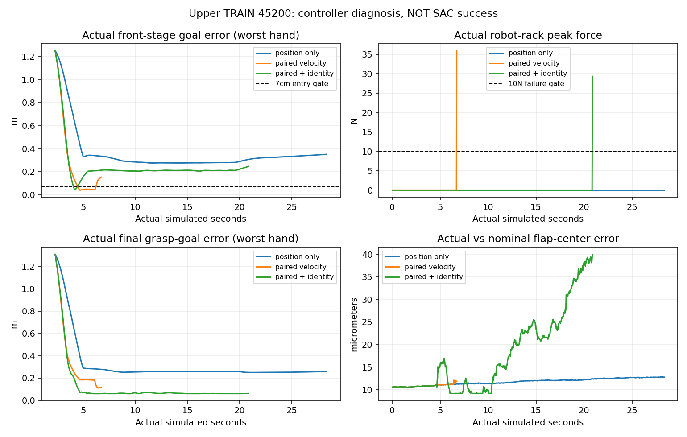

[실측과 영상 출처 JSON](assets/rl_v2_staged_contact_comparison_20261004.json).
Identity 유지 실행은 실제 IK projection이61.0/54.6mm였고 projected target 위치
오차는 약1mm였다. Front-stage projection0과 final grasp-goal projection은 다른 값이다.
도달 범위 밖 목표·팔 진입/손목 자세가 남아 있다. 실제 flap midpoint와 nominal
midpoint 차이는 이 세 진단에서 최대0.040mm였으므로 이 실패를 nominal 관측 오차로
단정하지 않는다. 다른 contact/성공 배치에서는 flap 휨이 cm 단위여서 그 경우는 별도다.

### 균형 잡힌 실제 수집을 병렬로 연결

단일 환경을 매 episode 재초기화하는 비교는 데이터 수집량이 적고 초기화 비용도 크다.
[`batched_staged_goal_with_drive.py`](../scripts/rl/batched_staged_goal_with_drive.py)와
새 runner는 환경별 neutral reset/실제 base hold/elapsed clock/waypoint를 분리하고
held-phase actual transition만 공유21-goal replay에 넣도록 연결했다.
첫4-env 시도에서 vector scale 검사 shape 오류를 고쳤고, 다음 시도는 초기 배치
guard에 걸려 실패 전이를 학습에 넣지 않았다. GPU0에서 guard 진단을 진행한다.
물리 실행 결과 확인 전 대규모 학습 성공/속도 개선으로 기록하지 않는다.
GPU3의 기존 세 학습 비교는 별도 namespace와 Drive 수명주기로 계속 진행한다.

11:08 원인을 확인했다. Target/logical box와 footprint/invalid-reset은 그대로였고
rack–base 상대 높이만 약3cm 달랐다. 원래 단일 runner와 달리 최초 env reset의
물리 settling을 생략한 차이였다. 동일 순서를 복구한 다음4-env 실행은 모든 scene
guard를 통과했으며 rack pose 차이는 약43..58µm, 실제 base Z는 약0m였다.
61step에4개 환경 중1개가 실제 base hold를 확인했고 아직 파지 결과 전이다.
관련 CPU 검사61개 통과. Native seed inverse 감사도 동일한 episode별 measured
anchor/clock을 유지한 벡터 연산으로 바꿔 반복 GPU 동기화를 줄였다.

## 11:35 · 병렬 상단 접촉의 물리 발산과 균형 수집의 시작 조건

같은 development56000/56100/56200/56300을4개 환경에서 동시에 재생한 결과는
중간 좌509step·중간 우489step 성공, 상단 좌622step·상단 우479step 실패였다.
Actor/critic 업데이트는0이다. 실패는 rack 충돌이 아니라 box lift/speed guard였다.
실제 pre-terminal HDF에서 상단 target의 robot-relative 위치 변화가 마지막 한 step에
95.94m/50.42m, critic의 measured box 선속도가3809.50m/s/2054.44m/s로 기록됐다.
Quat/관측은 유한했지만 정상적인 파지 동역학으로 보기 어려운 큰 값이다.
단일 재생4/4와 중간 두 환경의 동일 성공 step만으로 병렬 물리 동등성을 주장하지 않는다.

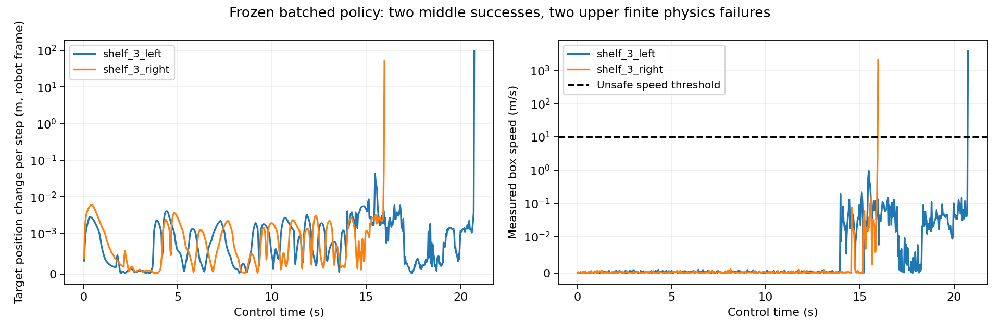
[원본 실행·측정 단위·구역별 수치](assets/rl_v2_batched_physics_failure_20261004.json).
원본4-env 실행의 HDF/로그/결과는 writer 종료 후 Drive checksum 검증을 마쳤다.

GPU0에서는 같은4개 배치와 초기 actor로 control dt·성공·충돌 기준을 유지한
frozen solver 비교를 시작했다. Box solver32/8→64/16, physics dt1/120→1/240,
body velocity/depenetration 제한을 명시한다. 새 Q에 넣지 않는 별도 진단이며
물리 발산 해결 여부와 파지 결과가 나오기 전에는 개선으로 기록하지 않는다.

GPU3의 새16-env 실행은 별도 seed60000대 TRAIN32개,61000대 development16개,
62000대 final16개를 분리했다. 각 구역의 실제 initial base XY/yaw와 dynamic box
randomization을 유지한다. Replay100,000행/새 Q·optimizer로 준비했으며,
한 vector step의 critic2회는16개의 실제 held 전이에 공유하므로 단일-env처럼
첫 두 성공 episode만으로 actor를 업데이트하기 쉬운 데이터 편중을 줄인다.
초기 개발16개를 먼저 재생해 **각 구역 최소2/4 성공**일 때만 TRAIN으로 간다.
이어 같은 개발 배치의 구역별 성공 수가 감소하면 실제 Q/replay를 저장하고 중단한다.
최종16개는 optimizer 없이 실행하며 train/recovery 선택에는 쓰지 않는다.
이 실행은 시작한 상태이고 성공률 개선/일반화 완료를 의미하지 않는다.

개선이 없던 이전24-goal whole-body 실험만 종료했다. 종료 요청 뒤 다음 layout을
시작하던 manager의 stop 전파 문제도 수정했다. 마지막 닫힌 실행의 실제
checkpoint19393, replay/HDF/log를 기존 Drive 연결로 검증했고 다른 사용자의
프로세스는 변경하지 않았다. Bound21/free-jaw21 비교 실행은 별도로 진행 중이다.

11:42 업데이트: 첫16-env 실행은 actor/Q 업데이트 이전에 development61002
중간 왼쪽의 footprint invalid1회와 다른 target으로의 재생성을 검출했다.
나머지15개 rack/error/active 검사에는 문제가 없었지만 전체 wave를 중단했다.
닫힌 실패 로그/manifest는 Drive 검증 완료다. 이 사례를 성공률 분모의 실패로
남기고 replaced observation/transition은 제외하면서 정상15개 수집을 계속하도록
runner를 수정했다. 똑같은16개 requested layout을 새 폴더에서 다시 실행한다.
Seed를 유리한 것으로 바꾸거나 spawn/success guard를 완화한 것이 아니다.

## 12:25 · 16개 실제 배치 결과와 actor 회귀 수정

첫 균형16개 개발 배치는 **5/16 성공**으로 종료됐다. 중간 왼쪽1/4,
중간 오른쪽4/4, 상단 왼쪽0/4·오른쪽0/4다. 초기 target 재생성1개도 실패로
집계했다. 나머지 실패의 primary 분류는 box speed/lift7개, robot–rack3개다.
Actor/critic 업데이트0인 frozen baseline이며 단일4개 개발 성공4/4보다 넓은
실제 배치에서의 실패를 드러낸 결과다. 각 구역50% baseline gate 때문에 TRAIN
전이를 수집하기 전에 종료됐다. 닫힌 HDF/로그/모델은 Drive checksum 검증 완료다.

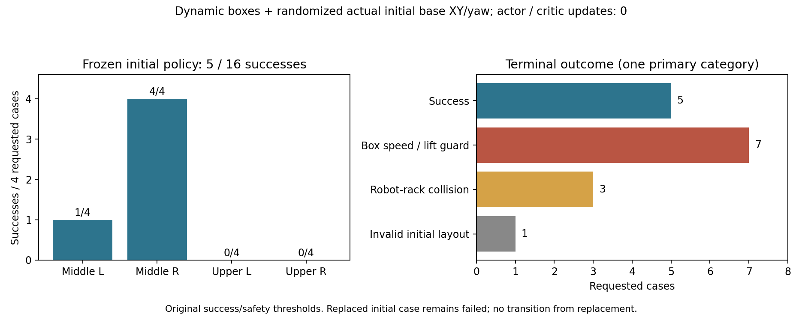
[실측·실행·분모 출처](assets/rl_v2_frozen16_development_20261004.json).

더 촘촘한 solver 비교4개는 중간 왼쪽·상단 오른쪽2개 성공, 중간 오른쪽
box drop/speed 실패·상단 왼쪽rack 충돌 실패였다. 선속도 cap이 있어도 중간
오른쪽은 마지막 measured pose가약27m 이동했다. 기존2/4보다 좋아지지 않아
이 설정은 실제 학습에 채택하지 않았다. 종료 로그/HDF는 Drive 검증 완료다.

별도 single-env SAC pipeline은 실제 TRAIN2/4 성공 뒤 actor699회/critic4,844회
업데이트했고, 독립 final4개는 **0/4**였다(랙 충돌2·시간초과2).
실제 TRAIN2,485행의 projected mean 목표를 초기 정책과 비교했을 때 평균 관절
차이0.01978rad, 최대0.17565rad(약10°), torso XZ 최대10.62mm였다.
Latest actor의 prior MSE0.0012548×weight1.7208≈0.00216은 Q mean0.66263에
비해 작았다. Gaussian std0.00519이므로 이 결과를 std 폭증으로 설명하지 않는다.

수정은 실제 수집량 gate16,384행과 허용 radius²로 나눈 prior 손실이다.
초기 effective weight800, prior fade/radius 진행은 actor5,000회에 연결해
Q-only 수집 중에는 완화되지 않게 했다. 기존 물리/관측/보상/성공은 그대로다.
Latest Q/target/optimizer·실제2,485행·진행 횟수를 보존한 새로운 recovery를
준비했고, 성공했던 초기 actor/radius0.05의 projected 출력은 동일 TRAIN 관측에서
최대 차이0이었다. 준비·검증은 optimizer를 학습하거나 물리 성공을 만들어낸 것이 아니다.

기존 손실의 목표 BC와 validated 초기 actor도 서로 달랐다: 실제 TRAIN 관측의
unprojected 목표 MSE0.00035595, 관절 최대0.10825rad/torso 최대4.03mm였다.
그래서 **validated actor 자체를 고정 snapshot으로 쓰는 옵션**도 분리했다.
이 옵션의 초기 imitation loss는0이며 snapshot에는 Q/transition이 없다.
CPU 관련 검사84개 통과. 두 recovery의 모델/실제 replay도 Drive 검증 완료다.

GPU0의 prior-BC 정규화 비교는16-env/100,000행 buffer/위 수집량 gate로 실행 중이다.
각 구역 baseline50% gate는0으로 설정해 초기 성능이 낮은 구역도 TRAIN할 수 있게
하되, 동일 development 구역별 성공 수의 감소 감지는 유지한다. Final16개는
9702000대 별도 namespace이며 optimizer/recovery 선택에 쓰지 않는다.
GPU3의 별도 frozen16-env는 scene·robot·box TGS velocity iteration만0으로 비교한다.
Physics/control dt·position iteration·성공·안전 기준을 유지한다. NVIDIA의
[TGS/D6/loop-closure 제한](https://docs.omniverse.nvidia.com/kit/docs/omni_physics/107.3/dev_guide/guides/current_limitations.html)은
가설의 출처이며 원인이 확정된 것은 아니다. 아직 새 SAC 개선/목표 완료로 기록하지 않는다.

## 12:56 · Solver 비교 종료와 반복 reset 제어 이력 수정

TGS velocity iteration0의 같은16개 frozen 개발 결과는 **4/16**이었다.
중간 왼쪽1/4·오른쪽3/4, 위 좌우0/4다. 원래5/16보다 좋아지지 않아
실제 학습에 적용하지 않았다. Writer 종료 후 HDF/로그/결과의 Drive 검증 완료다.
그 종료·검증을 기다리던 GPU3 validated-actor snapshot SAC는12:43에 실제
시작했다. Snapshot initial MSE0, matching Q/실제2,485행·진행 횟수 보존,
buffer100,000행·actor 실제 수집량 gate16,384행 설정이다.

기존 bound/free-jaw single-env 비교의 마지막 writer들도12:33에 종료됐고
Q/replay/HDF/영상/로그를 Drive에서 검증했다. 다른 사용자 프로세스는 변경하지 않았다.

GPU0 normalized-prior 비교의 첫 개발4/16·TRAIN5/16·같은 개발 재평가5/16은
actor 업데이트699회에서 **추가 actor 업데이트0**인 상태다. Actual held replay는
8,352행으로 수집량 gate 미만이었다. 반면 같은 개발의 requested initial layout
불량은1개→6개로 늘었다. 따라서 이 차이를 actor 학습 회귀나 개선으로 해석하지 않는다.

Reset 경로에서 manager만 reset하고 asset의 permanent wrench를 정리하지
않은 채 최초60 physics substep에 base controller 적용도 생략했던 차이를 발견했다.
Floating base의 이전 body-frame support/COM torque가 다른 root/팔 teleport 뒤에도
재사용될 수 있다. Scene/asset/contact sensor reset, effort/velocity target 정리,
robot까지 포함한 coherent FK, 매 substep zero-action 정상 제어를 연결했다.
성공/충돌/보상/physics dt·dynamic box randomization은 바꾸지 않았다.
Force/torque의 실제 정리 전후 audit와 새 reset 계약을 기록한다.

관련 CPU 회귀 검사50개가 통과했다. GPU0의 별도16-env frozen 반복3회를 시작해
같은 actor·requested 개발 배치를 재생한다. Q/replay/optimizer 업데이트는 없고
독립 final 배치는 사용하지 않는다. 결과가 나오기 전에는 reset 또는 flight 문제가
해결됐다고 기록하지 않는다. 기존 실행에 코드를 동적으로 주입하지 않는다.

## 13:49 · Jaw 탐색의 구조적 제한과128환경 hybrid SAC 준비

실제 held TRAIN2,485행에서 초기 actor의 body goal이 prior clip 밖에 있던
비율은 전체19개 body 차원의1.27%, 최소 한 차원이라도 clip된 행은11.23%였다.
따라서 body의 Q gradient가 전부 막혔다고 설명하지 않는다. 반면 jaw prior의
최소 절댓값은0.99047/0.99071이고 radius는0.05..0.06397였다. Bound jaw는
이 전이들에서 열림/닫힘 부호를 바꿀 수 없었다.

독립 jaw와 AR(1) goal 탐색의 초기 모델을 먼저 만들고 실제 과거 TRAIN 관측에서
기존 body 목표와 최대 차이0, jaw 결정4,970개 부호 차이0임을 확인했다.
이어 실제 binary gripper에 맞는 **hybrid SAC**를 별도 fresh Q로 연결했다.
19개 연속 목표와 양손 Bernoulli 정책을 쓰며, 같은 실제 state의 네 jaw 조합에
대한 Q 기대값으로 discrete 정책을 학습한다. 가짜 transition이나 old Q를 만들지 않는다.
Replay에는 실제 실행한−1/+1 jaw를 저장하고,12cm 접근 전 닫힘 차단은 유지한다.

두 entropy optimizer·resume·binary Q gradient·far-jaw mask와 기존 경로의
관련 CPU 검사120개가 통과했다. Hybrid 초기 checkpoint를 실제 matching contract로
restore했고 actor/critic0회·actual replay0행·4개 빈 optimizer·finite 모델을 확인했다.
Requested TRAIN/development/final 초기 footprint512개도 검사했다. 이들은 모델·
spawn 정적 검사이며 학습 또는 PhysX 파지 성공이 아니다.

새 배치는128환경, TRAIN256개를8pass(2,048attempt), 동일 development128개를
9회, 독립 final128개다. Seed120000대 TRAIN·121000대 개발·122000대 final을
분리했고 기존 final 결과를 선택에 사용하지 않는다. Small box·주변 dynamic box,
초기 base XY/yaw 범위, 보상/성공/충돌/physics dt는 기존 네 구역 recipe와 같다.
Buffer500,000행(약3.84GiB), actual held32,768행과 critic2,048회 이전에는
actor를 업데이트하지 않는다. TRAIN behavior correlation0.98, deterministic
개발/final, 연속 목표의 초기 std0.005를 쓴다.

이전GPU0 비교는 actual replay12,859행·critic8,038회, GPU3 비교는9,998행·
critic6,424회에서 종료됐다. 둘 다 actor699회에서 추가 actor 업데이트0이었다.
GPU3의 같은 개발은 중간 좌2→1·우3→4로 전체5/16을 유지했지만 regional guard에
걸렸다. 이를 SAC actor 회귀로 해석하지 않는다. GPU0의 중도 stop 개발은 완료
평가가 아니므로0/16 성능으로 집계하지 않는다. 이런 경우 guard를 채점하지 않고,
동일 actor의 성능 손실은 물리 재현성 문제로 구분하도록 수정했다.
두 종료 실행의 실제 Q/replay/HDF/로그는 Drive 검증 완료다.

Reset 반복의 첫 두 frozen 결과는4/16·5/16, requested initial 불량2개·1개였다.
실제 cached support 약2,152N/torque약35.7Nm가0으로 정리되고 새 support가
재계산되는 것은 확인했지만, 상단 flight/rack 실패는 남았다. Reset 수정만으로
물리 발산 또는 파지 학습을 해결했다고 주장하지 않는다.
상세 제어/새 실행 옵션은 [hybrid SAC 안내](RL_V2_STAGED_GOAL_SAC.md#binary-gripper를-직접-학습하는-hybrid-sac)를 따른다.

## 14:07 · 실제128환경 초기화 오류와 replay 저장 수정

13:59 GPU3 hybrid SAC는 actor/critic 업데이트 전에 `Batched surrounding boxes did not settle`로
종료됐다. 전체128환경의 모든 박스가 동시에8tick 정지해야 한다는 batch-wide 조건이
정상 환경까지 막았다. 실패 실행의 writer 종료와 최종 Drive 검증을 확인한 뒤,
14:07 고유 실행 `staged_hybrid_goal21_partial128_gpu3_20261004_140717`에서 재시작했다.

Requested original layout의 invalid/termination/numerical failure를 환경별로 누적한다.
Respawn된 대체 장면을 기다리거나 replay에 넣지 않는다. 정상 환경은 주변 박스 모두의
선속도<0.01m/s·각속도<0.05rad/s가8tick 이어져야 통과하며, 기존90step 제한 후
불안정한 환경은 실패 attempt로 남긴다. 성공률 분모에서 제외하지 않는다.
충돌·보상·파지·lift 조건, box randomization과 physics/control dt는 유지한다.

초기0행 replay 파일도 빈 tensor view의 원본 storage를 직렬화해 각각4.12GB가 됐었다.
실제 최근 행만 소유하는 tensor를 저장하도록 고쳤다. 모델 SHA와 goal 계약 및0행
데이터를 유지한 별도 compact 초기 replay는 Gaussian10,772B·hybrid11,156B다.
기존 원격 검증 파일을 다른 내용으로 덮어쓰지 않는다. 새 실행은 compact hybrid를 읽는다.
Empty storage, 최근 capacity 행만 저장, binary SAC·환경별 settling·Drive 종료 신호 등
관련 CPU 검사 **122개 통과**. 이는 물리 성공률 또는 학습 개선의 증거가 아니다.

Frozen reset 반복3회의 실제 결과는4/16·5/16·5/16이다. 중간 선반의 성공은 있으나
상단 좌우는 모두0/4였다. Box speed limit은 각6·5·6건이며 reset 수정만으로 flight를
해결했다고 주장하지 않는다. 새로운 실제 SAC actor 업데이트와 독립 평가를 계속 확인한다.

## 14:23 · 실제 rollout 진행과 별도 접촉 순서 진단

GPU3의 첫128개 development에서 original layout99개가 통과했다. 초기 실패29개도
분모에 남기고 replay에서 제외했다. 721step 시점에 정확한 양손 파지·lift 성공15개를
확인했지만 중간 선반에만 있었고 상단 성공은0이다. 이 wave는 frozen baseline이며
actor/critic/replay0이므로 SAC 학습 개선이라고 기록하지 않는다.

GPU0에서 첫16개 development case·같은 초기 hybrid actor로 PhysX
`solve_articulation_contact_last=True`만 바꾸는 frozen 진단을 시작했다.
실제 USD flagTrue를 확인했다. NVIDIA의
[articulation 안정성 안내](https://docs.omniverse.nvidia.com/kit/docs/omni_physics/107.3/dev_guide/guides/articulation_stability_guide.html)가
gripping 접촉 순서 옵션을 제시하지만 원인이 확정된 것은 아니다.
128개 원래 결과와16개 결과는 환경 수/원점 차이도 있으므로 단일 원인 비교라고
주장하지 않는다. 적용 검토에는 같은16개 원래 설정의 별도 비교가 필요하다.
진단은 Q/actor/replay를 업데이트하지 않고 현재 GPU3 학습 설정에도 적용하지 않았다.

빈-view storage의 두 기존 파일과 compact 사본 모두를 Drive에서 크기·MD5로
재검증하고, 모델 SHA·goal 계약·실제0행 동일성을 확인했다. 사용하지 않는 기존
0행 replay storage만 로컬에서 제거해 **8,241,022,824bytes**를 회수했다.
실제 학습 데이터·모든 checkpoint·Drive 과거 파일은 보존했고 별도 cleanup receipt를 남겼다.

## 14:33 · 첫128개 평가 완료와 실제 TRAIN 수집 시작

Development baseline은 **15/128 (11.72%)**로 종료했다. 중간 좌4/32·우11/32,
상단 좌우0/32다. 초기 불량29개·안전 종료59개·시간초과25개도 분모에 포함한다.
전체 rollout58,875행은 frozen evaluation이므로 replay/Q/actor에 쓰지 않았다.
그다음 첫 TRAIN wave가 시작됐으며61step에 original87개가 살아 있고8개가 실제
base hold를 확인했다. 실제 held replay30행, actor/critic0회인 초기 수집 시점이다.
상단 실패와 물리 발산이 남아 있어 목표 완료 또는 학습 개선으로 기록하지 않는다.

Completed episode를 한 행씩11필드 resize/write하던 HDF 경로도 bulk write로 개선했다.
종료·Drive 검증된 frozen 실행의 실제1,480행을 두 방식으로 기록해 모든 전이 필드의
값/dtype/순서가 같음을 확인했다. 같은 CPU에서4.026s·12,762,848B가
0.120s·5,416,493B로 줄었다. 이는 저장 IO 비교이며 시뮬레이터·정책 학습 성능이 아니다.
관련 recorder/teleop/batched 검사36개 통과. 기존 Quest streaming API를 유지하고
새 batched 실행부터 적용한다. 현재 GPU3 실행 중 코드에 동적 교체는 하지 않았다.

GPU0 접촉 순서 진단의 실제 종료·Drive 검증 뒤 같은16개 case를 원래 설정으로
실행하도록 CPU 대기 서비스를 등록했다. 외부 작업을 종료하지 않고, dependency가
실패하면 자동으로 비교를 시작하지 않는다. 이 서비스는 실제 서버 실행 대기이며
채팅/LLM의 자동 점검 예약은 아니다.

## 14:57 · 물리 발산의 실제 전이와 hybrid 복구 경로

종료·Drive 검증된 frozen reset 반복의 box-speed 실패17개를 actual HDF로 조사했다.
4개는 마지막5tick 양손이 모두 열려 있었고, failure 직전 양손 pinch는1개뿐이었다.
최대 사례는 제어1tick 동안0.07688m/s에서 **1.7272e10m/s**로 튀었으며, 기록된
pose/rotation feature는 유한했다. 이 frozen evaluation에는 actor/Q/replay 학습이
없었다. 따라서 SAC의 stochastic jaw 닫힘만으로 모든 발산을 설명할 수 없다.
Mass ratio·closed linkage·접촉 solver 불안정은 조사 가설이며 원인 확정은 아니다.

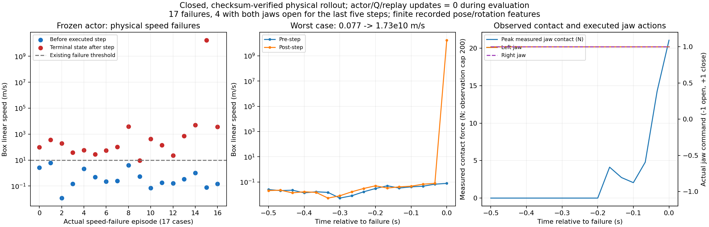

GPU0 contact-last 비교는 **1/16**, rack 실패10·speed 실패1·initial 불량1로 끝났다.
이 실행의 writer 종료 및 최종 HDF/로그 Drive 검증을 확인했다. 같은16개·같은
initial actor·같은 parallel origins의 원래 TGS 비교가14:40에 시작됐으며, 그 종료와
Drive 검증 후 **PGS만 변경**하는 frozen 비교를 순차 실행하도록 CPU 서비스를 등록했다.
PGS의 실제 USD solverType도 확인하고 physics/control dt·iteration·안전/성공 조건을
유지한다. 이 진단의 replay는 현재 TGS Q에 import하지 않는다. NVIDIA의
[closed-loop 사례](https://forums.developer.nvidia.com/t/closed-articulation-simulation-problem/258431?page=2)는
비교 가설의 근거이며 현재 Leju/box 문제의 해결을 보장하지 않는다.

GPU3 첫 TRAIN wave는3/128 success·initial 불량41·안전66·timeout18로 끝났다.
이는 stochastic TRAIN 결과이며 deterministic 개발 성공률 개선으로 해석하지 않는다.
Actual held replay43,158행·critic1,474회·actor0회였고 두 번째 TRAIN으로 이어졌다.
개발128개 baseline15/128·상단0이라는 한계를 계속 유지해 기록한다.

`recover_pose_goal_actor.py`는 hybrid 계약도 엄격히 확인한다. 회귀 후 **종료된**
동일 hybrid 계약에서 검증된 actor만 복구하고, 최신 binary Q/target·critic Adam·
continuous/discrete alpha와 두 optimizer·실제 replay·update 횟수는 보존한다.
Actor Adam moment만 초기화하고 새 고유 폴더에 저장한다. 다른 solver/관측 계약의
Q를 이전하거나 DEV transition을 학습 데이터로 쓰지 않는다. 관련 CPU42검사 통과.
현재 GPU3 actor를 되돌리거나 live process 코드를 교체한 것은 아니다.

## 15:04 · 실제 actor 학습 시작과 중단 조건 보완

GPU3에서 실제 held replay72,423행·critic2,160회·actor28회를 확인했다.
Binary Q와 두 entropy loss는 유한했고 TRAIN/demo BC loss는0이었다.
Warm start의 frozen actor prior는 body regularization으로만 연결되며 current
DEV/final 관측이나 실제 전이를 optimizer에 넣지 않는다. 이후 동일 development
평가를 기다린다. 아직 SAC 평가 개선·상단 성공·목표 완료로 기록하지 않는다.

GPU0 원래TGS의 동일16case는 **5/16**, contact-last는1/16이었다. 두 실행의
writer 종료 및 최종 Drive 검증을 확인한 뒤14:55에 PGS frozen 비교가 실제
시작했다. USD solverType=PGS도 확인했다. 현재GPU3 TGS는 변경하지 않았다.

새 코드에는 수치 corruption 환경만 quarantine하는 measured-wave mask를
추가했다. Respawn된 state와 action을 원래 과제 transition으로 만들지 않고
다른 정상 환경은 계속한다. Finite speed/lift failure는 실제 reward/terminal
그대로 Q에 남긴다. 현재 실행에는 동적으로 적용하지 않고 후속 실행부터 쓴다.

Raw regional count 하락만으로 중단하던 guard에는 고정 initial baseline의
paired exact 비교 옵션0.05를 추가했다. 반복/구역에 significance budget을
배분하고 best noisy repeat를 통계 baseline으로 선택하지 않는다. 실제 종료된
4/16→5/16→5/16 frozen 기록에서 마지막 raw regional1개 손실은 noisy best 대비 수량 변화지만 고정
initial baseline과는 동일해 paired p=1.0, 회귀 stop이 아니었다. 독립 final은 이 분석에 쓰지 않았다. 현재 live128 실행은
기존 strict guard이며 첫 learned development 결과를 확인한 뒤 후속에 적용한다.


## 15:30 · 첫 learned development와 PGS 상단 성공의 실제 증거

GPU3 actor238회·critic2,998회·실제 held replay87,939행 후 동일128개
development는 **11/128**, 중간 좌2/32·우8/32·상단 좌1/32·우0/32였다.
초기15/128보다 전체 성공은 감소했으므로 SAC 개선으로 기록하지 않는다.
초기불량30개, speed48·rack16·lift12·drop10·workspace6의 원인별 실제 종료를
기록했다(원인들은 중복 가능). 기존 strict regional guard가 policy_regression으로
종료했다. Writer 종료·최종 Drive 검증 후 같은 TGS actor/Q/optimizer/replay를
보존해 통계 guard0.05로 이어간다. 재개 baseline과 원래15/128은 구분한다.

동일16개 initial actor/parallel origins의 originalTGS는5/16(중간 좌1·우4),
PGS 첫 실행은5/16(중간 좌1·우3·상단 좌1), 새 PGS 실행의 첫 반복은4/16
(중간 좌1·우2·상단 좌1)이다. 상단 왼쪽 seed121201가 첫 실행과 첫 반복에서
실제로 성공했다. 총 성공 개선이나 독립 final 일반화의 근거는 아니다.

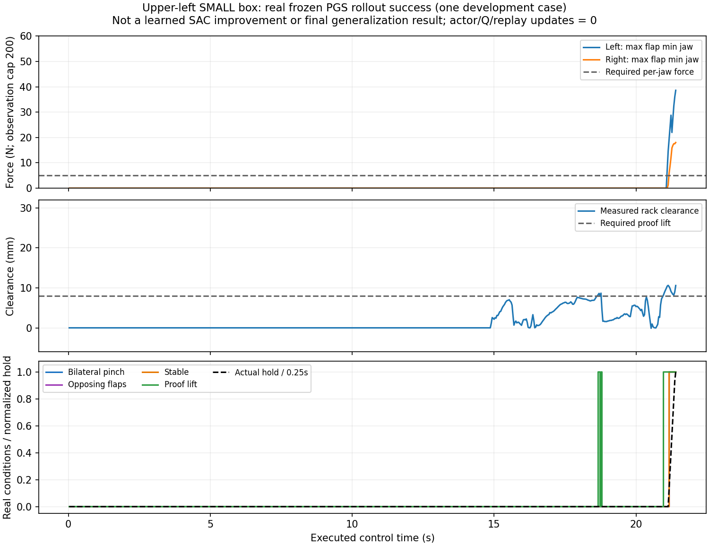

첫 PGS 실제 HDF episode_000006의642step/21.4초 기록에서 bilateral pinch,
stable, opposing flaps, proof lift, grasp success가 모두true였다. 마지막
rack clearance10.5696mm·hold0.266667s다. Frozen 물리 진단은 Q/actor를
업데이트하지 않으며 TGS replay에 넣지 않는다.

초기화된 PhysX의 get_masses/get_inertias와 실제 joint gains/armature를
읽어 manifest/HDF에 기록한다. Box body0.4kg·flap각0.03kg, 가상 EEF
0.0005236kg·일부 helper/sensor frame1kg이다. Authored USD에 mass가
없다고 실제 PhysX mass가0이라는 뜻은 아니다. 큰 mass ratio와 closed linkage,
강한 drive의 결합은 발산 가설이며 원인으로 확정하지 않았다. 자산 mass를
임의 변경하지 않았다.

별도 PGS 학습은 `--physics-solver PGS`의 명시된 solver/dt 계약으로 fresh Q를
준비한다. Actor prior만 이전하며 다른 TGS Q/replay는 strict 계약 비교에서
거부한다. 동일 dt/control dt/iteration/성공·안전 기준은 유지한다. 관련 CPU25검사 통과.
