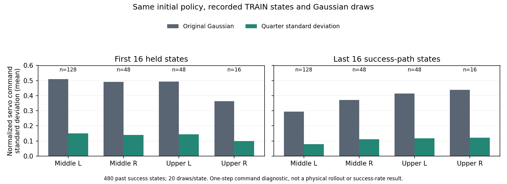

# 목표 잡음과 실제 제어 변화 비교

같은 시작 동작에서 학습한 정책의 첫 전체 DEV는 **23→9/128**로 떨어졌다.
Q가 실제 모터 명령을 보도록 고친 것만으로 파지가 개선되지는 않았다.
그다음 비교로 Gaussian 표준편차를 줄이는 선택형 SAC를 준비했다.
이는 새 성공 정책의 결과가 아니라 구현·초기 입력 검증이다.
대표30/128의 실제 Q 표시 영상4개와 보상 가중치는
[평가 영상·reward 설명](RL_V2_EVAL_Q_REWARD_20261006.md)에 있다.

## 실제 학습 후 실패

기존 servo-Q 비교는 TRAIN384조건 후 actor690·Q4806의 동일한 체크포인트로
원래 DEV128개를 평가했다. 초기화 무효1건도 분모에 포함했다.

| 구역 | 초기 성공 /32 | 첫 학습 후 성공 /32 | 랙 충돌 | 시간 초과 | 초기화 무효 |
| --- | ---: | ---: | ---: | ---: | ---: |
| 중간 왼쪽 | 12 | 5 | 26 | 1 | 0 |
| 중간 오른쪽 | 6 | 0 | 32 | 0 | 0 |
| 상단 왼쪽 | 5 | 4 | 13 | 14 | 1 |
| 상단 오른쪽 | 0 | 0 | 27 | 5 | 0 |

성공9건은 안전한 실제 양손 opposing-pad 접촉·0.25초 유지·8mm proof lift를
모두 충족했다. 랙 충돌98건은 모두 접근 후 base를 유지하는 파지 단계였다.
기록된 실패 시점의 최대 충돌 body는 그리퍼 몸체77건·팔 링크21건이다.
이 값은 충돌의 최초 접점이나 전체 경로의 힘 합산이 아니다.
중간 왼쪽 최대852.6N을 포함해10N 기준을 실제로 넘었다.
같은 배치 요청을 반복했지만 flap 추첨·물리 이력까지 동일하다고 가정하지 않는다.
[전체 평가·구역별 안전 판정](assets/rl_v2_servo_critic_first_full_DEV_after384_20261007.json)

## 목표 잡음을 다시 본 이유

위 체크포인트의 성공 TRAIN22경로에서 처음16·마지막16상태, 총704개를
읽기 전용으로 점검했다. 한 스텝 제어 clipping으로 Q 목표 경사가0인 활성 좌표는
각각44.7%·37.9%였지만, 평균 출력의 tanh 포화는 이 표본에서 없었다.
20개 잡음 표본이 모두 같은 모터 명령인 상태도0/704였다.
따라서 탐색이 전부 막혔다는 해석은 맞지 않는다.

작은 목표 잡음도 pending target 차감과 한 스텝 제한을 거쳐 상대적으로 큰
제어 명령 변화가 될 수 있었다. 이 진단은 성공 은행에 남은 상태만 사용하며,
실패한 전체 TRAIN이나 실제 새 관절 속도·손 이동·연속 경로를 측정한 결과가 아니다.
기록된 stochastic 성공 목표와 이후 greedy 목표 차이를 그대로 새 실패 원인으로
단정하지 않는다. [실제 actor690의 목표·제어·Q 경사](assets/rl_v2_servo_actor690_effective_motion_20261007.json)

## 변경한 방법

새 형식 `staged_actual_flap_reanchored_gentle_servo_critic_hybrid_sac_v1`을 선택하면
19개 연속 목표의 Gaussian 표준편차를1/4로 줄인다. **초기 greedy 몸체 목표와
binary jaw는 그대로**다. 새 기본값으로 전체 실험을 변경하는 옵션은 아니다.

| 항목 | 기존 | 새 비교 |
| --- | --- | --- |
| 연속 목표 min / max 표준편차 | 0.03 / 0.12 | 0.0075 / 0.03 |
| 저장된 log-std head | 기존 값 | 몸체19개 bias에 `log(1/4)`를 더함 |
| Gaussian을 사용하는 경로 | 수집·actor·모든 target Q | 세 경로에 같은 축소 적용 |
| 목표 entropy | 기존 cap 기준 | 새 cap 기준으로 기존 식에서 재계산 |
| 연속 수집 탐색 | AR 상관0.99 | 유지 |
| 넓은 팔 탐색 | episode20%에 일정 방향 bias를90 held-step에 걸쳐 적용 | 유지 |
| 평균·jaw·목표 반경·한 스텝 controller | 기존 값 | 초기 동일 |

범위만 줄여 log-std가 새 상한에서 잘리지 않도록 head bias도 함께 옮긴다.
설정상 초기 표준편차0.08→0.02와 저장된 head의 실제 출력은 구분한다.
실제 복원한 TRAIN698관측에서 두 분포의 표준편차 비율1/4, 평균·jaw의
비트 단위 일치를 확인했다. Gaussian 엔트로피의 기본 목표는 새 cap에 맞춰
`log(1/4)`만큼 낮아지며, 현재 평균의 squash를 고려하는 기존 계산을 사용한다.
Entropy backup은 기존처럼 꺼져 있다.

같은 초기 모델·실제 성공 TRAIN480상태·같은20개 잡음으로 비교했다.
활성 좌표의 정규화 제어 명령 표준편차는 구역·구간별로 기존의26.5–30.0%였다.
단위는 controller의 정규화 command이며 rad/s나 EEF 이동 거리가 아니다.



[같은 상태·잡음의 실제 제어 변환 비교](assets/rl_v2_gentle_servo_same_state_commands_20261007.json)

이 변경은 **같은 평균 목표가 이미 clipping되는 좌표의 Q 경사를 복구하지 않는다.**
넓은 탐색 성공·보상·전체 평가 개선도 아직 보장하지 않는다. 단일 상태의 독립
Gaussian 진단을 실제 AR 경로와20% episode bias의 크기로 해석하지 않는다.

## 보상·학습 데이터·확인

[종료 잠재값 수정](RL_V2_ABSORBING_GEOMETRY_20261007.md)을 적용한 별도 실행과
같은 새 보상을 사용한다. 접근2·진입1·정렬0.5·포획0.5·실제 접촉1·들기0.4,
한 손 파지0.5·양손 파지2·성공8, 닫힘 자체0이다. 종료 때 기하 잠재값0과
근접도×정렬도 잠재값 차이를 사용한다. 박스·base·배경·동적 flap 무작위화,
성공·충돌10N/5N 조건은 같다. Curriculum·박스 고정은 추가하지 않는다.

보상이 바뀌므로 학습한 이전 Q·optimizer·replay·성공/n-step 보상 라벨을 가져오지
않는다. 새 초기 입력의 모든 보상 은행·학습 횟수·네 optimizer는0이며, 앞으로
수집하는 실제 TRAIN만 학습한다. 진행 중 VR·teacher BC도 기존처럼0이다.
실제 full training pilot 복원·모델 일치와 잘못된 구형 resume 거부를 확인했다.
관련23개 고유 테스트에는 실제 target Q의 분포, log-std 경사, 초기 mean/jaw 보존이
포함된다. [실제 trainer 복원 근거](assets/rl_v2_gentle_servo_full_restore_20261007.json)

```bash
CUDA_VISIBLE_DEVICES='' PYTHONPATH=src:scripts/rl python scripts/rl/prepare_gentle_servo_actor.py \
  --initial-checkpoint /absolute/path/to/closed-fresh-servo-inputs/checkpoint_00000000.pt \
  --training-manifest /absolute/path/to/closed-fresh-servo-inputs/training_manifest.json \
  --waypoints /absolute/path/to/closed-fresh-servo-inputs/waypoints.json \
  --output-dir /absolute/path/to/unique-quarter-std-inputs
```

입력8개는 기존 Drive 연결로 크기·MD5를 검증했다. TRAIN1,536조건은 기존 비교와
seed가 겹치지 않으며, 원래 DEV128요청을 구역별32개로 반복한다. 독립 FINAL은
남긴다. 학습 시작 여부는 별도로 실제 PID·CUDA 마스크·진행 JSON을 확인한다.

**10/07 07:58 KST에 code756a2c3를 main에 push한 뒤 GPU3에서 시작했다.**
기존 uniform 비교 writer의 exit0·run complete를 확인하고 새 고유 실행을 만들었다.
실제 writer1422295의 소유자·실행 폴더·CUDA3 마스크를 확인했다. 초기 장면 준비
단계이며 새 Gaussian의 실제 TRAIN 수집·Q·actor 갱신은 아직 확인 전이다.
기존 다른 비교3개와 종료 실험의 원래 최종 Drive 업로더는 유지했다.
체크포인트는5분마다 checksum 검증 후 최근2개를 보호하며, 종료 뒤 닫힌 로그를
검증하는 기존 관리자를 사용한다. 다른 사용자 파일·프로세스에 손대지 않았다.
[실제 시작·입력 백업 근거](assets/rl_v2_gentle_servo_actual_start_20261007.json).
