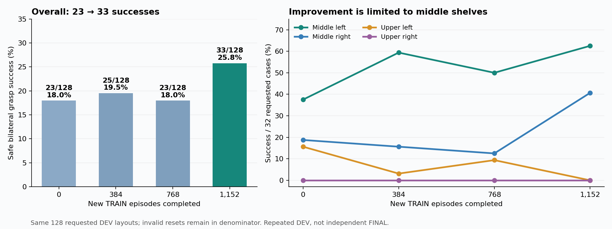

# S63 양손 박스 파지 학습 · 중간 보고

로봇이 랙의 박스 날개를 양손으로 잡아 들어 올리도록 학습하고 있다.
네 위치와 다양한 시작점의 최신 최고 평가에서 **128번 중 33번 성공(25.8%)**했다.
성공 동작을 유지하는 SAC의 중간 선반 성능이 개선됐지만, 이번 상단 성공은0건이다.
아래 대표 영상과 Q 영상4개는 이전30/128 정책의 기록으로 구분한다.

**10/07 후속 점검:** 성공 명령 유지 SAC의 흐름은23→25→23→33→21/128이다.
세 번째는 중간 좌20·우13, 상단 양쪽0건이며 공통 유효116조건에서도23→30건이다.
중간 선반의 개선은 확인됐지만 상단·다른 크기·독립 FINAL의 안정적인 성공은
아직 입증하지 못했다. 실제 파지의 보상 가치를 높이는 별도 비교는 성공 이벤트만+8→+64로
바꿔 GPU3에서 시작했고 실제 적용까지 확인했다. 아래 대표 Q 영상·보상 표는
원래+8 정책의 결과다. +64 비교의 전체 초기 평가는15/128이며 아직 학습
갱신 전의 기준값이다. 이후 원래 낙하 판정의+64 학습 평가는15→7→7/128로
줄었고 공통 유효116조건의 최신 비교도15→6건이었다. 실제 종료 표본 보강 비교도
초기23→14→8→12/128이며 세 번째도 상단 양쪽0건이다. 마지막 공통 유효117조건은
초기23→10건으로 전체 개선은 아니다.
기존 학습도 유지하며 네 위치의 안정적인 성공을 계속
학습한다. [전체 평가·초기화 차이](RL_V2_SERVO_SUCCESS_RETENTION_20261007.md),
[새 보상의 근거·실제 실행](RL_V2_SAFE_SUCCESS_VALUE_20261007.md),
[실제 마지막 보상과 Q 오차·첫 전체 평가](RL_V2_TERMINAL_CRITIC_CREDIT_20261007.md).

성공+64 비교의 첫 TRAIN256조건에서 성공은1건이었다. 학습된 동작을 더
실행하며 경험을 모으도록 탐색20%·현재 actor의 greedy 동작80% 수집 옵션을
준비했다. 모델·보상·물리 계약을 보존한 실제 복원과45개 검사가 통과했다.
10/07 13:29 KST에 GPU3에서 별도 실행을 시작했고 실제 writer·CUDA3·수집 옵션을
확인했다. 이후 실제 첫 DEV에서+64·10cm 낙하 판정·수집 설정과 새 학습 은행0을
확인했다. 전체 초기 평가는 **13/128(6·6·1·0)**으로 끝났고 실제 TRAIN에
진입했다. Actor/Q0회의 기준값이다. 첫95개 episode의 실제 수집은 탐색14개·
greedy81개였고 Q62회·온라인 TRAIN1,618행을 확인했다. 이후 첫 전체 TRAIN128에서
안전한 성공13건(5·6·2·0)을 수집했다. Greedy109개 episode에서13건,
탐색19개에서0건이었고 자기 성공13경로·5,717행을 보존했다. 당시 actor0·Q1594로
초기 동작의 경험 수집 결과다. 이후 TRAIN384조건 후 첫 전체 학습 평가는
13→1/128(0·0·1·0), 공통 유효116조건도13→1건으로 성능이 떨어졌다.
성공 경험을 모은 것만으로 동작이 유지되지는 않았다.
[수집 방법·검증·사용법](RL_V2_TRAIN_POLICY_COLLECTION_20261007.md).

기존 정책의 장기 추가 학습은 자신의 초기15→18/128(2·9·3·4)로 첫 전체
평가를 마쳤다. 두 번째는19/128(11·8·0·0)이며 상단 성공을 유지하지 못했다.
현재 최고33/128을 넘지 못하고,
공통 유효116조건은 첫 평가15→16건, 두 번째15→17건이며 안정적인 일반화로
단정하지 않는다.
[장기 추가 학습·전체 평가](RL_V2_TAIL_LONG_RESUME_20261007.md).

새10cm 상대 낙하 판정의+64 실행은 전체 초기13/128(6·6·1·0)을 마쳤다.
낙하39·랙53·시간 초과12·초기 무효11건이며 actor/Q0회의 기준값이다.
첫 TRAIN128조건에서 안전한 성공3건(중간 좌1·우2)을 수집했다. 실제 성공
종료 보상과 critic 목표도 각각약63으로 일치했다. 당시 actor 갱신 전의 탐색
성공이며 학습 후 평가 개선은 당시 확인 전이었다. 이후 첫 전체 DEV는
13→12/128(6·6·0·0), 공통 유효116조건은13→10건으로 개선되지 않았다.
[전체 첫 학습 평가](RL_V2_GRASP_DROP_GUARD_20261007.md).

**10/07 15:40 KST에는 실제 남은 제한시간을 critic에 추가한 별도 SAC를 시작했다.**
앞선 보상 확대·종료 표본 보강만으로 전체 성능이 높아지지 않아 비교하는 설정이다.
기존6개 학습과 보상·성공·충돌·박스/base/flap 무작위화는 유지하고, 새 Q·빈
학습 은행에서 시작한다. 실제 writer·CUDA3와 입력7개의 Drive 크기·MD5를 확인했다.
이후 실제 첫 초기 평가에 진입해 critic578·actor518·보상+64·낙하10cm·
새 actor/Q/replay와 성공/n-step 은행0을 확인했다. 이 시간 입력의 성공률
개선은 아직 확인 전이다.
[수정 근거·실제 실행·비교 조건](RL_V2_CRITIC_TASK_TIME_20261007.md).

**환경 판정에서도 수정할 문제를 찾았다.** 바닥에 떨어진 박스 중심이12.30cm에
남아 기존12cm 조건을 피하고 시간 초과로 기록된 사례가 있었다. 새 grasp는
자신의 초기 정착 높이에서10cm 넘게 내려가면 실패하도록 수정했다. 박스·base
무작위화와 양손 파지 성공 조건은 유지한다. 과거 평가·영상은 당시 기준이며
새 조건은 별도 Q·빈 학습 은행으로 적용한다. 아직 새 조건의 학습 개선을
확인한 것은 아니다. [실제 사례·수정·검증](RL_V2_GRASP_DROP_GUARD_20261007.md).

## 과제와 설정

박스 뚜껑 날개(flap)를 양손으로 하나씩 잡아 **0.25초 이상 유지하고,
랙 지지면에서 8mm 이상 떨어뜨리는 것**이 성공이다. 손이 가까워지거나
그리퍼만 닫힌 동작은 성공으로 세지 않는다.

| 항목 | 설정 |
| --- | --- |
| 로봇·손 | S63 휴머노이드, 양손 Leju 두 손가락 그리퍼 |
| 박스·랙 | 26.6 × 18.5 × 13cm 박스, 롤러가 있는 랙 |
| 평가 위치 | 중간·상단 선반의 왼쪽·오른쪽 네 위치 |
| 시작 조건 | 로봇 위치·방향, 박스 위치·방향, 주변 박스 배치를 무작위로 변경 |
| 몸체·날개 | 상체 기울임 고정, 높이·전후 위치와 양팔 조절. 박스와 날개는 고정하지 않음 |
| 실패 판정 | 로봇–랙 10N, 로봇–주변 장애물 5N 초과 충돌. 박스의 비정상적인 튐·과도한 들기도 실패 |

**시작 위치 변경 → 제어기로 랙 앞 접근 → base 위치 유지 → 학습한 양팔·상체·그리퍼로 파지.**
접근 이동은 별도 제어기가 담당한다. 이번 결과는 접근 후 파지 성능이며
이동까지 전부 학습한 성능이나 실물 로봇 검증 결과는 아니다.

**대표 성공 영상도 base 위치·방향을 바꾼 평가다.** 구역별 기준 시작 자세에
더한 좌우 이동 / 랙 바깥쪽 이동 / 회전은 중간 왼쪽 **+9.3cm / +11.3cm / −13.8°**,
중간 오른쪽 **−19.3cm / +17.7cm / +4.8°**, 상단 왼쪽 **+2.3cm / +4.7cm / +2.7°**다.
이는 샘플링한 초기 배치 값이다. 각 시작점에서 그대로 base를 고정해 잡은
결과가 아니라, 제어기로 작업 위치에 접근한 뒤 base를 유지하고 잡은 결과다.

## 학습 방법

1. **VR 성공 시연 2개로 초기 동작 준비:** 현재 로봇 제어에서 재현한 동작을
   바탕으로, 관측에서 목표 자세를 출력하는 초기 신경망을 만들었다.
2. **SAC 강화학습으로 조정:** 직접 실행한 성공·실패 경험을 다시 학습에 사용했다.
   대표 정책에는 약 **22.5만 개의 실제 훈련 전이**가 기록돼 있다.
   전이는 행동 한 번과 그 결과를 묶은 기록이다.
3. **접근부터 파지까지 보상 연결:** 랙 앞 진입, 손–날개 거리·방향, 양손 접촉,
   들어 올리기를 반영했다. 정책은 팔·상체 목표와 각 그리퍼의 열림/닫힘을 결정한다.
   실행 중에는 시연 경로를 재생하지 않는다.
4. **학습을 끄고 평가:** 네 위치를 각 32번 평가했다. 초기화 실패도 총 128개
   분모에 포함하고, 평가 경험은 학습에 넣지 않았다.

## 보상 설정

대표 정책과 정상 종료한 GPU3 주 학습의 보상 설정은 같다. 아래 값은 힘(N)이 아닌 가중치다.
최신33/128 정책도 성공 이벤트는+8이며 아래 가중치를 유지한다. 다만 접근·
포획·정렬 등을 포함한 종료 잠재값 처리와 성공 제어 명령 유지 손실은
[후속 설정](RL_V2_SERVO_SUCCESS_RETENTION_20261007.md)을 사용했다.
현재 비교 학습은 포획 가중치0.5를 유지하고 거리 스케일10cm→2.5cm,
양손 합성 평균→약한 손 반영으로 바꾼다. 팔 탐색·출력 포화 완화는 보상 항목이 아니다.

| 항목 | 가중치 | 의미 |
| --- | ---: | --- |
| 양손 접근 / 랙 앞 진입 | 2.0 / 1.0 | 멀리 남은 손의 접근과 안전한 진입 위치로의 진행 |
| 닫힘 축 정렬 / flap 포획 위치 | 0.5 / 0.5 | 근처에서 방향·손가락 사이 위치 개선 |
| 실제 접촉 품질 / 양손 파지 후 들기 | 1.0 / 0.4 | 약한 pad·손 접촉 강화와 실제 들기 진행 |
| 한 손 파지 / 양손 파지 / 성공 이벤트 | 0.5 / 2.0 / 8.0 | 실제 성립하는 시점에 보상 |
| 닫기 명령 자체 | 0 | 실제 접촉 없이 닫기만 해서는 보상을 받지 않음 |
| 랙 / 주변 장애물 충돌 | −6 / −4 | 각각 10N / 5N 기준을 넘으면 실패·감점 |
| 박스 낙하·튐·과도한 들기 / 영역 이탈 | −12 / −12 | 위험한 동작은 실패·감점 |

손별 접근 점수 `s=exp(−손–flap 표면 거리/0.22m)`를
`0.25(sL+sR)+0.5·min(sL,sR)`로 합쳐 못하고 있는 손도 반영한다.
관측에는 flap 중심에 대한 손의 상대 위치·방향이 들어간다.
접근·진입·포획·접촉·들기는 `0.999×새 점수−이전 점수`에 보상을 준다.
정렬은 가까운 정도를 곱한 정렬 변화다. 실제 한 동작의 보상은 모든 항목의 합이다.
작은 거리·움직임·미숙한 닫기 비용과 정확한 식은
[평가 Q 영상·보상 설명](RL_V2_EVAL_Q_REWARD_20261006.md)에 기록했다.

## 최신 최고 성능과 대표 영상 정책

성공 명령 유지 SAC의 세 번째 전체 평가는 **중간 좌20/32·우13/32,
상단 좌0/32·우0/32, 전체33/128**이다. 새 TRAIN1,152조건을 학습했고
actor3126/Q14550의 같은 평가 모델을 보존했다. 초기화 무효1건을 분모에 포함한다.
아래 표·영상·Q 영상은 이전 대표 정책30/128의 기록이다.

| 박스 위치 | 성공 / 시도 | 성공률 |
| --- | ---: | ---: |
| 중간 왼쪽 | 18 / 32 | 56.3% |
| 중간 오른쪽 | 10 / 32 | 31.3% |
| 상단 왼쪽 | 2 / 32 | 6.3% |
| 상단 오른쪽 | 0 / 32 | 0% |
| **전체** | **30 / 128** | **23.4%** |

나머지는 **랙 충돌 62번, 시간 초과 35번, 초기화 실패 1번**이다.
중간 선반도 시작점에 따라 실패한다. 네 위치 모두에서 안정적으로 성공하거나
별도의 최종 평가를 마친 상태는 아니다.

## 평가 영상

[Notion 중간 보고에서 영상 재생](https://app.notion.com/p/3f163918d42a817aa98cec7e2114034e).
대표 영상은 위 30/128 평가와 같은 정책이며, 실제 측정한 로봇·박스 자세를 그렸다.

| 영상 | 실제 결과 | 볼 부분 |
| --- | --- | --- |
| 중간 왼쪽 | 성공 | 양손 유지 0.267초, 랙 지지면 기준 간격 3.05cm |
| 중간 오른쪽 | 성공 | 양손 유지 0.267초, 랙 지지면 기준 간격 3.21cm |
| 상단 왼쪽 | 성공 | 양손 유지 0.267초, 랙 지지면 기준 간격 5.09cm |
| 상단 오른쪽 | 충돌 실패 | 오른손 그리퍼 몸체가 랙에 충돌, 17.25N |
| 다른 상단 왼쪽 시작점 | 시간 초과 | 손은 근접했지만 실제 양손 파지가 성립하지 않음 |

간격은 랙 지지면을 기준으로 한 들기 지표이며, 시작 순간 대비 world-Z 상승량이 아니다.
Notion 본문에는 성공 3개·대표 실패 2개를 배치했다. 다른 시작점 평가 1개,
후속 학습 정책 평가 7개, 접근 위치 진단 6개는 접어서 볼 수 있다.
후속 정책의 별도 평가는 11/128로 대표 성능을 넘지 못했다.
진단 영상은 학습 성과나 평가 성공률로 세지 않는다.

**Q 표시 영상 4개도 같은 Notion에 추가했다:** 중간 왼쪽·상단 왼쪽 성공,
상단 오른쪽 충돌, 상단 왼쪽 시간 초과다. 위에 Q1·Q2·둘 중 작은 Q·즉시 보상을,
아래에 예측 Q와 해당 경로의 실제 할인 누적 보상 그래프를 표시한다.
Q는 예상 누적 보상이며 성공 확률이 아니다. base 접근 구간은 이 critic의
학습 범위 밖이므로 Q를 표시하지 않는다. 성공 사례도 초반 Q와 실제 이후
보상이 차이 나므로 실제 접촉·들기 결과를 함께 보아야 한다.

| Q 표시 영상 | 첫 파지 구간 Q → 마지막 Q | 마지막 실제 보상 r | 결과 |
| --- | ---: | ---: | --- |
| 중간 왼쪽 env 0 | −0.222 → +5.964 | +6.996 | 성공 |
| 상단 왼쪽 env 42 | −0.218 → +6.077 | +6.996 | 성공 |
| 상단 오른쪽 env 3 | −0.152 → −1.323 | −5.973 | 랙 충돌 |
| 상단 왼쪽 env 2 | −0.274 → −0.832 | −0.038 | 시간 초과 |

이 네 영상은 대표30/128 정책의 기록이다. 현재 비교 학습의 정책 영상은 아니다.
중간 왼쪽 성공 순간의 r=+6.996은 성공 이벤트+8에 접촉 잠재값 종료 처리와
다른 항목을 합산한 값이다. Q는 예측이고 r은 실제로 받은 한 동작의 보상이다.

기존 평가 영상에 같은 체크포인트의 Q만 표시했다. 정책 명령 복원과 원본 보존,
H.264 재생 검증은 [영상 근거](assets/rl_v2_eval_matching_Q_evidence_20261006.json)에 있다.

## 현재 더 시도하는 것

| 남은 문제 | 현재 시도 |
| --- | --- |
| 구역별 랙 충돌 | 실제 훈련 배치에서 접근 위치를 비교하고 네 구역의 진입 위치를 따로 설정 |
| 근접해도 양손 파지 실패 | 접근 이후 그리퍼 열림/닫힘 조합을 30% 비율로 탐색하고 한 가지 명령에 치우침을 완화 |
| 성공 직전 동작까지 약한 학습 신호 | 실제 연속 16동작의 결과를 활용하고 실제 훈련 성공 경험을 다시 사용 |
| 추가 학습 후 성능 감소 | 새 훈련 384사례마다 같은 128개 배치를 평가해 구역별 개선·퇴보를 확인 |

GPU3의 **128환경·새 훈련 시작 조건 1,536개** 후속 주 학습은 정상 종료했다.
박스·시작 위치 무작위화와 성공·충돌 기준은 유지했다. 새 훈련384·768·1,152·1,536사례
이후 같은128개 요청의 개발 평가 성공은 **15 → 29 → 22 → 20 → 18/128**이다.
구역별로 중간 왼쪽 **10→13→16→14→12**, 중간 오른쪽 **4→9→3→4→4**, 상단 왼쪽
**1→7→3→2→2**, 상단 오른쪽 **0→0→0→0→0**이다(각32회). 모두 실제 양손 파지·들기
조건을 확인했다. 첫 개선이 계속 유지되지는 않았고 대표 최고30/128도 넘지 못했다.
flap 성질은 다시 샘플링되며 초기화 유효 사례도117→128→127→127→128로 달라졌다.
주 성공률은 초기화 실패를 포함한 원래128개를 분모로 삼는다. 이는 반복 개발
평가이며 독립 최종 평가가 아니다. 마지막 전체 실패는 랙 충돌64건, 박스 낙하5건,
과도한 들기1건, 시간 초과40건이다. 초기화 실패는0건이었다.
**최근 상단 오른쪽32건은 모두 랙 충돌로 실패했다.**
더 오래 학습하는 것만으로 첫 개선이 유지되지 않아 같은 설정으로 재시작하지 않았다.
종료된 로그·데이터의 기존 Drive 최종 업로드와 체크섬 검증까지 완료했다.
학습 writer와 원래 관리자는 모두 종료됐으며 새 인증이나 중복 업로더를 만들지 않았다.
[최종 백업 확인](assets/rl_v2_region_sac_final_backup_verified_20261006.json)은 파지 성공과 별개다.
후속 비교 학습은 GPU3에서 계속 진행 중이다.

별도의 새 TRAIN 배치16개에 진입 위치8후보를 적용한 이전 정책 진단에서는
상단 오른쪽 양손 성공이 없었다. 당시 안전한 왼손 근접 상태2,739개에서
닫기 명령이0회였고 위치·방향 오차도 남았다. 업데이트한 정책을 같은 종료
관측에 입력하면 왼손 닫기 명령이956회로 늘었지만, 이는 새로운 물리 성공이
아니다. 업데이트 정책의 별도 새 TRAIN16배치·8진입 후보 실제 비교도 끝났지만
상단 오른쪽 성공은 없었다. 유효30경로의 안전한 관측에서 왼손 파지가0회여서 팔·손 자세와
실제 접촉이 여전히 문제다. 이 진단은 평가 성공률이나 Q replay에 넣지 않는다.
마지막 수 cm와 못하고 있는 손을 더 강조하는 정밀 보상으로 별도 GPU3 SAC
비교도 시작했다. 학습 전 초기 평가는29/128(구역별13/8/8/0)이며 기존 동작을
옮긴 시작 성능이다. 새 TRAIN384조건 학습 후 전체 평가는19/128(11/5/3/0)으로
감소했고 아직 정밀 보상만으로 개선되지 않았다. 상단 오른쪽은 모두 랙 충돌이었다.
새 TRAIN768조건 이후 두 번째 전체 평가도 **9/128(6/3/0/0)**로 감소했다.
초기화는128건 모두 유효했다. 랙 충돌67·박스 낙하5·과도한 들기1·시간 초과46건이다.
새 TRAIN1,152조건 이후에도 **10/128(4/5/1/0)**로 초기29를 넘지 못했다.
실패는 랙 충돌68·낙하5·과도한 들기5·시간 초과39·초기화 무효1건이다.
정밀 보상 비교의 전체 흐름은 **29→19→9→10/128**이다.
[1,152조건 후 전체 평가](assets/rl_v2_precision25_full_DEV_after1152_20261007.json).
[두 번째 전체 평가 근거](assets/rl_v2_precision25_second_learned_DEV_after768_20261006.json).
**팔 자세를 더 넓게 탐색하는 별도 SAC도 시작했다.** 정밀 보상 비교와 같은
학습 전 초기 정책에서 출발하고, TRAIN 에피소드20%에서 양팔 탐색 방향을
한 번 뽑아 약3초에 걸쳐 천천히 반영한다. 평가에서는 이 편향을 사용하지 않는다.
보상·허용 관절 범위·무작위화·성공·충돌 기준은 유지한다. 시작 당시 기존 두 학습을 유지하며
새 TRAIN1,536조건·같은 DEV128요청으로 비교했다.
첫 새 TRAIN384조건 이후 전체 평가는 **21/128(13/6/2/0)**이었다.
시작29/128을 넘지 못했고 상단 오른쪽32건은 모두 랙 충돌이었다.
전체 실패는 랙 충돌73·박스 낙하7·과도한 들기2·시간 초과24·초기화 무효1건이다.
정밀 보상 단독의 첫19/128보다2건 많지만 TRAIN 조건과 flap 추첨이 달라
팔 탐색의 개선 효과를 입증한 결과로 해석하지 않는다.
[팔 탐색 첫 전체 평가](assets/rl_v2_armbias20_first_learned_DEV_after384_20261006.json).
새 TRAIN768조건 후 두 번째 전체 평가도 **18/128(8/7/3/0)**로 초기 성능을 넘지 못했다.
실패는 랙 충돌59·낙하9·과도한 들기1·시간 초과40·초기화 무효1건이다.
[팔 탐색 두 번째 전체 평가](assets/rl_v2_armbias20_full_DEV_after768_20261007.json).
[팔 탐색 수정·재현 방법](RL_V2_COHERENT_ARM_EXPLORATION_20261006.md)에 기록했다.
이 비교의 첫 실제 TRAIN에서는128개 중24개 에피소드가 넓은 팔 탐색을 사용했다.
후속 정책의 몸체 목표가 허용 범위 끝에 몰리면서 학습 신호가 약해질 수 있어,
이를 완화하는 작은 actor 손실을 더한 별도 GPU3 비교도 시작했다.
같은 초기 정책·정밀 보상·20% 팔 탐색을 사용하고 이 손실만 추가한다.
시작 당시 기존 세 학습을 유지했고, 초기 평가에서 actor·Q 업데이트와 replay가 모두0이고
추가 탐색도 적용되지 않음을 확인했다.
23:33 KST에는 actor442회·Q3,816회 업데이트와 실제 훈련177,424전이를 확인했다.
보조 손실은 양수·유한했고 기록된 가중치는0.001이었다. 손실 연결 확인이며
새로운 파지 개선을 뜻하지 않는다.
[실제 actor 보조 손실 근거](assets/rl_v2_mean3_real_actor_auxiliary_updates_20261006.json).
새 TRAIN384조건 이후 첫 전체 평가는 **24/128(16/8/0/0)**이었다.
실제 성공24건을 확인했다. 실패는 랙 충돌82·박스 낙하2·과도한 들기12·
시간 초과7·초기화 무효1건이었다. 팔 탐색 단독의21/128보다3건 많지만
TRAIN 조건·flap 추첨이 달라 포화 완화 효과를 입증하지 않는다.
시작29/128을 넘지 못했고 상단 양쪽은 모두0/32였다. 비교 학습은 계속 진행한다.
[포화 완화 첫 전체 평가](assets/rl_v2_mean3_first_learned_DEV_after384_20261007.json).
새 TRAIN768조건 후 두 번째 전체 평가도 **12/128(10/2/0/0)**로 감소했다.
흐름은29→24→12/128이며 실패는 랙 충돌62·낙하6·과도한 들기6·시간 초과41·
초기화 무효1건이다. 작은 보조 손실만으로 해결되지 않았다.
[포화 완화 두 번째 전체 평가](assets/rl_v2_mean3_second_full_DEV_after768_20261007.json).
현재 SAC 목표 엔트로피가 평균 출력 포화와 함께 낮아져 실제 탐색 폭이 줄어도
alpha를 내릴 수 있음을 확인했다. 통제된 분포 진단이며 새 성공은 아니다.
[탐색 폭·목표 엔트로피 진단](RL_V2_ENTROPY_SPREAD_DIAGNOSIS_20261007.md).
[출력 포화 완화와 최신 평가](RL_V2_BODY_SATURATION_RECOVERY_20261006.md)에 근거를 기록했다.
작업 위치·보상 진단은 [추가 비교 기록](RL_V2_LEARNED_WORKPLACE_PRECISION_20261006.md)에 있다.
후속 평가 근거는 [첫 재학습 평가](assets/rl_v2_region_sac_first_DEV_after384_20261006.json)와
[768사례 이후 평가](assets/rl_v2_region_sac_second_DEV_after768_20261006.json),
[1,152사례 이후 평가](assets/rl_v2_region_sac_third_DEV_after1152_20261006.json),
[1,536사례 이후 마지막 평가](assets/rl_v2_region_sac_final_DEV_after1536_20261006.json)에 있다.
다음으로 상단 오른쪽의 실제 양손 파지와 중간 선반 성능 유지 여부를 확인한다.

종료된 주 학습의 마지막128개 동작도 분석했다. **상단 오른쪽32건은 모두
오른손 그리퍼 몸체가 랙에 부딪혔고, 충돌 전 양손 실제 파지는0회였다.**
이 구역에서는 정책 출력이 한쪽 한계에 몰리며 탐색 잡음이 제어 목표 변화로
이어지는 폭도 작았다. 기존 훈련 기록의 기구학 계산에서는 초기 동작을
기준으로 자세 변화 범위를 넓힐 이유도 찾았지만, 물리 파지 개선을 검증한
결과는 아니다. [실제 실패·탐색 진단 그림](RL_V2_PHYSICAL_EXPLORATION_DIAGNOSIS_20261007.md)과
[관절 목표 범위의 근거](RL_V2_LOCAL_GOAL_RANGE_DIAGNOSIS_20261007.md)에 기록했다.

**학습된 초기 동작을 기준으로 더 넓게 조정하는 별도 SAC도 시작했다.**
팔·상체 목표의 정규화 반경을0.30으로 두되 실제 TRAIN 관측538개에서 초기
몸체·gripper 목표와 제어 명령이 그대로임을 확인했다. Q·replay는 새로 시작하고
GPU3에서 별도의 새 TRAIN1,536조건과 원래 DEV128개로 비교한다. 박스·base·
배경·flap 무작위화와 성공·충돌 기준은 유지한다. 아직 새 학습의 개선은 확인 전이다.
[변경한 제어와 검증·실행 기록](RL_V2_REANCHORED_BODY_CONTROLLER_20261007.md).
새 실행의 전체 초기 평가가 **23/128(12/6/5/0)**으로 완료됐다. 실제 양손 파지·유지·
들기23건을 확인했고, 실패는 랙 충돌69·시간 초과25·초기화 무효11건이다.
이때 actor·Q 업데이트와 replay는0이었다. 원래128개 배치와 보상·flap 범위는 같지만
실제 flap 추첨·reset 물리는 같은 비교라고 단정하지 않는다. 새 학습의 개선은
자신의23/128을 기준으로 판단한다. [전체 초기 평가](assets/rl_v2_reanchored30_full_initial_DEV_20261007.json).
이후 실제 TRAIN에서 Q720회·42,917전이가 수집됐고 팔 탐색도 실제로 적용됐다.
Q warmup을 기다리는 단계로 actor는 아직0회이며, 새 학습 후 성능은 확인 전이다.
[실제 TRAIN 연결](assets/rl_v2_reanchored30_first_real_TRAIN_Q_20261007.json).
이후 Q2,094회·held96,346전이로 warmup을 통과해 **actor12회**를 확인했다.
현재 배치의 평균 최대0.051·포화0개이며 실제 성공 경험과 n-step16도 연결됐다.
새 학습 후 전체 평가의 개선은 아직 확인 전이다.
[실제 actor 갱신](assets/rl_v2_reanchored30_first_real_actor_updates_20261007.json).
첫 TRAIN128개의 stochastic 탐색에서는 **상단 오른쪽 성공1건**도 확인했다.
전체 성공8/128(3/3/1/1)로, 어려웠던 구역에서도 실제 양손 파지0.267초·
3.35cm 들기와 안전 조건을 충족한 경로가 생겼다. Base 시작점도 구역 기준
좌우+5.38cm·바깥쪽+5.94cm·yaw−3.29°로 바뀐 조건이다. 새 actor 갱신 전의
탐색 결과이며 greedy 평가 개선으로 세지 않는다. 성공590행을 구역별 보관·
균형 샘플링해 학습에 유지하며 다음 전체 평가에서 재현 여부를 확인한다.
[상단 오른쪽 실제 TRAIN 성공](assets/rl_v2_reanchored30_first_upper_right_TRAIN_success_20261007.json).

설정과 원자료는 [관측·동작·SAC 설정](RL_V2_ACTUAL_FLAP_RESIDUAL_SAC.md),
[대표 평가와 영상 판정](assets/rl_v2_CPU_baseline_video_evidence_20261006.json),
[후속 훈련 설정](RL_V2_CPU_TRAIN_WORKPLACE_SEARCH_20261006.md)에 보관한다.
이 문서는 2026-10-06의 중간 결과이며 선택 영상만으로 성공률을 계산하지 않는다.
