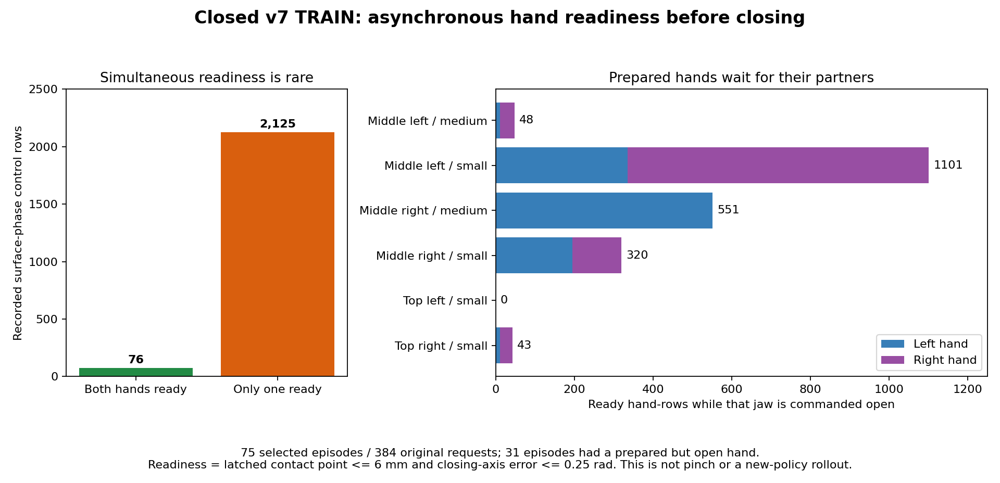
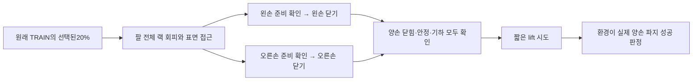

# 한 손이 준비됐을 때 먼저 닫는 SAC 수집 비교

목표는 원래 박스·base·flap 무작위화를 유지하면서 학습된 SAC가 양손 파지,
유지와 짧은 lift에 안전하게 성공하는 것이다. 최고 학습 모델은13/128회이며
중형 성공0회로 아직 목표에 미달한다.

## 실제로 확인한 병목

직전 예측 접촉v7은 학습384조건 뒤 보조 없는 전체 평가에서9/128회였다.
자기 초기14회보다 낮다. 종료 TRAIN384요청의 실제238,980행을 확인했으며,
초기 무효1요청은 원래 분모에 남겼다. 탐색75회는 성공0·안전 위반46·timeout29,
양손 opposing pinch0·lift 시도0회였다.

표면 접근 단계13,951행에서 한 번 선택한 접촉 지점6mm 이내이고 닫힘 축
오차0.25rad 이내인 상태를 손별로 계산했다. 두 손이 동시에 준비된 행은76개,
한 손만 준비된 행은2,125개였다. 탐색31경로에서는 준비된 손도 다른 손을
기다리며 열린 채 남았다. 이는 실제 명령과 관측의 분석이지 가정한 새 방법의
실행 결과나 pinch 증거가 아니다. 단계 집계와 jaw 명령은 재현했지만 연속 팔
목표는 최대0.0364오차가 있어 검증하지 않았고 허용 오차를 늘리지 않았다.
[원래 분모·단계·명령·손별 집계](assets/rl_v2_predictive_contact_closed_TRAIN_individual_readiness_20261009.json).

별도 종료v6에서 표면6mm/축 준비 상태를 기존 nominal midpoint12cm jaw gate가
막은 hand-row는0이었다. 이 gate는 이번 수정에서 유지한다. 관측도 안정적인
flap midpoint를 유지하며, 선택 접촉 지점은 탐색 helper에서만 사용한다.
[기존 gate와 표면 거리의 해석](assets/rl_v2_closed_TRAIN_nominal_jaw_gate_surface_readiness_20261009.json).

## 변경한 동작

`URDFIndependentHandCloseSACPilot`은 v8의 손바닥·팔뚝 랙 회피에 손별 닫기
옵션을 추가한다. 기존20% TRAIN 탐색 경로에서만 각 손이 준비되면 그 손의
그리퍼를 닫는다. 아직 준비되지 않은 손은 열린 채 접근한다. 닫는 손에는
기존 위치 피드백과 짧은 flap 이동 예측을 적용한다. 각 손이12mm 또는
0.30rad 재획득 범위를 벗어나거나 기존 action projector가 닫기를 거부하면
그 손만 열고 준비 상태를 다시 확인한다.

들기 조건은 양손이 모두 준비된 상태로 유지한다. 두 손의 실제 projected
닫기 명령24틱, 측정된 닫힘85% 이상, 틱당 변화0.5% 이내6틱, 양손 접촉 지점
6mm·축0.25rad를 모두 확인한 뒤에만25mm lift를 시도한다. 한 손의 닫힘이나
그리퍼 위치 안정은 실제 pinch/성공을 대신하지 않는다. 환경의 기존 양손
opposing pinch·hold·proof lift·안전 기준이 성공을 판단한다.

SAC의 actor·critic·target sampling·density·entropy와 보조 없는 greedy 평가에는
helper가 들어가지 않는다. 성공/실패 비중 조절은 별도 비교다. 기존 모델과
기본 설정은 유지하며 새 checkpoint는 별도v9 artifact와 엄격한 계약으로
저장·재개·Q 영상 복원한다.

## 확인과 실행 범위

필요한 CPU 검사35개가 통과했다. 여기에는 한 손만 준비/정착한 상태의 lift
금지, 손별 재진입, projector 거부, reset의 latch 해제, 선택하지 않은 경로
보존, 실제 명령/저장 목표 일치와 기존 동작 회귀가 포함된다.

새 초기 모델은 이전v8 초기 actor/normalizer29개와 같고, 종료 TRAIN의 실제
384상태에서21개 greedy 목표도 정확히 같았다. Q·replay·optimizer는 새로
시작한다. 실제 저장·학습 재개·Q 영상 복원을 확인했다.
[초기 모델의 실제 검증](assets/rl_v2_URDF_independent_hand_close_initial_verified_20261009.json).

준비 옵션은 `prepare_urdf_regional_goal_sac.py`의
`--servo-retention-profile full-arm-independent-hand-close`와
`--body-behavior arm20-gentle-rest-greedy`다. 새 고유 폴더에 준비한다.
원래 여섯 조합의 초기 DEV128·TRAIN384·학습 후 DEV128로 비교하며, 준비 완료를
새 물리 학습 시작이나 성공으로 보고하지 않는다. 기존 Drive 연결과
checkpoint/log300초 업로드·체크섬 검증·최신2개 유지 규칙을 재사용한다.
독립 FINAL은 아직 사용하지 않는다.
