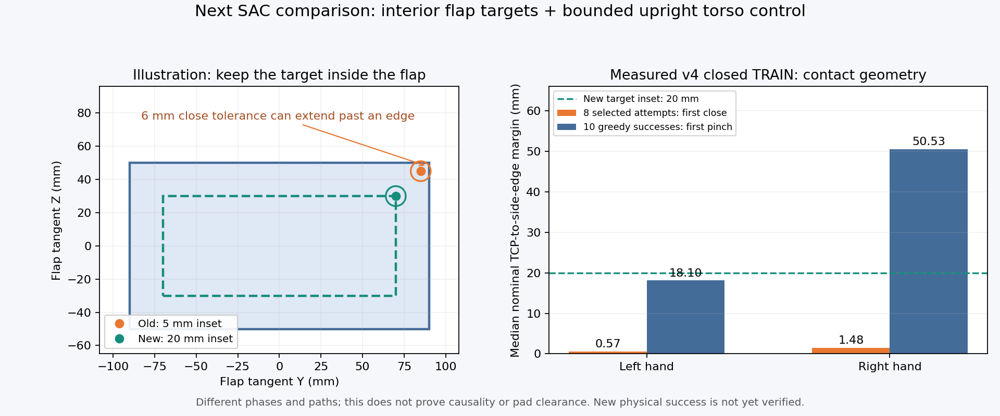

# Flap 모서리를 피해 잡는 SAC 비교

목표는 박스와 base 시작 상태가 달라도 양손 flap 파지·유지·들기에 성공하는
학습된 SAC다. 최근 학습 후 전체평가 최고는13/128회이고 중형 성공은0회다.
기존 장기 학습과 몸통 유지 v5 비교를 계속하면서, 접촉 지점 문제를 v6로 분리한다.

## 실제로 확인한 실패

닫힘 추종을 강화한 v4의 첫 TRAIN128에서 탐색25경로는 실제 파지/성공0회였다.
닫기를 시도한8경로는14번 모두5–7틱 뒤 다시 열렸다. 거리12mm 조건이 원인이었고,
축 오차 초과는0회였다. 실제 그리퍼 닫힘은26.8–52.5%로 아직 덜 닫힌 상태였다.
상단11경로도 표면 접근 단계에 들어가지 못했다. 강화한 피드백만으로 해결되지 않았다.
[완료82,554행·실행 명령과 종료·닫힘 분석](assets/rl_v2_motion_feedback_completed_TRAIN_motion_analysis_20261009.json).

탐색8경로의 첫 닫기 TCP는 flap 옆 모서리에서 중앙값 좌0.57mm·우1.48mm 안쪽이었다.
성공10경로의 첫 실제 양손 파지는 좌18.10mm·우50.53mm 안쪽이었다. 실패에서도
손은 랙 안쪽을 향했다. 이 수치는 nominal TCP의 기하이고 실제 pad 위치 측정은
아니다. 서로 다른 경로와 단계이므로 모서리가 실패를 일으켰다고 확정하지 않는다.
[24경로의 실제 지점·방향·분석 한계](assets/rl_v2_motion_feedback_completed_TRAIN_panel_margins_20261009.json).

## 바꾸는 부분

- **목표 지점:** flap 접선 방향의 최소 여유를5→20mm로 늘린다. 손에 가까운
  패널 지점을 선택하고 한 시도 동안 패널 좌표에 고정한다. 중심점으로 강제하지 않는다.
  지점6mm 허용 오차만 고려하면 모서리까지 약14mm 기하 여유를 남기지만 실제
  pad 접촉이나 충돌 없는 파지를 보장하지 않는다.
- **몸통과 팔:** v5와 같은 몸통 X/Z 범위·양팔 SAC 분포와 진입 후 몸통 유지다.
  박스/base/flap 무작위화, 보상, 관절 속도·힘 제한, 양손 파지·유지·들기·안전 조건은 유지한다.
- **학습과 평가:** 기존20% TRAIN 탐색 선택에만 새 지점을 쓴다. 접촉 힘·파지·
  보상·성공 판정은 탐색 입력으로 쓰지 않는다. Actor/Q sampling·밀도·entropy와
  보조 없는 greedy 평가는 v5와 같다. 새 Q/replay/optimizer로 시작한다.

선택 옵션은 `scripts/rl/prepare_urdf_regional_goal_sac.py`의
`--servo-retention-profile full-arm-interior-contact`와
`--body-behavior arm20-gentle-rest-greedy`다. 기존 옵션은5mm 지점과 원래 동작을 유지한다.
Artifact는 `staged_actual_flap_URDF_upright_interior_contact_exploration_sac_v6`이며
모델 재개·평가 영상 복원·완료 replay 진단에도 별도 계약을 연결했다.

## 검증과 실제 실행 구분

관련 검사79개와 실제 초기 checkpoint 저장·학습 재개·영상용 모델 복원이 통과했다.
기존 v5와actor/정규화29개·몸통 범위 buffer·frozen source가 같았다. 검증된 완료
TRAIN의384상태에서 초기 greedy 목표21개가 모두 정확히 같았고 density와
entropy도 유한했다. 분석 상태나 명령은 학습에 넣지 않았다. 이는 초기화·범위
검증이며 새 물리 성공이나 학습 개선은 아직 확인하지 않았다.
[실제 저장·재개·초기 정책 대조](assets/rl_v2_URDF_interior_contact_initial_verified_20261009.json).

완료된 실제 v4 TRAIN의 탐색 시작25상태도 대조했다. 새 양손 목표50개 모두
알려진 패널 접선 경계에서20mm 안쪽이었고 기존 목표 대비 이동은최대2.12cm였다.
이는 후보 지점의 기하 검증이며 v6가 실제로 실행한 궤적이나 파지 성공이 아니다.
[실제 탐색 시작 상태의 후보 지점](assets/rl_v2_interior_contact_actual_handoff_geometry_20261009.json).

원래 첫 다섯 배치의 TRAIN384·초기/학습 후 전체DEV각128·replay25만으로 비교한다.
중간/상단·좌/우와small/medium의 원래 여섯 조합을 유지하고 독립FINAL은 아직
사용하지 않는다. 기존 일곱 장기 비교는TRAIN6,144·replay200만으로 계속한다.
GPU3의 앞선 v4 writer/supervisor가 정상 종료하고 최종Drive 검증을 마친 뒤,
GPU 메모리·디스크를 다시 확인해 별도 v6를 시작하도록 CPU 대기 작업을 연결한다.
준비 파일의 존재를 실제 학습 시작으로 판단하지 않는다.

기존 Drive 연결·300초 업로드·크기/MD5 검증·최신2개 checkpoint 보호를 재사용한다.
RawHDF/replay/영상은 checkpoint/log 전용 백업 범위에 없으므로 로컬에 보관한다.
종료 로그는 writer가 멈춘 뒤 검증하며 다른 사용자 파일·프로세스는 변경하지 않는다.

[최신 전체평가·실제 실행 상태·성공/실패 영상](RL_V2_SAC_PROGRESS_20261009.md).
