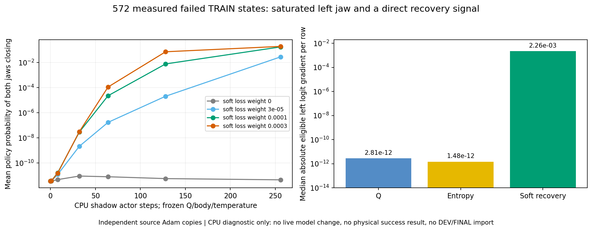

# 단단한 flap SAC: 그리퍼 확률 복구 비교 (2026-10-06)

단단한 **동적** flap과 기존 박스·base·배경 randomization을 유지한 실제 TRAIN에서, 접근 후에도 왼쪽 그리퍼 닫힘 확률이 거의 0인 구간을 확인했다. 10% joint-jaw 행동 탐색과 별도로, SAC actor가 이 상태에서 회복할 수 있도록 선택형 보조 손실을 비교한다. 아직 일반화된 양손 파지 성공을 달성한 결과가 아니다.

## 유지하는 물리 설정과 판정

| 항목 | 설정 |
| --- | --- |
| flap stiffness | 1.5–2.5 Nm/rad |
| flap damping | 0.15–0.25 Nm·s/rad |
| flap static / dynamic friction | 0.45–0.65 / 0.30–0.40 |
| 초기 flap 각도 | ±1° |
| 동작 중 flap | 물리적으로 움직임; 고정하거나 각도를 강제로 유지하지 않음 |
| 성공 | 양손이 서로 다른 flap을 잡고 각 pad ≥5 N, 안정된 hold ≥0.25 s, roller clearance lift ≥8 mm |
| 충돌 | rack 10 N, 로봇과 주변 장애물 5 N; 바닥·박스 제외, self-collision OFF |
| 평가 | 원래 네 구역 각 32개, 전체 128개를 분모로 사용; 초기 invalid도 포함 |

실제 base 접근 후 자세를 유지하는 기존 제어 경로를 사용한다. 이를 학습된 navigation 성공으로 해석하지 않는다. DEV/FINAL을 replay나 성공 보조 학습에 넣지 않는다.

## 실제 TRAIN에서 확인한 원인

완료된 n-step16 비교의 실제 실패 TRAIN 중 상단 오른쪽에서 양손이 접근한 안전 구간 **572개 상태**를 검사했다. 원본 checkpoint/replay와 실행 중인 정책은 변경하지 않았다.

| 관측 | 결과 |
| --- | --- |
| 왼손 유효 jaw logit | −43.66…−21.20 |
| 왼손 logit에 대한 Q 경사 절댓값 중앙값 | 2.81×10⁻¹² |
| 왼손 entropy 경사 절댓값 중앙값 | 1.48×10⁻¹² |
| Q+entropy 경사 절댓값 중앙값 | 5.65×10⁻¹³ |
| 비교 손실의 경사 절댓값 중앙값 | 2.26×10⁻³ |
| 현재 greedy보다 양손 닫힘 Q가 ≥0.05 높은 상태 | 131/572 |

Q 수치는 모델의 예측이며 실제 안전 파지의 증거가 아니다. 이 분석은 해당 logit의 국소 경사가 작다는 뜻이다. 공유 네트워크 업데이트나 실제 성공 TRAIN의 jaw NLL을 통해 변화할 가능성까지 배제하지 않는다.



[실제 TRAIN 경사·복제 actor 결과 JSON](assets/rl_v2_actual_TRAIN_jaw_saturation_gradient_CPU_20261006.json)

## 추가한 선택형 actor 손실

`--jaw-saturation-penalty logit4-soft`를 actual-flap TRAIN 실행에서 선택한다. 기본은 비활성화이며 다른 RL 학습 설정은 유지된다. 이미 활성화된 checkpoint를 재개할 때는 설정과 시작점 기록을 자동 복원하고, 일치하지 않는 replay/설정을 거부한다.

각 상태에서 기존 production near gate로 허용된 그리퍼에만 다음 손실을 적용한다.

```text
0.0001 × mean_states(
  sum_eligible_jaws(relu(abs(logit) − 4)²) / max(number_of_eligible_jaws, 1)
)
```

열림/닫힘에 대칭이며, 먼 손과 |logit|≤4에는 손실·경사가 없다. **soft 손실**이므로 확률 하한이나 logit 상한을 보장하지 않는다. logit ±4에서 닫힘 확률은 약 0.018/0.982이지만 강한 다른 학습 신호는 그 범위를 넘어갈 수 있다. 강제 닫힘, logit clipping, reward 변경, 성공 라벨 생성은 하지 않는다.

실제 executed action, 네 가지 learned jaw branch의 SAC 계산, Q target 식, 10% 행동 탐색과 물리 projector를 유지한다. **actor 목적함수는 달라진다.** 활성화 시 기존 actor/Q/normalizer/네 optimizer 상태와 실제 replay를 보존한다. 이후 실제 TRAIN actor update부터 새 손실을 더한다. frozen DEV에는 탐색 혼합이나 optimizer update를 적용하지 않는다.

실패 상태의 actor만 256회 CPU에서 업데이트한 비교에서는 weight 0 / 0.00003 / 0.0001 / 0.0003의 평균 양손 닫힘 확률이 각각 약 4.57×10⁻¹² / 0.0281 / 0.1739 / 0.1905였다. Q·body·temperature를 동결했고 각 시험마다 optimizer를 독립 복제했다. 전체 SAC 학습이나 실제 동작 성공의 결과가 아니다.

## 최소 검증과 실제 비교

- 관련 CPU 검사 **57개 통과** 및 수정 파일 compile 통과.
- 실제 immutable checkpoint Q6864와 일치하는 replay 256개, 실제 TRAIN n-step 64개, 실제 성공 TRAIN 64개로 각 변형을 한 번씩 CPU에서 전체 SAC update했다. 모든 손실이 유한했고, 첫 Q/target update가 정확히 일치했다. 추가 손실은 0.0008688, 적용 가능한 손 163개 중 범위 밖 98개였다. 이는 한 번의 통합 검사이며 장기 Q 일치나 실제 성공을 보장하지 않는다.
- [실제 입력으로 한 번 전체 업데이트한 결과](assets/rl_v2_jaw_saturation_actual_source_CPU_20261006.json)
- 별도 GPU3 비교는 같은 Q6864·실제 replay·네 구역 원래 seed schedule로 `전체 DEV → 실제 TRAIN 두 wave → 전체 DEV`를 수행한다. `measured-nstep16`, `joint-epsilon10`을 동일하게 두고 이 actor 손실만 추가한다.
- 실행별 고유 폴더, `CUDA_VISIBLE_DEVICES=3`, 기존 Drive 연결의 300초 업로드·checksum 검증 후 최근 두 checkpoint 유지, writer 종료 후 로그/HDF/replay 최종 백업을 사용한다. 새 실행은 공간 부족을 피하도록 소유한 private RAM 폴더에 기록한다. RAM 원본은 재부팅 시 사라지며 검증된 Drive 사본은 유지된다.

판단 기준은 실제 pad 접촉과 안정된 양손 파지, 네 구역 전체 DEV 성공률이다. 닫힘 명령이 증가하거나 CPU 경사가 커지는 것만으로 학습 성공을 판단하지 않는다. 독립 FINAL은 아직 사용하지 않았다.

06:03 KST에 실제 비교를 시작했다. 부모 폴더는 `actual_flap_joint_jaw_logit4_credit16_sac_pgs128_gpu3_20261006_060348`, run은 `batch_sac_20261006_060349_1b67f5`다. Writer PID1547049와 supervisor PID1546914의 소유자·run·`CUDA_VISIBLE_DEVICES=3` 및 unit running을 확인했다. 시작 전 GPU3 free 47,032 MiB, host MemAvailable 약959 GiB, private tmpfs free 약500 GiB였다. 실행 설정은 구현 커밋 `0ae624f`이며 기존 실행을 중단하지 않았다. 현재는 초기 전체 DEV 전 입력 복원 단계이고 실제 새 actor update의 효과는 아직 확인 전이다. 실제 manifest에서 flap 범위와 선택형 actor 손실·행동 탐색을 확인했다. [실제 실행·manifest 확인 원본](assets/rl_v2_jaw_saturation_actual_GPU3_startup_20261006.json).

기존 joint-jaw 탐색의 첫 TRAIN은 3/128 성공(모두 중간 오른쪽), 위쪽 0건이었다. 별도 GPU0 장기 비교도 정상 종료했지만 전체 DEV가 초기4→최종1/128이었다. 실제 수집이나 학습 횟수 증가를 성공 개선으로 해석하지 않는다.

[그림이 포함된 간단한 Notion 하위 페이지](https://app.notion.com/p/3f063918d42a8116bfaccbac51842e3e)에도 원인·수정·실험·해석 한계를 기록했다. 새 그림은 native 이미지1개로 저장했고 부모 페이지의 기존 native media99개와 기존 하위 페이지를 보존했다.

## 코드

- `src/kuavo_isaaclab_scene/rl/multi_box/experiments/jaw_saturation.py`: 선택형 손실·통계.
- `src/kuavo_isaaclab_scene/rl/algorithms/hybrid_goal_sac.py`: 일반 SAC의 기본 비활성 actor hook.
- `src/kuavo_isaaclab_scene/rl/multi_box/experiments/actual_flap_residual_sac.py`: 설정/출처/checkpoint/replay 복원 연결.
- `scripts/rl/train_batched_staged_goal.py`: TRAIN CLI와 manifest/HDF/결과 기록.

기존 행동 탐색 분석은 [TRAIN jaw coverage 기록](RL_V2_TRAIN_JAW_COVERAGE_20261006.md), 단단한 flap 설정과 비교 배경은 [actual-flap SAC 기록](RL_V2_ACTUAL_FLAP_RESIDUAL_SAC.md)을 참고한다.
