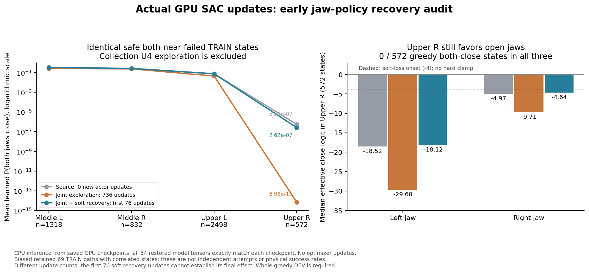

# 단단한 flap SAC: 그리퍼 확률 복구 비교 (2026-10-06)

단단한 **동적** flap과 기존 박스·base·배경 randomization을 유지한 실제 TRAIN에서, 접근 후에도 왼쪽 그리퍼 닫힘 확률이 거의 0인 구간을 확인했다. 10% joint-jaw 행동 탐색과 별도로, SAC actor가 이 상태에서 회복할 수 있도록 선택형 보조 손실을 비교한다. 아직 일반화된 양손 파지 성공을 달성한 결과가 아니다.

## 유지하는 물리 설정과 판정

| 항목 | 설정 |
| --- | --- |
| flap stiffness | 1.5–2.5 Nm/rad |
| flap damping | 0.15–0.25 Nm·s/rad |
| flap static / dynamic friction | 0.45–0.65 / 0.30–0.40 |
| 초기 flap 각도 | ±1° |
| 동작 중 flap | 물리적으로 움직임; 고정하거나 각도를 강제로 유지하지 않음 |
| 성공 | 양손이 서로 다른 flap을 잡고 각 pad ≥5 N, 안정된 hold ≥0.25 s, roller clearance lift ≥8 mm |
| 충돌 | rack 10 N, 로봇과 주변 장애물 5 N; 바닥·박스 제외, self-collision OFF |
| 평가 | 원래 네 구역 각 32개, 전체 128개를 분모로 사용; 초기 invalid도 포함 |

실제 base 접근 후 자세를 유지하는 기존 제어 경로를 사용한다. 이를 학습된 navigation 성공으로 해석하지 않는다. DEV/FINAL을 replay나 성공 보조 학습에 넣지 않는다.

## 실제 TRAIN에서 확인한 원인

완료된 n-step16 비교의 실제 실패 TRAIN 중 상단 오른쪽에서 양손이 접근한 안전 구간 **572개 상태**를 검사했다. 원본 checkpoint/replay와 실행 중인 정책은 변경하지 않았다.

| 관측 | 결과 |
| --- | --- |
| 왼손 유효 jaw logit | −43.66…−21.20 |
| 왼손 logit에 대한 Q 경사 절댓값 중앙값 | 2.81×10⁻¹² |
| 왼손 entropy 경사 절댓값 중앙값 | 1.48×10⁻¹² |
| Q+entropy 경사 절댓값 중앙값 | 5.65×10⁻¹³ |
| 비교 손실의 경사 절댓값 중앙값 | 2.26×10⁻³ |
| 현재 greedy보다 양손 닫힘 Q가 ≥0.05 높은 상태 | 131/572 |

Q 수치는 모델의 예측이며 실제 안전 파지의 증거가 아니다. 이 분석은 해당 logit의 국소 경사가 작다는 뜻이다. 공유 네트워크 업데이트나 실제 성공 TRAIN의 jaw NLL을 통해 변화할 가능성까지 배제하지 않는다.


[실제 TRAIN 경사·복제 actor 결과 JSON](assets/rl_v2_actual_TRAIN_jaw_saturation_gradient_CPU_20261006.json)

## 추가한 선택형 actor 손실

`--jaw-saturation-penalty logit4-soft`를 actual-flap TRAIN 실행에서 선택한다. 기본은 비활성화이며 다른 RL 학습 설정은 유지된다. 이미 활성화된 checkpoint를 재개할 때는 설정과 시작점 기록을 자동 복원하고, 일치하지 않는 replay/설정을 거부한다.

각 상태에서 기존 production near gate로 허용된 그리퍼에만 다음 손실을 적용한다.

```text
0.0001 × mean_states(
  sum_eligible_jaws(relu(abs(logit) − 4)²) / max(number_of_eligible_jaws, 1)
)
```

열림/닫힘에 대칭이며, 먼 손과 |logit|≤4에는 손실·경사가 없다. **soft 손실**이므로 확률 하한이나 logit 상한을 보장하지 않는다. logit ±4에서 닫힘 확률은 약 0.018/0.982이지만 강한 다른 학습 신호는 그 범위를 넘어갈 수 있다. 강제 닫힘, logit clipping, reward 변경, 성공 라벨 생성은 하지 않는다.

실제 executed action, 네 가지 learned jaw branch의 SAC 계산, Q target 식, 10% 행동 탐색과 물리 projector를 유지한다. **actor 목적함수는 달라진다.** 활성화 시 기존 actor/Q/normalizer/네 optimizer 상태와 실제 replay를 보존한다. 이후 실제 TRAIN actor update부터 새 손실을 더한다. frozen DEV에는 탐색 혼합이나 optimizer update를 적용하지 않는다.

실패 상태의 actor만 256회 CPU에서 업데이트한 비교에서는 weight 0 / 0.00003 / 0.0001 / 0.0003의 평균 양손 닫힘 확률이 각각 약 4.57×10⁻¹² / 0.0281 / 0.1739 / 0.1905였다. Q·body·temperature를 동결했고 각 시험마다 optimizer를 독립 복제했다. 전체 SAC 학습이나 실제 동작 성공의 결과가 아니다.

## 최소 검증과 실제 비교

- 관련 CPU 검사 **57개 통과** 및 수정 파일 compile 통과.
- 실제 immutable checkpoint Q6864와 일치하는 replay 256개, 실제 TRAIN n-step 64개, 실제 성공 TRAIN 64개로 각 변형을 한 번씩 CPU에서 전체 SAC update했다. 모든 손실이 유한했고, 첫 Q/target update가 정확히 일치했다. 추가 손실은 0.0008688, 적용 가능한 손 163개 중 범위 밖 98개였다. 이는 한 번의 통합 검사이며 장기 Q 일치나 실제 성공을 보장하지 않는다.
- [실제 입력으로 한 번 전체 업데이트한 결과](assets/rl_v2_jaw_saturation_actual_source_CPU_20261006.json)
- 별도 GPU3 비교는 같은 Q6864·실제 replay·네 구역 원래 seed schedule로 `전체 DEV → 실제 TRAIN 두 wave → 전체 DEV`를 수행한다. `measured-nstep16`, `joint-epsilon10`을 동일하게 두고 이 actor 손실만 추가한다.
- 실행별 고유 폴더, `CUDA_VISIBLE_DEVICES=3`, 기존 Drive 연결의 300초 업로드·checksum 검증 후 최근 두 checkpoint 유지, writer 종료 후 로그/HDF/replay 최종 백업을 사용한다. 새 실행은 공간 부족을 피하도록 소유한 private RAM 폴더에 기록한다. RAM 원본은 재부팅 시 사라지며 검증된 Drive 사본은 유지된다.

판단 기준은 실제 pad 접촉과 안정된 양손 파지, 네 구역 전체 DEV 성공률이다. 닫힘 명령이 증가하거나 CPU 경사가 커지는 것만으로 학습 성공을 판단하지 않는다. 독립 FINAL은 아직 사용하지 않았다.

06:03 KST에 실제 비교를 시작했다. 부모 폴더는 `actual_flap_joint_jaw_logit4_credit16_sac_pgs128_gpu3_20261006_060348`, run은 `batch_sac_20261006_060349_1b67f5`다. Writer PID1547049와 supervisor PID1546914의 소유자·run·`CUDA_VISIBLE_DEVICES=3` 및 unit running을 확인했다. 시작 전 GPU3 free 47,032 MiB, host MemAvailable 약959 GiB, private tmpfs free 약500 GiB였다. 실행 설정은 구현 커밋 `0ae624f`이며 기존 실행을 중단하지 않았다. 현재는 초기 전체 DEV 전 입력 복원 단계이고 실제 새 actor update의 효과는 아직 확인 전이다. 실제 manifest에서 flap 범위와 선택형 actor 손실·행동 탐색을 확인했다. [실제 실행·manifest 확인 원본](assets/rl_v2_jaw_saturation_actual_GPU3_startup_20261006.json).

기존 joint-jaw 탐색의 첫 TRAIN은 3/128 성공(모두 중간 오른쪽), 위쪽 0건이었다. 별도 GPU0 장기 비교도 정상 종료했지만 전체 DEV가 초기4→최종1/128이었다. 실제 수집이나 학습 횟수 증가를 성공 개선으로 해석하지 않는다.

[그림이 포함된 간단한 Notion 하위 페이지](https://app.notion.com/p/3f063918d42a8116bfaccbac51842e3e)에도 원인·수정·실험·해석 한계를 기록했다. 새 그림은 native 이미지1개로 저장했고 부모 페이지의 기존 native media99개와 기존 하위 페이지를 보존했다.

06:16 KST에는 새 실행이 초기 frozen DEV0의31step에 진입했다. Actor1204·critic6864·replay224621·online TRAIN0·jaw sampler0을 확인했다. 128개 중 원래 초기 유효97·무효31이며 무효도 전체 분모에 포함한다. 18개 asset의 네 hinge, **각 물성 9,216개**를 모두 확인해 강성1.5000~2.4999·감쇠0.1500~0.2500·static friction0.4500~0.6500·dynamic friction0.3000~0.4000이 요청 범위 안에 있음을 검증했다. 이는 reset setter에서 실제 PhysX readback으로 검증된 값을 environment identity별로 보관한 기록이다. 상태를 다시 쓰거나 randomization을 재추첨하지 않았다. 초기 무효 사례의 값은 현재 replacement의 값이며 원래 실패의 원인으로 사용하지 않는다. 초기 각도는 이 네 물성 cache에 포함되지 않는다. [전체 적용값·초기 DEV 카운터 확인](assets/rl_v2_jaw_saturation_initial_DEV_profile_20261006.json). 아직 전체 초기 DEV와 새 TRAIN 결과는 완료 전이다.

## 코드

닫은 뒤에도 접촉이 없는 실제 TRAIN의 위치 오차는 [정밀 포착 진단](RL_V2_PRECISE_CAPTURE_AUDIT_20261006.md)에 별도로 기록했다. 새 soft 손실의 실제 효과와 구분하며, 기존 실행과 성공/안전 조건은 유지한다.

## 실제 TRAIN 두 wave와 새 실행의 초기 기준선

10% joint-jaw 비교의 TRAIN1/2는 각128건을 완료해 **3/128,4/128** 성공했다. 모두 중간 오른쪽이며 나머지 세 구역의 TRAIN 성공은0이다.7건 모두 actual 양손 unique pinch·stable hands·서로 다른 flap·hold0.2667s·roller clearance22.2–47.0mm·안전 위반 없음으로 확인했다. 원래 초기 무효45/30건을 분모에서 빼지 않았다. Actor1940/Q9808, online88,794행을 확보했고 학습 후 greedy DEV에 진입했다. 원래 source1204/Q6864에서 진행한 실제 SAC update이며, 탐색 TRAIN 성공을 greedy 정책의 일반화 성공으로 해석하지 않는다. [완료된 두 TRAIN과 물리 증거](assets/rl_v2_joint_jaw_completed_TRAIN_pair_20261006.json).

추가 logit4-soft 비교는 전체 초기 frozen DEV에서 **9/128**(중간 왼쪽2·중간 오른쪽7·위쪽0) 성공했다. 초기 무효31·unsafe70·timeout18을 포함해128개 전부를 기록했다. 이때 actor1204/Q6864/replay224621/online0/jaw sampler0, 새 학습·penalty update0회다. 저장 완료된 초기 DEV checkpoint의 **actor/Q/target/normalizer tensor54개 모두 source와 정확히 같다**. 별도 비교의 초기6/128과 차이는 새 학습 효과가 아니다. 이번 실행의 학습 후 전체 DEV는 자신의9/128 기준선과 비교한다. [전체 초기 DEV와 물리 증거](assets/rl_v2_jaw_recovery_completed_initial_DEV_20261006.json).

같은 immutable 실제 TRAIN에서 production의 moving-fingertip capture 점수도 검사했다. 안전한 양손 닫힘 상태에서 두 손 모두 접촉 없는151개 표본 중98개는 capture potential≥0.8이었다. 이는 positive reward를 매 step 지급한다는 뜻이 아니며, 보관한 경로의 상관된 상태 표본이다. [점수·접촉 분포 그림과 해석 한계](RL_V2_PRECISE_CAPTURE_AUDIT_20261006.md#실제-움직이는-손가락으로-계산된-capture-점수도-확인). 실제 물리 비교는 계속하고, reward·success·safety·randomization을 바꾸거나 active HDF/replay를 읽지 않았다.

- `src/kuavo_isaaclab_scene/rl/multi_box/experiments/jaw_saturation.py`: 선택형 손실·통계.
- `src/kuavo_isaaclab_scene/rl/algorithms/hybrid_goal_sac.py`: 일반 SAC의 기본 비활성 actor hook.
- `src/kuavo_isaaclab_scene/rl/multi_box/experiments/actual_flap_residual_sac.py`: 설정/출처/checkpoint/replay 복원 연결.
- `scripts/rl/train_batched_staged_goal.py`: TRAIN CLI와 manifest/HDF/결과 기록.

## 실제 GPU 업데이트 후 같은 TRAIN 상태에서 비교

저장된 immutable 실제 TRAIN69경로에서 안전·유효 관측·양손 production near를 만족한 실패 상태를 고정했다. Source Q6864, joint 탐색의 학습 후 Q9808, soft 복구의 첫 저장 Q7168을 **같은 입력**으로 비교했다. 각 checkpoint의 actor/Q/target/normalizer tensor54개를 CPU에서 정확히 복원하고 input size/MD5와 파일 불변성을 다시 검사했다. 실행 중 HDF/replay와 물리 상태는 읽거나 수정하지 않았다.



| 정책 / source 이후 새 actor update | 중간 왼쪽 P(양손 닫힘) | 중간 오른쪽 | 위 왼쪽 | 위 오른쪽 |
| --- | ---: | ---: | ---: | ---: |
| source / 0회 | 0.3367 | 0.2697 | 0.07768 | 5.58×10⁻⁷ |
| joint 탐색 / 736회 | 0.2576 | 0.2392 | 0.04506 | 6.98×10⁻¹⁵ |
| joint + soft / 첫76회 | 0.3291 | 0.2653 | 0.07523 | 2.62×10⁻⁷ |

분석 상태 수는 지역 순서대로1,318/832/2,498/572개다. 값은 순수 학습 정책의 평균 `sigmoid(left_logit) × sigmoid(right_logit)`이며 수집의10% U4 탐색을 제외한다. 보관한 TRAIN 일부의 상관된 상태 표본이므로 전체 시도 성공률이나 물리 counterfactual이 아니다.

위 오른쪽 왼손 logit 중앙값은 source−18.52 → joint−29.60 → soft 첫76회−18.12다. 세 정책 모두572상태 전부에서 왼손 logit<−4이고 greedy 양손 닫힘은0개다. **10% 행동 탐색만으로 학습된 닫힘이 회복된 증거는 없다.** Soft의 첫76회도 아직 회복했다고 볼 수 없으며,736회 업데이트한 joint와 동일 학습량 비교가 아니다. 남은 실제 TRAIN 및 각 실행 자신의 초기 기준선 대비 전체 greedy DEV를 확인한 뒤 다음 변경을 판단한다. [전체 수치·checkpoint SHA256](assets/rl_v2_jaw_recovery_first_GPU_updates_fixed_TRAIN_20261006.json).

[audit_jaw_recovery_checkpoint.py](../scripts/rl/audit_jaw_recovery_checkpoint.py)는 CPU inference만 수행하는 재현 도구다. 첫 checkpoint를 reference로 사용하고 반복 `--checkpoint`로 정책을 추가한다. 각 checkpoint의 학습 횟수·설정·해시와 지역별 확률/logit/greedy 변화를 기록한다. Optimizer update·물리 rollout·DEV/FINAL import는0회다.

```bash
CUDA_VISIBLE_DEVICES='' OMP_NUM_THREADS=1 MKL_NUM_THREADS=1 PYTHONPATH=src:scripts/rl \
python scripts/rl/audit_jaw_recovery_checkpoint.py \
  --experience /absolute/path/to/immutable-input/staged_goal_experience.pt \
  --verified-receipt /absolute/path/to/input-directory-verification.json \
  --checkpoint /absolute/path/to/source/checkpoint_00006864.pt \
  --checkpoint /absolute/path/to/saved-comparison/checkpoint_00009808.pt \
  --output-json /absolute/path/to/jaw-policy-comparison.json
```

실제2.32GB immutable 입력과 세 saved checkpoint로 도구를 실행했고 compile도 통과했다. 첫 reference의 변화량은 정확히0이다. 이번 분석은 reward·success·safety·randomization이나 활성 학습 모델을 변경하지 않았다. 일반화 목표와 독립 FINAL 확인은 아직 완료 전이다.

## 10% joint-jaw 비교의 학습 후 전체 DEV 완료

07:41 KST에 전체128건이 닫혔음을 확인했다. 초기6/128 → 학습 후9/128이며, 지역별 성공은 중간 왼쪽1→2·중간 오른쪽5→7·위 왼쪽0→0·위 오른쪽0→0이다. 초기 무효는29→29, unsafe69→77, timeout24→13이다. 새 actor736회·Q2944회와 실제 TRAIN88,794행 이후의 평가다. 평가 중에는 actor1940/Q9808/replay313415/online88794 및 행동 탐색 카운터가 TRAIN 종료 때와 동일하게 유지됐다.

9건 모두 실제 양손 unique pinch·stable hands·서로 다른 flap·hold≥0.25s·roller clearance≥8mm·안전 위반 없음을 확인했다. Pad≥5N은 production unique-pinch 판정으로 검증했으며 outcome snapshot에는 pad별 raw force가 없다. 원래 초기 invalid를128개 분모에서 빼지 않았다. [전체128건 요약·9건 물리 증거](assets/rl_v2_joint_jaw_completed_final_DEV_20261006.json).

관측된 성공 증가3건은 중간 선반에 한정되고 unsafe도 늘었다. 한 차례 비교에서 통계적으로 확실한 개선이나 네 구역 일반화 성공을 주장하지 않는다. 고정 TRAIN 상태 분석에서 위 오른쪽 열림 포화가 심해진 결과와 모순되지 않는다. 이 실행의 물리 평가는 끝났으며 원래 manager의 종료 후 로그/HDF/replay Drive 검증은 별도로 진행한다. Soft 복구 실행은 계속 실제 TRAIN 중이고 자신의 초기9/128 대비 최종 전체 DEV는 아직 완료 전이다. 독립 FINAL은 사용하지 않았다.

기존 행동 탐색 분석은 [TRAIN jaw coverage 기록](RL_V2_TRAIN_JAW_COVERAGE_20261006.md), 단단한 flap 설정과 비교 배경은 [actual-flap SAC 기록](RL_V2_ACTUAL_FLAP_RESIDUAL_SAC.md)을 참고한다.

이후 실제 GPU actor332회 뒤의 출력·persisted actor 손실과 계수10배 후보의 전체 SAC CPU 비교는 [복구 신호 강도 기록](RL_V2_JAW_RECOVERY_STRENGTH_20261006.md)에 이어서 기록한다. 기존 weak 실행을 유지하며 CPU 복제 모델을 물리 성공으로 해석하지 않는다.
