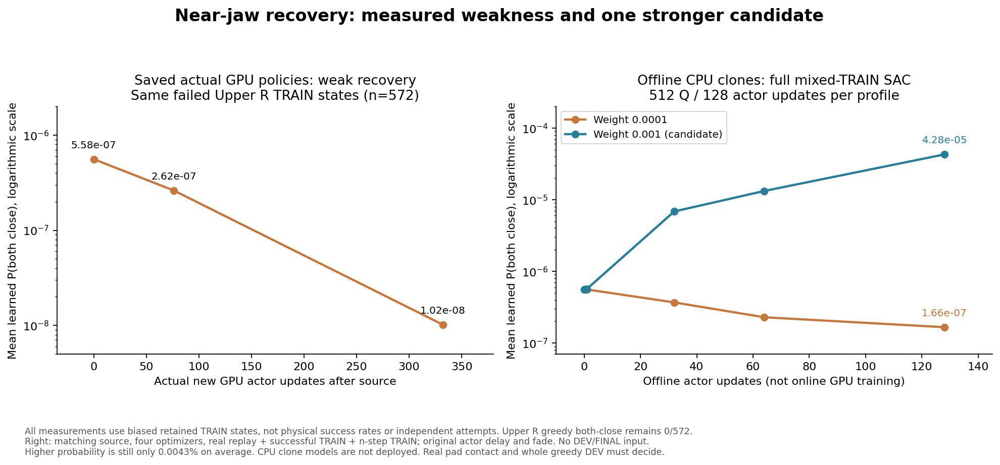

# Actual-flap SAC: 실제 actor 손실과 더 강한 복구 신호

단단한 동적 flap·원래 박스/base/배경 randomization·양손 파지/8mm proof lift·기존 안전 기준을 유지한다. [10% 탐색 비교](RL_V2_JAW_POLICY_RECOVERY_20261006.md#10-joint-jaw-비교의-학습-후-전체-dev-완료)는 전체 greedy DEV6→9/128이지만 중간 선반에만 성공하고 위쪽은0건이다. 추가 soft 복구 실행은 건강하게 계속 학습 중이다. 아직 네 구역 일반화 목표를 달성하지 못했다.

## 손실은 적용 중이지만 현재 신호는 충분하지 않다

Weak 복구 실행의 saved Q8192/actor1536을 같은 immutable 실제 TRAIN69경로에 적용했다. Source 이후 새 actor332회 뒤에도 위 오른쪽572개 안전·양손 near 실패 상태에서 greedy 양손 닫힘은0개다. 평균 양손 닫힘 확률은 source5.58×10⁻⁷ → 첫76회2.62×10⁻⁷ →332회1.02×10⁻⁸이다. 왼손 logit 중앙값은−18.52→−18.12→−18.05다. 보관한 상관된 TRAIN 상태의 정책 출력이며 실제 시도 성공률이나 물리 counterfactual이 아니다. [checkpoint 해시·정확한 복원·출력](assets/rl_v2_jaw_recovery_GPU_Q8192_fixed_TRAIN_20261006.json).

실제 GPU 실행의 `learner.latest_actor`에는 마지막 actor update 통계가 이미 보관된다. Critic-only인 `learner.latest`만 읽던 상태 요약에서 penalty가 누락됐을 뿐, 학습 연결이 끊긴 것은 아니다. Q8317 actor update에는 weight0.0001·limit4·활성 손131·포화 손70·최대 절대 logit21.11·penalty0.00055081이 기록됐고 손실은 유한했다. Saved checkpoint의 해당 통계는 `latest_actor_metrics`다. CPU 진단 도구도 이를 출력하도록 보강했다. 통계의 `critic_update`는 checkpoint의 Q count보다 앞설 수 있다.

## 실제 TRAIN 입력으로 전체 SAC 복제 비교

원래 source Q6864/actor1204와 네 optimizer를 각 시험마다 독립 복원했다. 실제 one-step replay256행에 원래 성공 TRAIN replay 비율/fade를 적용하고, 실제 완료 TRAIN n-step64행(weight0.1), 실제 성공 TRAIN64행(goal weight44.4444/jaw NLL weight0.05)을 사용했다. 기존 actor delay4와 normalization update를 유지하며 각 변형에서 Q512회·actor128회를 CPU로 업데이트했다. Body/Q/temperature도 함께 업데이트했다. Teacher BC loss는 비활성화이며 DEV/FINAL은 사용하지 않았다. Source input size/MD5·checkpoint SHA256·파일 불변성과 모든 유한 손실/모델을 검사했고 첫 Q/target update가 정확히 일치했다. 이후 actor와 Q는 달라질 수 있다.

| 동일 위 오른쪽572상태 · CPU actor128회 후 | weight0.0001 | weight0.001 |
| --- | ---: | ---: |
| 왼손 logit 중앙값 | −18.00 | −10.57 |
| 평균 P(양손 닫힘) | 1.66×10⁻⁷ | 4.28×10⁻⁵ |
| Greedy 양손 닫힘 | 0개 | 0개 |
| Source 대비 평균 body absolute-goal 변화 | 0.01326 | 0.00602 |

위 왼쪽 greedy 양손 닫힘 상태는 weak221→strong259개였다. 더 강한 계수가 포화를 줄이는 후보라는 근거지만, 위 오른쪽 확률도 평균0.0043%에 불과하며 greedy 닫힘은 여전히0개다. Body 변화도 정규화된 goal 좌표의 상태별 출력 차이이며 안전 동작이나 실제 joint/EEF 이동을 증명하지 않는다. 이 CPU 복제 모델을 checkpoint로 배포하거나 학습 성공으로 취급하지 않았다. [전체 CPU 수치·동일 입력·설정](assets/rl_v2_stronger_jaw_recovery_actual_mixed_TRAIN_CPU_20261006.json).

## 추가한 선택형 설정

`--jaw-saturation-penalty logit4-soft-strong`은 기존 `logit4-soft`와 같은 식의 **계수만0.0001→0.001**로 높인다. 가까운 손의 |logit|>4에 대칭 soft 손실을 적용한다. Hard clipping·확률 하한·강제 닫힘은 없다. 일반 RL 기본은 비활성화이고 기존 weak 설정을 유지한다. 저장된 활성 variant를 자동 복원하며 weak/strong/비활성 간의 암묵적 변경은 거부한다. Source의 모델·Q·normalizer·네 optimizer·원래 reward replay를 보존하고 이후 실제 actor update부터 적용한다. Actor 목적함수는 변경되며 Q target 식·행동 탐색·물리 projector·reward·success/safety·randomization은 유지한다.

관련 CPU 검사35개와 실제 immutable 입력의 두 full-SAC 복제 비교가 통과했다. 다음 GPU 비교는 같은 source Q6864/replay·네 구역 원래 schedule·n-step16·10% joint-jaw 탐색으로 `전체 DEV → 실제 TRAIN 두 wave → 전체 DEV`를 수행한다. 기존 healthy writer를 중단하거나 CPU 복제 actor를 가져오지 않는다. 새 고유 private RAM 폴더와 `CUDA_VISIBLE_DEVICES=3`, 기존 Drive300초 업로드·검증 후 최신두 checkpoint·writer 종료 후 최종 로그/HDF/replay 검증을 사용한다. RAM 원본은 재부팅 시 사라진다. 실행 여부와 물리 효과는 실제 PID·manifest·전체 평가 결과로 따로 확인한다.

판단은 해당 실행 자신의 초기 전체 DEV와 학습 후 전체 DEV, 실제 pad 접촉·안정된 양손 파지로 한다. Independent FINAL은 아직 사용하지 않았다. 닫힘 회복 후에도 접촉이 부족하면 실제 moving-fingertip capture의 더 좁은 falloff와 약한 손 점수로 새 matching-reward 비교를 만든다. Old reward replay를 추정한 새 개별 손 error로 재라벨링하지 않는다.

## 실제 GPU3 실행 시작 확인

07:58 KST에 `actual_flap_joint_jaw_logit4_strong_credit16_sac_pgs128_gpu3_20261006_075810` / `batch_sac_20261006_075810_59a062`를 시작했다. 구현 커밋은 `71dadd4`다. 실제 writer2726960·supervisor2726927의 소유자/run/`CUDA_VISIBLE_DEVICES=3`와 unit active를 확인했다. 시작 직전 GPU3 free47,030MiB·host MemAvailable955GiB·private tmpfs free496GiB였고 기존 writer2763569·1547049를 유지했다. 기존 Drive `about`도 성공했으며 새 인증을 만들지 않았다.

이후 실제 manifest에서 actor variant `logit4-soft-strong`·weight0.001·128환경·동적 flap 범위·10% joint-jaw 탐색·rack10N/obstacle5N·self-collision OFF를 확인했다. Manifest의 요청 설정 검사이며 전체9,216개 PhysX 적용값 cache나 초기 각도를 검증한 결과는 아니다. 초기 전체 DEV 및 새로운 TRAIN 효과는 아직 완료 전이고 CPU clone은 사용하지 않았다. [실제 PID/manifest/백업 설정 확인](assets/rl_v2_stronger_jaw_recovery_actual_GPU3_startup_20261006.json).

기존 weak 실행의 첫 완료 TRAIN은5/128(중간 왼쪽1·중간 오른쪽4·위쪽0), initial invalid42·unsafe62·timeout19이며 현재 두 번째 TRAIN 중이다. 탐색 TRAIN 성공을 greedy 일반화 성공으로 해석하지 않는다. 모든 결과는 원래 invalid를 분모에 유지한다.

08:11 KST에 strong 실행의 초기 frozen DEV31step을 확인했다. Actor1204/Q6864/replay224621/online TRAIN0/jaw sampler0이다. 초기 유효98·무효30건을 모두 원래128개 분모에 유지한다. 128환경×18asset×4hinge의 **각 물성9,216개**가 전부 요청 범위 안이었다: 강성1.50006–2.49963·감쇠0.150009–0.249982·static friction0.45002–0.649998·dynamic friction0.300004–0.400000. Reset setter의 actual PhysX readback으로 검증된 cache를 읽었고 상태 쓰기·재추첨·추가 rollout은 하지 않았다. 무효 사례의 cache는 현재 replacement의 값이며 원래 실패 원인을 설명하지 않는다. 초기 각도는 이 네 물성 cache로 검증하지 않았다. [실제 적용값·학습 전 카운터](assets/rl_v2_stronger_jaw_recovery_initial_DEV_profile_20261006.json). 전체 초기 DEV와 실제 새 학습 효과는 아직 완료 전이다.

## 전체 초기 DEV와 후속 실제 GPU 업데이트

Strong 실행의 초기 전체 DEV는10/128(중간 왼쪽2/중간 오른쪽8/위쪽0), invalid30/unsafe66/timeout22였다. 실제 저장된 source Q6864/actor1204 checkpoint의 모델54개 tensor가 원래 source와 정확히 같았다. **새 학습 효과가 아니며** weak 초기9와의 차이는 물리 reset/배치 변동이다. 08:48에는 실제 TRAIN1 step61/actor1208/Q6880/online33행으로 업데이트를 시작했다. [전체 초기 DEV·checkpoint 해시·모델 일치](assets/rl_v2_strong_recovery_completed_initial_DEV_20261006.json).

Weak 실행은 실제 TRAIN 두 wave를 끝내 source 이후760actor/Q9902·실제88,978행을 추가하고 frozen 전체 최종 DEV 중이다. 같은 immutable69경로의 위 오른쪽572실패 상태에는 greedy 양손 닫힘이 여전히0개이며 mean P(양손 닫힘)은 source5.58e-7→weak6.31e-8이다. 모든54모델을 정확히 복원하고 실제 입력 MD5를 새로 확인했다. 전체 최종 DEV는 완료 전이며 이 CPU 출력은 물리 성공률이 아니다. [실제 GPU Q9902의 고정 TRAIN 비교](assets/rl_v2_weak_jaw_recovery_GPU_Q9902_fixed_TRAIN_20261006.json).

실제 성공 TRAIN의 열림/닫힘 비율과 별도 선택형 NLL 균형 비교는 [성공 jaw 학습 신호 균형](RL_V2_SUCCESS_JAW_BALANCE_20261006.md)에 기록했다. 기존 healthy 실행은 유지하며 변경된 loss의 효과는 자기 초기 대비 전체 greedy DEV와 실제 pad/hold/clearance로 판단한다. 목표는 원래 randomization을 유지한 네 구역 양손 파지이며 아직 완료되지 않았다.
