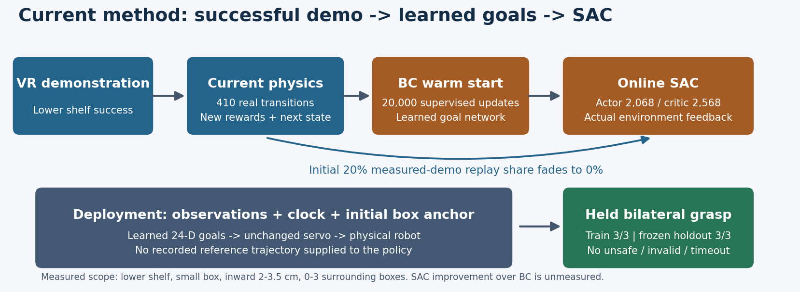
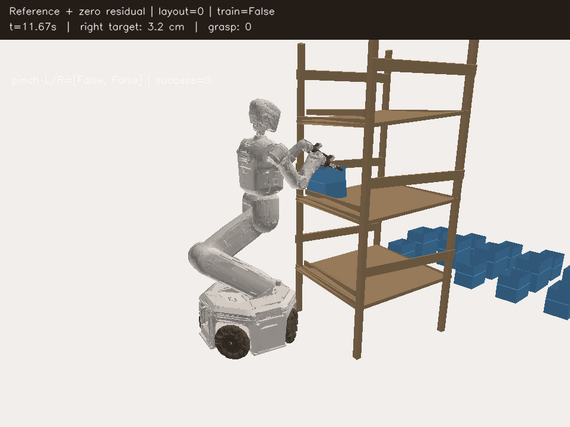
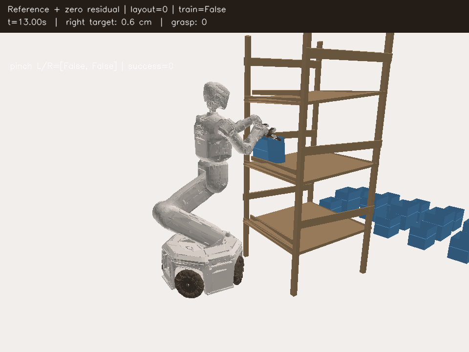
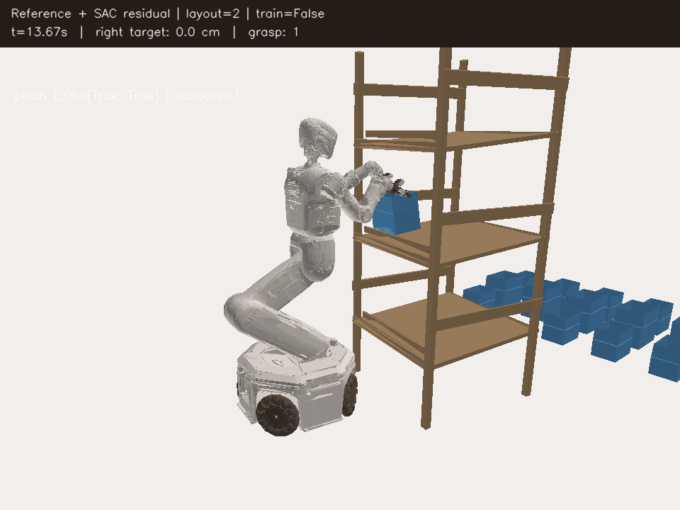
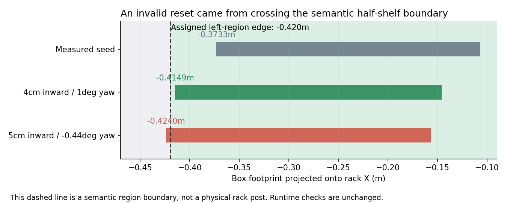
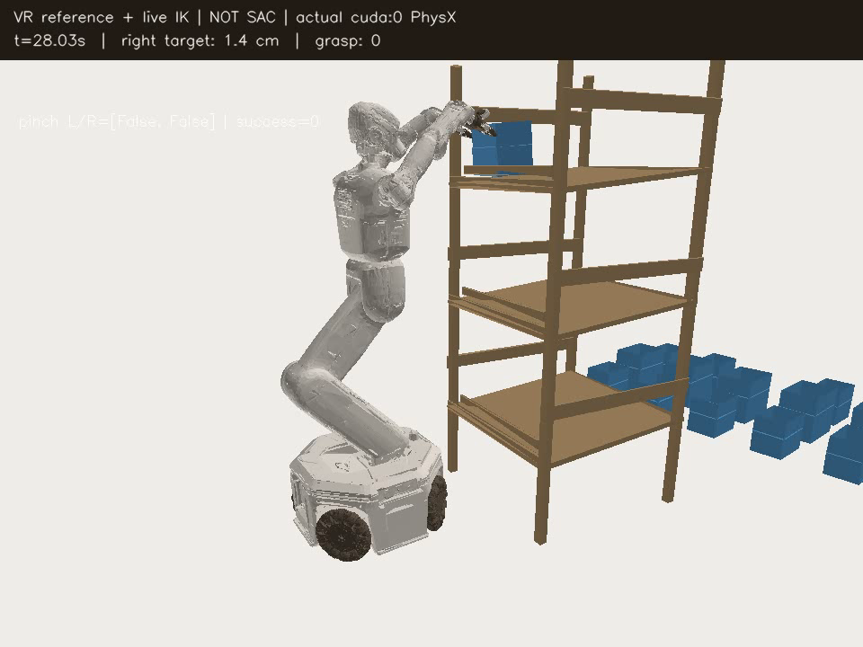

# V2 grasp: layout generalization and demonstration-initialized goal SAC

## Current method and status (2026-10-02 08:52 KST)

The current policy predicts24 absolute pose goals without reading a live demo
path. It starts from BC on410 physically executed successful transitions, then
uses real SAC updates. The first goal-policy suite achieved **3/3 training and
3/3 independent frozen-checkpoint successes**, with actor2,068/critic2,568
updates and no unsafe/invalid/timeout events. Every closed run is Drive-verified.
The distribution is small boxes on the lower shelf,2–3.5cm inward displacement
and0–3 surrounding boxes. This is not all-shelf/size/initial-pose generalization,
and SAC's incremental benefit over BC is unmeasured.



A larger continuation then failed its first three training layouts: one hold
stability timeout and two robot/rack collisions. The first failed layout succeeded
at405ticks under the older frozen model. Both exploration and online learning
were disabled in that comparison, so their separate causal contributions remain
unresolved. The third collision occurred during deterministic initial commands,
showing that the learned mean itself had also degraded.

The replacement GPU3 run starts from the proven model with unchanged deterministic
mean, Q coordinates, normalization and1,223 actual replay rows. Its normalized
Gaussian std starts at0.001, can range0.0001–0.003, actor LR is1e-6, and the initial
20% demo fraction plus BC prior fades across20,000 updates. The first three corrected
layouts succeeded at408/411/404ticks without unsafe/invalid/timeout events
(actor4,136), on the same three layouts that failed before the change. Twelve training
layouts followed by twelve separate fixed-model evaluations are now running in
`pose_goal_low_noise_gpu3_20261002_0830`. Rewards, bilateral held-grasp success,
rack10N/obstacle5N and self-collision-off are unchanged; no curriculum was added.

[Actual frozen goal-SAC video](assets/rl_v2_pose_goal_sac_frozen_success_20261002_h264.mp4).
For data contracts, exploration migration, commands and result limits see the
[demo/SAC progress report](RL_V2_DEMO_SAC_PROGRESS_20261002.md).

## Earlier reference-assisted experiments

The fixed lower-box controller completed three additional training episodes and
three separate frozen-checkpoint evaluations, all with held bilateral grasp and
zero unsafe/invalid/timeout terminations. Final actor update count: 3,470. These
were repeated instances of one scene; they do **not** establish generalization.
All six closed runs were uploaded and size/MD5-verified using the existing Drive
connection.

Generalization work started on October 2. Two physical probes already show why
moving a complete successful path sideways is insufficient:

| Physical controller; target moved 2.5cm | Ticks | Held grasp | Termination |
| --- | ---: | ---: | --- |
| Rigid base-path retarget; positional gain30/s | 350 | 0 | left arm link4/rack42.71N |
| Same retarget; positional gain2/s | 390 | 0 | left arm link4/rack18.20N |
| Base unchanged; retargeted Cartesian arm goals | 391 | 0 | left arm link4/rack19.00N |
| Live VR/contact IK on the moved box | 398 | 0 | left arm link4/rack17.59N |

These are zero-residual probes, **not learned-policy success tests**. Reducing
base feedback removes the large alternating commands caused by the existing
acceleration limiter, but translating the elbow path can still intersect the
rack. Rewards and force thresholds were not relaxed.





Videos: [rigid path](assets/rl_v2_layout_rigid_failure_20261002.mp4),
[damped path](assets/rl_v2_layout_damped_failure_20261002_h264.mp4).

The Cartesian-arm retarget had maximum calculated error0.198mm but still failed
physically. Local elbow-clearance and larger base-backoff candidates also failed
the kinematic tube check and were not sent to the robot simulation. Position IK
alone is insufficient near this upright, and those candidates were discarded.

The active fixed training distribution therefore moves the target toward the
interior of its shelf, away from that upright. On a2.5cm inward displacement,
two SAC training episodes and their separate frozen-checkpoint evaluations all
reached held bilateral grasp at410/411ticks, with zero unsafe/invalid/timeout
terminations. Actor updates694 then1,390; Drive final verification complete.
This is one moved scene, **not the held-out layout success rate**.
The first varied training layout, approximately4cm inward with a rear box,
also succeeded, reaching actor update2,086. The next5cm layout failed during
setup: the rotated26.6cm box crossed its assigned half-shelf footprint boundary
and the reset validator correctly replaced it. No transitions from that setup
failure were imported. That aborted suite did not produce a frozen holdout rate.

Sampling now uses the footprint-valid2–4cm interval. A pre-physics check rejects
out-of-region corners for every active box, including yaw. The reset/collision
checks are unchanged. The new8-training/8-held-out suite carries checkpoint2,086
and its actual replay onGPU3 in `layout_suite_gpu3_20261002_0440`.
All eight training layouts have now succeeded without unsafe/invalid/timeout
terminations. The final actor has7,662 updates. All eight held-out layouts also
succeeded with that one frozen checkpoint and no optimizer/normalizer updates,
with zero unsafe/invalid/timeout terminations. This establishes measured success
on this limited distribution, not all shelves/types or standalone SAC success.
All three matched zero-residual guide probes also succeeded at410ticks and
finished with verified Drive backups. SAC's extra benefit has not been demonstrated.

The depth expansion attempted12 train/12 heldout layouts with+/-1cm depth.
Four training layouts succeeded, reaching actor10,446. The fifth setup crossed
its semantic footprint during settling and was correctly rejected before Q data
collection. Requested depth+5.08mm in the first trial became approximately0.0002mm
relative to the reference after settling; this is not depth-generalization evidence.
The following stable reference-assisted continuation completed six training
layouts: five successes and one timeout, without unsafe or invalid resets.
The failed left hand remained about8mm from its flap while the right pinched.
It was stopped between closed, verified episodes before any holdout trials,
then its logs/data were archived and verified. It has been superseded by the
goal-policy method described at the top; its planned12/12 is not a measured rate.
The clock-conditioned BC-only student succeeded on one unseen layout at412ticks
with no SAC updates before the goal-SAC suite. Its different action coordinates
and replay are kept separate from the ordinary delta-action runner.



[Actual frozen-policy success video](assets/rl_v2_layout_inward_frozen_success_20261002_h264.mp4)

## First layout distribution

- Target: small box in the same shelf-2-left region as the measured success.
- Lateral target displacement: uniformly2–4cm toward the shelf interior;
  yaw within±1degree. Positive displacement toward the upright remains unsolved
  by this controller and is excluded explicitly from this initial distribution.
- Surrounding boxes: zero to three small rear/upper boxes, drawn from distinct
  logical cells5,6,9. Total active count is one to four.
- The robot starts at its original pose. It is not teleported beside the moved
  target. Physics must settle each generated scene without an invalid respawn.
- The original2–6cm envelope included poses whose full box footprint crossed
  the assigned half-shelf boundary. At5cm, a measured edge was-0.4240m against
  the region boundary-0.4200m. Sampling2–4cm plus a2mm preflight margin fixes
  invalid scene generation without weakening the runtime validator. The v9
  checkpoint retains its broader contract envelope for compatible continuation;
  the suite manifest records the actual narrower sampling distribution. This
  is a geometry correction, not a curriculum schedule.

- Sampled yaw and actual settled target yaw are recorded separately. Rollers
  can bring the box back toward yaw0; success there cannot establish arbitrary
  yaw generalization.
- An explicit target command keeps logical box4 selected while other active
  boxes remain in the scene. The deployable selector, privileged grasp adapter
  and reset validator share this command. Normal per-environment resets clear
  it, preserving the usual single-box default. The first multi-box pilot exposed
  the old adapter's one-active-box restriction; it failed setup before collecting
  Q data. That restriction was corrected rather than dropping surrounding boxes.
- Initial settling checks all active boxes, including distractors, before any
  trainable transition is collected. Their final footprints and physical shelf
  clearance must also pass the existing validator: a box falling to the ground
  and becoming stationary is not a valid surrounding layout.
- Train and holdout use separate deterministic RNG namespaces and separate
  files. The supervisor freezes those files in the unique experiment folder.
- The fixed distribution has no curriculum. Higher shelves as *targets*, other
  box sizes, arbitrary initial base poses, and the complete twelve-box random
  scene remain outside the tested scope.



The dashed boundary is semantic, not a physical rack post. The illustration
uses measured rack X=-0.24026m and the actual small-box dimensions; it explains
the assigned-region reset failure rather than claiming a physical post impact.

`GraspLayout` and `sample_layout` live in
`src/kuavo_isaaclab_scene/rl/multi_box/experiments/layout_generalization.py`.
Reset observation construction describes poses only and never creates Q data.

## Controller and learning contract

`RetargetedGoalResidual` is an explicit reference-assisted controller, not a
standalone24-action SAC policy. It consumes the measured physical success path
and retargets it using the perceived selected target relative to the rack.
The active v9 controller retargets the complete measured path toward the shelf
interior. It transforms the desired rack-relative base pose about the perceived
target while keeping the original joint-goal path. The current base must
physically execute that offset through its acceleration-limited velocity drive.
This controller is not a general collision-free motion planner.

The actor sees492 features:174 selected-target/controller features without its
previous action,264 deployable tokens for *all* boxes, and54 reference-context
features. Context contains24 commands, elapsed reference progress,20 desired
joint goals, and9 desired rack-relative base pose features. The critic sees584
features: current530 physical critic inputs plus the same54 reference context.
Actor retargeting does not consult simulator contact truth. Grippers still
follow the measured reference; held opposing pinch is measured independently by
the unchanged environment.

SAC issues22 residual actions. Arm residuals adjust position goals by at most
0.03rad; waist/head bounds are0.003rad. Existing physical delta/rate limits still
apply. Pending target subtraction prevents accumulation. Base feedback gain is
2/s for this experimental controller; fixed-scene controller behavior remains
unchanged. Empty surrounding-box slots have a0.5-unit normalization scale floor
so newly visible positions are not all clipped to the same value.

The current reward profile, bilateral held-flap success, upright X/Z torso,
gravity compensation, rack10N/obstacle5N, and self-collision off remain unchanged.
The original measured410 transitions are valid zero-residual seed data in the
baseline scene. New layouts enter replay **only after their actual physical
commands execute**, with current reward and terminal pre-reset observations.
Retargeted goals and failed probes are not imported as fabricated success data.
The actor-only zero-residual initialization prior fades over512 actor updates;
the geometric reference remains part of the controller afterward.

Checkpoints use a separate residual contract, including layout distribution,
action transform and492/584 dimensions. Fixed-scene or ordinary SAC checkpoints
cannot silently resume this different MDP. All executed residual experiences
are saved for continuation; proposed IK labels do not become Q transitions.

## GPU3 train and independent frozen evaluation

Generate separate layout files in a unique directory with `sample_layout(seed,
'train')` and `sample_layout(seed,'holdout')`. Save each returned `record()` as
`train_00.json` etc. The following supervisor trains on eight layouts, carrying
the same optimizer and actual replay forward, then evaluates one frozen final
checkpoint on eight held-out layouts:

```bash
python3 scripts/rl/layout_residual_with_drive.py \
  --experiment-dir /absolute/path/to/unique-layout-experiment \
  --layout-dir /absolute/path/to/separate-layout-files \
  --gpu 3 --train-count 8 --eval-count 8 --passes 1 \
  --demo-dataset /absolute/path/to/v2_grasp_quest_success.hdf5 \
  --training-manifest /absolute/path/to/current-physical-manifest.json \
  --executed-actions /absolute/path/to/measured-current-success.hdf5 \
  --residual-sac --residual-scale 0.05 --steps 900 --capture-every 30
```

The CPU supervisor sets `CUDA_VISIBLE_DEVICES=3` and Isaac's internal `cuda:0`.
It checks each run's true completion status, preserves physical failures as
training data, and stops on runtime or backup failures. Holdout commands always
include `--no-residual-training`; no actor/critic/optimizer updates happen there.
`results.json` records every attempt and its split, seed, terminal outcomes and
actor-update count. Success rate must include failures, not just completed
success videos. Further tuning after inspecting holdout requires a new held-out
split for a new unbiased evaluation.

The implementation is sequential one-environment training while validating the
new physical controller. It does not claim to occupy50–80GiB VRAM or to have
solved the full vectorized task.

## Upper-shelf reference diagnostic

The second supplied VR success episode targets a small box on shelf3 at about
1.66m root height, compared with1.05m in the current lower-shelf suite. A separate
GPU0 physical replay using the current upright torso and full wrist orientation
timed out at900ticks with zero success, unsafe and invalid-reset terminations.
This replay is a VR/live-IK guide diagnostic, not a SAC evaluation.



[Actual upper-shelf diagnostic video](assets/rl_v2_upper_vr_full_rotation_failure_20261002_h264.mp4)

Offline reconstruction puts the demo grasp goals exactly at the recorded TCPs;
an offset-frame mismatch was rejected as the cause. Final torso angles differed
from the reference by about3mrad and base translation by5.6mm. The live contact
IK retained roughly2.5–3cm error near joint limits. A separate
`--vr-orientation-mode closing-axis` diagnostic relaxes unnecessary wrist twist
while retaining position and jaw-axis alignment, but also timed out at900ticks
without pinch: wrist twist alone does not explain the failure. A further
`--vr-contact-torso-forward-m 0.04` diagnostic uses the existing upright torso
X controller for bounded extra contact reach and logs IK target projection and
joint-limit margins. It keeps full wrist orientation and existing physical
torso travel/rate limits. Both defaults remain `full` and zero assist;
the proven lower native reference and GPU3 SAC controller are unchanged.
Upper-shelf success transitions are not fabricated or imported from this
failed replay. Its closed physical HDF, photo/video and logs are Drive-verified.

The4cm torso assist with full wrist orientation also timed out. The recorded
IK target projection was zero. Re-solving those *actual measured* terminal
poses offline retained28.9/23.7mm full-orientation error, whereas closing-axis
constraints reached0.48/2.41mm with joint bounds respected. The combination of
torso assist and closing-axis constraints also timed out physically. Waiting
until both hands were within10mm before closing, and separately restoring the
demo's original gripper timing, likewise failed at900ticks without unsafe or
invalid-reset events. These are separate diagnostics; original gripper timing
has not yet been combined with the torso/closing-axis variants. Offline
feasibility is not recorded as physical grasp success.

## Storage and evidence

Read [RL_GOOGLE_DRIVE.md](RL_GOOGLE_DRIVE.md). The existing authenticated remote
is discovered privately; no account alias or credential is stored here.
Checkpoints are saved every512 actor updates and at each training episode end.
The shared uploader runs every300seconds, uploads/checksum-verifies files and
retains the newest two local checkpoints per format plus protected verified
copies. It includes actual residual data, physical videos and photos only after
writers stop, and uploads/validates final logs before the next trial.
Other users' files/processes are untouched. These artifacts are mirrored in the
linked Notion experiment report with native media attachments.

The targeted CPU checks pass107 tests: selected-target consistency, partial
reset behavior, geometric retargeting, footprint rejection, physical-versus-
residual action separation, checkpoint compatibility and frozen holdout
supervision, depth-displacement footprint validity, and H.264 frame/timing
preservation with full decoding. Actual Isaac outcomes, rather than these
tests, determine success. New replay videos are finalized as H.264 avc1,
yuv420p, faststart MP4 before the run is marked complete. Existing immutable
Drive originals are retained; browser-compatible copies repair old Notion media.
