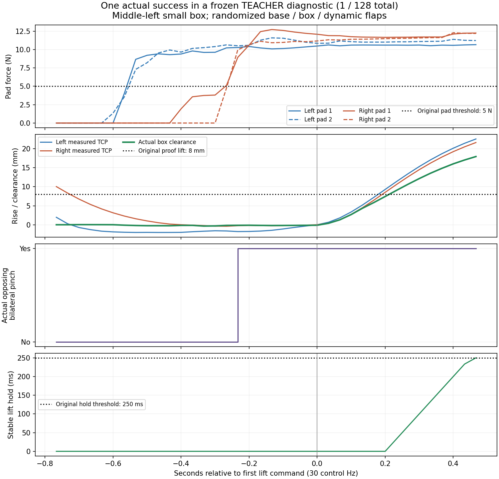

# 양손 파지 SAC의 가능성과 남은 문제

2026-10-08 15:20 KST 기준이다. **문제 분석은 진전했지만 안정적인 SAC 학습
개선은 확인하지 못했다. 현재 설정을 오래 실행하는 것만으로 성공할 것이라고
말할 근거는 없다.** Randomization을 유지한 일부 작은 박스의 실제 성공은
있으므로 물리적으로 전부 불가능한 과제로 판단하지도 않는다. 중형·상단을
포함한 안정적 일반화와 독립FINAL의 성공은 아직 미확인이다.

## 성능과 진단을 구분한다

| 확인한 것 | 결과 | 의미 |
| --- | --- | --- |
| 현재 여섯 조합의 학습된 SAC, 같은 전체 DEV128 | 11→10→7→6회 성공; 중형0 | 안정적인 개선 없음. 초기와 공통 유효115조건도11→6 |
| 이전 small만의 학습된 SAC | 35→19→23→30→24/128 | 일부 성공을 만들지만 학습 후 초기 성능을 유지하지 못함 |
| 실제 관절 범위를 사용하는 고정 교사 v3, TRAIN128 | 0/128; 한 경로에서 양손 접촉1.83초 | 접촉만으로8mm 들기 성공이 되지 않음 |
| 접촉 후 pending PD 목표를 누적하는 고정 교사 v4, TRAIN128 | 1/128; 실제 파지0.267초·clearance17.95mm | 한 randomized 조건에서 들기까지 가능. SAC 개선이나 일반화 증거는 아님 |

전체 분모에 실패·초기 무효도 포함한다. 같은 요청이며 실제 flap 추첨·접촉
이력까지 동일한 반복은 아니다. 서로 다른 범위의 small/여섯 조합 점수나
고정 교사/학습된 SAC 점수를 직접 성능 개선으로 비교하지 않는다.

## 실제로 확인한 병목

**1. 목표 범위가 필요한 자세를 제한할 가능성.** 기존 팔 목표는 두 데모의
관절 범위를 바탕으로 정규화하고 그 주변에 제한된 보정을 더한다. 종료된84개
진입 상태에서 같은 자세의 양손 위치5cm·닫힘축0.25rad를 함께 만족하는 정적
후보를 찾은 수는 기존 범위29개, 실제 URDF 범위60개였다. 충돌·접촉을 확인한
결과는 아니며 후보 미발견도 물리적 불가능을 증명하지 않는다. 다만 탐색
표준편차만 키우는 방법과 목표 범위를 바꾸는 방법을 구분해야 한다.

**2. 양손 접촉 이후 들기 전달 문제.** v3의 한 사례는 양손 접촉55tick을
유지했지만 손 상승은1mm 미만이었다. v4는 실제 접촉이 유지되는 들기에서만
pending PD 목표에 작은 증분을 누적하며 measured joint 대비 lead를0.08rad로
제한했다. 전체 정상 종료와 모든 유효115경로의 명령 대조에서 이 규칙이 실제
14행 실행됐고 그 경로가 성공한 것을 확인했다. 한 사례이며 동일한 실제 접촉의
인과 비교는 아니므로 모든 들기 실패의 원인이라고 단정하지 않는다.

[전체 종료·모델 고정](assets/rl_v2_cartesian_pending_lift_full128_closed_20261008.json),
[전체 실제 명령 대조](assets/rl_v2_closed_cartesian_pending_lift_actions_audit_20261008.json),
[한 성공 경로의 접촉·실제 이동](assets/rl_v2_closed_pending_lift_contact_20261008.json).

**3. 접근·정렬·양손 동시 파지가 남아 있다.** v4에서도 중형 양쪽의 실제
opposing 양손 pinch 행은0이었다. 상단 왼쪽은 유효30경로 중26개가 보정에
넘어갔지만 삽입 단계 전환은0이었다. 중형은 한 손 접촉 등에 의해 삽입으로
넘어간 뒤에도 양손 파지를 만들지 못했다. 목표 범위를 풀거나 들기 전달을
바꾸는 것만으로 안전한 진입을 해결하지 못했다.

**4. 성공 동작을 학습한 뒤 잃는 현상.** 현재 SAC의 공통 유효 조건에서 초기
성공7회를 잃고 새 성공2회가 생겼다. 최종 정책을 종료된 과거 TRAIN 상태에
적용한 제어기 분석에서는 Gaussian 탐색과 기존 bias가 실제 명령을 바꿨다.
탐색이 전부 막혔다는 설명은 맞지 않는다. 하지만 이 분석은 과거 정책이나
새 물리 rollout이 아니며 reward/Q 오차·actor 갱신·경험 분포 중 무엇이
퇴행의 주원인인지는 아직 분리하지 못했다. Reward가 틀렸다고 확정하거나
탐색·속도 제한을 무조건 키우지 않는다.

## 다음 판단과 변경 범위

GPU3의 다음 동일한 전체 DEV128에서 성공·충돌·접근·실제 양손 파지·들기를
구역별로 확인한다. 안정적 개선이 없으면 같은 설정의 장기 실행보다 새 목표
좌표와 제어 연결을 우선한다. 새 SAC는 로봇의 실제 관절 범위를 표현하면서
기존 관측·중력 보상·속도와 명령 제한·무작위화·안전/성공 기준을 보존해야 한다.
실제 실행 action과 Q가 같은 좌표를 사용하도록 새 contract·fresh Q/replay를
준비한다. 기존 교사 goal은 bounded SAC의[-1,1] 밖일 수 있으므로 그대로
Q 데이터에 넣지 않는다. 교사 없는 greedy 전체 DEV 개선과 아직 사용하지
않은 독립FINAL로 판단한다. 이 새 학습 연결은 아직 구현·실행 전이다.

현재 replay50만은 actor518/critic578/action21의 현재·다음 관측을 포함해
약4.12GiB다. 200만이면 약16.5GiB로 과거 경험 보존에 도움이 될 수 있지만
성공 행동이 없는 조건의 데이터나 잘못된 목표 연결을 메모리만으로 해결하지
못한다. 현재 버퍼를 늘렸다고 표시하지 않으며 GPU를 채우는 것 자체를
성능 목표로 삼지 않는다.

박스/base/배경/firm dynamic flap 무작위화·opposing pad5N·hold0.25초·
proof lift8mm·랙10N·주변 장애물5N·reset-relative drop10cm·self-collision OFF를
유지한다. 박스 고정·성공 reset·범위 축소·평가 데이터 학습은 하지 않는다.
기존 Drive 재연결의 실제 접근 성공과 새 진단의 종료 로그·체크포인트 검증을
확인했다. Raw HDF/replay는 로컬에 유지하며 다른 사용자 파일/프로세스와
활성 GPU3의 격리 source를 변경하지 않았다.

현재 전체 SAC 결과는
[여섯 조합 진행 기록](RL_V2_SUPPORTED_SIZE_SAC_PROGRESS_20261008.md),
목표 범위·접촉·제어 변경은
[관절 목표 진단](RL_V2_ARM_TARGET_RANGE_DIAGNOSIS_20261008.md),
실패 TRAIN의 실제 명령 분석은
[탐색·제어기 분석](RL_V2_FAILED_TRAIN_SERVO_DIAGNOSIS_20261008.md)을 참고한다.
