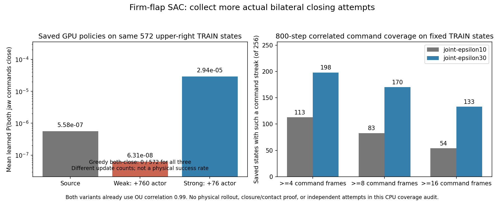

# 단단한 flap · 실제 TRAIN 탐색 확대와 긴 SAC 학습 (2026-10-06)

단단한 동적 flap을 적용했지만 네 구역의 일반화된 양손 파지는 아직 성공하지
못했다. 약한 logit 보정의 전체 greedy DEV는 초기 **9/128 → 학습 후 3/128**이며,
위쪽 두 구역은 모두 0건이다. 초기 무효도 128개 분모에 유지했다.
학습 후89개 unsafe 중73개에서 robot–rack collision이 발생했다(원인은 중복
집계 가능). 초기에는70개 unsafe 중43개였다. 최종3건은 모두 중간 오른쪽에서
안정된 양손 opposing pinch/hold0.2667s/roller clearance17.5–41.3mm를 실제로
만족했다. 전체 결과가 감소했으므로 이 보정으로 학습이 개선됐다고 보지 않는다.
다음 실행은 같은 실제 checkpoint/replay에서 **30% joint-jaw 행동 탐색과
12개의 새 TRAIN wave**를 사용한다. 기존 건강한 GPU3 비교는 유지한다.

## 물리와 평가 기준

| 항목 | 설정 |
|---|---|
| Flap hinge stiffness | **1.5–2.5 Nm/rad** |
| Flap hinge damping | **0.15–0.25 Nm·s/rad** |
| Hinge static / dynamic friction | **0.45–0.65 / 0.30–0.40** |
| 초기 flap 각도 | **±1°**, reset 때만 적용 |
| 배치 | 박스·base·배경 randomization 유지, 각 wave 네 구역 ×32 =128개 |
| 성공 | 서로 다른 flap 양손 파지, pad≥5 N, 안정 hold≥0.25 s, 보정한 roller clearance lift≥8 mm |
| 안전 | rack10 N, 로봇–주변 장애물5 N, 바닥·박스 제외, self-collision OFF |

Flap은 동적이며 episode 중 각도를 강제 고정하지 않는다. 시작점의 실제 base
접근 후 base를 유지하는 staged 실행이다. 이는 학습된 자유로운 base navigation의
성공을 뜻하지 않는다. Curriculum이나 box 고정을 도입하지 않는다.

## 실제 GPU와 CPU 검사에서 확인한 것



- **실제 strong GPU 첫 actor76회:** 같은 위 오른쪽 안전·양손 near 실패 TRAIN
  572상태에서 순수 학습 정책의 평균 양손 닫힘 확률이
  5.58×10⁻⁷ →2.94×10⁻⁵로 증가했다. 여전히 약0.0029%이며 greedy 양손 닫힘은
  0/572다. 저장된 actor/Q/target/normalizer 54 tensor를 정확히 복원하고 입력
  크기/MD5를 새로 검증한 CPU inference다. 실제 새로운 파지 성공의 증거가 아니다.
- **전체 SAC CPU 복제, 각4096 Q/1024 actor:** 실제 replay256행의 원래 성공
  replay mix/fade, 실제 TRAIN n-step64행(weight0.1), 실제 성공 TRAIN64행의
  body goal44.4444/jaw0.05를 사용했다. Strong의 위 오른쪽 평균 양손 닫힘
  확률은0.0320, region-hand-class 성공 jaw balance를 추가하면0.0070이었다.
  두 경우 모두 greedy 양손 닫힘0이다. CPU 복제는 배포하지 않았다.
- **경사 원인 분리:** 실제 첫 update의 전체 actor pre-clip norm0.9757은
  clip 한도1보다 작았다. Body Q가 위 오른쪽 왼손 닫힘에 반대되는 국소 경사를
  만들지만, jaw와 penalty 신호도 존재한다. 공유 trunk 또는 clipping만을
  원인으로 확정할 근거는 없다. 이전 Adam 상태를 가진 분리 step은 가산되지 않는다.
- **별도 jaw trunk CPU prototype:** 동일 초기 출력/Adam moments를 복제한
  256 actor 비교에서 위 오른쪽 양손 닫힘 확률은 shared6.70×10⁻⁵,
  separate2.84×10⁻⁴였지만 greedy는 둘 다0이었다. Body 변화도 커져 이번
  실제 실행에는 이 구조를 채택하지 않았다.

위 값들은 보관한 상관된 TRAIN 상태 또는 CPU offline 복제의 출력이다.
전체 시도 성공률·물리 counterfactual·DEV 성능으로 해석하지 않는다.

## 30% joint-jaw 탐색

기존 `joint-epsilon10`도 **OU correlation0.99**인 두 jaw Gaussian을 사용한다.
새 옵션 `--jaw-behavior joint-epsilon30`은 같은 Gaussian/RNG/body action/
production near gate를 유지하면서 U4 혼합 비율만0.1→0.3으로 늘린다.
양손 모두 near일 때 uniform 혼합 자체의 양손 닫힘 질량은0.025→0.075다.
Production projection 후 실제 branch와 uniform row를 지역별로 기록한다.
Actor의 학습 분포, Q target 식과 frozen greedy 평가에 이 uniform 혼합을 넣지 않는다.
Executed behavior action을 원래 방식대로 replay에 저장한다.

실제 위 오른쪽 TRAIN에서 뽑은 고정256상태·800step·같은 OU Gaussian으로
production projector를 사용한 CPU 명령 검사 결과는 다음과 같다.

| 명령 연속성 | 10% | 30% |
|---|---:|---:|
| 양손 닫힘 command≥4frame인 상태 |113/256|198/256|
| ≥8frame |83/256|170/256|
| ≥16frame |54/256|133/256|
| 전체 양손 닫힘 command 비율 |2.823%|7.601%|

Body command SHA256은 같았다. **고정된 상태에서 생성한 명령**이므로
실제 gripper closure·pad 접촉·hold 또는 성공을 증명하지 않는다.
시간 상태들은 독립 시도가 아니다. 실제 closed-loop TRAIN으로 검증한다.

`joint-epsilon10`의 config/statistics/default는 유지한다. 저장한 10% checkpoint를
명시 없이30%로 재개하면 거부한다. 이번30% 실행은 해당 옵션이 없던 원래
Q6864 checkpoint에서 독립 활성화하며 actor/Q/normalizer/네 optimizer/replay를
복원한다. `logit4-soft-strong`(한도4, actor 계수0.001)을 유지하고,
성공 jaw balance는 기본 OFF로 두어 짧은 실제 비교 결과를 별도로 확인한다.

## 더 긴 실제 randomization TRAIN

`scripts/rl/prepare_long_region_training.py`는 기존 네 구역 layout sampler를
재사용한다. **12 TRAIN×128 =1536개 새로운 요청 사례**, 3TRAIN마다 동일
전체 DEV128을 반복해 총5DEV/17wave다. Control TRAIN/DEV와 새 seed가
겹치지 않는다. 원래 invalid reset을 제외하거나 성공 사례로 대체하지 않는다.

| 범위 | 중간 선반 | 위 선반 |
|---|---|---|
| Base lateral | ±20 cm | ±8 cm |
| Base outward | 3–25 cm | 3–10 cm |
| Base yaw | ±15° | ±5° |

위쪽 box depth±6mm, box lateral−4…−2cm/yaw±1°와 배경 배치는 기존 recipe를
그대로 사용한다. Seed를 늘리는 것이 randomization 범위를 축소하는 것은 아니다.
원래 VR/demo 행동이나 합성 성공 label을 새로 넣지 않는다. 실제 소유 TRAIN에서
측정한 성공 bank/replay와 n-step bank를 재사용하며 **DEV/FINAL은 학습에 넣지 않는다.**
Helper가 생성한 reserved holdout 파일은 이 plan에서 읽지 않으며 task의 independent
FINAL도 plan 밖에 둔다. 반복 DEV는 모델 선택용이다. 최종 일반화 주장은 별도의
unseen FINAL과 네 구역의 실제 물리 성공 확인 후에만 가능하다.

```bash
python3 scripts/rl/prepare_long_region_training.py \
  --reference-waves /absolute/path/to/verified-original/continuation_waves.json \
  --output-dir /absolute/path/to/unique-new-input-plan \
  --seed-origin 1000000000 --train-waves 12 --validate-every 3
```

이번 입력 계획은 `actual_flap_joint30_long_randomized_20261006_091200`이다.
TRAIN1536은 계획한 요청 사례 수이며 완료한 사례 수가 아니다. 이번 실행은
탐색 비율과 TRAIN 길이를 함께 바꾸므로 어느 변경의 단독 효과인지 확정하지 않는다.

## 검증과 기록

관련 CPU 검사 **39개 통과**: 동일 RNG/body, mixture/projection, 지역 카운터,
restoration/variant 거부, 실제 pilot activation, frozen evaluation, 성공 jaw
balance와 measured n-step 계약을 확인했다. Physics 성공을 보장하는 테스트는 아니다.

GPU3은 `CUDA_VISIBLE_DEVICES=3`,128 env로 격리한다. 새 고유 private RAM 실행
폴더를 사용하고 기존 Drive 연결로300초마다 checkpoint를 업로드·checksum
검증한다. 각 format의 최근2개와 최근2개 검증본을 보호하며 검증된 오래된
checkpoint만 정리한다. Writer 종료 후 닫힌 로그/HDF/replay까지 최종 검증한다.
RAM 로컬 파일은 재부팅 시 사라지므로 백업 완료와 학습 완료를 구분한다.
다른 사용자의 파일/프로세스나 기존 건강한 소유 실행을 종료하지 않는다.

**09:24 KST 실제 시작:** `actual_flap_joint30_long_sac_pgs128_gpu3_20261006_092414` /
`batch_sac_20261006_092414_3301a4`, writer3604512·supervisor3604477다.
실제 manifest에서 firm flap 범위·30% 행동 탐색·strong actor penalty0.001·
success jaw balance OFF·17wave·128env·안전 기준을 확인했다. 기존 strong2726960과
balance3173061은 유지한다. 새 실제 TRAIN 효과와 전체 DEV 성능은 아직 미확인이다.
Manifest 확인은 configuration 검증이며 모든 reset의 PhysX readback 확인과 구분한다.
[실제 시작 증거](assets/rl_v2_joint30_long_actual_GPU3_startup_20261006.json).

수치 원본:
[실제 strong 첫76회](assets/rl_v2_strong_jaw_recovery_GPU_Q7168_fixed_TRAIN_20261006.json),
[CPU1024 actor](assets/rl_v2_longer_success_jaw_actual_mixed_TRAIN_CPU_20261006.json),
[경사 분리](assets/rl_v2_actual_jaw_body_gradient_coupling_CPU_20261006.json),
[별도 trunk prototype](assets/rl_v2_independent_jaw_trunk_actual_mixed_TRAIN_CPU_20261006.json),
[CPU 명령 연속성](assets/rl_v2_joint30_fixed_actual_TRAIN_sequence_coverage_CPU_20261006.json),
[실제 TRAIN 계획](assets/rl_v2_joint30_long_randomized_TRAIN_plan_20261006.json).
[Weak 전체 DEV·실제3건 성공·안전 원인](assets/rl_v2_weak_jaw_recovery_completed_final_DEV_20261006.json).
