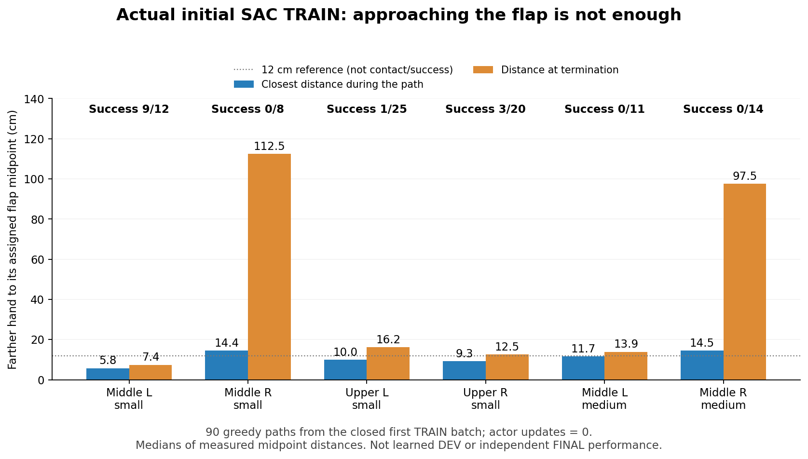

# SAC 실제 수집 상태의 속도 제한 진단

## 현재 성능과 목적

2026-10-08 22:13 KST 기준, 성공 동작은 있지만 안정적인 SAC 개선은 없다.
Uniform 비교는 TRAIN1,152 뒤 전체 성공1·랙 충돌60·시간 초과67/128회로
14→8→4→1회가 됐다. 중형은0이며 실제 actor3,132/Q14,574 평가 전후 모델과
원래 요청·소스728개를 대조했다.
[세 번째 전체 결과](assets/rl_v2_URDF_regional_goal_third_learned_full_DEV12_20261008.json).

아래 그림과 TRAIN768 결과는 이전 기록이다.
관절 목표를 URDF 범위로 정규화한 비교 실행은 초기14/128 → TRAIN384 뒤8/128 →
TRAIN768 뒤4/128이다. 마지막 평가는 성공4·안전 위반49·시간 초과75회이고
초기 무효·수치 오류는0이다. 안전 위반은랙 충돌48·박스 낙하1회다.
중형과 중간 오른쪽small·상단 왼쪽small은 성공0이다. Actor1,909·Q9,682회
실제 모델·optimizer와 평가 종료 모델의 일치·유한성을 대조했다.
[전체 결과와 모델 근거](assets/rl_v2_URDF_second_learned_full_DEV8_20261008.json).

팔 목표를 전체 URDF 범위에서 표현하는 새 full-arm SAC는 학습 전 전체 평가에서
성공11·안전 위반48·시간 초과56·초기 무효13/128회였다. 초기 무효도 분모에
포함한다. 실제 저장 모델·normalizer75개 tensor는 준비한 초기 모델과 같고
전체257개 tensor는 유한했다. Actor/Q 업데이트0인 **별도 초기 기준**이다.
다른 실행의14회와 똑같은 접촉 이력이 아니며 학습 개선으로 해석하지 않는다.
[새 정책의 전체 초기 결과](assets/rl_v2_URDF_full_arm_first_full_DEV_20261008.json).
Full-arm은 TRAIN384 뒤11→10/128, 작은 탐색 비교의 초기 기준은같은11/128이다.
기존 다섯 장기 실행은 그대로 진행한다. 독립FINAL은 미사용이고 목표는 미달성이다.


명령 유지·탐색 단위를 보강한guard의 첫 학습 후 전체 평가는21:09 KST에
성공13·랙 충돌46·시간 초과69/128회로 완료됐다. 초기14보다 개선된 결과는
아니지만 uniform 비교의8회보다 많이 유지했다. 동일한 실제 접촉 이력은 아니며
중형은0회다. [전체 결과·모델](RL_V2_URDF_SERVO_GUARD_20261008.md)을 참고한다.

## 최신 학습 모델의 실제 실패 영상

[중간 왼쪽small](assets/rl_v2_URDF_DEV8_middle_left_small_rack_failure_20261008.mp4)과
[중간 왼쪽medium](assets/rl_v2_URDF_DEV8_middle_left_medium_rack_failure_20261008.mp4)은
TRAIN768 뒤 전체 평가에서 기록한 실제 자세 영상이다. 둘 다랙 충돌 실패이고
양손 유지 시간은0초다. Small은 오른쪽 그리퍼 base89.2N, medium은 왼쪽 그리퍼
base28.7N이 종료 순간의 최대랙 접촉이었다. 전체 첫 충돌의 원인을 영상만으로
단정하지 않는다. 실제 terminal pose를 reset 전에 기록했고 actor1,909·Q9,682
모델과 전체 평가 결과에 맞는다. H264/avc1·yuv420p·faststart 및 전체decode를
확인했다. 이 overlay의Q9,682는 Q **업데이트 횟수**이며 Q-value가 아니다.
[영상·결과·형식 검증](assets/rl_v2_URDF_DEV8_closed_video_verification_20261008.json).

## 확인된 문제와 아직 확인할 부분

절대 관절 목표를 실제 명령으로 바꾸는 production decoder에는 관절 속도 제한이
있다. 목표가 한 제어 step의 이동 범위를 넘으면 명령은 최댓값으로 제한된다.
그 구간에서는 목표를 조금 바꿔도 실제 명령이 그대로여서, servo Q를 통한 해당
목표의 경사가0이 될 수 있다. 팔 목표 범위를 넓히는 것만으로 이 문제는 해소되지 않는다.

새 정책의 실제 초기 모델을 **종료된 다른 Cartesian 진단 제어기의 TRAIN 경로**에
질의했다. 유효114경로에서 초반·중간·후반 각912개 상태를 사용한 결과다.

| 구간 | 팔 좌표 중 step 제한으로 경사0 | 팔14좌표 모두 경사0인 상태 |
| --- | ---: | ---: |
| 초반 | 27.1% | 1/912 |
| 중간 | 48.4% | 149/912 |
| 후반 | 71.7% | 379/912 |

이는 현재 SAC가 만든 상태의 측정이 아니다. 현재 학습 실패의 원인으로 단정할
수 없으며 물리 성공이나 탐색 경로 개선도 증명하지 않는다. 상태 창은 겹칠 수
있어 독립 episode 수처럼 세지 않는다. 모델·입력·RNG는 변하지 않았고 진단
행동·평가 데이터는 학습에 넣지 않았다.
[정확한 초기 모델·닫힌 입력·경사 측정](assets/rl_v2_full_arm_initial_closed_TRAIN_servo_gradients_20261008.json).

## 이번 코드 변경

- 두 CPU 경사 감사 도구가 실제 state-aware Gaussian mean과 실제 noise/offset
  sampler를 사용하도록 수정했다. Full-arm의 학습 residual mean을 그대로
  Gaussian mean으로 취급하면 기준 관절 목표를 잘못 재구성한다.
- 닫힌 경로의 actor/Q 복원은 접근 전 snapshot 대신 실제 첫held 제어 행의
  박스 좌표를 고정 기준으로 사용한다. 접근 중 박스가 움직일 수 있기 때문이다.
  Live `BatchedBaseStages`와 같은 시점이며 학습 환경의 동작은 바꾸지 않는다.
  이전27.1/48.4/71.7% 분석도 이 좌표로 다시 계산했고 집계 비율은 같았다.
- `audit_closed_train_servo.py --by-box-type`으로 같은 구역의small/medium을
  별도 집계할 수 있다. 기본 출력은 유지한다.
- `train_batched_staged_goal.py --policy-servo-diagnostics`를 추가했다.
  실제 실행에 쓰는 pre-action actor518D 입력에서 greedy 및 실행 행동의
  속도 step 제한 비율을30step마다 구역·박스 크기별로 기록한다.
- 이 옵션은 기본OFF다. 정책·reward·Q·replay·RNG를 바꾸지 않는다. 기존 실행에는
  소스를 교체하지 않는다. 재사용은 새 실행에만 적용한다.

진단을 켠 새 실행에는 기존 학습 명령에 다음 옵션을 추가한다.

```bash
--policy-servo-diagnostics
```

현재 표본은`progress.json.policy_servo_diagnostics`, 종료 배치는
`policy_servo_diagnostics_wave_####.json`에 기록된다. 한 표본은 상태가 남아 있는
환경만 포함하므로 전체128조건의 성공률은`metrics.json`으로 따로 판단한다.
측정은 **step 제한에 의한 경사0**만 다룬다. 전체 actor/Q 경사, tanh 수치
포화 또는 실제 접촉 품질 전체를 측정한 것으로 해석하지 않는다.

기존 full-arm 장기 실행의 첫 원래 TRAIN128조건과 같은 요청으로 별도 짧은
수집을 준비했다. 실제 CPU 복원에서 actor·normalizer29개 및 동결 기준이 같고
계약 차이는 replay100,000 대2,000,000뿐이다. 새 Q/replay/성공 은행에서 시작한다.
900step의 최대Q1,800회는 actor warmup2,048회보다 작으므로 초기 정책의 실제
수집 상태를 확인할 계획이다. 실제 실행·종료 counter로 다시 확인해야 한다.
이 진단은 장기 학습이나 원래 전체DEV/독립FINAL을 대체하지 않는다.

20:43 KST에 실제 GPU3 전용 writer959568로 이 측정을 시작했다. 고정 소스는
`9990e5e15171ea1d534893c5329ec0ebdb8faf58`이고 옵션을 실제 명령에서 확인했다.
20:51 KST에 실제held 관측117개·진단 출력과 Q118회 수집을 확인했다. Actor
갱신은0이다. Actor518/critic578·body19+jaw2·원래첫TRAIN128요청·소스735개와
중력 보상18관절·기존 물리/성공/보상/안전/DR 계약을 대조했다. 입력257개 tensor는
유한했으며 실제 종료 모델의 일치는 종료 뒤 확인한다. 첫 Drive 백업은20:49:28 KST
검증됐고 실제 writer는1,539MiB를 사용했다.

이 **step121의 한 표본**에서 greedy 팔 좌표의 step 제한 비율은 전체32.7%, 실제
수집 행동은20.6%였다. 구역/크기별greedy 비율은 중간 왼쪽small9.7%·medium19.6%,
중간 오른쪽small39.3%·medium18.8%, 상단 왼쪽small40.0%·오른쪽small48.3%다.
일부 좌표에서 경사 차단이 실제 SAC 상태에도 존재함을 확인했지만, 전체 경로의
비율·최종 실패 원인·학습 후 성능을 뜻하지 않는다. 움직이기 위해 정상적으로
속도 제한에 도달한 좌표도 포함한다. 종료한 경로 전체와 손 접촉·Q 근거를
함께 분석한 뒤 제어 표현 변경을 판단한다.
[실제 시작·계약·단일 관측·백업 검증](assets/rl_v2_measured_TRAIN128_actual_startup_20261008.json).

관리 폴더는`GPU3_URDF_full_arm_measured_TRAIN128_20261008_204327`이고 기존 네 장기
실행은 유지했다. 이 짧은 실행은 성능 개선을 주장하거나 오래 학습하는 실행을
대체하지 않는다.

## 종료된 실제 SAC 수집 전체 결과

21:10 KST에 writer·supervisor의 정상 종료와 마지막 Drive 체크포인트·로그 검증을
확인한 뒤 닫힌 HDF를 분석했다. 원래 TRAIN128요청은 성공13·안전 위반52·시간
초과52·초기 무효11회였다. Actor 업데이트0·Q1,546회이며 실제 종료 모델의
actor/normalizer29개는 초기와 같고 저장 tensor408개는 유한했다. **초기 정책의
학습 데이터 수집 결과이며, 학습 후 DEV 성공률이 아니다.** 유효117개 경로의
초반·중간·후반 각936상태에서 greedy 팔 step 제한 비율은29.2%·30.4%·23.7%였다.
다른 제어기 경로에서 본 후반71.7%를 현재 SAC의 비율로 사용할 수 없다.
중간 오른쪽medium과 상단 왼쪽small의 일부 timeout 경로는 후반 제한 비율0%로,
속도 제한만으로 전체 실패를 설명할 수도 없다.
[실제 종료 모델·경로·구역/크기별 측정](assets/rl_v2_actual_measured_TRAIN128_closed_gradient_20261008.json).

실제 기록된 수집 모드별 결과는 greedy90회 중 성공13·안전 위반31·시간 초과46회,
큰 팔 탐색27회 중 성공0·안전 위반21·시간 초과6회다. 무효11회에는 held 탐색을
뽑지 않았다. 무작위 배정된 서로 다른 경로이며 탐색이 모든 실패를 유발했다는
대조 실험은 아니다. 그러나 큰 탐색이 유효한 파지 데이터로 이어지지 않았다는
직접 근거다. 이 진단의 Q/replay·행동·성공 행은 새 학습에 복사하지 않는다.

## 실제 관절 명령에 맞춘 작은 탐색 비교

닫힌117경로의 같은 상태와 같은16개 임의 bias 방향을 실제 full-arm sampler와
production decoder에 넣었다. 잠재 bias를0.8에서0.2로 줄여도 명령 차이의
중앙값은0.66–0.82로 커서 충분한 조정이 아니었다. 선택한0.01에서는
중앙값0.048–0.065, 한 step 이동 범위의 절반을 넘는 차이는0.5–1.6%였다.
0.8의 해당 비율은69–76%다. 정반대 포화 명령은 선택한 표본에서0이었다.
이 측정에는 Gaussian·AR1·jaw의 전체 확률적 물리 경로가 포함되지 않으며
안전·성공 성능 증거로 해석하지 않는다.
[같은 상태·방향에서의 명령 단위 비교](assets/rl_v2_actual_closed_TRAIN_bias_units_20261008.json).

새 `--body-behavior arm20-gentle-rest-greedy`는 episode bias 표준편차0.01·상한0.02다.
기존0.8·1.6 설정과 기본값은 유지한다. 선택20%·90step 점진 진입·Gaussian/AR1·jaw
탐색·나머지80% greedy 수집은 같다. 팔 정책의 전체 URDF 범위를 좁히지 않는다.
원래 TRAIN6,144·전체 DEV128·65배치·replay200만과 동일 초기 actor에서 새
Q/replay로 준비했다. CPU 복원·보존·수집 관련54개 테스트가 통과했으며,
이 비교의 실제 실행과 초기 전체평가·학습 성능은 별도로 기록한다.
[설정·검증·진행 기준](RL_V2_URDF_GENTLE_FULL_ARM_SAC_20261008.md).

기존 네 장기 학습은 유지한다. Uniform14→8→4, guard14→13은 자기 초기 기준보다
개선되지 않았으며 full-arm은 별도 초기11/128이다. 긴 학습의 후속 평가와 새
탐색 비교를 함께 확인한다. 독립FINAL은 아직 사용하지 않았고 목표는 미달성이다.

박스·base·배경·firm dynamic flap 무작위화, 여섯 구역/크기 배분,
양손 opposing pad5N·0.25초 유지·8mm 들기, 랙10N·장애물5N·drop10cm,
selfOFF·중력 보상18관절·upright torso 설정을 유지한다.
Drive는 기존 연결과300초 업로드·검증된 최신2개 보존을 사용하며,
raw HDF/replay는 로컬에 남고 종료 로그 검증은 writer가 멈춘 뒤 진행한다.


## 실제117경로의 중점 접근과 닫힘 gate

22:46 KST에 같은 정상 종료·최종 Drive 검증 TRAIN128의 유효117경로를 전부
확인했다. Actor 갱신0의 초기 수집이며 새 학습 후 DEV 성능이 아니다. 그중
큰 탐색 없이 실행한90경로에서 다음 차이가 있었다. 값은 양손의 배정 flap
중점 거리 중 더 먼 손에 대한 경로별 값의 중앙값이다.

| 구역/크기 | greedy 경로 | 실제 성공 | 가장 가까웠던 거리 | 종료 거리 |
| --- | ---: | ---: | ---: | ---: |
| 중간 왼쪽 small | 12 | 9 | 5.8cm | 7.4cm |
| 중간 오른쪽 small | 8 | 0 | 14.4cm | 112.5cm |
| 상단 왼쪽 small | 25 | 1 | 10.0cm | 16.2cm |
| 상단 오른쪽 small | 20 | 3 | 9.3cm | 12.5cm |
| 중간 왼쪽 medium | 11 | 0 | 11.7cm | 13.9cm |
| 중간 오른쪽 medium | 14 | 0 | 14.5cm | 97.5cm |



중간 오른쪽은 한때 접근하지만 파지를 못한 채 다시 멀어진다. 상단 왼쪽은
25경로 중15경로가 양손 중점12cm 안에 갔지만 성공은1회였다. 중간 왼쪽 중형은
11경로 중6경로가12cm 안에 들어갔지만 모두 안전 위반으로 끝났다. 단순히 거리만
못 줄이는 문제로 묶지 않고 안전 진입·닫힘 시점·양손 정렬/유지를 구분해야 한다.

Production jaw gate와 실제 action20/21열도 모든 held 제어 행에서 대조했다.
실제 중점이 양손12cm 안이고 nominal gate도 양손을 허용한 행은 중간 왼쪽
중형157행, 상단 왼쪽2,453행이었다. 그때 두 jaw가 함께 닫힌 행은 각각0행/
1,608행이었다. 해당 중형은 gate 허용 전에 또는 허용 중 다른 body가 랙에
충돌할 수 있으며, close 명령 자체가 opposing pad 접촉/파지 성공을 뜻하지 않는다.
실제 두 중점이 가까운데 nominal gate가 양쪽을 허용하지 않은 행은 각각1행/
7행이었다. 따라서 이번 자료에서는 nominal/actual gate의 불일치가 주된
실패라는 근거가 약하다. **12cm는 이 분석의 설명용 기준이며 표면 거리 보상·
성공·접촉·안전 진입을 대체하지 않는다.** 현재 live 정책이나 gate를 변경하지 않았다.

[117경로·현재/다음 실제 perception·닫힘 gate·checksum](assets/rl_v2_actual_closed_TRAIN_all117_midpoint_reach_20261008.json).
HDF는 원래 writer와 supervisor가 모두 멈춘 뒤 읽었고 전후 SHA256이 같았다.
GPU·optimizer·replay import·새 평가/FINAL은 사용하지 않았다.
