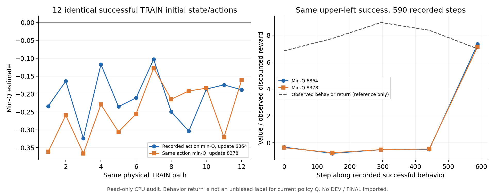

# 실제 TRAIN 연속 동작으로 SAC credit 보강: 2026-10-06

더 단단한 동적 flap을 유지한 GPU3 SAC 전체 DEV는6/128→7/128이었다.
중간 왼쪽2/32·오른쪽5/32, 양쪽 위 선반은0/32다. 일반화 성공이나 확실한 개선으로
해석하지 않는다. 기존128-env 학습을 유지하고 같은 물리·관측·동작 계약에서
n-step critic 보조 학습을 별도로 시험한다.

## 관측 증거와 변경 목적

동일한 실제 TRAIN 성공 경로12개의 첫 recorded action에서 평균 min-Q는
Q6864의−0.2075→Q8378의−0.2480, 당시 실제 탐색 행동 경로의 discounted return은
8.3768이었다. 위 왼쪽 동일590행 경로도 첫 Q−0.3238→−0.3659, 관측 return6.8421이었다.
[동일12경로](assets/rl_v2_actual_TRAIN_path_credit_Q6864_Q8378_paired_20261006.json)와
[후속 전체 경로](assets/rl_v2_actual_TRAIN_success_path_credit_after_8378_20261006.json).



관측 행동 return은 현재 정책 Q의 unbiased label이 아니다. 차이만으로 critic이
틀렸다고 단정하거나 reward를 수정하지 않는다. Terminal 보상의 fitting과 앞선 행동
credit은 별개이므로 연속 동작 결과를 전달하는 별도 목적을 시험한다.

## 옵션형 n-step 보조 Q

기본 one-step SAC에 가중치0.1의 critic 보조 loss를 더한다. Gamma는0.999이며
최대16 control steps의 실제 reward 합과 실제 endpoint의 target-Q를 사용한다.

```text
n = min(16, 실제 terminal까지 남은 step)
target = sum(gamma**j * recorded_reward[t+j], j=0..n-1)
       + gamma**n * endpoint의 현재 정책 target min-Q
terminal이면 bootstrap = 0
```

Endpoint는 기존19-D bounded body correction와 binary jaw4개 분기의 정확한 기대값이다.
현재 entropy backup은OFF이며 중간 entropy를 reward로 새로 넣지 않는다. Intermediate
action은 수집 당시 행동 정책의 action이다. Importance correction 없는 n-step에는
off-policy bias가 있을 수 있어 one-step을 대체하지 않고 실제 전체 DEV로 판단한다.

- 성공과 유한한 안전 위반 실패를 모두 보관한다. 초기 무효·respawn·numerical quarantine·
  altered-waypoint/solver probe·불완전한 경로는 제외하고 이유를 기록한다.
- 각 next actor/critic 관측이 다음 current 관측과 정확히 같아야 한다. Reset이나
  episode를 넘지 않고 마지막 행만 실제 terminal이어야 한다.
- 지역별8192행/총32768행 이내 whole episode를 유지한다. 성공이 있으면 지역별 최소
  1episode를 보호한다. 가용 지역을 균등하게, 그 안의 실제 행을 균등하게 sample한다.
- Q update마다64행을 보조 loss에 쓴다. Actor loss·탐색·reward·안전·DR은 유지한다.
- Bank는 `staged_goal_experience.pt`에 저장하고 checkpoint에는 설정·개수만 남긴다.
  Frozen eval은 optimizer/replay를 갱신하지 않는다.

원래 actor/Q/target-Q·normalizer·4optimizer·counter·성공 보존 schedule·21-D replay는
그대로 복원한다. 보조 목적은 물리 계약 밖의 `measured_train_credit`에 명시한다.
기본은OFF이며 켜진 checkpoint를 `one-step`으로 조용히 재개하려는 요청은 거부한다.
DEV/FINAL·old VR reward·success-only MC label·inverse-action label을 만들지 않는다.

## 실제 기록 연결과 사용법

[`prepare_measured_train_credit.py`](../scripts/rl/prepare_measured_train_credit.py)는 종료·
Drive 검증 완료된 native run을 matching replay와 연결한다. Compact actor feature를
원본464-D 관측으로 오인하지 않고 critic에 담긴 원본 actor/critic·38D current/next flap·
reward·종료·held clock을 비교해 원래 recorded21-D goal 행만 가져온다.

실제 TRAIN360경로(성공27·실패333)를 연결했고 정확히 연결되지 않는2경로는 제외했다.
용량 제한 후 bank는31,447행/64경로(성공10·실패54)다. 위 왼쪽 성공1경로와 양쪽 상단
실패도 포함한다. 기본 replay224,621행은 변경하지 않았다.
[입력 연결과 bank 출처](assets/rl_v2_measured_TRAIN_credit_preparation_20261006.json).

```bash
CUDA_VISIBLE_DEVICES='' PYTHONPATH=src:scripts/rl \
  /path/to/env_isaaclab_232/bin/python scripts/rl/prepare_measured_train_credit.py \
  --checkpoint /absolute/path/to/matching/checkpoint_00006864.pt \
  --closed-run /absolute/path/to/closed-native-run \
  --output-dir /absolute/path/to/new-initialization-directory
```

기존 `batched_staged_goal_with_drive.py --gpu 3 --training` 명령의 checkpoint를
새 입력으로 지정하고 `--measured-train-credit measured-nstep16`을 추가한다.
원래 waves/waypoints/training manifest/demo/native source 인수를 유지한다.
실행 폴더는 새 고유 경로이며 `CUDA_VISIBLE_DEVICES=3`으로 격리한다.
기존 Drive 연결·300초 백업·크기/MD5 검증 후 최신2개 보호·writer 종료 후 로그 검증을
유지한다. 새 대용량 replay도 검증 전에는 삭제하지 않는다.

## 진입 각도 진단과 확인

Frozen upper-right DEV4개×yaw0/−5°/+5°의12attempts는 성공0이었다. 원래 각도는
유효4/4, 바뀐 각도는 각각1/4로 초기 무효3개도 각 분모4에 남긴다. 모든 후보가 유효한
seed121303은 원래/−5°에서 랙 충돌, +5°에서 충돌 없이 timeout·contact quality0이었다.
기본 waypoint를 바꾸지 않는다. [닫힌 전체 결과](assets/rl_v2_firm_flap_upper_right_yaw_DEV4x3_20261006.json).

CPU 검사84개를 통과했다. 실제 실패/성공·불연속/reset 차단·terminal decoder 제외·
gamma^16 endpoint·binary jaw 기대값·actor/Q/optimizer 보존·bank 재개를 확인했다.
검사는 물리 성공을 증명하지 않는다. 실제 새 실행과 보조 Q update는 PID·현재
progress/metrics로 확인한다. 원래 box/base/background DR·동적 firmer flap·네 영역32개씩
평가를 유지한다. 독립 FINAL은 아직 사용하지 않았고 goal은 계속 진행 중이다.
