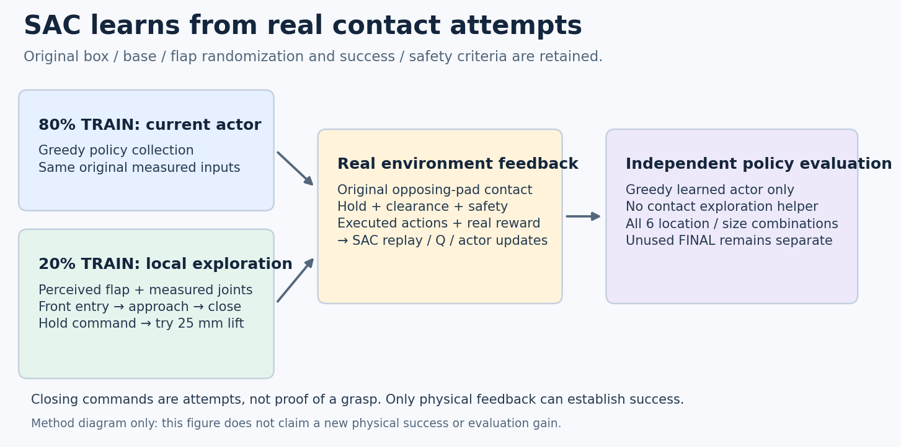
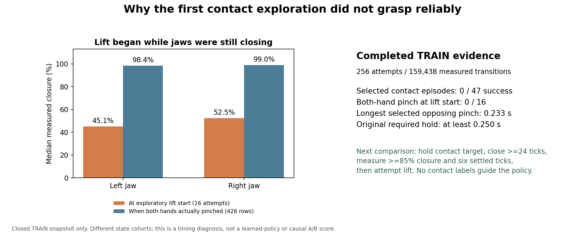

# 양손 파지를 위한 관측 기반 접촉 탐색 SAC

2026-10-08 KST. 목표는 박스·base 시작 상태 무작위화를 유지한 **학습된
SAC 정책의 양손 flap 파지**다. 현재 일반화 성공은 확인하지 못했다.

## 왜 바꾸는가

기존 전체 평가에서는 학습 시간이 늘어도 성공을 잃는 경향이 있었다.
전체 팔 정책은 초기11/128에서 첫 학습 후10/128, servo guard는14→13→8,
uniform은14→8→4→1이었다. 기존 원본 실행도 TRAIN3,072개 조건을 마친
마지막 평가에서5/128이었다. 작은 박스 일부에 성공이 집중되고 중간 크기
박스는 성공하지 못했다. [마지막 원본 평가](assets/rl_v2_all6_eighth_learned_full_DEV_20261008.json).

실제 종료된 TRAIN117개 유효 경로를 보면 손이 가까워지는 것만으로 안전한
진입·닫기·유지·들기를 연속해서 만들지 못했다. 상단 왼쪽과 중간 크기
왼쪽에는 두 손이 가까웠는데도 실패한 경로가 있었다.
[실제 손 거리와 닫힘 분석](RL_V2_ALL6_TRAIN_FAILURE_MODES_20261008.md).

## 이번 변경

새 프로필 `full-arm-contact-exploration`은
`arm20-gentle-rest-greedy`에서 이미 뽑힌20% TRAIN 탐색 episode에만
관측 기반의 연속 접촉 시도를 추가한다. 나머지80%는 현재 정책의 greedy
수집을 유지한다. 새 난수 선택은 없다.

1. 두 손의 배정 flap 중점 거리가 모두22cm 안으로 들어오면 관측된 flap의
   접근 가능한 표면 지점을 정하고 랙 앞 진입 위치를 향한다.
2. 측정된 손 자세를 이용해 닫힘 축을 panel 법선에 정렬하며 표면에 접근한다.
3. 두 손이 목표18mm·축 오차0.25rad 조건에 들어오면 기존 jaw gate가
   허용하는 닫힘을 시도한다. 닫힘 명령이8 control tick 유지되면25mm 들기를
   **시도**한다. 닫힘 명령은 실제 접촉이나 파지 성공의 증거가 아니다.
4. 측정 관절과 pending PD target으로 매 tick 작은 관절 목표를 만들고,
   목표 lead를0.08rad로 제한한다.180 tick 또는 들기40 tick 후에는 원래
   정책 탐색으로 돌아온다.

입력은 기존 측정 관절·TCP·랙 좌표·알려진 박스 형상·flap perception이다.
접촉 센서·pinch·reward·success·critic 관측으로 탐색을 결정하지 않는다.
TRAIN에서 생성한 bounded21차원 URDF 목표가 실제24차원 명령으로 정확히
변환되므로 실제 환경 reward와 함께 SAC replay에 저장한다.

**평가와 actor/Q target 계산에는 이 접촉 탐색이 없다.** TRAIN 보조 동작으로
성공한 수와 학습된 greedy 정책의 평가 성공률은 따로 기록한다. 성공한
동작은 실제 TRAIN 경험으로 학습하는 것이며, 탐색 규칙을 평가에 붙여
정책 성공으로 표시하지 않는다.

## 유지한 설정

S63·Leju twofinger, 중력보상18관절, torso pitch 고정·XZ 이동, base 접근 후
hold, 팔 전체 URDF action 범위, 기존 actor518/critic578/action21을 유지한다.
기존 두 demo로 초기 actor만 복원하며 Q·replay·성공/return bank·optimizer는
새로 시작한다. 강한 성공 유지 항의 계수1은
[직전 비교 실험](RL_V2_URDF_STRONG_SUCCESS_SAC_20261008.md)과 같다.

박스 위치·base 시작·배경·단단하지만 움직이는 flap randomization, 기존 reward,
양쪽 opposing pad 접촉5N·0.25초 유지·8mm clearance 성공 기준을 유지한다.
랙10N·장애물5N·self-collision OFF도 같다. Box 고정, curriculum,
성공 기준 완화, DEV/FINAL 학습 데이터 유입은 없다.

학습은 원래 여섯 위치·크기 조합을 균형 있게 뽑는65 wave, TRAIN6,144개
조건·wave당128환경, replay200만이다. TRAIN384개 조건마다 같은 전체
DEV128을 보조 없는 greedy 정책으로 평가한다. 평가 무효 초기 상태도
128요청의 분모에 남긴다. 중간 크기 박스와 각 구역의 결과를 따로 확인하고
최종 후보는 아직 사용하지 않은 독립 FINAL에서 확인해야 한다.

## 구현과 확인

- [탐색기](../src/kuavo_isaaclab_scene/rl/multi_box/experiments/perceived_contact_exploration.py),
  [SAC 연결](../src/kuavo_isaaclab_scene/rl/multi_box/experiments/urdf_perceived_contact_sac.py).
- 관련 검사46개 통과. 실제 초기 모델 저장·TRAIN 복원·Q 영상용 복원 일치,
  기존 actor/normalizer29 tensor 정확히 동일, 모든 초기 모델75 tensor 유한,
  replay·Q·성공 bank0 확인.
  [초기화 근거](assets/rl_v2_URDF_perceived_contact_initial_verified_20261008.json).
- 종료된 실제 TRAIN117경로의 시작·최근접·마지막 관측351개에서 명령을
  읽기 전용으로 구성했다.161개에서 탐색 제안이 활성화됐고 FK 최대 위치
  오차는0.0162mm였다. 기존 jaw gate·비팔 좌표·bounded 명령·decoder 일치,
  model·관측·RNG 보존을 확인했다. Critic을NaN으로 넣어도 읽지 않는다.
  [관측 기반 검사](assets/rl_v2_perceived_contact_closed_TRAIN_rehearsal_20261008.json).

위 정적 검사는 실제 새 파지 성공이나 성능 개선의 증거가 아니다.
실제 물리 수집과 전체 평가를 계속 확인해야 한다.

## 실행·보관

고유한 frozen checkout와 실행 폴더를 사용하며 여유 GPU에
`CUDA_VISIBLE_DEVICES`와 Kit 단일 GPU를 함께 지정한다. 기존 활성 학습은
유지하고 다른 사용자 파일·프로세스를 변경하지 않는다. 실행 준비 문서만으로
학습이 시작됐다고 판단하지 않는다. 실제 PID·manifest·초기 모델을 대조한다.

기존 Drive 연결로300초마다 checkpoint·계약·로그를 업로드하고 크기/MD5
검증된 오래된 checkpoint만 정리하며 최근2개를 보호한다. Writer 종료 뒤
로그를 검증한다. Raw HDF/replay는 로컬에 남고 자동 삭제되지 않는다.
[보관 범위](RL_GOOGLE_DRIVE.md).

23:43 KST에 GPU2 writer3136255의 실제 첫 전체 DEV 진입을 확인했다.
`CUDA_VISIBLE_DEVICES=2`·Kit 단일 GPU·고정 Python 소스741개,
actor518/critic578·탐색 계약·65 wave·중력보상18관절·원래 환경 계약을 대조했다.
초기 actor/Q/replay0이며 전체 초기 결과·학습 개선은 아직 확인 전이다.
Writer 메모리는17561MiB이고, 기존 인증으로 첫 Drive
검증을23:43:00 KST에 마쳤다. 기존 다섯 활성 학습은 유지한다.
[실제 시작·계약·백업](assets/rl_v2_URDF_perceived_contact_SAC_actual_startup_20261008.json).

10/09의 비교 전체평가와 장기 저장 여유 확보는
[최신 진행 기록](RL_V2_SAC_PROGRESS_20261009.md)에 정리했다. 새 탐색의 초기
평가 및 실제 TRAIN 수집을 계속 확인하며 목표는 미달성이다.

10/09 00:17 KST에 새 실행의 전체 초기DEV128을 완료했다. 성공11·안전 위반48·
시간 초과56·초기 무효13회이며 중간 왼쪽small7·상단 왼쪽small1·상단 오른쪽small3,
나머지는0이다. 실제 종료 모델/normalizer75개는 준비한 초기 모델과 정확히 같고
전체257개 tensor는 유한했다. Actor/Q0·접촉 탐색 통계0인 초기 기준으로, 보조 없는
평가에서 준비한 동작을 보존한 확인이며 새 학습의 개선을 뜻하지 않는다.
이후 실제TRAIN 수집에 진입했다.
[전체 초기결과·같은 모델](assets/rl_v2_URDF_perceived_contact_first_full_DEV_20261008.json).

00:29 KST에 실제 첫 TRAIN의 step391까지 진행했다. 15개 환경에서 탐색
1,747행, 닫힘 명령22행·들기 시도1회를 실행하고 Q658회·actor0회를 기록했다.
기존 명령·그리퍼 projection·보상 일치 검사가 작동하며 고정 소스741개와
CUDA2·Drive 검증을 다시 확인했다. 닫힘과 들기 시도는 실제 파지 성공의
증거가 아니며, 첫 TRAIN128 전체 결과와 학습 후 greedy 평가는 대기 중이다.
[실제 탐색·Q 학습 연결](assets/rl_v2_perceived_contact_first_live_TRAIN_20261009.json).

## 첫 완료 수집 결과와 수정 판단 — 10/09

00:41 KST에 첫 실제 TRAIN128을 완료했다. 성공9·안전 위반42·시간 초과77,
초기 무효/수치 실패0회다. 기존 greedy 수집103조건에서 성공9회,
접촉 탐색으로 선택된25조건은 **성공0·안전 위반11·시간 초과14회**였다.
선택 모드 자체가 탐색의 활성화나 인과적 효과를 증명하지는 않는다.
실제 누적 통계는25handoff·4,291guided행·225닫힘 명령·8들기 시도·24만료다.
현재 이 탐색이 효과적이라고 판단하지 않는다.
[완료된 첫 TRAIN·모델](assets/rl_v2_perceived_contact_first_TRAIN_actual_20261009.json).

Q는첫 배치 종료까지1,590회 업데이트했고 actor는0회였다. Q1,024의 실제
checkpoint에서도20개 Q parameter 변경·모든 Q optimizer step1,024·317개
유한 tensor를 확인했다. 초기actor/normalizer29개는 그대로이고 Q영상용 복원도
정확히 일치한다. 이는 학습 연결의 확인이며 성능 향상의 증거는 아니다.
[실제 Q 갱신](assets/rl_v2_perceived_contact_first_Q1024_actual_verified_20261009.json).

닫기 허용오차18mm와닫힘 명령8tick 이후 들기가 실제 pad 접촉·그리퍼 정착보다
빠른지 점검한다. 이는 아직 원인으로 확인된 사실이 아니다. 첫 두 완료 TRAIN
wave의 replay를 별도 읽기 전용 파일로 복사하고 SHA256과원본 파일 상태를
확인했다. 분석에는 해당 완료 복사본만 쓰며 활성HDF/GPU replay를 열지 않는다.
수집 행동의 수정은 실제 궤적 분석 뒤 결정하고 기존 장기 비교는 유지한다.

01:13 KST에 첫 두 TRAIN 배치의실제159,438행을원래wave·global environment
ID·held clock·base 목표에 정확히 연결하고256개 종료 결과의pinch·stability·
success를 대조했다. 탐색 상태를 다시 계산한 통계가 실제 저장 통계와 같았고
실행21차원 목표의 최대 오차는2.38e-7이었다. 선택47조건은성공0,
기존greedy209조건은18회였다. 선택조건 중양손 opposing pinch를 한 번이라도
만든 것은2조건이고 가장 긴 유지도0.233초로원래0.25초보다 짧았다.

16개 들기 시도 모두시작 전과직후 양손 pinch가없었다. 시작 시 실제그리퍼
닫힘 비율 중앙값은좌45.11%·우52.48%였다. 반면실제 양손 pinch426행의
닫힘 중앙값은좌98.37%·우98.98%였다. 서로 다른 상태집단의 진단 값이며
인과적A/B 점수는아니다. 닫힘 명령8틱을 파지 준비로 간주한 전환이너무 이른
것은직접 확인됐지만, 이후 수정만으로 성공할 것이라고 단정하지 않는다.
[완료 replay 분석·검증](assets/rl_v2_perceived_contact_completed_TRAIN_failure_analysis_20261009.json).

같은 완료 replay의 단계 전환도 원래 명령·통계와 대조했다. 탐색 선택47경로
중27경로가 표면 접근을 시작했고 상단20경로는 모두 랙 앞 준비 단계에서
막혔다. 그중 상단19경로는 실제 탐색이 활성화됐고 나머지1경로는 handoff
전이었다. 구역별 선택/접근 수는 다음과 같다.

| 박스 위치·크기 | 탐색 선택 경로 | 표면 접근 시작 |
|---|---:|---:|
| 중간 왼쪽 small | 7 | 7 |
| 중간 오른쪽 small | 9 | 9 |
| 중간 왼쪽 medium | 8 | 8 |
| 중간 오른쪽 medium | 3 | 3 |
| 상단 왼쪽 small | 9 | 0 |
| 상단 오른쪽 small | 11 | 0 |

랙 앞 준비 중 양손 닫힘 명령은0행, 한 손 닫힘은11행이었다. 따라서 준비
단계의 조기 닫힘을 주된 원인으로 단정하거나 그리퍼를 강제로 여는 새 규칙을
추가하지 않는다. 상단 거리·닫힘 축 정렬이 해결되는지, 수정 버전의 더 긴
360틱 시도가 도움이 되는지 실제 수집에서 확인해야 한다.
[전체 단계 분석·재계산 검증](assets/rl_v2_perceived_contact_completed_TRAIN_phase_analysis_20261009.json).

02:07 KST에 이전 v1의 TRAIN384조건 뒤 전체greedy 평가가 완료돼 성공9·
랙 충돌63·시간 초과56·초기 무효0/128이었다. 자기 초기11→9회, 공통 유효
115조건도11→9회이고 중형은0이다. Actor695/Q4,828의 평가 전후 같은 실제
모델을 확인했으며, 학습 효과가 있다고 주장하지 않는다.
[첫 학습 후 전체평가·모델](assets/rl_v2_URDF_perceived_contact_first_learned_full_DEV4_20261008.json).

## 정착 후 들기 비교 프로필

`full-arm-settled-contact`는별도v2 artifact이며기존v1 모델 계약·실행은
유지한다. 최소24틱 닫힘 명령, 측정 닫힘 양쪽85% 이상, 매틱 변화0.005 이하가
6틱 연속 유지되어야 들기를 시도한다. 닫기 시작 시의접촉 목표점을 측정된
랙 좌표에 저장해서 flap 움직임을쫓지 않고, 실제 TCP가고정 목표와현재 관측
flap의접촉 지점 양쪽 모두6mm 안에 있어야 한다. 기존 nominal jaw gate가
닫힘을차단하면 latch와유지 카운트를 해제한다. 최대시도는360틱·들기60틱이다.

측정된 정착과닫힘도실제 pinch의증거로 취급하지 않는다. 접촉/성공/보상/
critic은탐색 결정에쓰지 않으며, 모든실제 성공 판정과물리·randomization·
reward는그대로다. TRAIN6144·DEV128·replay200만의새 비교로연결한다.
관련52개 검사와 실제CPU 초기저장·학습복원·Q영상복원을 통과했다.
새 초기actor/정규화29개는 원래strong-gentle과 정확히 같고 모델75개는
유한하며 Q·replay·성공/return bank·optimizer는 새로 시작한다.
[v2 실제 초기화 검증](assets/rl_v2_URDF_settled_contact_initial_verified_20261009.json).
실행 결과가나오기 전에는 성능개선으로 표시하지 않는다.

01:24 KST에격리 source `d90eea25e0ec18b8ba476b0eddec729f1e449f84`의
새GPU0 writer353905를 고유한디스크 실행 폴더에서시작했다. 01:30의실제
DEV 진입·743소스 SHA256·원래65 wave/T6144/DEV128·중력보상18관절·
첫Drive 검증을 대조했다. `CUDA_VISIBLE_DEVICES=0`과Kit 단일GPU0으로
메모리17,570MiB를 사용하며 기존 여섯 학습을 유지한다.
[실제 runtime·첫 백업](assets/rl_v2_URDF_settled_contact_SAC_actual_startup_20261009.json).
CPU 관찰기가각 평가의실제 모델을 별도 보존하고 첫전체TRAIN과보조 없는
greedy평가를 검증한다. 초기 metadata 생성전에 종료된CPU 평가관찰기 하나는
파일 생성대기를 추가해다시 시작했고GPU 학습 writer는그대로였다.
[실제 CPU 관찰·수정 범위](assets/rl_v2_settled_contact_actual_CPU_observers_20261009.json).

02:06 KST에 v2의 전체 초기DEV128이 끝나 성공11·안전 위반48·시간 초과56·
초기 무효13회였다. 실제 종료 모델/정규화75개가 준비한 초기 모델과 같고
전체257개tensor가 유한했다. Actor/Q 갱신0인 자기 초기 기준이며 새 학습의
성능을 뜻하지 않는다. 이후 실제TRAIN 수집과Q 갱신을 시작했다.
[전체 초기평가·같은 모델](assets/rl_v2_URDF_settled_contact_first_full_DEV_20261009.json).

02:31 KST에 v2의 첫 실제TRAIN128이 끝나 성공10·안전 위반39·시간 초과79,
초기 무효/수치 실패0회였다. Greedy103조건은10회 성공했고 선택25조건은0회다.
실제25handoff·8,294guided행·1,815닫힘 명령·들기 전환0·19만료를 확인했다.
초기actor/정규화는 그대로이고Q는1,590회 갱신됐다. 조기 들기는 막았으나
성공 경험이 늘었다고 판단하지 않는다. 완료된 첫TRAIN replay83,143행을
원본 상태·SHA256 확인 후 별도 읽기 전용 파일로 복사해 닫힘·정착·거리 조건을
분리해서 분석한다. 기존 실행과 활성HDF/GPU replay는 변경하지 않는다.
[첫 전체TRAIN·실제 저장 모델](assets/rl_v2_settled_contact_first_TRAIN_actual_20261009.json).

## 정밀 접근 후 현재 flap을 추적하며 닫기

완료된 v2 TRAIN83,143행의128종료 결과와 실행 명령을 다시 대조했다. 명령
오차는최대2.98e-7이고 모든 정수 탐색 통계가 같았다. FK 최대오차 통계의
부동소수점 차이1.86e-8m는 별도로 기록했다. 선택25경로 모두 실제 opposing
양손 pinch가 없었다. 닫기를 시도한8경로는24틱 닫힘·6틱 정착을 충분히
통과했지만 **현재 flap 접촉 목표6mm 이내인 행은0개**였다. 현재 목표의
최소 양손 거리는약12mm였고 고정한 옛 목표에는0.16~2.62mm까지 접근했다.
그리퍼가 정착하지 않은 문제가 아니라, 이동한 표면을 따라가지 않고
옛 위치에서 빈 공간을 닫은 것이 직접 확인된 다음 수정 대상이다.
[완료 수집의 닫힘·정착·거리 분리 분석](assets/rl_v2_settled_contact_completed_TRAIN_gate_analysis_20261009.json).

`full-arm-precise-feedback`는기존v1/v2와 구분되는v3 artifact다. 같은20% TRAIN
선택에서 현재 측정 flap의 같은 tangent 접촉 지점을 계속 추적한다. **양손
6mm 이내·축 오차0.25rad 이내일 때 닫기**를 시작하며, 닫는 중에도 축 정렬을
보정한다. 지점 거리가12mm나 축 오차0.30rad를 넘으면 양손을 열고 다시
접근한다.24틱 닫힘·측정 닫힘85%·6틱 정착과6mm 들기 전환은 유지한다.
들기 중에는 기존25mm 목표와 방향 유지 방법을 쓴다.

원래12cm nominal jaw gate와 PD 속도/관절 제한·보상·성공·안전·박스/base/flap
무작위화는 그대로다. 접촉·pinch·성공·critic·reward를 탐색 입력으로 쓰지
않고, 실제 수집된 명령·관측·보상만 SAC에 연결한다. 평가는 탐색 보조 없는
greedy 정책이다. Base/torso/head 채널도 그대로며 curriculum은 없다.
상단의 축 정렬/진입과 중형의 안전 접근은 별도로 남아 있다.

준비 진입점의 `--servo-retention-profile full-arm-precise-feedback`와
`--body-behavior arm20-gentle-rest-greedy`로 선택한다. 기존 프로필과 모델 계약은
유지한다. 관련59개 검사와 실제CPU 모델 저장·학습 재개·Q영상 복원을
통과했고, 초기actor/정규화29개와 frozen source/body anchor를 보존했다.
[실제 초기화·검사 범위](assets/rl_v2_URDF_precise_feedback_initial_verified_20261009.json).
기존 일곱 장기 학습을 유지하며, 새 비교는 먼저 원래첫5배치의TRAIN384와
전체 초기/최종DEV128·replay25만으로 실제 접촉과 학습 연결을 확인한다.
정밀 피드백의 실제 물리 결과와 학습 개선은 아직 확인 전이다.

완료 데이터 진단 도구는[scripts/rl/analyze_completed_contact_replay.py](../scripts/rl/analyze_completed_contact_replay.py)다.
체크섬이 기록된우리 소유의읽기 전용snapshot만사용하고현재 HDF/GPU replay를
열거나데이터를학습으로가져오지 않는다.

03:22 KST에 v3 writer1,807,053의 실제 초기DEV 진행을 확인했다.
`CUDA_VISIBLE_DEVICES=3`·Kit 단일GPU3·소스744개·중력보상18관절·
메모리2,791MiB였으며 기존Drive의03:20 업로드/검증을 확인했다.
원래 첫다섯배치의TRAIN384·초기/학습후DEV각128·replay25만 비교다.
기존일곱장기학습은유지하며 실제평가 모델·초기전체 결과·첫TRAIN·
학습후전체결과를 읽는CPU관찰작업네개도시작했다. 새파지/학습후성능은
아직미확인이다.
[실제시작과원래계약/백업](assets/rl_v2_URDF_precise_feedback_SAC_actual_startup_20261009.json),
[실제읽기전용관찰작업](assets/rl_v2_URDF_precise_feedback_actual_CPU_observers_20261009.json).

완료된v2 TRAIN의 실제양손 opposing pinch357행을 추가로 대조했다.
현재flap의가까운패널점까지양손최대거리는중앙값1.62mm,356행은6mm이내였다.
거리6mm와축0.25rad를동시에충족한행은318개다. 원래실제물리파지에서
이기하조건이실현된근거이며 새v3의성공또는항상수렴가능하다는증거는아니다.
여기서가까운패널점은v3가처음선택해유지하는접선좌표점과다를수있다.
접촉label은완료snapshot의분석에만사용하며학습/탐색입력으로유입하지않는다.
[실제파지와현재패널점기하분석](assets/rl_v2_completed_actual_pinch_geometry_20261009.json).

## 닫힘 중 손이 멀어지는 실제 경로와 v4 추적 시험

04:17 KST에 v3 첫 TRAIN128이 완료됐다. Greedy103조건은10회 성공했고
탐색25조건은0회였다. 전체는성공10·안전 위반47·시간 초과71·초기 무효/수치
실패0회다. 완료 replay81,115행을 원본 상태와 SHA256 확인 후 읽기 전용으로
복사했다.128개 종료 결과와모든 탐색 정수 통계를 대조했고 명령 재계산 오차는
최대3.28e-7이었다. CPU/CUDA FK 통계차이5.38e-8m는 별도로 기록했다.

닫기를 시도한8개small 경로에서 **11번 모두6–7틱 뒤12mm 거리 조건으로
다시 열렸고 축 오차0.30rad 조건으로 열린 경우는0회**였다. 이때 실제 닫힘은
35.8–52.4%여서85% 정착 전에 끊겼다. 현재 flap의최근접 패널점도6mm 밖이므로
처음 선택한접선 지점만 잘못 따라간 현상으로 설명할 수없다. 실제 양손 또는
한손 pinch도없었다. 접촉점과TCP를 각각 측정된랙 좌표로변환해 분리한 결과,
손이 법선방향으로약5–9mm 밀려나는 경로가 있었다. 모든닫힘 구간의finger–flap
힘은0이었다. 이것은finger–box 몸체나 다른링크의 접촉까지없다는증거는아니다.
몸통만 바꾼FK도분리했지만 접촉반동·drive 추종의 근본 원인을확정하지 않는다.

[전체 첫TRAIN·실제 저장 모델](assets/rl_v2_precise_feedback_first_TRAIN_actual_20261009.json) ·
[완료 경로·힘·몸통FK·명령 재계산 근거](assets/rl_v2_precise_feedback_completed_TRAIN_motion_analysis_20261009.json).

`--servo-retention-profile full-arm-motion-feedback`는별도v4 artifact다.
닫힘구간 위치 피드백을2→8/s로 높이고 연속같은phase의현재flap 이동량50%를
feedforward로더한다. 이동량은측정랙 좌표에서계산하며각틱최대2mm다. 전체위치
task increment10mm·관절증분0.02rad·pending lead0.08rad와 실제decoder 제한을
유지한다. 초기화·clock reset·phase 변경·건너뛴tick에서는이전 이동량을쓰지
않는다. 열고접근하거나들 때는기존2/s이며진입속도를일괄 높이지 않는다.

6mm 닫기 시작·12mm 재접근·축0.25/0.30rad·24틱 닫힘·측정85%·6틱 정착·
6mm 들기 전환은동일하다. 기존20% 선택·관측·actor/Q sampling·density·entropy·
보상·물리servo·양손 성공·안전·무작위화도동일하며 접촉/성공label은진단에만
쓴다. 관련66개 검사와실제모델 저장·재개·Q영상복원을 통과했다. 초기actor/
정규화29개와 source/body anchor는v3 초기와정확히같다. **수정은추종가설의
시험이며 아직물리성공 또는학습개선 결과가아니다.** 상단11경로의진입 정렬,
중형6경로의안전접근도 여전히미해결이다.
[초기 모델과실제복원 검증](assets/rl_v2_URDF_motion_feedback_initial_verified_20261009.json).

04:43 KST에격리소스 `1aa4c0b680750e10c6414726552aef21f6bf3b50`의새v4를
고유폴더에서시작했다. 04:50 KST에실제초기전체DEV 진행·writer3,191,064·
`CUDA_VISIBLE_DEVICES=3`·Kit단일GPU3·고정소스745개·중력보상18관절·
메모리2,791MiB를대조했다. 기존Drive는04:49:56에업로드·체크섬검증을
완료했다. TRAIN384·초기/학습후각DEV128·replay25만이며아직actor/Q0인
초기평가다. 기존8개실행은유지했다. 시작기록작성의중복키오류는성공한
기존서비스/PID를다시대조해기록만복구했고중복실행하거나writer를재시작하지
않았다. 평가모델·전체결과·첫TRAIN·시작검증을읽는CPU관찰5개와완료replay
분석관찰을실행했다. 현재학습성공/개선은미확인이다.
[실제시작·환경계약·첫Drive검증](assets/rl_v2_URDF_motion_feedback_SAC_actual_startup_20261009.json) ·
[실제읽기전용관찰](assets/rl_v2_URDF_motion_feedback_actual_CPU_observers_20261009.json).
