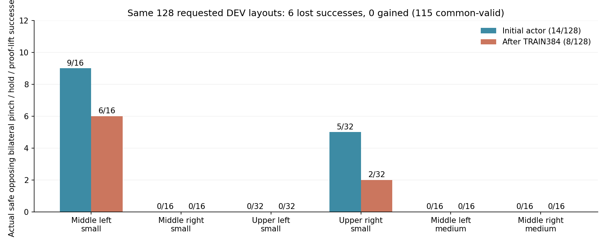

# DEV128 종료 점검과 성공 경로를 유지하는 SAC 갱신

GPU3의 10/10 종료 실험은 오류 없이 끝났고 체크포인트·닫힌 로그의 기존
Drive 검증도 완료됐다. 그러나 **실제 양손 성공은 초기 14/128회에서
학습 후 8/128회로 퇴행했다.** 같은 설정을 그대로 연장하지 않고,
성공 보호에 사용하는 경로와 검사 범위를 수정한다. 목표는 아직 미달성이다.

## 실제 성능과 실패

성공은 안전한 양손 opposing flap two-pad pinch, 상대 자세 안정,
0.25초 hold 및 proof-lift가 모두 기록된 경우다. 분모는 두 평가 모두
요청한 128조건을 유지한다. 독립 FINAL은 요청하거나 수정에 사용하지 않았다.

| DEV128 | 실제 성공 | 초기화 실패 | 안전 위반 | 시간 초과 | 수치 오류 |
|---|---:|---:|---:|---:|---:|
| 초기 | 14 | 13 | 44 | 57 | 0 |
| 학습 후 | 8 | 0 | 50 | 70 | 0 |

요청 layout은 같지만 재초기화한 실제 물리 상태까지 동일하다고 주장하지 않는다.
공통 initial-valid 115조건에서도 성공 14→8, lost 6·gained 0이다.
초기화 실패가 줄어도 policy 성공은 개선되지 않았다.

| 구역·크기 | 요청 수 | 초기 성공 | 학습 후 성공 |
|---|---:|---:|---:|
| 중간 왼쪽 small | 16 | 9 | 6 |
| 중간 오른쪽 small | 16 | 0 | 0 |
| 상단 왼쪽 small | 32 | 0 | 0 |
| 상단 오른쪽 small | 32 | 5 | 2 |
| 중간 왼쪽 medium | 16 | 0 | 0 |
| 중간 오른쪽 medium | 16 | 0 | 0 |

학습 후 안전 실패는 robot-rack 48회, box drop 1회, lift limit 1회다.
랙 충돌은 모두 base 접근을 마친 `held_grasp` 단계에서 발생했다.
중간 왼쪽은 왼팔 `zarm_l4_link` 14회, 오른쪽 gripper base 7회가 주된
종료 몸체이고, 상단 오른쪽은 rack 실패 18회 중 오른쪽 gripper base가
17회다. 전체 rack 종료 최대힘은 약 303.6N이다. 종료 순간의 최대힘·몸체이며
처음 접촉한 몸체나 전체 접촉 이력을 뜻하지 않는다.

상단 왼쪽과 중간 오른쪽 small은 학습 후 초기화가 모두 유효해도 32/32,
16/16회 시간 초과했다. 중간 왼쪽 medium은 유효한 16/16회가 안전 실패다.
따라서 이 구역들의 실패를 초기화 문제만으로 설명할 수 없다.
구역·크기별 초기화/안전/timeout 및 모델·metrics checksum은
[종료 집계](assets/rl_v2_guarded_contact_DEV128_result_20261010.json)에 있다.

## 성공이 있었는데도 보호가 충분하지 않았던 이유

실제 TRAIN384에서 안전한 성공은 wave별 12·10·8회였다. 마지막 성공은행에는
18경로/8,620행이 남았고, 처음 얻은 성공 중 12경로는 구역별 replay 용량 제한으로
빠졌다. 특히 첫 중간 왼쪽 성공 8경로가 마지막 은행에 없었다. actor는 첫 성공을
기다리는 상태를 벗어나 420회, critic은 4,828회 갱신됐다. held TRAIN replay는
237,861행이다. demo BC/teacher/prior weight는 0이었다.

기존 보호는 매번 달라지는 성공 minibatch 64행에 대해 구역별 몸체 평균과 jaw
평균을 검사했다. 첫 성공 경로의 전체 접근 동작을 계속 검사하지 못했고, 양팔
또는 같은 구역의 경로 사이에서 손실 변화가 상쇄될 수 있었다. 기존 실행에는
누적 수용·거절·축소 비율이 저장되지 않았으므로 마지막 거절 하나로 전체 비율을
추정하지 않는다. 마지막 actor 제안은 투영 후에도 거절돼 actor와 Adam을 되돌렸다.
entropy 갱신도 해당 거절에서는 생략됐지만 이미 수용된 갱신 뒤 continuous alpha는
약 8.81e-6, discrete alpha는 0.0113이다.

종료된 성공 TRAIN18경로에서 실제 production servo 명령을 CPU로 비교했다.
상단 오른쪽 전체 경로의 normalized servo MAE는 초기 0.000129에서
학습 후 0.001311로 약 10.1배, 중간 왼쪽은 약 2.1배 커졌다. 상단 왼쪽
TRAIN2경로에서는 명령 오차가 줄었지만 DEV 성공은 여전히 0이다.
이는 기존 상태의 명령 일치 진단이며 물리 성공률이 아니다. 원본 checksum은
유지했고 이 자료를 새 학습에 넣지 않는다.
[실제 명령 비교](assets/rl_v2_guarded_contact_closed_TRAIN_commands_20261010.json)

## 이번 수정

새 선택 옵션은 초기화의
`--actor-success-guard train-success-cohort-Adam-backtrack`이다.
기존 옵션의 동작과 기본 설정을 유지한다.

- 구역·박스 크기별 첫 안전한 성공 TRAIN 경로 2개를 actor 보호용으로 따로
  보존한다. replay에서 빠져도 관측과 실제 실행 명령을 계속 검사한다.
- 각 경로의 접근 prefix와 마지막 64행을 나눠 양팔, 나머지 몸체, 왼쪽/오른쪽
  jaw 손실을 각각 검사한다. 이미 정답인 greedy jaw는 **행·손별로** 틀리면 거절한다.
- 검사 한도는 같은 고정 경로에서 지금까지 수용한 최저 손실이다. 매 갱신의
  허용 오차가 누적돼 기준이 느슨해지는 것을 막는다.
- 실제 Adam 이동 투영과 1~1/64 후보 검사는 유지한다. 거절하면 parameter와
  Adam moment를 복원하고 두 entropy 갱신도 생략한다. 누적 제안·수용·거절·
  투영 수·이동 비율 분포 및 보호 경로 수를 checkpoint와 metrics에 저장한다.

이 검사는 보존한 상태의 행동 퇴행을 제한하며, 다음 물리 rollout의 성공을
보장하지 않는다. 처음부터 성공이 없는 구역의 탐색 문제도 이 수정만으로
해결됐다고 보지 않는다. 다음 pilot에서 성공 유지와 정상적인 갱신 여부를
먼저 비교한 후 필요한 탐색/접촉 수정을 결정한다.

손별 거리·축 정렬·capture 및 실제 two-pad pinch 0.25초 discounted potential은
[직전 보상 설정](RL_V2_SUCCESS_GUARD_STAGED_CONTACT_20261009.md) 그대로다.
두 항목 weight는 각각 1이고 terminal potential은 0이다. 이번 비교에서는 보상,
20% gentle arm 탐색/80% greedy 수집, AR1 rho 0.98, actor LR 1e-6,
replay 250,000, 성공 minibatch와 Q 학습을 바꾸지 않는다.

## 최소 확인과 다음 실행

관련 검사에서 실제 Adam 복원, 수용 시 저장·재개, row/hand jaw 판정,
경로 eviction 후 보존, 누적 오차 제한, DEV/unsafe 유입 거절 및 성공은행을
확인했다. 새 초기 모델의 production factory load와 실제 training resume도
통과했다. 직전 초기 모델과 actor 관련 29개 tensor 및 물리 계약이 동일하며
새 actor/Q 갱신·replay·성공은행·보호 cohort는 모두 0이다. 이전 learned Q,
optimizer, 보상 라벨 또는 종료 평가 데이터를 가져오지 않는다.

다음 비교는 CPU PhysX + GPU3 CUDA learner, DEV128→TRAIN384→DEV128이다.
box/base/flap randomization과 양손 성공·안전 기준을 유지하고 curriculum은
추가하지 않는다. GPU3 UUID의 CUDA 마스크와 single-GPU 장치 namespace를
재사용하며 GPU1·2에는 실행하지 않는다. 실제 실행 확인은 시작 후 추가한다.

기존 best 모델·평가 영상과 종료 raw replay/HDF를 보존한다. 기존 Drive 연결로
300초 업로드·크기/MD5 검증·형식별 최근 checkpoint2개 보호와 종료 로그 검증을
유지한다. raw replay/HDF는 업로드하거나 삭제하지 않는다.
