# V2: 실제 제어명령 좌표의 SAC

2026-10-05 GPU0 비교 실험이다. 기존 GPU3 goal SAC의 성공 유지 분기는 같은
DEV128에서 `4 → 3 → 3 → 7` 성공을 기록했다. 마지막 결과는 중간오른쪽5,
중간왼쪽1, 상단왼쪽1, 상단오른쪽0이다. 일부 개선은 있지만 네 영역의 안정적인
일반화 성공은 아직 아니다. 팔 탐색 분기는 `3 → 1/128`로 개선되지 않았다.

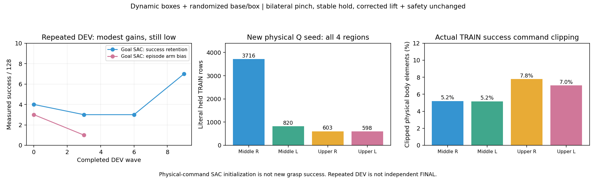

[측정·출처·체크섬·실행 증거](assets/rl_v2_physical_body_sac_initial_20261005.json).
기존 두 GPU3 실행은 유지했고 다른 사용자의 GPU1/2 프로세스도 그대로 두었다.

07:20 후속으로 GPU0 첫 frozen DEV는4/128(중간오른쪽3/상단왼쪽1)이었다.
Actor/Q 업데이트0의 결과이므로 학습 개선은 아니다. 같은 source actor의
기존DEV7/128을 그대로 재현하지 못했고, 물리 재현의 민감성도 남아 있다.
실제 동일 CPU 관측5737행에서 원본 goal controller와 새 prior의 body/jaw
명령은 bitwise 같고 base법칙 차이는1e-5 미만임을 별도로 대조했다.

첫 TRAIN은 실제43202행/Q925까지 진행하다 `Base-plane projection is singular
or near vertical`로 종료됐다. Recorded replay의 singular next pose는1행이고
실제로 terminated였다. 현재 actor pose가 singular인 행은0이었다.
Q bootstrap을 종료행에서도 계산하다 불필요한 base solver가 실패한 것이다.
종료행의 bootstrap을0으로 바로 처리하고 body19/jaw2 계산에서 base solver를
분리했다. Live full command의 singular-base 검사는 유지한다. 실제 실패 replay를
포함한 Q/actor 업데이트가 유한했고 관련55개 테스트가 통과했다.

수정한 GPU0 재개 부모는
`physical_body_SAC_terminal_fixed_resume_pgs128_gpu0_20261005_071955`이다.
실패 writer/manager 종료와 Drive model/replay checksum을 확인하고 physical
Q925·optimizer·실제43202행을 이어간다. CPU 진단에서 수행한 업데이트는
재개 checkpoint에 저장하지 않았다. 아래 full-range 비교도 별도로 시작했다.

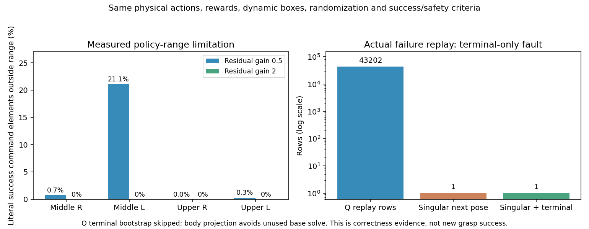

[실패·수정·행동 범위·재개 증거](assets/rl_v2_physical_body_terminal_fix_and_support_20261005.json).

## 변경 이유와 데이터의 의미

기존 SAC의 Q 입력은 요청한 관절/torso 목표21이었다. Servo 속도와 명령이
포화되면 서로 다른 목표가 같은 실제 동작을 만들 수 있다. 원래 TRAIN 성공
상단오른쪽 경로의 body명령 원소7.8%, 상단왼쪽7.0%가 포화됐다. 이것은 학습
표현을 점검할 근거이며 모든 실패의 단독 원인으로 확인된 것은 아니다.

새 분기에서는 Q에 **실제로 실행되는 정규화된 물리 명령21**을 넣는다. 원래
전역 action24와 servo는 유지하고 base3을 제외한 열만 선택한다.

| Q 행동 | 전역 action 열 | 수 |
|---|---|---:|
| waist/양팔/head 관절 명령 | 3..17,22,23 | 17 |
| torso X/Z 명령 | 18,19 | 2 |
| 양손 jaw 열기/닫기 | 20,21 | 2 |

Base는 측정된 초기 box 위치의 선반별 waypoint로 neutral 접근한 뒤 15tick
안정 상태에서 유지한다. SAC가 base 이동까지 학습했다고 해석하지 않는다.

원래 완료된 TRAIN 성공13episode에서 literal held 전이5,737행을 복구했다.
중간오른쪽9episode/3,716행, 중간왼쪽2/820, 상단오른쪽1/603,
상단왼쪽1/598이다. 원본 action24와 pre/next actor/critic/reward/종료,
실제 양손 pinch/stable/hold/lift/safety를 검사하고 base feedback도 대조했다.
목표를 역산하거나 원본 goal Q/optimizer를 가져오지 않는다. DEV/FINAL,
변경한 물리·waypoint probe, 불완전·불안전 기록은 importer가 거부한다.
이 데이터 복원은 새 정책의 물리 성공을 뜻하지 않는다.

기존 Quest demo2와 그에 연결된 neural prior는 frozen 기반 정책으로 남는다.
학습 중 VR 궤적이나 IK teacher를 실행하지 않는다. Actor4865의 goal 정책은
frozen physical command prior로 변환하고, 새 actor는 그 명령에 residual을
더한다. Q/critic normalizer/optimizer/counter는 모두 새로 초기화한다.

## 학습 설정과 비교

| 설정 | 새 분기 |
|---|---|
| actor/critic 관측 | 480/539, held 문맥 마지막 값은 physical residual gain0.5 |
| 연속 행동 | 19차원, `clip(frozen_command + 0.5*tanh(residual), -1, 1)` |
| jaw | 근접12cm gate, 두 Bernoulli와 네 조합의 Q 기대값 |
| Actor LR | 3e-5 |
| 탐색 | AR1 rho0.98, latent Gaussian std초기0.05/최소0.02/최대0.1 |
| Q 준비 | critic 1024update 후 actor를 4critic update마다 갱신 |
| 일반 replay | 100,000행; 별도 physical 형식으로 보관 |
| 성공 데이터 | 영역별 균형 샘플, Q배치20%→5%/5000actor update |
| 성공 imitation | projected 물리 명령 MSE1.0, jaw NLL0.05 |
| 기준 정책 유지 | residual0 MSE0.2→0/5000actor update |

초기 greedy physical 명령이 frozen prior와 같은지 실제5737행에서 확인했다.
Source actor의 원래 radius0.05 문맥과 새 actor의 gain0.5 문맥은 별도로 변환하며
normalization을 보존한다. CPU restore와 native provenance/명령/학습/재개/
frozen 평가 테스트51개가 통과했다. 이는 simulator 일반화 검증을 대체하지 않는다.

S63/Leju2finger/중력보상/upright torso/PGS/원래 그리퍼 구동/동적 box/보상과
안전 기준은 같다. 양손 opposing flap pinch, 안정 hold0.25s,
corrected proof-lift8mm를 유지한다. Robot-rack10N, robot-only obstacle5N,
self-collisionOFF이며 curriculum을 추가하지 않는다.

GPU0은 `CUDA_VISIBLE_DEVICES=0`, 내부 `cuda:0`, Kit active GPU0/single GPU,
128env로 시작했다. Canonical TRAIN과 repeated DEV는 같은 배치를 쓰고,
FINAL은 실행 전에 새 seed namespace2026100500의128case를 별도 생성했다.
이 FINAL은 TRAIN/DEV와 겹치지 않고 정책 선택에 사용하지 않는다.
반복 DEV의 작은 상승을 독립 검증 성공이라고 부르지 않는다.

실행 부모는 `artifacts/rl/drive_runs/physical_body_SAC_pgs128_gpu0_20261005_063724`,
실제 child는 `batch_sac_20261005_063739_dc72fe`다. 현재 상태는 부모의
`status.json`, child의 `progress.json`/`metrics.json`과 실제 PID로 판단한다.
초기 source actor/새 checkpoint/replay/선언한 wave 입력을 기존 Drive로
크기·MD5 검증했다. 관리자는300초 검사, 최신 두 checkpoint와 검증된 두 개
보호, writer 종료 후 로그·HDF·physical replay 최종 검증을 수행한다.

## 재현 가능한 초기화와 실행

원본 성공 corpus와 선택한 frozen actor 입력은 완료된 immutable 파일을 사용한다.
새 형식과 기존 goal SAC 형식은 artifact/algorithm/replay/성공 bank 계약으로
구분하고 잘못된 재개를 거부한다.

```bash
CUDA_VISIBLE_DEVICES='' PYTHONPATH=src:scripts/rl \
  /home/seonho/miniconda3/envs/env_isaaclab_232/bin/python \
  scripts/rl/prepare_physical_body_sac.py \
  --frozen-actor /absolute/closed-input/frozen_actor_inputs.pt \
  --native-successes /absolute/closed-corpus/actual_train_successes.hdf5 \
  --success-outcomes /absolute/closed-corpus/outcomes.json \
  --source-run original_TRAIN_run_basename \
  --native-seed /absolute/lower-calibration/executed_transitions.hdf5 \
  --native-seed /absolute/upper-calibration/executed_transitions.hdf5 \
  --training-manifest /absolute/active_support_pgs_training_input.json \
  --waypoints docs/assets/rl_v2_staged_base_hold_candidates_20261004.json \
  --output-dir /absolute/new-physical-body-initial

CUDA_VISIBLE_DEVICES='' PYTHONPATH=src:scripts/rl \
  /home/seonho/miniconda3/envs/env_isaaclab_232/bin/python \
  scripts/rl/batched_staged_goal_with_drive.py \
  --experiment-dir /absolute/unique-physical-body-experiment --gpu 0 \
  --checkpoint /absolute/new-physical-body-initial/checkpoint_00000000.pt \
  --waves-json /absolute/predeclared-TRAIN-DEV-new-FINAL/waves.json \
  --waypoints docs/assets/rl_v2_staged_base_hold_candidates_20261004.json \
  --demo-dataset examples/demos/v2_grasp_quest_success.hdf5 \
  --training-manifest /absolute/active_support_pgs_training_input.json \
  --native-seed /absolute/lower-calibration/executed_transitions.hdf5 \
  --native-seed /absolute/upper-calibration/executed_transitions.hdf5 \
  --training --stop-on-validation-regression \
  --validation-regression-significance 0.05
```

Remote는 [Google Drive 관리](RL_GOOGLE_DRIVE.md)의 기존 연결을 재사용한다.
계정별 alias/인증은 Git에 기록하지 않는다. 일반 checkpoint uploader만으로는
종료된 HDF를 처리하지 않으므로 위 관리 entrypoint를 사용한다.

## 디스크 정리 기록과 복원

종료·Drive 검증된 원본 run `batch_sac_20261004_214747_7e35c4`의
full `executed_transitions.hdf5` 5,956,363,796bytes를 다시 검증하고 로컬에서
정리했다. 성공13episode의 전체 literal fields/초기state를 담은27MB corpus는
로컬과 Drive에 유지한다. 원본checkpoint/replay/로그, 실행 중인 파일,
다른 사용자의 파일/프로세스는 보존했다. 기록은 원본run의
`closed_hdf_offload.json`과 위 증거JSON에 있다.

Full HDF가 필요하면 기존 remote를 환경변수로 지정하고 원래run folder에
`gdrive.sh copyto`로 내려받아 정리 기록의 size/MD5와 대조한다.
이 정리는 checkpoint retention과 별개이며 종료된 우리 원본 파일에만 적용했다.


## 성공 명령 전체를 표현하는 비교 옵션

`prepare_physical_body_sac.py --residual-gain 2`는 같은 frozen 기반 명령과
literal Q를 사용하면서 보정 가능 범위를 넓힌다. Gain0.5에서는 원본 중간왼쪽
성공 명령 원소21.1%가 policy범위 밖에 있었고, gain2에서는 네 영역5737행의
모든body명령이 범위 안에 있다. 상단오른쪽은 gain0.5에서도 범위 밖0%였으므로
이 제약을 상단오른쪽 실패 원인이라고 단정하지 않는다.

| 설정 | gain0.5 | gain2 |
|---|---:|---:|
| latent Gaussian std초기 | 0.05 | 0.0125 |
| latent std최소/최대 | 0.02/0.1 | 0.005/0.025 |
| 초기 physical std의1차 근사 | 0.025 | 0.025 |
| actor LR | 3e-5 | 7.5e-6 |
| residual0 penalty초기 | 0.2 | 3.2 |

Std와LR은gain의역수, residual0 MSE계수는gain제곱으로 조정해 초기 작은 탐색과
physical 단위의 기준 정책 유지 강도를 맞춘다. Tanh/clipping 때문에 전체
분포가 완전히 동일하다는 주장은 하지 않는다. Actor/Q/optimizer는 별도로
초기화하고 성공body imitation은 계속 실제 projected명령을 비교한다.

Full-range 부모는 `physical_body_SAC_fullrange_pgs128_gpu0_20261005_072246`이다.
GPU0/CUDA_VISIBLE_DEVICES=0/128env이며 초기전체 checkpoint/replay/audit/waves를
먼저 기존Drive로검증했다. TRAIN/DEV는 같고FINAL은 새namespace2026104500이다.
Gain0.5재개와 기존GPU3두분기,다른사용자프로세스는 유지한다. 아직새학습의
개선결과는 없으며구역별DEV로효과를판단한다.

07:10에는 종료된 원본alignedrun의4,120,512,084bytes goal replay도 기존Drive
size/MD5와writer종료를다시확인하고로컬에서정리했다. 원본최신2checkpoint/
로그,13성공literal corpus,현재physical replay는보존했다. 원본run의
`closed_replay_offload.json`에복원용size/MD5/Drive상대경로를기록했다.

## 10/05 08:04 · 실제 업데이트 시작과 frozen 영상 재생

수정한 gain0.5 재개는 첫 TRAIN에서 actor55 / critic1241 업데이트와
새 실제 전이8,908행까지 진행했다. 원래 실패한 critic925를 넘어섰고,
실제 actor 업데이트에서도 Q/actor 손실이 유한했다. 다음 학습 후 DEV는
아직 나오지 않았다. 아래 초기 DEV는 actor 업데이트0의 결과다.

| 실행 | 최근 완료 DEV | 중간왼쪽 | 중간오른쪽 | 상단왼쪽 | 상단오른쪽 |
|---|---:|---:|---:|---:|---:|
| GPU3 기존 goal SAC 성공 유지 | 4/128 | 1/32 | 3/32 | 0/32 | 0/32 |
| GPU3 episode 팔 탐색 | 4/128 | 0/32 | 3/32 | 1/32 | 0/32 |
| GPU0 physical gain0.5 초기 재평가 | 7/128 | 2/32 | 4/32 | 1/32 | 0/32 |
| GPU0 physical gain2 초기 평가 | 7/128 | 2/32 | 4/32 | 0/32 | 1/32 |

GPU3의 반복 DEV는 각각 `4 → 3 → 3 → 7 → 4`와 `3 → 1 → 4`다.
일관된 학습 개선은 아직 없다. GPU0의 두 초기 actor는 같은 frozen 기반
명령을 사용하므로, 초기 상단 성공 위치가 달라진 것을 gain 효과나 학습
효과로 해석하지 않는다. Reset에서 부적합하거나 바뀐 배치는 실패 분모에
남기고 Q에서 제외한다. 초기 gain0.5의 invalid reset도30/128이었다.
일부 원래 배경 box가 선반 밖으로 떨어지거나 충분히 안정되지 않은 것이
기록되어 있다. 최종 guard의 상태는 respawn 이전 고장 궤적을 대신하지 않는다.

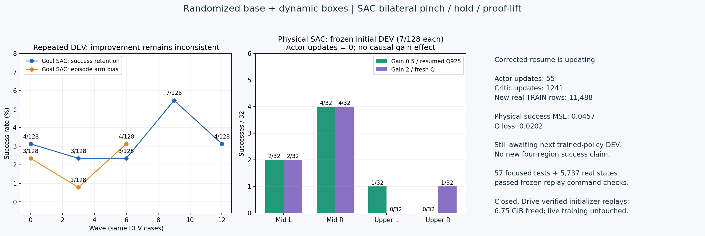

[실제 전이·완료된 DEV·frozen 재생·디스크 검증 증거](assets/rl_v2_physical_body_first_updates_20261005.json).
Randomized base/동적 box/네 영역/보상/안전/성공 조건은 유지한다.
네 영역의 안정적인 일반화와 독립 FINAL 성공은 아직 확인되지 않았다.

학습 runner와 단일 영상 runner는 `experiments/staged_policy.py`에서 같은
artifact dispatch를 사용한다. Physical checkpoint는 body21의 명령과
`physical_body_contract`를 복원한다. 기존 goal checkpoint는 기존 형식을
유지한다. Physical checkpoint로 `--collect-train-goals`를 사용하면 거부하며,
물리 명령을 요청한 goal21로 잘못 기록하지 않는다. Frozen 재생은 실제
전후 actor/critic/replay counter가 같아야 완료되고, 영상용 HDF는 Q에 넣지 않는다.

관련57개 테스트가 통과했다. 두 gain의 실제 기록된 TRAIN 상태5,737행씩에서
frozen 평가 dispatch의 실제 body 명령과 Q action이 bitwise 같고, 초기 명령이
frozen prior와 같으며, RNG/actor/Q/replay가 바뀌지 않는 것도 확인했다.
이 CPU 검사는 simulator 성공이나 학습 개선을 뜻하지 않는다.

단일 영상은 기존 entrypoint의 `--staged-goal-sac`로도 physical artifact를
자동 구분한다. 평가 입력 manifest는 학습과 같은 설정에서 action contract만
기본 upright torso로 돌린 파일이다. Entry point가 `--torso-extra-height-m .06`을
적용한 결과가 실제 학습 contract와 정확히 같아야 한다. 이미 +6cm인 manifest에
다시 +6cm를 적용하지 않는다.

```bash
CUDA_VISIBLE_DEVICES=2 PYTHONPATH=src:scripts/rl \
  /home/seonho/miniconda3/envs/env_isaaclab_232/bin/python \
  scripts/rl/replay_v2_grasp_reference.py \
  --pose-student-checkpoint /absolute/immutable/physical-checkpoint.pt \
  --no-pose-student-training --staged-goal-sac --no-staged-goal-training \
  --staged-base-waypoints docs/assets/rl_v2_staged_base_hold_candidates_20261004.json \
  --pose-student-native-seed /absolute/lower-calibration/executed_transitions.hdf5 \
  --pose-student-native-seed /absolute/upper-calibration/executed_transitions.hdf5 \
  --training-manifest /absolute/closed-input/baseline_entrypoint_manifest.json \
  --layout-json /absolute/declared-layout.json \
  --demo-dataset examples/demos/v2_grasp_quest_success.hdf5 --episode-index 1 \
  --torso-extra-height-m .06 --steps 900 --capture-every 6 --contact-diagnostics \
  --output-dir /absolute/new-unique-video-run --device cuda:0 --headless \
  --kit_args '--/renderer/activeGpu=2 --/renderer/multiGpu/enabled=false --/renderer/multiGpu/autoEnable=false'
```

Episode0은 중간, episode1은 상단의 초기 장면을 복원하는 용도다. 평가 행동은
checkpoint에서 나오며 live VR/IK teacher를 실행하지 않는다. 기존 DEV에서
성공한 상단오른쪽 seed121306은 GPU2 단일 환경 재생을 완료했지만 성공을
재현하지 못했다. 아래 측정 기록을 참고한다.
선택한 DEV 장면의 시각적 재현이며 새로운 FINAL이나 학습 개선으로 세지 않는다.
종료된 `policy.mp4`는 H.264 브라우저 형식으로 변환하고 기존 Drive로
영상·HDF·로그를 크기/MD5 검증한다.

### 종료된 초기화 replay의 추가 정리

실행 중인 GPU3 두 작업과 별개의 완료된 초기화 폴더에서
`staged_goal_experience.pt` 두 개, 총7,246,092,722bytes(약6.75GiB)를
Drive 크기·MD5와 다른 독자가 없음을 다시 확인한 뒤 로컬에서 정리했다.
현재 GPU3의 실제 PID가 살아 있고 각자 최근 checkpoint와 자체 replay를
갖고 있는지 확인했다. 초기화/현재 checkpoint, 실제 TRAIN 성공 corpus,
활성 HDF/로그와 다른 사용자의 파일·프로세스는 그대로 둔다.

각 초기화 폴더의 `closed_replay_offload.json`에 복원용 size/MD5를 기록하고
그 기록도 Drive 검증했다. 초기 checkpoint에서 다시 시작하려면 이 replay를
먼저 같은 폴더에 다운로드하고 검증해야 한다. 현재 실행의 최신 checkpoint로
이어갈 때는 현재 실행 폴더의 자체 replay를 사용한다.

## 10/05 08:26 · 첫 TRAIN 성공과 상단오른쪽 초기 정책의 재생 실패

GPU2 단일 환경의 seed121306 재생은893step(29.77s) 후 안전 위반 없이
timeout으로 끝났다. 초기 batched DEV에서의 성공을 그대로 재현하지 못했다.
Actor/Q/replay counter는 전후 모두0이고, 같은 source actor4865의 frozen
명령을 사용했다. 새 학습 정책의 성능 하락이나 gain 효과를 보여주는 비교는
아니다. 초기 기반 정책의 성공이 안정적으로 재현되지 않는다는 실제 증거다.

| 실제 측정 | 왼손 | 오른손 |
|---|---:|---:|
| 가장 가까웠던 assigned flap 중심 거리 | 9.08cm | 7.08cm |
| 종료 시 assigned 중심 거리 | 12.92cm | 10.66cm |
| front/back jaw 최대 힘 | 0/0N | 0/44.62N |
| Qualified opposing pinch 발생 | 없음 | 없음 |

오른손 한 pad의44.62N만으로 성공으로 기록하지 않는다. 양쪽 jaw 각각5N,
양손 opposing flap/안정 hold/proof-lift 조건은 그대로다. 이 궤적의 actual과
nominal flap 중심 차이는 최대0.173mm, normal 차이는0.20도였다. 따라서
이 사례를 큰 flap 관측 오차 하나로 설명할 수는 없다. 왼손의 실제 진입과
양쪽 jaw 접촉이 부족했고, frozen 접근 명령을 보정하는 학습이 필요하다.
Batch와 단일 재생의 어느 초기 상태·제어 차이가 실패를 만들었는지까지
단정하지 않는다. 실행 중인 source HDF의 잠금을 우회해 읽지는 않았다.

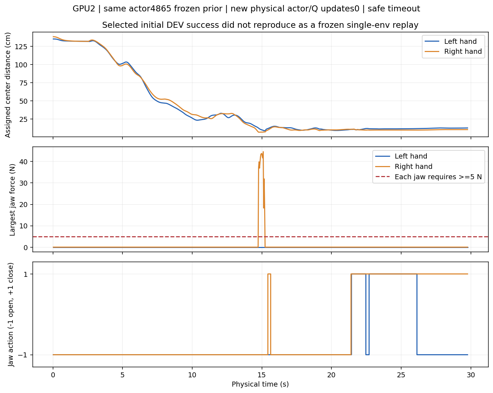

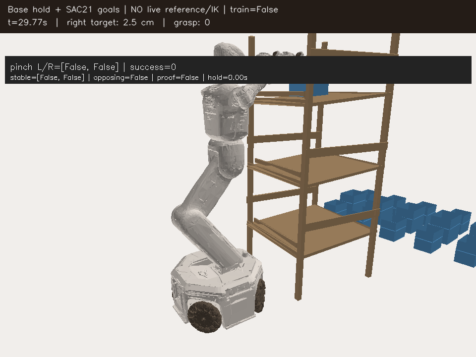

[893step 측정·실패 결과·영상 형식·Drive 검증](assets/rl_v2_physical_body_UR_cold_replay_20261005.json).
영상150frame을 H.264/avc1/yuv420p로 전체 디코딩 확인했고 종료된 영상,
HDF와 로그를 Drive에서 크기·MD5 검증했다. Notion에는 native MP4와 이
그래프/원본 마지막 프레임을 함께 기록한다. 이 최초 영상의 상단 overlay는
기존 `SAC21 goals` 문구를 물려받았지만, 실제 checkpoint/명령은 physical
body21이다. 이후 재생의 caption과 per-step metadata는 physical 형식으로
구분하도록 수정했으며, 원본 영상은 측정 자료로 그대로 보존했다.

GPU0의 실제 학습은 계속 진행 중이다. Gain0.5 첫 TRAIN128배치가 완료되어
actor354/Q2439와 안전한 성공7개(중간오른쪽5/중간왼쪽1/상단왼쪽1)를 확인했다.
각 성공은 전체 episode/실제 양손 pinch/안정 hold0.2667s/보정된 lift
19.73..30.40mm/안전 flag 없음으로 검토했다. Gain2도 actor33/Q1156까지
새 업데이트를 시작했다. 다음 학습 후 DEV와 새 독립 FINAL은 아직 없으므로
TRAIN 성공을 확정된 일반화 개선으로 해석하지 않는다.
기존6GB HDF정리와합쳐약10GB를회수했고현재여유약18GiB다.

## 10/05 09:00 · 성공 명령의 이탈 분석과 학습 후 DEV 평가

Goal은 `randomization을 유지한 SAC 양손 파지 성공`으로 active다. GPU0의
physical SAC 두 실행과 GPU3의 기존 두 실행은 실제 PID/GPU로 계속 실행
중임을 확인했다. 아직 네 영역의 일반화나 독립 FINAL 성공을 확인한 것은 아니다.

Gain0.5의 완료된 checkpoint2439(actor354)를 고정하여 실제 성공 TRAIN
bank6,741행만 CPU에서 분석했다. 아래 오차는 **같은 기록 상태에서 예측한
19개 normalized body 명령과 실제 성공 명령의 평균 제곱 오차**다.
요청한 goal을 물리 명령으로 역변환한 label이나 평가 데이터를 쓰지 않는다.

| 영역 | 실제 성공 TRAIN 행 | Frozen prior 오차 | Actor354 오차 |
|---|---:|---:|---:|
| 중간오른쪽 | 3,706 | 0.01953 | 0.05633 |
| 중간왼쪽 | 1,233 | 0.12825 | 0.12989 |
| 상단오른쪽 | 603 | 0.00221 | 0.05585 |
| 상단왼쪽 | 1,199 | 0.01552 | 0.03939 |

상단오른쪽의 기존 성공 명령에서 특히 멀어졌다. 균등하게 뽑은 실제 성공
TRAIN256행에서 가중 actor gradient의 norm은 Q2.837/body 유지0.428/
jaw 유지1.641/prior 유지0.343이었다. Q와 body/jaw 유지 gradient의
cosine은 각각−0.234/−0.930이었다. 이 표본에서는 Q와 성공 명령 유지가
반대 방향으로 작용한다. 전체 온라인 실패 상태의 gradient를 대표하는 분석은 아니다.

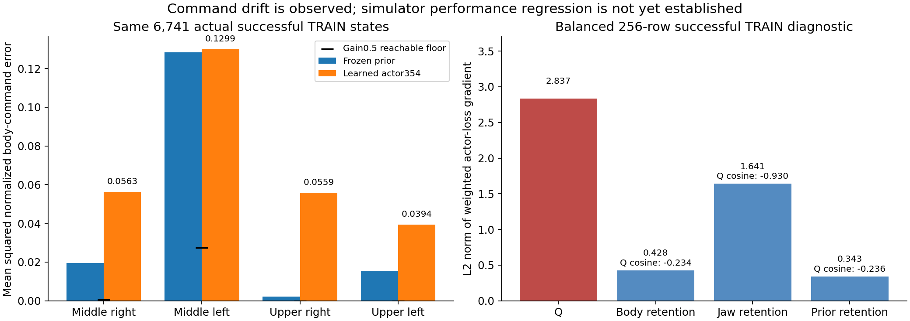

[원래 audit·현재 학습 counter·완료 wave·평가 재실행 증거](assets/rl_v2_physical_body_actor_drift_20261005.json).
실제 성공 행동의 discounted return6.07..7.31에 비해 해당 행동의 Q는
0.29..0.94이고 새 actor 행동의 Q는 더 높았다. 그러나 실제 성공 궤적의
후속 행동과 새 정책의 후속 행동이 다르므로 이 return을 새 정책 Q의
정답으로 취급하지 않는다. 성공의 긴 시간 지연 신호를 충분히 배우기 전에
critic이 성공 명령을 벗어나는 쪽으로 actor를 당긴다는 **가설**을 세웠다.
CPU의 명령 오차·gradient만으로 simulator 성공률 하락을 단정하지 않는다.

같은 사전 선언 DEV128에서 actor354를 frozen 평가하도록 GPU2에 새
고유 실행 폴더를 만들었다. `CUDA_VISIBLE_DEVICES=2`, internal `cuda:0`,
물리 renderer2로 격리하며 기존 다른 작업은 그대로 둔다. 최초 시도는
`--no-training`에 학습 전용 `--stop-on-validation-regression`이 섞여
argparse에서 exit2로 종료했다. 정책/물리 실행 실패가 아니며 종료된 로그의
Drive 검증을 확인했다. 해당 guard와 전용 floor/significance 인자를 제거해
새 폴더 `physical_body_frozen_DEV354_fixed_pgs128_gpu2_20261005_085748`에서
다시 실행했다. 재실행 PID1225010/systemd active/GPU2와 모델 입력의
Drive 크기·MD5를 확인했다. 기록 시점에는 초기화 중이며 평가 결과는 아직 없다.

이 평가는 optimizer/Q/replay를 업데이트하지 않고 TRAIN이나 새 FINAL을
추가하지 않는다. 같은 DEV의 반복 평가이므로 독립 FINAL로 세지 않는다.
성공 조건, safety, 동적 box와 base randomization은 유지한다. 평가 결과를
본 뒤 physical-body 성공 명령 유지의 가중치와 완료된 TRAIN 궤적의
multi-step terminal credit을 강화할지 결정한다. 이 추가 학습 변경은
아직 구현하거나 실행하지 않았다.

## 10/05 09:30 · 학습 후 DEV2/128 확인과 native TRAIN10-step 보강 실행

Actor354/Q2439의 고정 DEV128이 정상 종료했고 닫힌 데이터·로그의 Drive
검증도 완료됐다. 중간오른쪽1/32, 중간왼쪽1/32, 상단 양쪽0/32로 총2/128이다.
초기 GPU0 DEV7/128보다 낮지만 GPU2의 cold 실행이므로 학습 효과만의
비교로 단정하지 않는다. 초기 actor0를 **같은 GPU2·같은 DEV128**에서
고정 재평가하는 대조 실행도 시작했다. 두 평가 모두 학습이나 FINAL이 아니다.

Invalid reset30개는 원래128개 분모에 그대로 남겼다. 안전 위반 종료77개에서
rack 충돌39/box 속도35/과도 lift11/drop8/workspace5가 기록됐다.
한 episode에서 여러 원인이 동시에 켜질 수 있어 원인별 수를 합산한 값을
전체 안전 실패 수로 쓰지 않는다. 초기 배치가 바뀌거나 불안정해지는 문제와
네 영역의 안정적인 성공은 아직 해결하지 못했다.

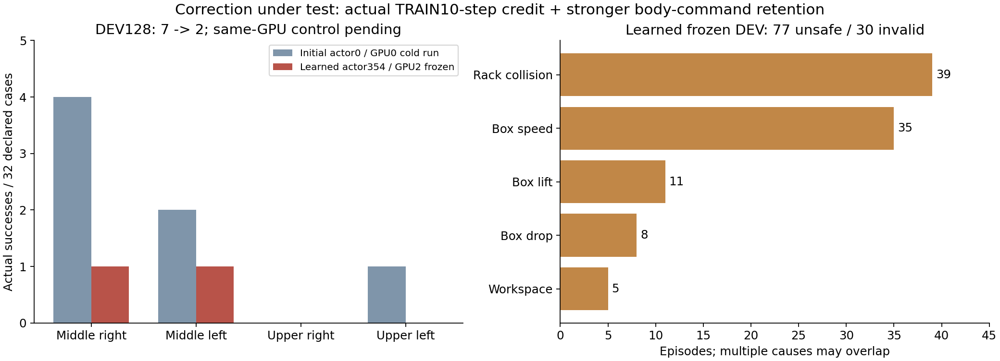

[종료된128개 평가·원인·새 실행·실제 TRAIN CPU 검증](assets/rl_v2_physical_body_credit10_20261005.json).

### 별도 보강 옵션: `native-nstep10`

기본 `one-step`은 기존 설정을 유지한다. 새로운 옵션은 원래 실제 성공
TRAIN13개(5,737행)로 새 Q/optimizer를 시작한다. 실제 물리 body21
명령과 기록 관측을 사용하며 old goal Q, inverse goal label, DEV/FINAL이나
다른 물리 probe를 학습 데이터로 가져오지 않는다. Live VR/IK teacher는 없다.

| 항목 | 기존 physical SAC | 보강 옵션 |
|---|---:|---:|
| 온라인 SAC Bellman target | 1-step | 동일한1-step 유지 |
| 완료 TRAIN의 추가 critic target | 없음 | 최대10-step, 실제 종료에서 끊음 |
| 추가 critic batch/loss weight | 없음 | 64행/1.0 |
| 추가 샘플의 terminal window 지정 비율 | 없음 | 25%; 나머지는 균등 샘플 |
| 성공 body 명령 MSE weight | 1.0 | 10.0 |
| 가까운 손의 성공 jaw NLL weight | 0.05 | 0.1 |
| 물리 단위 prior body 유지 weight | 0.2 | 1.0; actor5,000회에 걸쳐 감소 |
| 실제 성공 TRAIN의 기본 replay 비율 | 20→5% | 동일하게20→5% |

10-step window는 첫 기록 상태·실제 action과 마지막 실제 next state를
사용한다. 실제 reward를 gamma의 거듭제곱으로 더하고, 실제 종료가 없을
때만 `gamma**k`로 endpoint의 soft SAC 값을 bootstrap한다. 종료 window는
bootstrap0이며 terminal placeholder를 controller에 넣지 않는다.
관측 chain이 끊긴 episode는 거부하고, 영역별 성공 bank를 균등 샘플하며
episode를 가로질러 이어붙이지 않는다. 종료를 향하는16행 이상이 매64행에
포함되지만 중간 reward를 새로 만들거나 success label을 완화하지 않는다.

이 방식은1-step/n-step loss를 결합하는
[DQfD 원문](https://ojs.aaai.org/index.php/AAAI/article/download/11757/11616)의
신호 전달 아이디어를 SAC 보강에 적용한 실험이다. DQfD 전체 구현이나
unbiased SAC를 뜻하지 않는다. 중간 action은 기록 behavior의 action이고
off-policy correction과 중간 entropy를 넣지 않아 auxiliary target에
bias가 있을 수 있다. [Experience replay 연구](https://proceedings.mlr.press/v119/fedus20a/fedus20a.pdf)의
uncorrected n-step 결과도 DQN 계열의 실험이며, 이 SAC task의 개선을
증명하는 근거로 쓰지 않는다. 실제 DEV/독립 FINAL로 효과를 확인해야 한다.

관련61개 테스트가 통과했다. 실제13개 episode 전체의 observation chain이
bitwise 이어지고, 최초5,737행의 정책 명령이 기존 frozen prior와 같으며,
physical action/reward/safety 계약이 기존 fullrange와 같음을 확인했다.
별도의 CPU 복사본에서 critic·actor·두 entropy optimizer를 한 번 업데이트해
유한한 loss/parameter를 확인했다. 초기 저장 모델은 그 업데이트 전후 hash가
같고 actor/Q counter0이며, 이 CPU 검사는 새 simulator 성공이 아니다.

초기화 CLI에는 다음 옵션을 추가한다. 실행할 때는 기본과 마찬가지로
새 checkpoint를 기존 `batched_staged_goal_with_drive.py`에 전달한다.
Checkpoint의 학습 계약에서 옵션을 복원하므로 다른 설정으로 조용히 재개하지 않는다.

```bash
# 기존 prepare_physical_body_sac.py의 입력 인자에 추가
--residual-gain 2 --credit-variant native-nstep10
```

GPU3의 새 실행은
`physical_body_SAC_credit10_pgs128_gpu3_20261005_092821`이고128 env다.
`CUDA_VISIBLE_DEVICES=3`/internal `cuda:0`/renderer3이며 PGS와 기존
그리퍼 구동·gravity compensation·동적 box/base randomization·성공/안전
조건을 유지한다. TRAIN/DEV는 기존 fullrange 비교와 동일하며 새 FINAL
namespace2026105500은 정책 선택에 쓰지 않는다. 코드 기준 commit은
`95f1af9`다. 이 기록 시점에는 실제 PID1557650/systemd active/GPU3와
PGS 초기화가 확인됐으며 새 학습 성능은 아직 나오지 않았다.
초기 checkpoint/replay/입력은 기존 Drive에서 크기·MD5 검증했고, 기존
관리자가300초 업로드/검증된 checkpoint 최신2개 보호/종료 로그 검증을 맡는다.
기존 GPU0·GPU3 학습과 다른 사용자의 프로세스는 중단하지 않았다.

저장공간은 종료·Drive 검증·실제 writer/다른 독자 부재를 확인한 예전 제
실험 두 개의 replay/HDF만 추가로 정리해9,720,453,463bytes(약9.05GiB)를
회수했다. 원격 데이터와 복원 size/MD5 기록, 로컬 checkpoint·로그·현재
TRAIN corpus와 활성 replay는 보존했다. 이 정리 후 여유는 약27.35GiB였다.

### 09:46 추가 확인 · 같은 GPU2의 초기 정책 대조

같은 DEV128의 초기 actor0 대조도 정상 exit0로 완료됐다. 중간오른쪽5/
중간왼쪽2/상단왼쪽2/상단오른쪽0으로9/128이며 actor354의2/128보다 높았다.
초기 정책과 actor354에서 성공한 seed는 서로 겹치지 않았다. 다만 두 cold
실행의 invalid reset 판정이7개 seed에서 달랐으므로 실제 초기 물리가
완전히 같은 paired replay라고 부르지 않는다. 반복 DEV이며 FINAL이 아니다.
초기 정책 대조의 invalid reset은31개, actor354는30개였고, 공통 유효
장면은94개다. 명령 이탈과 성공 동작 유지 문제가 있다는 근거가 추가됐지만
원래 모든 영역에서 안정적인 정책이었다고 해석하지 않는다. 초기 정책도
상단오른쪽에서는 성공이 없었다. 새 보강 실행의 학습 개선은 아직 미확인이다.
공통 유효94개에서 초기 정책9개/actor354는1개 성공이었다. 유효 장면만의
비교를 원래128개 성공률과 섞지 않는다.
[같은 GPU 대조의 영역별 결과·공통 유효 장면·판정 변화 seed](assets/rl_v2_physical_body_same_GPU_control_20261005.json).

대조 실행의 종료된 데이터·로그도09:48에 기존 Drive 크기/MD5 최종 검증을 확인했다.
## 초기화 실패를 재생성 전에 확인하는 진단

`train_batched_staged_goal.py --reset-failure-diagnostics --no-training --steps 1`
은 선언된 DEV wave의 원래 active 박스들을 neutral hold 전/후에 측정하고,
selected target이 처음 무효가 된 **partial respawn 직전**의 실제 pose·velocity·
flap joint·rack/base pose와 원인 mask를 보존한다. 이후 parked asset이나
replacement의 값으로 원래 실패를 덮어쓰지 않는다. 일반 학습의 기본은 off다.

기존 batched Drive 실행 명령에 이 옵션들을 추가하고 새 실험 폴더를 지정한다.
DEV만 허용하며 TRAIN/독립 FINAL 및 900-step 평가와 함께 쓸 수 없다.
물리·randomization·충돌·성공 조건은 바꾸지 않으며, 파지 성공률을 측정하는
실행이 아니다. 자료는 Q/replay 학습에 가져오지 않는다.

각 wave의 `reset_failure_diagnostics_wave_<index>.json`에 전체 증거를 기록한다.
기존 `metrics.json`의 `initial_layout_guard.reset_failure_diagnostics`에는 그 파일명과
요약만 기록해 같은 link/physics trace를128번 복제하지 않는다. 60 physics-step
neutral hold는 `env.step`이 아니므로 settling failure/partial respawn은 그 hold
중에는 발생하지 않는다. 그 사이 발생한 물리 움직임은 전/후 및1/2/4/8/16/32번째
physics tick의 root·flap link pose/velocity·joint velocity snapshot으로 확인한다.
이후 첫 selected failure는 cumulative counter·elapsed·geometry/timeout/invalid
pose flags와 함께 기록한다. 주변 박스의 최종 guard sample은 실패 직전 궤적과
구분한다. 닫힌 진단 JSON도 기존 Drive 관리자의 최종 업로드·MD5 검증에 포함한다.

초기 DEV354 guard의 실제 active 주변 박스 failure 18건은 모두 logical5였다.
이 값만으로 원인을 확정하거나 배치/timeout 기준을 완화하지 않는다. 이전
original→packed→original 진단의 valid51→52→51/64에서도 packing만으로 큰
개선은 없었다. 새 진단은 원래 DEV128 분포를 유지한 채 재현한다.

CPU reset/respawn/기존 batched 회귀 검사27개와 Drive 검사13개를 통과했다.
첫-step grace·timeout·nonfinite quarantine과 capture off/on의 동일 reset
판정, 재생성 후 원래 snapshot 보존, 닫힌 diagnostic의 checksum 검증을 확인했다.

### 10:24 · SAC action 전에 시작되는 초기 물리 실패를 확인

GPU2 frozen DEV128 startup 진단은99개 유효/29개 무효였다. 실제289개 active
박스 모두 teleport 직후 footprint/shelf 검사를 통과했고 root velocity는0이었다.
60 physics tick(0.5초)의 zero-action neutral hold 후에는 target logical4(중간왼쪽)
10개, background logical5 17개, target logical9(상단왼쪽)1개가 assigned geometry를
벗어났다. Background5 64개의 속도 중앙값0.227m/s, 최대5.82e9m/s와 flap joint의
수치 발산도 관측했다. 이는 SAC/analytic base rollout 전에 발생한 startup 문제다.

실제 첫 selected reset failure11개는 respawn **전** pose/velocity로 보존했다.
전부 geometry 이탈이며 timeout이나 invalid quaternion이 첫 원인은 아니었다.
이전 정책의 action 탐색만으로 이 초기 물리 문제를 설명하지 않는다. 다만 초기
footprint/shelf 검사는 모든 articulated flap의 contact-free 상태를 증명하지 않으며,
endpoint 두 장만으로 interpenetration·stale link/contact cache 중 어느 메커니즘인지
확정하지 않는다. 후속1/2/4/8/16/32-tick link trace로 실패 시작점을 좁힌다.

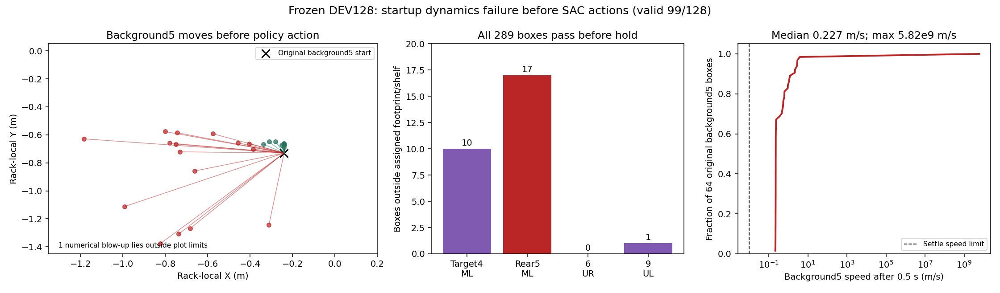

[측정 snapshot·원래 layout·첫 respawn 직전 증거](assets/rl_v2_reset_physics_onset_20261005.json).
진단은 `physical_body_reset_failure_diagnostic_pgs128_gpu2_20261005_101019`이며
writer가 정상 exit0으로 종료한 후 전체 데이터·diagnostic JSON·로그의 기존 Drive
최종 크기/MD5 검증을 완료했다. Frozen 한 step이므로 파지 성능이나 새 FINAL 결과가
아니다. 박스·base randomization과 성공/안전 조건은 유지했다.

이 시점에 GPU0 gain0.5 및 gain2의 학습 후 DEV wave3은 모두1/128이었다(초기7/128).
GPU3 native-nstep10 분기는 첫 frozen DEV가 아직 진행 중이며, 초기 actor/Q0의
결과를 학습 개선으로 보고하지 않는다. 기존 다섯 SAC 실행은 중단하지 않았다.

### 10:37 · 첫 tick/link 추적 완료, passive roller 초기 상태 분리

두 번째 GPU2 진단도 정상 종료·Drive 최종 검증을 완료했다.
[각 tick의 실측·원래 target8의 전체 link trace](assets/rl_v2_reset_neutral_tick_trace_20261005.json).
Teleport 직후 모든 flap 링크는 root에서0.224m 이내였고 link/joint velocity는0이었다.
일부 중간왼쪽 target은4tick까지 속도0.005m/s 미만이다가8tick에1.3–1.4m/s로
튄 뒤16tick부터 assigned geometry를 벗어났다. 단순히 원래 flap이 parked pose에
남은 것과는 다른 양상이며, stale contact/초기 접촉 등은 아직 구분되지 않았다.

설치된 IsaacLab의 `Articulation.reset()`은 actuator/external wrench를 초기화하고
joint velocity를0으로 쓰지는 않는다. 현재 batched restore는 robot/boxes만
물리 joint state를 다시 쓴다. Rack roller의 회전이 wave 사이에 남을 수 있으므로,
`--reset-failure-diagnostics --zero-passive-roller-velocities-probe --no-training --steps 1`
으로 한 요소만 분리한다. 각182-DOF deck의 실제 q/qvel을 probe 전·후 및 hold 후에
기록하고, roller angle/root pose·박스/base 배치·고유 물리/안전 조건을 보존한다.
Zero-spin은 initial support velocity를 바꾼 frozen 진단이다. 기본 학습 설정은
바꾸지 않고 TRAIN/독립 FINAL/Q replay에서는 사용하지 않는다. 이 가설의 효과는
새 결과가 나오기 전까지 확정하지 않는다.

### 10:58 · Roller 초기 회전 제거는 실패를 해소하지 못함

Zero-spin frozen DEV128도 정상 exit0·writer 종료·Drive 전체 크기/MD5 검증을 완료했다.
[원본 반복과 단일 변수 비교의 실측](assets/rl_v2_reset_zero_roller_spin_20261005.json).
중간/위 deck의 초기 최대 회전19.11/19.30rad/s를 실제로0으로 썼고 각도는 유지했다.
그러나 원본 반복과 zero-spin 모두 유효100/128이며, 최초 selected-box 실패10개는
같은 중간왼쪽 환경에서 발생했다. Hold 후 target4/rear5 geometry 이탈은 원본8/18,
zero-spin9/20이다. Zero-spin에서도 background5 최대1383m/s의 비정상 속도가 발생했다.
두 cold 실행의 validity는 환경34/114에서 달라 bitwise paired 물리 비교는 아니다.

Inherited roller spin은 존재하지만 이를 제거해도 초기 실패가 사라지지 않았다.
이 가설을 주원인으로 확정하거나 기본 학습에 zero-spin을 적용하지 않는다.
다음 opt-in reset 진단은 기존 box Body·robot·finger normal-contact 센서를 읽어
첫12개 physics tick와16/32/60tick에 접촉력·root/link/flap 속도·roller 회전을 기록한다.
새 collision geometry나 물리 controller를 추가하지 않는다. 이 센서의 net force는
normal 성분이고 collider identity·tangential friction을 직접 구분하지 않으므로,
관측된 접촉 onset만으로 rack 접촉을 확정하지 않는다.

GPU3 native-nstep10은 첫 TRAIN에서 Q916 updates·actor0(warmup)까지 진행했다.
이 시점에는 보강 손실의 actor 지표와 후속 DEV 결과가 없어 개선을 주장하지 않는다.

### 11:11 · 초기 body contact impulse를 실제로 측정

기존 normal-contact reporter만 읽는 GPU2 진단이 정상 exit0·writer 종료·최종 Drive
검증까지 완료됐다. [접촉·root/link/flap 속도 실측](assets/rl_v2_reset_contact_onset_20261005.json).
원래128개 중100개 유효, 최초 selected failure는 중간왼쪽10개와 상단왼쪽1개다.

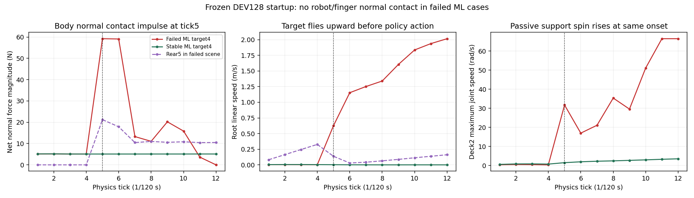

일부 중간왼쪽 target4는1–4tick에 약5N의 정상 지지 상태였지만5tick에서59–64N으로
뛰며 root가 위로 가속했다. Failed ML10개의 tick5 최대 body normal force63.75N,
root speed0.721m/s, flap joint speed0.00435rad/s다. 이 환경의 측정된 robot/finger
normal contact는0이었다. Flap joint의 큰 발산은 처음 관측된 원인이 아니라 나중 현상이다.
Rear5는1–4tick에 contact0·자유 낙하 후5tick에서 첫 접촉한다. Target 충격과
시간적으로 겹치지만, net normal reporter로 두 박스의 인과관계/상대 collider를
확정하지 않는다. 정상 env0에서는 target의 지지력이5N 부근에 계속 머문다.

다음 frozen DEV128 비교는 background logical5만 제외한다. Selected target/base와
나머지 background pose·동적 물리·안전/성공 판정은 유지한다. 이는 주변 박스 배치를
바꾼 **원인 분리 진단**이고 기본 학습이나 성공 검증이 아니다. TRAIN/독립 FINAL/Q에
사용하지 않는다. 기존 학습에서는 주변 박스를 제거하지 않는다.

GPU3 native-nstep10은 첫 TRAIN631step에서 actor33/Q1156회에 도달했다.
실제 nstep batch64행/평균 horizon9/terminal18·bootstrap46행, nstep loss0.0289와
body/jaw 유지 weight10/0.1이 기록되어 보강 코드 실행을 확인했다. 후속 DEV 개선은
아직 평가 전이다.

### 11:20 · Rear5 제외 대조에서는128/128 초기화 유효

[동일 DEV의 주변5 제외 실측](assets/rl_v2_reset_without_rear5_20261005.json)은 정상
exit0·writer 종료·Drive 최종 크기/MD5 검증까지 완료됐다. 원래64개 환경의 주변5만
제외하고 selected target/base/다른 background의 요청 pose를 유지했다.
유효 환경은 원본100/128에서128/128로 늘었고 최초 selected failure는11개에서0개다.
ML32개의 tick5 최대 normal force5.12N/root speed0.00287m/s, tick60 속도0.000381m/s로
원본의 비정상 contact impulse가 사라졌다. 주변5와 support의 접촉이 강한 원인 후보다.

이는 background 구성을 바꾼 초기화 진단이며 파지 성공/학습 일반화가 아니다.
기본 학습에서는 주변5를 유지한다. 다음 단일 변수 검사는 모든 원래 주변 박스를
복원하고 주변5만 초기 support gap8mm에서0mm로 바꾼다:
`--reset-failure-diagnostics --rear5-support-gap-probe-m 0 --no-training --steps 1`.
동적 박스에 제약을 추가하지 않고 selected target/base/다른 박스 pose를 그대로 둔다.
독립 FINAL·TRAIN·다른 물리 probe 조합에서는 거부하며 기본값은 비활성이다.
Data collection은 matching TRAIN Q로 사용할 수 없다. Initial gap/지지계 constraint/
contact cache 중 어느 경로인지 아직 구분되지 않았으므로 기본 reset을 바꾸지 않는다.

### 11:25 · Native-nstep10의 첫 TRAIN 및 actor118 CPU 감사

첫 TRAIN은128개 중 성공2(중간오른쪽2)·invalid reset42·unsafe58·timeout26으로 끝났다.
Actor118/Q1496에서 두 번째 TRAIN을 계속한다. 초기 frozen DEV11/128과 다른 TRAIN
배치이므로 직접 성능 변화로 비교하지 않는다. 보강 후 DEV 개선은 아직 평가 전이다.

[안정적인 checkpoint1496의 CPU 감사](assets/rl_v2_physical_body_credit10_actor118_TRAIN_20261005.json)는
실제 성공 TRAIN bank13개(원래13개와 같은 episode 수, MR 중복 case 교체)만 읽고,
optimizer/온라인 runtime은 변경하지 않았다. Normalized physical command MSE는
MR0.00954→0.01228, ML0.18453→0.15784, UR0.00221→0.00552, UL0.01177→0.00998이다.
두 영역은 성공 명령과 가까워졌고 두 영역은 멀어져 retention 개선도 아직 균일하지 않다.
Current-policy soft Q는 성공 native 명령에0.69–1.31, 실제 behavior discounted return은
6.07–7.26이다. 두 값은 동일한 정책/entropy 정의의 값이 아니므로 equality 검사나
정확한 Q 오류로 확정하지 않는다. 이 CPU 수치는 물리 파지 성능이 아니며 진단 자료를
Q에 다시 넣지 않는다.

### 11:29 · Rear5 초기 gap0도 실패: 기본 설정에 적용하지 않음

[모든 주변 박스를 복원한 gap0 대조](assets/rl_v2_reset_rear5_zero_gap_20261005.json)도
정상 exit0·writer 종료·최종 Drive 검증을 완료했다. 원래289개 박스를 유지했고
rear5의 bare-shelf clearance는 실측0.009997m(roller 상승분0.010m)로 낮아졌다.
하지만 유효99/128·최초 selected failure11개가 남았다. 중간왼쪽 target4는 첫 physics
tick부터 최대21.10N·0.183m/s로 튀기 시작했고,12tick에2.03m/s에 도달했다.

주변5 제외는 초기 불안정을 해소했지만 주변5의8mm 초기 낙하만 제거하면 해소되지
않았다. Rear5/지지계 접촉은 강한 원인 후보이나 초기 높이를 해결책으로 채택하지 않는다.
모든 기본 SAC 학습은 원래 박스·초기 pose·동적 물리·randomization을 유지한다.
다음에는 실제 contact pair와 support link의 움직임을 분리해 stale/phantom contact와
shared support constraint/solver 문제를 구분한다. Cold 반복 결과로 독립 파지 성능을
주장하거나 실패 판정을 완화하지 않는다.

11:34 현재 GPU0 gain0.5의 frozen DEV 성공은 wave0/3/6에서7→1→3/128,
gain2는7→1→5/128이다. 최근 wave6에서 각각 MR3, MR4/UR1이었고 ML/UL은0이다.
일부 반등이지만 초기 성능보다 낮고 네 영역의 안정적인 개선은 아니다.
GPU0·3의 기존 다섯 SAC PID와 최근 Drive 백업을 실제 확인했으며 중단하지 않았다.

### 11:42 · 실제 contact pair와 fixed support 이동의 분리 측정

`--reset-failure-diagnostics --reset-contact-pair-diagnostics --no-training --steps 1`
은 기존 box Body reporter의 filter만 rack 구조물·546개 roller·모든18개 box의
Body/4flap으로 확장한다. 새 sensor·collision geometry·collision rule·servo는 추가하지
않는다. Frozen DEV startup만 허용하며 TRAIN/독립 FINAL/replay에는 사용하지 않는다.

각 tick에서 source Body의 가장 큰 normal force pair3개를 개별 vector/magnitude로
저장한다. Filter 축과 선언 target 수가 다르면 attribution을 거부하고 nonfinite force는
null로 보존한다. Contact 상대의 실제 body-link pose/velocity를 같은 environment ID로
읽으며 ambiguous/unresolved 경로를 USD pose로 대신하지 않는다. Tangential friction은
측정하지 않는다. Fixed support Base의 실제 pose/velocity와 모든 roller center의 처음
대비 이동량도 기록해 contact identity 오류와 shared-support motion을 구분한다.
Pair 순서/환경 identity/nonfinite/기본 reset과 관련한70개 검사 통과.

### 12:01 · 접촉 상대 실측: 앞·뒤의 별도 롤러, 고정 지지대

[실측 접촉 상대 자료](assets/rl_v2_reset_contact_pairs_20261005.json)와
[그림](assets/rl_v2_reset_contact_pairs_20261005.png)의 원본 DEV128 진단은
exit0·writer 종료·최종 Drive 크기/MD5 검증을 완료했다. 원래289개 박스와
randomized base/box, 구동·물리·안전 조건을 유지했으며 actor/Q 업데이트는0이다.
유효 초기 환경은98/128, 최초 selected failure는중간왼쪽 target4의10개였다.
이 숫자는 초기 상태 유효성이고 파지 성공률이 아니다.

앞쪽 target4의 큰 접촉은 physics tick5(41.7ms)에 발생했다. 예시 env8은
`RollerDeck_02/Roller_r05_c03`에서개별 normal59.25N을 받았고,
뒤쪽 box5는같은 tick에별도 rear rollers r21/r22/r23에 처음 닿았다.
실패10개 target4의 최대 속도는tick4의0.00427m/s에서tick5의0.74471m/s로
증가했다. 기록한상위3개 접촉은롤러/랙이며 직접box4–box5 접촉은없었다.
상위3개만 기록했으므로 모든 미소접촉의 부재를 증명하지는 않는다.

세 support 모두실제 `is_fixed_base=True`, Base의위치 이동/속도는0이다.
전체60tick에서 roller 중심 이동은최대약5.4µm로 지지대가 흔들린 설명과
맞지 않는다. 뒤박스 최초 접촉과 앞롤러 충격이동시에 나타나며,
뒤박스만 제외한대조에서는충격이사라졌다는증거로 shared-articulation/contact
solver 상호작용을조사한다. 엔진 원인이나 에너지 전달경로를 확정하지않는다.

다음 `--reset-solver-probe TGS`는frozen DEV/steps1에서PGS→TGS만바꾼다.
시간간격·iteration·질량·마찰·모든박스·초기배치·보상·성공·안전은유지한다.
진단artifact에원본/실제solver와Q import불가를명시하며 기본SAC는변경하지않는다.
TRAIN/독립FINAL/다른물리대조와혼합을거부하는78개검사통과.

### 12:10 · TGS 대조도 실패: 실제 관성·독립 branch coupling 확인으로 전환

[Solver만 TGS로 바꾼 원래 DEV128 대조](assets/rl_v2_reset_solver_tgs_20261005.json)는
writer 종료·exit0·최종 Drive 크기/MD5 검증을 완료했다. 실제 USD solver=TGS를
확인했으며 나머지 물리·모든 박스·초기배치·randomization·성공·안전은 유지했다.
초기 유효100/128, 최초 selected failure11개가 남았다. 같은 tick5에서 앞 target4의
큰 롤러 impulse가 재현됐으므로 solver 변경을 해결책으로 적용하지 않는다.
이 결과는 파지 성공률이 아니며 TRAIN/독립 FINAL/Q import에 사용하지 않았다.

기존 접촉 진단 옵션에서만 지지계의 실제 PhysX mass/inertia, armature, damping,
stiffness와 generalized mass matrix를 한 번 읽도록 보강했다. 고정 Base 아래 별도
롤러 DOF 간 관성 coupling을 대각선/비대각선 값으로 구분한다. 행렬을 역산하거나
물리 파라미터를 쓰지 않고 nonfinite/비양수 inertia는 그대로 진단에 남긴다.
일반 SAC 실행에는 추가 읽기·계산이 없다. 관련 검사81개 통과.

기존 GPU3 success-retention의 완료된 DEV18은5/128(MR3/ML1/UL1/UR0),
초기불량28개였다. DEV15의4/128에서 한 건 늘었지만 초기4/128·최고7/128와
비교해 안정적인 네 영역 일반화 개선을 입증하지 못했다. 기존 학습은 유지한다.

### 12:35 · 실제 관성은 정상, USD drive 속성 이름 오류 확인

[닫힌 원래 PGS 진단과 설치된 USD API 감사](assets/rl_v2_passive_bearing_schema_20261005.json)에서
128개 중101개 초기 상태가 유효했고 최초 selected failure10개가 남았다. 세 지지대는
fixed Base이며 실제 roller mass0.05kg, spin inertia약5.625e-6kg·m²였다.
각 generalized mass matrix는128×182×182이며 모든 대각 원소가 양수·유한하고
최대 정규화 비대각 값은0이었다. 초기 정적 관성 coupling 가설과 맞지 않지만
접촉 solver의 상호작용까지 배제하는 결과는 아니다. Writer 종료·exit0·최종 Drive 검증 완료.

실제 PhysX의 roller K/D/armature는 모두0이었다. 원인은 actuator 없는 설정이
감쇠를 지운 것이 아니라 작성된 USD 속성 이름이었다. 기존
`physics:drive:angular:damping`은 canonical
`drive:angular:physics:damping`과 달라 엔진이 무시한다. 설치된 `UsdPhysics.DriveAPI`로
546개 joint 모두 damping0/maxForce∞를 확인했다. Generator의 다섯 drive 속성을
canonical namespace로 수정했고 작은 감쇠가0으로 반올림되지 않게12유효숫자를 쓴다.

USD angular damping은 degree 기준이다. 의도한 runtime damping2e-5N·m·s/rad를
USD에3.490658504e-7N·m·s/deg로 기록한다. 이는
[OpenUSD Drive API의 단위](https://openusd.org/dev/api/class_usd_physics_drive_a_p_i.html)와
설치된 IsaacLab schema 변환에 따른다. K0/target velocity0/maxForce0.05N·m로
수동 bearing 감쇠만 복구하며 위치 servo나 roller 잠금을 추가하지 않는다.

현재 학습5개가 읽은 packaged USD는 건드리지 않는다. 새 고유 입력 폴더의
overlay가 원본 geometry/material/mass/anchor/path를 그대로 참조하고 drive 속성만
덮는다. GPU2의 frozen DEV128/steps1에서
`--passive-bearing-probe-layer /absolute/path/bearing.usda`로 비교한다. 실제 초기화된
모든 환경·joint의 K0/D2e-5/F0.05를 읽어 확인하지 못하면 진단을 거부한다.
TRAIN/독립 FINAL/다른 물리 probe와 혼합할 수 없으며 Q import 불가를 기록한다.
Native USD schema·단위·546개 geometry/anchor 보존과 실제 drive 검사 포함88개 테스트 통과.

이 수정이 최초 박스 충격이나 파지 실패를 해소했는지는 아직 물리 비교 전이다.
물리가 바뀌므로 향후 학습에는 새 물리 identity와 fresh Q/replay가 필요하다.
기존 D0 Q/replay를 새 bearing 경험으로 이름만 바꾸어 이어 쓰지 않는다.

### 12:50 · 감쇠 복구는 확인했으나 초기 충격은 남음: flap source까지 측정

[감쇠 복구 전후의 닫힌 비교](assets/rl_v2_passive_bearing_comparison_20261005.json)는
writer 종료·exit0·최종 Drive 검증을 완료했다. 수정한 모든128×546개 joint의 실제
K0/D2e-5/F0.05를 확인했으나 초기 유효100/128, 최초 selected failure는원래와
동일한중간왼쪽10개였다. Tick5의 최대 body net normal59.04N/root speed0.650m/s로
큰 초기 충격도 남았다. Cold 반복의101→100은성능 변화나파지 성공률이 아니다.

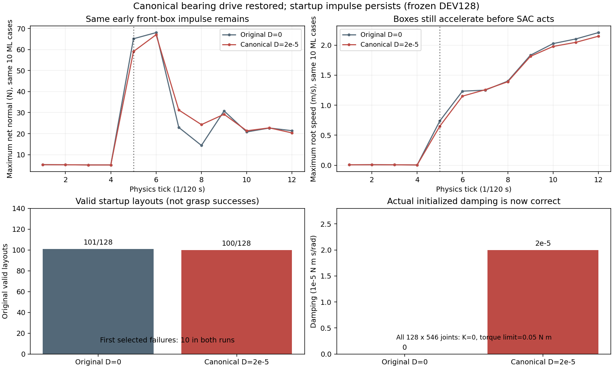

작성된 drive 오류는확인된결함이나 초기 충격을해결했다고주장하지 않는다.
현재의 contact pair 보고는 source가Body이므로 flap–flap 접촉은직접 측정하지 않았다.
뒤박스 최초 접촉과 앞박스 충격의 동시성만으로 shared-articulation/engine 원인을
확정하지않는다. 다음 원래PGS/D0/DEV128 진단은모든원래배치를 유지하면서
`--reset-flap-contact-pair-diagnostics`로18개physical box의네flap을각각측정한다.

설치된IsaacLab의filtered contact는source한개대여러target만지원하므로72개
단일flap source reporter를별도로추가한다. 기존Body/finger reporter는보존한다.
모든다른box의Body/4flap pair 최대값·nonzero 개수·nonfinite 개수를전체filter에서
기록해global top3에가려진다른박스접촉도확인한다. Source/target의실제link pose와
velocity, environment/logical/physical pool identity를함께기록한다. Normal force만
측정하며vector합산을충돌판정으로쓰지않는다. Mass·geometry·collision rule·초기pose·
감쇠·보상·성공·안전은변경하지않고TRAIN/Q/독립FINAL에는사용하지않는다.
기본학습에서는새sensor와추가읽기가없다. Pool mapping·one-source/filter axis·
숨은other-box contact·nonfinite보존을포함한관련95개검사통과.

### 13:05 · 뒤박스가 없는 실패 환경도 존재: 국소 인과관계로 단정하지 않음

[실제 초기 link pose와 composed geometry bounds의 CPU 검사](assets/rl_v2_initial_box4_box5_bounds_clearance_20261005.json)에서
최초 실패ML10개 중env28/100/116/124는처음부터active logical5가없었다.
나머지6개에서는Body와네flap의모든25개bounds pair가분리되어있었고
최소분리축투영gap은약0.430m였다. 이는실측초기link pose에대한bounds 검사이며
충돌manifold 자체나이후접촉을측정한결과는아니다. 기하/물리/학습상태를쓰지않았다.

따라서모든환경에서주변5를제외했을때128/128이유효해진결과를
각실패환경의뒤박스가앞박스에직접충격을줬다는증거로해석하지않는다.
Batch contact 처리·reset의숨은상태·view/environment ordering 가능성도구분해야한다.
현재의flap source 진단은이전기록의측정공백을메우며, 직접접촉이없다면다음에는
PhysX 실제prim ordering과teleport후contact cache를확인한다. 아직엔진오류로확정하지않는다.

### 13:10 · 진단의 환경 경로 변환 오류 수정

첫 flap 진단은 정상 학습 결과를 얻기 전에 exit1로 끝났다. Isaac의
InteractiveScene은 sensor 경로의 `{ENV_REGEX_NS}`를 `/World/envs/env_.*`로 바꾼다.
별도로 보관한 진단 target 목록에는 원래 매크로가 남아 있어 filter index 조회가
실패했다. 진단 목록도 실제 `env.scene.env_regex_ns`로 변환하도록 수정했다.
이 오류는 추가 진단 코드의 경로 문제이며 기존 SAC 다섯 실행과 물리 제어에는
영향을 주지 않았다. 실패 writer 종료와 최종 Drive 로그·체크섬 검증을 완료했다.

재시도는 원래 128개 환경·289개 박스를 유지하며 현재 조사하는 physical pool4/5의
네 flap씩 총8개 reporter만 생성한다. Filter target은 여전히 모든 다른18개 pool의
Body/4flap이다. Source 범위만 줄여 초기화 비용을 낮추며 박스를 제거하지 않는다.
옵션은 `--reset-flap-contact-physical-pools 4 5`이고 기본 진단은 전체72개다.
단일 source·명시적 pool identity·filter 전체 범위·매크로 변환·입력 보존을 포함한
관련97개 CPU 검사가 통과했다. Frozen DEV/steps1 제한과 Q import 금지는 유지한다.

### 13:37 · 초기 flap 접촉은 0: 실제 view 순서·위치 읽기값 감사 추가

[닫힌 flap source 진단](assets/rl_v2_reset_flap_source_contacts_20261005.json)은
exit0·writer 종료·최종 Drive 검증을 마쳤다. 초기 유효99/128, 최초 selected failure는
11개(기존 ML10개와 UL1개)였다. 이 숫자는 초기 물리 상태 판정이며 파지 성공률이 아니다.
기존 ML10개에서 target4의 총40개 flap source는 첫12개 physics tick 동안 모두
net normal0·다른 박스 pair normal0을 보고했다. 동시에 Body는 tick5에서 약63N,
tick6에서 약71N을 받았고 root 속도가 상승했다. 이후 tick60에서 flap net normal38.29N과
다른 박스 pair26.63N이 측정돼 reporter가 항상0인 것은 아니다.

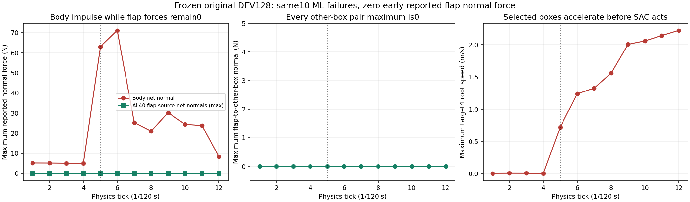

측정된 초기 flap normal contact만으로 Body 충격을 설명할 수 없다. Tangential force는
이 진단의 측정 대상이 아니며 실제 PhysX row와 환경 ID의 대응도 독립 확인해야 한다.
이를 위해 reset 후 첫 neutral physics tick 전에 실제 root/contact source view의
`prim_paths`에서 환경 순서를 읽고, contact source의 xyzw pose와 Articulation의 wxyz
link pose를 비교하는 읽기 전용 진단을 추가했다. Quaternion 부호 동치와 유효성을
확인하며 환경 origin도 기록한다. Pose 불일치 자체를 solver 원인으로 단정하지 않는다.

이 읽기는 `--reset-failure-diagnostics`에서만 수행한다. 일반 학습의 물리·관측·보상·
성공·안전·Q/replay를 바꾸지 않는다. 실제 같은128개 환경과8개 flap reporter를 쓰는
frozen DEV/steps1 비교로 경로 순서와 teleport 직후 읽기값을 확인한다. 환경 순서 오류·
quat convention/부호·nonfinite 보존·shape 계약을 포함한 관련101개 CPU 검사가 통과했다.

### 13:45 · 실제 실행과 저장 공간 확인

View 감사는 `physical_body_reset_view_identity_pgs128_gpu2_20261005_134003` 관리 폴더에서
코드 `7c5faf2`와 `CUDA_VISIBLE_DEVICES=2`로 시작했다. 이전 flap writer 종료·MainPID0·
최종 Drive 검증과 immutable CP0의 원격 MD5를 확인하고 같은 DEV128 waves를 복사했다.
입력 manifest와 waves도 Drive 검증을 마쳤다. 초기화 중이며 결과 판정은 아직 하지 않았다.

13:43 호스트 확인에서 기존 GPU0 두 실행과 GPU3 세 실행 모두 writer가 살아 있고
console의 actual rows 및 actor/Q counter가 진행했다. 최근 완료 DEV는 각각
5/128·6/128·5/128·6/128·5/128이며 네 지역 일반화 성공은 아직 부족하다.
다섯 실행의 최근 Drive 검증은13:37~13:41이고 backup error는없었다.

로컬 여유 약17.6GiB에서 공간 부족을 예방하기 위해 종료된 TGS 비교 세 실행의
replay와 HDF 여섯 파일만 offload했다. 각 파일의 소유 UID·writer/supervisor 종료·
다른 reader 없음·active command에서 사용하지 않음을 확인하고 원격 크기/MD5를
재검증했다. 복구할 원래 run/file 이름·크기·MD5·원래 exit1을 receipt에 남기고
receipt도 Drive 검증했다. 확보량7,221,383,048bytes(약6.73GiB), 직후 여유24.43GiB다.
종료된 실패 비교를 학습 완료로 기록하지 않는다. 각 실행의 최신 체크포인트 두 개·
로그·원래 TRAIN 성공 corpus·calibration·활성 SAC replay/HDF는 보존했다.

### 13:50 · 실제 view 순서와 초기 pose 읽기값은 정상

[닫힌 view 감사](assets/rl_v2_reset_view_identity_20261005.json)는 exit0·writer 종료·
MainPID0·최종 Drive 검증을 완료했다. 실제30개 root view와26개 contact source view
모두128개 환경의 순서가 맞았고,26×128개 source pose 비교의 최대 위치 오차0m,
quaternion 절대 unit dot 최솟값1, invalid pose row0이었다. 초기 유효99/128이며
최초 selected failure는 같은 ML10개였다. Actor/Q update0이고 파지 성공 평가가 아니다.

단순 환경 row 혼선이나 측정된 초기 source pose 읽기값 차이로 충격을 설명할 수 없다.
이는 모든 미래 force filter index나 solver 내부 cache 상태가 정상이라는 증명은 아니다.
다음 GPU2 frozen 비교는 원래 실패 env100(seed121025, target4만 active)과
env8(seed121002, 원래 주변5/9 유지)를 각각1개 환경에서 재현한다. 원래 요청 layout은
그대로 복사하고 각 사례의 박스를 제거하지 않는다. 배치 크기와 함께 world origin 및
constructor solver history도 달라지므로 실제 rack-relative link pose를 대조하기 전에는
배치 solver를 원인으로 확정하지 않는다. 학습·보상·randomization 설정은 유지한다.

### 14:02 · 같은 실패 layout이 단일 환경에서는 안정: 초기 지지대 frame으로 비교

[닫힌 두 단일 환경 비교](assets/rl_v2_single_environment_reset_comparison_20261005.json)는
각각 exit0·writer 종료·MainPID0·최종 Drive 검증을 마쳤다. Env100의 원래 target4와
env8의 원래4/5/9를 모두 유지했으며 두 사례 모두 초기 유효1/1, 최초 failure0이었다.
첫12개 tick의 target4 Body normal은약5.1N으로 유지됐다. 원래 DEV128에서 tick5는
env100이17.22N/root speed0.139m/s, env8이60.37N/0.642m/s였고 단일 환경에서는
각각5.09N/0.00301m/s와5.09N/0.00139m/s였다. 파지 action/학습 update는0이다.

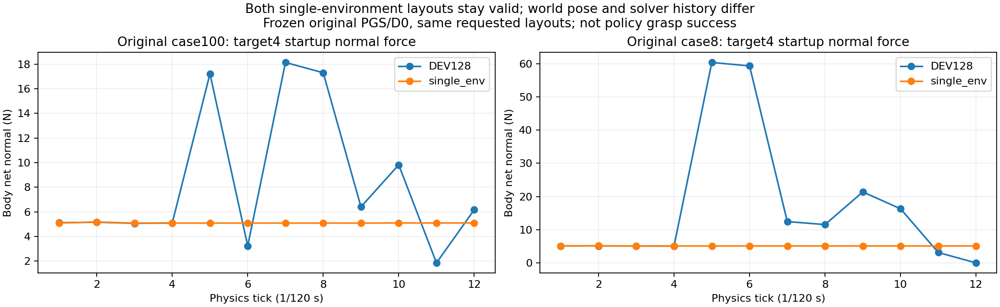

초기 실제 deck02 fixed Base frame에서 모든 active 박스의Body/네flap link pose를
비교했다. Env100의 최대 위치 오차2.42µm/회전1.24e-7rad, env8 전체의 최대 위치
오차4.31µm/회전5.49e-8rad였고 joint position과 초기 link velocity 차이는0이었다.
최종 guard의 rack pose는 failed layout의 부분 respawn 이후 상태여서 초기 frame으로
쓰면 안 된다. 비교는 `support_roots_before_neutral_hold`의 실제 초기 Base pose를 쓴다.

같은 요청 layout과 거의 같은 지지대 상대 초기 박스 상태가 작은 배치에서는 안정한
것은 새 단서다. World origin·rack의 world pose·constructor solver history는 다르므로
GPU 배치 solver 오류를 확정하지 않는다. 다음에는 world 배치와 reset history를 따로
맞춘 비교로 분리한다. Randomization을 줄이거나 성공/안전 기준을 완화한 학습 결과가
아니며 기존 SAC 다섯 실행과 독립 FINAL은 보존한다.

### 14:16 · 원래 world frame 비교와 같은 좌표 대조 추가

Frozen DEV/steps1 전용 `--reset-world-frame-probe /absolute/path/frame.json`를 추가했다.
요청 layout seed와 환경 row를 엄격히 맞추고 원래 env origin·rack pose·세 fixed support
Base pose를 적용한다. Conveyor의 일곱 rigid root도 origin 차이만큼 옮기며 모든 inactive
박스는 새 origin에 원래대로 parking한다. Active 박스·robot은 변경하지 않은 neutral
layout에서 다음 reset helper가 복원한다. 원래 active box를 제거하지 않는다.

세 지지대의 현재 joint position/velocity는 유지하고 실제 root 위치·회전 읽기값과
DOF 상태 보존을 확인한다. Root teleport 뒤 support FK refresh가 추가되므로, 새 좌표로
옮기는 비교 외에 같은 원래 단일 환경 좌표를 다시 쓰는 sham 대조도 실행한다.
이로써 root setter/FK 호출의 효과를 좌표 배치와 혼동하지 않는다. Constructor와 contact
solver history를 원래 DEV128과 같게 만든 것은 아니며, 그 한계는 각 manifest에 남긴다.

TRAIN/독립FINAL·다른 물리 probe·여러 wave와 혼합하면 시작 전에 거부한다. 일반학습의
물리·관측·보상·randomization·성공·안전은 변경하지 않는다. 진단은 Q import 불가다.
입력 origin3/단위 quaternion pose7/세 support/seed 정합성·frozen 제한·mutation 전
거부·passive DOF 보존·같은 좌표 대조를 포함한 관련109개 CPU 검사가 통과했다.
추후 초기 frame을 최종 guard와 혼동하지 않도록 모든 실제 root state도 첫 neutral
physics tick 전에 읽어 기록한다.

GPU3 arm-bias 실행의 완료 DEV15는3/128(ML2/MR1/UL0/UR0)으로 DEV12의6/128보다
낮았다. 현재 SAC 일반화의 개선은 아직 입증하지 못했으며 초기화 진단과 구분한다.

### 14:29 · 원래 world 좌표에서도 단일 환경은 안정, 상단 roller 상태는 다름

[네 실행의 닫힌 world-frame 비교](assets/rl_v2_original_world_frame_comparison_20261005.json)는
모두 exit0·writer 종료·MainPID0·최종 Drive 검증을 마쳤다. 원래 world 위치·방향을
맞춘 env100/8과 각각 같은 좌표를 다시 쓰는 대조 모두 초기 유효1/1·최초 failure0이었다.
원래 좌표 비교의 모든 active 박스 Body/네flap world 위치 오차는최대0.36µm,
회전은최대1.05e-7rad였다. 첫12개 tick Body normal은약5.1N으로 유지됐다.

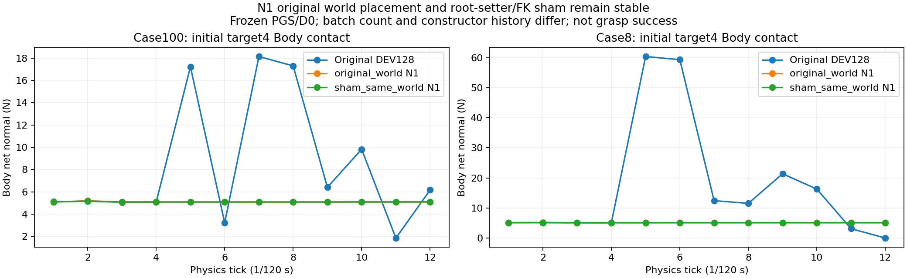

하단·중간 deck의 초기 joint position/velocity는원래DEV128과 같았으나 상단deck은
최대 약6.28rad/18.5rad/s 차이가 있었다. 이는 constructor에서 물리적으로 남은
passive 상태의 차이이며 전체 solver 초기 이력까지 맞췄다고 주장하지 않는다.
좌표 배치만으로 최초 충격을 설명하기는 어렵지만 배치 solver 오류로 확정하지 않는다.

다음은 원래DEV128/289개 박스를 유지한 지지대 갱신 대조다. Frame JSON의
`probe_type: current_world_frame`은 sample에 layout seed만 받으며 실제 현재origin·
rack·support pose를 읽어 같은 값을 다시 쓴다. 입력 pose override는거부한다.
현재 passive joint position/velocity도 그대로 유지하고 support FK를 갱신한다.
갱신 전후 실제 backend `get_link_transforms()`의 roller center 이동도 기록해
root pose와 child link가 일관되지 않았는지 확인한다. 아직 기본학습 reset에는
적용하지 않으며 TRAIN/Q/독립FINAL에는사용하지않는다. 관련111개검사통과.

### 14:48 · 원래 DEV128 지지대 갱신 대조는 최초 충격을 해소하지 못함

[닫힌 128환경 비교](assets/rl_v2_current_world_support_FK128_20261005.json)는 exit0·
writer 종료·MainPID0·최종 Drive 검증을 마쳤다. 원래 요청128개 환경·289개 박스를
유지하고 실제 root placement와 현재 passive q/v는 바꾸지 않았다. 지지대 갱신
전후 실제 backend roller center 이동은 최대3.82µm였다. 같은 ML10개 최초 실패가
남았고 UL의 env34를 포함해 최초 selected failure11개, 초기 유효97/128이었다.
원래 닫힌 view 감사의99/128보다 개선되지 않았다. Actor/Q update는0이다.

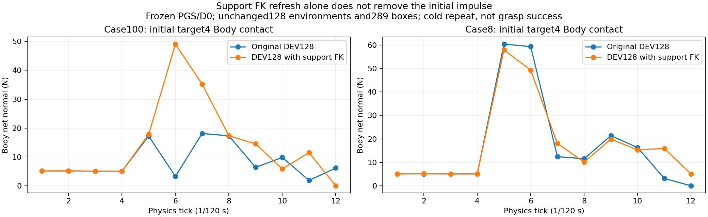

Cold repeat이므로 constructor/contact solver history가 앞선 실행과 bitwise로
동일하지는 않다. 측정한 큰 child translation 오류를 원인으로 확정하거나 기본
학습 reset에 이 갱신을 추가할 근거는 없다. 성공·안전·randomization은 유지한다.

다음 frozen 단일 환경 비교에는 `probe_type: original_world_frame_and_passive_state`를
추가했다. 원래 world frame과 세 지지대의 측정된 joint 이름·q/v를 함께 맞춘다.
182개 실제 joint의 이름/순서/폭·유한값을 쓰기 전에 검증하고, physics step 없이
적용 후 실제 읽기값이 요청 상태와 정확히 같은지 확인한다. 현재 상태를 보존했다는
표시는 요청 q/v로 바뀐 경우 false이며, 상태 변화량을 별도로 기록한다. 이 모드는
명시적인 frozen DEV/steps1 진단에서만 허용하고 TRAIN/Q/독립FINAL에서는 거부한다.
일반 학습의 제어·보상·물리·reset 기본값은 변경하지 않는다. 실제 backend DOF 읽기값도
검증하며 TRAIN/FINAL 거부·미적용 상태 거부를 포함한 관련120개 검사 통과.

14:40 기준 GPU3 retention의 완료 DEV21은8/128(기준4/128)으로 늘었으나, 다른 네
실행과 네 영역 전체의 일관된 일반화 개선은 아직 입증하지 못했다. SAC 다섯 writer와
Drive 업로드는 계속 실행 중이며 목표는 active다.

### 14:58 · World frame과 전체 passive q/v를 맞춰도 단일 환경은 안정

[전체 관절 상태를 맞춘 두 닫힌 비교](assets/rl_v2_matched_passive_world_comparison_20261005.json)는
exit0·writer 종료·MainPID0·최종 Drive 검증을 완료했다. Env100의 원래 target4와
env8의 원래4/5/9를 모두 유지했고, 두 사례 모두 초기 유효1/1·최초 selected failure0이다.
세 support마다182개 joint의 실제 초기 q/v 차이는 모두0이었다. 모든 active 박스
Body/네flap의 world 위치 오차는 최대0.36µm이고 첫12개 tick Body normal은약5.1N이다.
Actor/Q update0이며 학습 파지 성공 결과가 아니다.

앞선 단일 환경 비교에서 남았던 상단 roller q/v 차이를 없애도 초기 충격은 없다.
따라서 측정된 초기 좌표·passive 관절 상태 차이만으로 원래 DEV128의 최초 충격을
설명할 수 없다. 환경 수와 constructor/contact solver 이력은 여전히 다르므로
GPU 배치 solver 오류라고 확정하지 않는다.

다음 frozen DEV 비교는 원래 row에서2개와16개 환경을 선택해 실제 world frame·
전체 passive q/v를 동일하게 맞춘다. 2개는원래env8/100,16개는같은 ML10개 실패와
유효한 ML6개 대조를 포함한다. 각 선택 layout의 모든 원래 active 박스를 유지하지만
나머지 원래 환경은 제외하는 비교이며 원래289개 전체 배치를 유지했다고 쓰지 않는다.
같은 PGS/D0·steps1·actor/Q0·TRAIN/Q import 불가·독립FINAL 제외이며, 기본 학습
환경 수·randomization·안전·성공 조건은 바꾸지 않는다.

### 15:10 · 작은 배치에서도 실패 사례가 바뀜: 같은16개 row 순서 대조

[닫힌 2/16 환경 비교](assets/rl_v2_matched_world_state_subbatches_20261005.json)는 둘 다
exit0·writer 종료·MainPID0·최종 Drive 검증을 완료했다. 선택 layout의 원래 박스
전부와 세 support 전체 q/v를 유지했고, 실제 joint 상태 차이는모두0이었다.
모든 active 박스 Body/네flap의 world pose 차이도 비교 파일에 기록했다.

2개 환경/4개 박스는 초기 유효2/2·최초 selected failure0이다. 16개 환경/43개
박스는초기 유효12/16이었다. 실패한 원래 사례는env8/20/32/100으로 바뀌었다.
Env8/32는최초0.0667s에실패했고20/100은2.033s에실패했으므로 모두 같은
초기 impulse 실패로 묶지 않는다. 원래env32는DEV128에서유효했으나 이번에는
tick5 Body normal이약68.9N이었다. 반대로 원래 ML10개 중 다수는이번에유효했다.

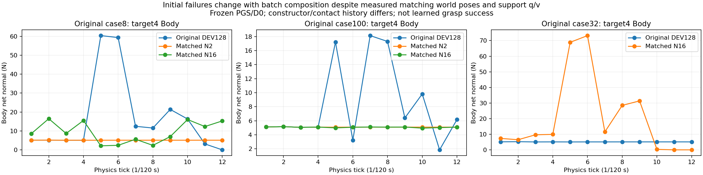

측정한 초기 상태가 맞는 상황에서도 배치 구성에 따라 최초 실패 사례가 달라진다.
환경 수뿐 아니라 constructor/contact solver 이력·row 배치도 분리해야 한다.
다음은같은16개 layout과43개 박스·각layout의world frame·전체support q/v를
유지한 채 요청row의 순서만 뒤집는 frozen 대조다. 생성/접촉 이력을 bitwise로
맞춘 것은아니며 engine 오류로 확정하지 않는다. 일반 학습 설정과 독립FINAL을
바꾸지 않고 기존 SAC 다섯 실행은 유지한다.
