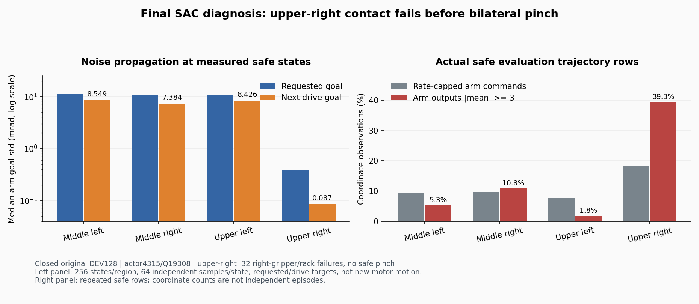

# 최종 평가 동작의 파지 실패와 탐색 진단

종료된 주 학습의 마지막 **원래 DEV128개 전부**를 actor4315/Q19308과
대조했다. 성공은18/128(중간 좌12·우4, 상단 좌2·우0)이었다.
상단 오른쪽32건은 모두 **오른손 그리퍼 몸체 `r_twofinger_base`와 랙의 충돌**로 끝났다.
충돌 전 안전한 기록에서는 이 구역의 왼손·오른손 실제 qualified pinch가 모두0회였다.
잡은 박스를 놓친 실패보다 양손 접촉에 도달하기 전의 진입·자세 문제가 먼저 남아 있다.

## 실제 손의 접근과 명령

상단 오른쪽에서 충돌 전 왼손이 nominal jaw gate 안에 들어온 기록은4행,
닫기 명령은0행이었다. 오른손은386행에서 gate 안에 있었고200행에서 닫기를
명령했지만 실제 pinch는0행이었다. 이는 중복된 시간 관측 수이며 성공률이나
독립 시도 수가 아니다. 실제 pad 힘·영역·반대 접촉 판정을 기록한 pinch를 사용한다.

각32경로에서 충돌 전 가장 가까웠을 때의 왼손 rigid TCP–실제 panel 표면 거리
중앙값은12.69cm였고 오른손은6.31cm였다. Rigid TCP와 nominal closed axis는
기구학 진단이다. 움직이는 pad 자체의 위치·접촉이나 새로운 성공 조건이 아니다.
거리만 줄이는 것과 실제 양손 파지의 차이를 유지한다.

## 잡음이 제어 목표까지 전달되는 정도

각구역32경로의 안전한 상태를 경로당8개씩 고르게 선택해256상태를 분석했다.
각 상태에서 동일한 정책의 Gaussian 잡음을64번 뽑아 실제 decoder에 통과시켰다.
이 계산에는 물리 재실행이나 새로운 성공·실패 결과가 없다. 시간 상관 탐색
경로가 아닌 한 상태의 분포이며 실제 관절 속도·모터 움직임을 측정한 값도 아니다.

| 구역 | 요청 팔 목표 표준편차 중앙값 | 다음 drive 목표 표준편차 중앙값 |
| --- | ---: | ---: |
| 중간 왼쪽 | 0.011264rad | 0.008549rad |
| 중간 오른쪽 | 0.010546rad | 0.007384rad |
| 상단 왼쪽 | 0.010940rad | 0.008426rad |
| 상단 오른쪽 | 0.000389rad | 0.000087rad |

상단 오른쪽은 다른 구역보다 탐색 폭이 크게 작다. 실제 안전한 경로의 팔 출력
좌표 중 pre-tanh 평균 절댓값3 이상은39.35%였고 마지막60개의 안전한 기록에서는
54.08%였다. 이 raw 출력 집계는 가용 반경0 좌표까지 포함하며 actor 보조 손실의
active mask와 같은 집계로 간주하지 않는다. 별도의64회 분포 계산은 가용 반경이
있는 팔 좌표만 비교했다.

요청 목표가 변해도 한 스텝의 drive 목표가 같은 좌표는상단 오른쪽에서
728/3,322개(21.9%)였다. 실제 안전한 경로의 팔 명령18.15%는속도 제한에서
clamp됐다. 일부 변화가 제한에서 없어지지만, 정책 포화로 요청 목표부터 변화가
작은 현상도 함께 있다. 전체 원인을 속도 제한 하나로 설명하지 않는다.

## Q와 기록의 대응

같은 최종 critic의 상단 오른쪽 마지막 Q 평균은−5.794, 실제 마지막 보상 평균은
−5.973이었다. 초기 파지 구간의 Q 평균−0.462와 해당 기록 경로의 할인 누적 보상
평균−3.447에는 차이가 있었다. 위험 감점이 연결됐으며 마지막 충돌에 대한
음의 값도 학습했다. Q는 확률적 정책의 기대값이고 기록은한 greedy 경로여서
두 차이만으로 일반적인 Q 보정 성능이나 감점 누락을 판정하지 않는다.

최종 모델과 정규화 tensor를 그대로 복원했다. CPU FP32 계산을 실제 수집 명령과
대조한 최대 drive 관절 목표 차이는5.37e−6rad, torso 차이는2.39e−7m였고
그리퍼 명령은 모두 같았다. 원래 Q 영상 exporter의 검사는 변경하지 않았다.
이 별도 진단은 실제 단위의 허용치(관절1e−5rad, torso·base 위치1e−6m,
base yaw1e−6rad, jaw 일치)를 명시한다. 종료된 HDF 크기·수정 시간과 보호한
checkpoint SHA256은 분석 전후 같았다.

## 다음 변경을 판단하는 기준

현재 GPU3의 팔 탐색 단독 비교와 출력 포화 완화 비교를 먼저 전체128개
개발 평가로 확인한다. 포화 완화 손실이 양수인 것만으로 파지 개선을 선언하지 않는다.
기존 종료 TRAIN 기록에서는 현재 관절 목표 범위가 실제 flap의 위치·닫힘 방향을
다루는 데 충분한지도 별도로 진단했다. 후속 [초기 동작 기준·반경0.30 제어](RL_V2_REANCHORED_BODY_CONTROLLER_20261007.md)를
구현하고 TRAIN538개 초기 목표·jaw·decode 명령 보존을 확인한 뒤 별도 GPU3 실행을 시작했다.
초기 동작 보존은 새 파지 성공을 의미하지 않으며 기존 비교도 유지한다.
[종료 TRAIN의 기구학 비교](RL_V2_LOCAL_GOAL_RANGE_DIAGNOSIS_20261007.md)에서는
후반 안전6상태에서 현재 반경의 양손 위치·축 충족 해를 찾지 못했고,
학습된 초기 동작을 기준으로 넓힌 가상 범위에서는4상태에 해를 찾았다.
정적 모델의 국소 진단이며 실제 파지 성공이나 전역적 도달 가능성 증명이 아니다.

요청한 absolute goal을 action으로 쓰는 replay는 decoder가 포함된 유효한 MDP다.
이번 계산을 근거로 기존 replay를 잘못됐다고 하거나 goal을 다시 표시하지 않는다.
평가 전이를 Q replay·성공 bank·optimizer에 넣지 않았고 독립 FINAL도 사용하지 않았다.
박스·base·배경·firm dynamic flap 무작위화와 성공·안전 조건은 유지한다.

[전체128경로·Q·decoder 근거](assets/rl_v2_final_DEV16_physical_exploration_20261007.json),
[출력 포화 완화 비교](RL_V2_BODY_SATURATION_RECOVERY_20261006.md),
[중간 보고와 기존 평가 영상](RL_V2_GRASP_INTERIM_SUMMARY_20261006.md).
