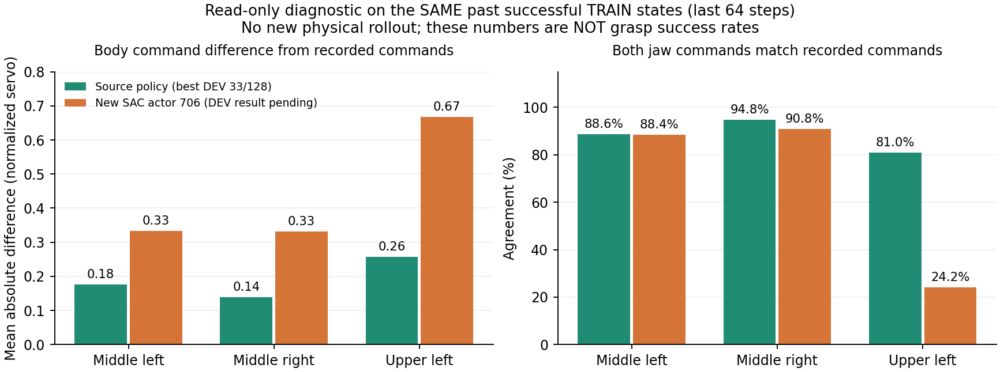

# 실제 정책 동작을 더 수집하는 SAC 비교

최고 개발 성능33/128의 정책도 마지막에는21/128로 내려갔다. 남은 시간
관측을 추가한 별도 비교의 첫 학습 후 평가는11→1/128이었다. 현재의 성공
동작을 유지하면서 더 넓은 배치에서 학습하는 문제가 여전히 남아 있다.

## 제어기 진단에서 확인한 것

보호한 최고33건 모델의 완료된 자기 TRAIN 성공 경로만 읽었다. 실제 goal→servo
변환의 autograd와 독립적으로 계산한 미분을 대조했다. 실행 중인 replay/HDF를
읽거나 모델·optimizer를 갱신하지 않았다.

| 구역 | 첫16동작에서 속도 제한으로 미분이0인 비율 | 마지막64동작의 비율 |
| --- | --- | --- |
| 중간 오른쪽 | 12.4% | 3.3% |
| 중간 왼쪽 | 10.7% | 2.6% |
| 상단 왼쪽 | 23.5% | 3.7% |

사용 가능한19개 몸체 좌표 중 모든 미분이 막힌 관측은 없었다. 기존 작은
Gaussian으로 계산한 마지막 구간의 명령 변화 중앙값도 최대 제어 명령의
약2.8~4.7%였다. 이 표본에서는 속도 제한이 대부분의 Q 학습 신호를 막는다는
가설을 뒷받침하지 않는다. 성공 경로만 진단했으므로 실패 상태나 성공 표본이
없는 상단 오른쪽까지 이 결과를 일반화하지 않는다. 실제20% 팔 bias나
그리퍼 탐색 전체를 측정한 결과도 아니다.
[보호 모델·실제 미분·탐색 계산](assets/rl_v2_best33_actual_servo_gradient_audit_20261007.json).

이후 새 TRAIN384조건 뒤의 동일 평가 모델actor706/Q4870도 이 과거 상태에
입력했다. 마지막 구간의 명령 차이는 중간 좌0.176→0.333, 우0.140→0.331,
상단 좌0.257→0.668이었다. 상단 왼쪽의 기록된 양손 닫힘217상태 중 새 정책이
양손을 닫는 경우는34개였다. 과거 동작으로부터의 변화이며, 새 물리 실패율을
뜻하지 않는다. 이 구역의 미분이0인 좌표 비율도3.7→43.9%로 늘었다.
성공 명령을 유지하지 못하는 문제와 수집된 성공 경로의 구역 불균형을 함께
점검할 근거다. 이후 실제 첫 전체 DEV에서도 **27→8/128**로 줄었다.
중간 좌6·우2건만 성공했고 랙 충돌79·낙하2건이 있었다. 공통 유효116조건은
27→7건이다. 과거 상태의 진단과 새 실제 평가를 구분해 기록한다.
[첫 학습 후 전체 평가](assets/rl_v2_episode_return33_first_full_DEV_20261007.json).
[같은 과거 상태의 정책 변화](assets/rl_v2_episode_return33_actor706_same_TRAIN_diagnostic_20261007.json).

## 수집 방식만 바꾸는 비교

최고33건에서 시작한 현재 누적 보상 SAC와 동일한 초기 모델을 사용한다.
현재 정책을 실제로 수행한 경로를 더 많이 학습에 넣도록 기존 선택형 수집
옵션 `arm20-explore-rest-greedy`를 이 초기화에도 연결했다.

| 항목 | 기존 누적 보상 실행 | 추가 비교 |
| --- | --- | --- |
| 시작 actor·Gaussian·Q·optimizer | 최고33건의 동작, 새 Q·빈 학습 은행 | 정확히 같은 초기 텐서 |
| 80%의 TRAIN 에피소드 | 기존 stochastic 정책 | 현재 actor의 greedy 몸체·그리퍼 동작 |
| 나머지20% | 기존 팔 bias·Gaussian·jaw 탐색 | 그대로 유지 |
| actor·target-Q의 확률 정책 | 기존 SAC | 그대로 유지 |
| 보상·실제 누적 보상 보조 학습 | 성공+8, return64표본·가중치0.1·bootstrap0 | 그대로 유지 |
| critic·제어·환경 | 잔여 시간578차원·실제 servo Q·기존 제어기 | 그대로 유지 |

Greedy 수집은 현재 SAC actor가 실제로 실행한 TRAIN이다. 데모·teacher·DEV
경로를 replay에 넣는 방식이 아니다. 이전 성공+64/절대 목표 Q의 탐색80%
비교와 출발 모델·보상·Q 계약이 달라 그 결과를 이 실험의 결과로 표시하지 않는다.

원래 TRAIN1,536개와 DEV128개 요청 목록을 정확히 재사용해 수집 방식의 비교를
돕는다. 다른 실행의 전이를 복사하지 않으며 물리 reset과 flap 추첨이 동일하다고
가정하지 않는다. 독립 FINAL은 사용하지 않는다. 박스·base·배경·단단한 동적
flap의 범위, 양손 실제 pad5N·0.25초·8mm 들기, 랙10N·장애물5N·자기 충돌OFF,
base 접근 제어는 유지한다. 박스 고정이나 curriculum은 추가하지 않았다.

관련34개 검사를 통과했다. 실제 trainer를 CPU에서 복원해 최고 모델의 자기
TRAIN1,165관측에서 몸체·gripper·Gaussian의 정확한 보존과 새 Q·4개 optimizer·
모든 학습 은행0을 확인했다. 수집 경로 검사에서는64개 실제 과거 관측 중
47개가 현재 greedy 동작과 정확히 같았고, 선택된17개에만 기존 탐색을 적용했다.
이 검사는 실제 새 파지 평가나 성능 향상을 의미하지 않는다.
[실제 복원·수집·동일 요청 목록](assets/rl_v2_return33_greedy80_fulltrainer_preparation_20261007.json).

기존 누적 보상 실행은 GPU3에서 유지한다. 추가 비교는 고유한 실행 폴더와
`CUDA_VISIBLE_DEVICES=3`을 사용한다. 기존 Drive 연결로 초기 체크포인트·계약만
검증하고, 학습 중 체크포인트·계약·닫힌 최종 로그를300초 주기로 검증한다.
최신2개를 유지하며 검증된 오래된 체크포인트만 정리한다. Raw replay/HDF는
RAM 실행 폴더에 보존하며 업로드·자동 삭제 대상으로 표시하지 않는다.
실제 실행·최초 평가·학습 개선 여부는 별도 증거로 기록한다.

**10/07 18:40 KST에 추가 비교를 실제로 시작했다.** 소스`88dd4fc`,
실행`batch_sac_20261007_184054_ef7f21`, writer3180891의 소유자·명령·CUDA3와
관리자의 체크포인트·계약·로그 전용 범위를 확인했다. 초기 입력7개의 기존
Drive 크기·MD5 검증도 마쳤다. 기존6개 writer는 유지했다.
이후 실제 첫 초기 DEV에 진입해 agent·progress와 검증한 초기 입력의 계약
일치, actor/Q·온라인·성공·return 은행0을 확인했다. 초기 모델은 시작 전 실제
CPU trainer에서 확인했고, 실행의 체크포인트0 직접 비교는 첫 평가 뒤 파일이
저장된 후로 구분했다. **19:18 KST 이후 초기 전체 평가는27/128(중간 좌16·우11,
상단 양쪽0)**로 확인했다. 초기 유효117·무효11건을 원래128개 분모에 포함했다.
첫 평가 뒤 저장된 actor/Q0 체크포인트의 모든 모델·정규화 tensor가 시작 입력과
정확히 같고 유한함을 확인한 뒤 별도 읽기 전용 사본을 보존했다. 현재 동작 수집
옵션은 아직 TRAIN에 진입하기 전이므로 이 결과는 학습 전 기준이며 개선이 아니다.
평가 모델 관찰자는 첫 학습DEV4를 보호하며 학습 후 전체 평가는 확인 전이다.
[전체 초기 평가·같은 모델](assets/rl_v2_return33_greedy80_full_initial_DEV_20261007.json).
[실제 실행](assets/rl_v2_return33_greedy80_actual_launch_20261007.json),
[실제 첫 평가·모델·학습 은행](assets/rl_v2_return33_greedy80_first_actual_DEV_20261007.json).

관련 코드: [초기 수집 방식 변경](../scripts/rl/prepare_greedy_collection_actor.py),
[읽기 전용 제어기 진단](../scripts/rl/audit_servo_actor_gradients.py),
[학습 데이터 오염 거부 검사](../tests/test_rl_pristine_greedy_collection.py).

첫 전체 학습DEV4는 **27→21/128(중간 좌9·우12, 상단 양쪽0)**이었다. 랙64·낙하2·
과도한 들기3·시간 초과37·초기 무효1건이다. 공통 유효116조건에서도27→19건으로
줄었다. 같은 actor705/Q4868 모델로 묶은 [전체 평가](assets/rl_v2_return33_greedy80_first_full_DEV_20261007.json)를
확인했으며 자기 초기 성능을 넘지 못했다. 별도의 [과거 성공 TRAIN actor 기억 연결](RL_V2_ACTOR_TRAIN_MEMORY_20261007.md)도
준비했고 기존 Q·보상 전이는 가져오지 않는다.
