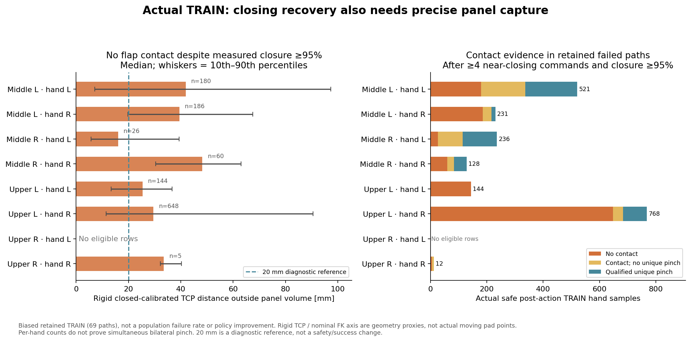
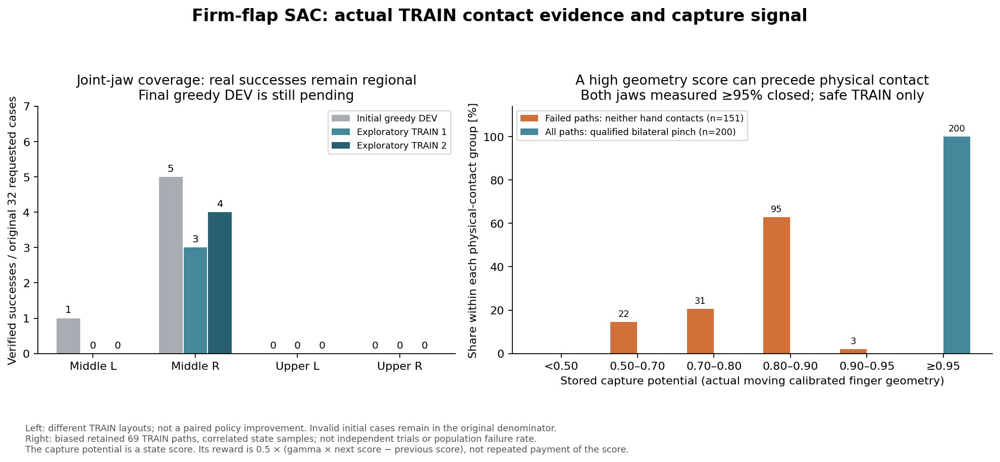

# 실제 TRAIN: 닫힘 복구와 정밀 포착을 구분하기

단단한 동적 flap·원래 randomization·양손 파지/8mm proof lift 조건을 유지한 SAC 비교를 진행한다. 새 near-jaw soft 손실 실행이 초기 DEV를 수행하는 동안, **이미 보관·Drive 검증된 실제 TRAIN 69경로**에서 그리퍼를 닫은 뒤에도 접촉하지 않는 원인을 CPU로 분석했다. 실행 중인 정책·replay·HDF는 읽거나 수정하지 않았다.

실패 경로에서 다음 조건을 모두 만족한 접촉 없는 손 표본은 **1,249개**였다: 실제 command가 near gate에서 네 번 이상 연속 닫힘, post-action 실제 closure ≥95%, pre/post 안전, 유효한 실제 flap 관측. 그중 **898개(71.9%)**에서 nominal CLOSED calibrated TCP가 flap 직육면체 영역 밖으로2cm 넘게 벗어났다. 실제 unique pinch가 확인된 같은 조건의 표본에는2cm 초과가0개였다. 분석 표본은 보관한 성공/실패 TRAIN의 일부이며 전체 실패율이나 독립적인1,249회 시도가 아니다.



| 접촉 없는 실패 표본 | 표본 수 | rigid TCP의 panel 영역 바깥 거리 중앙값 |
| --- | ---: | ---: |
| 중간 왼쪽 · 왼손 | 180 | 41.9mm |
| 중간 왼쪽 · 오른손 | 186 | 39.5mm |
| 중간 오른쪽 · 왼손 | 26 | 16.1mm |
| 중간 오른쪽 · 오른손 | 60 | 48.2mm |
| 위 왼쪽 · 왼손 | 144 | 25.4mm |
| 위 왼쪽 · 오른손 | 648 | 29.6mm |
| 위 오른쪽 · 왼손 | 0 | 조건을 만족한 닫힘 표본 없음 |
| 위 오른쪽 · 오른손 | 5 | 33.5mm; 작은 표본 |

## 측정한 것과 해석

Actor에 기록된 실제 panel midpoint·rotation6D를 역변환하여 closed-calibrated rigid TCP의 panel-local 좌표를 복원했다. 알려진 panel half extents로 normal 방향과 두 tangent 방향의 영역 초과 거리를 분리했다. Perceived opposing-flap assignment를 재계산하여 저장된 assignment와 일치하는지 확인했다. 접촉·unique pinch는 실제 post-action critic의 각 pad 힘·region·opposed flag로 별도로 검증했다. 회전의 정규직교성과 source signature 유지도 검사했다.

같은 접촉 없는1,249개 중 normal 초과2cm는670개, tangent 초과2cm는340개다. 두 조건은 겹칠 수 있으므로 합산해 전체 원인 비율로 해석하지 않는다. 특히 위 왼쪽 왼손은 tangent/높이 오차, 오른손은 normal 오차가 남는 구간이 있다. 위 오른쪽 왼손은 조건을 만족한 닫힘 표본 자체가 없어 이 분석만으로 닫힘 이후 기하를 판단할 수 없다.

Rigid TCP는 nominal closed midpoint에 고정된 기준 프레임이다. 실제 움직이는 pad 점이나 접촉점을 뜻하지 않는다. Closing-axis 정렬도 현재 S63/Leju의 nominal closed FK 축을 사용한 진단이다. 그림의2cm와 분석의20°는 진단용 기준이며 **성공/termination 조건으로 추가하지 않았다**. 20°를 벗어나도 실제 qualified pinch가 있는 표본이 있으므로 이를 새 hard gate로 사용하지 않는다. 이 분석은 위치 오차를 보여주며 물리적으로 도달 가능한지 또는 불가능한지를 증명하지 않는다.

## 다음 학습 판단

새 [그리퍼 확률 복구 비교](RL_V2_JAW_POLICY_RECOVERY_20261006.md)를 유지한다. 실제 TRAIN에서 닫힘 확률·양손 닫힘 명령·패드 접촉을 확인하고, 초기 대비 학습 후 전체128개 greedy DEV로 효과를 판단한다. 닫힘 표본이 늘어도 접촉·전체 성공이 늘지 않으면 **양손 중 약한 손의 정밀 포착 신호와 normal/tangent 위치 오차**를 다음 변경 대상으로 삼는다. 기존 넓은10cm capture falloff와 양손 평균이 정밀 포착을 충분히 구분하는지도 함께 확인한다.

Reward를 실제로 바꾸는 비교는 새 reward identity와 matching TRAIN/Q를 사용해야 한다. 기존 Q나 old reward replay를 변경된 reward에 섞지 않는다. 이번 분석에서는 reward·행동·안전·success threshold·randomization을 변경하거나 replay를 재라벨링하지 않았다. 독립 FINAL은 아직 사용하지 않았으며 일반화된 양손 성공 목표는 진행 중이다.

## 재현

[audit_closed_jaw_capture.py](../scripts/rl/audit_closed_jaw_capture.py)는 Isaac/물리 rollout 없이 CPU에서 처리한다. 현재 actual-flap 518D actor/577D critic·S63 관측 계약을 검사한다. 기존 immutable input-directory의 Drive size/MD5 receipt가 필요하다. 재개 중인 writer의 experience 파일은 사용하지 않는다.

```bash
CUDA_VISIBLE_DEVICES='' PYTHONPATH=src:scripts/rl python scripts/rl/audit_closed_jaw_capture.py \
  --experience /absolute/path/to/immutable-input/staged_goal_experience.pt \
  --verified-receipt /absolute/path/to/input-directory-verification.json \
  --output-json /absolute/path/to/capture-audit.json
```

도구를 실제69경로 입력으로 실행해 최초 분석의 groups·paths·nominal axes와 정확히 일치함을 확인했고 compile도 통과했다. 학습 optimizer update와 새 물리 rollout은0회다. [전체 수치와 경로별 결과](assets/rl_v2_actual_TRAIN_closed_jaw_panel_geometry_20261006.json).

## 실제 움직이는 손가락으로 계산된 capture 점수도 확인

같은 immutable69경로의 post-action critic에 저장된 production potential을 별도로 검사했다. 앞선 rigid TCP proxy와 달리 이 값은 실제 움직이는 calibrated fingertips와 실제 PhysX flap pose로 계산된다. 힘·region·opposed로 다시 계산한 unique pinch 및 opposing bilateral flag가 저장된 critic flag와 일치한다. Source signature는 유지됐고 새 rollout·optimizer update·reward relabeling은0회다.



양손 모두 production near gate에서4번 이상 연속 닫힘 명령을 받았고 실제 closure≥95%인 안전한 실패 경로의 **두 손 모두 접촉 없는 상태151개**를 찾았다. 그중 **98개(64.9%)**는 capture potential≥0.8이다. 위 왼쪽 표본103개 중94개가 이 조건이며, capture 중앙값은0.847이다. 같은 조건의 actual opposing bilateral unique pinch 상태200개는 모두 capture≥0.95였다. 보관한69경로의 상관된 시간 표본이며 전체 실패율·독립적인151번 시도·전체 지역 성능을 뜻하지 않는다. 위 오른쪽에는 양손이 이 닫힘 조건을 만족한 실패/접촉 표본 자체가 없어 여기서 정밀 포착 문제를 평가할 수 없다.

Capture는 `mean_hands(exp(-actual_capture_error / 0.10m))`라는 **상태 점수**다. 실제 capture 보상은 `0.5 * (gamma * next_potential - previous_potential)`이므로 점수0.8을 매 step 받는다는 뜻이 아니다.0.8/0.95도 진단용 구간이며 새 success·termination 조건이 아니다. 이 데이터는 넓은 falloff와 양손 평균이 접촉 이전의 오차를 어느 정도 구분하는지 보여준다. 실제 개별 손 capture error는 이 저장 포맷에 없으므로 평균 점수에서 두 손의 error를 역추정하거나 새 보상으로 replay를 재라벨링하지 않았다.

현재 jaw 확률 복구 비교의 실제 TRAIN·전체 DEV를 먼저 판단한다. 닫힘 회복 후에도 접촉이 늘지 않으면 실제 움직이는 fingertips 기준의 더 좁은 capture falloff와 약한 손 점수를 새 matching-reward 비교 후보로 삼는다. 이번 점검은 실행 중 reward·정책·안전 기준을 변경하지 않았다. [전체 저장 점수·경로별 결과](assets/rl_v2_actual_TRAIN_stored_capture_contact_specificity_20261006.json).
