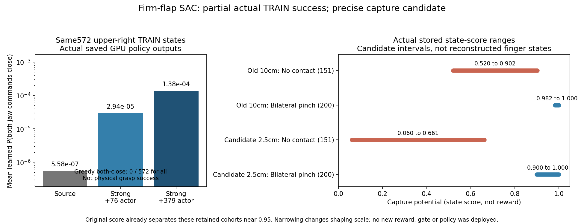

# 실제 strong TRAIN 결과와 정밀 capture 후보 (2026-10-06)

단단한 동적 flap과 원래 박스/base/배경 randomization을 유지한다.
GPU3의 strong·성공 jaw balance·30% 장기 학습은 계속 진행한다.
**새 precision 보상은 아직 적용하지 않았다.** 현재 목표는 네 구역의
randomization을 유지한 실제 양손 파지이며, 학습 중 일부 성공으로 완료하지 않는다.

## Strong의 첫 실제 TRAIN

| 구역 | 요청 | 성공 | 초기 무효 | unsafe | timeout |
|---|---:|---:|---:|---:|---:|
| 중간 왼쪽 |32|0|18|14|0|
| 중간 오른쪽 |32|5|5|22|0|
| 위 왼쪽 |32|1|5|3|23|
| 위 오른쪽 |32|0|12|19|1|

총6/128건은 실제 양손 unique pinch·stable·서로 다른 flap·hold0.2667s·
보정한 roller clearance22.1–37.0mm를 만족했다. 초기 무효40건도 요청128개
분모에 유지한다. 안전 종료58건 중 robot–rack 원인은48건이다(원인은 중복 가능).
학습 후 greedy DEV가 아니며 같은 control TRAIN seed schedule을 반복한 결과다.
새로운 독립 배치의 일반화 성공이나 초기 DEV10/128 대비 개선으로 해석하지 않는다.
Pad별 raw force는 outcome에 없고 production unique-pinch flag로 조건을 확인했다.

Source 이후 actual actor379/Q1514회, 새 online TRAIN45,975행을 추가한
Q8378 checkpoint를 동일 immutable TRAIN에서 읽기 전용 CPU inference로 비교했다.
위 오른쪽의 안전·양손 near 실패572상태에서 평균 순수 정책 양손 닫힘 확률은
source5.58×10⁻⁷ →첫76actor2.94×10⁻⁵ →379actor1.38×10⁻⁴다.
마지막도 약0.0138%이고 **greedy 양손 닫힘0/572**다. 확률 회복은 실제 파지
성공을 뜻하지 않는다. 모델 복원/유한성/원본 크기·새 MD5를 검사했으며
새 rollout·optimizer update·active HDF/replay 읽기는 없다.



## 좁은 capture 후보의 근거

기존 production capture는 실제 움직이는 calibrated fingers와 PhysX flap을
사용한 `mean(exp(-hand_capture_error/0.10m))`다. Critic에 저장된 값은 두 손의
평균이고, gripper position도 두 driver 각도를 projection·clamp한 scalar다.
**개별 손 오차·각 driver/passive joint·실제 finger pose를 이 평균들로 복원할 수 없다.**
따라서 FK를 가정해 실제 pad라고 주장하거나 old replay를 새 reward로 relabel하지 않는다.

대신 저장된 old mean에서 가능한 후보 score의 **수학적 범위**를 계산했다.
후보는2.5cm exponential과 이미 reach에 쓰는 약한 손 합성이다.
Old per-hand score를 `sL,sR`, 저장 평균을 `m`이라 하면 후보 per-hand score는
`sL^4,sR^4`, 후보 weak score는 `0.25*(sL^4+sR^4)+0.5*min(sL^4,sR^4)`다.
알 수 있는 관계는 `sL+sR=2m`, 각 score가0…1이라는 것뿐이다.

작은 score를`t`, 큰 score를`2m-t`라 두면
`max(2m-1,0)≤t≤m`, 후보는`0.25*(2m-t)^4+0.75*t^4`다.
이는 convex이고 stationary point는`2m/(1+3^(1/3))`다.
가능 구간 안의 stationary point와 끝점에서 tight minimum/maximum을 계산한다.
Stored float32 mean의 roundoff를 고려해±1e−6 margin을 두었다.
이 범위는 저장한 exponential mean 정의에 대한 조건부 계산이며 개별 손 오차의
관측값이나 새 물리 실험이 아니다.

같은 immutable 실제 TRAIN69경로에서 pre/post 안전·유효 actual perception·
양손 near4회 연속 close command·측정 closure scalar≥95%를 만족한 상태를 사용했다.
접촉은 post-action 실제 filtered pad force/region/opposed와 unique pinch flag로 확인했다.

| 보관 상태 구간 | 상태 수 | 기존 실제 capture 범위 | 후보 weak score의 가능한 전체 범위 |
|---|---:|---|---|
| 실패 경로·양손 모두 filtered flap 접촉 없음 |151|0.520–0.902|0.060–0.661|
| 실제 opposing bilateral unique pinch |200|0.982–1.000|0.900–1.000|

기존0.8 진단선 이상인 no-contact98상태도 후보의 가능한 score는 모두0.8 미만이다.
이200 pinch 상태는 후보 가능한 score가 모두0.8 이상이다. **기존 score도0.95
진단선을 쓰면 두 보관 구간을 구분할 수 있다.** 이 후보의 목적은 새로운 접촉
classifier를 만드는 것이 아니라 마지막 수 cm에서 geometric shaping의 크기와
약한 손 반영을 바꾸는 것이다.0.8/0.95는 success/termination gate가 아니다.

No-contact cohort 최대0.902와 pinch 최소0.982의 간격은 약0.081이다.
후보의 worst-case 간격은 약0.239다. 이 데이터에서 state-score 간격을 넓힐
근거이며, gradient가 실제 exploration 경로를 개선하거나 SAC 성공률을 높인다는
증거는 아니다. Potential reward는 별도`0.5*(gamma*next-previous)` 계산이므로
score0.8을 매 step 받는 것도 아니다. 상관된 보관 TRAIN 상태이며 전체 시도율이나
독립151/200회 시도가 아니다. 위 오른쪽에는 이 조건의 양손 닫힘 cohort 자체가 없다.

## 실제 적용 조건

30% 장기 실행과 strong/balance의 전체 post-TRAIN greedy DEV·실제 pad 접촉을
확인한다. 닫힘 수집이 회복돼도 접촉과 전체 DEV가 늘지 않으면 다음 비교는
**선택형2.5cm/weak-hand capture profile**로 한다. 손 접근과 front staging은
유지해10cm 밖의 학습 신호를 잃지 않는다. Hard pose gate·새 성공 조건·curriculum·
box 고정을 넣지 않는다.

Reward를 바꿀 경우 별도 reward identity·새 actual TRAIN/Q/replay를 사용한다.
검증된 actor/body anchor는 transfer할 수 있지만 **old Q·old reward replay·
그의 optimizer를 새 reward의 학습에 이어 붙이지 않는다.** 새 reward로 초기화할
때 frozen actor 입력·waypoint·action 계약도 검증한다.
모든 invalid 요청은 분모에 유지하고 DEV/FINAL은 학습에 넣지 않는다.

## 재현과 검증

[audit_capture_scale_bounds.py](../scripts/rl/audit_capture_scale_bounds.py)는
현재 actual-flap518D/577D 계약·source capture10cm·완료/유효 TRAIN만 검사한다.
현재 writer의 파일 대신 immutable input의 기존 Drive size/MD5 receipt와 새 MD5
검사를 사용한다. 후보 score 범위를 JSON으로 출력하며 reward를 저장하거나 수정하지 않는다.
가능한 per-hand pair grid·stationary point·끝점·거의 같은 scale의 수치 안정성과
잘못된 입력 거부를 확인한 **10개 테스트가 통과**했다.

```bash
CUDA_VISIBLE_DEVICES='' PYTHONPATH=src:scripts/rl python scripts/rl/audit_capture_scale_bounds.py \
  --experience /absolute/path/to/immutable/staged_goal_experience.pt \
  --verified-receipt /absolute/path/to/verified-input-receipt.json \
  --candidate-scale 0.025 --output-json /absolute/path/to/capture-bound-audit.json
```

[전체 후보 범위](assets/rl_v2_capture25mm_weakhand_bounds_actual_TRAIN_CPU_20261006.json),
[Strong 실제 TRAIN1·6건 물리 성공](assets/rl_v2_strong_jaw_recovery_completed_TRAIN1_20261006.json),
[Strong GPU379actor 고정 TRAIN 출력](assets/rl_v2_strong_jaw_recovery_GPU_Q8378_fixed_TRAIN_20261006.json).
