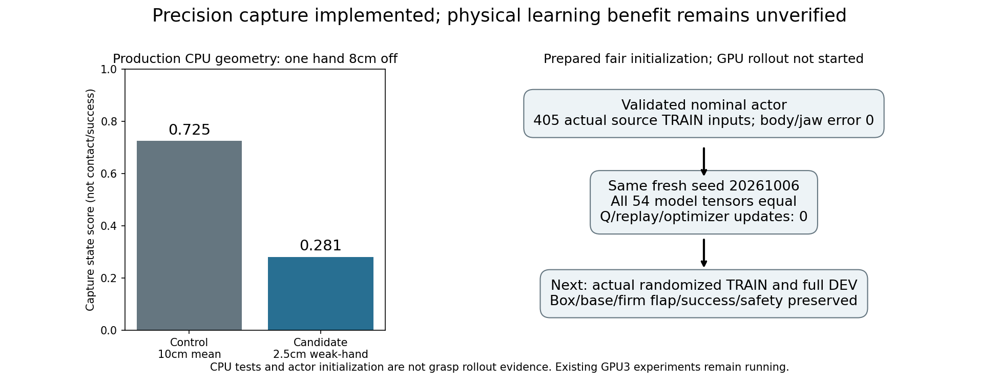

# 선택형 정밀 capture · 새 Q 초기화 (2026-10-06)

단단한 동적 flap·box/base randomization을 유지한 양손 파지가 목표다.
현재 GPU3 strong·성공 jaw balance·30% 장기 SAC는 그대로 진행한다.
**이 문서의 precision profile은 구현·초기화 단계이며 GPU 학습에는 아직 적용하지 않았다.**
전체 post-TRAIN greedy DEV128과 실제 contact를 확인한 뒤 비교에 사용한다.
독립 FINAL은 사용하지 않았고 목표는 완료되지 않았다.

## 바꾼 보상과 그대로 둔 조건

| 항목 | 기존 contact profile | 선택형 precision profile |
|---|---|---|
| capture scale |0.10m|0.025m|
| 손별 score |`exp(-error/0.10)`|`exp(-error/0.025)`|
| 손 합성 |두 손 평균|`0.25*(sL+sR)+0.5*min(sL,sR)`|
| capture weight |0.5 potential difference|같음|
| 손 접근 / 랙 앞 진입 |0.22m / 0.80m|같음|
| 접촉 / 성공 |실제 opposing pad contact / stable bilateral pinch·clearance|같음|
| 충돌 / randomization / flap 물성 |rack10N·robot-only obstacle5N / 원래 범위 / firm dynamic flap|같음|

Flap별 배정과 calibrated finger tips에서 계산한 normal straddle/tangent error를
그대로 사용한다. 최종 거리 스케일과 손 합성만 바꾼다. 새 센서·FK 근사·hard
pose gate·성공 완화·curriculum·box 고정은 없다. 접근 보상을 유지해10cm 밖에도
기존 학습 신호가 있다. 완벽한 한 손과 매우 먼 다른 손의 capture는 약0.25,
양손 모두 완벽하면1이다. 접촉 없는 capture score는 geometric shaping일 뿐이다.
힘·stable·hold·corrected roller clearance는 기존 성공 조건으로 별도 확인한다.

앞선 [보관 TRAIN 후보 분석](RL_V2_PRECISE_CAPTURE_CANDIDATE_20261006.md)은
개별 손 오차를 복원할 수 없어 가능한 score의 수학적 범위를 계산했다.
이번 production 구현은 현재 물리 step의 **실제 손별 오차**를 직접 사용한다.
기존 평균을 새 점수로 relabel하지 않는다. 기존 score도 보관 구간을0.95 근처에서
분리하므로 후보가 새로운 접촉 classifier나 SAC 성능 개선을 입증한 것은 아니다.

## 학습 상태와 actor만 옮기는 규칙

`weak_hand_capture_25mm_v1` identity와 scale·aggregation을 manifest/goal contract에
남긴다. 알려진 profile만 frozen actor 입력 호환성 검사를 통과한다. 다른
action·observation·safety 차이는 지우지 않는다. 기존 reward의 Q·optimizer·replay로
새 profile을 resume하면 거부한다. 새 Q·target Q·critic normalization·네 optimizer·
online replay·성공 bank로 초기화하고, 검증한 nominal actor/body anchor만 가져온다.

기존 초기화 도구에 `--precision-capture`를 추가했다. 지정하지 않으면 기존
10cm/평균 동작을 유지한다. 선택형 `--initialization-seed`는 새 네트워크의 RNG만
고정하고 box/base reset seed나 randomization 범위는 변경하지 않는다.
같은 seed의 fresh control/precision pair로 Q 초기화 차이를 통제할 수 있다.

```bash
CUDA_VISIBLE_DEVICES='' PYTHONPATH=src:scripts/rl python scripts/rl/prepare_actual_flap_residual_sac.py \
  --checkpoint /absolute/path/to/nominal-held-hybrid/checkpoint.pt \
  --training-manifest /absolute/path/to/reviewed-contact/training_manifest.json \
  --waypoints /absolute/path/to/matching-waypoints.json \
  --native-seed /absolute/path/to/closed-lower-TRAIN.hdf5 \
  --native-seed /absolute/path/to/closed-upper-TRAIN.hdf5 \
  --firm-flaps --precision-capture --initialization-seed 20261006 \
  --output-dir /absolute/path/to/unique-fresh-precision-directory
```

control 초기화는 같은 입력·seed에서 `--precision-capture`를 생략한다.
명령은 CPU 초기화이며 GPU rollout이나 학습 시작을 뜻하지 않는다.

## 확인한 범위

관련42검사가 통과했다. 추가 production `_raw_metrics` 검사는 simulator setup을
제외하고 실제 함수와 batched relative-pose/calibrated tips 계산을 실행했다.
한 손은 straddle, 다른 손은8cm 벗어난 명시적 geometry에서 raw 평균 오차4cm,
기존 capture약0.725 → 후보약0.281을 확인했다. assignment·approach·alignment·
gap·proof lift·front staging 출력은 같다. 추가 검사1개도 통과했다.
이는 CPU geometry 검사이며 실제 파지 rollout 성공이 아니다.

원래 nominal source actor1740/Q9006의 checkpoint SHA256를 다시 확인했다.
405개 실제 source TRAIN 입력에서 새 actual-flap actor의 실행 body 오차0,
gripper 불일치0, jaw logit 오차0과 finite tensors를 확인했다. Q9006·그의 replay와
optimizer는 옮기지 않았다. 새 actor/critic 폭은518/577 그대로다.

같은 initialization seed20261006의 fresh control/precision pair와 정확한 Q/actor
동일성·빈 학습 상태는 [초기화 증거](assets/rl_v2_precision_capture_paired_initial_20261006.json)에
기록한다. **아직 새 profile의 물리 contact·학습 개선·일반화 성공 증거는 없다.**
새 비교도 원래 요청/invalid 분모와 서로 다른 TRAIN/DEV/FINAL seed를 유지한다.



후보를 준비하는 동안 strong의 실제 TRAIN2도6/128로 끝났다(중간 왼쪽1,
중간 오른쪽5, 위쪽0). TRAIN1의6/128과 동일한 총수이며 개선으로 보지 않는다.
30% 장기 실행의 frozen 초기 DEV는9/128(중간 왼쪽2/오른쪽7/위쪽0),
무효29도 분모에 포함한다. Actor1204/Q6864/online0의 기준 평가이므로30%
탐색이나 새 학습 효과가 아니다. 학습 후 전체 DEV 결과는 아직 없다.
