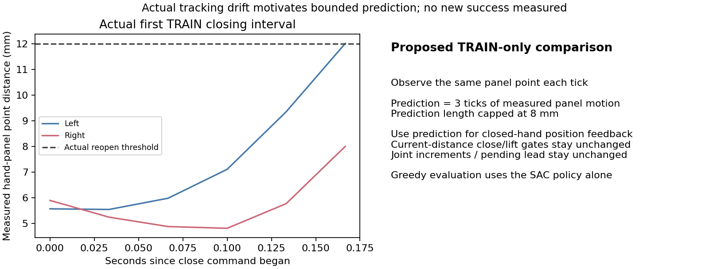

# 닫힘 중 flap 이동 예측을 사용하는 SAC 비교

목표는 원래 박스·base·flap 무작위화를 유지한 양손 파지·유지·들기·안전
성공이다. 기존 장기 TRAIN6,144조건을 유지하면서 닫힘 경험을 늘리는 비교를
준비했다. 새 버전의 실제 파지와 학습 개선은 아직 확인하지 않았다.

## 실제 데이터에서 확인한 문제

수정 v5의 첫 TRAIN128에서 접근 안내33회 중26회는 표면 접근 단계,11회는
닫힘까지 갔지만 실제 양손 opposing pinch/성공은0회였다. 다시 열린19구간은
거리12mm 초과였고 유지 중앙값6틱, 실제 닫힘 중앙값은 좌36.0%·우42.9%였다.
Flap 점과 TCP 이동 차이는 중앙값9.18mm, 몸통 이동은0.33mm였다.
[완료128경로의 실제 측정](assets/rl_v2_upright_repaired_completed_TRAIN_approach_failures_20261009.json).

안쪽20mm 지점의 v6는08:46:55 KST에 첫 TRAIN128을 성공12·랙 안전 종료51·
시간 초과65회로 마쳤다. Greedy95회 중12회, 안내33회 중0회 성공했다.
실제 handoff32회·guided9,072행이었지만 닫힘 명령과 들기 시도는0행/0회였다.
Actor0·Q1,590인 수집 결과로 학습 후 성능이 아니다. 더 깊은 지점이 이번
수집에서 실제 닫힘 경험을 만들지 못했으므로 새 예측 비교는 닫힘이 관찰된
v5의 원래5mm 지점에 적용한다. V6의 원래 학습/전체 평가는 계속한다.
[실제 v6 첫 수집·모델·부위별 결과](assets/rl_v2_interior_contact_repaired_first_TRAIN_actual_20261009.json).

## 바꾸는 제어

연속 두 제어 틱에서 같은 flap 지점을 랙 좌표로 관측한다. 닫힘 중 위치
피드백 목표에 그 이동의3틱분, 약0.1초 앞선 예측을 추가하되 길이는8mm로
제한한다. 현재8/s 위치 피드백·기존0.5 이동 feedforward를 유지하며, 최종
위치 증가10mm/틱·관절 증가0.02rad·pending 목표 선행0.08rad 상한을 그대로
사용한다. 힘이나 실제 pinch·reward·critic 정보를 예측 입력으로 사용하지 않는다.

이 보정은 원래20% 안내 선택 경로의 **양손 닫힘 명령 중 표면 추종**에만
적용한다. Clock이 건너뛰거나 단계가 바뀌면 오래된 속도를 쓰지 않고, 다시
열기·들기에는 예측을 적용하지 않는다. 닫힘 거리6mm·재접근12mm·축 정렬·
측정 닫힘85%·정착6틱·들기 전24틱은 예측한 위치가 아닌 현재 관측으로 판단한다.
원래 물리 PD/힘 제한·보상·성공·안전·SAC 분포·보조 없는 평가를 유지한다.

그리퍼 몸체/팔 링크의 랙 충돌 문제는 별도로 남아 있다. 이 변경은 충돌 없는
전체 팔 경로 계획이 아니며, 예측 목표나 단위 검사 통과를 실제 성공으로
표시하지 않는다. 완료 TRAIN의 실제 양손 접촉 경험과 같은 모델의 전체
128조건 평가로 효과를 확인한다. 독립 FINAL은 아직 사용하지 않았다.

## 코드와 확인 범위

초기화 옵션은 `scripts/rl/prepare_urdf_regional_goal_sac.py`의
`--servo-retention-profile full-arm-predictive-contact`와
`--body-behavior arm20-gentle-rest-greedy`다. 고유 output 폴더를 사용한다.
`URDFPredictiveContactSACPilot`은 기존 v5 agent를 사용하며 별도 artifact/contract로
저장·재개·평가 영상/Q 복원을 구별한다. 기존 설정의 기본값은 유지된다.

최종 원래 지점 버전의 관련22검사가 통과했다. 같은 실제 완료 TRAIN의
읽기 전용384상태에서 초기 greedy 목표21개가 v5와 정확히 같고 밀도·entropy
target이 유한했다. 실제 초기 checkpoint 저장·학습 재개·Q 영상 복원도 같았다.
진단 상태는 학습에 넣지 않았고 Q/replay/optimizer/성공 은행은 새로 시작한다.
[초기 모델·복원·검증 근거](assets/rl_v2_URDF_predictive_contact_initial_verified_20261009.json).

GPU3 실행은 현재 v6의 정상 종료·최종 Drive 검증 뒤 별도 고정 소스로 시작할
수 있도록 연결한다. 원래 TRAIN384·초기/학습 후 전체DEV각128·replay25만의
비교에서 닫힘 경험과 학습 효과를 먼저 확인한다. 다른 활성 장기 실행과 다른
사용자의 프로세스는 유지한다. 기존 Drive 인증·300초 checkpoint 업로드·
크기/MD5 검증·최근2개 보호를 재사용하며 raw 추가 전송 범위를 바꾸지 않는다.

## 실제 대기열 등록

2026-10-09 09:06 KST에 CPU 대기열 PID3023114의 소유자·스크립트·빈
`CUDA_VISIBLE_DEVICES`·활성 상태를 확인했다. 고정 소스757개와 초기 checkpoint
SHA256이 준비 기록과 같다. 현재 v6 writer1624488와 supervisor1624392가 살아
있어 정상 종료와 최종 Drive 검증을 기다린다. **v7 GPU writer는 아직 시작하지
않았다.** 실행 시 GPU3 여유6500MiB·로컬25GiB를 다시 확인하고 초기/첫 TRAIN/
학습 후 전체 평가의 실제 모델을 별도 CPU 관찰자5개가 대조한다.

동시에 기존 SAC writer9개의 소유자·run·GPU 지정·고정 소스·Drive 검증을
재확인했다. v5 장기는 TRAIN3번째 배치에서 actor477·Q3956회까지 진행했고
기존 장기7개도 계속한다. 초기/안내 수집을 새 학습 성공으로 표시하지 않는다.
[실제 CPU 대기·기존 학습·보존 범위](assets/rl_v2_predictive_contact_actual_GPU3_queue_verified_20261009.json).

Notion 중간보고에도 실제 실패·변경 방법·대기 상태와 새 그림을 반영했다.
본문을 다시 읽어 기존 미디어80개와 native table5개가 그대로이고 새 그림을
포함한81개 미디어가 표시됨을 확인했다. 최신 강한 유지 비교5/128회와 중형0회도
보고했으며 대기 중인 v7을 실행/성공으로 표시하지 않았다.
[실제 Notion 갱신·미디어/표 보존 검증](assets/rl_v2_predictive_contact_Notion_verified_20261009.json).
