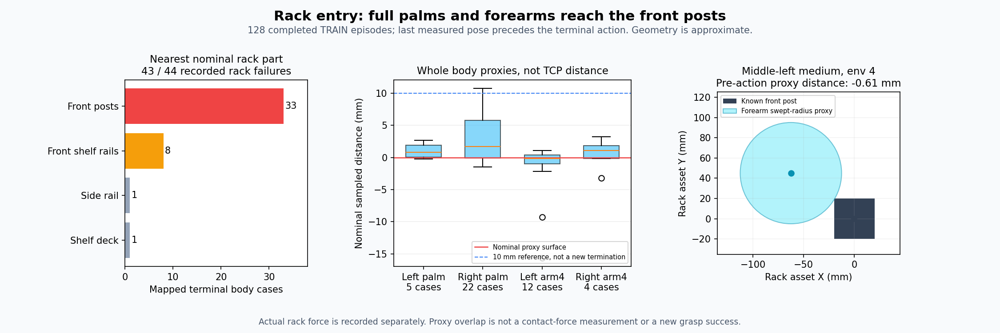

# 양손 파지의 랙 진입 실패 분석

목표는 원래 박스·base·flap 무작위화를 유지한 학습된 SAC의 양손 파지·유지·
들기·안전 성공이다. 기존 장기 학습9개는 계속하고 있으며 이 분석은 새로운
정책 성공 결과가 아니다.

## 확인한 문제

완료된 수정 v5 첫 TRAIN128의 읽기 전용 replay80,977행·SHA256·episode clock을
대조했다. 관측한20관절의 FK와 손끝 위치 차이는 전체 행 최대17.48µm였고,
마지막 제어 직전128자세도 최대12.15µm였다. 실제로 사용된 그리퍼/팔의
기하를 해석할 수 있는 상태인지 먼저 확인했다.

몸체가 랙 안쪽으로 뒤집혀 들어간다는 가설은 이번 자료로 확인되지 않았다.
마지막 제어 직전 양손256자세에서 그리퍼 기준점은 모두 손끝보다 랙 바깥쪽에
있었고, 손끝에서 바깥쪽 방향 거리 중앙값은17.12cm였다. 그러나 그리퍼 전체와
팔 링크가 기둥·선반을 피한다는 뜻은 아니다.



실제 랙 안전 종료44회 중43회의 최고 힘 부위에 대해 알려진 형상을 대조했다.
**명목상 최근접 랙 부위는 앞쪽 기둥33·선반 앞 레일8·측면 레일1·선반1회**였다.
실제 몸체별 종료 수는 오른쪽 그리퍼22·왼쪽 팔4번12·왼쪽 그리퍼5·오른쪽
팔4번4회이며, 나머지1회인 오른쪽 팔7번은 이번 형상 계산에 넣지 않았다.

최고 힘 부위의 마지막 제어 직전 계산상 간격 중앙값은 왼쪽 그리퍼0.80mm·
오른쪽1.68mm·왼쪽 팔4번−0.18mm·오른쪽1.10mm였다. 43개 중41개는10mm 미만,
37개는5mm 미만이었다. **손끝 접근·닫힘 축만 맞추는 제어가 전체 손·팔의 기둥
회피까지 해결하지 못하고 있다는 근거**다. 원래 충돌 힘 기준을 낮추거나
물리 충돌을 무시하지 않는다.

## 계산의 범위

기록한 마지막 관측은 마지막 action **전**의 자세이며 실제 종료 순간 자세가
아니다. 랙의19개 정적 직육면체와546개 롤러 실린더는 알려진 asset 형상이다.
USD 구성에 사용한 두 파일과 그리퍼 STL·URDF의 SHA256도 기록했다.

그리퍼는 STL convex hull의247개 꼭짓점씩, 팔4번은 반지름5cm·길이26cm의
알려진 원통을33개 중심선 표본과 반지름으로 근사했다. 꼭짓점 표본은 면/모서리
교차를 놓칠 수 있고 팔의 구형 끝단 근사는 실제 원통보다 보수적이다.
Runtime contact offset·PhysX 형상 근사·동적 롤러 자세는 측정하지 않았다.
따라서 이 수치는 실제 접촉 힘·정확한 충돌 여유·새 성공 판정이 아니다.
그림의10mm 선도 분석용 비교선이며 새로운 termination 조건이 아니다.

## 다음 수정

닫힘 중 flap 이동 추종 v7은 별도로 대기 중이다. 이번 결과에 따라 다음 안전
진입 비교는 전체 그리퍼와 팔4번의 앞 기둥/레일 여유를 함께 고려하는 국소
관절 제어로 정한다. 손끝 접근 목적과 양손 정렬을 유지하면서 팔꿈치·손목
경로를 조절하며, 보상·힘 제한·성공/안전·원래 무작위화는 유지한다. 단순한
손목 뒤집기 교정만을 해결책으로 채택하지 않는다. 아직 이 추가 제어를 실제
학습에 적용하거나 파지 성공을 검증한 것은 아니다.

분석 상태·평가·실제 접촉 label은 새 학습 입력으로 가져오지 않았다. 안내
수집과 보조 없는 전체128조건의 학습 후 평가를 구분하며 독립 FINAL은 미사용이다.
[실제128경로·형상·최고 힘 부위·계산 한계](assets/rl_v2_upright_completed_rack_entry_geometry_20261009.json).

분석은 GPU/시뮬레이터를 시작하지 않는 공용 진입점으로 재현할 수 있다.
자기 종료 자료의 검증된 읽기 전용 snapshot proof와 고유 출력 경로를 지정한다.

```bash
CUDA_VISIBLE_DEVICES= python scripts/rl/extract_nominal_rack_colliders.py \
  --output-json /absolute/path/to/unique_nominal_rack_colliders.json
CUDA_VISIBLE_DEVICES= python scripts/rl/analyze_completed_rack_entry_geometry.py \
  --snapshot-proof /absolute/path/to/verified_single_completed_wave_snapshot.json \
  --rack-colliders-json /absolute/path/to/unique_nominal_rack_colliders.json \
  --output-json /absolute/path/to/unique_entry_analysis.json
```

현재 S63 Leju 두손·완료 유효128경로·900틱 clock·held goal replay 형식을 검증한다.
다른 형식이나 활성 replay를 이 입력으로 지정하지 않는다. 공용 진입점으로
다시 실행한128개 결과와 첫 진단의 모든 사례/거리 값이 정확히 같았다.
