# Multi-box v2 SAC recovery experiments — 2026-09-30

**2026-10-01 20:17 KST update:** standalone SAC still has no held-grasp success.
Goal-reference residual SAC succeeds in two training episodes and a separate
frozen-model replay from the same lower-box scene. Reference/jaw dependence
remains explicit; this is not a random-reset generalization result.
The completed 80-iteration measured-path run and new physical BC/DAgger/PD-goal
comparisons are recorded in [closed-loop recovery](RL_V2_CLOSED_LOOP_RECOVERY_20261001.md).
A separate GPU3 fixed-reference residual SAC pilot is being evaluated; its
reference dependency and contextual action space are explicit. Historical
entries below retain their original measurement times.

## Latest diagnosis: upper-shelf IK entry — 2026-10-01

**16:15 KST: SAC held grasp remains0; current GPU VR replay succeeds.**
The source`4317154` GPU3/128-environment comparison completed80/80 iterations
normally:7,911 actor updates,319,077 valid transitions, SAC/IK held successes0,
nonfinite transitions0. Final checkpoints and closed logs are checksum-verified
in Drive (`final_upload_verified: true`). That job is finished.

A separate **current24-D GPU3 VR-reference/live-IK replay** now ends in measured
bilateral held success after410 control ticks (13.67s), with no unsafe, invalid
reset or timeout. It is **not a learned SAC success or a success-rate estimate**.
The actual current-reward/full-controller-state transitions pass the data-only
archive checks described below. Upper-shelf bilateral grasp is still unsolved.

The earlier GPU3/128-environment
`a05407e` demo-waypoint pilot was stopped normally at iteration42, with3,102
actor updates, teacher MSE0.02225 and Q loss0.6971. SAC and IK held successes
remain0. Its final checkpoints and closed logs are checksum-verified in Drive.
Large-scale SAC remains stopped while bounded training and single-environment physical
comparisons isolate the failed upper-shelf guide. Finite losses and short
approach distances are not evidence of a learned grasp.

The failed seed42 IK comparison is now recorded as actual evidence:

| Same reset,900 control steps | Final left/right flap distance | Final front distance | Outcome |
| --- | --- | --- | --- |
| Old center-to-demo/full wrist |0.554/0.634m |0.402/0.487m |phase0 throughout; pinch0; timeout1 |
| Corrected demo goal/full wrist |0.545/0.654m |0.394/0.508m |phase0 throughout; pinch0; timeout1 |

Neither produced a safety failure. Correcting the physical close goal is
necessary but insufficient: the IK teacher itself can fail before insertion.

[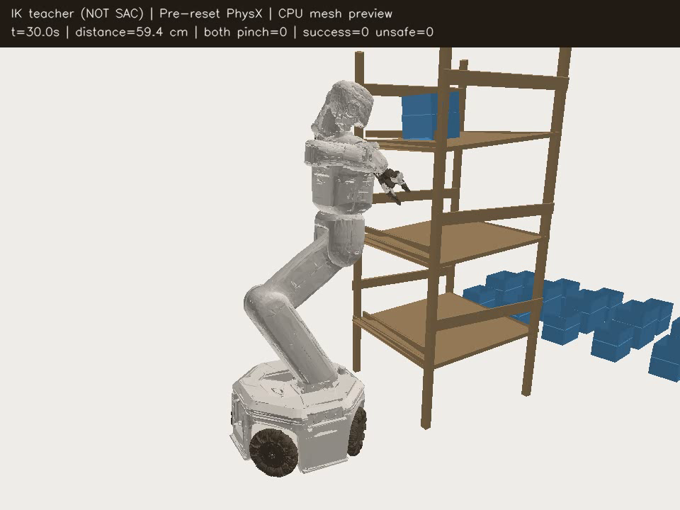](assets/rl_v2_ik_center_seed42_20261001.mp4)

[Actual IK teacher video](assets/rl_v2_ik_center_seed42_20261001.mp4),
[pre-reset telemetry](assets/rl_v2_ik_center_seed42_20261001.json).
This is a live PhysX **IK teacher**, not a learned SAC success. The CPU mesh
preview uses actual body poses; the example is not a statistical success rate.
The video and photo are also native attachments in Notion.

The69 protected executed teacher successes all target boxes at robot-relative
Z1.054–1.119m; **none exceed1.5m**. They include small and medium boxes but
do not demonstrate upper-shelf competence. The failed seed42 target has TCP
goals around1.85m. Measured arm first joints/wrists reach their physical travel
limits during approach. Imitating this teacher continuously can therefore
reinforce unsuccessful upper-shelf corrections even though the loss is small.

Bounded comparisons keep physics, rewards, resets and success unchanged:
full wrist versus symmetric closing-axis alignment; base alignment before
arm entry; position priority while far from the target; and retargeting the
successful VR's intermediate entry poses rather than requesting its final
wrist pose from the first tick. Only measured outcomes will select the next
training guide. These experiments must not be described as a solved task.

`--ik-orientation-mode closing-axis` is an opt-in comparison. The necessary
symmetric jaw direction is aligned while rotation about it is removed from
both the error and angular Jacobian. Default `full` preserves existing teleop
and baseline behavior. **100 focused CPU checks pass**, including the parallel,
antiparallel and90-degree axis cases; this establishes math/compatibility,
not physical success.

## GPU scene restoration and measured full-path seed — 2026-10-01

[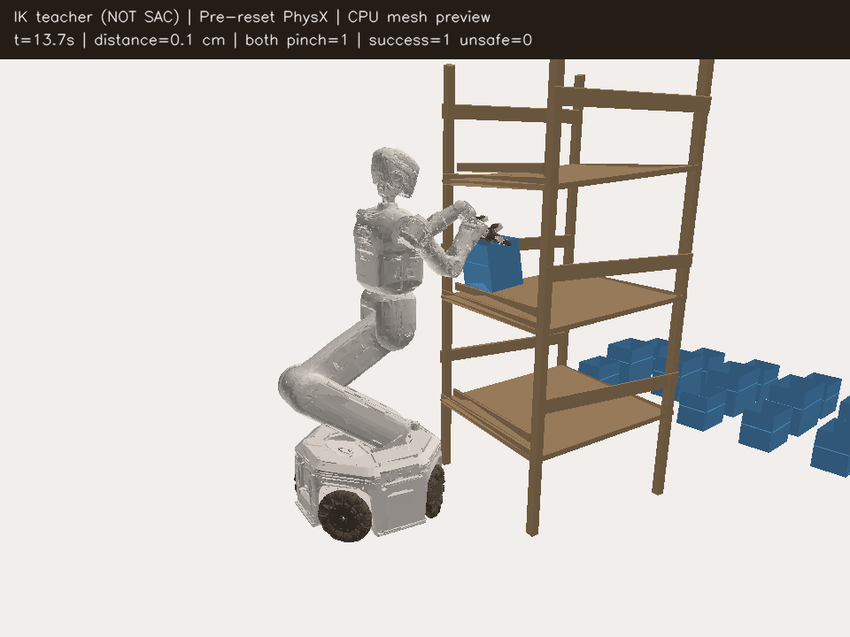](assets/rl_v2_vr_gpu_success_20261001_h264.mp4)

[Actual GPU-physics video](assets/rl_v2_vr_gpu_success_20261001_h264.mp4),
[sampled pre-reset telemetry](assets/rl_v2_vr_gpu_success_20261001.json).
The renderer uses CPU mesh rasterization of **GPU PhysX body poses**. The CPU
renderer label does not mean CPU physics. Reference approach plus live bounded
IK produced the action; no SAC actor executed this example.

A failed GPU comparison had silently changed the restored lower target logical4
into upper target6 during ordinary settling. It must not be interpreted as a
CPU/GPU grasp-performance comparison or imported into Q replay. The recorded
root was at(0.548,0.091,1.049)m, but flap child links still described the parked
box. The first physics step moved the root to(0.944,0.099,0.805)m—46.6cm in one
substep—and triggered invalid-shelf respawn. Merely writing the same zero DOFs,
calling FK again, or warming physics did not repair this case.

`scene/reset_kinematics.py` now forces the GPU articulation FK dirty using a
transient0.001-rad DOF change, restores the original DOFs, and performs a second
FK pass **without advancing physics time**. It does not change final joint
positions, velocities, PD targets, reward or settling acceptance. Two global
FK passes serve all boxes/roller decks in a partial reset; other environments
are not written. CPU resets keep their previous path. The same operation is
used by inferred VR restoration. The repaired GPU replay preserves logical4,
rack-reference error0.000048, invalid-reset delta0, and the first root movement
is approximately2 micrometers. Normal randomized resets share this writer
pattern and now get coherent FK; the change alone is not evidence of SAC learning.

A CPU replay also succeeded at410 ticks. The previous upper CPU comparisons
remain failures: preserving the right-hand capture held pinch for912 ticks but
the left never captured. Articulated perception alone collided with the rack.
Neither is a learned policy, and upper-shelf coverage remains an explicit gap.

The finished GPU replay HDF5 contains410 **executed** transitions, including its
actual pre-action physical seed, pending targets, old actions, complete approach
and pre-reset terminal observation. `experiments/executed_replay.py` accepts only
native current GPU data with matching physical/reward contracts, continuous
actor/critic observations, actual bilateral terminal success, and no unsafe,
reset seam or numerical failure. It excludes old recorded VR rewards and CPU
comparisons. The output is an `experience_only` archive with no actor, Q network
or optimizer; load it with `--experience-checkpoint`, never `--checkpoint`.

`--success-imitation-fraction 0.5` reserves half of the **existing teacher imitation
batch** for protected, actually executed success paths. It adds neither a new Q
label nor an additional imitation-loss budget. Default0 preserves existing
callers. This prevents a single complete successful approach from being diluted
by tens of thousands of unsuccessful online corrections. It is separate from
the offline demo fraction, which starts at20% and decays. New metrics report the
actual successful imitation samples per iteration.

Reproduce and archive a current replay (paths are examples; use a fresh output):

```bash
CUDA_VISIBLE_DEVICES=3 OMNI_KIT_ACCEPT_EULA=YES PYTHONPATH=src:scripts/rl \
  python scripts/rl/replay_v2_grasp_reference.py \
  --demo-dataset examples/demos/v2_grasp_quest_success.hdf5 --episode-index 0 \
  --training-manifest /absolute/path/to/current-run/manifest.json \
  --output-dir /absolute/path/to/unique-reference-run --device cuda:0 --headless
PYTHONPATH=src python -m kuavo_isaaclab_scene.rl.multi_box.experiments.executed_replay \
  --dataset /absolute/path/to/finished-reference-run/executed_transitions.hdf5 \
  --training-manifest /absolute/path/to/current-run/manifest.json \
  --output-dir /absolute/path/to/unique-data-only-archive
```

Use `--episode-index 1` for the second reference, and `--no-video` for a faster
physical measurement. Legacy initial scenes are **inferred**, because the old
subset lacks initial flap/drive state; the recorder captures the actual current
seed after settling. If the target/rack changes or settling respawns the scene,
the replay aborts. Recording a successful reference does not establish that SAC
has learned it. The finished410-row archive and native HDF5 remain local/Drive
artifacts rather than large files committed to Git.

## Full-path SAC comparison completed — 2026-10-01

Started16:22 KST on physical GPU3 with `CUDA_VISIBLE_DEVICES=3`, source`6b929d2`,
128 environments /80 iterations. Parent experiment is
`artifacts/rl/drive_runs/sac_mbv2_fullpath_gpu3_20261001_162204`; child is
`sac_20261001_162217_9536fa`. The fresh actor/Q/optimizers import only the
measured410-row GPU success archive. Native410-row observations/actions also
serve as the early20% BC prior; old recorded rewards are excluded. Half of the
existing online teacher BC batch is reserved for the protected actual success
path.900-step CPU episode history protects later full successes.

At16:28 it had6/80 iterations and24,576 valid transitions, all128 environments
ready and nonfinite0; actor updates had not started because50,000 transitions
are collected first. Demo prefit MSE decreased0.21716→0.001571, which establishes
fit on those labels, not autonomous grasp. Both old and new startup had few
invalid shelf resets (5 vs6) and38 vs39 settling steps: the diagnostic FK bug
**does not by itself explain the old SAC plateau**. Randomization is retained.

Checkpoint20-iteration spacing, existing Drive upload every300 seconds,
checksum-verified retention of the newest two and final closed-log verification
remain active. Initial GPU usage was11.1GiB; this is a bounded learning
comparison before scaling. The other users' GPU0/1/2 jobs are untouched.
Actual status/progress must be read from current `status.json`/`metrics.jsonl`.

This comparison finished normally at17:26 KST and its final checkpoints and
closed logs were checksum-verified in Drive at17:27. Final80/80 metrics:
318,947 valid transitions,7,907 actor updates,8,407 optimizer updates,
nonfinite0, **SAC success0 and online IK success0**. Final SAC-only surface
distances0.634/0.650m. Neither the410-row success prior nor the current20%
imitation schedule establishes a learned grasp in this comparison.

The reusable reference command now settles the ordinary initial reset before
restoring the inferred scene, prints its identity guard, and writes `failure.json`
plus a traceback before Kit shutdown if replay fails. Kit may otherwise replace
the Python exception exit code with0. The output directory must be new, and
inferred restoration rejects multi-environment scenes. The validated second
reference preserves target9 with rack-reference error0.000043 and invalid reset0;
its physical attempt is still being measured.

## Mid-run physical checks — 2026-10-01

At16:53 the new run reached24/80 iterations,979 actor and1,479 total optimizer
updates,97,249 valid transitions, SAC held success0, and nonfinite0. During the
first actor updates the SAC-only mean left/right distances changed0.622/0.645m
(iteration18) to0.498/0.578m (iteration24). This short-window approach change
is not proof of a learned grasp and involves different episode stages.

Checkpoint13 contains the behavior-cloned actor with104 critic updates and
**no SAC actor-gradient updates**. Against its410 recorded observations, action
MSE is0.000438, both-close labels30/30 correct, and no false both-close labels.
The separate live GPU reproduction completed at420 ticks (14s) with success0
and unsafe1: `l_twofinger_base` hit the rack at61.75N. Final left/right surface
distances were0.00787/0.32572m, with neither hand pinching. Its initial464-D
actor observation was **exactly identical** to the successful measured VR
replay. These facts isolate closed-loop drift rather than a different starting
observation. Low logged BC loss cannot substitute for physics evaluation.

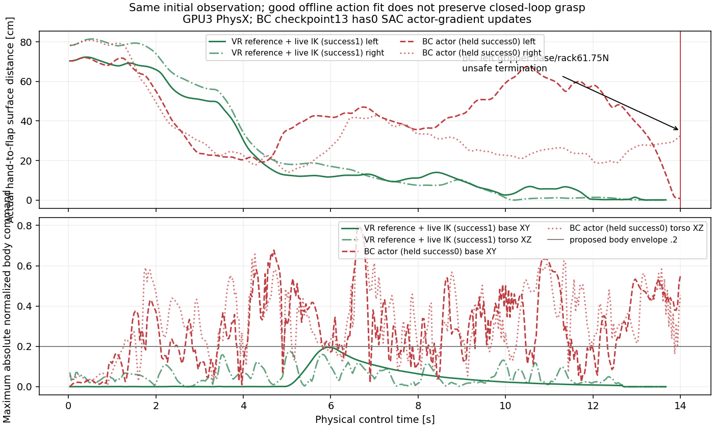

The candidate diagnostic envelope retains every body action in the successful
410-step reference: base XY±0.2, base yaw±0.4, waist yaw±0.35 and torso XZ±0.2.
Arms and grippers retain their full range. This is a proposed comparison, not
yet a validated fix or a change to the running SAC. Two CPU actor-only refits
also separate tighter fit to the actual labels from local pending-PD-target
error correction. The latter modifies actor labels using the incremental
controller equation; no hypothetical reward, next state or Q transition is
created. These fits still require actual closed-loop replay.

Measured follow-up: the original actor with the proposed body envelope fails
at208 ticks (6.93s) with **box drop**, not rack-force termination; its final
rack peak is0N and the terminal critic explicitly marks box drop. The tighter
15,000-step refit (on-data MSE0.000089) fails at203 ticks with an11,479.7N
right-gripper-base/rack collision. Neither is promoted into training. This
also rules out using smaller offline action MSE alone to choose a controller.

The reusable replay command can now compare these controllers while keeping
the ordinary task reward/safety/scene identity checks. Select
`--actor-checkpoint /absolute/path/checkpoint.pt` for a deterministic actor;
optionally add `--body-envelope` for the diagnostic limit. Without that option,
the actor is unchanged. `--executed-actions /absolute/path/native-success.hdf5`
reproduces actual recorded commands from a matching initial observation as an
open-loop baseline and excludes `--actor-checkpoint`. The default remains the
VR-reference/live-IK diagnostic. Actor/open-loop records have distinct source
tags and cannot silently enter the strict VR-experience archive. Reports include
pre-reset per-cause unsafe flags, box velocity, rack peak body/force and actual
action, and explicitly mark incomplete/interrupted attempts.

The recorded-command baseline reproduced the held grasp in actual GPU3
physics at410 ticks, initial actor-observation error0.0, unsafe/invalid/timeout0.
The command sequence/current environment are therefore demonstrably compatible
for this starting state. This is an open-loop replay success, **not SAC
learning**, and it does not establish robustness to other resets.

The upper-reference probe preserved target9 but was stopped after more than421
ticks to reduce GPU-context contention. It did not reach a complete outcome.
Its first stop entered Kit's native SIGTERM handler during a physics callback
and aborted with a carb.tasking nonrecursive-mutex assertion. The native
recorder had no final success metadata, so it is excluded from the experience
archive. The replay command now registers its Python stop handler **after**
AppLauncher, matching the established working training/evaluation lifecycle.
It records whether a probe was interrupted and whether an attempt completed.
The SAC process stayed alive, and no other user's process was stopped.

## Follow-up: contact confirmation and full successful paths — 2026-10-01

The upper-shelf VR/current-controller comparisons still have **held success0**.
The recorded reference path gets substantially closer than the original IK,
but that is not a successful replay under the current physics.

[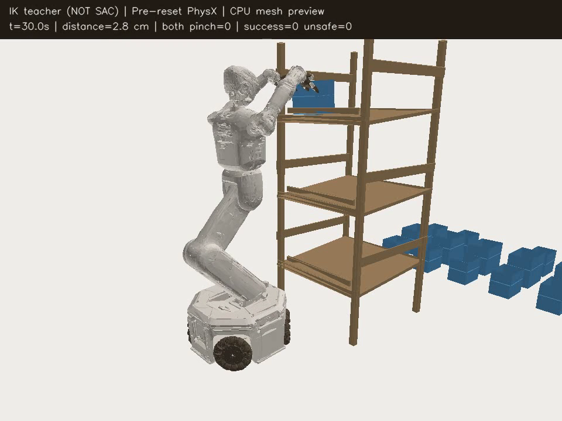](assets/rl_v2_vr_current_replay_20261001.mp4)

[Actual30-second video](assets/rl_v2_vr_current_replay_20261001.mp4),
[sampled physical telemetry](assets/rl_v2_vr_current_replay_20261001.json).
This comparison restores **inferred** recorded robot/rack/box poses, follows
recorded joint states through current24-D actions, then finishes with live IK.
It is a CPU-physics diagnostic, not a SAC rollout. The old source lacks initial
flap joints and pending PD commands, so this is not an exact original replay.

At30s the nominal-center distances are10.07/10.19cm: the common12cm close
projector allows closing. Live IK errors are3.90/4.18cm, above its separate
3.5cm close threshold. Actual flap distances are4.21/1.36cm. Jaw force/pinch
is0 and the run times out without a rack collision. Reach projection is0m at
this point, ruling out gross reach clipping as the explanation for this case.
Re-seeding the posture prior alone still fails. A6cm close proposal or responsive
IK closes empty jaws and enters the old lift phase without physical pinching.
Closing-axis tracking after the VR path also fails. An actual-flap privileged
diagnostic contacts the rack at39.69N; it is not a deployable-policy result.

Two implemented fixes follow these observations:

1. **Teacher lift requires actual opposing flap pinch for3 ticks.** Existing
   contact evidence is reused only by the training teacher; actor inputs,
   environment reward,5N/jaw grasp criterion and10N rack failure stay unchanged.
   Empty fully closed jaws cannot start lift. A physically pinching hand is held
   in its measured pose instead of being opened to chase an imperfect nominal
   goal. Lift starts at the measured capture pose/orientation. Losing opposing
   contact for15 ticks cancels the lift phase. Teacher phase is not a success metric.
2. **Keep the real successful approach.** `--success-history-steps900` keeps up
   to a complete30-second attempt per environment on CPU instead of the old
   hard-coded64-step/2.13s tail. Only a genuinely successful episode promotes
   this history into protected Q replay and executed-action actor labels. No
   recorded old rewards or unexecuted IK labels become Q transitions. Default64
   preserves smaller-memory callers;128 envs with900 steps require about0.87GiB
   of CPU history storage, excluding replay/checkpoint buffers. Reset and numerical
   failure clear the per-environment history.

For future Quest RL demonstrations, `initial_state` captures root/joint
positions and velocities for every articulation, including flap joints, pending
PD targets, action-term memory and logical/physical box mapping **before the
first recorded action**. The native transition fields and HDF5 format version1
remain compatible; regular Quest recording is unchanged. The live simulator
capture validated22 articulations. PhysX internal contact state, perception
history and reward hold timers are not serialized, so bit-identical replay is
not promised. Existing pose-only demos cannot retroactively gain missing states.

**107 focused CPU checks pass**, covering actual-contact lift gating, history
reset/wrap semantics, finite snapshot storage, existing two-demo conversion,
URDF IK and SAC/DPPO terminal behavior. Physical success is still unproved for
these new changes. The running bounded GPU3 SAC comparison uses the earlier
center-to-demo approach that supplied the69 measured lower-shelf successes,
with the corrected contact handoff and900-step history. It does not establish
upper-shelf reliability or justify expanding to a full-memory long run yet.

## Follow-up: hidden flap deflection and experimental perceived geometry

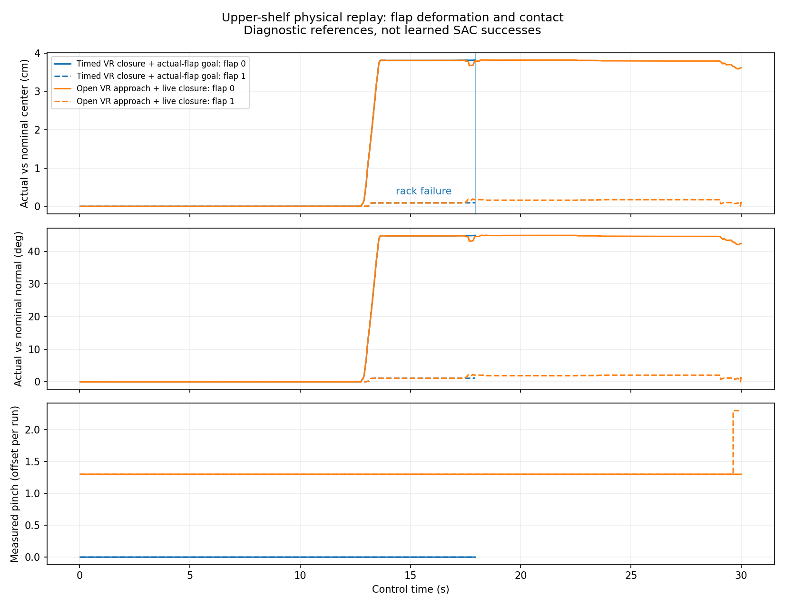

[Measurement summary](assets/rl_v2_flap_deflection_20261001.json). The chart is
computed from synchronized actual flap and box poses before reset. It is not
a learned SAC rollout. Solid/dashed lines identify physical flap0/1, not hands.

In both timed-VR-close and **open-jaw** approach comparisons, flap0 rotates
44.9degrees and its midpoint moves3.8cm around13s. Flap1 moves under2mm.
Therefore premature closing is not established as the sole cause: contact
during approach bends the panel even with open jaws. The actor currently sees
the upright estimate while physical reward/contact uses the deformed panel.
The two runs differ after their VR approach, so the chart is not a controlled
single-variable estimate of the effect of closing.

| Physical reference/current-controller diagnostic | Horizon | Measured pinch ticks left/right | Outcome |
| --- | --- | --- | --- |
| Open approach, live full-wrist finish |30s |0/12 |timeout; opposing pinch0 |
| Same, preserve a captured hand |60s |0/912 |timeout; opposing pinch0; unsafe0 |
| Same, closing-axis alignment |60s |0/0 |timeout; opposing pinch0; unsafe0 |
| Perceived articulated panels, preserve captured hand |18.1s |0/0 |rack22.20N; opposing pinch0 |

The60s horizon belongs to diagnostics only. The running SAC keeps30s.
Right-hand contact maintenance improved in one diagnostic, but left capture
is still blocked. Freeing wrist roll reduced positional error without making
a pinch. Articulated perception exposes a real missing state; its first full
wrist physical comparison still fails at the rack. It is **not** a success-rate
improvement or a reason to change the default.

Implemented opt-in `--flap-pose-source articulated` supplies optional panel
midpoint xyz+wxyz and confidence through the shared deployable perception
schema. Isaac uses a truth-pose proxy, just as the existing box perception does;
no contacts, force or success labels enter the actor. Real deployment requires
an estimated panel-pose backend. Relative midpoint/direction38 features and
opposing-panel surface assignment use the deformed geometry. The SAC IK guide
rotates its goal offset and wrist frame with the perceived panel. PPO and SAC
share the builder; their grasp entrypoints record/check the source.

Default`nominal` keeps existing464/530/24 observation/action dimensions and
behavior. `articulated` uses the same dimension but a distinct semantic
contract, so nominal checkpoint resume or executed-success Q import is rejected.
Bad panel poses receive confidence0 and zero relations/assignment; the common
gripper projection blocks close rather than treating the placeholder as a goal.

Quest native RL collection can use `--rl-demo-flap-pose-source articulated`.
The old two demos lack actual panel pose, so cross-source loading is refused by
default. Explicit`--allow-nominal-demo-prior` permits only an approximate actor
prior and records that limitation; it never reconstructs the missing geometry
or imports recorded rewards into Q. **53 focused CPU checks pass**, including
neutral equivalence, bent geometry, invalid-panel closing suppression, logical
pool mapping, demo source guards and equal-dimension checkpoint incompatibility.
Actual Isaac articulated observations were read successfully; physical task
success remains unproved.

The chart can be reproduced without Isaac using
`scripts/rl/analyze_v2_flap_replay.py` and the diagnostic metrics files. Geometry
and control rate are explicit inputs. Contact measurements and inferred initial
states remain separate from teacher phase and statistical policy performance.

## Latest follow-up: persistent corrections — 2026-10-01

**Follow-up at 12:00 KST:** the 64-environment correction pilot was stopped
at iteration50 for a second concrete problem. It had1,677 SAC actor updates,
teacher BC loss0.01630, Q loss1.757, SAC hand distances0.467/0.391m and zero
SAC/IK held successes. It exited0 and final checkpoints/logs are Drive verified.
Approach improved in this bounded sample, but held grasp did not.

The successful VR TCPs are7.71/8.30cm from their nominal flap midpoints;
the teacher's old close test required<3.5cm from the midpoint. Thus a physically
successful recorded grasp could receive an **open-jaw correction** during
insertion. A CPU regression on the actual demos reproduces this mismatch and
confirms the retargeted physical grasp goal matches the recorded TCPs. TCP
calibration was already present when those demos were recorded, so this is
not a missing EEF-offset correction.

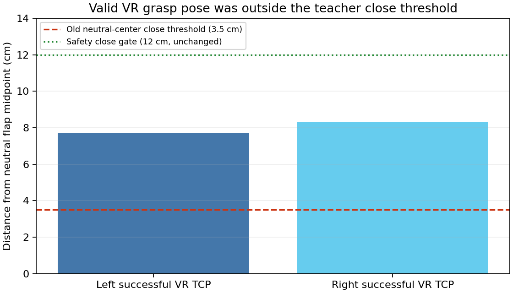

Use `--ik-grasp-goal demo`: retarget the physically successful pose offset for
approach, closing and lift, rather than inserting at the neutral reference
and retargeting only after closing. Neutral midpoint observations, safety
gripper gate12cm, contact checks, rewards and success are unchanged. The old
goal modes remain opt-in comparisons. Do not refit using old hypothetical
near-center corrections: the next fresh model keeps only previously executed
success experience, also seeding actor imitation with those real actions.
**84 focused CPU checks pass; physical grasp benefit is still being tested.**

The 04:31 stabilization run was stopped deliberately at **iteration 384**
(11:16 KST), with **42,614 SAC actor updates and zero SAC-from-reset/handoff
held grasp successes**. It collected 11,008,572 valid transitions, 25 additional
IK expert successes, 4,141 unsafe episodes including 3,428 robot-rack failures,
and zero numerical failures. It exited cleanly with code 0; final checkpoints
350/384 and logs are Drive checksum-verified. Numerical stabilization did not
solve the task.

| Window (iterations) | SAC left/right distance (m) | Unsafe per iteration | Timeout per iteration |
| --- | --- | ---: | ---: |
| 37–80 | 0.790 / 0.733 | 35.23 | 17.20 |
| 81–150 | 0.605 / 0.674 | 8.50 | 30.31 |
| 250–300 | 0.742 / 0.818 | 7.25 | 30.10 |
| 330–381 | 0.662 / 0.649 | 5.50 | 33.69 |

The short pilot's stored 15,360-actor-update imitation horizon was also used
for live teacher queries and expert episode assignment. All three retired
around the first 12% of the planned long continuation, before the actor had
learned a held grasp. The actor then received no further visited-state
corrections or new expert successes. At checkpoint 350 its MSE against 8,192
retained teacher labels was **0.6311** (arm 0.7360, base 0.5627, height 0.6627).
This directly measures action drift; the simultaneous schedule changes mean
we cannot attribute all performance changes to one component.

Q remains imperfect but is no longer millions away from terminal targets:
69 actual success-terminal rows at checkpoint 350 have mean Q **63.0604**,
true immediate target **49.9610**, mean absolute error **19.6266**, max Q
205.5408. These rows require no bootstrap, making this a direct calibration
check. A finite Q loss alone still does not establish policy quality.

The next experiment separates recorded VR behavior cloning from live teacher
correction. VR starts at 20% and decays to zero. Current teacher labels have
an independent 128,000-actor-update horizon, initial fraction 20%, floor 10%,
and BC strength 100 (loss weight 20 initially, floor 10). Expert episodes
start at 20% with their own 128,000-update horizon and 10% floor. The actor
learns from teacher suggestions at its own visited states; they do not override
SAC actions or become fabricated Q transitions. Real executed expert success
tails remain a separate protected critic buffer. IK and independent SAC
successes remain separately attributed. This is a revised training method,
not a change to physical safety, success criteria, rewards, or reset difficulty.

Additional diagnostics attribute each eligible robot-rack failure to the
robot body with the largest filtered pair force. They reuse existing contact
matrices and capture the pre-reset state; no new sensors or force summation
are introduced. CLI definitions are shared between the v2 runner and the
CPU-only Drive wrapper. Legacy schedules remain the default when independent
teacher imitation is disabled. Validation: **73 SAC/collection/alternative
and 10 contact-force/adapter CPU checks passed**. A bounded GPU3 run will
measure the effect before another long continuation.

### Recorded failed policy and bounded correction run

[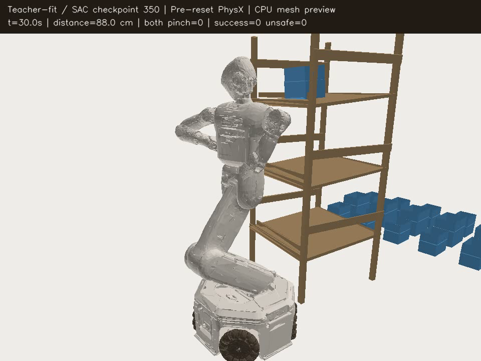](assets/rl_v2_sac350_20261001.mp4)

[Actual SAC350 H.264 video, 30 seconds](assets/rl_v2_sac350_20261001.mp4)
and [metadata](assets/rl_v2_sac350_20261001.json). Seed 42, one live PhysX
environment, deterministic actor with 38,401 SAC actor updates, no IK action
override. Completed 900 steps with success/unsafe/invalid-reset all zero and
one timeout. Last pre-reset sampled distance is 88.0 cm; bilateral pinch is
absent. The actor folds its arms instead of completing approach. This is a
single example, not a statistical success estimate or a torque-system proof.
Native video/photo are attached in the Notion record.

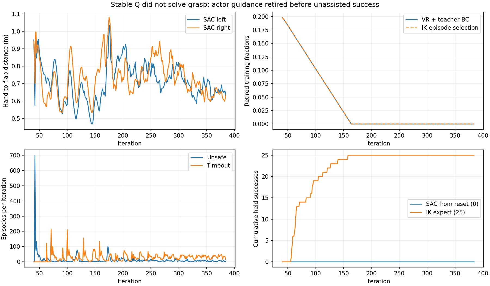

A fresh bounded run launched at **11:24 KST**, source `7c75134`, GPU3 only:
`sac_mbv2_persistent_teacher_pilot_gpu3_20261001_112415/sac_20261001_112421_5ea495`.
64 environments, 120 iterations, 16 rollout steps, batch1,024, four updates per
step, 300,000 CUDA replay, learning starts8,192, critic warmup1,000 updates,
teacher prefit20,000, checkpoints every20, verified Drive upload300 seconds,
latest two local checkpoints. It imports4,416 actual executed success tails
and100,000 actor-only teacher labels from checkpoint384 but restores none of
its model/Q/optimizer. At11:35 KST / iteration23 it has collected23,552 valid transitions,
completed20,000 teacher-fit updates (MSE0.18075→0.005177) and964 critic
updates. The current SAC rollout hand distances are0.614/0.548m; online
visited-state labels are collected. SAC actor updates are still0, so these
values describe the fitted actor, not the effect of the new SAC/teacher loss.
Recorded VR decay spans2,304 actor updates for this bounded run; independent
teacher/expert horizons remain128,000 and survive continuation. Physics,
reward, safety, self-collision-off and task success are unchanged.

The reason to label states actually visited by the actor follows the
covariate-shift argument in [Ross et al.'s original DAgger paper](https://arxiv.org/abs/1011.0686).
This is teacher-label aggregation combined with SAC, not a claim that the
paper's guarantees transfer to an imperfect IK teacher or this experiment.

## Earlier stabilization run (stopped)

**Current execution (2026-10-01 04:31 KST):** source `a3048fc`, GPU 3 /
1,024 environments, run
`sac_mbv2_stabilized_gpu3_20261001_0431/sac_20261001_043153_70e2c1`.
It resumes the new stable pilot checkpoint 36, not the earlier divergent
checkpoint 133. Additional iterations 964 target a total of 1,000. Initial
startup is in progress; actor-update health and learned grasp success remain
to be checked. CUDA visibility is restricted to GPU 3. Uniform CUDA replay is
3,000,000 transitions, batch 4,096, four updates/vector step, checkpoint interval
50, verified Drive upload every 300 seconds with latest two local checkpoints.
At iteration 40, replay refill completed (131,072 valid transitions) and actual
SAC actor updates began: critic updates 1,359 including restored 1,235, actor
updates 124, Q loss 1.558, mean policy Q 2.986, target mean 1.908, alpha
0.000009835. Learned SAC held-grasp success is still zero; these early finite
values do not prove long-run convergence. Own VRAM is about 54.5 GiB.
The first Drive verification completed at 04:41 KST.

At 05:00 KST / iteration 49, 392,646 valid transitions, 2,380 critic updates
(1,235 restored) and 1,145 actor updates were logged. Q loss 27.100, mean policy
Q 5.393, target 4.519 and alpha 0.000007232 are finite and far below the previous
divergent values. **SAC-from-reset/handoff success remains zero.** Mean SAC
hand-to-flap distances are 0.922/0.883 m. There have been 1,207 unsafe episodes,
including 1,201 robot-rack collisions, and zero numerical failures. Safe entry
and grasp performance are still unresolved; this does not establish that the
task will converge. Mixed online teacher/VR imitation MSE is 0.06791, on a
different distribution from the fixed pretraining fit. The run continues and
Drive verification has no errors (last 04:56 KST).

### New teacher-fit actor video (no SAC actor updates yet)

[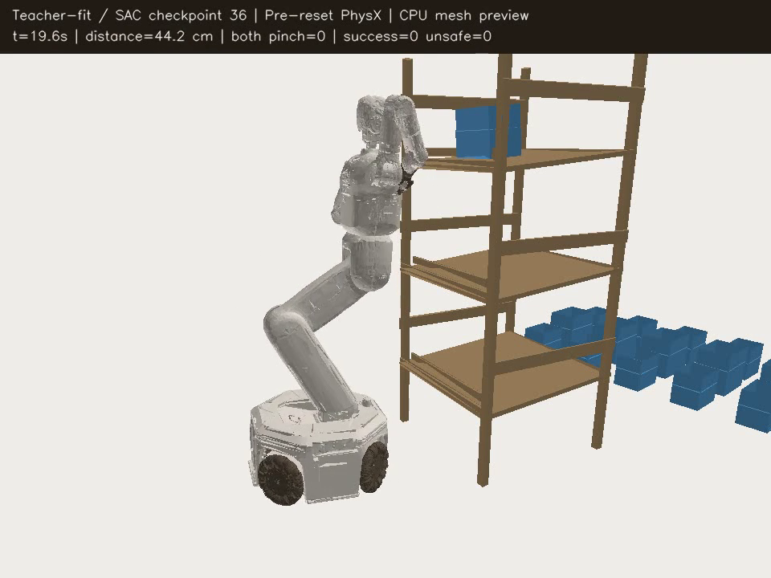](assets/rl_v2_teacher_36_20261001.mp4)

[H.264 video: teacher-fit checkpoint 36, 20 seconds](assets/rl_v2_teacher_36_20261001.mp4)
and [recorded metadata](assets/rl_v2_teacher_36_20261001.json).
Same seed 42, one real PhysX environment, current 464/530/24 contract and
deployable deterministic actor; no online IK action replacement. It completed
600 control steps, 20 seconds, with zero success/unsafe/invalid-reset/timeout
terminations. At the last sampled frame (19.6 s), flap distance is 44.2 cm and
bilateral pinch is absent. The actor is teacher-fitted but has **zero SAC actor
updates**; its critic has 1,235 updates. This demonstrates safe motion in one
short example, not grasp success or an effect of SAC fine-tuning. Its endpoint
cannot be directly compared with the earlier 9.5-second video as a matched-time
improvement estimate. The frames are captured before any reset and use actual
physics poses rendered with CPU USD meshes. Native video/photo are also in Notion.

**2026-10-01 03:37 KST: the critical-retention run was stopped deliberately at
iteration 133 because SAC learning diverged, not because grasp was solved.**
It collected 2,583,590 valid transitions during this resume and 24 additional
online IK expert successes, with **zero SAC-from-reset/handoff successes** and
zero numerical-recovery episodes. The existing 16 plus 24 new expert successes
produce 2,560 protected 64-step success-tail transitions. It stopped cleanly
with exit code 0; final checkpoints/logs are Drive checksum-verified.

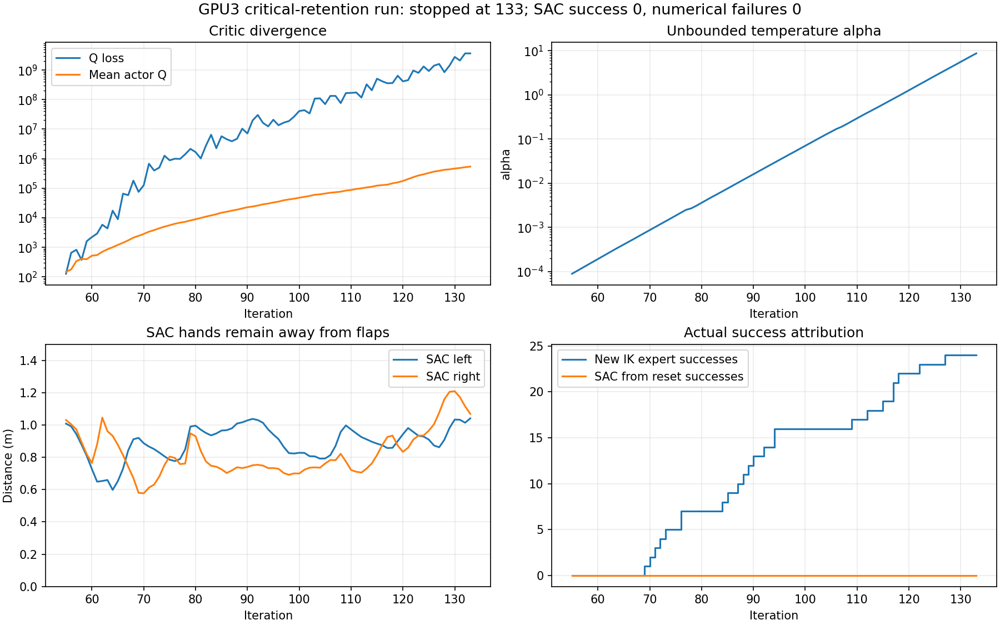

The mean rollout reward stayed negative, while mean actor Q grew to 539,442,
Q loss to 3.672 billion and temperature alpha to 8.756. On the **same stored
executed success transitions**, checkpoint 50 predicted mean Q 655.8,
checkpoint 100 predicted 215,894.9, and checkpoint 133 predicted 1,744,840.4;
the latter valued its own unexecuted actions still higher (1,813,365.3).
Actor action MSE against these measured actions also grew from 0.414 to 0.828.
This is evidence of critic/policy instability and imitation being overwhelmed,
not genuine grasp improvement. The critical-label retention fix worked, but
did not address this separate SAC failure.

The most direct check uses the 40 stored **success-terminal transitions**:
their mean Bellman target is 49.961 (scaled immediate reward, no bootstrap),
but checkpoint 133 predicts mean Q 928,228.8, minimum Q 92,186.4 on those
executed actions. Discounted behavior returns over the 64-step success tails
average 55.941 and range 45.779–80.674. Rollout-average reward and prioritized
training-batch reward need not match; the terminal mismatch is direct evidence
of miscalibration without that comparison.

The follow-up separates three corrections:

- Add LayerNorm to both critic hidden layers for the fresh v2 learner.
- Normalize the actor's Q term by detached `max(mean(abs(Q)), 1)`, so growing
  Q scale cannot silently erase the configured imitation penalty. This adapts
  the Q-scale idea in the [TD3+BC authors' implementation](https://github.com/sfujim/TD3_BC/blob/main/TD3_BC.py)
  to this SAC actor; it is not a conversion to TD3 or a claim of success.
- Make the capped-policy entropy target depend on the tanh Jacobian at the
  current detached mean, including saturated teacher actions. Gaussian std
  feasibility alone was insufficient. For `std <= 1`, the per-dimension
  target includes `log(1-tanh(mean)^2) - max_std^2`; the existing 0.5-nat
  margin remains. Add an explicit `--max-alpha` (v2 default 0.001).

`--experience-checkpoint` starts a **fresh model/Q/optimizer** and imports only
the protected genuine executed success-tail transitions from a compatible
checkpoint. It cannot be combined with `--checkpoint`. Physical action,
observation, reward, contacts and safety contracts must match; learning settings
can change for data-only imports. Actor-only teacher labels remain a separate
`--teacher-label-checkpoint` input. Full policy resume still requires matching
learning/architecture contracts. New diagnostics include `actor_q_scale`,
`target_entropy_mean` and `imported_success_rows`.

Regression checks: 69 SAC/collection/alternative CPU tests passed, covering saturated-mean
entropy, temperature bounds, Q normalization and genuine experience import.
A fixed-success-replay GPU 3 comparison completed 5,000 updates per case:

| Metric at update 5,000 | Previous critic/raw-Q actor | LayerNorm/scaled-Q actor |
| --- | ---: | ---: |
| Q loss | 148,002.34 | 0.9986 |
| Mean policy Q | 12,788.84 | 89.56 |
| Teacher action MSE | 0.05223 | 0.001144 |
| Alpha | 0.000004418 | 0.000002636 |

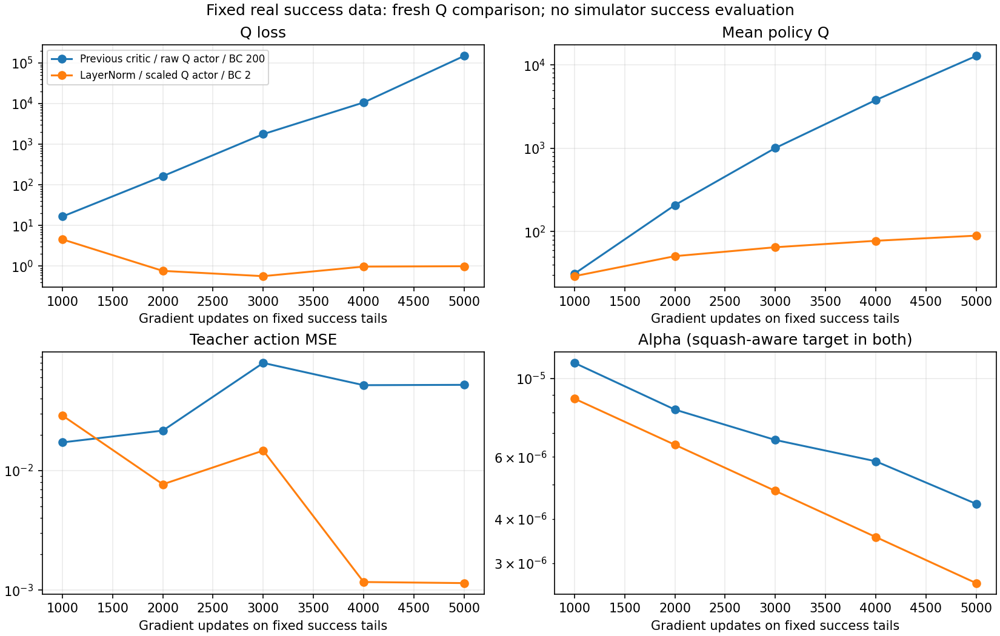

Both cases use a fresh critic, the same 2,560 real success-tail transitions,
same actor initialization fit (1,000 updates, MSE 0.000683), revised squash-aware
entropy target, and alpha bound. The previous case uses raw Q and BC loss weight
200; the new combination uses normalized Q and BC weight 2 (20% times strength
10). Thus this is a combined stabilization comparison, not an ablation proving
LayerNorm alone. Alpha stays small in both, yet the previous critic still grows;
temperature alone cannot explain Q divergence. Only success-tail states are
covered and the probe omits live simulation and the gripper action projection.
It checks numerical behavior, **not SAC grasp success**.

Before another long run, a distinct bounded live GPU 3 execution will check
128 environments, 120 iterations, batch 1,024, four updates/vector step, and
300,000 CUDA replay transitions. It imports real success tails from stopped
checkpoint 133 and critical teacher labels from the immutable label seed,
without restoring their Q/model/optimizer. Teacher fit is 20,000; initial
expert/imitation fractions remain 20%. For the bounded run only, decay spans
its full planned update horizon rather than the default first 30%, so it does
not remove imitation during this short verification. Safety and reset/success
conditions remain unchanged. Long-run scheduling will be recorded separately
after measuring this live check.

Launched 04:03 KST from source `4ed2345`:
`sac_mbv2_stability_pilot_gpu3_20261001_0403/sac_20261001_040358_231ee5`.
At iteration 21 it has imported the 2,560 real success-tail rows and the label
seed, collected 85,566 new valid transitions, two new **IK warmup** held
successes and 18 unsafe terminations, with zero numerical failures. Protected
success replay contains 2,688 rows. SAC optimization has not started yet:
uniform replay needs 100,000 valid transitions, followed by teacher fit and
critic-only warmup. Current hand distances 0.543/0.512 m describe expert
collection, not SAC progress. Own VRAM was about 11.1 GiB for this bounded
run. Drive verification remains operational; other users' processes are intact.

The live check stopped cleanly at iteration 36 for transfer to the 1,024-env
run: 139,483 valid transitions, four IK warmup held successes, zero SAC actor
updates and zero numerical failures. Teacher fit MSE was 0.10961 → 0.00078050
over 20,000 updates. The new critic completed 1,235 real-replay updates with
Q loss 5.078, mean Q -0.343 and target mean -0.314, alpha 0.00001.
Protected genuine success replay contains 2,816 rows (44 success tails).
Final checkpoints 25/36 and logs are Drive checksum-verified. These are live
critic/collection checks, **not a learned SAC held grasp**.

The long continuation preserves this fitted actor, new LayerNorm critic and
optimizer state, but refills non-serialized uniform replay. The critic-only
threshold is 1,000, already exceeded by the measured 1,235 updates. Resume
allows this timing threshold to change without changing saved architecture or
physical/task contracts. The existing 15,360-actor-update imitation horizon
is preserved, so expert/imitation starts at 20% and decays during roughly the
first 12% of the 1,000-iteration total; it is not restarted after resume.

### Previous launch (01:42 KST)

Latest 2026-10-01 01:42 KST: source `bf63054` resumed on GPU 3 / 1,024
environments in `artifacts/rl/drive_runs/sac_mbv2_critical_retention_gpu3_20261001_0141/`,
child `sac_20261001_014208_f5427a`. It restores policy checkpoint 51 and imports
actor-only labels exported from checkpoint 29, with persistent critical-label
storage described below. Additional iterations: 949, targeting iteration 1,000.
The fitted actor, Q/optimizers and imitation-decay counter are preserved. Uniform
Q replay refills until 100,000 valid transitions; another teacher fit is not run.

The previous run stopped cleanly at iteration 51, with 10,785 critic / 6,785
actor updates, **nine new online IK held successes**, zero SAC-from-reset or
SAC-handoff successes, and zero numerical failures across this resume. Its
protected replay now contains 1,024 actual success-tail transitions (16 successes
including the seven restored). Checkpoints and final logs are Drive verified;
local checkpoints 50/51 remain. Source 29's labels were recovered from its
verified Drive checkpoint into a distinct immutable actor-only seed artifact,
without policy, optimizer, reward or Q fields. All unrelated user processes
remained untouched. Before/after fit videos and photos below are also attached
natively in [the Notion experiment record](https://app.notion.com/p/3eb63918d42a81f694a9e060aeffe7cc).

At 01:55 KST, startup/reset settling completed (87 control steps), model and
optimizers restored, and the actor-only import log confirmed 100,000 imported
labels and 100,000 retained critical rows. Label-row counts can include repeated
snapshot samples; they are not counts of independent grasps. Uniform replay
refill is active. Learned SAC grasp success remains unverified.

The first fresh 1,024-env GPU 3 run
`artifacts/rl/drive_runs/sac_mbv2_success_tail_gpu3_20260930_2238/`
ended at IK warmup iteration 18 with `ValueError: Non-finite robot gravity
compensation or stiffness`. It had collected 589,117 valid transitions,
46,555 priority teacher labels, zero held successes and 48 unsafe terminations.
Its last mean flap distances were 0.415/0.404 m. **SAC optimization had not
started.** This was not an OOM: own GPU use was about 55,513 MiB. Final logs
were Drive checksum-verified. No checkpoint existed yet because regular saves
were every 50 iterations; its in-memory replay/labels could not be recovered.

The recovery now includes std-cap-compatible entropy targets and opt-in
per-environment dynamics recovery, described below. A real two-env GPU 3
fault-injection probe passed: env 0 alone was reset after injected NaN gravity;
env 1 remained ready, next-step observations/feedforward were finite, and the
failed transition was terminated and excluded. CPU coverage: 82 relevant
SAC/demo/gravity/terminal checks passed.

The new distinct fresh GPU 3 run started from source `2b627a8` in
`artifacts/rl/drive_runs/sac_mbv2_dynamics_recovery_gpu3_20260930_2341/`,
with child `sac_20260930_234237_dac410`. It retains 1,024 environments, 900 IK warmup
vector steps, 3,000,000-transition CUDA replay (22.50 GiB), batch 4,096 and 16
updates/vector step, teacher fit 20,000, 1,000 iterations, initial 20% expert/
imitation fractions decaying over 153,600 actor updates, and save interval 50.
One additional checkpoint is saved when warmup completes; an environment-step
exception also attempts an atomic recovery checkpoint. These protect initial
collection without increasing ordinary checkpoint frequency. Safety, reset,
bilateral grasp/proof-lift success and the no-curriculum contract remain unchanged.

Measured 2026-10-01: this run finished iteration 20 with 652,258 valid
transitions and **five IK warmup held successes**. It then failed during
iteration 21: env 1007 had non-finite root state and Coriolis compensation,
although gravity, mass matrices and joint state remained finite. Partial
reset ran, but strict grasp geometry still encountered an invalid TCP
quaternion. The atomic emergency checkpoint succeeded: checkpoint 21 contains
100,000 teacher labels and **448 genuine success-tail transitions**, representing
seven successes including two in the incomplete iteration. Optimizer/actor
updates are both zero; these are expert collection successes, not SAC success.
The checkpoint and final logs are Drive checksum-verified.

The follow-up refreshes PhysX articulation kinematics after reset and
invalidates cached robot root/link views without advancing simulation time.
A pre-grasp guard also checks all robot link poses, root and joint state after
the last physics substep, covering errors with no subsequent actuator write.
An actual GPU 3 two-environment probe passed both NaN-gravity and final-substep
zero-link-quaternion/non-finite-root-cache injections: only env 0 reset,
env 1 remained ready, observations/feedforward were finite, and the failed
transition was excluded. Corrupt read caches were injected; NaNs were never
written to native physics. Relevant CPU checks: 41 passed. This verifies the
recovery path, not the underlying source of rare native root-state divergence.

Resumed at 2026-10-01 00:39 KST from source `b4a5306` in
`artifacts/rl/drive_runs/sac_mbv2_pose_recovery_gpu3_20261001_0039/`,
child `sac_20261001_003940_9e46f4`. The previous failed training PID is gone
and GPU 3 was empty before launch. CUDA visibility is restricted to physical
GPU 3; 979 additional iterations target original iteration 1,000.

This restores checkpoint 21 with 1,024 environments and 256 IK vector
steps to refill non-serialized uniform Q replay, then the pending 20,000-update
teacher fit and SAC optimization. Successful tails, labels and the original
153,600 actor-update imitation decay horizon are restored. Safety, rewards,
success criteria and reset distribution are unchanged.
The supervisor uses the existing authenticated Drive connection, checks every
300 seconds, saves every 50 iterations plus warmup/exception safeguards, and
keeps the latest two checksum-verified checkpoints. Local free space was
109 GiB at launch; verified Drive free capacity was 4.984 TiB.

Measured after refill: iteration 29 completed teacher fit (20,000 updates),
reducing action MSE from 0.13151 to 0.00080953. This checkpoint has 16 critic
updates and zero SAC actor updates. At iteration 32, critic updates reached
1,552; numerical failures remain zero, successful tails remain 448, and
SAC hand-to-flap distances were 0.603/0.522 m. The critic-only warmup deliberately
holds the fitted actor for the first 4,000 optimizer updates. Action MSE and
short-range progress are not held grasp-success evidence.

### Current-contract video before teacher fit

[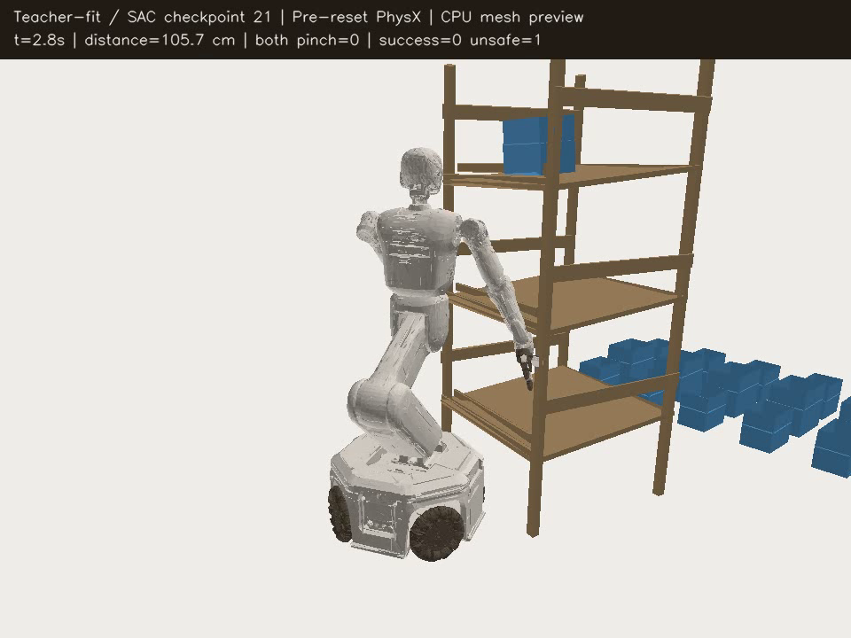](assets/rl_v2_teacher_before_20261001.mp4)

[H.264 video: current-contract checkpoint 21 before teacher fit](assets/rl_v2_teacher_before_20261001.mp4).
Same seed 42, one environment, S63/Leju, rack-rollers and current 464/530/24
observation/action contract. Deterministic policy ended at control step 84
(2.8 seconds), zero grasp success and one unsafe termination. The checkpoint
contains Quest BC initialization but **no online teacher fit or SAC updates**.
Photos and video are captured after termination computation but **before reset**;
the terminal image is not the respawned state. They render CPU USD meshes at
actual PhysX poses. This view alone does not identify the specific unsafe cause.
The terminal mean flap distance was 105.7 cm.

### Same-contract video after teacher fit

[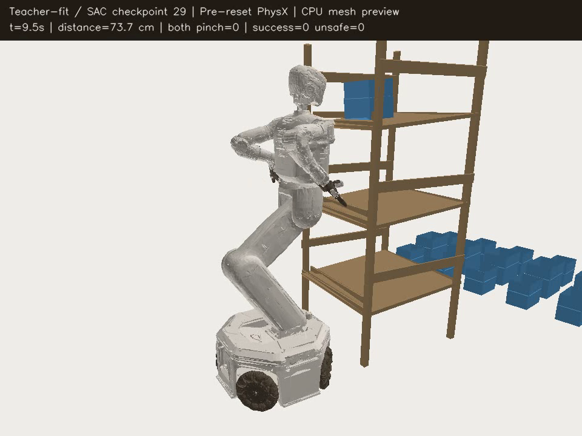](assets/rl_v2_teacher_after_20261001.mp4)

[H.264 video after teacher fit](assets/rl_v2_teacher_after_20261001.mp4).
Same seed 42 and physical/control configuration. The deterministic rollout
completed 300 control steps / 10 seconds without unsafe, invalid-reset or timeout
termination. Held success remained zero. The photo is the last sampled frame
at 9.5 seconds; its mean flap distance is 73.7 cm, with no bilateral pinch.
Checkpoint 29 contains the completed teacher fit and 16 critic updates, but
zero SAC actor updates. This comparison establishes longer safe motion in one
case, not grasp success. Endpoint distances are at different times (2.8 versus
9.5 seconds), so they are not a paired distance-improvement estimate.

### Protect critical teacher labels from FIFO churn

The resumed run reached iteration 38 with 4,493 critic / 493 actor updates,
zero numerical failures and zero SAC-from-reset successes. A separate data
issue became visible: critical rows in its ordinary 500,000-label teacher FIFO
fell from 56,011 to 13,109 as newer off-target labels overwrote them. At 1,024
environments and 30 Hz this FIFO covers only about 16.3 simulated seconds,
shorter than a 30-second episode. Priority **sampling** did not protect
priority **storage**. Episode ages and resets also affect mean distance, so
the label drop alone does not establish the cause of a distance increase.

The fix adds a separate CPU FIFO of 100,000 critical actor-only labels. New
off-target labels never overwrite that stratum; new critical labels replace
older critical labels when it fills. Half each teacher batch still comes from
critical labels, and the existing total 20% initial imitation and decay schedule
are unchanged. Extra CPU storage is about 186 MiB with this observation/action
contract, with no additional CUDA replay allocation. Checkpoint snapshots remain
bounded to 100,000 labels, so ordinary checkpoint size does not increase.

`--teacher-label-checkpoint` optionally restores actor-only labels from an older
compatible v2 checkpoint while policy/optimizer/Q restoration uses `--checkpoint`.
The source manifest must match the environment/observation/action contract;
labels must have matching dimensions and finite normalized actions. This path
never imports the source policy, optimizer, reward or Q transitions. The next
resume uses checkpoint 29 as its label source, retaining the more recent policy
checkpoint. CPU tests cover retention through FIFO overwrite, bounded snapshots,
restore, and rejection of incompatible/non-finite labels; 66 relevant checks pass.

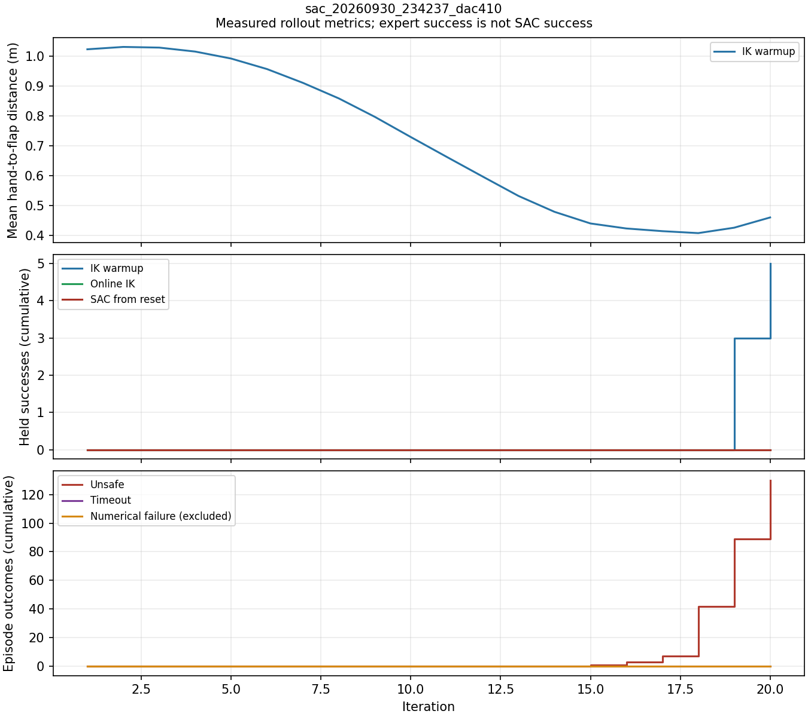

The earlier 64-env episodic-guidance run stopped cleanly at iteration 193.
Online IK episodes produced **two new held successes**, while SAC from reset
produced **zero**. Its final checkpoint/log upload is checksum-verified after
the user reauthenticated the existing Drive connection. Expert successes
establish physical feasibility, not learned SAC success.

The data corrections carried into the new run:

- Preserve the last 64 executed, valid transitions of successful episodes
  (about 2.13 s), ending history at each reset or excluded transition.
- Sample half each teacher imitation batch from bilateral flap distance <=
  0.25 m or close labels, half uniformly; overall imitation still starts at 20%.
- Bound teacher servo acceleration using measured joint velocity when SAC
  queries an IK action it does not execute. Joint position remains measured-state based.

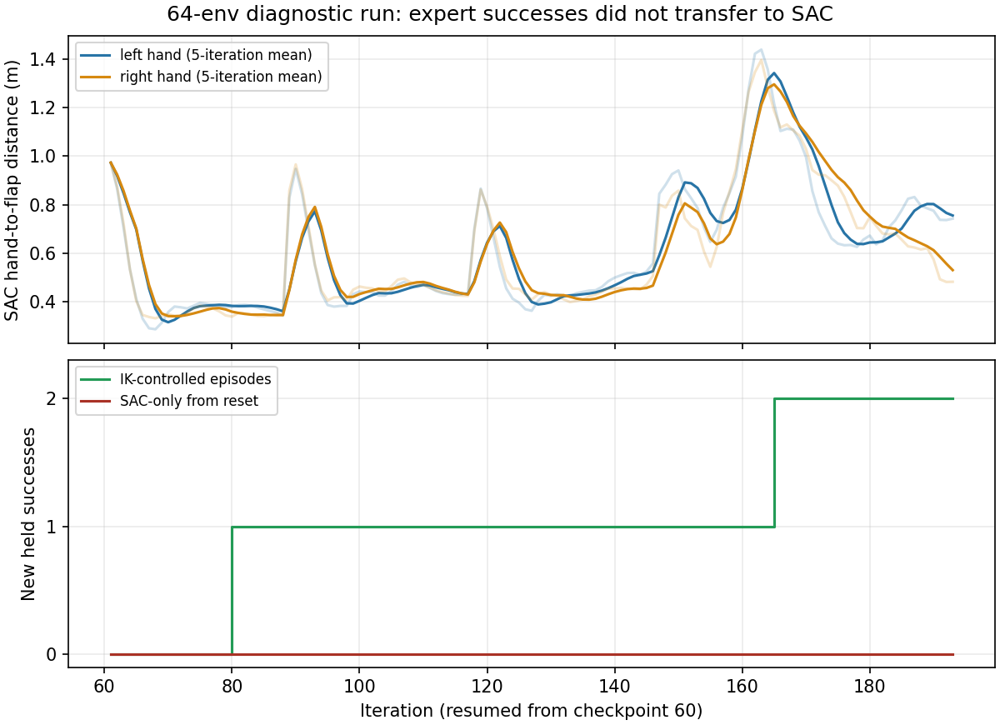

The previous GPU 3 follow-up is
`artifacts/rl/drive_runs/sac_mbv2_episodic_guidance_gpu3_20260930_2120/`,
64 environments and 180 additional iterations from policy checkpoint 60.
It uses `--online-ik-episode-fraction 0.2`, online correction labels, CPU
replay capacity 300,000, batch 1,024 and four updates/vector step. This keeps
64 sampled critic rows per new transition, matching the preceding 32-env
batch-512 pilot. The stored actor-update decay horizon/counter are preserved,
so the resumed expected IK fraction starts below 20%. Warmup is zero; real
online transitions refill uniform Q replay before updates. Existing imitation
and protected success data are restored. This is a measured recovery attempt,
not evidence of learned-policy success. Safety and task/reset contracts remain
unchanged.

The acquisition/pull pilot recorded one genuine held success at iteration 20:
bilateral opposing-flap pinch and proof lift remained valid for 0.267 s, and
the success reward and terminal transition were both present. This was an
**IK collection success**, not a learned SAC success. Its checkpoint includes
20,172 current-environment imitation labels and one protected success row.
The pilot was stopped after iteration 21; its final Drive upload was verified.

GPU 3 continued from that checkpoint in the distinct directory
`artifacts/rl/drive_runs/sac_mbv2_acquire_pull_transfer_gpu3_20260930_2035/`.
It retains 32 environments, the same acquisition/pull/body-assistance settings,
20,000 teacher-fit updates and online correction labels. Uniform Q replay is
not serialized, so 256 IK vector steps refill it before fitting the actor and
resuming SAC. The original 15,360-actor-update imitation decay horizon is
preserved by checkpoint restore; the new invocation requests 150 additional
iterations. Checkpoints are saved every 20 iterations, with five-minute Drive
verification and retention of the newest two verified checkpoints. It stopped
after iteration 67 with zero SAC successes and thirteen unsafe terminations;
the latest policy checkpoint is iteration 60. Large-scale training is still
conditional on SAC sustaining entry and grasp from reset. The follow-up uses
continued expert episodes, described below, while retaining the learned policy.

## Recorded policy failure and visual evidence

[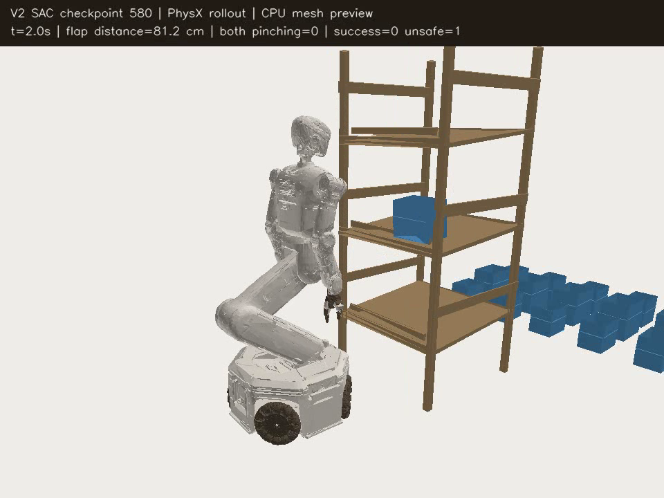](assets/rl_v2_policy_580_20260928.mp4)

[Play/download the original 2026-09-28 policy video](assets/rl_v2_policy_580_20260928.mp4).
This is deterministic checkpoint 580, evaluated for 90 control steps / three
seconds: zero successes and one unsafe termination. It renders CPU USD meshes
at actual live PhysX poses, rather than RTX screenshots. The late pose shows
failure to approach the flap; the image alone does not identify a gravity
feedforward malfunction. Upright torso X/Z control, actual target-error
telemetry and measured velocity diagnostics address the control uncertainty.
The recovery run logs gravity compensation ON and torso pitch/tracking errors.

The same video, scene image and controller-attributed metric plot are attached
natively in the [Notion experiment record](https://app.notion.com/p/3eb63918d42a81f694a9e060aeffe7cc),
with the problem, correction, method and measured limitation beside each.
The video is an earlier failure case, **not footage of the new policy**.
New success footage must be attributed to the controller that actually drove
it; an IK collection success is not SAC-from-reset success.

## Entropy target feasibility correction

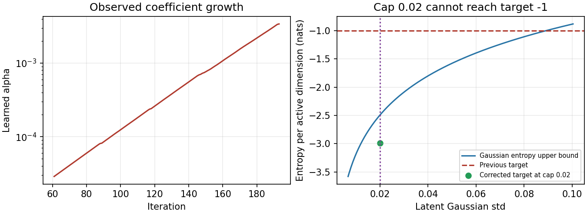

A further exploration defect was identified while the fresh run collected IK
warmup data: asymmetric SAC kept target entropy `-1` per active action despite
its latent Gaussian standard-deviation cap `0.02`. Even before tanh, the largest
available differential entropy is `log(0.02) + 0.5*log(2*pi*e) = -2.493` nats
per dimension. Tanh can only lower that entropy. The target was unattainable,
so increasing alpha could never satisfy it once variance reached the cap.
The preceding run's logged alpha rose from 0.0000288 at iteration 61 to
0.003408 at iteration 193 while std remained near 0.02. This demonstrates the
mismatch, but does not isolate it as the sole cause of policy failure.

Asymmetric SAC now targets the smaller of `-1` and the Gaussian upper bound
minus 0.5 nats per active dimension: `-2.993` at cap 0.02. Broad default caps
retain `-1`. Blocked grippers still contribute neither log-probability nor
entropy target. Target, active dimensions and signed entropy error are logged
and the entropy contract is recorded in checkpoints/manifests. This changes
training optimization, not physical action or task compatibility.

Validation: 42 SAC/demo CPU checks passed. The new regression places a zero-mean
actor at the 0.02 cap and confirms that alpha can decrease with the attainable
target, whereas the previous target would keep increasing it. The running
777e922 process does **not** hot-reload this change; it will be checkpointed
and relaunched before prolonged SAC optimization. Successful data and teacher
fit are to be preserved through that transition.

## Non-finite dynamics: isolation and data preservation

The observed exception arose during `scene.write_data_to_sim()` before reward,
termination and replay filtering could run. `gravity_drive_bias` checked the
whole batch and raised when any robot row contained a non-finite feedforward
or stiffness. Thus a single numerical problem could terminate every parallel
environment. The old logs do not identify whether gravity, inverse-dynamics
mass/Coriolis output or joint/root state first became invalid.

Only v2 SAC opts in to recovery. On a non-finite feedforward row, the common
writer calls the environment's ordinary partial-reset managers before the
next physics write, restores that row's drive target to its repaired measured
position and zeroes that failed write's feedforward/velocity/effort buffers.
Other rows retain their original targets and torque. Bad stiffness/configuration
and unsuccessful state repair still raise; the default writer remains strict.
The numerical mask persists across the control step and forces invalid-reset
termination. The SAC collector separately counts it as a numerical failure and
excludes its entire transition from Q, teacher imitation and success history.
Invalid/reset observations are not fitted into the normalizers. It is never reported as a grasp success.

`numerical_failure_episodes` and `numerical_failure_cause/*` record gravity,
feedforward, mass, Coriolis, joint-state and root-state causes where available.
The failing env IDs and cause counts also appear in the console. Persistent
recovery counts require investigation rather than being evidence of successful
learning. The recovery probe injects a force row, not a claim that all forms
of PhysX corruption are repairable.

Reproduce the small GPU-isolated probe:

```bash
CUDA_VISIBLE_DEVICES=3 PYTHONPATH=src \
  /path/to/isaac-python scripts/rl/probe_v2_numerical_recovery.py \
  --device cuda:0 --output /tmp/v2_numerical_recovery.json
```

Measured result: `passed=true`, failed env `[0]`, unaffected env `[1]`, only
row 0 reset, finite observations/feedforward, next-step failure flag cleared.
A completed-warmup checkpoint and an environment-step exception recovery
checkpoint now preserve policy, optimizers, teacher labels and successful tails.
Uniform replay remains memory-only and refills on restart.

## Reusable progress figures

Generate controller-attributed distance, held-success and outcome plots directly
from a run's completed `metrics.jsonl` rows. The command uses CPU only and emits
an image plus a JSON summary; it tolerates an unfinished trailing live-log row.

```bash
python scripts/rl/plot_v2_run.py --run-dir /absolute/path/to/sac_run \
  --output /absolute/path/to/progress.png
```

The success panel separates IK warmup, online IK and SAC from reset. Numerical
failures are separate from ordinary unsafe and timeout outcomes. Early warmup
plots do not establish that the learned SAC policy has improved.

## Baseline and scope

The preceding GPU 3 run `sac_mbv2_safe_front_gpu3_20260929_230917` stopped
at iteration 573 with zero bilateral pinches and successes. Its final Drive
upload was checksum-verified. The observed recent 100-iteration window at
iteration 465 had mean left/right flap distances of 1.165/1.202 m and zero
samples with both hands within 0.25 m of the front lanes. The run learned to
avoid failure without approaching the grasp.

The physical task remains bilateral opposing-flap grasp with proof lift,
S63/Leju two-finger grippers, rack rollers, upright torso X/Z control, rack
contact threshold 10 N, obstacle threshold 5 N, and no self-collision check.
No curriculum, easier reset distribution, or relaxed success predicate is used.

## Diagnosed causes and corrections

1. SAC used a floor alpha of 0.01 with about -14 summed action log probability
   and gamma 0.999. A continuing entropy contribution of roughly 0.14 per step
   was much larger than the signed distance progress, often around 0.0003.
   This can inflate the value of avoiding terminal contacts. The recovery
   profile uses alpha 0.001 initially, floor 0.00001, and no entropy term in
   the critic backup. Entropy remains in actor optimization. Actual Q, target,
   entropy contribution, and Gaussian standard deviation are now logged.
2. After demo behavior cloning, actor running normalization previously changed
   on every online vector step. This transformed the pretrained actor's input
   coordinates during rollout. Demo and initial reset observations now fit a
   fixed actor normalizer; the critic normalizer still updates online.
3. The flat actor received all 12 box slots and a target one-hot index. A new
   target-centric encoder gathers the selected token and retains robot state,
   rack/conveyor poses, hand–flap relations, skill state and previous actions.
   It initially had 174 features for the 440-D deployable contract (now 198
   features / 464-D after the controller-state correction below), so swapping
   logical box slots does not alter policy input. The critic keeps its full
   privileged observation.
4. The actor's untrained variance branch produced large random joint increments
   despite a pretrained mean. The recovery profile initializes that branch at
   standard deviation 0.15 and caps it at 0.3 by default. The second pilot uses
   0.08/0.15 and alpha 0.0001 with a 0.000001 floor. BC warmup has correlated
   noise; the new IK warmup uses temporally coherent servo actions.
5. Potential progress alone provided weak sustained learning signal before a
   success. Two bounded distance costs, 0.002 times each missing front-stage
   and reach score, distinguish remaining far from approaching. Their worst
   30-second total is 3.6, below the 6-point rack failure. SAC multiplies all
   rewards by 10 internally; logged task rewards remain in their original units.
6. Uniform replay overwrote the few useful near-flap transitions. A protected
   100,000-transition online buffer retains real transitions within 0.25 m of
   either flap or with pinch contact, and supplies 25% of critic batches when
   nonempty. It uses measured current-environment rewards, never legacy rewards.
7. Existing legacy demonstrations describe three independent torso-joint
   increments. Their converted rewards and next states cannot safely be treated
   as new-dynamics critic experience. They remain actor-only imitation data,
   with sampling starting at 20% and decaying over the first 30% of planned
   updates. The BC loss scale is now independent of that sample fraction.
   The loader also accepts newly recorded native 24-action upright-torso demos;
   old 25-action files still pass the explicit conversion path.
8. A batched IK collector uses current deployable poses and successful-demo
   wrist orientations to stage both hands outside the rack, insert, close,
   and propose a small lift. It uses the existing bounded teleop servo and
   writes through the shared RL action manager. Physical pinch and success
   are still measured by the unchanged environment. Its real transitions
   train Q and a separate initial actor imitation pass before IK is disabled.
   The teacher buffer retains the whole warmup up to online replay capacity,
   rather than just its last, possibly stationary, frames. Afterwards only
   SAC produces rollout actions; the initial 20% imitation batch mixes legacy
   and current-environment teacher samples and decays as configured.
9. Quest collection now converts its requested body angles into the upright
   torso's two X/Z action increments. The body mapper reset still receives
   three joint angles, preserving ordinary collection and legacy control.

## Execution and validation

`artifacts/rl/probes/bc_baseline_gpu3_20260930/sac_20260930_170035_1b5a43`
ran 8 environments for 30 iterations without SAC updates, using 5,000 BC
updates and zero warmup noise. Its best iteration-average left/right flap
distances were about 0.397/0.446 m. It had 16 unsafe terminations and no
bilateral pinch or success. Its offline MSE of 0.0079 did not establish a
successful deployed policy.

`artifacts/rl/probes/recovery_gpu3_20260930/sac_20260930_171227_d9628c`
was a 64-environment, 60-iteration recovery pilot, with 5,000 BC updates and
current-environment SAC updates after 8,192 valid warmup transitions. Early
actor-normalizer count stays at 974, and real near-flap samples populate the
protected buffer. It was stopped at iteration 26 after 343 unsafe terminations
and no bilateral pinch/success. Gaussian std reached about 0.65 before the new
cap was added. The mean hand distances had returned to about 0.9 m.

`artifacts/rl/probes/ik_entry_gpu3_20260930/sac_20260930_172823_a6a358`
completed 16 environments and 30 iterations with IK actions and no SAC updates.
At iteration 10, left/right mean flap distances were 0.074/0.077 m and 11.3%
of valid steps had bilateral pinch. The following iteration had 0.44% of steps
meeting instantaneous proof-lift/stability, but no successful held episode.
There were five unsafe and eleven timeout terminations. This establishes
useful physical exploration, not learned-policy success.

The subsequent 64-environment transfer pilot is
`artifacts/rl/drive_runs/sac_mbv2_ik_transfer_pilot_gpu3_20260930_1746/`.
It uses 384 vector steps of IK collection, 5,000 teacher imitation updates,
then SAC with 4 updates/vector step. Its 40 iterations test unguided SAC
rollout after transfer. Checkpoints are saved every ten iterations and
checksum-verified by the existing Drive supervisor every five minutes.

This first transfer pilot stopped just after initial imitation with
`A success terminal transition is missing its success reward`.
Partial resets invalidated a global grasp cache and recomputed all environments;
this added a second hold-time tick for environments that had not reset and
could consume their success-event latch before the next physical reward step.
The success tracker now accepts the physical step ID and advances each row at
most once per step; resetting one row clears only that row's timing. A CPU
regression reproduces the former early-success sequence. The fixed rerun is
`artifacts/rl/drive_runs/sac_mbv2_ik_transfer_fix_gpu3_20260930_1800/`.
Previously reported instantaneous/held IK milestones may include this timing
error; physical contact distances and bilateral pinch remain useful, but
successful held-grasp episodes must be checked again with the fix.

Checkpoints also retain the optimizer-update counter, imitation decay horizon
and completed teacher-fit flag. Resuming a trained actor does not reset its
demo schedule or refit it to the initial guide. Online replay still starts empty.

The fixed transfer pilot completed 30 iterations without the success-reward
error: three held-grasp successes were recorded during warmup/the mixed
handoff iteration. Pure SAC iterations 14-30 had no pinch/success, and final
left/right distances were 0.825/0.942 m. Total unsafe terminations were 409.
Teacher imitation MSE started near 0.0025 but rose to about 0.046 within the
first 300 SAC updates. Transferring the mean alone therefore did not preserve
entry behavior during online learning.

The next profile adds 500 critic-only updates before actor/temperature changes,
an online actor rate of 0.00003 (critic/imitation initialization 0.0003), a
stronger initial BC multiplier of 100 and Gaussian std 0.02/cap 0.05. Initial
alpha is 0.00001 with a 0.0000001 floor. The imitation sample fraction remains
20% and its decay counts actual actor updates, so critic warmup does not consume
the imitation schedule. Of this imitation batch, 80% comes from current IK
collection and 20% from the legacy demos when teacher samples are available.

A separate 10,000-row CPU buffer retains verified held-success terminal
transitions even after large uniform/near-flap buffers overwrite them. It
supplies at most 5% of a critic batch, capped by the number of available real
success rows, and is included in checkpoints for restart. It contains no
converted legacy reward. Logs distinguish `successful_warmup_episodes` and
`successful_sac_episodes`, with an explicit mixed handoff label.

This conservative pilot is
`artifacts/rl/drive_runs/sac_mbv2_conservative_pilot_gpu3_20260930_1822/`,
64 environments and 30 iterations. Add the following overrides to the command
below, using its new unique directory and `--max-iterations 30`:

```bash
--actor-lr 0.00003 --critic-warmup-updates 500 --demo-bc-strength 100 \
--initial-policy-std 0.02 --max-policy-std 0.05 \
--initial-alpha 0.00001 --min-alpha 0.0000001
```

## Controller-state observation correction

The conservative pilot completed without runtime errors but did not preserve
entry. One success was recorded after the actor took over an already advanced
IK episode; this does not establish success from reset. Even the actor-frozen
critic warmup moved away from the flaps, so untrained Q gradients are not the
only possible cause.

Joint increments accumulate into pending PD targets, while observations had
only measured position and velocity. Equal measured states can therefore have
different future motion under the same action. The deployable contract now
adds 20 ordered logical target-minus-measured-joint errors, three local base
commands, and one availability flag immediately before the previous action.
Actor/critic dimensions are 464/530; the target-centric actor has 198 inputs.
The dynamic base now reports measured `root_vel_w` instead of command velocity;
the kinematic base retains the command-derived twist. All policies using the
shared v2 observation builder receive this correction. Old controller targets
cannot be reconstructed reliably from demo actions alone; old 403/469 and
440/506 records use zeros with availability flag zero. New Quest collection
records the actual controller telemetry. Old checkpoints cannot be resumed.

The next GPU 3 pilot is
`artifacts/rl/drive_runs/sac_mbv2_controller_state_pilot_gpu3_20260930_1842/`,
64 environments, 60 iterations, 900 IK warmup vector steps (57,600 valid
transitions), 5,000 teacher-fit updates, std 0.01/cap 0.02, actor rate 0.00003,
500 critic-only updates, BC strength 100 and alpha 0.00001/floor 0.0000001.
The longer collection covers repeat episodes and gives unguided SAC more time
to run from new resets. Checkpoints save every 20 iterations, upload on the
existing five-minute Drive cycle, and retain only verified older files.
Success during collection is reported separately from SAC success.

## Labels on learner-visited states

The controller-observation pilot was stopped after iteration 40. Its frozen
actor initially reduced left-hand distance, but the right hand lagged and the
policy again drifted: final mean distances were 0.927/0.948 m, with no SAC
held success. Controller state alone is therefore insufficient. Offline
teacher MSE was 0.00213, illustrating that a small average joint-action error
can still accumulate into a different closed-loop path.

`--online-teacher-labels` enables current-pose IK correction labels on states
visited by SAC, without replacing the executed policy action. This is a
DAgger-style data collection option: teacher labels enter a separate
actor-only buffer containing observation/action, with no reward, next state,
or Bellman terminal flag. Critic replay always uses the action actually
executed and its measured reward. The teacher restages a hand pair when it
has drifted over 30 cm from the box. Label collection ends with the existing
20%-to-zero imitation schedule. It does not change the task reset distribution
or safety predicates. The option requires IK guidance and a successful demo
source for wrist orientations; the default remains disabled.

Checkpoints retain at most 100,000 teacher labels (about 186 MiB at 464/24
float32 dimensions) and restore them for resumed actor imitation. Actual
success transitions remain in their independent critic buffer. Initial
collection labels no longer store duplicate critic/reward fields, reducing
CPU memory and preventing counterfactual Q data.

The next test uses 16 environments, 60 iterations, 900 IK vector steps,
5,000 teacher-fit updates, 500 critic-only updates, std 0.01/cap 0.02 and
BC strength 1000. The stronger multiplier constrains early Q-driven changes;
the sample fraction still starts at 20% and decreases. It is a pilot setting,
not a measured successful profile.

## Obstacle guard did not match the documented task contract

A subsequent source audit found that the obstacle guard still used net robot
contact minus rack vectors. Contrary to `RL_MULTI_BOX_V2_PILOT.md`, it therefore
included task boxes and floor, and could also sum or cancel multiple contacts
on one body. Fingers were omitted but gripper bases were not. This is a real
common-environment discrepancy; it can penalize box handling, but the existing
aggregate logs cannot prove which object caused each historical termination.

The guard now uses explicit robot-body-to-workcell pair filters. In the
current v2 scene the obstacle list is the conveyor surface, two rails and
four legs. Task boxes and ground are absent by construction. Rack/rollers
retain their separate 10 N filter; the conveyor guard remains 5 N, with the
maximum individual pair magnitude rather than a net resultant. Seven extra
filtered vectors per collision-relevant robot body require about 1.64 MiB
of output tensors at 2,048 environments, apart from sensor/PhysX overhead.
No additional box-pool pair filters are created. Quest contact markers and
reward calibration use the same filtered forces and separate thresholds.
Future workcell obstacles must be added through `eligible_obstacle_targets`.
The actor never receives these privileged contact filters. SAC logs
`unsafe_obstacle/<Surface|RailLeft|RailRight|Leg0..3>` and each object's
maximum eligible force, using pre-reset snapshots.

The already started teacher-label pilot is stopped before completion so the
next test uses this corrected safety contract. Its partial run is not used as
a success-rate comparison. New manifests include an explicit contact contract,
and old-contract SAC checkpoints are rejected on resume.

## Pilot result and VR grasp retargeting

The corrected-contact/online-label pilot completed all 60 iterations and its
final checkpoint/logs passed Drive verification. SAC distances reached
0.302/0.295 m at iteration 51, versus about 0.93/0.95 m in the earlier pilot,
but physical SAC pinch and held success remained zero. Imitation reached zero
at iteration 52 and the behavior deteriorated; final distances were
0.544/0.869 m. This is improved entry, not a successful grasp policy. The
16- versus 64-environment runs also differ in several settings, so the result
is not an isolated causal ablation.

The IK guide supplied bilateral contact but no held-success episode in this
pilot. Its grasp location was the neutral flap center and its wrist lift only
25 mm; a flexible flap can move without lifting the box. The existing VR
successes grasp about 7.4/8.1 cm along the flap and 1.8 cm above the neutral
center, rather than exactly at its center. These are measured demonstration
offsets, not a claim that all center grasps are physically impossible.

`--ik-grasp-goal demo` retargets a physically annotated successful grasp offset
onto the new perceived neutral flap center. Live inference still uses only
pose/proprioception; contact annotations choose the reference offline. Missing
physical pinch annotations cause an error instead of accepting closed-jaw
commands as success. `--ik-lift-distance-m` controls the proposed wrist motion
(8-150 mm) separately from the unchanged 8 mm box clearance / 0.25 s success
predicate. The default center/25 mm guide is retained as an option. Observation
relations remain neutral flap centers as requested.

The follow-up GPU 3 run is
`artifacts/rl/drive_runs/sac_mbv2_vr_goal_pilot_gpu3_20260930_1958/`, 32 environments,
120 iterations, 900 IK vector steps, 20,000 teacher imitation updates,
demo grasp offsets and an 80 mm wrist lift. It keeps actor rate 0.00003,
critic warmup 500, std 0.01/cap 0.02 and BC strength 1000. For this diagnostic
run imitation decays across the full planned run (`--demo-decay-fraction 1`)
rather than vanishing before the policy's first complete approach episode.
It still starts at 20% and decreases; no curriculum or terminal relaxation is
introduced. A large run must scale minibatch/update count with the number of
environments: the 16-environment pilot sampled 128 critic rows per new
transition (4 updates * 512 / 16). Keeping four updates with 2,048 environments
would reduce that ratio to 2 with a 1,024 batch, which is not the same learning
profile. Monitor real held success and unconstrained SAC performance before
calling any of these settings solved.

## Acquisition pose and body reach assistance

The final-VR-pose-first guide produced no physical pinch in its early rollout,
although several environments reached its close/lift command phase. A closing
command is therefore not evidence of grasp. The pilot was stopped and its
partial data is not considered a successful teacher dataset.

`--ik-grasp-goal center-to-demo` now acquires at the neutral flap center and
only then proposes the demonstration-offset pull plus wrist lift. This keeps
the reference's final pose from replacing the initial acquisition pose.
`--ik-base-clearance-m` and `--ik-torso-forward-m` expose the previously fixed
0.65 m base clearance and zero forward-torso assistance. The next pilot uses
0.55 m clearance and up to 0.10 m upright forward translation while a hand
is still more than 5 cm from the goal. The standard torso solver retains its
15 cm forward and pitch limits; after lift begins, body commands stop.
All rack/obstacle contacts remain subject to the same 10 N / 5 N checks.
These settings affect exploration labels, not task reset difficulty or actor
observation geometry. Defaults preserve the earlier center/0.65 m/no-forward
profile for comparisons.

The acquisition/pull pilot directory is
`artifacts/rl/drive_runs/sac_mbv2_acquire_pull_pilot_gpu3_20260930_2014/`,
32 environments with 120 iterations originally planned. It recorded its first
held IK success at iteration 20 and stopped after iteration 21 with eleven
unsafe terminations. Its checkpoint was used for the transfer continuation
described above, rather than discarding the first new successful transition.
This also shows why an early zero-pinch window is not enough to declare the
collector incapable; the continuation still needs a learned-policy check.

## Continued expert collection and deployable closing evidence

The 20,000-update transfer fit reached MSE 0.000732, but after the first
actor-frozen SAC rollouts the hands again moved roughly 0.7 m away. No held
SAC success was observed through iteration 54. Increasing offline fit alone
therefore did not establish a usable entry controller.

`--online-ik-episode-fraction 0.2` adds episode-stable expert collection while
SAC continues to optimize. Each new episode is assigned to IK with the
configured initial probability, declining with the stored actor-update
imitation schedule. An active episode keeps its assignment until termination;
the default zero retains pure SAC behavior. This is an additional collection
option, separate from the 20% actor-imitation minibatch. Q replay receives the
actual executed action and measured reward for both controllers, with no
invented next state. Reset distributions, success criteria, action dimensions
and collision thresholds are unchanged.

Logs separate online IK/SAC distances, bilateral pinch and held successes.
`successful_sac_from_reset_episodes` excludes episodes that first used warmup
or expert actions, so a handoff cannot appear as end-to-end SAC success.

The correction guide also previously advanced its close counter whenever it
*proposed* closed jaws, even when SAC had actually left them open. Lift readiness
now requires both actual close commands and measured closure over 50%, for the
same 15 ticks. This controller telemetry is deployable and does not substitute
for the unchanged physical contact/success checks. CPU regressions cover
hypothetical closing, episode-stable sampling, decay-at-reset and warmup
handoff attribution. Related SAC/demo checks pass: 37 tests.

To enable continued collection on either the direct SAC entrypoint or Drive
supervisor, add:

```bash
--guided-warmup-mode ik --online-teacher-labels --online-ik-episode-fraction 0.2
```

## Graceful stop and final-checkpoint preservation

Several requested pilot stops raised `KeyboardInterrupt` inside Isaac's foreign
callbacks, which could swallow it and allow more Python iterations before the
supervisor's 120-second owned-child timeout. Only the last periodic checkpoint
survived in those cases. V2 SAC now installs deferred stop handlers, checks the
request after a complete transition/update, saves the current partial iteration
atomically and exits with explicit `stopped` status. The supervisor accepts that
status only when it initiated the stop; an unexpected zero-exit `stopped` run
remains an error. Existing immediate handlers for other runners are preserved.
Checkpoint retention/Drive finalization rules are unchanged, and stopped runs
are not labelled naturally completed training.
Related checks pass: 38 SAC/demo tests and 12 supervisor lifecycle tests.

The first episodic continuation initialized correctly but the checkpoint's
strict exploration-dictionary comparison rejected the new collection fraction.
Compatibility now permits changing only `online_ik_episode_fraction`; actor
features, observations, actions, reward and contact contracts remain checked.
The failed initialization's final logs were Drive-verified before retry.

## Reproduce the transfer pilot

Discover the existing host-local remote with `bash scripts/rl/gdrive.sh listremotes`
and set `RL_DRIVE_REMOTE_ROOT='<remote>:HumanoidScene-RL'` privately. Use a new
`--experiment-dir`; the supervisor creates it and refuses an existing folder.

```bash
CUDA_VISIBLE_DEVICES=3 python scripts/rl/sac_with_drive.py \
  --experiment multi-box-v2-grasp --robot-model s63 --gripper leju-twofinger \
  --experiment-dir artifacts/rl/drive_runs/<unique-experiment-name> \
  --gpu 3 --num-envs 64 --max-iterations 40 --rollout-steps 32 \
  --batch-size 512 --updates-per-step 4 \
  --replay-capacity 150000 --replay-device cpu \
  --learning-starts 0 --warmup-vector-steps 384 \
  --demo-dataset examples/demos/v2_grasp_quest_success.hdf5 \
  --demo-pretrain-steps 1000 --guided-warmup-mode ik --teacher-pretrain-steps 5000 \
  --initial-alpha 0.0001 --min-alpha 0.000001 \
  --initial-policy-std 0.08 --max-policy-std 0.15 --demo-bc-strength 20 \
  --save-interval 10 --no-self-collision \
  --remote-root "$RL_DRIVE_REMOTE_ROOT" \
  --gpu-limit-mib 12000 --gpu-reserve-mib 0 --max-seconds 7200
```

With `--guided-warmup-mode bc`, the original actor-guided noisy collector is
retained. `--no-demo-guided-warmup` selects bounded random exploration.
The same options work on `scripts/rl/multi_box.sh grasp-v2-sac` directly,
without the Drive/resource-supervisor flags.

Compare `rollout_policy`, per-hand distances, bilateral pinch, stable/opposing
flap/proof-lift fractions, maximum continuous hold time and `termination/success`.
Only the last establishes completed held-grasp episodes. New source and
observation contracts require a fresh run; an incompatible checkpoint is rejected.

Focused tests cover target-slot invariance, fixed normalization under online
distribution shift, the absence of an idle entropy bonus in critic targets,
distance-cost bounds, native/legacy demo loading, terminal observations,
reward composition, contact attribution and upright-torso kinematics.

Notion record: https://app.notion.com/p/3eb63918d42a81f694a9e060aeffe7cc

Related primary-source approach:
[Efficient Online Reinforcement Learning with Offline Data / RLPD](https://github.com/ikostrikov/rlpd).
The recovery changes do not claim to implement the full RLPD algorithm.
