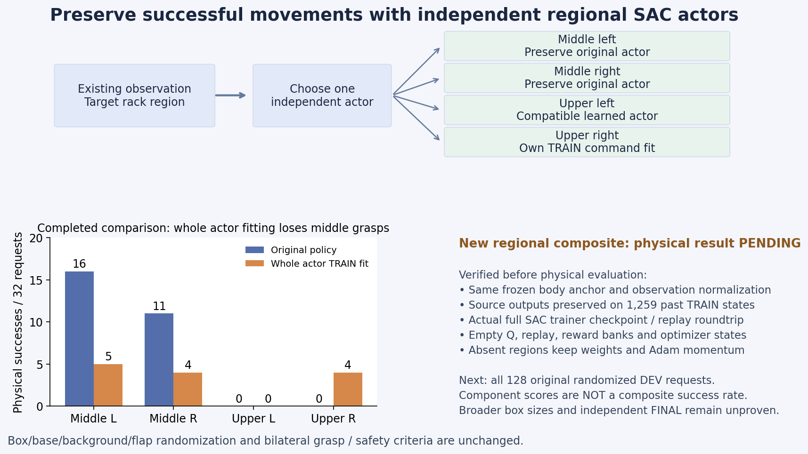

# 구역별 SAC actor로 기존 성공 동작을 보존하는 비교

자기 TRAIN 성공 명령으로 초기 actor를 1,000회 보강하니 상단 오른쪽은
0→4/32회 성공했지만 중간 왼쪽16→5, 오른쪽11→4회로 내려갔다.
전체27→13/128회이므로 개선으로 세지 않는다. 작은 SAC actor 갱신도
전체27→28→18회였으며, 구역 간 동작 간섭을 줄이는 별도 비교를 준비했다.
[실제 초기화 후보 평가](RL_V2_ACTOR_MEMORY_INITIALIZATION_20261007.md).

## 무엇을 바꿨는가

기존 하나의 actor 대신 중간/상단·왼쪽/오른쪽에 각각 독립 actor를 둔다.
이미 관측에 있는 목표 박스의 랙 구역 토큰으로 사용할 actor를 결정한다.
새 정답 정보나 평가 데이터가 관측·학습 데이터에 추가되는 것은 아니다.

| 구역 | 초기 actor 출처 |
| --- | --- |
| 중간 왼쪽·오른쪽 | 기존27/128 초기 정책의 해당 구역 동작 보존 |
| 상단 왼쪽 | 동일 제어·정규화에서 해당 구역2/32였던 SAC actor702회 모델 |
| 상단 오른쪽 | 자기 TRAIN 명령 초기 보강 후 해당 구역4/32였던 후보 |

각 출처의 점수를 더한 값은 새 정책의 성공률이 아니다. **새 조합의 원래
DEV128개 평가가 필요하다.** 구역별 초기 actor는 DEV로 선택한 모델이며,
DEV 전이는 학습에 넣지 않는다. 독립 FINAL은 아직 사용하지 않았다.

각 actor는 SAC와 기존 실제 성공 명령 유지 손실로 계속 학습할 수 있다.
특정 구역이 batch에 없으면 해당 actor의 gradient와 Adam momentum을
갱신하지 않는다. Q·entropy와 보조 손실·학습률·제어는 그대로다. 이전 후보의
학습된 Q·optimizer·reward replay를 가져오지 않고, 기존 검증된 actor 전용
TRAIN 기억12,476행만 보존한다.

실제 후보들의 몸체 기준·고정 prior·관측 정규화·동작 및 물리 계약을 대조했다.
기존 `actor1e-6`, `Q/entropy3e-4`, 박스/base/배경/움직이는 단단한 flap
무작위화, 양손 pad5N·hold0.25초·proof lift8mm, rack10N·장애물5N·
self collision OFF를 유지한다. 접근 제어기로 작업 위치에 도달한 뒤 base를
유지하고 몸체19개 목표와 그리퍼2개를 SAC로 조절한다.

## 확인한 범위

구역별 출력·드문 구역의 정규화·다른 구역의 Adam 상태 보존·실제 SAC
critic 동일성·저장 출처 보호를 검사했다. 관련43개가 통과했으며 CUDA
전용 기존2개 검사는 CPU 검사에서 제외했다. 실제 full SAC trainer의
저장·재개를 확인했고 과거 TRAIN1,259개 상태에서 exporter·trainer·선택한
기존 후보의 greedy 및 같은 seed의 Gaussian 동작이 정확히 같았다.
새 actor/Q 카운터·replay·성공 보상 및 return 은행·4개 optimizer 상태는0이고
actor parameter는 학습 가능하다. 구역별 초기화 출처도 저장·재개·report에
보존한다. **이는 복원·학습 연결 확인이며 새 물리 성공률은 아니다.**
[실제 학습기·재개·출력 근거](assets/rl_v2_regional_actor_fulltrainer_preparation_20261008.json).

## 사용법

```bash
CUDA_VISIBLE_DEVICES='' PYTHONPATH=src:scripts/rl python scripts/rl/prepare_regional_actor.py \
  --initial-checkpoint /absolute/path/to/pristine_memory/checkpoint_00000000.pt \
  --training-manifest /absolute/path/to/pristine_memory/training_manifest.json \
  --waypoints /absolute/path/to/pristine_memory/waypoints.json \
  --training-waves /absolute/path/to/pristine_memory/training_waves.json \
  --component shelf_2_left /absolute/path/to/original/checkpoint.pt \
  --component shelf_2_right /absolute/path/to/original/checkpoint.pt \
  --component shelf_3_left /absolute/path/to/protected_UL/checkpoint.pt \
  --component shelf_3_right /absolute/path/to/protected_UR/checkpoint.pt \
  --output-dir /absolute/path/to/new_regional_initialization
```

초기 입력은 미학습 actor-memory 상태만 허용한다. 몸체 기준·정규화·
제어·물리 계약이 다른 후보나 이미 갱신된 Q/replay로 초기화하면 거부한다.
관측과 action 차원은 같고 기존 checkpoint dispatch로 학습·eval 모두 복원한다.

현재 실제로 검증된 크기는 small 한 가지다. 중간 선반 medium 추가에는
크기별 실제 TRAIN 작업 위치 측정이 필요하다. 구역별 분리는 크기 일반화나
전체 작업 완료를 증명하지 않는다. Curriculum·박스 고정·안전 조건 완화는 없다.

## 실제 평가 시작

10/08 01:21 KST에 GPU3에서 원래 네 구역32개씩 DEV128개를 시작했다.
실제 writer287283의 소유자·고유 run·CUDA3를 확인했고 환경 초기화를
진행했다. 소스05124a6은 main에 push된 상태다. 별도 SAC3개는 그대로
진행하며 이전 장기 비교는 계획을 마치고 정상 종료했다. 모델을 고정하고
actor·Q·normalizer·replay 갱신을 끈 평가이며 새 조합의 성공률은 대기 중이다.
대표 env0·85·90·15·3을 녹화하지만 재실행의 성공을 미리 가정하지 않는다.
기존 Drive 백업은 인증 오류로 대기 중이므로 미검증 원본은 로컬에 보존한다.



아래 막대는 초기 actor 보강 후보의 완료한 실제 평가다. 구역별 새 조합의
성공률이 아니다. 위 도식의 후보들은 같은 몸체 기준과 관측 정규화를 사용한다.

실제 DEV0에 진입한 뒤 actor/Q/replay0·학습 비활성화와 checkpoint·agent·
진행 계약 및 구역별 초기화 출처의 정확한 일치를 확인했다.
[실제 평가 진입·GPU3 격리](assets/rl_v2_regional_actor_actual_frozen_DEV_launch_20261008.json).
노션에도 같은 구조·비교 그림을 네이티브 image로 첨부했고 기존39개 media와
5개 native table의 내용·순서를 그대로 유지했다. 현재 media는40개다.

GPU3에서도 실제 full trainer 복원과 같은 모델·빈 optimizer를 확인했다.
실제 과거 TRAIN64행을 cuda:0에서 샘플링해 구역 선택과 body·jaw 손실의
forward/backward가 유한하고 네 head 모두 학습 가능한 것을 확인했다.
Optimizer step이나 가짜 Q 전이 저장, 기존 실행 변경은 하지 않았다.
[실제 GPU 복원·표본·경사 검사](assets/rl_v2_regional_actor_GPU_restore_and_gradients_20261008.json).
