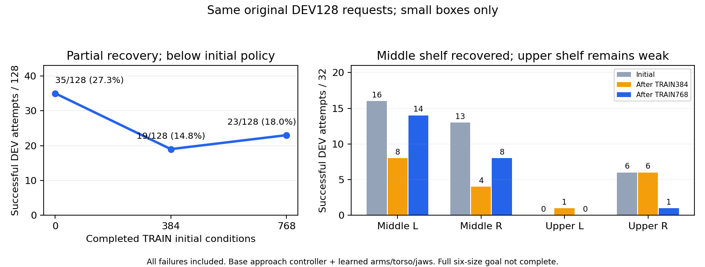

# 구역별 정책의 초기 평가와 실제 SAC 진행

## 최신 확인: 35→19→23/128, 직전보다 회복했지만 초기보다 낮음

2026-10-08 06:15 KST에 두 번째 학습 후 전체128개 DEV 결과와 같은 모델을
확인했다. TRAIN768조건 이후 **23/128(18.0%)**이며 직전19/128(14.8%)보다
4건 늘었다. 초기35/128(27.3%)에는 못 미치며 안정적인 학습 개선으로 단정하지
않는다. Actor1,899회·Q9,644회인 평가 모델을 보존했고 SHA256·유한성·실제
환경 계약을 확인했다.

| 구역 | 초기 성공 /32 | 첫 학습 후 /32 | 두 번째 학습 후 /32 |
| --- | ---: | ---: | ---: |
| 중간 왼쪽 | 16 | 8 | 14 |
| 중간 오른쪽 | 13 | 4 | 8 |
| 상단 왼쪽 | 0 | 1 | 0 |
| 상단 오른쪽 | 6 | 6 | 1 |
| 전체 | 35 /128 | 19 /128 | 23 /128 |

중간 선반은 직전보다 회복했지만 상단 오른쪽은6→1건으로 줄었다. 최신 실패는
랙 충돌63·박스 낙하1·시간 초과40·초기 무효1건이다. 초기와 최신에서 모두
배치가 유효한116조건에서도35→20건이며 성공을 잃은17조건·새 성공2조건이다.
동일 요청이지만 실제 flap 추첨·접촉 이력까지 일치한 반복이라고 가정하지
않는다. 이 점수는 small 박스만의 개발 평가이며 여섯 크기·구역의 전체 목표나
손대지 않은 FINAL 결과가 아니다. 새 Q 근거 보강 비교와 크기별 파지 분석은
별도로 계속한다.
[두 번째 전체 평가·동일 모델·공통 조건](assets/rl_v2_regional_actor_second_learned_full_DEV23_20261008.json).

## 첫 학습 후35→19/128 기록

2026-10-08 04:58 KST에 같은 원래128개 DEV의 완료 결과를 확인했다.
새 실행의 **초기35/128(27.3%) → 학습 후19/128(14.8%)**로 개선되지 않았다.
평가와 정확히 대응하는 actor695회·Q4,826회 모델을 보존하고 checksum과 실제
환경 계약·모든 모델의 유한성을 확인했다. TRAIN384조건 이후 평가다.

| 구역 | 초기 성공 /32 | 첫 학습 후 성공 /32 |
| --- | ---: | ---: |
| 중간 왼쪽 | 16 | 8 |
| 중간 오른쪽 | 13 | 4 |
| 상단 왼쪽 | 0 | 1 |
| 상단 오른쪽 | 6 | 6 |
| 전체 | 35 /128 | 19 /128 |

랙 충돌71·시간 초과37·초기화 무효1건을 원래 분모에 포함했다. 양쪽 모두
초기화가 유효한116조건에서도35→15건이며, 성공을 잃은23조건·새로 성공한
3조건이다. 동일 요청이지만 실제 flap 추첨·접촉 이력까지 일치한다고 가정하지
않는다. 상단 왼쪽1건은 전체 성능 회귀를 상쇄하지 못한다.
[완료된 전체 평가·동일 모델·공통 조건](assets/rl_v2_regional_actor_first_learned_full_DEV19_20261008.json).

### 회귀 모델의 TRAIN 동작과 학습 경사

초기 모델과 평가 모델695를 동일한 과거 성공TRAIN1,024관측에 입력했다.
상단 오른쪽의 몸체 목표MSE는0.0000441→0.000376으로 커졌지만 실제 기록에서
양손을 닫았던54관측은 두 모델 모두54개를 닫았다. 중간 왼쪽은 목표MSE가
0.00358→0.00286으로 줄었어도 새 물리 DEV 성공은16→8건이었다. 따라서 단순한
그리퍼 닫기 상실이나 전체 MSE 하나로 이번 회귀를 설명하지 않는다.

모델695의 실제 완료TRAIN 성공 은행에서64관측을 뽑고, production actor의
옛·새 성공 기억64개 표본과 같은 손실을 계산했다. 네 추첨에서 Q 경사와
성공 유지 경사의 cosine은−0.45..−0.27, Q 경사 크기는 성공 유지 전체 경사의
2.5..3.4배였다. 실제 성공 동작과 반대인 Q 신호가 유지 손실보다 강한 원인
후보다. **이 Q 표본은 성공 경로 부분집합이며 실제 production replay batch,
Adam 갱신이나 새 물리 재생을 측정한 것이 아니다.** 이를 전체 원인 확정이나
수정 후 성능으로 보고하지 않는다. 동일 모델·정규화·optimizer·원본을 바꾸지
않았고 평가 경험·live replay는 읽거나 학습에 가져오지 않았다.
[동일 TRAIN 명령·손실 경사 진단](assets/rl_v2_regional_actor_DEV19_TRAIN_command_gradients_20261008.json).

04:58에 writer712296의 소유자·실행 경로·CUDA3을 재확인했다. 새 TRAIN640조건을
완료한 뒤 다음 TRAIN 배치에서 actor1,127회·Q6,556회·온라인292,513전이로
진행했다. 이전 기억 SAC도 writer3445610이 계속 실행하며 최신 완료 평가가
27→25→16→20/128로 일부 회복했지만 초기보다 낮았다. 서로 다른TRAIN 배치의
성공 수를 동일 DEV 개선으로 해석하지 않는다. 아래는 이전 시점의 기록이다.

2026-10-08 03:19 KST 확인 기준이다. 새 구역별 SAC 실행은 초기 전체 평가에서
**35/128회(27.3%)** 성공했다. 이전 초기 정책의27/128회(21.1%)보다8건 높지만,
actor·Q 갱신이 모두0인 **초기 정책 조합의 결과**다. 추가 SAC 학습의 개선으로
보지 않는다. 별도 고정 평가34/128과도 서로 다른 실행이다.

| 구역 | 요청 | 새 실행 초기 성공 |
| --- | ---: | ---: |
| 중간 왼쪽 | 32 | 16 |
| 중간 오른쪽 | 32 | 13 |
| 상단 왼쪽 | 32 | 0 |
| 상단 오른쪽 | 32 | 6 |
| 전체 | 128 | 35 |

랙 충돌49건·시간 초과33건·초기화 무효11건도 원래128개 분모에 포함했다.
양쪽 초기화가 모두 유효한117조건에서도27→35건이며, 성공을 잃은 조건2개와
새로 성공한 조건10개가 있다. 요청한 초기 배치가 같더라도 실제 flap 추첨과
접촉 이력까지 동일하다고 가정하지 않는다. 단일 평가의 소폭 차이를 안정적인
일반화로 단정하지 않는다.

성공35건 모두 안전한 양손 opposing flap 접촉·0.25초 유지·8mm 지지면
clearance를 확인했다. 새 실행의 실제 초기 단계 기록과 닫힌 체크포인트를
연결했고, 저장된 모델·초기화의 tensor227개가 원래 입력과 정확히 같다.
이227개는 warm source optimizer까지 포함한 체크포인트 구조이며 고정 물리
진단의 runtime module198개 검사와 별개다.
[초기 전체 평가와 같은 모델](assets/rl_v2_regional_actor_fresh_SAC_complete_initial_DEV35_20261008.json).

## 추가 학습 자체는 아직 개선되지 않았다

- 기존 성공 동작 기억 SAC: **27→25→16/128**. 두 번째 평가는actor2,431회·
  Q11,772회와 대응한다. 중간 좌12·우4, 상단 양쪽0이며 랙 충돌50·시간 초과61·
  초기화 무효1건이다.
  [같은 모델의 두 번째 전체 평가](assets/rl_v2_actor_memory_second_full_DEV16_successes_20261008.json).
- 작은 actor 학습률의 별도 비교: **27→28→18→10→12/128**으로 정상 종료했다.
  마지막 평가는actor4,344회·Q19,422회와 대응한다. 중간 좌11·우1, 상단 양쪽0이다.
  [같은 모델의 마지막 전체 평가](assets/rl_v2_return33_conservative_final_full_DEV12_20261008.json).
- 새 구역별 SAC는GPU3에서 실제 writer712296의 소유자·실행 경로·
  `CUDA_VISIBLE_DEVICES=3`을 확인했다. 첫 TRAIN128조건에서28회 성공했고,
  03:19의 다음 TRAIN 진행은Q1,860회·actor0회·온라인85,549전이다.
  먼저Q를 준비하는 구간이며 학습 후 전체 DEV 점수는 아직 없다. 서로 다른
  TRAIN 조건과 탐색이 포함된 성공 수를 DEV 성공률 개선으로 해석하지 않는다.

## 지금 확인하는 병목과 남은 범위

상단 왼쪽의 유효29조건은 모두 시간 초과였다. 나머지 구역은 손·팔과 랙의
충돌이 주요 실패다. 실패 시 최대 힘을 보인 링크는 접촉 이력의 최초 원인을
뜻하지 않으므로 이 기록만으로 정확한 원인 관절을 단정하지 않는다.

03:18 KST에GPU0만 격리한 실제 크기별 TRAIN 접근 진단을 추가로 시작했다.
16개 새 초기 조건에8개 접근 후보를 비교하는128회 시도다. 중간 선반은실제
small/medium, 상단은small을 사용한다. 정책은 고정하고 medium 후보를small의
측정된 성공 위치로 표시하지 않는다. 물리 결과는 아직 대기 중이다.
[크기별 진단 방법과 사용법](RL_V2_SUPPORTED_SIZE_WORKPLACE_20261008.md).

보고한 성공률은small 박스만의 개발 평가다. 접근 이동은 별도 제어기가 맡고
SAC는 접근 후 양팔·상체·그리퍼를 제어한다. 박스·base·배경·움직이는 flap의
무작위화와 성공·충돌 기준을 유지했다. 중간medium, 네 구역의 안정적인 성능과
손대지 않은 독립FINAL은 여전히 미확인이다. 평가 경험을 학습에 넣지 않는다.
기존 Drive 인증 오류 동안 미검증 원본은 보존하고 새 인증이나 공유 변경은
하지 않았다. 다른 사용자의 프로세스를 종료하지 않았다.

## 04:00 KST 이후 진행

새 SAC는TRAIN384조건을 마쳤다. 세 배치의 성공은28→29→15/128이며 서로
다른 시작 조건과 탐색이 포함돼 동일 DEV의 성능 변화로 해석하지 않는다.
04:00에 첫 학습 후 전체 DEV128 평가를 시작했고, **actor695회·Q4,826회**와
온라인215,691전이의 실제 평가 모델을 따로 보존했다. 이 모델의 전체128회
성공 수는 아직 대기 중이다. 초기35건 대비 개선을 확인하기 전에는 학습이
잘된다고 단정하지 않는다.
[첫 학습 후 평가와 같은 모델 보존](assets/rl_v2_regional_actor_DEV4_matching_model_20261008.json).

첫 크기별 진단은 정상 종료했고 성공4·안전 위반59·시간 초과35·초기화
무효30회였다. **medium32회 중28회가 파지 전에 원래 배치 무효**였으며 성공은
모두 중간 왼쪽small이었다. 04:03 KST에GPU0에서 같은16조건을 반복하는
read-only 초기화 trace를 시작했다. 이는 원인 진단이고 새 독립 TRAIN 확인이나
medium 파지 성공이 아니다. GPU3 SAC는 계속 실행한다.
[닫힌 크기별 결과·배치 원인 진단](RL_V2_SUPPORTED_SIZE_WORKPLACE_20261008.md).
