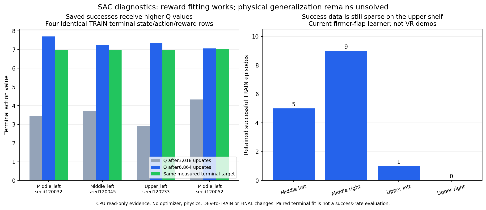

# SAC 성공 보상 학습과 지역별 충돌: 2026-10-06

Randomization을 유지한 네 영역의 안정적인 양손 파지 성공은 아직 달성하지 못했다.
GPU3의 firmer dynamic flap 학습과 GPU0의 nominal 비교 학습은 유지한다.
이전 goal turn은 안전 처리 수정·실제2-env 검증·SAC 상태 복원과 재개를 완료한
progress였다. 이번 기록은 새 전체 평가와 실제 TRAIN 데이터의 읽기 전용 진단이다.

## 전체 물리 평가

| 전체 원본 DEV128 | 중간 왼쪽 | 중간 오른쪽 | 위 왼쪽 | 위 오른쪽 | 전체 |
|---|---:|---:|---:|---:|---:|
| GPU0 nominal, actor2476/Q11952 |2/32|2/32|0/32|0/32|4/128|
| GPU0 nominal, actor3231/Q14972 |0/32|3/32|2/32|1/32|6/128|
| GPU3 firmer flap 재개, actor1204/Q6864 |2/32|4/32|0/32|0/32|6/128|

GPU0에서 상단 성공이 새로 관측됐지만 중간 왼쪽 성공을 잃었다. 안정적인 증가나
일반화 성공으로 해석하지 않는다. GPU3의 재개 baseline도6/128로 개선이 없다.
GPU0/3는 flap 물리와 정책 관측·제어가 달라 동일 조건의 강성 인과 실험이 아니다.
초기 무효는 각 분모128에 남기며, 같은 요청 seed라도 실제 reset 물리 상태가 같다고
가정하지 않는다. 독립 FINAL은 사용하지 않았고 평가 transition은 Q에 넣지 않았다.
[전체 raw DEV 결과·원인·검증 비교](assets/rl_v2_firm_vs_nominal_full_DEV_20261006.json)를 남겼다.

GPU3 baseline은 초기 무효30, success6, unsafe70, timeout22다. 겹칠 수 있는 안전
원인은 rack46, box speed22, lift limit11, workspace3, drop4다. Workspace에 포함된
`base_projection_invalid`1개는 새 guard가 실제 rollout에서 실패/reset 처리했다.
다른 환경과 전체 배치는 계속 진행해 이전의 전역 좌표 변환 예외를 피했다.
NaN quarantine이나 성공으로 바꾼 사례가 아니다.

해당 seed121202의 실패 기록에는 box 선속도가 약1.2×10^7m/s이고 위치가
수만m인 비정상적으로 큰 유한 값도 있었다. 평범한 중력에 의한 전도로 원인을
단정하지 않는다. Guard는 이런 상태가 전체 actor 좌표 변환을 중단시키는 문제를
막았지만 물리 불안정 자체를 해결한 것은 아니다. 큰 terminal next 관측은 종료
mask로 bootstrap하지 않으며 요청 실패는 분모에 남긴다. 추가 물리 원인은 열린
HDF를 강제로 읽지 않고 닫힌 기록 및 동결 진단으로 이어서 확인한다.

상단 오른쪽은 초기 유효25개 전부 robot–rack 충돌로 종료했고 그중21개는
오른 gripper base에서 최고 힘이 나왔다. 상단 왼쪽은 유효29개
중22개 timeout이었다. 충돌 없이 파지하지 못하는 경우도 별도로 남는다.
이번 baseline의 rack 최고 힘 body는 전체46개 중 오른 gripper base30개,
오른 forearm `zarm_r4_link`11개, 오른 wrist `zarm_r7_link`2개, 왼 forearm3개다.
힘을 합산하거나 threshold를 다시 완화하지 않는다.

## Q 연결과 접촉 거리 gate

Q3018과Q6864에서 **동일한 성공 TRAIN terminal state/action/reward4개**를 비교했다.
실제 target은 약7이며 평균 절대 Q 오차는3.3946→0.3350이다. 현재 모델·optimizer
tensor는 유한하고 실제 correction에 대한 Q gradient도0이 아니다. 성공 보상이
critic에 연결되지 않았다는 가설은 이 표본과 맞지 않는다. 다만 저장된 terminal의
Q fitting은 새 물리 궤적 성공이나 초기 접근 구간까지의 올바른 credit을 증명하지 않는다.
[paired terminal·gate 수치](assets/rl_v2_actual_flap_Q_credit_and_gate_20261006.json)와
[Q6864 전체 진단](assets/rl_v2_actual_flap_Q_6864_audit_20261006.json)을 함께 기록했다.

보존한 실제 TRAIN224,621행에서 nominal/actual flap 배정이 바뀐 것은76행이다.
Actual 중점12cm 안에 있지만 nominal 닫기 gate가 닫힌 손 사례는483개/449,242개
손 관측이며, 현재 성공 TRAIN 경로6,346행에는 배정/near gate 차이가 없었다.
이 수치는 중점 거리이며 최근접 표면 거리가 아니다. 관측38D를 지우는 CPU ablation은
물리 counterfactual이 아니다. 현재 gate를 주요 원인으로 단정해 바꾸지 않는다.

유지 중인 실제 성공 TRAIN bank는 중간 왼쪽5 episode, 중간 오른쪽9,
위 왼쪽1, 위 오른쪽0이다. 이들은 VR demo 개수가 아니라 SAC 실제 rollout의
성공 경험이다. 원래 VR2개는 초기 frozen actor에 도움을 준 자료이며 DEV/FINAL 성공을
이 bank로 옮기지 않는다. 상단 성공 자료가 부족하고 접근·대향 접촉의 재현이 남아 있다.

## 이어가는 작업

GPU3는 초기 전체 DEV를 마친 뒤 original TRAIN7부터 이어갔다. 01:39:35 KST에
writer2763569/서비스의 소유권·CUDA3를 확인했고 TRAIN181step에서 actor1268/Q7120,
replay233,438행, 이번 실행의 실제 held TRAIN8,817행을 확인했다. GPU0도 writer1487816을
유지하며 actor3475/Q15948와500,000 replay로 matching continuation을 수행한다.
숫자는 해당 시점의 확인이며 현재 상태는 실제 PID와 최신 progress로 다시 판단한다.

새 frozen 진단은 `firm_flap_upper_right_yaw_DEV4x3_gpu3_20261006_014055`다.
기존 firmer flap actor1204/Q6864를 고정하고 원래 upper-right DEV4개
seed121300–121303에 base 목표 yaw0/−5°/+5°를 비교한다. 원래 초기 base/box/background
배치와 동적 flap을 유지하고 실제 base controller가 후보 자세로 이동한다.
이전 XY-only waypoint 비교를 재실행하지 않는다. 이는 **DEV tuning12 attempts,
독립 초기 배치4개**이며 일반화12-case 성공률이나 새 TRAIN으로 세지 않는다.
Actor/Q/optimizer 갱신과 matching Q import는 금지하고 FINAL은 사용하지 않는다.
현재 학습 writer를 종료하지 않고 GPU3 여유 메모리에서 진단한다.

후보 결과 없이 기본 waypoint나 원래 randomization 범위를 바꾸지 않는다.
파지가 관측돼도 더 넓은 원본 영역·초기 상태와 접촉·안전 기준을 확인해야 한다.
두 matching 학습 block의 후속 전체 DEV를 판단하고 성공 접촉의 유지 여부를 함께 본다.
기존 Drive 연결·300초 백업·검증 후 최신2개 checkpoint 보호·닫힌 로그 검증을 유지한다.
대용량 최종 백업과 재개 replay 업로드는 확인 전까지 완료로 표현하거나 삭제하지 않는다.

현재 flap 범위와 원래 성공 조건은 [firmer flap 구현·재개 기록](RL_V2_ACTUAL_FLAP_RESIDUAL_SAC.md)을
참고한다. Native Notion 진행 페이지에도 이 그림과 전체 결과를 기록하고 기존 미디어를
보존한다. Goal은 계속 active이며 완료하지 않는다.
