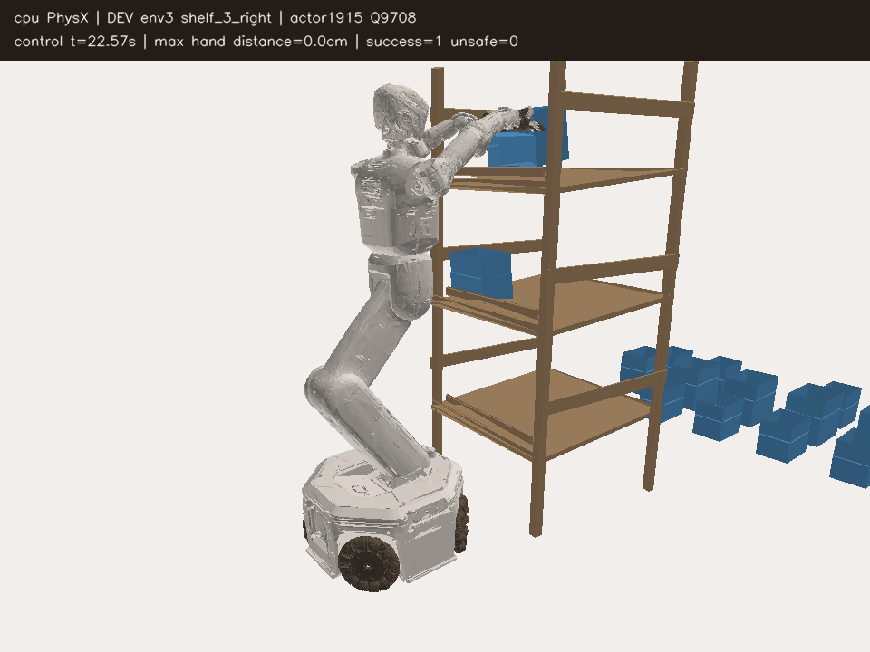
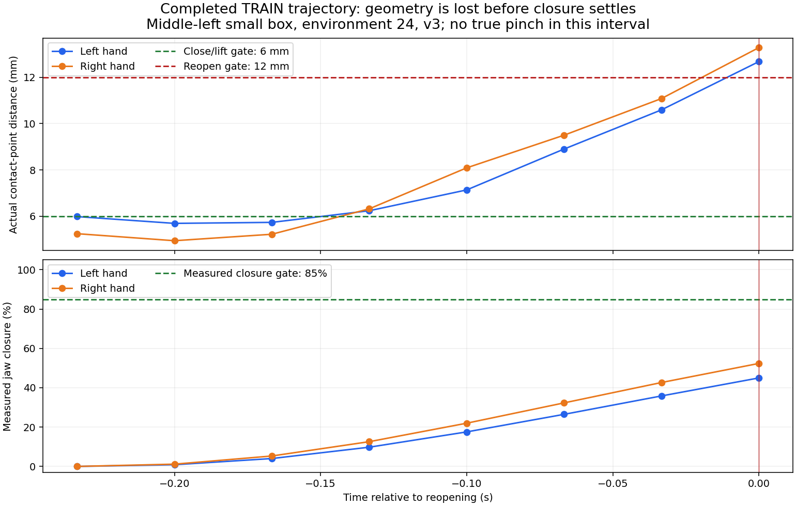

# SAC 양손 파지 진행 — 2026-10-09

목표는 박스와 base 시작 상태가 달라도 안전하게 양손 flap을 집고 유지하며
짧게 드는 **학습된 정책**이다. 현재 목표는 미달성이고 중형 박스 성공도0이다.
원래 위치·크기 여섯 조합의 전체128개 조건으로 비교한다.

**05:30 KST의 추가 수정:** 실제 상단 진입 실패를 토대로, 몸통 X/Z와 양팔을
함께 조절하는 v5를 구현했다. 진입 후 몸통 목표를 유지하고 실제 소프트웨어
상한을 넘는 목표를 제외한다. SAC 밀도·Q target·재개·영상 복원에도 연결했다.
73검사와 실제 초기 모델 저장/재개/복원은 통과했으며 아직 새 물리 성능의
결과는 아니다. GPU3의 앞선 비교가 정상 종료·최종 Drive 검증을 마친 뒤
메모리 여유를 재확인하고 별도 비교를 시작하는 CPU 대기 작업을 실제 등록했다.
05:40 KST에 PID4,047,308·빈 GPU mask를 확인했으며 새 학습은 아직 대기 중이다.
[문제·변경·설정·검증 범위](RL_V2_UPRIGHT_CONTACT_SAC_20261009.md).

## 최근 전체 평가

| 활성 비교 | 완료한 TRAIN 조건 | 자기 초기 → 학습 후 전체 성공/128 | 판단 |
|---|---:|---|---|
| 기존 uniform 팔 범위 | 2,688 | 14→8→4→1→3→2→1→4 | 초기보다 낮음 |
| 성공 명령 유지 보강 | 1,920 | 14→13→8→6→5→6 | 초기보다 낮음 |
| 전체 팔 범위·큰 탐색 | 1,536 | 11→10→7→8→5 | 초기보다 낮음 |
| 전체 팔 범위·작은 탐색 | 1,152 | 11→11→13→8 | 최고13 모델 보존; 최근 다시 감소 |
| 작은 탐색·강한 성공 유지 | 1,152 | 11→10→10→8 | 초기보다 낮음 |
| 관측 기반 연속 접촉 탐색 | 768 | 11→9→11 | 자기 초기 수준; 중형0 |
| 측정된 그리퍼 정착 후 들기 | TRAIN384 완료 | 11→7 | 초기보다 낮음; 첫 탐색0/25 |
| 현재 flap 추적·정밀 닫힘 | 첫 TRAIN128 완료·수집 지속 | 초기11 | 탐색0/25; 학습 후 전체 결과 대기 |
| 닫힘 위치·이동 추종 보강 v4 | 초기 평가 완료·TRAIN 시작 | 초기11 | TRAIN384 비교; 학습 후 성능 미확인 |
| 몸통 위치 조절·진입 후 유지 v5 | CPU 대기 실제 등록 | 초기/학습 후 결과 대기 | 기존 비교 종료·Drive 검증 뒤 GPU3 시작 |

작은 탐색의 첫 학습 후 결과는 성공11·안전 위반56·시간 초과61·초기 무효0이었다.
중간 왼쪽small7·상단 오른쪽small4, 나머지는0이다. 안전 위반은랙55·낙하1회다.
Actor702/Q4,856의 실제 평가 전후 모델과 optimizer1,014개 유한 tensor를
대조했다. 초기와 공통 유효115조건은11→10회로 안정적인 개선을 주장하지 않는다.
[전체 결과·같은 모델](assets/rl_v2_URDF_gentle_full_arm_first_learned_full_DEV4_20261008.json).

01:57 KST에 작은 탐색의 두 번째 학습 후 전체평가가 완료됐다. TRAIN768조건
뒤 성공13·안전 위반67·시간 초과48·초기 무효0/128이었다. 중간 왼쪽small5·
상단 오른쪽small8, 다른 네 조합은0이다. 초기와 공통 유효115조건은11→12회,
기존 성공 상실5·새 성공6회였다. 성공은 소폭 증가했지만 랙 충돌도66회로
많고 중형은0이므로 안정적인 일반화 개선으로 판단하지 않는다. Actor1,915/
Q9,708의 실제 평가 전후 같은 모델·optimizer1,028개 유한tensor를 대조하고
이 평가에 대응하는 모델을 별도로 보존했다.
[두 번째 전체 결과·같은 모델](assets/rl_v2_URDF_gentle_full_arm_second_learned_full_DEV8_20261008.json).

대표 영상은 위 평가의 **상단 오른쪽small 성공**이다. 초기 base는 횡방향
-1.5cm·밖으로8.2cm·yaw -3.2°가 적용됐고, 접근 후 양손 opposing 파지와
0.267초 유지·실제 들기·안전 조건을 통과했다. 종료 시 랙 지지면 여유는4.48cm다.
같은 요청의 자기 초기 평가는timeout이었지만 flap 추첨·접촉 이력까지 같다고
가정하지 않는다. 탐색 보조 없는 학습된 greedy 정책의 실제 측정 자세를
기록한 영상이며, 여섯 배치 전체의 일반화 성공을 뜻하지 않는다. 화면의
`Q9708`은Q 갱신 횟수이고Q-value가 아니다.

[재생 가능한 H264 영상](assets/rl_v2_gentle_DEV8_upper_right_learned_success_20261009.mp4) ·
[모델·base 변화·실제 성공·전체 재생 검증](assets/rl_v2_gentle_DEV8_upper_right_learned_success_verified_20261009.json).

전체 팔·큰 탐색은actor1,909/Q9,682의 전체128조건에서7회였다.
원래uniform은actor4,349/Q19,444에서3회였다. 각자의 초기 기준과 비교하며
실제 flap 추첨·접촉 이력까지 같은 반복이라고 가정하지 않는다.
[큰 탐색 전체 결과](assets/rl_v2_URDF_full_arm_second_learned_full_DEV8_20261008.json),
[uniform 전체 결과](assets/rl_v2_URDF_regional_goal_fourth_learned_full_DEV16_20261008.json).

01:54 KST의 큰 탐색 세 번째 전체평가는 TRAIN1,152조건 뒤 성공8·안전 위반71·
시간 초과49·초기 무효0/128이었다. Actor3,132/Q14,574의 평가 전후 같은 실제
모델을 확인했으며 자기 초기11회보다 낮다. 중간 왼쪽small4·상단 오른쪽small4,
중형과 다른 구역은0이다.
[세 번째 전체 결과](assets/rl_v2_URDF_full_arm_third_learned_full_DEV12_20261008.json).

강한 성공 유지 비교의 첫 학습 후 전체평가는10·안전 위반48·시간 초과70,
초기 무효0/128이었다. Actor695/Q4,828의 평가 전후 같은 실제 모델·optimizer
1,014개 유한tensor를 대조했다. 성공 명령 유지 보강의 세 번째 전체평가는
6·랙 충돌43·시간 초과79·초기 무효0/128이었다. Actor3,138/Q14,598의 같은
모델·optimizer1,098개 유한tensor를 대조했다. 두 비교 모두 중형은0이다.
[강한 유지 전체결과](assets/rl_v2_URDF_strong_gentle_full_arm_first_learned_full_DEV4_20261008.json),
[세 번째 보강 전체결과](assets/rl_v2_URDF_servo_guard_third_learned_full_DEV12_20261008.json).

01:40 KST의uniform 다섯 번째 전체 평가도성공2·랙 충돌61·시간 초과65,
초기 무효0/128이었다. Actor5,561/Q24,292의같은실제모델과optimizer를
확인했다. 더긴 학습의반등은 아직없다.
[다섯 번째 전체결과](assets/rl_v2_URDF_regional_goal_fifth_learned_full_DEV20_20261008.json).

02:07 KST의 이전 접촉 탐색 첫 학습 후 전체평가는 TRAIN384조건 뒤 성공9·
랙 충돌63·시간 초과56·초기 무효0/128이었다. Actor695/Q4,828의 평가 전후
같은 실제 모델·optimizer1,014개 유한tensor를 확인했다. 자기 초기11→9,
공통 유효115조건도11→9이며 중형은0이다. 탐색의 학습 효과는 확인되지 않았다.
[첫 학습 후 전체 결과](assets/rl_v2_URDF_perceived_contact_first_learned_full_DEV4_20261008.json).

02:56 KST에 강한 성공 유지의 두 번째 전체평가가 완료됐다. TRAIN768조건 뒤
성공10·안전 위반59·시간 초과59·초기 무효0/128이었다. 자기 초기11→10→10이며
공통 유효115조건은11→10이다. 02:39 KST의 성공 명령 유지 보강 네 번째 평가는
TRAIN1,536조건 뒤 성공5·안전 위반53·시간 초과70·초기 무효0/128이었다.
자기 초기14→13→8→6→5이고 공통 유효115조건은14→3이다. 실제 평가 전후
같은 모델과 optimizer 갱신 횟수를 대조했으며 두 비교 모두 중형은0이다.
[강한 유지 두 번째 전체 결과](assets/rl_v2_URDF_strong_gentle_full_arm_second_learned_full_DEV8_20261008.json),
[보강 네 번째 전체 결과](assets/rl_v2_URDF_servo_guard_fourth_learned_full_DEV16_20261008.json).

03:40 KST의 uniform 여섯 번째 전체평가는 TRAIN2,304조건 뒤 성공1·안전
위반46·시간 초과81·초기 무효0/128이었다. Actor6,784/Q29,184의 실제 평가
전후 같은 모델과 optimizer를 대조했다. 자기 초기14회보다 낮고 중형은0이다.
더 긴 수집만으로의 개선은 아직 확인되지 않았다.
[여섯 번째 전체 결과](assets/rl_v2_URDF_regional_goal_sixth_learned_full_DEV24_20261008.json).

03:55 KST의 작은 탐색 세 번째 전체평가는 TRAIN1,152조건 뒤 성공8·안전
위반62·시간 초과58·초기 무효0/128이었다. 자기 초기11→11→13→8이고 공통
유효115조건은11→8이다. 최고13회 모델은 계속 보존하지만 반등이 유지되지
않았다. 03:53 KST의 큰 탐색 네 번째 전체평가는 TRAIN1,536 뒤 성공5·안전
위반73·시간 초과50·초기 무효0/128이었다. Actor/Q는 각각3,139/14,602와
4,351/19,450이며 실제 평가 전후 같은 모델과 optimizer를 대조했다.
두 비교 모두 중형은0이다. 장기 수집과 새 실제 접촉 제어 비교를 계속한다.
[작은 탐색 세 번째 결과](assets/rl_v2_URDF_gentle_full_arm_third_learned_full_DEV12_20261008.json),
[큰 탐색 네 번째 결과](assets/rl_v2_URDF_full_arm_fourth_learned_full_DEV16_20261008.json).

원본 장기 비교는TRAIN3,072를 정상 종료했고 마지막5/128이었다.
최종 checkpoint와 닫힌 로그의Drive 검증까지 끝났지만 목표 달성은 아니다.

04:00 KST에 닫힘 정착 v2의 첫 학습 후 전체평가가 완료됐다. TRAIN384조건
뒤 성공7·안전 위반62·시간 초과59·초기 무효0/128이었다. Actor696/Q4,830의
실제 평가 전후 같은 모델을 대조했으며 자기 초기11회보다 낮다. 기존 버전은
장기 수집을 계속하고, 새 v3의 현재 flap 추적·정밀 닫힘 효과를 별도로 확인한다.
[정착 v2 첫 학습 후 전체 결과](assets/rl_v2_URDF_settled_contact_first_learned_full_DEV4_20261009.json).

04:01 KST의 이전 접촉 탐색 v1 두 번째 전체평가는 TRAIN768조건 뒤 성공11·
안전 위반44·시간 초과73·초기 무효0/128이었다. Actor1,908/Q9,680의 실제
평가 전후 같은 모델을 대조했다. 자기 초기11→9→11로 회복했으나 초기보다
높지는 않고 중형은0이다. 탐색 보조 없는 학습 후 평가다.
[접촉 v1 두 번째 전체 결과](assets/rl_v2_URDF_perceived_contact_second_learned_full_DEV8_20261008.json).

## 지금 적용하는 방법

GPU3 여섯 실행과GPU0·GPU1·GPU2 각 한 실행, 총 아홉 SAC writer를 유지한다. GPU2 실행은 기존20% 탐색
episode에 측정 관절·flap 관측으로 랙 앞 진입, 표면 접근/축 정렬, 닫힘 유지,
25mm 들기 시도를 연결한다. 접촉이나 성공 판정을 탐색 입력으로 쓰지 않는다.
기존 jaw gate와 PD 제한, 원래 박스/base/flap 무작위화·보상·성공·안전 기준을
유지한다. 실제 명령/환경 보상으로SAC를 학습하고 전체 평가는 보조 없는
greedy 정책으로 한다. [구현·검사·실제 실행·방법 그림](RL_V2_PERCEIVED_CONTACT_SAC_20261008.md).

장기 일곱 실행은TRAIN6,144·replay200만·65배치를 끝까지 진행하며384 TRAIN조건마다
같은 전체128개 요청을 평가한다. 초기 기준만으로 개선을 주장하지 않고,
TRAIN 탐색의 성공도 학습된 greedy 정책의 일반화 성공과 따로 확인한다.
첫 실제TRAIN128은성공9·안전 위반42·시간 초과77이었다. 접촉 탐색 선택25조건은
성공0회이므로 효과를 주장하지 않는다. 완료된 수집 replay의 실제 손·그리퍼·
접촉 경로를 분석해 수정할 부분을 결정한다. Q와actor 업데이트는 실제 실행에서
진행 중이며 독립FINAL은 아직 사용하지 않았다.

완료된 첫 두 TRAIN 배치159,438행에서 들기16회 모두 시작 전/직후 양손 파지가
없었다. 실제 닫힘 비율 중앙값은좌45.1%·우52.5%였다. 닫힘 명령만으로 너무
빨리 들기 전환을 한 것을 확인해 `full-arm-settled-contact` 비교를 추가했다.
최소24틱 닫힘·측정된 닫힘85% 이상·6틱 정착·현재 접촉 지점6mm를 확인하고
들기를 시도한다. 닫을 때 접촉 목표를랙 좌표에 고정하고 실제 접촉/성공 정보를
탐색 입력으로 쓰지 않는다. 원래 성공 기준은 그대로다.
[완료 수집의 실제 타이밍 분석·그림·수정](RL_V2_PERCEIVED_CONTACT_SAC_20261008.md).

같은 완료 replay를 단계별로 재계산하면 상단 탐색20경로 모두 표면 접근
단계에 들어가지 못했다. 반면 중간 위치27경로는 모두 표면 접근을 시작했다.
랙 앞 준비 단계의 양손 닫힘 명령은0행이고 한 손 닫힘도11행뿐이어서,
접근 전 조기 닫힘을 주된 실패 원인으로 단정하지 않는다. 상단 진입의 거리·
축 정렬을 따로 점검해야 한다. 수정 버전은 탐색 지속 시간을180→360틱으로
늘렸고, 그 효과는 실제 수집·학습 후 평가로 확인한다.
[완료 TRAIN 단계 분석](assets/rl_v2_perceived_contact_completed_TRAIN_phase_analysis_20261009.json).

01:30 KST에새 GPU0 writer353905의 실제 초기DEV 진입·743개 고정 소스·
원래 여섯 조합/6,144 TRAIN/128 DEV/65배치·중력보상18관절·첫Drive 검증을
확인했다. `CUDA_VISIBLE_DEVICES=0`, Kit단일GPU0, 메모리17,570MiB다.
현재일곱 writer가 살아 있고 기존 여섯 비교와 다른 사용자 작업은 유지한다.
02:06 KST에 새 수정의 전체 초기평가가 끝나 성공11·안전 위반48·시간 초과56·
초기 무효13/128이었다. 실제 저장 모델/정규화75개가 준비한 초기 모델과 같고
전체257개tensor가 유한했다. Actor/Q 갱신0인 자기 초기 기준이며 새 학습의
개선을 뜻하지 않는다. 첫TRAIN 수집과Q 갱신을 시작했고 학습 후greedy 결과는
아직 대기 중이다.
[실제 시작·계약·백업](assets/rl_v2_URDF_settled_contact_SAC_actual_startup_20261009.json).
[전체 초기 결과·같은 모델](assets/rl_v2_URDF_settled_contact_first_full_DEV_20261009.json).

02:31 KST에 수정 버전의 첫 실제TRAIN128이 완료됐다. 성공10·안전 위반39·
시간 초과79·초기 무효/수치 실패0회다. Greedy103조건이10회 성공했고 탐색
선택25조건은0회였다. 닫힘 명령1,815행을 실행했지만 들기 전환은0회였다.
너무 이른 들기는 막았으나 실제 파지 성공 증가를 확인하지 못했다. 완료된
TRAIN의 읽기 전용 복사본에서 측정 닫힘·정착·고정/현재 목표 거리 조건을
구분해 다음 수정의 근거를 확인한다. 기존 일곱 학습은 계속하며 원래 기준을
유지한다.
[첫 완료 TRAIN·실제 모델](assets/rl_v2_settled_contact_first_TRAIN_actual_20261009.json).

## 현재 flap 추적 비교의 실제 시작

닫기 정착 v2의 완료 TRAIN을 재계산한 결과, 닫기를 시도한8경로는 이미
측정 닫힘85%·24틱 닫기·6틱 정착을 충족했다. 하지만 양손 현재 접촉점까지
최소 거리는11.77–13.50mm인 반면, 옛 랙 고정 목표에는0.16–2.62mm까지
접근했다. flap이 움직인 뒤 옛 지점에서 빈 파지를 한 것이다. 탐색25조건의
실제 양손 opposing pinch는0회였으며, 상단11조건은표면 접근 단계에도
도달하지 못했다. CPU/CUDA 재계산의 최대 FK float 차이1.86e-8m는
별도 허용오차1e-7m로 기록하며 정수 통계와 실행 명령을 별도로 대조했다.
[실제 닫힘 조건과 실패 근거](assets/rl_v2_settled_contact_completed_TRAIN_gate_analysis_20261009.json).

v3는 선택된 TRAIN20%에서 현재 flap 자세를 추적하고 양손 거리6mm·축 정렬
0.25rad 이내일 때 닫는다. 닫은 뒤 거리가12mm 또는 축 오차0.30rad를
넘으면 열고 재접근하며, 들기 전까지 축 정렬을 계속한다. 기존24틱·85%·6틱
정착·현재점6mm 들기 조건과 원래 무작위화·보상·성공·안전 기준은 유지한다.
관련59검사와 초기 모델 저장·학습 재개·영상 모델 복원이 통과했다.

03:22 KST에 GPU3 writer1,807,053의 실제 초기 평가 진행, `CUDA_VISIBLE_DEVICES=3`,
Kit단일GPU3, 고정 소스744개, 중력보상18관절, 메모리2,791MiB와 기존Drive의
03:20 업로드·검증을 확인했다. TRAIN384·초기/학습 후DEV각128·replay25만의
작은 비교이며, 나머지 일곱 장기 실행의 TRAIN6,144·replay200만 설정은 그대로다.
원래 첫 다섯 배치와 각 배치 여섯 위치/크기 조합을 유지했다. 전체평가에는
접촉 보조를 사용하지 않는다. 실제 평가 모델 보존·초기 전체 결과·첫 TRAIN·
학습 후 전체 결과를 읽는 CPU 관찰 작업 네 개도 시작했다. 새 물리 성능,
중형/상단 개선, 독립FINAL 성공은 아직 확인하지 않았다.
[실제 시작과 백업](assets/rl_v2_URDF_precise_feedback_SAC_actual_startup_20261009.json),
[실제 CPU 관찰 작업](assets/rl_v2_URDF_precise_feedback_actual_CPU_observers_20261009.json),
[여덟 writer 실제 상태](assets/rl_v2_eight_SAC_actual_status_20261009.json).

03:52 KST에 v3의 전체 초기평가가 완료돼 성공11·안전 위반48·시간 초과56·
초기 무효13/128이었다. 실제 모델/정규화75개가 준비한 초기 모델과 같고
257개 tensor는 유한했다. Actor/Q0인 초기 기준이다. 이후 실제 TRAIN 수집과
Q 갱신을 확인했다. 선택된 경로의 접촉과 학습 후 greedy 전체평가는 대기 중이다.
[실제 초기 전체결과·같은 모델](assets/rl_v2_URDF_precise_feedback_first_full_DEV_20261009.json).

## 실제 보상의 성공·실패 순서

완료된 v2 첫 TRAIN128의 실제 보상과 종료 mask를 대조했다. 보상 shaping과
Q의 discount는 같은0.999이며 timeout도 Q에서 absorbing terminal이었다.
Held 구간 시작의 할인 return 중앙값은 성공10경로가5.95, timeout79경로가
−1.19, unsafe39경로가−5.04였다. 이 수집에서는 timeout이 성공보다 유리한
순서가 관측되지 않았다. 이는 서로 다른 실제 경로의 비교이며 같은 상태에서
동작을 바꾼 인과 비교나 다른 보상 결함이 없다는 증거는 아니다.
보상은 유지하고 안전 접근·축 정렬·실제 접촉 경험과 학습 후 평가를 계속 확인한다.
[실제 return·discount·종료 mask 대조](assets/rl_v2_completed_TRAIN_actual_returns_20261009.json).

## 장기 실행 저장 공간

종료된 우리 원본/이전 장기 실험612개 파일·31.153GiB를 디스크의
`artifacts/rl/closed_local_runs/`에 보관했다. 양쪽 모든 파일SHA256과
writer/supervisor 종료·exit0·기존 최종Drive 검증을 확인하고 원래 디렉터리
경로를 보관 위치에 연결했다. RawHDF·replay·checkpoint·영상·로그 모두 남아
있다. 데이터 총량을 보존하는 저장 위치 이동이며 활성 학습 입력은 그대로다.
00:04 KST의root 여유는약122.3GiB, `/dev/shm` 여유는약211.3GiB였다.
활성 작업으로 이후 크기는 변할 수 있다.
[원본 이동 검증](assets/rl_v2_closed_original_all6_disk_relocation_20261008.json),
[이전 장기 실행 이동 검증](assets/rl_v2_closed_tail19_disk_relocation_20261009.json).

기존Drive 연결로300초 업로드·크기/MD5 검증·오래된 검증 checkpoint 정리와
최근2개 보호를 유지한다. 현재 rawHDF/replay는 로컬 보관 범위이며 자동
삭제되지 않는다. 종료 로그는writer가 멈춘 뒤 검증한다.

## 첫 정밀 추적 수집 이후의 수정

04:17 KST의v3 첫TRAIN128은성공10·안전 위반47·시간 초과71회였다.
탐색25조건은실제파지/성공0회, greedy103조건은10회다. 닫기를시도한8경로에서
11번모두6–7틱 후12mm 거리조건으로다시열렸고 실제닫힘은35.8–52.4%였다.
축오차초과는0회이며최근접패널점도6mm 밖이었다. 관측점선택을바꾸는것만으로
해소되지않는다. 완료81,115행의명령·128종료·정수통계를대조했고, 손과flap의
움직임을랙좌표에서분리했다. 닫힘동안손이법선방향5–9mm 밀려나는사례가있어
위치추종보강을다음시험으로선택했다. finger–flap 힘0은다른부위의접촉부재를
뜻하지않으며접촉반동/drive오차의원인을확정하지않는다.

별도v4는닫힘위치피드백2→8/s와현재flap이동량50%·틱당최대2mm 보강을쓴다.
열린접근/들기는기존속도이며모든닫기·정착·성공·안전기준을유지한다.
66검사와실제모델저장/재개/평가복원을통과했으며원래첫5배치TRAIN384·
초기/최종전체DEV128·replay25만으로비교한다. 기존장기수집은계속유지한다.
상단진입정렬과중형안전접근은아직미해결이고독립FINAL은사용하지않았다.
[실제경로와수정·선택방법](RL_V2_PERCEIVED_CONTACT_SAC_20261008.md) ·
[첫TRAIN의실제동작분석](assets/rl_v2_precise_feedback_completed_TRAIN_motion_analysis_20261009.json).

04:50 KST에새v4의실제초기전체평가·writer3,191,064·고정소스745개·
`CUDA_VISIBLE_DEVICES=3`·Kit단일GPU3·중력보상18관절·메모리2,791MiB와
첫Drive 검증04:49:56을대조했다. 기존8개실행을유지한총9개writer다.
아직actor/Q0이며TRAIN384 뒤평가효과는대기중이다. 시작기록작성오류는기존
서비스/PID를대조해기록만복구했고중복실행/프로세스신호는없었다.
[실제시작·첫검증](assets/rl_v2_URDF_motion_feedback_SAC_actual_startup_20261009.json).

04:42 KST의성공명령유지보강다섯번째전체평가는TRAIN1,920조건뒤
성공6·안전위반43·시간초과79·초기무효0/128이었다. Actor5,563/Q24,298의
실제평가전후모델/optimizer를대조했다. 자기초기14→13→8→6→5→6이며
공통유효115조건은14→5다. 중형은여전히0이므로개선으로보지않는다.
[다섯번째전체결과](assets/rl_v2_URDF_servo_guard_fifth_learned_full_DEV20_20261008.json).

04:56 KST의강한성공유지세번째전체평가는TRAIN1,152조건뒤성공8·안전
위반64·시간초과56·초기무효0/128이었다. Actor3,138/Q14,600의실제평가
전후같은모델/optimizer를대조했다. 자기초기11→10→10→8, 공통유효115조건은
11→8이며중형0이다. 초기성공수준을넘지못해장기수집과접촉추종수정을계속한다.
[강한유지세번째전체결과](assets/rl_v2_URDF_strong_gentle_full_arm_third_learned_full_DEV12_20261008.json).

05:30 KST에 v4의 전체 초기평가가 끝나 성공11·안전 위반48·시간 초과56·
초기 무효13/128이었다. 실제 초기 저장 모델/정규화와 검증한 준비 모델이
같았으며 actor/Q0인 초기 기준이다. 이후 실제 TRAIN을 시작했지만 학습 후
greedy 전체 평가의 개선은 아직 확인 전이다.
[v4 전체 초기 결과·같은 모델](assets/rl_v2_URDF_motion_feedback_first_full_DEV_20261009.json).

05:46 KST의 uniform 일곱 번째 전체평가는 TRAIN2,688 뒤 성공4·안전 위반65·
시간 초과59·초기 무효0/128이었다. 모두 상단 오른쪽small이며 중형과 다른
다섯 조합은0이다. 자기 초기14회보다 낮고 공통 유효115조건은14→3이다.
Actor7,999/Q34,044의 실제 평가 전후 같은 모델/optimizer와 고정 소스를
대조했다. 단순한 장기 학습의 개선으로 해석하지 않는다.
[일곱 번째 전체 결과·같은 모델](assets/rl_v2_URDF_regional_goal_seventh_learned_full_DEV28_20261008.json).

## 추가로 확인한 접촉 지점 후보

검증된 완료 v3 TRAIN에서 성공10경로의 첫 양손 파지, 탐색8경로의 첫 닫힘
명령, 중형 탐색6경로의 가장 가까운 상태를 비교했다. 실패한 탐색에서도
손목→TCP는 랙 안쪽을 향했으므로 반대 접근 방향이 주원인이라는 근거는
약하다. 첫 닫힘 명령에서 TCP의 flap 옆 모서리 여유 중앙값은 좌0.57mm·
우1.48mm였고, 성공 경로의 첫 실제 양손 파지는 좌18.26mm·우54.48mm였다.
왼손의 다른 접선축 여유도 실패 시1.90mm, 성공 시47.35mm였다.

이는 nominal closed TCP의 기하이며 실제 pad 접촉 위치 측정은 아니다.
닫기 시작과 실제 파지는 서로 다른 단계이므로 인과 효과를 확정하지 않는다.
기존 5mm 안쪽 목표와 6mm 닫기 허용 오차로 모서리에 가까운 닫힘이 가능해,
다음 후보는 접선 방향의 목표 여유를20mm로 늘리는 별도 비교다. 아직 코드나
물리 시험에 적용하지 않았으며, v4의 실제 닫힘 추종과 v5의 몸통 유지 결과를
확인하면서 결정한다. 무작위화·안전/성공 기준을 바꾸는 후보가 아니다.
[실제24경로·지점과 방향 측정·분석 범위](assets/rl_v2_actual_completed_TRAIN_panel_margins_20261009.json).

Notion에도 v5 방법 그림과 실제 CPU 대기/검증을 기록했다. 기존 영상·그림
76개가 모두 남고 새 그림을 포함한77개와 native table5개를 재확인했다.
[미디어·표 보존 검증](assets/rl_v2_upright_contact_Notion_verified_20261009.json).
